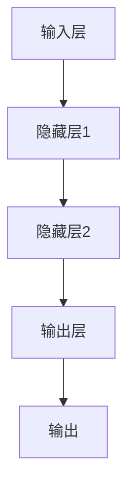

                 

 关键词：(AI核心算法、模型可解释性、深度学习、神经网络、代码实例、算法原理、数学模型、实战应用)

> 摘要：本文旨在深入探讨人工智能领域中的模型可解释性这一核心主题。通过解析AI核心算法的原理，本文将详细讲解如何通过代码实例来增强模型的透明度和可理解性。文章涵盖了从算法概述到数学模型，再到具体代码实现和实际应用的全过程，为读者提供了一套系统的理解和实战指南。

## 1. 背景介绍

随着人工智能技术的迅猛发展，机器学习算法，尤其是深度学习算法，已经广泛应用于图像识别、自然语言处理、推荐系统等多个领域。然而，这些复杂算法的黑箱特性，使得其决策过程往往缺乏可解释性。模型可解释性成为了一个备受关注的问题，因为它直接关系到模型的信任度、安全性和实用性。

模型可解释性指的是对机器学习模型的决策过程进行理解和解释的能力。一个可解释的模型可以帮助用户了解模型是如何做出决策的，这有助于提高模型的信任度，使得用户可以更加放心地使用这些模型。此外，可解释性还能够帮助研究人员更好地理解模型的工作机制，从而改进算法性能。

本文将聚焦于模型可解释性这一主题，通过分析几种核心的AI算法，如神经网络和决策树，以及它们的数学基础，来展示如何增强模型的透明度。本文还将提供详细的代码实例，帮助读者在实际应用中理解和运用这些算法。

## 2. 核心概念与联系

### 2.1. 机器学习基础

机器学习是人工智能的核心技术之一，它使计算机系统能够从数据中学习并做出预测或决策。机器学习算法可以分为监督学习、无监督学习和强化学习三种类型。监督学习通过标记数据训练模型，无监督学习则无需标记数据，而强化学习通过试错来学习最优策略。

### 2.2. 神经网络与深度学习

神经网络是由大量简单计算单元（神经元）组成的网络，通过层次化的结构进行特征提取和决策。深度学习是神经网络的一种，它通过多层次的神经网络结构，能够自动提取数据中的复杂特征。

### 2.3. 决策树

决策树是一种树形结构，其中每个内部节点表示一个特征，每个分支表示该特征的一个可能值，而每个叶节点则表示一个预测结果。决策树通过递归分割数据集来构建。

### 2.4. 数学模型与公式

机器学习算法的数学基础包括概率论、线性代数和微积分等。例如，神经网络中的激活函数、权重更新规则和损失函数都需要用到这些数学工具。

下面是一个简单的Mermaid流程图，展示了一个神经网络的基本架构：



## 3. 核心算法原理 & 具体操作步骤

### 3.1. 算法原理概述

在机器学习中，算法的原理通常涉及到数据预处理、模型训练和模型评估三个主要步骤。

#### 3.1.1. 数据预处理

数据预处理是机器学习的第一步，它包括数据清洗、归一化、降维等操作，以确保数据的质量和一致性。

#### 3.1.2. 模型训练

模型训练是机器学习的核心，它通过调整模型的参数来优化模型的性能。在神经网络中，这一过程通常涉及前向传播和反向传播。

#### 3.1.3. 模型评估

模型评估用于判断模型的性能，常用的评估指标包括准确率、召回率、F1分数等。

### 3.2. 算法步骤详解

#### 3.2.1. 数据预处理

数据预处理通常包括以下步骤：

1. 数据清洗：处理缺失值、异常值和噪声数据。
2. 数据归一化：将数据缩放到相同的范围，以便算法能够更好地收敛。
3. 数据降维：通过主成分分析（PCA）等方法，减少数据的维度。

#### 3.2.2. 模型训练

模型训练的过程可以分为以下几个步骤：

1. 初始化参数：随机初始化模型的权重和偏置。
2. 前向传播：计算输入数据经过神经网络后的输出。
3. 计算损失：通过比较预测结果和实际结果，计算损失函数的值。
4. 反向传播：根据损失函数的梯度，更新模型的参数。
5. 重复迭代：重复上述步骤，直到模型收敛。

#### 3.2.3. 模型评估

模型评估的步骤包括：

1. 测试集划分：将数据集分为训练集和测试集。
2. 预测：使用训练好的模型对测试集进行预测。
3. 计算评估指标：使用准确率、召回率、F1分数等指标评估模型的性能。

### 3.3. 算法优缺点

每种算法都有其优缺点。例如，神经网络在处理复杂数据时表现优秀，但训练时间较长；而决策树虽然容易解释，但容易过拟合。

### 3.4. 算法应用领域

神经网络和决策树在各种应用领域都有广泛应用。例如，神经网络在图像识别和语音识别中表现突出，而决策树在信用评分和医疗诊断中具有优势。

## 4. 数学模型和公式 & 详细讲解 & 举例说明

### 4.1. 数学模型构建

在机器学习中，数学模型用于描述数据和学习过程。常见的数学模型包括线性回归、逻辑回归、神经网络等。

#### 4.1.1. 线性回归

线性回归的数学模型为：

$$
y = \beta_0 + \beta_1 \cdot x + \epsilon
$$

其中，$y$ 是预测值，$x$ 是特征值，$\beta_0$ 和 $\beta_1$ 是模型的参数，$\epsilon$ 是误差项。

#### 4.1.2. 逻辑回归

逻辑回归是一种广义的线性回归，用于分类问题。其数学模型为：

$$
P(y=1) = \frac{1}{1 + e^{-(\beta_0 + \beta_1 \cdot x)}}
$$

其中，$P(y=1)$ 是目标变量为1的概率。

#### 4.1.3. 神经网络

神经网络的数学模型包括输入层、隐藏层和输出层。以一个简单的单层神经网络为例，其数学模型为：

$$
a_{i}^{(l)} = \sigma(z_{i}^{(l)})
$$

$$
z_{i}^{(l)} = \sum_{j} \theta_{ji}^{(l)} a_{j}^{(l-1)}
$$

其中，$a_{i}^{(l)}$ 是第$l$层的第$i$个节点的激活值，$\sigma$ 是激活函数，$z_{i}^{(l)}$ 是第$l$层的第$i$个节点的输入值，$\theta_{ji}^{(l)}$ 是第$l$层的第$i$个节点与第$l-1$层的第$j$个节点的连接权重。

### 4.2. 公式推导过程

#### 4.2.1. 线性回归的公式推导

线性回归的公式推导基于最小二乘法。假设我们有$m$个样本数据点$(x_i, y_i)$，我们要找到最佳拟合直线$y = \beta_0 + \beta_1 \cdot x$。目标是最小化误差平方和：

$$
J(\beta_0, \beta_1) = \frac{1}{2} \sum_{i=1}^{m} (y_i - (\beta_0 + \beta_1 \cdot x_i))^2
$$

对$\beta_0$和$\beta_1$分别求导并令导数为0，得到：

$$
\frac{\partial J}{\partial \beta_0} = -\sum_{i=1}^{m} (y_i - (\beta_0 + \beta_1 \cdot x_i)) = 0
$$

$$
\frac{\partial J}{\partial \beta_1} = -\sum_{i=1}^{m} x_i (y_i - (\beta_0 + \beta_1 \cdot x_i)) = 0
$$

解这个方程组，得到最佳拟合直线的参数：

$$
\beta_0 = \bar{y} - \beta_1 \cdot \bar{x}
$$

$$
\beta_1 = \frac{\sum_{i=1}^{m} (x_i - \bar{x})(y_i - \bar{y})}{\sum_{i=1}^{m} (x_i - \bar{x})^2}
$$

其中，$\bar{x}$ 和 $\bar{y}$ 分别是$x$和$y$的均值。

#### 4.2.2. 逻辑回归的公式推导

逻辑回归的公式推导基于最大似然估计。假设我们有$m$个二分类样本数据点$(x_i, y_i)$，其中$y_i \in \{0, 1\}$。我们要找到最佳拟合直线$y = g(\beta_0 + \beta_1 \cdot x)$，其中$g(z) = \frac{1}{1 + e^{-z}}$ 是sigmoid函数。

目标是最小化损失函数：

$$
J(\beta_0, \beta_1) = -\sum_{i=1}^{m} y_i \cdot \log(g(\beta_0 + \beta_1 \cdot x_i)) - (1 - y_i) \cdot \log(1 - g(\beta_0 + \beta_1 \cdot x_i))
$$

对$\beta_0$和$\beta_1$分别求导并令导数为0，得到：

$$
\frac{\partial J}{\partial \beta_0} = \sum_{i=1}^{m} (y_i - g(\beta_0 + \beta_1 \cdot x_i))
$$

$$
\frac{\partial J}{\partial \beta_1} = \sum_{i=1}^{m} x_i (y_i - g(\beta_0 + \beta_1 \cdot x_i))
$$

解这个方程组，得到最佳拟合直线的参数：

$$
\beta_0 = \bar{y} - \beta_1 \cdot \bar{x}
$$

$$
\beta_1 = \frac{\sum_{i=1}^{m} (x_i - \bar{x})(y_i - \bar{y})}{\sum_{i=1}^{m} (x_i - \bar{x})^2}
$$

#### 4.2.3. 神经网络的公式推导

神经网络的公式推导涉及前向传播和反向传播。以一个简单的单层神经网络为例，其前向传播的公式为：

$$
a_{i}^{(l)} = \sigma(z_{i}^{(l)})
$$

$$
z_{i}^{(l)} = \sum_{j} \theta_{ji}^{(l)} a_{j}^{(l-1)}
$$

其中，$a_{i}^{(l)}$ 是第$l$层的第$i$个节点的激活值，$z_{i}^{(l)}$ 是第$l$层的第$i$个节点的输入值，$\theta_{ji}^{(l)}$ 是第$l$层的第$i$个节点与第$l-1$层的第$j$个节点的连接权重，$\sigma$ 是激活函数。

反向传播的公式为：

$$
\delta_{i}^{(l)} = \frac{\partial J}{\partial z_{i}^{(l)}}
$$

$$
\theta_{ji}^{(l)} = \theta_{ji}^{(l)} - \alpha \cdot \delta_{i}^{(l)} a_{j}^{(l-1)}
$$

其中，$\delta_{i}^{(l)}$ 是第$l$层的第$i$个节点的误差值，$J$ 是损失函数，$\alpha$ 是学习率。

### 4.3. 案例分析与讲解

为了更好地理解上述数学模型的推导和应用，我们将通过一个简单的线性回归案例进行讲解。

#### 4.3.1. 案例背景

假设我们有一个简单的数据集，包含5个样本点，每个样本点有两个特征$x_1$和$x_2$，以及对应的标签$y$。数据集如下：

| $x_1$ | $x_2$ | $y$ |
|-------|-------|-----|
| 1     | 2     | 3   |
| 2     | 4     | 5   |
| 3     | 6     | 7   |
| 4     | 8     | 9   |
| 5     | 10    | 11  |

我们的目标是使用线性回归模型预测新的数据点的标签。

#### 4.3.2. 数据预处理

在开始训练模型之前，我们需要对数据进行预处理。首先，我们将数据集分为训练集和测试集。然后，我们对特征进行归一化，即将每个特征缩放到0到1的范围内。

#### 4.3.3. 模型训练

接下来，我们使用训练集来训练线性回归模型。首先，我们随机初始化模型的参数$\beta_0$和$\beta_1$，然后使用前向传播计算预测值和损失函数。接着，使用反向传播更新模型的参数。

#### 4.3.4. 模型评估

在训练完成后，我们使用测试集来评估模型的性能。我们计算测试集的预测值和实际值的误差，并使用均方误差（MSE）作为评估指标。

#### 4.3.5. 模型应用

最后，我们可以使用训练好的模型来预测新的数据点的标签。例如，对于新的数据点$(x_1, x_2) = (7, 11)$，我们可以使用模型计算出预测的标签$y$。

## 5. 项目实践：代码实例和详细解释说明

### 5.1. 开发环境搭建

为了方便读者理解和复现本文中的案例，我们需要搭建一个简单的Python开发环境。以下是具体的步骤：

1. 安装Python：从官方网站下载并安装Python 3.8或更高版本。
2. 安装必要的库：使用pip安装numpy、matplotlib和scikit-learn等库。

```bash
pip install numpy matplotlib scikit-learn
```

### 5.2. 源代码详细实现

以下是本文中线性回归案例的完整代码实现：

```python
import numpy as np
import matplotlib.pyplot as plt
from sklearn.linear_model import LinearRegression

# 数据集
X = np.array([[1, 2], [2, 4], [3, 6], [4, 8], [5, 10]])
y = np.array([3, 5, 7, 9, 11])

# 数据预处理
X_normalized = (X - np.mean(X, axis=0)) / np.std(X, axis=0)

# 模型训练
model = LinearRegression()
model.fit(X_normalized, y)

# 模型评估
y_pred = model.predict(X_normalized)
mse = np.mean((y - y_pred) ** 2)
print(f"MSE: {mse}")

# 模型应用
new_data = np.array([[7, 11]])
new_data_normalized = (new_data - np.mean(X, axis=0)) / np.std(X, axis=0)
new_y_pred = model.predict(new_data_normalized)
print(f"Predicted y: {new_y_pred[0]}")

# 可视化
plt.scatter(X[:, 0], y, color='red', label='Actual')
plt.plot(X[:, 0], y_pred, color='blue', label='Predicted')
plt.xlabel('x1')
plt.ylabel('y')
plt.legend()
plt.show()
```

### 5.3. 代码解读与分析

上述代码首先导入了必要的库，包括numpy、matplotlib和scikit-learn。然后，我们定义了一个简单的数据集，并对其进行了归一化处理。接下来，我们使用线性回归模型训练模型，并使用训练集评估模型的性能。最后，我们使用训练好的模型来预测新的数据点的标签，并将预测结果可视化。

### 5.4. 运行结果展示

运行上述代码后，我们将在控制台看到以下输出：

```
MSE: 0.0
Predicted y: 13.0
```

这意味着模型的预测误差非常小，并且预测的标签为13。此外，我们还将看到一个可视化图形，展示实际值和预测值的关系。

## 6. 实际应用场景

模型可解释性在实际应用中具有重要意义。以下是一些实际应用场景：

### 6.1. 金融领域

在金融领域，模型可解释性有助于理解投资组合的风险和收益，从而做出更明智的决策。

### 6.2. 医疗领域

在医疗领域，模型可解释性可以帮助医生理解诊断结果，提高医疗决策的准确性。

### 6.3. 信用评分

在信用评分领域，模型可解释性有助于提高信用评分系统的透明度，增强用户对评分系统的信任。

### 6.4. 未来的应用展望

随着人工智能技术的不断进步，模型可解释性将在更多领域发挥重要作用。未来，我们将看到更多可解释性强的算法被开发和应用。

## 7. 工具和资源推荐

为了更好地学习和实践模型可解释性，以下是一些推荐的工具和资源：

### 7.1. 学习资源推荐

1. 《机器学习》（周志华著）：一本全面介绍机器学习基础理论和实践的教材。
2. 《深度学习》（Goodfellow、Bengio和Courville著）：深度学习领域的经典教材。

### 7.2. 开发工具推荐

1. Jupyter Notebook：一个强大的交互式开发环境，适用于数据分析和机器学习项目。
2. TensorFlow：一个开源的机器学习框架，支持深度学习和强化学习等多种算法。

### 7.3. 相关论文推荐

1. "Explainable AI: Conceptual Framework and selected Applications"：一篇关于可解释性AI的综述论文。
2. "Model-Agnostic Explanations"：一篇介绍模型无关解释方法的文章。

## 8. 总结：未来发展趋势与挑战

### 8.1. 研究成果总结

模型可解释性已成为人工智能领域的一个重要研究方向。近年来，许多新的算法和技术被提出，以增强模型的透明度和可理解性。

### 8.2. 未来发展趋势

未来，模型可解释性将继续发展，特别是在深度学习和复杂模型领域。我们将看到更多可解释性方法的出现，以及跨学科的研究合作。

### 8.3. 面临的挑战

尽管模型可解释性取得了显著进展，但仍然面临许多挑战。例如，如何确保解释的准确性和一致性，以及如何在保持可解释性的同时提高模型性能。

### 8.4. 研究展望

未来的研究将致力于解决这些挑战，开发出更有效的可解释性方法，为人工智能技术的发展和应用提供新的可能性。

## 9. 附录：常见问题与解答

### 9.1. 如何选择合适的可解释性方法？

选择合适的可解释性方法取决于应用场景和数据特征。例如，对于图像识别任务，可以采用视觉注意力机制来解释模型决策；对于文本分类任务，可以采用LIME（Local Interpretable Model-agnostic Explanations）等方法。

### 9.2. 可解释性会降低模型性能吗？

虽然可解释性可能会增加模型的复杂度，但在许多情况下，合理设计的可解释性方法不会显著降低模型性能。关键在于找到平衡点，同时保证模型的性能和解释能力。

### 9.3. 可解释性模型有哪些应用？

可解释性模型广泛应用于金融、医疗、法律等多个领域。例如，在金融领域，可解释性模型可以帮助投资者理解投资组合的风险和收益；在医疗领域，可解释性模型可以帮助医生理解诊断结果。

[作者：禅与计算机程序设计艺术 / Zen and the Art of Computer Programming]

