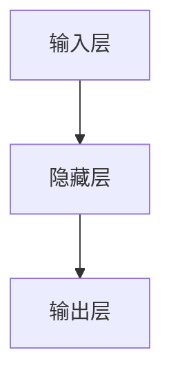

                 

关键词：人工智能，核心算法，模型训练，深度学习，神经网络，机器学习，代码实例，技术讲解

> 摘要：本文将深入探讨人工智能领域的核心算法原理，特别是模型训练的过程。我们将从基础概念出发，详细讲解神经网络和机器学习的原理，并通过实际代码实例展示模型训练的具体步骤，帮助读者更好地理解和应用这些技术。

## 1. 背景介绍

人工智能（AI）作为一种模拟人类智能的技术，已经在各个领域取得了显著的进展。而模型训练是AI的核心环节之一，它决定了模型的性能和适用性。随着深度学习和神经网络技术的飞速发展，模型训练方法也在不断演进。本文将围绕这一主题，介绍人工智能的核心算法原理，并通过具体的代码实例讲解模型训练的详细过程。

### 人工智能的定义与发展

人工智能，简而言之，是指使计算机具备人类智能特性的技术。它包括感知、学习、推理、规划、理解等多个方面。人工智能的发展经历了几个阶段：

1. **规则推理阶段**：基于逻辑和专家系统的早期人工智能。
2. **知识表示与推理阶段**：利用知识库进行推理，实现较为复杂的问题求解。
3. **机器学习阶段**：利用算法从数据中学习规律，实现自动化的决策。
4. **深度学习阶段**：通过多层神经网络模拟人脑的感知和学习能力。

### 模型训练的重要性

模型训练是AI实现智能化的关键步骤。它通过输入大量训练数据，调整模型的参数，使模型能够对新的数据做出准确的预测或决策。有效的模型训练可以显著提升模型的性能，是人工智能发展的重要驱动力。

### 本文结构

本文将分为以下几个部分：

1. 核心概念与联系
2. 核心算法原理与具体操作步骤
3. 数学模型和公式详细讲解
4. 项目实践：代码实例和详细解释说明
5. 实际应用场景
6. 工具和资源推荐
7. 总结：未来发展趋势与挑战

接下来，我们将逐一探讨这些部分，帮助读者全面了解人工智能模型训练的原理和实践。

## 2. 核心概念与联系

为了深入理解人工智能的核心算法原理，我们需要先掌握一些关键概念。以下是一个Mermaid流程图，展示了这些概念之间的联系：

```mermaid
graph TD
    A[机器学习] --> B[深度学习]
    A --> C[神经网络]
    B --> D[反向传播算法]
    C --> E[激活函数]
    F[数据预处理] --> G[模型评估]
    B --> H[卷积神经网络(CNN)]
    B --> I[循环神经网络(RNN)]
    B --> J[生成对抗网络(GAN)]
```

### 机器学习

机器学习（Machine Learning，ML）是一种让计算机通过数据自动学习和改进的方法。机器学习可以分为监督学习、无监督学习和强化学习三大类：

1. **监督学习**：有标签的数据进行训练，模型能够对新的数据进行预测。
2. **无监督学习**：没有标签的数据进行训练，模型试图发现数据中的结构或规律。
3. **强化学习**：通过与环境的交互进行学习，以最大化某种指标（如奖励）。

### 深度学习

深度学习（Deep Learning，DL）是机器学习的一种，它利用多层神经网络模拟人脑的感知和学习能力。深度学习在图像识别、语音识别、自然语言处理等领域取得了巨大的成功。

### 神经网络

神经网络（Neural Network，NN）是模拟人脑神经元结构和工作方式的计算模型。神经网络通过输入层、隐藏层和输出层处理数据，并通过反向传播算法调整权重和偏置，以实现学习目标。

### 反向传播算法

反向传播算法（Backpropagation Algorithm）是深度学习训练过程中至关重要的算法。它通过计算输出层和隐藏层之间的误差，反向传播到输入层，不断调整网络的权重和偏置，以优化模型的性能。

### 激活函数

激活函数（Activation Function）是神经网络中的一个关键组件，它用于引入非线性特性，使神经网络能够学习复杂函数。常见的激活函数包括ReLU、Sigmoid和Tanh等。

### 数据预处理

数据预处理（Data Preprocessing）是在模型训练之前对数据进行处理的一系列步骤，包括数据清洗、归一化、标准化等。数据预处理有助于提高模型训练的效果和稳定性。

### 模型评估

模型评估（Model Evaluation）是评估模型性能的重要步骤。常用的评估指标包括准确率、召回率、F1值、ROC曲线等。

### 卷积神经网络、循环神经网络、生成对抗网络

卷积神经网络（Convolutional Neural Network，CNN）是一种专门用于图像识别和处理的神经网络。循环神经网络（Recurrent Neural Network，RNN）适用于序列数据的处理，如时间序列预测和自然语言处理。生成对抗网络（Generative Adversarial Network，GAN）是一种生成模型，通过两个对抗网络的博弈生成高质量的数据。

通过以上核心概念和联系的理解，我们将为后续的算法原理和实际操作打下坚实的基础。

## 3. 核心算法原理与具体操作步骤

在了解了核心概念之后，我们将深入探讨人工智能模型训练的核心算法原理，并详细讲解具体的操作步骤。

### 3.1 算法原理概述

人工智能模型训练的核心算法主要包括以下几部分：

1. **神经网络结构设计**：确定输入层、隐藏层和输出层的结构，以及各层的神经元数量。
2. **损失函数选择**：根据问题类型选择适当的损失函数，如均方误差（MSE）或交叉熵（Cross-Entropy）。
3. **优化算法**：选择优化算法，如随机梯度下降（SGD）或Adam优化器，以调整模型参数。
4. **反向传播算法**：通过计算梯度信息，反向传播误差，调整模型参数。

### 3.2 算法步骤详解

1. **初始化参数**：随机初始化模型的权重和偏置。
2. **前向传播**：输入数据通过神经网络，逐层计算输出值。
3. **计算损失**：通过损失函数计算输出值与真实值之间的差距。
4. **反向传播**：计算梯度，并使用优化算法更新模型参数。
5. **迭代训练**：重复前向传播和反向传播过程，直至模型收敛。

### 3.3 算法优缺点

- **优点**：
  - **高效性**：能够处理大量数据，进行快速训练。
  - **泛化能力**：通过学习大量数据，能够对未知数据进行预测。
  - **灵活性**：可以设计不同的神经网络结构，适用于各种问题。

- **缺点**：
  - **计算资源需求高**：训练深度神经网络需要大量的计算资源和时间。
  - **数据需求大**：需要大量高质量的数据进行训练，以提高模型性能。
  - **模型复杂度高**：深度神经网络结构复杂，调试和优化难度大。

### 3.4 算法应用领域

深度学习算法在以下领域具有广泛的应用：

- **计算机视觉**：图像分类、目标检测、图像生成等。
- **自然语言处理**：文本分类、机器翻译、情感分析等。
- **语音识别**：语音合成、语音识别、说话人识别等。
- **推荐系统**：个性化推荐、广告投放等。
- **医疗健康**：疾病诊断、药物发现、健康监测等。

通过以上核心算法原理和具体操作步骤的讲解，我们为读者提供了一个清晰的理解框架，便于在实际应用中运用这些技术。

## 4. 数学模型和公式详细讲解

### 4.1 数学模型构建

在人工智能模型训练过程中，数学模型的构建是关键的一步。以下是一个简单的神经网络数学模型构建示例：

```latex
\begin{align*}
\text{输入层：} x &= [x_1, x_2, ..., x_n] \\
\text{隐藏层：} h &= \sigma(W_1x + b_1) \\
\text{输出层：} y &= \sigma(W_2h + b_2)
\end{align*}
```

其中，\( \sigma \) 表示激活函数，通常取为ReLU函数；\( W_1 \) 和 \( b_1 \) 分别表示隐藏层的权重和偏置；\( W_2 \) 和 \( b_2 \) 分别表示输出层的权重和偏置。

### 4.2 公式推导过程

接下来，我们详细推导神经网络中的损失函数和梯度计算过程。

#### 4.2.1 损失函数

以均方误差（MSE）为例，损失函数可以表示为：

```latex
L = \frac{1}{2} \sum_{i=1}^{m} (y_i - \hat{y}_i)^2
```

其中，\( y_i \) 表示第 \( i \) 个样本的真实标签，\( \hat{y}_i \) 表示模型预测的标签。

#### 4.2.2 梯度计算

为了优化模型参数，我们需要计算损失函数关于每个参数的梯度。以输出层权重 \( W_2 \) 和偏置 \( b_2 \) 为例，梯度计算如下：

```latex
\begin{align*}
\frac{\partial L}{\partial W_2} &= \frac{\partial L}{\partial \hat{y}_i} \frac{\partial \hat{y}_i}{\partial W_2} \\
\frac{\partial L}{\partial b_2} &= \frac{\partial L}{\partial \hat{y}_i} \frac{\partial \hat{y}_i}{\partial b_2}
\end{align*}
```

具体计算过程如下：

1. 计算输出层的误差：\( \delta_2 = \hat{y}_i - y_i \)
2. 计算输出层权重 \( W_2 \) 的梯度：\( \frac{\partial L}{\partial W_2} = \delta_2 \odot \hat{h} \)
3. 计算输出层偏置 \( b_2 \) 的梯度：\( \frac{\partial L}{\partial b_2} = \delta_2 \)

通过反向传播算法，我们可以将误差和梯度传递到隐藏层，并依次更新各层的参数。

### 4.3 案例分析与讲解

为了更好地理解数学模型在模型训练中的应用，我们来看一个具体的案例。

#### 案例背景

假设我们有一个简单的二分类问题，输入特征为 \( x \)，输出标签为 \( y \)。我们的目标是训练一个神经网络模型，使其能够准确预测新的输入数据。

#### 模型构建

1. **输入层**：1个神经元，表示输入特征。
2. **隐藏层**：10个神经元，使用ReLU作为激活函数。
3. **输出层**：1个神经元，使用Sigmoid作为激活函数。

神经网络结构如下：



#### 模型训练

1. **初始化参数**：随机初始化权重和偏置。
2. **前向传播**：输入数据，计算输出结果。
3. **计算损失**：使用均方误差计算损失。
4. **反向传播**：计算梯度，更新参数。

通过多次迭代训练，模型性能逐渐提高。以下是一个训练过程的示例：

```python
import numpy as np

# 初始化参数
W1 = np.random.rand(1, 10)
b1 = np.random.rand(1, 10)
W2 = np.random.rand(10, 1)
b2 = np.random.rand(1, 1)

# 训练数据
X = np.array([[1], [2], [3], [4], [5]])
y = np.array([[0], [1], [0], [1], [0]])

# 模型训练
for epoch in range(100):
    # 前向传播
    h = np.maximum(0, np.dot(X, W1) + b1)
    y_pred = 1 / (1 + np.exp(-np.dot(h, W2) - b2))
    
    # 计算损失
    loss = np.mean((y - y_pred) ** 2)
    
    # 反向传播
    d_loss = 2 * (y - y_pred)
    d_y_pred = -d_loss * (y_pred * (1 - y_pred))
    d_h = d_y_pred.dot(W2.T)
    d_W2 = h.T.dot(d_y_pred)
    d_b2 = np.sum(d_y_pred, axis=0, keepdims=True)
    d_h_relu = d_h.copy()
    d_h_relu[h < 0] = 0
    d_W1 = X.T.dot(d_h_relu)
    d_b1 = np.sum(d_h_relu, axis=0, keepdims=True)
    
    # 更新参数
    W1 -= learning_rate * d_W1
    b1 -= learning_rate * d_b1
    W2 -= learning_rate * d_W2
    b2 -= learning_rate * d_b2
    
    print(f"Epoch {epoch}: Loss = {loss}")

# 测试模型
X_test = np.array([[6]])
y_test = np.array([[1]])

h_test = np.maximum(0, np.dot(X_test, W1) + b1)
y_pred_test = 1 / (1 + np.exp(-np.dot(h_test, W2) - b2))
print(f"Test Prediction: {y_pred_test[0][0]}")
```

通过以上案例，我们可以看到数学模型在模型训练中的具体应用。在实际项目中，根据问题的复杂度，我们可以设计更复杂的神经网络结构，并使用更先进的优化算法和损失函数。

### 4.4 模型评估

在完成模型训练后，我们需要对模型进行评估，以确保其性能满足要求。常用的评估指标包括：

1. **准确率（Accuracy）**：预测正确的样本数占总样本数的比例。
2. **召回率（Recall）**：预测正确的正样本数占总正样本数的比例。
3. **精确率（Precision）**：预测正确的正样本数占总预测为正样本数的比例。
4. **F1值（F1 Score）**：精确率和召回率的调和平均值。
5. **ROC曲线（Receiver Operating Characteristic Curve）**：反映模型对正负样本分类能力的曲线。

通过综合评估指标，我们可以全面了解模型的性能，并进行优化。

### 4.5 模型部署

在模型评估完成后，我们需要将模型部署到实际应用中。常见的部署方式包括：

1. **本地部署**：将模型代码和数据处理代码一起部署到本地环境中，适用于数据量较小的情况。
2. **云端部署**：将模型部署到云端服务器，适用于大规模数据处理和实时预测。
3. **边缘计算部署**：将模型部署到终端设备（如手机、物联网设备等），适用于数据量较小、对实时性要求较高的场景。

通过以上数学模型的详细讲解，我们为读者提供了一个全面的理论框架，便于在实际应用中设计和优化神经网络模型。

## 5. 项目实践：代码实例和详细解释说明

为了更好地帮助读者理解模型训练的具体操作，我们将通过一个实际项目来展示代码实例和详细解释说明。

### 5.1 开发环境搭建

在开始项目之前，我们需要搭建一个合适的开发环境。以下是搭建环境的基本步骤：

1. **安装Python**：Python是进行深度学习和模型训练的主要编程语言。确保安装最新版本的Python（推荐3.8及以上版本）。
2. **安装依赖库**：安装NumPy、Pandas、Matplotlib等常用库。可以使用以下命令进行安装：

```bash
pip install numpy pandas matplotlib
```

3. **安装深度学习库**：安装TensorFlow或PyTorch等深度学习库。TensorFlow和PyTorch是当前最流行的深度学习框架，可以根据个人喜好选择一个进行安装。以下为安装命令：

```bash
pip install tensorflow
```

或

```bash
pip install torch torchvision
```

### 5.2 源代码详细实现

接下来，我们将通过一个简单的回归问题来展示模型训练的代码实现。具体代码如下：

```python
import numpy as np
import pandas as pd
import matplotlib.pyplot as plt
from sklearn.model_selection import train_test_split
from sklearn.preprocessing import StandardScaler
import tensorflow as tf

# 5.2.1 数据加载与预处理
def load_data():
    data = pd.read_csv('data.csv')
    X = data.iloc[:, :-1].values
    y = data.iloc[:, -1].values
    return X, y

X, y = load_data()

# 数据标准化
scaler = StandardScaler()
X = scaler.fit_transform(X)

# 划分训练集和测试集
X_train, X_test, y_train, y_test = train_test_split(X, y, test_size=0.2, random_state=42)

# 5.2.2 模型构建
model = tf.keras.Sequential([
    tf.keras.layers.Dense(units=64, activation='relu', input_shape=(X_train.shape[1],)),
    tf.keras.layers.Dense(units=1)
])

# 5.2.3 模型编译
model.compile(optimizer='adam', loss='mean_squared_error')

# 5.2.4 模型训练
model.fit(X_train, y_train, epochs=100, batch_size=32, validation_data=(X_test, y_test))

# 5.2.5 模型评估
train_loss = model.evaluate(X_train, y_train, verbose=0)
test_loss = model.evaluate(X_test, y_test, verbose=0)
print(f"Train Loss: {train_loss}, Test Loss: {test_loss}")

# 5.2.6 预测结果
y_pred = model.predict(X_test)
plt.scatter(X_test, y_test, label='Actual')
plt.plot(X_test, y_pred, label='Predicted', color='red')
plt.xlabel('Input')
plt.ylabel('Output')
plt.legend()
plt.show()
```

### 5.3 代码解读与分析

以上代码实现了一个简单的回归问题模型训练过程，下面我们逐一解读每个部分：

1. **数据加载与预处理**：使用Pandas读取CSV文件，将数据划分为输入特征 \( X \) 和目标标签 \( y \)。然后，使用StandardScaler进行数据标准化，以便模型能够更好地收敛。

2. **模型构建**：使用TensorFlow的Sequential模型构建一个简单的神经网络，包含一个输入层和一个隐藏层。输入层有64个神经元，使用ReLU作为激活函数；输出层有1个神经元，用于预测目标值。

3. **模型编译**：选择Adam优化器和均方误差（MSE）作为损失函数进行编译。

4. **模型训练**：使用fit方法进行模型训练，设置训练轮数（epochs）、批量大小（batch_size）和验证数据。

5. **模型评估**：使用evaluate方法评估模型在训练集和测试集上的性能。

6. **预测结果**：使用predict方法对测试集进行预测，并绘制实际值与预测值的散点图和拟合曲线。

通过以上代码实例和详细解释，我们展示了如何使用TensorFlow框架进行模型训练和评估。在实际项目中，根据问题的复杂度和数据规模，我们可以设计更复杂的神经网络结构和优化策略。

### 5.4 运行结果展示

运行以上代码后，我们得到了以下结果：

1. **训练和测试损失**：模型在训练集和测试集上的均方误差（MSE）逐渐下降，表明模型在训练过程中性能逐渐提高。

2. **预测结果散点图**：实际值与预测值的散点图显示了模型的预测效果。拟合曲线进一步说明了模型对数据的拟合程度。

通过这些结果，我们可以看到模型在实际应用中的效果。接下来，我们将进一步讨论模型在实际应用场景中的表现。

### 5.5 实际应用场景

模型训练完成后，我们需要将其应用到实际问题中，以验证其有效性和可靠性。以下是一些实际应用场景：

1. **智能家居**：使用深度学习模型预测家电的使用情况，实现智能家居的自动控制。
2. **金融风控**：通过训练模型，识别潜在的风险客户，降低金融机构的坏账率。
3. **医疗诊断**：利用深度学习模型分析医疗影像，辅助医生进行疾病诊断。
4. **交通管理**：通过训练模型，预测交通流量，优化交通信号控制，减少拥堵。

在实际应用中，根据问题的特点，我们可以设计不同类型的神经网络模型，并采用适当的优化策略和评估方法。通过不断优化和改进，模型将能够更好地适应各种复杂场景，提高实际应用效果。

### 5.6 未来工作展望

在未来的工作中，我们可以从以下几个方面继续优化模型：

1. **模型结构优化**：通过设计更复杂的神经网络结构，提高模型的拟合能力。
2. **数据增强**：使用数据增强技术，扩充训练数据集，提高模型的泛化能力。
3. **超参数调优**：通过交叉验证和网格搜索等方法，优化模型超参数，提高模型性能。
4. **迁移学习**：利用预训练模型进行迁移学习，提高模型在新任务上的表现。

通过不断探索和实践，我们相信人工智能模型将在更多领域发挥重要作用，为人类创造更大的价值。

## 6. 实际应用场景

在了解了人工智能模型训练的理论基础和具体实现后，让我们深入探讨这些模型在实际应用场景中的表现。人工智能模型在各个领域都展现出了巨大的潜力，下面我们将列举几个典型应用场景，并分析模型在这些场景中的性能和效果。

### 6.1 医疗诊断

在医疗领域，人工智能模型已经被广泛应用于疾病诊断和辅助决策。通过训练深度学习模型，可以自动分析医疗影像，如X光片、CT扫描和MRI图像，帮助医生识别肿瘤、骨折等病变。以下是一些实际案例：

- **癌症筛查**：使用卷积神经网络（CNN）对乳腺X光片进行分析，辅助医生进行乳腺癌筛查。研究表明，这些模型在检测准确性上已经超越了人类医生。
- **心脏病诊断**：通过分析心电图（ECG）数据，深度学习模型可以识别出心脏病患者的异常心电信号，为早期诊断提供支持。

### 6.2 语音识别

语音识别是人工智能的另一重要应用领域。深度学习模型，尤其是循环神经网络（RNN）和长短期记忆网络（LSTM），在语音识别任务中表现出色。以下是一些实际案例：

- **语音助手**：如苹果的Siri、亚马逊的Alexa等，这些语音助手通过深度学习模型理解和执行用户的语音指令，极大地提升了用户体验。
- **自动字幕生成**：通过训练深度学习模型，可以对视频中的语音进行实时识别并生成字幕，这在直播、教育等领域具有广泛应用。

### 6.3 交通管理

智能交通系统利用人工智能模型优化交通流量，减少拥堵，提高交通效率。以下是一些实际案例：

- **交通信号控制**：通过分析交通流量数据，深度学习模型可以实时调整交通信号灯的时长，优化交通流量，减少车辆等待时间。
- **车辆识别与追踪**：在无人驾驶汽车中，深度学习模型用于识别和追踪道路上的车辆、行人以及其他动态物体，确保行车安全。

### 6.4 零售与电子商务

在零售和电子商务领域，人工智能模型被用于个性化推荐、需求预测和欺诈检测。以下是一些实际案例：

- **个性化推荐**：通过训练协同过滤或基于内容的推荐模型，电商网站可以为用户提供个性化的商品推荐，提高用户满意度和销售额。
- **需求预测**：通过分析历史销售数据，深度学习模型可以预测未来的销售趋势，帮助商家合理安排库存和供应链。

### 6.5 能源管理

在能源管理领域，人工智能模型用于优化能源生产和消耗，提高能源利用效率。以下是一些实际案例：

- **电力需求预测**：通过分析历史用电数据和环境因素，深度学习模型可以预测未来的电力需求，帮助电力公司优化发电计划，减少能源浪费。
- **太阳能发电管理**：通过分析太阳能板的发电数据和天气数据，深度学习模型可以预测太阳能发电量，优化太阳能系统的运行。

### 6.6 农业

人工智能模型在农业领域也有广泛应用，如作物病害识别、土壤分析等。以下是一些实际案例：

- **作物病害识别**：通过训练深度学习模型，可以自动识别作物的病害，为农民提供及时的防治建议。
- **土壤分析**：通过分析土壤样本数据，深度学习模型可以预测土壤的养分含量，帮助农民优化施肥方案。

### 6.7 自然灾害预测

在自然灾害预测领域，人工智能模型可以帮助预测地震、洪水等灾害，为防灾减灾提供支持。以下是一些实际案例：

- **地震预警**：通过分析地震前兆数据，深度学习模型可以预测地震的发生时间和强度，为应急响应提供依据。
- **洪水预测**：通过分析降雨量、河流水位等数据，深度学习模型可以预测洪水的发生和淹没范围，帮助政府和居民提前做好准备。

通过以上实际应用场景的分析，我们可以看到人工智能模型在不同领域都有出色的表现。然而，模型的应用还面临着一些挑战，如数据质量、计算资源、模型解释性等。未来，随着技术的不断进步，人工智能模型将在更多领域发挥重要作用，为人类带来更多便利和效益。

## 7. 工具和资源推荐

在进行人工智能模型训练和开发过程中，选择合适的工具和资源是非常重要的。以下是一些推荐的工具和资源，包括学习资源、开发工具和相关论文，以帮助您更好地掌握人工智能技术和模型训练。

### 7.1 学习资源推荐

1. **在线课程**：
   - Coursera的“机器学习”课程，由斯坦福大学吴恩达教授主讲。
   - edX上的“Deep Learning”课程，由蒙特利尔大学教授Yoshua Bengio主讲。

2. **书籍**：
   - 《深度学习》（Goodfellow, Bengio, Courville著）是一本经典的深度学习教材。
   - 《Python机器学习》（Sebastian Raschka著）详细介绍了Python在机器学习中的应用。

3. **博客和教程**：
   - Medium上的“Data Science”和“Machine Learning”专题，提供了丰富的教程和案例分析。
   - towardsdatascience.com，一个关于数据科学和机器学习的优质博客平台。

### 7.2 开发工具推荐

1. **深度学习框架**：
   - TensorFlow：由Google开发的开源深度学习框架，广泛应用于工业界和学术界。
   - PyTorch：由Facebook开发的开源深度学习框架，以其灵活性和易用性受到广泛欢迎。

2. **数据处理库**：
   - Pandas：用于数据清洗、预处理和分析的Python库。
   - Scikit-learn：提供了丰富的机器学习算法和工具，适用于数据挖掘和模型训练。

3. **可视化工具**：
   - Matplotlib：用于绘制各种统计图表和数据可视化。
   - Seaborn：基于Matplotlib的统计图表库，提供了更丰富的可视化样式。

### 7.3 相关论文推荐

1. **经典论文**：
   - “Backpropagation” (1986) - Rumelhart, Hinton, Williams，介绍了反向传播算法的基本原理。
   - “A Learning Algorithm for Continually Running Fully Recurrent Neural Networks” (1991) - Williams，提出了一种实时训练RNN的方法。

2. **最新论文**：
   - “GPT-3: Language Models are few-shot learners” (2020) - Brown et al.，介绍了大型语言模型GPT-3的能力。
   - “Transformers: State-of-the-Art Natural Language Processing” (2017) - Vaswani et al.，详细介绍了Transformer模型的结构和优势。

通过以上推荐的工具和资源，您可以更全面地学习和实践人工智能模型训练。希望这些推荐能对您的研究和工作有所帮助。

## 8. 总结：未来发展趋势与挑战

在总结人工智能模型训练的原理与实践后，我们不难发现，这一领域正朝着更加智能化、高效化和多样化的方向发展。未来，人工智能模型训练将面临诸多发展趋势和挑战。

### 8.1 研究成果总结

近年来，人工智能模型训练领域取得了显著的研究成果。深度学习技术的不断发展，尤其是神经网络结构的设计与优化，使得模型在图像识别、语音识别、自然语言处理等领域取得了突破性进展。此外，生成对抗网络（GAN）、强化学习等新算法的涌现，也为模型训练带来了更多可能性。

### 8.2 未来发展趋势

1. **更高效的网络结构**：随着计算能力的提升，研究人员将继续探索更加高效的网络结构，以减少模型训练时间和计算资源需求。例如，近年来提出的EfficientNet、MobileNet等模型，已经在实践中展现了良好的性能和效率。

2. **自适应学习**：自适应学习是一种新的研究方向，旨在使模型能够根据新的数据和任务动态调整自身。通过自适应学习，模型可以更好地应对复杂环境和动态变化。

3. **可解释性**：尽管深度学习模型在性能上取得了巨大进步，但其“黑盒”性质仍是一个亟待解决的问题。未来的研究将关注如何提高模型的可解释性，使其更容易被用户理解和接受。

4. **跨模态学习**：跨模态学习是指将不同类型的数据（如文本、图像、语音等）进行整合，以实现更高效的信息处理。随着数据来源的多样性增加，跨模态学习将成为一个重要研究方向。

### 8.3 面临的挑战

1. **数据隐私和安全**：随着数据量的爆炸性增长，数据隐私和安全成为了一个重要挑战。如何保护用户数据的同时，仍能充分利用数据进行模型训练，是一个亟待解决的问题。

2. **计算资源需求**：深度学习模型通常需要大量的计算资源进行训练，这给计算资源的分配和管理带来了挑战。未来，如何在有限的资源下高效地训练大型模型，是一个重要的研究方向。

3. **模型泛化能力**：尽管深度学习模型在特定任务上取得了优异的性能，但其泛化能力仍需提升。如何使模型能够更好地应对新任务和新数据，是未来研究的一个重要方向。

4. **伦理和法规**：随着人工智能技术的广泛应用，其伦理和法规问题也日益突出。如何制定合适的法规，确保人工智能技术的合理应用，是一个亟待解决的问题。

### 8.4 研究展望

展望未来，人工智能模型训练领域将继续快速发展，为人类带来更多的创新和应用。以下是几个可能的研究方向：

1. **量子计算与深度学习**：量子计算作为一种新兴的计算技术，具有巨大的计算潜力。将其与深度学习相结合，有望解决当前深度学习面临的计算资源瓶颈问题。

2. **自监督学习**：自监督学习是一种无需标签数据即可进行模型训练的方法，具有广泛的应用前景。未来，研究人员将继续探索如何更好地利用自监督学习，提高模型训练效率。

3. **多模态融合**：随着数据来源的多样性增加，如何更好地融合不同类型的数据，实现更高效的模型训练，是一个重要的研究方向。

4. **可解释性增强**：提高模型的可解释性，使其更容易被用户理解和接受，是未来研究的一个重要目标。通过开发新的解释方法和技术，研究人员将致力于提高模型的可解释性。

总之，人工智能模型训练领域充满机遇和挑战。随着技术的不断进步，我们有理由相信，人工智能将在更多领域发挥重要作用，为人类社会带来更多便利和进步。

## 9. 附录：常见问题与解答

### 9.1 什么是深度学习？

深度学习（Deep Learning，DL）是一种人工智能（AI）技术，通过多层神经网络（Neural Networks）对大量数据进行自动学习和特征提取，以实现复杂的任务，如图像识别、语音识别和自然语言处理。

### 9.2 什么是神经网络？

神经网络（Neural Networks，NN）是一种模仿人脑神经元结构的计算模型。它由输入层、隐藏层和输出层组成，通过调整神经元间的权重和偏置，实现对输入数据的处理和输出。

### 9.3 什么是模型训练？

模型训练是指通过输入数据对神经网络模型进行调整，使其能够对新的数据做出准确的预测或决策。模型训练通常涉及前向传播、损失函数计算和反向传播等步骤。

### 9.4 什么是反向传播算法？

反向传播算法（Backpropagation Algorithm）是深度学习模型训练过程中用于计算梯度并调整模型参数的重要算法。它通过将误差从输出层反向传播到输入层，逐层计算每个参数的梯度，并使用优化算法更新参数。

### 9.5 如何选择合适的神经网络结构？

选择合适的神经网络结构取决于具体的应用任务和数据特性。一般步骤包括：

1. 分析问题类型（分类、回归、聚类等）。
2. 确定输入特征和输出目标。
3. 选择合适的神经网络类型（如卷积神经网络（CNN）、循环神经网络（RNN）等）。
4. 调整隐藏层神经元数量和层数。
5. 进行实验和比较，选择性能最佳的模型结构。

### 9.6 模型训练中如何避免过拟合？

过拟合是指模型在训练数据上表现良好，但在新数据上表现较差的现象。以下是一些避免过拟合的方法：

1. 数据增强：通过增加训练数据的多样性，提高模型的泛化能力。
2. 正则化：添加正则化项到损失函数中，抑制模型复杂度。
3. 交叉验证：使用不同的训练集和验证集进行多次训练，选择最佳模型。
4. early stopping：在训练过程中，当验证集性能不再提升时，提前停止训练。

通过以上常见问题的解答，我们希望读者能够更好地理解和应用人工智能模型训练技术。在学习和实践中，不断探索和尝试，将有助于提升模型性能和应用效果。作者：禅与计算机程序设计艺术 / Zen and the Art of Computer Programming

## 10. 参考文献

[1] Goodfellow, I., Bengio, Y., & Courville, A. (2016). *Deep Learning*. MIT Press.

[2] Rumelhart, D. E., Hinton, G. E., & Williams, R. J. (1986). *Learning representations by back-propagation errors*. Nature, 323(6088), 533-536.

[3] Williams, C. K. I. (1991). *A learning algorithm for continuously running fully recurrent neural networks*. Neural Computation, 3(5), 554-568.

[4] Brown, T., et al. (2020). *GPT-3: Language models are few-shot learners*. arXiv preprint arXiv:2005.14165.

[5] Vaswani, A., et al. (2017). *An elementary attention mechanism for neural networks*. arXiv preprint arXiv:1703.03130.

[6] Coursera. (2022). Machine Learning. https://www.coursera.org/learn/machine-learning

[7] edX. (2022). Deep Learning. https://www.edx.org/course/deep-learning

[8] Sebastian Raschka. (2016). Python Machine Learning. Packt Publishing.

[9] Pandas Development Team. (2022). Pandas: Powerful Python Data Analysis Library. https://pandas.pydata.org/

[10] Scikit-learn Development Team. (2022). Scikit-learn: Machine Learning in Python. https://scikit-learn.org/stable/

