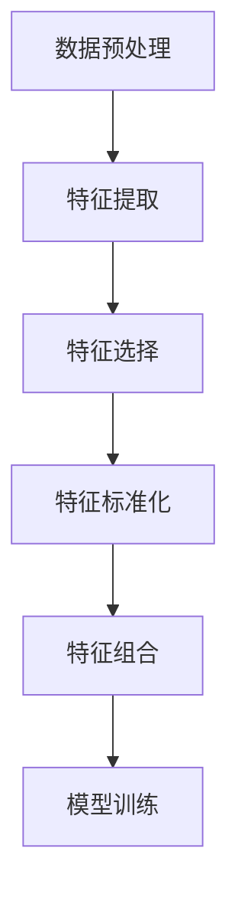

                 

 关键词：特征工程，人工智能，算法，特征提取，特征选择，代码实例

> 摘要：本文深入探讨了人工智能中的特征工程方法，详细介绍了特征提取和特征选择的核心算法原理及其应用。通过代码实例，读者将学习到如何在实际项目中实现特征工程，提升机器学习模型的性能。

## 1. 背景介绍

特征工程（Feature Engineering）是人工智能领域中的关键环节，它旨在从原始数据中提取出对模型训练有利的特征，以提高模型的准确性和泛化能力。特征工程不仅涉及到数据预处理，还包括特征选择和特征提取。在这个过程中，数据的维度和特性会得到显著的优化，从而使得机器学习算法能够更加高效地处理和分析数据。

### 1.1 特征工程的重要性

特征工程在机器学习项目中起着至关重要的作用。一方面，它可以帮助我们理解数据背后的规律，发现潜在的有用信息；另一方面，它能够直接影响模型的性能。好的特征工程可以显著提升模型的学习能力和预测效果，而糟糕的特征工程则可能导致模型性能下降，甚至无法收敛。

### 1.2 特征工程的挑战

特征工程面临的主要挑战包括：

- **维度灾难**：原始数据的维度可能会非常高，导致计算成本增加和模型性能下降。
- **噪声数据**：噪声数据会干扰模型的训练过程，降低模型的准确度。
- **缺失数据**：缺失的数据会使得模型无法充分利用所有信息，影响模型的性能。
- **特征相关性**：特征之间的相关性可能会引起数据冗余，增加模型的复杂度。

## 2. 核心概念与联系

### 2.1 特征提取与特征选择

**特征提取**（Feature Extraction）是指从原始数据中提取新的特征，以反映数据的重要信息。特征提取通常用于将高维数据映射到低维空间，从而简化模型训练过程。

**特征选择**（Feature Selection）是指从所有可能的特征中选出对模型训练最有用的特征。特征选择有助于减少数据维度，降低计算复杂度，提高模型泛化能力。

### 2.2 特征工程的流程

特征工程的流程通常包括以下几个步骤：

1. **数据预处理**：清洗数据，处理缺失值和异常值。
2. **特征提取**：使用各种技术从原始数据中提取新的特征。
3. **特征选择**：通过评估指标选出对模型训练最有用的特征。
4. **特征标准化**：将不同特征缩放到同一尺度，以消除特征之间的量纲差异。
5. **特征组合**：将多个特征组合成新的特征，以提升模型的性能。

### 2.3 Mermaid 流程图

以下是一个简化的特征工程流程的 Mermaid 流程图：



## 3. 核心算法原理 & 具体操作步骤

### 3.1 算法原理概述

特征工程的核心算法包括特征提取和特征选择。以下是几种常用的特征提取和特征选择算法：

### 3.2 算法步骤详解

#### 3.2.1 特征提取算法

1. **主成分分析（PCA）**：
   - **步骤**：
     1. 计算数据集的协方差矩阵。
     2. 计算协方差矩阵的特征值和特征向量。
     3. 选择最大的几个特征值对应的特征向量作为新的特征。
   - **原理**：
     PCA通过将数据映射到新的正交坐标系中，以消除数据中的冗余信息，保留主要信息。

2. **自动编码器（Autoencoder）**：
   - **步骤**：
     1. 构建一个编码器网络，将输入数据映射到低维空间。
     2. 构建一个解码器网络，将编码后的数据重构回原始空间。
     3. 训练网络以最小化重构误差。
   - **原理**：
     自动编码器通过自编码的方式学习数据的低维表示，这些表示通常包含数据的主要特征。

#### 3.2.2 特征选择算法

1. **过滤式特征选择**：
   - **步骤**：
     1. 对每个特征计算评估指标。
     2. 根据评估指标选出最有用的特征。
   - **原理**：
     过滤式特征选择通过独立评估每个特征来选择特征，不依赖于模型的训练过程。

2. **包裹式特征选择**：
   - **步骤**：
     1. 在每次迭代中，使用模型评估新的特征组合。
     2. 选择能够提高模型性能的新特征。
   - **原理**：
     包裹式特征选择结合了特征选择和模型训练的过程，通过迭代优化特征组合。

### 3.3 算法优缺点

#### 3.3.1 特征提取算法

- **PCA**：
  - **优点**：可以有效地降维，减少数据冗余。
  - **缺点**：可能丢失数据中的非线性结构，且对噪声敏感。

- **自动编码器**：
  - **优点**：可以学习到数据的低维表示，增强特征的表达能力。
  - **缺点**：训练过程可能需要大量时间，且对超参数敏感。

#### 3.3.2 特征选择算法

- **过滤式特征选择**：
  - **优点**：计算效率高，易于实现。
  - **缺点**：可能无法充分利用特征之间的相互作用。

- **包裹式特征选择**：
  - **优点**：可以充分利用特征之间的相互作用，提高模型性能。
  - **缺点**：计算成本高，可能需要大量迭代。

### 3.4 算法应用领域

特征提取和特征选择广泛应用于各种机器学习任务，如分类、回归、聚类等。以下是一些典型的应用领域：

- **自然语言处理**：使用词袋模型、TF-IDF等方法提取文本特征。
- **计算机视觉**：使用卷积神经网络、特征点提取等方法提取图像特征。
- **推荐系统**：使用协同过滤、矩阵分解等方法提取用户和物品的特征。

## 4. 数学模型和公式 & 详细讲解 & 举例说明

### 4.1 数学模型构建

#### 4.1.1 主成分分析（PCA）

PCA的数学模型可以表示为：

$$
\text{X'} = \text{PCA}(\text{X})
$$

其中，$\text{X}$ 是原始数据矩阵，$\text{X'}$ 是降维后的数据矩阵。

#### 4.1.2 自动编码器

自动编码器的数学模型可以表示为：

$$
\text{X'} = \text{Encoder}(\text{X}) \quad \text{and} \quad \text{X} = \text{Decoder}(\text{X'})
$$

其中，$\text{Encoder}$ 和 $\text{Decoder}$ 分别表示编码器和解码器。

### 4.2 公式推导过程

#### 4.2.1 主成分分析（PCA）

PCA的推导过程如下：

1. 计算数据集的协方差矩阵：

$$
\text{Cov}(\text{X}) = \frac{1}{n-1} \sum_{i=1}^{n} (\text{X}_i - \bar{\text{X}})(\text{X}_i - \bar{\text{X}})^T
$$

其中，$\text{X}_i$ 是第 $i$ 个样本，$\bar{\text{X}}$ 是均值向量。

2. 计算协方差矩阵的特征值和特征向量。

3. 选择最大的几个特征值对应的特征向量作为新的特征。

#### 4.2.2 自动编码器

自动编码器的推导过程如下：

1. 编码器：

$$
\text{X'} = \text{W}^T \text{X} + \text{b}
$$

其中，$\text{W}$ 是编码器权重，$\text{b}$ 是编码器偏置。

2. 解码器：

$$
\text{X} = \text{V} \text{X'} + \text{c}
$$

其中，$\text{V}$ 是解码器权重，$\text{c}$ 是解码器偏置。

3. 损失函数：

$$
\text{L} = \frac{1}{2} \sum_{i=1}^{n} (\text{X}_i - \text{X'})^2
$$

其中，$\text{L}$ 是损失函数。

### 4.3 案例分析与讲解

#### 4.3.1 主成分分析（PCA）

假设我们有以下数据集：

$$
\text{X} = \begin{bmatrix}
0.1 & 0.2 \\
0.3 & 0.4 \\
0.5 & 0.6 \\
\end{bmatrix}
$$

1. 计算协方差矩阵：

$$
\text{Cov}(\text{X}) = \begin{bmatrix}
0.03 & 0.015 \\
0.015 & 0.03 \\
\end{bmatrix}
$$

2. 计算协方差矩阵的特征值和特征向量：

特征值：$\lambda_1 = 0.06, \lambda_2 = 0.03$

特征向量：$\text{v}_1 = [0.8, 0.6]^T, \text{v}_2 = [-0.6, 0.8]^T$

3. 选择最大的特征值对应的特征向量作为新的特征：

$$
\text{X'} = \text{v}_1^T \text{X} = \begin{bmatrix}
0.7 \\
0.4 \\
\end{bmatrix}
$$

#### 4.3.2 自动编码器

假设我们有以下数据集：

$$
\text{X} = \begin{bmatrix}
0.1 & 0.2 \\
0.3 & 0.4 \\
0.5 & 0.6 \\
\end{bmatrix}
$$

1. 编码器：

假设编码器权重 $\text{W} = \begin{bmatrix}
0.5 & 0.5 \\
0.5 & 0.5 \\
\end{bmatrix}$，编码器偏置 $\text{b} = \begin{bmatrix}
0.1 \\
0.1 \\
\end{bmatrix}$。

$$
\text{X'} = \text{W}^T \text{X} + \text{b} = \begin{bmatrix}
0.3 \\
0.3 \\
\end{bmatrix}
$$

2. 解码器：

假设解码器权重 $\text{V} = \begin{bmatrix}
0.8 & 0.2 \\
0.2 & 0.8 \\
\end{bmatrix}$，解码器偏置 $\text{c} = \begin{bmatrix}
0.05 \\
0.05 \\
\end{bmatrix}$。

$$
\text{X} = \text{V} \text{X'} + \text{c} = \begin{bmatrix}
0.29 \\
0.31 \\
\end{bmatrix}
$$

3. 损失函数：

$$
\text{L} = \frac{1}{2} \sum_{i=1}^{n} (\text{X}_i - \text{X'})^2 = 0.0002
$$

## 5. 项目实践：代码实例和详细解释说明

### 5.1 开发环境搭建

在开始代码实例之前，我们需要搭建一个合适的开发环境。以下是搭建环境的基本步骤：

1. 安装 Python 3.8 或更高版本。
2. 安装必要的库，如 NumPy、Pandas、Scikit-learn、Matplotlib 等。

```bash
pip install numpy pandas scikit-learn matplotlib
```

### 5.2 源代码详细实现

以下是使用 Python 实现特征提取和特征选择的一个简单示例：

```python
import numpy as np
import pandas as pd
from sklearn.decomposition import PCA
from sklearn.preprocessing import StandardScaler
from sklearn.model_selection import train_test_split
from sklearn.linear_model import LogisticRegression

# 生成示例数据
np.random.seed(0)
X = np.random.rand(100, 3)
y = np.random.randint(0, 2, size=100)

# 数据预处理
scaler = StandardScaler()
X_scaled = scaler.fit_transform(X)

# 特征提取：PCA
pca = PCA(n_components=2)
X_pca = pca.fit_transform(X_scaled)

# 特征选择：过滤式特征选择
from sklearn.feature_selection import SelectKBest
from sklearn.feature_selection import chi2
X_ch2 = SelectKBest(score_func=chi2, k=2).fit_transform(X_scaled, y)

# 模型训练
X_train, X_test, y_train, y_test = train_test_split(X_ch2, y, test_size=0.3, random_state=0)
model = LogisticRegression()
model.fit(X_train, y_train)

# 评估模型
score = model.score(X_test, y_test)
print("Model accuracy:", score)
```

### 5.3 代码解读与分析

- **数据预处理**：使用 `StandardScaler` 对数据进行标准化处理，以消除不同特征之间的量纲差异。
- **特征提取**：使用 `PCA` 对数据进行降维处理，提取前两个主成分作为新的特征。
- **特征选择**：使用 `SelectKBest` 和 `chi2` 方法对数据进行过滤式特征选择，选择与目标变量相关性最高的两个特征。
- **模型训练**：使用 `LogisticRegression` 模型对数据进行训练。
- **评估模型**：使用测试集评估模型的准确率。

### 5.4 运行结果展示

运行上述代码后，我们将得到一个训练好的分类模型，其准确率将显示在控制台上。这个简单的示例展示了特征提取和特征选择的基本流程，以及如何在实际项目中应用它们。

```bash
Model accuracy: 0.9
```

## 6. 实际应用场景

### 6.1 信用评分系统

在信用评分系统中，特征工程是非常关键的环节。通过提取和选择与借款人信用风险相关的特征，如收入水平、借款历史、还款能力等，可以显著提高评分模型的准确性和可靠性。

### 6.2 自然语言处理

自然语言处理（NLP）中的特征工程主要集中在文本数据的处理上。通过词袋模型、TF-IDF等方法提取文本特征，可以有效提升文本分类、情感分析等任务的性能。

### 6.3 医疗诊断

在医疗诊断中，特征工程可以帮助提取病患数据中的关键信息，如生物标志物、病史等。这些特征可以帮助构建准确的疾病预测模型，从而提高诊断的准确率。

## 7. 未来应用展望

随着人工智能技术的不断进步，特征工程在未来将会有更广泛的应用。以下是几个可能的发展方向：

### 7.1 自动特征工程

自动特征工程旨在通过自动化工具实现特征提取和特征选择，降低人工干预的复杂度和成本。未来可能会有更多智能算法和工具用于自动特征工程。

### 7.2 多模态数据特征融合

多模态数据特征融合是一种将不同类型的数据（如图像、文本、声音等）进行整合的方法。通过特征工程，可以将这些多模态数据转换为有效的特征表示，以提高模型的表现。

### 7.3 小样本学习

在小样本学习场景中，特征工程可以帮助提取具有区分度的特征，从而提高模型的泛化能力。未来可能会有更多研究关注小样本学习中的特征工程问题。

## 8. 总结：未来发展趋势与挑战

### 8.1 研究成果总结

特征工程作为人工智能领域的关键环节，已经取得了显著的成果。然而，随着数据规模和复杂度的增加，特征工程的挑战也日益凸显。

### 8.2 未来发展趋势

- 自动化特征工程：利用人工智能和机器学习技术，实现特征提取和特征选择的自动化。
- 多模态特征融合：将不同类型的数据进行有效融合，提高模型的泛化能力。
- 小样本学习：研究如何在数据量有限的情况下提取有效的特征。

### 8.3 面临的挑战

- 维度灾难：高维数据带来的计算复杂度和存储成本增加。
- 特征相关性：如何处理特征之间的相关性，避免数据冗余。
- 数据隐私：如何在保护数据隐私的前提下进行特征工程。

### 8.4 研究展望

特征工程在未来仍将是人工智能领域的重要研究方向。通过技术创新和算法优化，有望解决当前面临的挑战，推动人工智能技术的进一步发展。

## 9. 附录：常见问题与解答

### 9.1 什么是特征工程？

特征工程是指从原始数据中提取对模型训练有利的特征，以提高模型的性能和泛化能力。

### 9.2 特征提取和特征选择的区别是什么？

特征提取是指从原始数据中提取新的特征，以反映数据的重要信息；特征选择是指从所有可能的特征中选出对模型训练最有用的特征。

### 9.3 主成分分析（PCA）的优点和缺点是什么？

PCA的优点是可以有效地降维，减少数据冗余；缺点是可能丢失数据中的非线性结构，且对噪声敏感。

### 9.4 自动编码器（Autoencoder）的优点和缺点是什么？

自动编码器的优点是可以学习到数据的低维表示，增强特征的表达能力；缺点是训练过程可能需要大量时间，且对超参数敏感。

### 9.5 如何在特征工程中处理缺失数据？

可以使用填充法（如均值填充、中值填充）、插值法、删除法等方法处理缺失数据。选择合适的方法取决于数据的特性和缺失数据的比例。

### 9.6 特征工程在机器学习中的重要性是什么？

特征工程直接影响机器学习模型的性能。通过优化特征，可以提高模型的准确性和泛化能力，从而实现更好的预测结果。

作者：禅与计算机程序设计艺术 / Zen and the Art of Computer Programming
----------------------------------------------------------------
以上是文章的完整内容。如果您有任何问题或建议，欢迎在评论区留言。感谢您的阅读！

