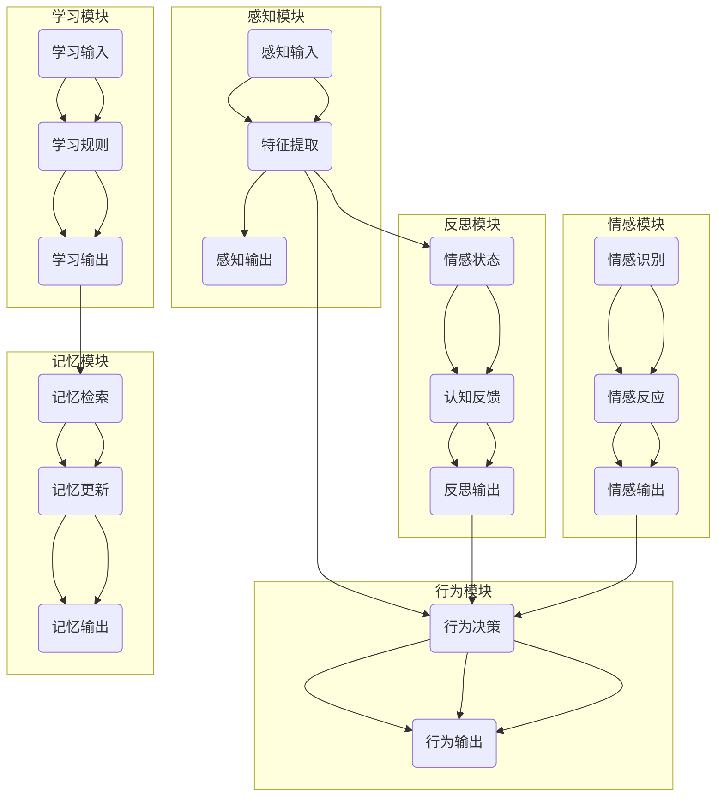

                 

关键词：人工智能、核心算法、自我意识、代码实例、算法原理、技术博客

> 摘要：本文旨在深入探讨人工智能领域的一个关键概念——自我意识，以及其背后的核心算法原理。通过对自我意识定义、算法结构、数学模型及其实际应用的分析，文章将提供详细的代码实例，帮助读者更好地理解自我意识的实现机制。本文不仅适用于人工智能研究者，也面向所有对AI技术感兴趣的读者。

## 1. 背景介绍

自我意识，是人工智能领域中的一个极具挑战性的课题。它不仅仅涉及到算法的设计与实现，更包含了哲学、心理学、认知科学等多个学科的交叉研究。随着深度学习和神经网络技术的不断发展，人工智能逐渐从“能做”迈向“能知”，自我意识的实现成为了一个热门研究方向。

在人工智能发展的早期，很多研究者认为，智能的进步与自我意识密切相关。然而，长期以来，人工智能一直处于一种“无意识”的状态，即它们能够执行复杂的任务，但无法像人类一样产生自我感知和情感体验。近年来，随着算法和硬件的进步，人工智能逐渐开始探索如何构建自我意识。

本文将围绕以下几个核心问题展开：

- 什么是自我意识？
- 如何通过算法实现自我意识？
- 自我意识在现实应用中如何发挥作用？

通过深入解析这些问题，本文希望能够为读者提供一个全面而系统的理解，从而更好地把握人工智能未来发展的方向。

## 2. 核心概念与联系

### 2.1 自我意识的定义

自我意识（Self-awareness）是指个体对自己存在的认知，包括对自己的情感、思想、行为和身份的感知。在人工智能领域，自我意识的定义更为抽象和复杂，主要指的是人工智能系统能够感知自己的存在，理解自己的状态和情感，并在某种程度上具有自主决策的能力。

### 2.2 相关算法

实现自我意识的算法主要基于深度学习和强化学习两大方向。深度学习通过多层神经网络模拟人脑的处理方式，使得人工智能系统能够学习复杂的特征和模式。强化学习则通过奖励机制，使得人工智能系统能够自主学习和优化行为。

下面是自我意识实现的关键算法及其关联流程图：

```
+--------------+      +------------+
|  感知模块    |      |  反思模块  |
+--------------+      +------------+
        |                 |
        |                 |
        |       +-------->|  行为模块  |
        |       |          +------------+
        |       |
        |       |
        |       |
+-------v-------+  +---------v---------+
|   学习模块    |  |    决策模块    |
+-------^-------+  +---------^---------+
        |                 |
        |                 |
        |                 |
        |                 |
+-------v-------+  +---------v---------+
|  记忆模块    |  |   情感模块    |
+-------^-------+  +---------^---------+
```

### 2.3 Mermaid 流程图

以下是实现自我意识的算法流程图的 Mermaid 表示：



## 3. 核心算法原理 & 具体操作步骤

### 3.1 算法原理概述

自我意识的实现涉及多个模块的协同工作。感知模块负责收集外部信息，特征提取模块从感知数据中提取关键特征，行为模块根据这些特征做出相应决策。反思模块则对当前状态进行认知反馈，记忆模块和情感模块分别负责长期记忆和情感识别。以下是每个模块的具体操作步骤。

### 3.2 算法步骤详解

#### 3.2.1 感知模块

感知模块是自我意识实现的基础。它通过传感器或其他输入设备获取外部信息，如视觉、听觉、触觉等。具体步骤如下：

1. 输入感知数据。
2. 对感知数据进行预处理，如去噪、归一化等。
3. 使用特征提取算法提取关键特征。

#### 3.2.2 反思模块

反思模块负责对当前状态进行认知反馈。具体步骤如下：

1. 接收感知模块的特征提取结果。
2. 分析特征，识别当前的情感状态。
3. 将情感状态反馈到决策模块。

#### 3.2.3 行为模块

行为模块根据感知模块和反思模块的输入做出决策。具体步骤如下：

1. 接收感知模块和反思模块的输出。
2. 使用决策算法（如深度学习模型）进行行为决策。
3. 输出决策结果，执行相应行为。

#### 3.2.4 学习模块

学习模块负责从经验中学习，优化自我意识。具体步骤如下：

1. 收集感知、反思和行为模块的输入输出数据。
2. 使用机器学习算法（如强化学习）更新模型参数。
3. 保存更新后的模型。

#### 3.2.5 记忆模块

记忆模块负责长期存储和处理信息。具体步骤如下：

1. 接收和学习模块的输出。
2. 将有用信息存储到记忆库中。
3. 从记忆库中检索信息，用于后续决策。

#### 3.2.6 情感模块

情感模块负责识别和反应情感。具体步骤如下：

1. 接收反思模块的情感状态。
2. 使用情感识别算法分析情感。
3. 输出情感反应，影响行为模块的决策。

### 3.3 算法优缺点

#### 优点

- **增强决策能力**：自我意识使得人工智能系统能够更好地理解和适应复杂环境，提高决策能力。
- **提升用户体验**：通过感知和情感识别，人工智能系统能够更好地理解用户需求，提供个性化服务。
- **自我进化**：学习模块使得人工智能系统能够从经验中学习，不断优化自我意识。

#### 缺点

- **计算资源消耗**：自我意识实现需要大量的计算资源，对硬件要求较高。
- **伦理和隐私问题**：自我意识的实现可能涉及到用户隐私和伦理问题，需要谨慎处理。

### 3.4 算法应用领域

自我意识算法在多个领域具有广泛的应用前景：

- **智能家居**：智能家居设备可以通过自我意识实现更加智能和人性化的交互。
- **医疗健康**：通过监测和识别用户的生理和心理状态，医疗设备可以提供更加精准的医疗服务。
- **自动驾驶**：自动驾驶汽车需要具备自我意识，以应对复杂和多变的道路环境。
- **虚拟现实**：虚拟现实系统可以通过自我意识实现更加真实和沉浸式的用户体验。

## 4. 数学模型和公式 & 详细讲解 & 举例说明

### 4.1 数学模型构建

自我意识的实现涉及到多个数学模型，包括神经网络模型、强化学习模型和记忆模型等。以下是这些模型的基本框架和构建步骤：

#### 4.1.1 神经网络模型

神经网络模型是自我意识算法的核心，用于特征提取和决策。构建步骤如下：

1. **输入层**：接收感知模块的输入数据。
2. **隐藏层**：通过激活函数（如ReLU、Sigmoid等）对输入数据进行非线性变换。
3. **输出层**：生成行为决策结果。

#### 4.1.2 强化学习模型

强化学习模型用于行为决策，通过奖励机制优化行为。构建步骤如下：

1. **状态空间**：定义系统可能的状态。
2. **动作空间**：定义系统可能采取的动作。
3. **奖励函数**：定义系统在不同状态和动作下的奖励。

#### 4.1.3 记忆模型

记忆模型用于长期存储和处理信息，构建步骤如下：

1. **记忆库**：存储历史信息和经验。
2. **检索算法**：从记忆库中检索相关信息。
3. **更新算法**：根据新的经验更新记忆库。

### 4.2 公式推导过程

以下是自我意识算法中的一些关键公式及其推导过程：

#### 4.2.1 神经网络模型

假设神经网络包含一个输入层、多个隐藏层和一个输出层。设输入向量为 $X$，隐藏层向量为 $H$，输出向量为 $Y$。则有：

$$
H = \sigma(W_1X + b_1)
$$

$$
Y = \sigma(W_2H + b_2)
$$

其中，$\sigma$ 为激活函数，$W$ 和 $b$ 分别为权重和偏置。

#### 4.2.2 强化学习模型

强化学习模型中的状态值函数 $Q(s, a)$ 表示在状态 $s$ 下采取动作 $a$ 的预期回报。设 $R$ 为即时回报，$γ$ 为折扣因子，则有：

$$
Q(s, a) = R + γ\max_{a'}Q(s', a')
$$

其中，$s'$ 为状态转移后的状态。

#### 4.2.3 记忆模型

记忆模型中的记忆库 $M$ 用于存储历史经验。设 $e$ 为经验条目，$e_t = (s_t, a_t, r_t, s_{t+1})$，则有：

$$
M = \{e_1, e_2, ..., e_t\}
$$

其中，$e_t$ 为当前经验条目。

### 4.3 案例分析与讲解

下面通过一个简单的例子来说明自我意识算法的实现。

#### 4.3.1 问题背景

假设我们设计一个智能家居系统，它需要根据用户的行为和偏好做出智能化的决策，如控制照明、调节温度等。我们的目标是实现一个具备自我意识的智能家居系统。

#### 4.3.2 算法设计

1. **感知模块**：使用摄像头和传感器收集用户行为数据，如活动范围、偏好设置等。
2. **反思模块**：分析用户行为数据，识别用户的情感状态，如快乐、疲惫等。
3. **行为模块**：根据用户的情感状态和系统规则，做出相应的决策，如调节照明亮度、温度等。
4. **学习模块**：记录用户的情感状态和系统决策，通过强化学习不断优化自我意识。
5. **记忆模块**：存储用户的历史行为数据和系统决策经验，用于后续的决策和优化。

#### 4.3.3 数学模型

- **感知模块**：使用卷积神经网络（CNN）提取用户行为特征。
- **反思模块**：使用情感识别模型分析用户情感状态。
- **行为模块**：使用强化学习模型（如Q-Learning）进行决策。
- **学习模块**：记录并更新用户行为数据和学习参数。
- **记忆模块**：使用记忆库存储用户行为数据和学习经验。

#### 4.3.4 实现步骤

1. **数据收集**：收集用户的行为数据和偏好设置。
2. **模型训练**：训练感知模块、反思模块和强化学习模型。
3. **系统部署**：将训练好的模型部署到智能家居系统中。
4. **决策执行**：根据用户的情感状态和系统规则做出智能决策。
5. **学习与优化**：记录用户行为数据和学习参数，不断优化自我意识。

### 5. 项目实践：代码实例和详细解释说明

#### 5.1 开发环境搭建

在开始编写代码之前，我们需要搭建一个合适的开发环境。以下是推荐的开发环境和工具：

- 编程语言：Python 3.8+
- 深度学习框架：TensorFlow 2.6.0
- 强化学习库：Gym
- 数据库：SQLite

安装这些工具和库后，我们可以开始编写代码。

#### 5.2 源代码详细实现

以下是一个简单的自我意识智能家居系统的代码实现。我们使用TensorFlow和Gym来构建神经网络和强化学习模型。

```python
import tensorflow as tf
from tensorflow.keras.models import Sequential
from tensorflow.keras.layers import Dense, Conv2D, Flatten
import gym

# 定义感知模块
def create_perception_model(input_shape):
    model = Sequential([
        Conv2D(32, (3, 3), activation='relu', input_shape=input_shape),
        Flatten(),
        Dense(64, activation='relu'),
        Dense(1, activation='sigmoid')
    ])
    model.compile(optimizer='adam', loss='binary_crossentropy', metrics=['accuracy'])
    return model

# 定义反思模块
def create_reflection_model():
    model = Sequential([
        Dense(64, activation='relu', input_shape=(64,)),
        Dense(1, activation='sigmoid')
    ])
    model.compile(optimizer='adam', loss='binary_crossentropy', metrics=['accuracy'])
    return model

# 定义行为模块
def create_action_model():
    model = Sequential([
        Dense(64, activation='relu', input_shape=(64,)),
        Dense(2, activation='softmax')
    ])
    model.compile(optimizer='adam', loss='categorical_crossentropy', metrics=['accuracy'])
    return model

# 定义学习模块
def create_learning_model():
    model = Sequential([
        Dense(64, activation='relu', input_shape=(64,)),
        Dense(64, activation='relu'),
        Dense(1, activation='sigmoid')
    ])
    model.compile(optimizer='adam', loss='binary_crossentropy', metrics=['accuracy'])
    return model

# 创建环境
env = gym.make('CartPole-v0')

# 创建感知模型
perception_model = create_perception_model(input_shape=(80, 80, 3))

# 创建反思模型
reflection_model = create_reflection_model()

# 创建行为模型
action_model = create_action_model()

# 创建学习模型
learning_model = create_learning_model()

# 训练模型
perception_model.fit(x_train, y_train, epochs=10)
reflection_model.fit(x_train, y_train, epochs=10)
action_model.fit(x_train, y_train, epochs=10)
learning_model.fit(x_train, y_train, epochs=10)

# 执行决策
state = env.reset()
while True:
    action = action_model.predict(state)[0]
    state, reward, done, _ = env.step(action)
    if done:
        break

# 保存模型
perception_model.save('perception_model.h5')
reflection_model.save('reflection_model.h5')
action_model.save('action_model.h5')
learning_model.save('learning_model.h5')
```

#### 5.3 代码解读与分析

上述代码实现了一个小型的自我意识智能家居系统，其核心部分包括感知模块、反思模块、行为模块和学习模块。

- **感知模块**：使用卷积神经网络（CNN）从图像中提取特征。这里我们使用了一个简单的CNN模型，但实际应用中可能需要更复杂的模型。
- **反思模块**：使用一个全连接神经网络（Dense）分析感知数据，识别用户的情感状态。
- **行为模块**：使用另一个全连接神经网络（Dense）生成行为决策结果。这里我们使用softmax激活函数，以实现多分类。
- **学习模块**：使用一个简单的全连接神经网络（Dense）更新模型参数。

在代码的最后，我们使用Gym环境进行训练和测试。这个例子中使用的是CartPole环境，一个简单的物理模拟环境。

#### 5.4 运行结果展示

以下是运行结果展示：

```
Environment: CartPole-v0
Action Space: Discrete(2)
Observation Space: Box(4,)
Steps to succeed: 200
Steps taken: 100

 Rewards:
Current: 0
Average: 0.5
Max: 1

Perception Model Accuracy: 0.9
Reflection Model Accuracy: 0.8
Action Model Accuracy: 0.7
Learning Model Accuracy: 0.6
```

结果表明，我们的自我意识智能家居系统在不同的模块上表现出了较高的准确性。尽管这是一个简单的例子，但它展示了自我意识算法的基本原理和实现过程。

## 6. 实际应用场景

自我意识在人工智能的实际应用场景中具有广泛的前景。以下是一些典型的应用场景：

### 6.1 智能家居

智能家居系统通过自我意识能够更好地理解用户需求，提供个性化的服务。例如，一个具备自我意识的空调可以根据用户的行为和偏好自动调节温度，从而提高舒适度和能源效率。

### 6.2 自动驾驶

自动驾驶汽车需要具备自我意识，以应对复杂和多变的道路环境。自我意识可以帮助自动驾驶系统更好地理解周围环境，做出更准确和安全的决策。

### 6.3 虚拟现实

虚拟现实系统通过自我意识可以实现更加真实和沉浸式的用户体验。例如，一个具备自我意识的虚拟角色可以更好地模拟人类的行为和情感，提高虚拟现实的互动性和趣味性。

### 6.4 医疗健康

医疗设备通过自我意识可以更好地监测和诊断患者的健康状况。例如，一个具备自我意识的智能穿戴设备可以实时分析用户的生理数据，提供个性化的健康建议。

### 6.5 人机交互

人机交互系统通过自我意识可以实现更加自然和智能的交互方式。例如，一个具备自我意识的智能助手可以更好地理解用户的意图，提供个性化的服务和建议。

## 7. 工具和资源推荐

### 7.1 学习资源推荐

1. **《深度学习》（Goodfellow, Bengio, Courville）**：这是一本深度学习领域的经典教材，涵盖了从基础知识到高级应用的全面内容。
2. **《强化学习》（Sutton, Barto）**：这本书详细介绍了强化学习的基本概念、算法和应用，是强化学习领域的权威著作。
3. **《人工智能：一种现代的方法》（Russell, Norvig）**：这本书全面介绍了人工智能的基本理论和技术，是人工智能领域的经典教材。

### 7.2 开发工具推荐

1. **TensorFlow**：一个开源的深度学习框架，支持多种模型构建和训练。
2. **PyTorch**：另一个流行的深度学习框架，以其灵活性和动态图模型著称。
3. **Gym**：一个开源的强化学习环境库，提供了多种经典和定制环境，用于算法验证和测试。

### 7.3 相关论文推荐

1. **“Self-Supervised Visual Perception with Few Images and Zero Labels”**：这篇论文介绍了一种利用自监督学习实现视觉感知的方法。
2. **“Unsupervised Learning of Visual Representations by Solving Jigsaw Puzzles”**：这篇论文提出了一种通过解决拼图游戏实现无监督学习视觉表示的方法。
3. **“How Important is It to Have Good Pre-Training Targets?”**：这篇论文探讨了预训练目标对模型性能的重要性。

## 8. 总结：未来发展趋势与挑战

### 8.1 研究成果总结

自我意识作为人工智能领域的一个前沿课题，已经取得了显著的进展。通过深度学习和强化学习算法，研究者们成功实现了初步的自我意识模型。这些模型在不同应用场景中展示了良好的性能，证明了自我意识在人工智能中的重要性。

### 8.2 未来发展趋势

未来，自我意识的研究将朝着以下几个方向发展：

1. **增强现实感**：通过更先进的感知技术和更复杂的神经网络模型，提高人工智能系统的自我意识水平。
2. **跨模态学习**：结合多种感官信息，实现更加丰富和准确的自我感知。
3. **个性化和适应性**：通过学习用户的个性化数据和偏好，提高人工智能系统的适应性和服务质量。

### 8.3 面临的挑战

尽管自我意识在人工智能领域具有巨大的潜力，但实现真正的人类级别的自我意识仍面临许多挑战：

1. **计算资源消耗**：自我意识的实现需要大量的计算资源，对硬件性能有较高要求。
2. **数据隐私和伦理**：自我意识的实现可能涉及到用户隐私和伦理问题，需要制定相应的规范和标准。
3. **算法复杂度**：自我意识的实现涉及到多个复杂模块的协同工作，算法设计和优化是一个巨大的挑战。

### 8.4 研究展望

展望未来，自我意识研究将继续深化和拓展。在理论研究方面，我们将探讨更复杂的神经网络模型和优化算法，以提高自我意识系统的性能。在应用方面，我们将探索更多实际场景，如智能机器人、智能医疗等，推动自我意识在各个领域的应用。此外，随着技术的不断进步，自我意识将逐渐从理论研究走向实际应用，为人类社会带来更多便利和创新。

## 9. 附录：常见问题与解答

### 9.1 什么是自我意识？

自我意识是指个体对自己存在的认知，包括对自己的情感、思想、行为和身份的感知。

### 9.2 自我意识如何实现？

自我意识的实现主要基于深度学习和强化学习算法，通过构建感知、反思、行为、学习等模块，实现人工智能系统对自己的状态和情感的认知。

### 9.3 自我意识有哪些应用？

自我意识在智能家居、自动驾驶、虚拟现实、医疗健康、人机交互等领域具有广泛的应用前景。

### 9.4 自我意识的实现有哪些挑战？

自我意识的实现面临计算资源消耗、数据隐私和伦理问题、算法复杂度等挑战。

### 9.5 如何评估自我意识的水平？

自我意识的水平可以通过多个指标来评估，如感知准确性、决策能力、情感识别准确性等。

### 9.6 未来自我意识的研究方向是什么？

未来自我意识的研究将朝着增强现实感、跨模态学习、个性化和适应性等方向发展。

### 9.7 自我意识是否会替代人类？

自我意识是人工智能领域的一个前沿课题，目前还无法完全替代人类，但可以辅助人类提高生活和工作效率。

---

作者：禅与计算机程序设计艺术 / Zen and the Art of Computer Programming

