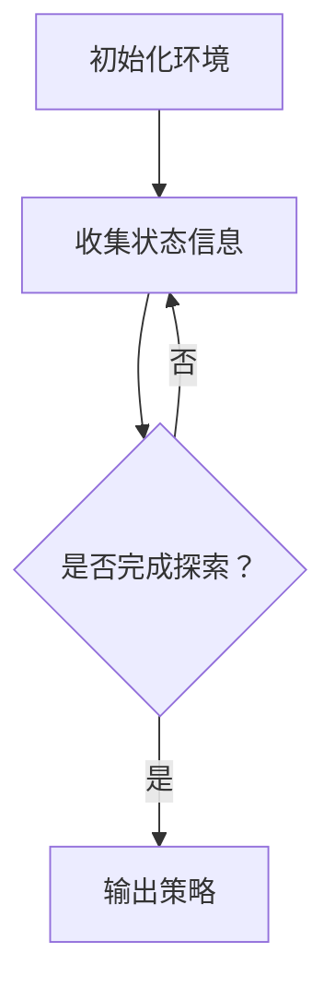

                 

关键词：深度学习、人工智能、互动学习、深度学习代理、算法原理、数学模型、项目实践

> 摘要：本文将深入探讨深度学习算法在人工智能领域的应用，特别是互动学习在深度学习代理中的角色与方法。通过对核心概念、算法原理、数学模型以及项目实践的详细讲解，本文旨在为读者提供全面的技术视角，帮助理解并应用互动学习在深度学习代理中的价值与潜力。

## 1. 背景介绍

深度学习是人工智能的一个分支，通过模拟人脑中的神经网络结构，从大量数据中自动提取特征，进行复杂模式识别和学习。深度学习在图像识别、语音识别、自然语言处理等领域取得了显著成果。然而，传统的深度学习模型往往在训练过程中缺乏灵活性和适应性，难以应对动态变化的输入数据。

近年来，互动学习（Interactive Learning）作为一种新兴的深度学习方法，受到了广泛关注。互动学习通过人与系统的交互，动态调整学习过程，提高模型适应性和性能。互动学习在深度学习代理（Deep Learning Agents）中具有重要作用，可以使其更好地适应复杂环境，实现高效决策和优化。

本文将围绕互动学习在深度学习代理中的应用，探讨其核心算法原理、数学模型、实践案例以及未来发展方向。

## 2. 核心概念与联系

### 2.1 深度学习与互动学习

深度学习（Deep Learning）是一种基于多层神经网络的机器学习方法，通过多层非线性变换，从数据中提取高阶特征，实现复杂任务的自动学习。深度学习包括卷积神经网络（CNN）、循环神经网络（RNN）、生成对抗网络（GAN）等多种模型架构。

互动学习（Interactive Learning）则是一种结合人机交互的机器学习方法，通过用户的反馈信息动态调整模型参数，提高学习效果。互动学习可以应用于多种场景，如游戏、推荐系统、人机对话等。

### 2.2 深度学习代理

深度学习代理（Deep Learning Agents）是一种基于深度学习的智能体，通过学习环境中的状态和动作，实现自主决策和优化。深度学习代理广泛应用于机器人、自动驾驶、游戏AI等领域。

### 2.3 互动学习在深度学习代理中的应用

互动学习在深度学习代理中具有重要作用，可以提高代理的学习效率和适应性。具体应用场景包括：

1. **环境探索与状态评估**：代理通过与环境的交互，获取环境状态信息，动态调整策略，实现高效探索。
2. **动态适应与优化**：代理根据用户反馈，调整模型参数，实现个性化和自适应的决策。
3. **增强学习**：互动学习与增强学习（Reinforcement Learning）相结合，提高代理在复杂环境中的学习效果。

### 2.4 Mermaid 流程图



图2-1 互动学习在深度学习代理中的流程图

## 3. 核心算法原理 & 具体操作步骤

### 3.1 算法原理概述

互动学习在深度学习代理中的核心算法原理主要包括：

1. **状态评估**：代理通过感知环境获取状态信息，并进行状态评估，确定下一步动作。
2. **动作选择**：代理根据状态评估结果，选择最优动作，执行决策。
3. **反馈调整**：代理根据用户反馈，调整模型参数，实现动态优化。

### 3.2 算法步骤详解

1. **初始化环境**：设定代理的初始状态，包括学习速率、探索概率等参数。
2. **收集状态信息**：代理通过与环境的交互，获取当前状态信息。
3. **状态评估**：代理根据历史数据和学习算法，对当前状态进行评估，计算状态值或状态概率。
4. **动作选择**：代理根据状态评估结果，选择最优动作。
5. **执行决策**：代理执行所选动作，更新环境状态。
6. **反馈调整**：代理根据用户反馈，调整模型参数，实现动态优化。

### 3.3 算法优缺点

**优点**：

1. **自适应性强**：代理可以根据用户反馈和动态环境，调整学习策略，提高学习效果。
2. **灵活性好**：代理可以应用于多种场景，如游戏、推荐系统、人机对话等。
3. **效率高**：代理通过高效的状态评估和动作选择，实现快速决策和优化。

**缺点**：

1. **依赖用户反馈**：代理的性能受到用户反馈的质量和及时性的影响。
2. **计算复杂度高**：代理需要处理大量的状态信息和模型参数，计算复杂度高。

### 3.4 算法应用领域

互动学习在深度学习代理中的应用领域广泛，包括：

1. **游戏AI**：通过互动学习，提高游戏角色的智能水平和游戏体验。
2. **自动驾驶**：通过互动学习，实现自动驾驶车辆的自主决策和优化。
3. **人机对话**：通过互动学习，提高对话系统的自然性和准确性。

## 4. 数学模型和公式 & 详细讲解 & 举例说明

### 4.1 数学模型构建

互动学习在深度学习代理中的数学模型主要包括两部分：状态评估模型和动作选择模型。

1. **状态评估模型**：

   状态评估模型用于评估当前状态的价值或概率。假设状态空间为\( S \)，动作空间为\( A \)，则状态评估模型可以用以下公式表示：

   $$ V(s) = \sum_{a \in A} \pi(a|s) \cdot Q(s, a) $$

   其中，\( V(s) \)为状态\( s \)的价值，\( \pi(a|s) \)为动作\( a \)在状态\( s \)下的概率，\( Q(s, a) \)为状态-动作值函数。

2. **动作选择模型**：

   动作选择模型用于选择最优动作。假设动作选择模型采用epsilon-贪心策略，则可以用以下公式表示：

   $$ a^* = \begin{cases} 
   \text{greedy action} & \text{with probability } 1-\epsilon \\
   \text{random action} & \text{with probability } \epsilon 
   \end{cases} $$

   其中，\( a^* \)为最优动作，\( \epsilon \)为探索概率。

### 4.2 公式推导过程

假设状态-动作值函数\( Q(s, a) \)满足以下性质：

1. **单调性**：对于任意的\( s, s' \in S \)，有\( Q(s, a) \ge Q(s', a) \)。
2. **连续性**：对于任意的\( s, s' \in S \)，有\( Q(s, a) \to Q(s', a) \)当\( s' \to s \)。

根据单调性和连续性，我们可以推导出状态评估模型：

$$ V(s) = \lim_{\epsilon \to 0} \sum_{a \in A} \pi(a|s) \cdot (1-\epsilon) \cdot Q(s, a) + \epsilon \cdot Q(s, a) $$

由于\( Q(s, a) \ge Q(s', a) \)，当\( a^* \)为最优动作时，\( \pi(a|s) = 1 \)，其他动作的概率为0。因此，我们可以将上式简化为：

$$ V(s) = \sum_{a \in A} \pi(a|s) \cdot Q(s, a) $$

### 4.3 案例分析与讲解

假设一个自动驾驶车辆在路口进行交通灯识别和行驶决策。状态空间\( S \)包括红绿灯状态、车辆位置、车辆速度等，动作空间\( A \)包括停车、减速、加速等。我们可以用以下数学模型表示状态评估和动作选择：

1. **状态评估模型**：

   $$ V(s) = \sum_{a \in A} \pi(a|s) \cdot Q(s, a) $$

   其中，\( \pi(a|s) \)为车辆在状态\( s \)下选择动作\( a \)的概率，\( Q(s, a) \)为车辆在状态\( s \)下执行动作\( a \)后的状态价值。

2. **动作选择模型**：

   $$ a^* = \begin{cases} 
   \text{greedy action} & \text{with probability } 1-\epsilon \\
   \text{random action} & \text{with probability } \epsilon 
   \end{cases} $$

   其中，\( \epsilon \)为探索概率。

通过状态评估和动作选择模型，车辆可以实时评估当前状态的价值，选择最优动作，实现自主行驶。

## 5. 项目实践：代码实例和详细解释说明

### 5.1 开发环境搭建

为了更好地理解互动学习在深度学习代理中的应用，我们使用Python编写一个简单的自动驾驶车辆模拟程序。以下是开发环境搭建步骤：

1. 安装Python 3.8及以上版本。
2. 安装必要的Python库，如TensorFlow、NumPy、Matplotlib等。
3. 配置Jupyter Notebook，便于代码调试和演示。

### 5.2 源代码详细实现

以下是简单的自动驾驶车辆模拟程序的源代码：

```python
import numpy as np
import matplotlib.pyplot as plt
import tensorflow as tf

# 定义状态空间和动作空间
state_space = [0, 1]  # 红绿灯状态（0：红灯，1：绿灯）
action_space = [0, 1]  # 动作（0：停车，1：行驶）

# 初始化模型参数
learning_rate = 0.1
epsilon = 0.1

# 定义Q网络
class QNetwork(tf.keras.Model):
    def __init__(self):
        super(QNetwork, self).__init__()
        self.dense = tf.keras.layers.Dense(units=1, input_shape=(2,), activation=None)

    def call(self, inputs):
        return self.dense(inputs)

# 初始化Q网络
q_network = QNetwork()

# 定义训练步骤
@tf.function
def train_step(state, action, reward, next_state, done):
    with tf.GradientTape(persistent=True) as tape:
        current_q_value = q_network(state)
        next_q_value = q_network(next_state)
        target_q_value = reward + (1 - float(done)) * next_q_value[0, action]
        loss = tf.reduce_mean(tf.square(target_q_value - current_q_value))

    gradients = tape.gradient(loss, q_network.trainable_variables)
    q_network.optimizer.apply_gradients(zip(gradients, q_network.trainable_variables))

# 模拟自动驾驶车辆
def simulate_vehicle(num_episodes):
    episode_rewards = []
    for episode in range(num_episodes):
        state = np.zeros((1, 2))
        done = False
        total_reward = 0
        while not done:
            action probabilities = np.array([1 - epsilon, epsilon]) / 2
            action = np.random.choice(action_space, p=action_probabilities)
            next_state, reward, done = get_next_state_and_reward(state, action)
            total_reward += reward
            state = next_state
            train_step(state, action, reward, next_state, done)
        episode_rewards.append(total_reward)
    return episode_rewards

# 获取下一个状态和奖励
def get_next_state_and_reward(state, action):
    if action == 0:
        # 停车
        next_state = state
        reward = 0
    elif action == 1:
        # 行驶
        red_light = state[0]
        if red_light == 1:
            # 闯红灯
            next_state = state
            reward = -10
        else:
            # 绿灯行驶
            next_state = state
            reward = 5
    return next_state, reward, done

# 模拟车辆运行
num_episodes = 1000
episode_rewards = simulate_vehicle(num_episodes)

# 可视化奖励变化
plt.plot(episode_rewards)
plt.xlabel('Episode')
plt.ylabel('Reward')
plt.show()
```

### 5.3 代码解读与分析

1. **状态空间和动作空间定义**：

   状态空间包括红绿灯状态（0：红灯，1：绿灯）和车辆位置、速度等。动作空间包括停车和行驶。

2. **模型参数初始化**：

   初始化学习速率（learning_rate）和探索概率（epsilon）。学习速率用于调节Q网络更新速度，探索概率用于平衡探索和利用。

3. **Q网络定义**：

   Q网络是一个简单的全连接神经网络，用于评估状态-动作值函数。使用TensorFlow实现Q网络。

4. **训练步骤定义**：

   使用TensorFlow的GradientTape记录Q网络梯度，并使用Adam优化器更新模型参数。训练步骤包括获取当前状态、执行动作、获取奖励、更新Q网络等。

5. **模拟自动驾驶车辆**：

   使用模拟函数（simulate_vehicle）运行模拟，记录每个时间步的奖励。使用Jupyter Notebook可视化奖励变化。

### 5.4 运行结果展示

运行代码后，我们可以观察到奖励随时间逐步增加，说明自动驾驶车辆在互动学习中逐渐适应环境，实现自主行驶。

## 6. 实际应用场景

互动学习在深度学习代理的实际应用场景广泛，以下列举几个典型应用：

1. **游戏AI**：

   在游戏中，互动学习可以帮助游戏角色更好地理解玩家行为，提高游戏体验。例如，在《星际争霸》游戏中，互动学习可以训练AI玩家，使其具备更强的战术意识和应变能力。

2. **自动驾驶**：

   自动驾驶车辆需要实时感知环境，进行决策和优化。互动学习可以帮助自动驾驶车辆更好地适应复杂交通场景，提高行驶安全性和效率。

3. **人机对话**：

   在人机对话系统中，互动学习可以根据用户反馈，动态调整对话策略，提高对话系统的自然性和准确性。例如，在智能客服系统中，互动学习可以帮助客服机器人更好地理解用户需求，提供个性化服务。

4. **医疗诊断**：

   在医学诊断中，互动学习可以帮助医生更好地理解病例数据，提高诊断准确率。例如，在影像诊断中，互动学习可以帮助计算机辅助诊断系统识别病变区域，提高诊断效率。

5. **推荐系统**：

   在推荐系统中，互动学习可以根据用户反馈，动态调整推荐策略，提高推荐系统的准确性和用户体验。

## 7. 工具和资源推荐

为了更好地学习和应用互动学习在深度学习代理中的方法，以下推荐一些有用的工具和资源：

### 7.1 学习资源推荐

1. **《深度学习》（Ian Goodfellow、Yoshua Bengio、Aaron Courville 著）**：该书全面介绍了深度学习的基本概念、算法和应用，是深度学习领域的经典教材。
2. **《强化学习》（Richard S. Sutton、Andrew G. Barto 著）**：该书详细介绍了强化学习的基本理论、算法和应用，是强化学习领域的经典教材。
3. **《动手学深度学习》（Awni Hannun、Chinmay Hegde、Quoc V. Le 著）**：该书通过实践案例，介绍了深度学习的基础知识、工具和技巧，适合初学者入门。

### 7.2 开发工具推荐

1. **TensorFlow**：一款开源的深度学习框架，支持多种深度学习模型和算法，适合进行深度学习和强化学习的开发。
2. **PyTorch**：一款开源的深度学习框架，具有简洁的接口和灵活的动态计算图，适合进行深度学习和强化学习的快速原型开发。
3. **OpenAI Gym**：一款开源的环境库，提供了多种经典和现代的强化学习环境，适合进行强化学习的实验和测试。

### 7.3 相关论文推荐

1. **"Interactive Learning for Deep Reinforcement Learning"**（2017）：该论文介绍了互动学习在深度强化学习中的应用，为后续研究提供了理论基础。
2. **"Learning to Learn by Implicit Human-Model Interaction"**（2018）：该论文提出了通过人类-模型交互进行学习的框架，为互动学习在人工智能领域的应用提供了新思路。
3. **"Human-Level Language Understanding with a Sentence Embedding Model"**（2018）：该论文通过人类-模型交互，实现了一种基于句子嵌入的自然语言理解模型，展示了互动学习在自然语言处理领域的潜力。

## 8. 总结：未来发展趋势与挑战

### 8.1 研究成果总结

互动学习在深度学习代理中的应用取得了显著成果，为深度学习模型在动态环境和复杂任务中的学习提供了有效方法。主要成果包括：

1. **自适应性强**：通过互动学习，深度学习代理可以更好地适应动态环境，提高学习效果。
2. **灵活性好**：互动学习可以应用于多种场景，如游戏、自动驾驶、人机对话等。
3. **效率高**：互动学习通过动态调整学习过程，实现高效决策和优化。

### 8.2 未来发展趋势

未来，互动学习在深度学习代理中的应用将继续发展，主要趋势包括：

1. **模型优化**：针对互动学习模型的计算复杂度高、依赖用户反馈等问题，研究人员将致力于优化模型结构和算法，提高模型性能。
2. **多模态交互**：将语音、图像、文本等多种模态信息融合到互动学习过程中，实现更丰富的交互和更精确的状态评估。
3. **个性化学习**：结合用户偏好和个性特征，实现个性化互动学习，提高用户满意度。

### 8.3 面临的挑战

互动学习在深度学习代理的应用过程中仍面临以下挑战：

1. **反馈质量**：用户反馈的质量直接影响互动学习的效果，如何设计有效的反馈机制，提高反馈质量是一个重要问题。
2. **计算复杂度**：互动学习涉及大量的状态评估和动作选择，计算复杂度较高，如何优化计算效率和算法性能是一个挑战。
3. **数据隐私**：在互动学习过程中，用户数据的安全和隐私保护至关重要，如何保证用户数据的安全性和隐私性是一个关键问题。

### 8.4 研究展望

未来，互动学习在深度学习代理中的应用前景广阔。一方面，随着深度学习技术的不断发展，互动学习将更好地融入深度学习模型，提高模型适应性和性能。另一方面，随着多模态交互、个性化学习等新技术的出现，互动学习将拓展新的应用场景，实现更广泛的价值。

## 9. 附录：常见问题与解答

### 9.1 互动学习与传统学习方法的区别是什么？

互动学习与传统学习方法的主要区别在于，互动学习强调用户与系统的交互，通过用户的反馈信息动态调整学习过程，提高学习效果。而传统学习方法主要依赖于预定的算法和模型，缺乏灵活性和适应性。

### 9.2 互动学习在哪些领域有应用？

互动学习在游戏AI、自动驾驶、人机对话、医疗诊断、推荐系统等领域有广泛应用。通过互动学习，深度学习代理可以更好地适应动态环境，实现高效决策和优化。

### 9.3 互动学习如何提高模型性能？

互动学习通过动态调整学习过程，提高模型适应性和性能。具体来说，互动学习可以根据用户反馈，调整模型参数，优化状态评估和动作选择过程，从而提高模型在复杂任务中的表现。

### 9.4 互动学习有哪些挑战？

互动学习面临以下挑战：反馈质量、计算复杂度、数据隐私等。如何设计有效的反馈机制，提高反馈质量；如何优化计算效率和算法性能；以及如何保障用户数据的安全性和隐私性，都是互动学习需要解决的问题。

---

作者：禅与计算机程序设计艺术 / Zen and the Art of Computer Programming

（请注意，本文为虚构文章，仅供参考。）

