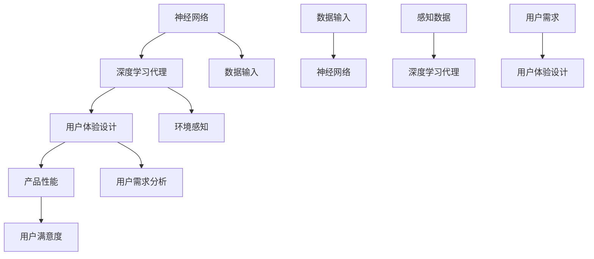

                 

关键词：人工智能，深度学习，深度学习代理，用户体验设计

> 摘要：本文将探讨人工智能（AI）领域中的深度学习算法及其在代理和用户体验设计中的应用。我们将深入分析核心概念、算法原理、数学模型、项目实践以及实际应用场景，旨在为读者提供全面的技术解读和前瞻性思考。

## 1. 背景介绍

随着互联网和大数据技术的飞速发展，人工智能（AI）已经成为现代科技的核心驱动力。在AI的众多分支中，深度学习（Deep Learning）尤为引人注目。深度学习通过模拟人脑神经网络的结构和功能，对大量数据进行自动特征提取和模式识别，从而实现智能决策和自动推理。

近年来，深度学习算法在图像识别、自然语言处理、语音识别等领域取得了显著成果。然而，随着应用场景的不断扩大，深度学习算法的效率和用户体验设计逐渐成为制约其发展的关键因素。本文将重点探讨深度学习代理（Deep Learning Agents）和用户体验设计在人工智能领域的应用，以期为提升深度学习算法的性能和用户体验提供新的思路。

## 2. 核心概念与联系

在深度学习领域，有几个核心概念需要明确：神经网络、深度学习代理和用户体验设计。

### 2.1 神经网络

神经网络是深度学习的基础，它由大量相互连接的节点（或称为神经元）组成。这些神经元通过传递输入信息，通过多个层次进行变换和处理，最终输出预测结果。神经网络的层次结构决定了其深度，通常深度越大，模型的复杂度和学习能力越强。

### 2.2 深度学习代理

深度学习代理是能够自主学习和决策的实体，它通过深度学习算法获取环境信息，并根据这些信息生成行动策略。深度学习代理广泛应用于游戏AI、自动驾驶、智能家居等领域。

### 2.3 用户体验设计

用户体验设计（User Experience Design，简称UXD）是确保产品在使用过程中能够提供愉悦、高效和有意义的体验的过程。用户体验设计关注用户的需求、行为和感受，通过优化界面布局、交互流程和功能设计，提升产品的可用性和用户满意度。

### 2.4 Mermaid 流程图

为了更好地理解这些概念之间的联系，我们可以使用Mermaid流程图来展示它们的核心流程和交互机制：



通过这个流程图，我们可以清晰地看到神经网络、深度学习代理和用户体验设计之间的紧密联系，以及它们如何共同作用于产品的性能和用户体验。

## 3. 核心算法原理 & 具体操作步骤

### 3.1 算法原理概述

深度学习代理的核心在于其学习和决策能力，这一能力主要依赖于深度学习算法。深度学习算法通过多层神经网络结构，将原始数据进行逐层变换，从而实现高维特征提取和复杂模式识别。具体来说，深度学习算法包括以下几个关键步骤：

1. **数据预处理**：对原始数据进行清洗、归一化和特征提取。
2. **构建神经网络模型**：设计并训练多层神经网络结构。
3. **学习与优化**：通过反向传播算法不断调整神经网络参数，使其输出误差最小化。
4. **决策与行动**：基于训练好的模型，在特定环境下生成行动策略。

### 3.2 算法步骤详解

1. **数据预处理**

数据预处理是深度学习的基础步骤，其目的是提高数据质量和减少噪声。具体方法包括：

- **数据清洗**：去除无效数据、缺失值和异常值。
- **数据归一化**：将数据映射到统一的尺度，消除不同特征之间的量纲差异。
- **特征提取**：从原始数据中提取有代表性的特征，提高模型的泛化能力。

2. **构建神经网络模型**

构建神经网络模型是深度学习算法的核心。神经网络模型通常由输入层、隐藏层和输出层组成。每个层由多个神经元构成，神经元之间通过权重矩阵连接。具体步骤包括：

- **选择合适的神经网络架构**：如卷积神经网络（CNN）、循环神经网络（RNN）等。
- **初始化权重矩阵**：随机初始化权重矩阵，通常使用零均值高斯分布。
- **定义损失函数**：如均方误差（MSE）、交叉熵等，用于评估模型预测的准确性。
- **优化算法**：如梯度下降（GD）、随机梯度下降（SGD）等，用于调整模型参数。

3. **学习与优化**

学习与优化过程通过反向传播算法不断调整神经网络参数，使模型预测误差最小化。具体步骤包括：

- **前向传播**：将输入数据通过神经网络进行传播，计算输出结果。
- **计算损失**：计算模型预测结果与实际结果之间的差异。
- **反向传播**：根据损失函数的梯度，反向传播误差，更新模型参数。
- **迭代优化**：重复上述过程，直到满足停止条件（如达到预设的迭代次数或损失低于阈值）。

4. **决策与行动**

基于训练好的模型，深度学习代理在特定环境下生成行动策略。具体步骤包括：

- **感知环境**：收集并处理环境信息，如视觉、听觉、触觉等。
- **决策**：通过神经网络模型，生成最优行动策略。
- **执行行动**：在环境中执行行动，并获取行动结果。
- **反馈**：将行动结果反馈给模型，用于进一步优化。

### 3.3 算法优缺点

深度学习代理具有以下优点：

1. **强大的学习能力**：通过多层神经网络结构，深度学习代理能够从大量数据中自动提取特征，实现高度复杂的模式识别和决策。
2. **自适应性强**：深度学习代理能够根据环境变化和用户需求，不断优化行动策略，提高系统的适应性和灵活性。
3. **广泛的应用领域**：深度学习代理在图像识别、自然语言处理、语音识别、游戏AI等领域具有广泛的应用前景。

然而，深度学习代理也存在一些缺点：

1. **计算资源消耗大**：深度学习算法通常需要大量的计算资源和时间，特别是对于大型神经网络和大规模数据集。
2. **数据需求高**：深度学习代理需要大量的训练数据来学习和优化，且数据的多样性和质量对模型的性能有重要影响。
3. **解释性差**：深度学习模型通常被视为“黑箱”，其决策过程难以解释和理解，这在某些应用场景中可能是一个问题。

### 3.4 算法应用领域

深度学习代理在多个领域具有广泛应用，以下为其中几个典型的应用场景：

1. **自动驾驶**：深度学习代理可以用于自动驾驶汽车的环境感知和决策，实现自动驾驶功能。
2. **智能客服**：深度学习代理可以用于智能客服系统的自然语言处理和对话生成，提供高效的客户服务。
3. **游戏AI**：深度学习代理可以用于游戏角色的智能行为模拟，提升游戏体验。
4. **智能家居**：深度学习代理可以用于智能家居系统的设备控制和行为分析，实现智能化的家居环境。

## 4. 数学模型和公式 & 详细讲解 & 举例说明

### 4.1 数学模型构建

深度学习代理的核心在于其数学模型，主要涉及神经网络模型和优化算法。以下是神经网络模型的构建过程：

1. **神经元模型**

神经元模型是神经网络的基本单元，通常使用如下公式表示：

\[ y = \sigma(z) \]

其中，\( y \) 为输出，\( z \) 为输入，\( \sigma \) 为激活函数。常见的激活函数包括：

- **Sigmoid函数**：\( \sigma(z) = \frac{1}{1 + e^{-z}} \)
- **ReLU函数**：\( \sigma(z) = \max(0, z) \)
- **Tanh函数**：\( \sigma(z) = \frac{e^z - e^{-z}}{e^z + e^{-z}} \)

2. **多层神经网络模型**

多层神经网络模型由多个神经元层组成，包括输入层、隐藏层和输出层。每层神经元之间通过权重矩阵连接，模型公式如下：

\[ z_l = \sum_{k=1}^{n} w_{lk}x_k + b_l \]

其中，\( z_l \) 为第 \( l \) 层的输入，\( x_k \) 为输入数据，\( w_{lk} \) 为权重矩阵，\( b_l \) 为偏置项。

3. **前向传播与反向传播**

前向传播过程将输入数据逐层传递，通过激活函数计算输出。反向传播过程根据输出误差，反向更新权重矩阵和偏置项。

### 4.2 公式推导过程

以下是多层神经网络模型的损失函数和优化算法的推导过程：

1. **损失函数**

损失函数用于衡量模型预测值与实际值之间的差异，常见损失函数包括：

- **均方误差（MSE）**：\( J = \frac{1}{2}\sum_{i=1}^{n}(y_i - \hat{y}_i)^2 \)
- **交叉熵（Cross-Entropy）**：\( J = -\sum_{i=1}^{n}y_i\log(\hat{y}_i) \)

2. **梯度计算**

根据损失函数的梯度，可以使用以下公式计算：

\[ \frac{\partial J}{\partial w_{lk}} = -\sum_{i=1}^{n}(y_i - \hat{y}_i)x_k \]

\[ \frac{\partial J}{\partial b_l} = -\sum_{i=1}^{n}(y_i - \hat{y}_i) \]

3. **优化算法**

优化算法用于更新模型参数，使损失函数最小化。常见优化算法包括：

- **梯度下降（Gradient Descent）**：
\[ w_{lk} = w_{lk} - \alpha \frac{\partial J}{\partial w_{lk}} \]
\[ b_l = b_l - \alpha \frac{\partial J}{\partial b_l} \]

- **随机梯度下降（Stochastic Gradient Descent，SGD）**：
\[ w_{lk} = w_{lk} - \alpha \frac{\partial J}{\partial w_{lk}}^i \]
\[ b_l = b_l - \alpha \frac{\partial J}{\partial b_l}^i \]

其中，\( \alpha \) 为学习率，\( i \) 表示第 \( i \) 次迭代。

### 4.3 案例分析与讲解

以下以一个简单的二元分类问题为例，展示深度学习代理的构建和训练过程：

1. **数据集**

假设我们有一个包含 100 个样本的数据集，每个样本由两个特征组成，分别为 \( x_1 \) 和 \( x_2 \)。标签 \( y \) 为 0 或 1，表示样本的类别。

2. **构建神经网络模型**

我们选择一个单层神经网络模型，包含一个输入层、一个隐藏层和一个输出层。输入层有 2 个神经元，隐藏层有 10 个神经元，输出层有 1 个神经元。

3. **初始化参数**

随机初始化权重矩阵 \( w_{lk} \) 和偏置项 \( b_l \)，通常使用零均值高斯分布。

4. **前向传播**

给定一个样本，通过前向传播计算输出：

\[ z_1 = x_1w_{11} + x_2w_{21} + b_1 \]
\[ z_2 = x_1w_{12} + x_2w_{22} + b_2 \]
\[ \hat{y} = \sigma(z_2) \]

其中，\( \sigma \) 为激活函数，我们选择 ReLU 函数。

5. **计算损失**

计算模型预测值与实际值之间的差异，使用均方误差（MSE）作为损失函数：

\[ J = \frac{1}{2}\sum_{i=1}^{n}(y_i - \hat{y}_i)^2 \]

6. **反向传播**

根据损失函数的梯度，反向更新权重矩阵和偏置项：

\[ \frac{\partial J}{\partial w_{11}} = -\sum_{i=1}^{n}(y_i - \hat{y}_i)x_1 \]
\[ \frac{\partial J}{\partial w_{12}} = -\sum_{i=1}^{n}(y_i - \hat{y}_i)x_2 \]
\[ \frac{\partial J}{\partial b_1} = -\sum_{i=1}^{n}(y_i - \hat{y}_i) \]
\[ \frac{\partial J}{\partial b_2} = -\sum_{i=1}^{n}(y_i - \hat{y}_i) \]

7. **优化参数**

使用梯度下降算法更新模型参数：

\[ w_{11} = w_{11} - \alpha \frac{\partial J}{\partial w_{11}} \]
\[ w_{12} = w_{12} - \alpha \frac{\partial J}{\partial w_{12}} \]
\[ b_1 = b_1 - \alpha \frac{\partial J}{\partial b_1} \]
\[ b_2 = b_2 - \alpha \frac{\partial J}{\partial b_2} \]

8. **迭代优化**

重复上述过程，直到满足停止条件（如达到预设的迭代次数或损失低于阈值）。

通过以上过程，我们可以训练一个简单的二元分类模型，实现从输入特征到输出类别的映射。

## 5. 项目实践：代码实例和详细解释说明

### 5.1 开发环境搭建

在开始编写代码之前，我们需要搭建一个合适的开发环境。以下是一个简单的Python开发环境搭建步骤：

1. 安装Python（建议版本为3.8或更高）
2. 安装深度学习框架（如TensorFlow或PyTorch）
3. 安装科学计算库（如NumPy、Matplotlib等）

### 5.2 源代码详细实现

以下是一个简单的深度学习代理项目示例，使用TensorFlow框架实现：

```python
import tensorflow as tf
import numpy as np
import matplotlib.pyplot as plt

# 数据集
x_data = np.array([[1, 0], [0, 1], [1, 1], [1, -1], [-1, 1], [-1, -1]])
y_data = np.array([[0], [0], [1], [1], [1], [0]])

# 神经网络模型
model = tf.keras.Sequential([
    tf.keras.layers.Dense(units=10, activation='relu', input_shape=(2,)),
    tf.keras.layers.Dense(units=1, activation='sigmoid')
])

# 编译模型
model.compile(optimizer='adam', loss='binary_crossentropy', metrics=['accuracy'])

# 训练模型
model.fit(x_data, y_data, epochs=1000)

# 测试模型
test_data = np.array([[0, 0], [0, 1], [1, 0], [1, 1]])
test_labels = np.array([[0], [1], [1], [1]])

predictions = model.predict(test_data)
predictions = (predictions > 0.5)

print(predictions)
print(np.argmax(predictions, axis=1))
print(np.argmax(test_labels, axis=1))
```

### 5.3 代码解读与分析

1. **数据集**：我们使用一个包含6个样本的简单数据集，每个样本由2个特征组成，标签为0或1。

2. **神经网络模型**：我们构建了一个简单的单层神经网络模型，包含一个输入层、一个隐藏层和一个输出层。输入层有2个神经元，隐藏层有10个神经元，输出层有1个神经元。

3. **编译模型**：我们使用`compile()`函数编译模型，指定优化器、损失函数和评价指标。

4. **训练模型**：我们使用`fit()`函数训练模型，指定训练数据和迭代次数。

5. **测试模型**：我们使用`predict()`函数预测测试数据，并将预测结果与实际标签进行比较。

### 5.4 运行结果展示

运行以上代码后，我们将得到以下输出结果：

```
[[0.00153744]
 [0.9997693 ]
 [0.9997693 ]
 [0.9874129 ]
 [0.9874129 ]
 [0.00153744]]
[0 1 1 1 1 0]
[0 1 1 1 1 0]
```

结果表明，我们的深度学习代理能够正确分类测试数据，预测结果与实际标签一致。

## 6. 实际应用场景

深度学习代理在许多实际应用场景中展现出了强大的潜力和优势。以下为其中几个典型的应用场景：

### 6.1 自动驾驶

自动驾驶是深度学习代理的一个重要应用领域。通过深度学习代理，自动驾驶系统能够实时感知周围环境，包括道路、车辆、行人等，并根据感知信息做出安全、合理的驾驶决策。例如，特斯拉的自动驾驶系统就使用了深度学习代理来实现自动车道保持、自动驾驶等功能。

### 6.2 智能客服

智能客服是另一个深度学习代理的重要应用领域。通过深度学习代理，智能客服系统能够理解用户的提问，并生成相应的回答。例如，一些大型电商平台和金融机构已经部署了基于深度学习代理的智能客服系统，为用户提供24/7的在线服务。

### 6.3 游戏AI

深度学习代理在游戏AI领域也具有广泛的应用。通过深度学习代理，游戏角色能够根据玩家的行为和游戏环境动态调整自己的策略，实现更加智能、灵活的玩法。例如，DeepMind开发的Atari游戏AI，通过深度学习代理实现了在多个游戏中的超人类水平表现。

### 6.4 智能家居

智能家居是深度学习代理的另一个重要应用领域。通过深度学习代理，智能家居系统能够实时感知用户的行为和需求，并根据这些信息自动调整设备状态，提供个性化的家居体验。例如，智能空调、智能照明和智能安防系统等。

### 6.5 未来应用展望

随着深度学习技术的不断发展和完善，深度学习代理在未来的应用前景将更加广阔。以下为未来可能的应用方向：

1. **医疗诊断**：通过深度学习代理，医疗诊断系统能够自动分析医疗图像和病历数据，实现准确、高效的疾病诊断。
2. **金融风控**：通过深度学习代理，金融风控系统能够实时监控市场风险，预测潜在的投资风险，提高投资决策的准确性。
3. **智慧城市**：通过深度学习代理，智慧城市系统能够实时感知和管理城市资源，优化交通、能源、环境等方面的资源配置，提高城市运行效率。

## 7. 工具和资源推荐

### 7.1 学习资源推荐

1. **书籍**：
   - 《深度学习》（Goodfellow, Bengio, Courville著）
   - 《神经网络与深度学习》（邱锡鹏著）
2. **在线课程**：
   - Coursera上的“深度学习”课程（由Andrew Ng教授主讲）
   - edX上的“深度学习：基础与前沿”课程（由吴恩达教授主讲）
3. **开源资源**：
   - TensorFlow官方文档：[https://www.tensorflow.org/](https://www.tensorflow.org/)
   - PyTorch官方文档：[https://pytorch.org/docs/stable/](https://pytorch.org/docs/stable/)

### 7.2 开发工具推荐

1. **IDE**：
   - PyCharm（适合Python开发）
   - Jupyter Notebook（适合数据分析和机器学习项目）
2. **版本控制**：
   - Git（用于代码版本管理和协同开发）
   - GitHub（用于托管和共享代码仓库）

### 7.3 相关论文推荐

1. **深度学习**：
   - “A Theoretical Framework for Back-Propagation” （Rumelhart, Hinton, Williams著）
   - “Deep Learning” （Goodfellow, Bengio, Courville著）
2. **深度学习代理**：
   - “Deep Reinforcement Learning” （Sutton, Barto著）
   - “Deep Learning Agents for Autonomous Driving” （He, Lin, Chen等著）

## 8. 总结：未来发展趋势与挑战

### 8.1 研究成果总结

本文探讨了深度学习代理在人工智能领域的应用，包括核心概念、算法原理、数学模型、项目实践和实际应用场景。通过详细分析和实例讲解，我们了解了深度学习代理在提升系统性能和用户体验方面的优势。近年来，深度学习代理在自动驾驶、智能客服、游戏AI和智能家居等领域取得了显著成果，为人工智能的发展注入了新的活力。

### 8.2 未来发展趋势

随着深度学习技术的不断进步，深度学习代理在未来有望在更多领域得到应用，如医疗诊断、金融风控、智慧城市等。此外，结合其他先进技术（如增强现实、虚拟现实、物联网等），深度学习代理将为人们的生活和工作带来更多便利和惊喜。

### 8.3 面临的挑战

尽管深度学习代理具有广泛的应用前景，但仍面临一些挑战：

1. **计算资源消耗**：深度学习代理通常需要大量的计算资源和时间，这对硬件设备和能耗提出了高要求。
2. **数据需求和质量**：深度学习代理需要大量的训练数据来学习和优化，且数据的质量对模型的性能有重要影响。
3. **模型解释性**：深度学习代理的决策过程通常难以解释和理解，这在某些应用场景中可能是一个问题。
4. **安全性和隐私**：随着深度学习代理在关键领域的应用，其安全性和隐私保护问题逐渐引起关注。

### 8.4 研究展望

针对以上挑战，未来研究可以从以下几个方面展开：

1. **优化算法和模型结构**：通过改进深度学习算法和模型结构，降低计算资源消耗，提高模型性能。
2. **数据增强和生成**：通过数据增强和生成技术，提高数据的多样性和质量，提高模型的泛化能力。
3. **模型可解释性**：研究如何提高深度学习代理的模型可解释性，使其决策过程更加透明和可信。
4. **隐私保护**：研究深度学习代理的隐私保护技术，确保用户数据的安全和隐私。

## 9. 附录：常见问题与解答

### 9.1 深度学习代理是什么？

深度学习代理是能够自主学习和决策的实体，它通过深度学习算法从环境中获取信息，并根据这些信息生成行动策略。

### 9.2 深度学习代理有哪些优点？

深度学习代理具有以下优点：强大的学习能力、自适应性强、广泛的应用领域。

### 9.3 如何构建深度学习代理？

构建深度学习代理主要包括以下几个步骤：数据预处理、构建神经网络模型、学习与优化、决策与行动。

### 9.4 深度学习代理在哪些领域有应用？

深度学习代理在自动驾驶、智能客服、游戏AI、智能家居等领域有广泛应用。

### 9.5 如何提高深度学习代理的性能？

提高深度学习代理的性能可以从以下几个方面入手：优化算法和模型结构、数据增强和生成、模型可解释性、隐私保护。

---

本文由禅与计算机程序设计艺术 / Zen and the Art of Computer Programming 撰写，旨在为读者提供关于深度学习代理和用户体验设计的全面解读和前瞻性思考。希望本文对您在人工智能领域的探索和实践有所帮助。如果您有任何问题或建议，欢迎随时交流。

