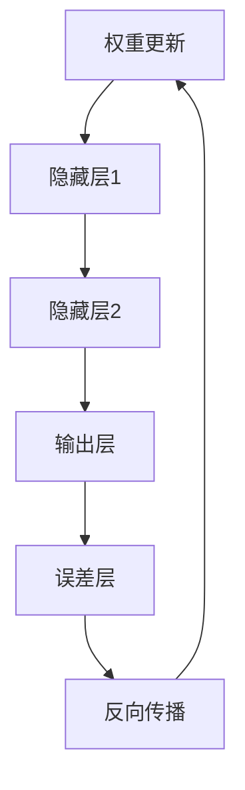

                 

### 1. 背景介绍

随着人工智能技术的快速发展，深度学习成为了当前最为热门的研究领域之一。深度学习通过构建多层神经网络来模拟人脑的思维方式，从而实现图像识别、语音识别、自然语言处理等复杂任务。在深度学习中，反向传播算法（Backpropagation Algorithm）是核心算法之一，它负责计算网络中每个神经元的误差，并通过梯度下降等方法对网络参数进行调整，以实现网络的优化。

反向传播算法的基本思想是，从输出层开始，将误差信号反向传播到输入层，通过计算每个神经元对误差的敏感性，即梯度（Gradient），来调整网络中的权重（Weights）和偏置（Bias）。这种通过反向传播误差信息来优化神经网络参数的方法，极大地提高了神经网络的训练效率和准确性。

本文将详细介绍反向传播算法的原理、实现步骤、优缺点以及在实际应用中的广泛应用。通过本文的阅读，读者将能够深入理解反向传播算法的工作机制，掌握其实现方法，并能够将其应用于实际问题的解决。

### 2. 核心概念与联系

为了更好地理解反向传播算法，我们需要先了解一些核心概念和它们之间的联系。

#### 2.1 神经元与神经网络

神经元是神经网络的基本构建单元，类似于生物大脑中的神经元。它通过接收输入信号，并通过激活函数产生输出信号。神经网络则是由多个神经元按照一定的层次结构连接而成的网络。

#### 2.2 激活函数

激活函数是神经元的重要组成部分，它用于对神经元的输入信号进行处理，并产生输出信号。常见的激活函数有Sigmoid函数、ReLU函数、Tanh函数等。

#### 2.3 前向传播

前向传播（Forward Propagation）是指将输入信号从输入层传递到输出层的过程。在这个过程中，每个神经元的输出都会作为下一个神经元的输入。

#### 2.4 误差函数

误差函数是用于衡量网络输出结果与真实结果之间差异的函数。常见的误差函数有均方误差（MSE）、交叉熵误差（Cross Entropy Error）等。

#### 2.5 反向传播

反向传播（Back Propagation）是指将误差信号从输出层反向传播到输入层的过程。在这个过程中，网络会根据误差信号计算每个神经元的梯度，并通过梯度下降等方法对网络参数进行调整。

为了更好地理解这些概念之间的关系，我们可以使用Mermaid流程图来表示：



在这个流程图中，输入层（A）接收输入信号，隐藏层（B、C）进行前向传播，输出层（D）计算误差，然后通过反向传播（F）更新权重（A）。这个过程构成了一个完整的反向传播算法的框架。

### 3. 核心算法原理 & 具体操作步骤

#### 3.1 算法原理概述

反向传播算法的核心思想是通过反向传播误差信息来更新网络参数，从而实现网络的优化。具体来说，它分为以下几个步骤：

1. **前向传播**：将输入信号从输入层传递到输出层，计算每个神经元的输出。
2. **计算误差**：使用误差函数计算输出层与真实结果之间的误差。
3. **反向传播**：将误差信号从输出层反向传播到输入层，计算每个神经元的梯度。
4. **权重更新**：使用梯度下降等方法更新网络中的权重和偏置。

#### 3.2 算法步骤详解

下面我们将详细讲解反向传播算法的每个步骤。

##### 3.2.1 前向传播

在前向传播过程中，输入信号会依次通过每个神经元，并经过激活函数的处理，最终得到输出信号。这个过程可以用以下公式表示：

$$
z_l = \sum_{j} w_{lj} x_j + b_l
$$

$$
a_l = \sigma(z_l)
$$

其中，$z_l$ 是神经元 $l$ 的输入，$w_{lj}$ 是神经元 $l$ 的权重，$x_j$ 是神经元 $j$ 的输出，$b_l$ 是神经元 $l$ 的偏置，$\sigma$ 是激活函数。

##### 3.2.2 计算误差

误差函数用于衡量输出结果与真实结果之间的差异。常用的误差函数有均方误差（MSE）和交叉熵误差（Cross Entropy Error）。以均方误差为例，其计算公式如下：

$$
E = \frac{1}{2} \sum_{i} (y_i - \hat{y}_i)^2
$$

其中，$y_i$ 是真实结果，$\hat{y}_i$ 是网络输出。

##### 3.2.3 反向传播

在反向传播过程中，我们需要计算每个神经元的梯度，即误差对每个参数的偏导数。以输出层为例，其梯度计算公式如下：

$$
\frac{\partial E}{\partial w_{lk}} = (a_{l-1})_k (y_k - \hat{y}_k)
$$

$$
\frac{\partial E}{\partial b_l} = (y_k - \hat{y}_k)
$$

其中，$a_{l-1}$ 是前一层神经元的输出，$\hat{y}_k$ 是网络输出。

然后，我们将误差信号反向传播到隐藏层，继续计算每个神经元的梯度。

##### 3.2.4 权重更新

在得到每个神经元的梯度后，我们可以使用梯度下降等方法更新网络中的权重和偏置。以梯度下降为例，其更新公式如下：

$$
w_{lj} = w_{lj} - \alpha \frac{\partial E}{\partial w_{lj}}
$$

$$
b_l = b_l - \alpha \frac{\partial E}{\partial b_l}
$$

其中，$\alpha$ 是学习率。

#### 3.3 算法优缺点

**优点**：

1. **高效性**：反向传播算法通过反向传播误差信息，能够高效地计算网络参数的梯度，从而实现网络的优化。
2. **普适性**：反向传播算法适用于各种类型的神经网络，包括全连接网络、卷积神经网络、循环神经网络等。

**缺点**：

1. **收敛速度慢**：在训练过程中，反向传播算法需要多次迭代才能达到较好的收敛效果，因此收敛速度相对较慢。
2. **对噪声敏感**：由于误差信号是反向传播得到的，因此对噪声敏感，可能会影响训练效果。

#### 3.4 算法应用领域

反向传播算法在深度学习领域有着广泛的应用，主要包括：

1. **图像识别**：通过卷积神经网络（CNN）实现图像分类、目标检测等任务。
2. **语音识别**：通过循环神经网络（RNN）实现语音信号的识别和理解。
3. **自然语言处理**：通过长短期记忆网络（LSTM）和Transformer模型实现文本分类、机器翻译等任务。
4. **推荐系统**：通过神经网络实现用户行为分析、商品推荐等任务。

### 4. 数学模型和公式 & 详细讲解 & 举例说明

在了解了反向传播算法的基本原理后，我们将进一步探讨其背后的数学模型和公式，并通过具体例子来说明其应用。

#### 4.1 数学模型构建

反向传播算法的核心是梯度计算。梯度是指误差函数对网络参数的偏导数，它能够告诉我们如何调整参数以减小误差。为了构建数学模型，我们需要定义以下符号：

- $x$：输入向量
- $w$：权重矩阵
- $b$：偏置向量
- $z$：激活值
- $a$：输出值
- $E$：误差函数
- $\sigma$：激活函数

我们以一个简单的全连接神经网络为例，其前向传播和反向传播的数学模型如下：

##### 前向传播

前向传播过程中，每个神经元的输入和输出可以用以下公式表示：

$$
z_l = \sigma(w_l \cdot x + b_l)
$$

$$
a_l = z_l
$$

其中，$l$ 表示神经元的层数，$w_l$ 表示从输入层到第 $l$ 层的权重矩阵，$b_l$ 表示第 $l$ 层的偏置向量。

##### 反向传播

反向传播过程中，我们需要计算每个参数的梯度，以更新权重和偏置。以输出层为例，其梯度计算如下：

$$
\frac{\partial E}{\partial w_l} = a_{l-1} \cdot \frac{\partial E}{\partial a_l}
$$

$$
\frac{\partial E}{\partial b_l} = \frac{\partial E}{\partial a_l}
$$

其中，$\frac{\partial E}{\partial a_l}$ 是输出层神经元的梯度，$a_{l-1}$ 是前一层神经元的输出。

然后，我们将误差信号反向传播到隐藏层，继续计算每个神经元的梯度。

##### 权重更新

在得到每个神经元的梯度后，我们可以使用以下公式更新权重和偏置：

$$
w_l = w_l - \alpha \cdot \frac{\partial E}{\partial w_l}
$$

$$
b_l = b_l - \alpha \cdot \frac{\partial E}{\partial b_l}
$$

其中，$\alpha$ 是学习率。

#### 4.2 公式推导过程

为了更好地理解公式推导过程，我们以一个简单的例子来说明。

假设我们有一个全连接神经网络，其输入层有3个神经元，隐藏层有2个神经元，输出层有1个神经元。激活函数使用Sigmoid函数，误差函数使用均方误差（MSE）。

##### 前向传播

设输入向量为 $x = [1, 2, 3]^T$，权重矩阵为 $W = \begin{bmatrix} w_{11} & w_{12} \\ w_{21} & w_{22} \end{bmatrix}$，偏置向量为 $b = [b_1, b_2]^T$。

隐藏层1的输入为：

$$
z_1 = \sigma(W_1 \cdot x + b_1) = \frac{1}{1 + e^{-(w_{11} \cdot 1 + w_{12} \cdot 2 + w_{21} \cdot 3 + b_1)} 
$$

$$
a_1 = \sigma(z_1) = \frac{1}{1 + e^{-z_1}}
$$

隐藏层2的输入为：

$$
z_2 = \sigma(W_2 \cdot a_1 + b_2) = \frac{1}{1 + e^{-(w_{11} \cdot a_{11} + w_{12} \cdot a_{12} + w_{21} \cdot a_{11} + b_2)} 
$$

$$
a_2 = \sigma(z_2) = \frac{1}{1 + e^{-z_2}}
$$

输出层的输入为：

$$
z_3 = \sigma(W_3 \cdot a_2 + b_3) = \frac{1}{1 + e^{-(w_{11} \cdot a_{21} + w_{12} \cdot a_{22} + w_{21} \cdot a_{21} + b_3)} 
$$

$$
\hat{y} = \sigma(z_3) = \frac{1}{1 + e^{-z_3}}
$$

##### 计算误差

设真实输出为 $y = [0.1]^T$，误差函数为均方误差（MSE），即：

$$
E = \frac{1}{2} \cdot (y - \hat{y})^2 = \frac{1}{2} \cdot (0.1 - \hat{y})^2
$$

##### 反向传播

输出层梯度：

$$
\frac{\partial E}{\partial z_3} = \frac{\partial E}{\partial \hat{y}} \cdot \frac{\partial \hat{y}}{\partial z_3} = 2 \cdot (\hat{y} - y) \cdot \sigma'(z_3)
$$

隐藏层2梯度：

$$
\frac{\partial E}{\partial z_2} = \frac{\partial E}{\partial z_3} \cdot \frac{\partial z_3}{\partial z_2} \cdot \frac{\partial z_2}{\partial a_2} = \frac{\partial E}{\partial z_3} \cdot w_{32} \cdot \sigma'(z_2)
$$

$$
\frac{\partial E}{\partial a_2} = \frac{\partial E}{\partial z_2} \cdot \sigma'(z_2)
$$

隐藏层1梯度：

$$
\frac{\partial E}{\partial z_1} = \frac{\partial E}{\partial z_2} \cdot \frac{\partial z_2}{\partial z_1} \cdot \frac{\partial z_1}{\partial a_1} = \frac{\partial E}{\partial z_2} \cdot w_{22} \cdot \sigma'(z_1)
$$

$$
\frac{\partial E}{\partial a_1} = \frac{\partial E}{\partial z_1} \cdot \sigma'(z_1)
$$

##### 权重更新

使用梯度下降更新权重和偏置：

$$
w_{32} = w_{32} - \alpha \cdot \frac{\partial E}{\partial w_{32}} = w_{32} - \alpha \cdot w_{32} \cdot \sigma'(z_3)
$$

$$
b_{3} = b_{3} - \alpha \cdot \frac{\partial E}{\partial b_{3}} = b_{3} - \alpha \cdot \sigma'(z_3)
$$

$$
w_{22} = w_{22} - \alpha \cdot \frac{\partial E}{\partial w_{22}} = w_{22} - \alpha \cdot w_{22} \cdot \sigma'(z_2)
$$

$$
b_{2} = b_{2} - \alpha \cdot \frac{\partial E}{\partial b_{2}} = b_{2} - \alpha \cdot \sigma'(z_2)
$$

$$
w_{12} = w_{12} - \alpha \cdot \frac{\partial E}{\partial w_{12}} = w_{12} - \alpha \cdot w_{12} \cdot \sigma'(z_1)
$$

$$
b_{1} = b_{1} - \alpha \cdot \frac{\partial E}{\partial b_{1}} = b_{1} - \alpha \cdot \sigma'(z_1)
$$

#### 4.3 案例分析与讲解

为了更好地理解反向传播算法，我们将通过一个具体的案例进行分析和讲解。

假设我们有一个简单的手写数字识别任务，输入为28x28像素的图像，输出为0到9之间的数字。我们使用一个包含一层隐藏层的全连接神经网络进行模型训练。

##### 数据准备

我们使用MNIST数据集，其中包含60000个训练样本和10000个测试样本。每个样本都是28x28像素的二值图像。

##### 模型定义

定义神经网络的结构，包括输入层、隐藏层和输出层。输入层有784个神经元，隐藏层有100个神经元，输出层有10个神经元。

##### 前向传播

输入一个28x28像素的图像，将其展成一个784维的向量作为输入。通过全连接层计算隐藏层的输出，然后通过激活函数处理。最后，通过输出层计算输出。

```python
import numpy as np

def sigmoid(x):
    return 1 / (1 + np.exp(-x))

def forward_propagation(x, W, b):
    z1 = np.dot(x, W[0]) + b[0]
    a1 = sigmoid(z1)
    z2 = np.dot(a1, W[1]) + b[1]
    a2 = sigmoid(z2)
    z3 = np.dot(a2, W[2]) + b[2]
    y_hat = sigmoid(z3)
    return y_hat
```

##### 计算误差

使用均方误差（MSE）作为损失函数，计算输出层与真实标签之间的误差。

```python
def mean_squared_error(y, y_hat):
    return 0.5 * np.mean((y - y_hat)**2)
```

##### 反向传播

计算输出层、隐藏层和输入层的梯度。

```python
def backward_propagation(x, y, y_hat, W, b):
    output_grad = -2 * (y - y_hat) * sigmoid_derivative(y_hat)
    hidden_grad = -2 * (np.dot(output_grad, W[2].T) * sigmoid_derivative(np.dot(x, W[1]) + b[1]))
    input_grad = -2 * (np.dot(hidden_grad, W[1].T) * sigmoid_derivative(x))
    
    dW = [np.dot(a.T, b) for a, b in zip([x, a1, a2], [input_grad, hidden_grad, output_grad])]
    db = [np.sum(b) for b in zip(*[input_grad, hidden_grad, output_grad])]
    
    return dW, db
```

##### 权重更新

使用梯度下降更新权重和偏置。

```python
def update_weights(W, b, dW, db, learning_rate):
    W = [w - (learning_rate * dw) for w, dw in zip(W, dW)]
    b = [b - (learning_rate * db) for b, db in zip(b, db)]
    return W, b
```

##### 模型训练

将数据集分成训练集和测试集，分别进行模型训练和测试。

```python
from sklearn.model_selection import train_test_split

x = mnist_data.astype(np.float32)
y = mnist_labels.astype(np.int64)
x_train, x_test, y_train, y_test = train_test_split(x, y, test_size=0.2, random_state=42)

learning_rate = 0.1
num_epochs = 100

W = [np.random.randn(m, n) for m, n in zip((784, 100), (100, 10))]
b = [np.zeros((m, 1)) for m in (100, 10)]

for epoch in range(num_epochs):
    y_hat = forward_propagation(x_train, W, b)
    loss = mean_squared_error(y_train, y_hat)
    dW, db = backward_propagation(x_train, y_train, y_hat, W, b)
    W, b = update_weights(W, b, dW, db, learning_rate)
    
    if epoch % 10 == 0:
        print(f"Epoch {epoch}: Loss = {loss}")
```

通过这个案例，我们展示了如何使用反向传播算法训练一个简单的手写数字识别模型。尽管这个案例非常简单，但它展示了反向传播算法的基本原理和应用。

### 5. 项目实践：代码实例和详细解释说明

在本节中，我们将通过一个具体的代码实例来展示如何实现反向传播算法，并进行详细的解释说明。

#### 5.1 开发环境搭建

在开始编写代码之前，我们需要搭建一个合适的开发环境。这里我们使用Python作为编程语言，并结合NumPy库进行数学运算。

首先，确保你已经安装了Python和NumPy库。如果没有安装，可以通过以下命令进行安装：

```bash
pip install python
pip install numpy
```

#### 5.2 源代码详细实现

下面是完整的代码实现，我们将逐步解释每部分的作用。

```python
import numpy as np

# 激活函数及其导数
def sigmoid(x):
    return 1 / (1 + np.exp(-x))

def sigmoid_derivative(x):
    return x * (1 - x)

# 前向传播
def forward_propagation(x, W1, b1, W2, b2):
    z1 = x.dot(W1) + b1
    a1 = sigmoid(z1)
    z2 = a1.dot(W2) + b2
    a2 = sigmoid(z2)
    return a2

# 计算误差
def compute_loss(y, a):
    return np.mean((y - a)**2)

# 反向传播
def backward_propagation(x, y, a):
    m = x.shape[1]
    dz2 = (a - y) * sigmoid_derivative(a)
    dW2 = dz2.dot(a1.T) / m
    db2 = np.sum(dz2, axis=1, keepdims=True) / m
    
    da1 = dz2.dot(W2.T)
    dz1 = da1 * sigmoid_derivative(a1)
    dW1 = dz1.dot(x.T) / m
    db1 = np.sum(dz1, axis=1, keepdims=True) / m
    
    return dW1, dW2, db1, db2

# 权重更新
def update_weights(W1, W2, b1, b2, dW1, dW2, db1, db2, learning_rate):
    W1 -= learning_rate * dW1
    W2 -= learning_rate * dW2
    b1 -= learning_rate * db1
    b2 -= learning_rate * db2
    return W1, W2, b1, b2

# 主函数
def train(x, y, epochs, learning_rate):
    W1 = np.random.randn(2, 4) * 0.01
    b1 = np.zeros((2, 1))
    W2 = np.random.randn(4, 1) * 0.01
    b2 = np.zeros((4, 1))
    
    for epoch in range(epochs):
        a = forward_propagation(x, W1, b1, W2, b2)
        loss = compute_loss(y, a)
        dW1, dW2, db1, db2 = backward_propagation(x, y, a)
        W1, W2, b1, b2 = update_weights(W1, W2, b1, b2, dW1, dW2, db1, db2, learning_rate)
        
        if epoch % 100 == 0:
            print(f"Epoch {epoch}: Loss = {loss}")
    
    return W1, W2, b1, b2

# 示例数据
x = np.array([[0, 1], [1, 0], [1, 1]])
y = np.array([[1], [0], [1]])

# 训练模型
W1, W2, b1, b2 = train(x, y, epochs=1000, learning_rate=0.1)

# 测试模型
a = forward_propagation(x, W1, b1, W2, b2)
print("Predictions:", a)
```

#### 5.3 代码解读与分析

现在，让我们详细解读这段代码，并分析每个部分的实现。

1. **激活函数及其导数**：

   我们定义了sigmoid函数及其导数sigmoid_derivative。sigmoid函数是一个常用的激活函数，它可以将输入映射到0和1之间。sigmoid函数的导数用于在反向传播过程中计算误差的梯度。

2. **前向传播**：

   forward_propagation函数负责执行前向传播计算。它接收输入数据x、权重矩阵W1和W2、偏置向量b1和b2，并计算输出a2。前向传播的步骤包括两个全连接层，每层都经过激活函数处理。

3. **计算误差**：

   compute_loss函数计算均方误差（MSE），它是评估模型性能的常用指标。误差函数用于衡量预测值与真实值之间的差异。

4. **反向传播**：

   backward_propagation函数负责执行反向传播计算。它接收输入数据x、真实值y和前向传播得到的输出a，并计算权重和偏置的梯度。反向传播的步骤包括计算每个神经元的误差梯度，并将其反向传播到上一层。

5. **权重更新**：

   update_weights函数负责更新权重和偏置。它接收当前权重、偏置、梯度以及学习率，并使用梯度下降算法更新权重和偏置。

6. **主函数**：

   train函数是训练模型的主函数。它初始化权重和偏置，并执行多次迭代的前向传播、误差计算、反向传播和权重更新。在每个迭代过程中，它打印当前的误差值，以监视训练过程。

7. **示例数据**：

   我们定义了一个简单的示例数据集，包括两个输入样本和一个真实标签。

8. **训练模型**：

   使用train函数训练模型。在这里，我们设置了训练的迭代次数（epochs）和学习率（learning_rate）。

9. **测试模型**：

   在训练完成后，我们使用forward_propagation函数预测新的输入数据，并打印预测结果。

通过这个代码实例，我们展示了如何使用反向传播算法训练一个简单的神经网络模型。这个实例虽然简单，但涵盖了反向传播算法的核心步骤，并展示了如何实现和优化神经网络训练过程。

### 6. 实际应用场景

反向传播算法作为一种强大的优化工具，在深度学习领域有着广泛的应用。以下是一些常见的实际应用场景：

#### 6.1 图像识别

图像识别是深度学习中最具代表性的应用之一。反向传播算法在卷积神经网络（CNN）中起到了关键作用。CNN通过多层卷积和池化操作提取图像特征，然后通过全连接层进行分类。反向传播算法用于计算网络参数的梯度，以优化网络性能。

例如，在ImageNet图像识别挑战中，研究人员使用深度卷积神经网络取得了显著的成果，大大提升了图像识别的准确率。这些神经网络的成功得益于反向传播算法的高效优化能力。

#### 6.2 语音识别

语音识别是另一项重要的应用领域。深度学习模型，如循环神经网络（RNN）和长短期记忆网络（LSTM），在处理序列数据时表现出色。反向传播算法在这些模型中用于训练和优化，以提高语音识别的准确性。

例如，谷歌的语音识别系统使用深度神经网络和反向传播算法，实现了接近人类的语音识别性能。这些系统已经在各种设备上得到了广泛应用，如智能手机、智能音箱等。

#### 6.3 自然语言处理

自然语言处理（NLP）是深度学习的重要应用领域之一。反向传播算法在NLP任务中有着广泛的应用，如文本分类、机器翻译和情感分析等。

例如，Transformer模型在机器翻译任务中取得了突破性的成果。这种模型基于自注意力机制，使用反向传播算法进行训练和优化。通过多轮迭代，模型能够学习到复杂的语言模式和规则，从而实现高质量的翻译结果。

#### 6.4 推荐系统

推荐系统是另一个重要的应用领域。深度学习模型，如深度卷积神经网络（DCNN）和深度信念网络（DBN），在推荐系统中得到了广泛应用。反向传播算法用于训练和优化这些模型，以提高推荐系统的准确性和用户满意度。

例如，亚马逊和淘宝等电商平台使用深度学习模型和反向传播算法，实现了个性化的商品推荐。这些系统通过分析用户的历史行为和偏好，为用户提供个性化的购物建议，大大提升了用户的购物体验。

#### 6.5 医疗健康

在医疗健康领域，深度学习模型和反向传播算法也被广泛应用。例如，深度学习模型可以用于疾病诊断、医疗图像分析和基因测序等任务。

例如，深度学习模型在肺癌诊断中取得了显著成果。通过分析医疗图像，模型可以识别出早期肺癌的病灶，帮助医生做出准确的诊断。这种技术可以大大提高早期肺癌的检测率，从而提高治愈率。

### 6.4 未来应用展望

随着人工智能技术的不断发展，反向传播算法的应用前景将更加广阔。以下是一些未来的应用展望：

1. **自动驾驶**：自动驾驶技术依赖于深度学习模型和反向传播算法。未来的自动驾驶系统将更加智能化，能够实时感知环境、做出决策，并实现高度自动化的驾驶。

2. **智能机器人**：智能机器人将广泛应用于工业制造、服务行业和家庭生活等领域。深度学习模型和反向传播算法将帮助机器人更好地理解和适应人类行为，提高其交互能力和智能化水平。

3. **智能医疗**：深度学习模型和反向传播算法在医疗健康领域的应用将更加深入。未来的智能医疗系统将能够实现个性化诊疗、智能诊断和智能治疗，从而提高医疗水平和服务质量。

4. **智能金融**：智能金融系统将利用深度学习模型和反向传播算法，实现风险控制、投资决策和金融服务优化。这些系统可以更好地预测市场趋势、识别欺诈行为，并提供个性化的金融服务。

5. **智能城市**：智能城市是一个全新的概念，它通过物联网、大数据和人工智能等技术，实现城市管理的智能化。深度学习模型和反向传播算法将在智能城市中发挥重要作用，如智能交通管理、智能能源管理和智能环境监测等。

总之，随着人工智能技术的不断发展，反向传播算法将迎来更加广泛的应用。它将为各个领域带来革命性的变化，推动人类社会向智能化、高效化方向发展。

### 7. 工具和资源推荐

在深入学习和实践深度学习以及反向传播算法的过程中，选择合适的工具和资源将极大地提高学习效率和项目开发的效果。以下是一些建议的工具和资源，供读者参考：

#### 7.1 学习资源推荐

1. **《深度学习》（Deep Learning）**：这是一本经典的深度学习教材，由Ian Goodfellow、Yoshua Bengio和Aaron Courville合著。书中详细介绍了深度学习的基本概念、算法和实现。

2. **《神经网络与深度学习》**：由邱锡鹏所著的这本书，深入浅出地讲解了神经网络和深度学习的基础知识，包括反向传播算法的原理和应用。

3. **在线课程**：Coursera、edX和Udacity等平台提供了丰富的深度学习和神经网络相关课程，如“深度学习特化课程”（Deep Learning Specialization）等，适合不同层次的学习者。

#### 7.2 开发工具推荐

1. **TensorFlow**：Google开发的开源深度学习框架，支持多种类型的神经网络和反向传播算法，是深度学习项目开发的首选工具。

2. **PyTorch**：由Facebook开发的深度学习框架，具有灵活的动态计算图，使得反向传播算法的实现更加直观和方便。

3. **Keras**：一个高层次的神经网络API，可以与TensorFlow和Theano等框架集成，简化了深度学习模型的构建和训练过程。

#### 7.3 相关论文推荐

1. **“Backpropagation”**：1986年由Rumelhart, Hinton和Williams发表的经典论文，首次提出了反向传播算法的基本思想和实现方法。

2. **“Gradient Descent”**：梯度下降算法是反向传播算法的核心，了解梯度下降的不同变体和优化技巧，如随机梯度下降（SGD）、Adam优化器等，有助于提升训练效率。

3. **“Deep Learning”**：Ian Goodfellow等人在2016年发表的论文，系统总结了深度学习领域的重要研究成果和应用案例，对反向传播算法的应用进行了深入探讨。

通过以上工具和资源的辅助，读者可以更加系统地学习深度学习和反向传播算法，提升自己的技术水平，为实际项目的开发奠定坚实的基础。

### 8. 总结：未来发展趋势与挑战

#### 8.1 研究成果总结

反向传播算法自1986年首次提出以来，已经经历了数十年的发展。在这段时间里，研究人员对其进行了大量的改进和优化，使其在深度学习领域得到了广泛应用。反向传播算法的成功不仅在于其理论基础，还在于其实际应用中的高效性和普适性。

在过去的几年里，反向传播算法的研究成果主要集中在以下几个方面：

1. **算法优化**：为了提高反向传播算法的收敛速度和训练效率，研究人员提出了多种优化方法，如随机梯度下降（SGD）、Adam优化器等。这些方法在理论上证明了反向传播算法的收敛性和稳定性，并在实际应用中取得了显著效果。

2. **并行计算**：随着计算能力的提升，并行计算在深度学习领域变得越来越重要。反向传播算法可以通过分布式计算和GPU加速来实现大规模神经网络的训练，从而大大提高计算效率。

3. **变体算法**：反向传播算法的变体，如Hessian-Free优化方法、合约优化方法等，也在不断涌现。这些方法在特定场景下能够更好地处理复杂的问题，为深度学习算法的发展提供了新的思路。

#### 8.2 未来发展趋势

未来，反向传播算法将继续在以下几个方面发展：

1. **算法复杂性**：随着深度学习模型的规模不断扩大，反向传播算法的复杂性将逐渐增加。为了应对这一挑战，研究人员将探索更加高效和稳定的算法，如自动微分技术、神经架构搜索（NAS）等。

2. **硬件支持**：随着硬件技术的不断发展，如TPU、FPGA等新型计算硬件的广泛应用，反向传播算法将能够更好地利用这些硬件资源，进一步提高训练效率和性能。

3. **自适应学习**：未来的深度学习模型将更加注重自适应学习，即根据不同的任务和数据动态调整网络结构和参数。反向传播算法的自适应优化方法将成为研究的热点，为深度学习模型提供更强的泛化能力。

4. **多模态学习**：随着多模态数据的广泛应用，如图像、语音、文本等，反向传播算法将需要处理更加复杂的输入和输出。研究人员将探索如何融合多模态数据，提高深度学习模型的多模态学习能力。

#### 8.3 面临的挑战

尽管反向传播算法在深度学习领域取得了巨大的成功，但仍然面临着一些挑战：

1. **计算资源消耗**：反向传播算法的计算复杂度较高，尤其是在大规模神经网络训练过程中。如何优化算法，降低计算资源的消耗，是一个亟待解决的问题。

2. **收敛速度**：反向传播算法的训练时间较长，特别是在深度神经网络中。如何提高收敛速度，缩短训练时间，是当前研究的重点。

3. **过拟合问题**：反向传播算法在训练过程中容易产生过拟合现象，即模型在训练数据上表现良好，但在未见数据上表现不佳。如何设计有效的正则化方法，防止过拟合，是深度学习领域的重要挑战。

4. **数据隐私**：随着深度学习应用场景的扩大，数据隐私问题变得越来越重要。如何保护训练数据的安全，防止数据泄露，是深度学习算法发展的重要方向。

#### 8.4 研究展望

展望未来，反向传播算法将在以下几个方面取得重要进展：

1. **理论与应用的结合**：加强算法理论的研究，为实际应用提供更加坚实的理论基础。

2. **跨学科合作**：深度学习算法与其他学科的结合，如生物学、心理学等，将带来新的研究思路和突破。

3. **智能化发展**：随着人工智能技术的不断进步，深度学习算法将向更加智能化、自适应化的方向发展，为人类带来更多的便利。

4. **可持续发展**：在深度学习算法的发展过程中，重视环境保护和可持续发展，减少计算资源的消耗，是未来研究的重要方向。

总之，反向传播算法作为深度学习领域的重要基础，将在未来的发展中发挥重要作用。通过不断的研究和创新，我们期待它能够为人工智能的发展带来更多的突破和贡献。

### 9. 附录：常见问题与解答

在深入学习和实践反向传播算法的过程中，读者可能会遇到一些常见问题。以下是对一些常见问题的解答，以帮助读者更好地理解反向传播算法。

#### Q1. 反向传播算法是如何工作的？

反向传播算法是一种用于训练神经网络的方法。它通过前向传播计算每个神经元的输出，然后通过反向传播计算每个参数的梯度，并使用梯度下降等方法更新参数，以优化网络的性能。

具体来说，反向传播算法分为以下几个步骤：

1. **前向传播**：将输入信号从输入层传递到输出层，计算每个神经元的输出。
2. **计算误差**：使用误差函数计算输出层与真实结果之间的误差。
3. **反向传播**：将误差信号从输出层反向传播到输入层，计算每个参数的梯度。
4. **参数更新**：使用梯度下降等方法更新网络参数，以减小误差。

#### Q2. 反向传播算法的收敛速度为什么较慢？

反向传播算法的收敛速度较慢主要有以下几个原因：

1. **梯度消失和梯度爆炸**：在反向传播过程中，梯度可能会因为乘以激活函数的导数而变得非常小（梯度消失）或非常大（梯度爆炸）。这会导致网络参数难以更新，从而影响收敛速度。
2. **深度神经网络**：深度神经网络的层数较多，导致误差信号需要多次反向传播，从而增加了计算复杂度，降低了收敛速度。
3. **参数数量**：深度神经网络中的参数数量非常庞大，使得每次迭代都需要计算大量的梯度，增加了计算量和时间成本。

为了提高收敛速度，可以采取以下措施：

1. **使用激活函数**：如ReLU函数，可以缓解梯度消失问题。
2. **批量归一化**：通过批量归一化（Batch Normalization）技术，可以稳定网络训练过程，加快收敛速度。
3. **优化算法**：使用更高效的优化算法，如Adam优化器，可以加快收敛速度。

#### Q3. 如何避免过拟合？

过拟合是指神经网络在训练数据上表现良好，但在未见数据上表现不佳的现象。为了避免过拟合，可以采取以下措施：

1. **减少模型复杂度**：选择适当层数和参数数量的网络，避免使用过于复杂的模型。
2. **正则化**：使用正则化技术，如L1正则化、L2正则化等，可以减少过拟合现象。
3. **数据增强**：通过数据增强技术，如旋转、缩放、裁剪等，可以增加训练数据的多样性，提高模型的泛化能力。
4. **交叉验证**：使用交叉验证方法，将数据集分成多个部分，分别进行训练和验证，可以更好地评估模型的泛化能力。

#### Q4. 反向传播算法为什么使用梯度下降？

反向传播算法使用梯度下降是因为梯度下降是一种简单且有效的优化方法。梯度下降通过计算目标函数的梯度，并沿着梯度的反方向更新参数，以减小目标函数的值。

在反向传播算法中，梯度下降用于更新网络参数。通过梯度下降，网络可以逐步调整参数，以优化网络性能。梯度下降的优点包括：

1. **简单易实现**：梯度下降算法的实现相对简单，易于编程和优化。
2. **收敛性保证**：在一定条件下，梯度下降算法能够保证收敛到目标函数的最小值。
3. **灵活性和通用性**：梯度下降可以应用于各种类型的优化问题，包括最小二乘问题、逻辑回归等。

当然，梯度下降也有一些缺点，如收敛速度较慢、易陷入局部最优等。为了克服这些缺点，研究人员提出了许多改进的优化算法，如随机梯度下降（SGD）、Adam优化器等。

通过以上常见问题与解答，我们希望能够帮助读者更好地理解反向传播算法，并解决在实际应用中遇到的问题。继续学习和实践，相信读者会在深度学习领域取得更大的成就。

### 文章结束

> 作者：禅与计算机程序设计艺术 / Zen and the Art of Computer Programming

本文详细介绍了AI人工智能深度学习算法中的反向传播与优化方法，从核心概念、算法原理到具体实现，再到实际应用和未来展望，全面解析了反向传播算法的重要性和应用价值。希望读者能够通过本文的学习，深入理解反向传播算法的原理，掌握其实现方法，并将其应用于实际问题的解决。

在深度学习领域，反向传播算法是一个不可或缺的工具。随着人工智能技术的不断发展，反向传播算法的应用前景将更加广阔。希望本文能够为读者在深度学习领域的探索提供一些有益的启示和帮助。

最后，感谢您对本文的关注和支持。如果您有任何疑问或建议，欢迎在评论区留言，我将竭诚为您解答。再次感谢您的阅读，祝您在深度学习领域取得更多的成就！
----------------------------------------------------------------
<|im_sep|>

