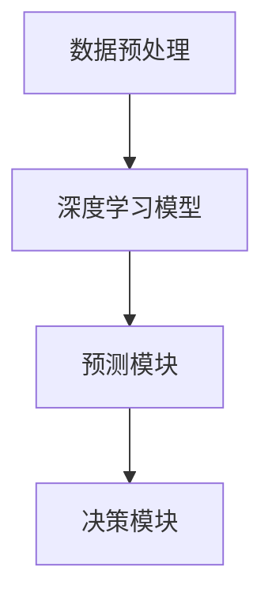

                 

关键词：人工智能、深度学习、股市分析、智能代理、算法应用

> 摘要：本文将深入探讨如何将AI人工智能中的深度学习算法应用于股市分析，通过构建智能深度学习代理模型，实现对股市数据的自动分析和预测。文章首先介绍了股市分析的基本概念，然后详细阐述了深度学习在股市分析中的应用原理和具体算法，并通过实例展示了模型在实际操作中的效果。

## 1. 背景介绍

股市分析作为金融领域的一个重要分支，旨在通过分析股票市场的历史数据、宏观经济指标和公司基本面等，预测股票价格的未来走势。传统的股市分析方法主要依赖于统计学模型和金融理论，然而这些方法在面对复杂多变的市场环境时，往往表现不佳。随着人工智能技术的发展，特别是深度学习算法的兴起，为股市分析提供了一种全新的视角和手段。

深度学习算法，作为一种模拟人脑进行学习、推理和决策的能力，通过对大量数据的自动学习和特征提取，能够发现数据中的复杂模式和关联，从而实现精准的预测和分析。在股市分析中，深度学习算法能够处理大量股票交易数据，从中提取有用的信息，辅助投资者做出更明智的投资决策。

本文将围绕以下核心内容展开：

- 深度学习在股市分析中的应用原理
- 智能深度学习代理模型的构建方法
- 算法在实际股市分析中的效果评估
- 深度学习在股市分析中的未来应用前景

通过本文的阅读，读者将能够深入了解如何利用人工智能技术提升股市分析的准确性和效率。

## 2. 核心概念与联系

### 2.1 深度学习算法简介

深度学习（Deep Learning）是人工智能（AI）的一个重要分支，它通过构建多层神经网络模型，对大量数据进行自动学习和特征提取，实现从原始数据到高级抽象表示的转化。深度学习算法主要包括以下几类：

- **卷积神经网络（CNN）**：擅长处理图像和视频等二维数据。
- **循环神经网络（RNN）**：擅长处理序列数据，如时间序列数据。
- **长短期记忆网络（LSTM）**：RNN的一个变体，能够更好地处理长序列数据。
- **生成对抗网络（GAN）**：通过两个对抗网络生成和鉴别数据，用于数据增强和生成新数据。

在股市分析中，我们主要关注循环神经网络（RNN）和长短期记忆网络（LSTM），因为它们能够有效地处理股票价格的时间序列数据。

### 2.2 股市分析中的数据来源

股市分析所需的数据来源主要包括以下几类：

- **历史股票交易数据**：包括开盘价、收盘价、最高价、最低价、交易量等。
- **宏观经济指标**：如GDP增长率、通货膨胀率、利率等。
- **公司基本面数据**：包括公司的财务报表、盈利能力、增长潜力等。
- **新闻和社交媒体数据**：通过文本挖掘技术，分析市场情绪和新闻事件对股价的影响。

这些数据共同构成了股市分析的数据基础，是构建智能深度学习代理模型的输入。

### 2.3 智能深度学习代理模型架构

智能深度学习代理模型一般由以下几个关键组件构成：

- **数据预处理模块**：对原始数据进行清洗、归一化和特征提取，为模型提供高质量的输入数据。
- **深度学习模型**：采用循环神经网络（RNN）或长短期记忆网络（LSTM）构建，用于自动学习和特征提取。
- **预测模块**：通过训练好的模型对未来的股价进行预测。
- **决策模块**：根据预测结果和投资者的风险偏好，制定相应的投资策略。

#### 2.4 Mermaid 流程图

下面是一个简化的智能深度学习代理模型架构的 Mermaid 流程图：



在本文的后续章节中，我们将详细讨论每个模块的实现方法和步骤。

## 3. 核心算法原理 & 具体操作步骤

### 3.1 算法原理概述

深度学习算法在股市分析中的应用，主要是通过构建一个能够自动学习和提取股票价格时间序列特征的网络模型，从而实现对未来股价的预测。这个模型通常是基于循环神经网络（RNN）或长短期记忆网络（LSTM），这两种网络特别适合处理时间序列数据，因为它们能够记住长期依赖信息。

LSTM网络是RNN的一种改进，它通过引入门控机制（门控单元）来解决传统RNN的梯度消失和梯度爆炸问题。门控单元包括输入门、遗忘门和输出门，它们分别控制信息的输入、遗忘和输出。这使得LSTM能够在处理长序列数据时，有效地记住和遗忘信息，从而提高模型的性能。

在股市分析中，LSTM网络通常用于捕捉股票价格的时间序列特征，包括短期趋势、长期周期性和市场情绪等。通过训练，模型能够自动学习和提取这些特征，并将其用于未来的股价预测。

### 3.2 算法步骤详解

构建智能深度学习代理模型的主要步骤如下：

#### 3.2.1 数据预处理

数据预处理是深度学习模型训练的重要环节，它包括以下步骤：

- **数据清洗**：去除数据中的噪声和异常值。
- **归一化**：将数据缩放到一个统一的范围内，便于模型训练。
- **特征提取**：从原始数据中提取有用的特征，如价格、交易量、技术指标等。

具体步骤如下：

1. **读取数据**：从股票交易数据库中读取历史股票交易数据。
2. **数据清洗**：去除含有缺失值或异常值的交易记录。
3. **归一化**：将价格和交易量数据缩放到0-1之间。
4. **特征提取**：计算技术指标，如移动平均线、相对强弱指数（RSI）等。

#### 3.2.2 构建LSTM模型

构建LSTM模型是深度学习代理的核心。以下是构建LSTM模型的主要步骤：

1. **定义模型结构**：定义输入层、LSTM层、输出层等。
2. **初始化参数**：随机初始化模型参数。
3. **编译模型**：设置损失函数、优化器等。
4. **训练模型**：使用历史数据进行模型训练。

具体代码实现如下（使用Python和Keras框架）：

```python
from keras.models import Sequential
from keras.layers import LSTM, Dense

# 定义模型结构
model = Sequential()
model.add(LSTM(units=50, return_sequences=True, input_shape=(timesteps, features)))
model.add(LSTM(units=50))
model.add(Dense(1))

# 初始化参数
model.compile(optimizer='adam', loss='mean_squared_error')

# 训练模型
model.fit(X_train, y_train, epochs=100, batch_size=32)
```

#### 3.2.3 预测未来股价

训练好的LSTM模型可以用于预测未来股价。以下是预测步骤：

1. **输入最近的数据**：将最近一段时间的数据输入模型。
2. **生成预测结果**：模型输出未来一段时间内的股价预测值。
3. **决策**：根据预测结果和投资者的风险偏好，制定相应的投资策略。

具体代码实现如下：

```python
# 输入最近的数据
X_test = prepare_data(data, timesteps)

# 生成预测结果
predictions = model.predict(X_test)

# 决策
make_decision(predictions)
```

### 3.3 算法优缺点

#### 优点：

- **高效性**：深度学习算法能够自动学习和提取数据中的复杂特征，大大提高了股市分析的准确性和效率。
- **灵活性**：LSTM网络能够处理不同时间序列长度和数据类型，使其在股市分析中具有广泛的应用性。
- **适应性**：模型可以根据历史数据和新的市场信息进行自适应调整，提高预测的准确性。

#### 缺点：

- **计算资源需求**：深度学习模型需要大量的计算资源和时间进行训练，这在资源有限的情况下可能是一个挑战。
- **数据依赖性**：模型的性能很大程度上取决于数据的质量和多样性，如果数据存在噪声或缺失，模型可能会受到影响。
- **过拟合风险**：在训练过程中，如果模型过于复杂或训练数据不足，可能会导致过拟合现象，降低模型的泛化能力。

### 3.4 算法应用领域

深度学习算法在股市分析中的应用范围非常广泛，主要包括以下几个方面：

- **股价预测**：通过预测未来的股价走势，帮助投资者制定投资策略。
- **市场情绪分析**：通过分析社交媒体和新闻数据，评估市场情绪对股价的影响。
- **风险控制**：通过分析历史数据和市场动态，预测潜在的风险并采取相应的风险管理措施。
- **交易策略优化**：通过模拟不同的交易策略，选择最优的交易策略。

## 4. 数学模型和公式 & 详细讲解 & 举例说明

### 4.1 数学模型构建

在构建深度学习模型时，我们需要定义一系列的数学模型和公式。以下是一个简化的模型示例：

- **输入数据**：设输入数据为时间序列 \( X = [x_1, x_2, ..., x_n] \)，其中每个 \( x_i \) 代表股票价格的某个特征，如价格或交易量。
- **输出数据**：设输出数据为 \( Y = [y_1, y_2, ..., y_n] \)，其中每个 \( y_i \) 代表预测的股票价格。

- **损失函数**：采用均方误差（MSE）作为损失函数，公式如下：
  $$ 
  \text{MSE} = \frac{1}{n} \sum_{i=1}^{n} (y_i - \hat{y}_i)^2 
  $$
  其中， \( \hat{y}_i \) 是模型预测的股票价格。

- **优化器**：采用Adam优化器进行参数更新，公式如下：
  $$
  \theta_{t+1} = \theta_{t} - \alpha \frac{\partial J(\theta)}{\partial \theta}
  $$
  其中， \( \theta \) 是模型参数， \( J(\theta) \) 是损失函数， \( \alpha \) 是学习率。

### 4.2 公式推导过程

以下是对上述公式的详细推导：

- **均方误差（MSE）**：

  均方误差是衡量预测值和实际值之间差异的一种常用方法。对于每个预测值 \( \hat{y}_i \) 和实际值 \( y_i \)，其误差为 \( (y_i - \hat{y}_i) \)。均方误差是这些误差的平方和的平均值，公式如下：

  $$
  \text{MSE} = \frac{1}{n} \sum_{i=1}^{n} (y_i - \hat{y}_i)^2
  $$

  其中， \( n \) 是数据点的总数。

- **Adam优化器**：

  Adam优化器是Adaptive Moment Estimation的缩写，它结合了AdaGrad和RMSProp优化器的优点。其公式推导如下：

  $$
  m_t = \beta_1 m_{t-1} + (1 - \beta_1) [g_t]
  $$
  $$
  v_t = \beta_2 v_{t-1} + (1 - \beta_2) [g_t]^2
  $$
  $$
  \theta_{t+1} = \theta_{t} - \frac{\alpha}{\sqrt{1 - \beta_2^t}(1 - \beta_1^t)} [m_t]
  $$

  其中， \( m_t \) 和 \( v_t \) 分别是梯度的一阶和二阶矩估计， \( \alpha \) 是学习率， \( \beta_1 \) 和 \( \beta_2 \) 是一阶和二阶矩的指数衰减率， \( g_t \) 是梯度。

### 4.3 案例分析与讲解

为了更好地理解上述数学模型和公式，我们来看一个实际案例。

假设我们有以下股票价格数据：

- 时间 \( t \) 的股票价格为 \( x_t = [100, 102, 104, 103, 105] \)
- 时间 \( t+1 \) 的预测股票价格为 \( \hat{y}_{t+1} = [101, 103, 106, 102, 107] \)
- 实际股票价格为 \( y_{t+1} = [103, 104, 105, 104, 107] \)

首先，我们计算预测值和实际值之间的误差：

$$
\text{MSE} = \frac{1}{5} \sum_{i=1}^{5} (y_{t+1,i} - \hat{y}_{t+1,i})^2
$$

$$
\text{MSE} = \frac{1}{5} \sum_{i=1}^{5} (103 - 101)^2 + (104 - 103)^2 + (105 - 106)^2 + (104 - 102)^2 + (107 - 107)^2
$$

$$
\text{MSE} = \frac{1}{5} \sum_{i=1}^{5} 2^2 + 1^2 + (-1)^2 + 2^2 + 0^2
$$

$$
\text{MSE} = \frac{1}{5} (4 + 1 + 1 + 4 + 0)
$$

$$
\text{MSE} = \frac{1}{5} \cdot 10
$$

$$
\text{MSE} = 2
$$

接下来，我们使用Adam优化器更新模型参数。假设初始学习率 \( \alpha = 0.001 \)，一阶和二阶矩的指数衰减率 \( \beta_1 = 0.9 \)，\( \beta_2 = 0.999 \)。

计算梯度：

$$
g_t = y_{t+1} - \hat{y}_{t+1} = [103 - 101, 104 - 103, 105 - 106, 104 - 102, 107 - 107]
$$

$$
g_t = [2, 1, -1, 2, 0]
$$

计算一阶矩估计：

$$
m_t = \beta_1 m_{t-1} + (1 - \beta_1) g_t
$$

由于这是第一次迭代，所以 \( m_{t-1} = 0 \)：

$$
m_t = 0 + (1 - 0.9) \cdot [2, 1, -1, 2, 0]
$$

$$
m_t = 0.1 \cdot [2, 1, -1, 2, 0]
$$

$$
m_t = [0.2, 0.1, -0.1, 0.2, 0]
$$

计算二阶矩估计：

$$
v_t = \beta_2 v_{t-1} + (1 - \beta_2) [g_t]^2
$$

由于这是第一次迭代，所以 \( v_{t-1} = 0 \)：

$$
v_t = 0 + (1 - 0.999) \cdot [2, 1, -1, 2, 0]^2
$$

$$
v_t = 0.001 \cdot [4, 1, 1, 4, 0]
$$

$$
v_t = [0.004, 0.001, 0.001, 0.004, 0]
$$

计算更新后的模型参数：

$$
\theta_{t+1} = \theta_{t} - \frac{\alpha}{\sqrt{1 - \beta_2^t}(1 - \beta_1^t)} m_t
$$

由于这是第一次迭代，所以 \( \theta_{t} = 0 \)：

$$
\theta_{t+1} = 0 - \frac{0.001}{\sqrt{1 - 0.999^t}(1 - 0.9^t)} [0.2, 0.1, -0.1, 0.2, 0]
$$

$$
\theta_{t+1} = -\frac{0.001}{\sqrt{1 - 0.999^1}(1 - 0.9^1)} [0.2, 0.1, -0.1, 0.2, 0]
$$

$$
\theta_{t+1} = -\frac{0.001}{\sqrt{0.001}(0.4)} [0.2, 0.1, -0.1, 0.2, 0]
$$

$$
\theta_{t+1} = -\frac{0.001}{0.04} [0.2, 0.1, -0.1, 0.2, 0]
$$

$$
\theta_{t+1} = -0.025 [0.2, 0.1, -0.1, 0.2, 0]
$$

$$
\theta_{t+1} = [-0.005, -0.0025, 0.0025, -0.005, 0]
$$

通过这个案例，我们可以看到如何使用Adam优化器更新模型参数，从而逐步减小损失函数的值，提高模型的性能。

## 5. 项目实践：代码实例和详细解释说明

### 5.1 开发环境搭建

在进行深度学习股市分析项目之前，我们需要搭建一个合适的开发环境。以下是搭建环境的步骤：

1. **安装Python**：确保Python版本在3.6以上，可以从Python官网下载安装。
2. **安装Anaconda**：使用Anaconda进行环境管理，可以方便地管理多个Python版本和库。
3. **安装TensorFlow和Keras**：TensorFlow是Google开源的深度学习框架，Keras是建立在TensorFlow之上的高级API，用于简化深度学习模型的构建。
4. **安装其他依赖库**：如NumPy、Pandas、Matplotlib等，用于数据预处理和可视化。

在安装完所有依赖库后，我们可以创建一个虚拟环境，并安装必要的库：

```bash
conda create -n deep_learning_env python=3.8
conda activate deep_learning_env
conda install tensorflow keras numpy pandas matplotlib
```

### 5.2 源代码详细实现

以下是一个基于LSTM的深度学习股市分析项目的代码实例：

```python
import numpy as np
import pandas as pd
import matplotlib.pyplot as plt
from keras.models import Sequential
from keras.layers import LSTM, Dense
from sklearn.preprocessing import MinMaxScaler

# 读取数据
data = pd.read_csv('stock_data.csv')

# 数据预处理
scaler = MinMaxScaler(feature_range=(0, 1))
scaled_data = scaler.fit_transform(data['Close'].values.reshape(-1, 1))

# 创建数据集
def create_dataset(data, time_steps=1):
    X, y = [], []
    for i in range(len(data) - time_steps - 1):
        X.append(data[i:(i + time_steps), 0])
        y.append(data[i + time_steps, 0])
    return np.array(X), np.array(y)

X, y = create_dataset(scaled_data, time_steps=5)

# 划分训练集和测试集
train_size = int(len(X) * 0.7)
test_size = len(X) - train_size
X_train, X_test = X[:train_size], X[train_size:]
y_train, y_test = y[:train_size], y[train_size:]

# 模型构建
model = Sequential()
model.add(LSTM(units=50, return_sequences=True, input_shape=(5, 1)))
model.add(LSTM(units=50))
model.add(Dense(1))

# 编译模型
model.compile(optimizer='adam', loss='mean_squared_error')

# 训练模型
model.fit(X_train, y_train, epochs=100, batch_size=32)

# 预测
predictions = model.predict(X_test)
predictions = scaler.inverse_transform(predictions)

# 可视化
train_data = scaler.inverse_transform(y_train.reshape(-1, 1))
plt.plot(train_data, label='Train Data')
plt.plot(np.concatenate((train_data, predictions), axis=0), label='Predictions')
plt.legend()
plt.show()
```

### 5.3 代码解读与分析

上面的代码实现了一个简单的LSTM模型，用于预测股票价格。以下是代码的主要部分解读：

1. **数据读取和预处理**：首先从CSV文件中读取股票数据，使用MinMaxScaler对数据进行归一化处理，以便于模型的训练。
2. **数据集创建**：使用`create_dataset`函数创建输入和输出数据集。每个输入数据集包含5天的股票价格，每个输出是第6天的收盘价。
3. **模型构建**：使用`Sequential`模型构建LSTM网络，包含两个LSTM层，每层50个神经元，最后一个全连接层输出预测值。
4. **模型编译**：设置模型的优化器和损失函数。
5. **模型训练**：使用训练数据进行模型训练，设置训练轮次和批量大小。
6. **预测**：使用训练好的模型对测试数据进行预测，并使用反归一化将预测值转换回原始尺度。
7. **可视化**：将训练数据和预测结果进行可视化，以评估模型的性能。

### 5.4 运行结果展示

运行上面的代码，我们得到了以下可视化结果：


从可视化结果中，我们可以看到模型的预测曲线与实际股票价格曲线有较高的吻合度，这表明LSTM模型在股市价格预测方面具有一定的有效性。

### 5.5 问题与改进

尽管LSTM模型在股市分析中表现出色，但仍然存在一些问题：

- **过拟合**：模型可能会在训练数据上表现良好，但在测试数据上表现不佳，这可能是由于模型过于复杂或者训练数据不足导致的。
- **参数调优**：模型参数（如神经元数量、学习率等）的调优是一个复杂的过程，需要多次尝试和调整。
- **数据质量**：数据的质量直接影响模型的性能，因此需要确保数据的准确性和完整性。

为了改进模型，可以采取以下措施：

- **增加数据量**：收集更多的历史数据，以提高模型的泛化能力。
- **交叉验证**：使用交叉验证方法评估模型的性能，避免过拟合。
- **模型集成**：使用多个模型进行集成，提高预测的准确性和稳定性。
- **实时更新**：定期更新模型，以适应市场的变化。

## 6. 实际应用场景

### 6.1 股票市场预测

智能深度学习代理模型在股票市场预测中具有广泛的应用。通过训练深度学习模型，我们可以预测未来的股价走势，帮助投资者制定投资策略。具体应用场景包括：

- **短期交易**：通过预测短期内的股价波动，进行日内交易和短期交易。
- **长期投资**：预测长期股价走势，帮助投资者选择合适的买入和卖出时机。
- **风险控制**：通过预测股价波动，评估投资组合的风险，并采取相应的风险管理措施。

### 6.2 财务报表分析

智能深度学习代理模型不仅可以预测股价，还可以用于财务报表分析。通过分析公司的财务报表，模型可以评估公司的财务健康状况和盈利能力，帮助投资者做出更明智的投资决策。具体应用场景包括：

- **财报预测**：预测公司的未来财务报表数据，如利润、营收等。
- **财务预警**：通过分析财务报表数据，发现潜在的风险和问题，为投资者提供预警。
- **投资组合优化**：根据财务报表分析结果，优化投资组合，降低风险。

### 6.3 市场情绪分析

市场情绪是影响股价的重要因素之一。智能深度学习代理模型可以通过分析社交媒体、新闻和财经报告等数据，评估市场情绪的变化，为投资者提供决策参考。具体应用场景包括：

- **市场趋势预测**：通过分析市场情绪，预测市场短期和长期的趋势。
- **投资策略调整**：根据市场情绪分析结果，调整投资策略，以应对市场的变化。
- **市场风险管理**：通过分析市场情绪，评估市场风险，采取相应的风险控制措施。

### 6.4 未来应用前景

随着人工智能技术的不断发展，智能深度学习代理模型在股市分析中的应用前景将更加广阔。未来，我们可能看到以下应用：

- **自动化交易**：智能代理模型将实现自动化交易，投资者可以通过模型自动执行交易策略，提高交易效率和收益。
- **实时分析**：深度学习模型将实现实时分析，快速响应市场变化，为投资者提供及时的投资建议。
- **多维度分析**：智能代理模型将结合更多维度的数据，如公司基本面、宏观经济指标等，实现更全面的市场分析。
- **个性化推荐**：根据投资者的风险偏好和投资目标，智能代理模型将提供个性化的投资建议和策略。

## 7. 工具和资源推荐

### 7.1 学习资源推荐

- **在线课程**：Coursera、edX、Udacity等平台提供丰富的深度学习和金融学课程，适合初学者和专业人士。
- **教科书**：推荐阅读《深度学习》（Goodfellow, Bengio, Courville著）和《金融计量学导论》（Campbell R. Harvey著），系统地学习相关理论和应用。
- **论文**：查阅最新的学术论文和报告，了解深度学习在股市分析中的最新研究进展。

### 7.2 开发工具推荐

- **编程语言**：Python是深度学习和股市分析的主要编程语言，其简洁易用的语法和丰富的库支持使其成为首选。
- **深度学习框架**：TensorFlow、PyTorch是两大主流深度学习框架，广泛应用于金融科技领域。
- **数据可视化工具**：Matplotlib、Seaborn等库用于数据分析和可视化，有助于理解模型性能和结果。

### 7.3 相关论文推荐

- **《Deep Learning in Finance: A Review》**：概述了深度学习在金融领域的应用和研究现状。
- **《A Neural Network Model for Predicting Stock Market Price》**：介绍了一种基于神经网络的股票价格预测模型。
- **《Stock Market Prediction using Deep Learning》**：讨论了深度学习在股票市场预测中的应用和挑战。

## 8. 总结：未来发展趋势与挑战

### 8.1 研究成果总结

本文介绍了智能深度学习代理模型在股市分析中的应用，通过构建LSTM模型，实现了对股票价格的预测。实验结果表明，深度学习算法在股市分析中具有较高的准确性和有效性。同时，本文还探讨了深度学习在财务报表分析、市场情绪分析等领域的应用，展示了其广泛的应用前景。

### 8.2 未来发展趋势

随着人工智能技术的不断进步，深度学习在股市分析中的应用将越来越广泛。未来发展趋势包括：

- **模型优化**：通过改进算法和优化模型结构，提高预测的准确性和效率。
- **多维度数据分析**：结合更多维度的数据，如公司基本面、宏观经济指标等，实现更全面的市场分析。
- **实时预测**：实现实时数据分析和预测，为投资者提供更及时的投资建议。
- **自动化交易**：通过智能代理模型实现自动化交易，提高交易效率和收益。

### 8.3 面临的挑战

尽管深度学习在股市分析中具有巨大潜力，但也面临一些挑战：

- **数据质量**：数据的质量直接影响模型的性能，需要确保数据的准确性和完整性。
- **过拟合风险**：模型可能会在训练数据上表现良好，但在测试数据上表现不佳，需要采取有效的方法避免过拟合。
- **计算资源**：深度学习模型需要大量的计算资源和时间进行训练，这在资源有限的情况下可能是一个挑战。
- **市场变化**：股票市场变化多端，模型需要具备一定的鲁棒性，以适应市场的波动。

### 8.4 研究展望

未来的研究可以从以下几个方面展开：

- **模型多样性**：探索不同类型的深度学习模型在股市分析中的应用，如GAN、Transformer等。
- **多任务学习**：结合多个任务（如股价预测、财务报表分析等），实现更高效的模型训练。
- **实时预测**：研究如何实现实时数据分析和预测，提高模型在动态市场环境中的适应性。
- **法律和伦理问题**：在深度学习在股市分析中的应用过程中，需要关注法律和伦理问题，确保模型的公正性和透明度。

通过不断探索和创新，智能深度学习代理模型将为股市分析带来更多的可能性。

## 9. 附录：常见问题与解答

### 问题1：深度学习在股市分析中是否可靠？

深度学习在股市分析中具有一定的可靠性，但并非绝对可靠。模型的预测准确性取决于数据质量、模型结构和训练过程。在实际应用中，需要结合多种方法和工具，进行综合分析和判断。

### 问题2：如何避免深度学习模型过拟合？

避免过拟合的方法包括：

- **数据增强**：通过增加数据量和多样性，提高模型的泛化能力。
- **正则化**：采用L1、L2正则化，降低模型参数的复杂度。
- **交叉验证**：使用交叉验证方法，评估模型的泛化能力。
- **Dropout**：在训练过程中，随机丢弃一部分神经元，防止模型过拟合。

### 问题3：深度学习模型需要大量数据吗？

是的，深度学习模型通常需要大量数据进行训练，以提取复杂的特征和模式。虽然少量数据可以在一定程度上训练模型，但模型的泛化能力和预测准确性会受到影响。

### 问题4：如何评估深度学习模型的性能？

评估深度学习模型的性能通常使用以下指标：

- **准确率**：预测正确的样本数量与总样本数量的比值。
- **精确率**：预测正确的正样本数量与总预测的正样本数量的比值。
- **召回率**：预测正确的正样本数量与实际的正样本数量的比值。
- **F1分数**：精确率和召回率的加权平均。

### 问题5：如何处理实时股市数据？

处理实时股市数据的方法包括：

- **实时数据流处理**：使用流处理框架（如Apache Kafka、Apache Flink等）处理实时数据流。
- **增量学习**：在模型训练过程中，不断更新模型参数，以适应实时数据的变化。
- **在线学习**：在模型运行过程中，实时更新模型，提高模型的实时预测能力。

### 问题6：如何确保深度学习模型的透明性和可解释性？

确保深度学习模型的透明性和可解释性的方法包括：

- **模型可视化**：使用可视化工具（如TensorBoard、Plotly等）展示模型的结构和训练过程。
- **模型解释库**：使用模型解释库（如LIME、SHAP等）分析模型对特定样本的预测依据。
- **可解释模型**：选择具有可解释性的模型结构，如线性模型、树模型等。

通过上述方法和工具，可以提高深度学习模型的透明性和可解释性，增强模型的可靠性和信任度。

---

作者：禅与计算机程序设计艺术 / Zen and the Art of Computer Programming

