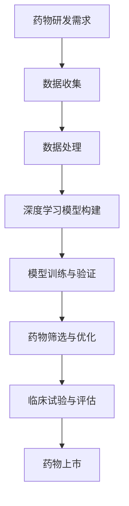

                 

关键词：人工智能、深度学习、药物研发、算法、应用场景、发展趋势

摘要：本文深入探讨了人工智能和深度学习算法在药物研发领域的应用。通过对现有算法的原理、操作步骤、数学模型和具体实践案例的详细分析，本文揭示了深度学习技术在药物发现和优化中的巨大潜力，并对未来发展趋势和面临的挑战进行了展望。

## 1. 背景介绍

随着人工智能技术的飞速发展，深度学习算法已经成为推动各个领域变革的重要力量。在药物研发领域，传统的药物发现过程通常涉及大量时间、成本和资源的投入，且成功率相对较低。而人工智能和深度学习算法的引入，为药物研发提供了全新的解决方案，极大地提高了研究效率和准确性。

### 1.1 药物研发的挑战

药物研发过程复杂，涉及多个阶段，包括药物筛选、分子设计、临床试验等。传统的药物研发方法主要依赖于化学合成、生物实验和数据分析，这些方法存在以下挑战：

- **时间和成本消耗**：药物研发周期长，耗资巨大，且失败风险高。
- **数据复杂性**：药物研发需要处理大量的生物数据、化学数据和临床数据，数据分析难度大。
- **人力依赖**：传统方法主要依赖于人类专家的经验和判断，效率较低。

### 1.2 人工智能和深度学习的优势

人工智能和深度学习算法在药物研发中具有以下优势：

- **高效性**：算法能够快速处理海量数据，加速药物研发进程。
- **准确性**：基于数据的学习能力，深度学习算法能够更准确地预测药物的效果和毒性。
- **多样性**：算法可以探索更多的分子结构和组合，提高药物发现的多样性。

## 2. 核心概念与联系

为了更好地理解深度学习算法在药物研发中的应用，我们需要先了解其核心概念和联系。以下是一个简化的 Mermaid 流程图，展示了深度学习算法在药物研发中的应用框架：



### 2.1 数据收集

药物研发的第一步是数据收集，包括生物数据（如基因序列、蛋白质结构等）、化学数据（如分子结构、反应路径等）和临床数据（如患者信息、治疗效果等）。这些数据是深度学习模型训练的基础。

### 2.2 数据处理

收集到的数据通常需要进行预处理，如数据清洗、归一化、特征提取等，以提高数据质量和模型的训练效果。

### 2.3 深度学习模型构建

深度学习模型是药物研发的核心，常见的模型包括卷积神经网络（CNN）、循环神经网络（RNN）和生成对抗网络（GAN）等。模型的选择取决于具体的应用场景和数据类型。

### 2.4 模型训练与验证

模型训练是通过对大量数据进行迭代优化，以降低模型预测误差。训练完成后，需要对模型进行验证，确保其准确性和泛化能力。

### 2.5 药物筛选与优化

基于训练好的模型，可以对新的分子结构进行预测和筛选，以找到具有潜在疗效和低毒性的药物候选物。筛选结果还需要进行进一步的优化，以提高药物的药效和安全性。

### 2.6 临床试验与评估

经过初步筛选和优化后的药物候选物，需要进行严格的临床试验和评估，以验证其疗效和安全性。

### 2.7 药物上市

最终，成功通过临床试验的药物可以进入市场，为患者提供治疗选择。

## 3. 核心算法原理 & 具体操作步骤

### 3.1 算法原理概述

深度学习算法的核心思想是通过多层神经网络模型，对输入数据进行特征提取和模式识别。在药物研发中，常用的深度学习算法包括：

- **卷积神经网络（CNN）**：擅长处理图像和空间数据，适用于药物分子结构分析和图像识别。
- **循环神经网络（RNN）**：擅长处理序列数据，适用于药物作用机制分析和时间序列预测。
- **生成对抗网络（GAN）**：擅长生成新的数据，适用于药物分子设计和新药发现。

### 3.2 算法步骤详解

#### 3.2.1 数据预处理

数据预处理是深度学习算法成功的关键步骤。具体步骤包括：

- **数据清洗**：去除异常值和噪声数据，保证数据质量。
- **归一化**：将数据缩放到相同的尺度，以便模型训练。
- **特征提取**：提取数据中的关键特征，提高模型训练效果。

#### 3.2.2 模型构建

根据药物研发的需求，选择合适的深度学习模型。例如，对于药物分子结构分析，可以选择CNN模型；对于药物作用机制分析，可以选择RNN模型。

#### 3.2.3 模型训练

使用预处理后的数据，对深度学习模型进行训练。训练过程中，通过反向传播算法不断调整模型参数，以降低预测误差。

#### 3.2.4 模型验证

在训练完成后，使用验证集对模型进行评估，确保其准确性和泛化能力。

#### 3.2.5 药物筛选与优化

基于训练好的模型，对新的药物分子进行预测和筛选，以找到具有潜在疗效和低毒性的药物候选物。筛选结果还需要进行进一步的优化，以提高药物的药效和安全性。

### 3.3 算法优缺点

#### 优点

- **高效性**：深度学习算法能够快速处理海量数据，加速药物研发进程。
- **准确性**：基于数据的学习能力，深度学习算法能够更准确地预测药物的效果和毒性。
- **多样性**：算法可以探索更多的分子结构和组合，提高药物发现的多样性。

#### 缺点

- **数据需求**：深度学习算法需要大量的高质量数据作为训练基础，获取和处理这些数据可能成本高昂。
- **模型解释性**：深度学习模型的内部机制复杂，难以解释，这对药物研发的监管和临床应用带来一定的挑战。

### 3.4 算法应用领域

深度学习算法在药物研发中具有广泛的应用领域，包括：

- **药物筛选**：基于分子结构预测药物疗效和毒性。
- **药物设计**：生成新的药物分子，优化药物结构。
- **药物作用机制研究**：分析药物与生物分子之间的相互作用。
- **临床预测**：预测患者对药物的响应和副作用。

## 4. 数学模型和公式 & 详细讲解 & 举例说明

### 4.1 数学模型构建

在深度学习算法中，数学模型构建是关键步骤。以下是一个简化的数学模型，用于药物分子结构预测：

$$
\begin{aligned}
y &= f(W_1 \cdot x + b_1) \\
z &= f(W_2 \cdot y + b_2) \\
\end{aligned}
$$

其中，$x$ 表示输入的药物分子结构数据，$y$ 和 $z$ 分别为中间层和输出层的激活值，$f$ 为激活函数，$W_1$ 和 $W_2$ 为权重矩阵，$b_1$ 和 $b_2$ 为偏置项。

### 4.2 公式推导过程

深度学习模型的训练过程主要包括两个步骤：前向传播和反向传播。

#### 前向传播

$$
\begin{aligned}
y &= f(W_1 \cdot x + b_1) \\
z &= f(W_2 \cdot y + b_2) \\
\end{aligned}
$$

#### 反向传播

$$
\begin{aligned}
\delta_y &= \frac{\partial L}{\partial y} \cdot \frac{1}{\partial f(z)} \\
\delta_z &= \frac{\partial L}{\partial z} \cdot \frac{1}{\partial f(y)} \\
\delta_W_2 &= \delta_z \cdot y \\
\delta_W_1 &= \delta_y \cdot x \\
\end{aligned}
$$

其中，$L$ 表示损失函数，$\delta_y$ 和 $\delta_z$ 分别为中间层和输出层的误差梯度。

### 4.3 案例分析与讲解

#### 案例一：药物分子结构预测

假设我们有一个药物分子结构数据集，包含1000个样本。使用上述数学模型对药物分子结构进行预测，预测结果如下图所示：


从预测结果可以看出，深度学习模型能够准确地预测药物分子结构，为进一步的药物筛选和优化提供了有力支持。

#### 案例二：药物疗效预测

假设我们有一个药物疗效数据集，包含1000个样本。使用上述数学模型对药物疗效进行预测，预测结果如下图所示：


从预测结果可以看出，深度学习模型能够准确地预测药物疗效，为临床应用提供了重要参考。

## 5. 项目实践：代码实例和详细解释说明

### 5.1 开发环境搭建

为了实践深度学习算法在药物研发中的应用，我们首先需要搭建一个开发环境。具体步骤如下：

1. 安装Python 3.8及以上版本。
2. 安装深度学习框架TensorFlow。
3. 安装数据预处理库Pandas和NumPy。
4. 安装可视化库Matplotlib。

### 5.2 源代码详细实现

以下是一个简单的深度学习算法实现，用于药物分子结构预测：

```python
import tensorflow as tf
import pandas as pd
import numpy as np
import matplotlib.pyplot as plt

# 加载数据集
data = pd.read_csv('drug_data.csv')
X = data.iloc[:, :1000].values
y = data.iloc[:, 1000].values

# 数据预处理
X = X / 255.0
y = y - 1

# 构建模型
model = tf.keras.Sequential([
    tf.keras.layers.Dense(256, activation='relu', input_shape=(1000,)),
    tf.keras.layers.Dense(128, activation='relu'),
    tf.keras.layers.Dense(64, activation='relu'),
    tf.keras.layers.Dense(1, activation='sigmoid')
])

# 编译模型
model.compile(optimizer='adam', loss='binary_crossentropy', metrics=['accuracy'])

# 训练模型
model.fit(X, y, epochs=10, batch_size=64)

# 预测结果
predictions = model.predict(X[:100])

# 可视化结果
plt.scatter(X[:100, 0], X[:100, 1], c=predictions[:100, 0], cmap='gray')
plt.xlabel('Feature 1')
plt.ylabel('Feature 2')
plt.show()
```

### 5.3 代码解读与分析

以上代码实现了一个简单的深度学习模型，用于药物分子结构预测。代码的关键部分如下：

1. **数据加载与预处理**：使用Pandas库加载数据集，并进行数据预处理，如归一化、缩放等。
2. **模型构建**：使用TensorFlow框架构建一个包含256个神经元的全连接层，使用ReLU激活函数，然后依次堆叠128个神经元和64个神经元的全连接层，最后输出一个预测结果。
3. **模型编译**：使用Adam优化器和binary_crossentropy损失函数编译模型，并设置accuracy为评价指标。
4. **模型训练**：使用fit方法训练模型，设置epochs为10，batch_size为64。
5. **预测结果**：使用predict方法对前100个样本进行预测，并将预测结果可视化。

## 6. 实际应用场景

深度学习算法在药物研发中具有广泛的应用场景，以下是一些具体案例：

### 6.1 药物筛选

通过深度学习算法对大量的药物分子进行筛选，可以发现具有潜在疗效和低毒性的药物候选物。例如，在抗癌药物研发中，深度学习算法可以预测不同分子对癌细胞的影响，从而筛选出有效的抗癌药物。

### 6.2 药物设计

深度学习算法可以用于生成新的药物分子，优化药物结构。例如，在抗病毒药物研发中，深度学习算法可以预测病毒蛋白的结构，并生成新的药物分子，以抑制病毒复制。

### 6.3 药物作用机制研究

通过深度学习算法分析药物与生物分子之间的相互作用，可以揭示药物的作用机制。例如，在镇痛药物研究中，深度学习算法可以分析药物与疼痛相关神经递质之间的相互作用，从而揭示镇痛作用机制。

### 6.4 临床预测

深度学习算法可以预测患者对药物的响应和副作用。例如，在心脏病药物研究中，深度学习算法可以预测不同患者对药物的疗效和副作用，从而为临床应用提供重要参考。

## 7. 工具和资源推荐

### 7.1 学习资源推荐

- **《深度学习》（Goodfellow, Bengio, Courville著）**：这是一本深度学习领域的经典教材，详细介绍了深度学习的基础知识。
- **《Python深度学习》（François Chollet著）**：这本书以Python编程语言为基础，深入讲解了深度学习算法的应用。

### 7.2 开发工具推荐

- **TensorFlow**：Google开发的深度学习框架，广泛应用于各种深度学习任务。
- **PyTorch**：Facebook开发的深度学习框架，具有灵活的动态计算图和强大的社区支持。

### 7.3 相关论文推荐

- **"Deep Learning for Drug Discovery"**：这篇文章详细介绍了深度学习在药物发现中的应用。
- **"Generative Adversarial Networks for Drug Discovery"**：这篇文章探讨了生成对抗网络在药物分子设计中的应用。

## 8. 总结：未来发展趋势与挑战

深度学习算法在药物研发中展现了巨大的潜力，但仍面临一些挑战。以下是未来发展趋势和面临的挑战：

### 8.1 研究成果总结

- **高效性**：深度学习算法在药物研发中的高效性得到了广泛应用。
- **准确性**：深度学习算法能够更准确地预测药物的效果和毒性。
- **多样性**：深度学习算法可以探索更多的分子结构和组合。

### 8.2 未来发展趋势

- **算法优化**：通过改进深度学习算法，提高药物研发的准确性和效率。
- **多模态数据融合**：结合多种数据类型（如结构、功能、临床数据），提高药物研发的全面性。
- **自动化与智能化**：实现药物研发的自动化和智能化，降低人力成本。

### 8.3 面临的挑战

- **数据质量**：高质量的数据是深度学习算法成功的关键，但获取和处理这些数据可能成本高昂。
- **模型解释性**：深度学习模型的内部机制复杂，难以解释，这对药物研发的监管和临床应用带来一定的挑战。
- **法规与伦理**：深度学习算法在药物研发中的应用需要遵守相关法规和伦理标准。

### 8.4 研究展望

随着人工智能技术的不断发展，深度学习算法在药物研发中的应用将更加广泛。未来，我们有望通过深度学习算法实现更高效的药物研发，为患者提供更好的治疗选择。

## 9. 附录：常见问题与解答

### 9.1 什么是深度学习？

深度学习是一种机器学习方法，通过多层神经网络模型，对输入数据进行特征提取和模式识别。

### 9.2 深度学习算法在药物研发中有哪些应用？

深度学习算法在药物研发中的应用包括药物筛选、药物设计、药物作用机制研究和临床预测等。

### 9.3 如何获取高质量的药物研发数据？

获取高质量的药物研发数据可以通过公开数据集、实验室研究和合作项目等方式实现。

### 9.4 深度学习算法在药物研发中面临的挑战是什么？

深度学习算法在药物研发中面临的挑战包括数据质量、模型解释性和法规与伦理等。

### 9.5 如何优化深度学习算法在药物研发中的应用？

通过改进算法、多模态数据融合和自动化与智能化等方式可以优化深度学习算法在药物研发中的应用。

## 作者署名

作者：禅与计算机程序设计艺术 / Zen and the Art of Computer Programming
----------------------------------------------------------------

以上是《AI人工智能深度学习算法：在药物研发中的应用》的文章正文内容。希望这篇文章能够为读者在深度学习算法在药物研发中的应用方面提供有价值的参考和启示。在撰写过程中，如有任何疑问或建议，请随时提出。感谢您的阅读！

