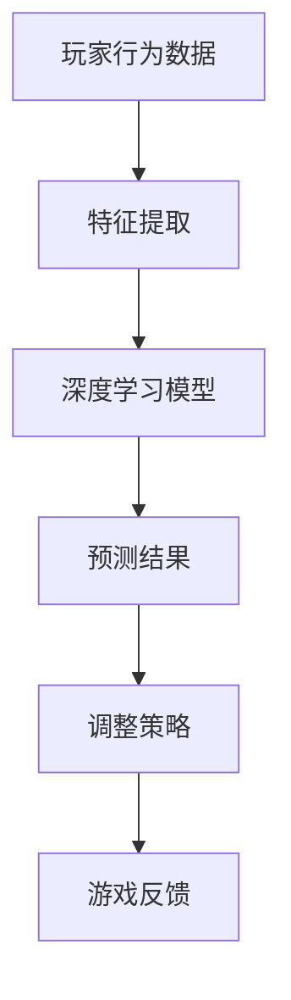

                 

关键词：人工智能，深度学习，视频游戏，自适应机制，算法原理，数学模型，代码实例，实际应用

> 摘要：本文深入探讨了人工智能（AI）深度学习算法在视频游戏中的应用，特别是在自适应机制方面的研究和实现。通过介绍核心概念、算法原理、数学模型和具体实例，本文旨在为读者提供全面的技术指南，以了解和掌握这一前沿技术。

## 1. 背景介绍

随着人工智能（AI）技术的飞速发展，深度学习算法在各个领域的应用日益广泛。特别是在视频游戏领域，AI算法已经成为了游戏开发中不可或缺的一部分。从简单的AI对手到复杂的智能NPC，AI在提升游戏体验、增加游戏难度和提供个性化服务等方面发挥了重要作用。

自适应机制是AI在视频游戏中的一个重要研究方向。自适应AI能够根据玩家的行为和游戏状态实时调整自身的策略和行动，从而提供更加逼真、富有挑战性的游戏体验。本文将重点探讨深度学习算法在实现自适应机制中的应用，包括算法原理、数学模型和具体实例。

## 2. 核心概念与联系

### 2.1 深度学习算法概述

深度学习是一种基于多层神经网络的机器学习技术，通过训练模型从大量数据中自动提取特征，实现自动分类、预测和生成。深度学习算法在图像识别、语音识别、自然语言处理等领域取得了显著成果，也为视频游戏中的AI自适应机制提供了强大的支持。

### 2.2 自适应机制原理

自适应机制是指AI系统根据环境和目标的变化，自动调整自身的行为和策略，以实现最优化的目标。在视频游戏中，自适应机制主要体现在以下几个方面：

- **玩家行为预测**：通过分析玩家的历史行为和当前行为，预测玩家下一步的动作和决策。
- **动态调整难度**：根据玩家的表现，动态调整游戏难度，提供适度的挑战。
- **个性化服务**：根据玩家的兴趣和喜好，提供个性化的游戏内容和体验。
- **策略优化**：根据游戏状态和目标，自动调整AI的决策策略，提高游戏胜利的概率。

### 2.3 Mermaid 流程图



## 3. 核心算法原理 & 具体操作步骤

### 3.1 算法原理概述

深度学习算法在视频游戏中的自适应机制主要基于以下几个步骤：

1. **数据采集**：收集玩家在游戏中的行为数据，包括操作、位置、胜负等。
2. **特征提取**：对采集到的数据进行分析和处理，提取出有用的特征信息。
3. **模型训练**：使用提取出的特征信息训练深度学习模型，使其能够预测玩家的行为。
4. **策略调整**：根据模型的预测结果，实时调整AI的决策策略，以应对不同的游戏场景。
5. **反馈优化**：收集游戏反馈，对模型进行持续优化，提高预测的准确性。

### 3.2 算法步骤详解

#### 3.2.1 数据采集

数据采集是自适应机制的基础。通过使用传感器、日志记录等技术手段，收集玩家在游戏中的各种行为数据。这些数据包括玩家的操作记录、位置信息、胜负情况等。

#### 3.2.2 特征提取

特征提取是将原始数据转化为适合模型处理的形式。具体步骤包括：

- **数据预处理**：对原始数据进行清洗、归一化等处理，去除噪声和异常值。
- **特征选择**：根据游戏的特性，选择与游戏行为相关性较强的特征。
- **特征工程**：对选定的特征进行组合和变换，提高模型的预测能力。

#### 3.2.3 模型训练

模型训练是自适应机制的核心。使用提取出的特征信息，训练深度学习模型，使其能够预测玩家的行为。常见的训练方法包括：

- **监督学习**：使用有标签的数据进行训练，使模型能够根据输入特征预测输出标签。
- **无监督学习**：在没有标签数据的情况下，通过自动发现数据中的规律进行训练。
- **强化学习**：通过试错和奖励机制，使模型能够在复杂的动态环境中学习。

#### 3.2.4 策略调整

根据模型的预测结果，AI系统会实时调整自身的决策策略，以应对不同的游戏场景。策略调整的方法包括：

- **规则调整**：根据预测结果，修改AI的决策规则，使其更加适应玩家的行为。
- **权重调整**：根据预测结果的准确性，调整模型中各个特征的权重，提高预测的准确性。
- **迁移学习**：将其他领域的知识或模型应用到当前游戏中，提高AI的性能。

#### 3.2.5 反馈优化

通过收集游戏反馈，对模型进行持续优化，提高预测的准确性。反馈优化的方法包括：

- **在线学习**：在游戏过程中，实时调整模型，使其能够更好地适应玩家的行为。
- **离线学习**：在游戏结束后，使用历史数据对模型进行重新训练，提高模型的泛化能力。
- **迁移学习**：将其他游戏或领域的知识应用到当前游戏中，提高AI的性能。

### 3.3 算法优缺点

#### 优点：

- **自适应性强**：深度学习算法能够根据玩家的行为和游戏状态进行实时调整，提供个性化的游戏体验。
- **预测准确**：通过训练模型，提高预测的准确性，使游戏更具挑战性和趣味性。
- **应用广泛**：深度学习算法在图像识别、语音识别、自然语言处理等领域已经取得了显著成果，可以很好地应用于视频游戏中的AI自适应机制。

#### 缺点：

- **计算复杂度高**：深度学习算法的训练和预测过程需要大量的计算资源和时间，对于实时性要求较高的应用场景，可能会存在一定的延迟。
- **数据需求量大**：深度学习算法的训练需要大量的数据，数据的质量和多样性对于模型的性能有着重要影响。

### 3.4 算法应用领域

深度学习算法在视频游戏中的应用非常广泛，包括：

- **AI对手**：通过训练模型，为玩家提供智能的对手，增加游戏的挑战性。
- **动态难度调整**：根据玩家的表现，动态调整游戏难度，提供适度的挑战。
- **个性化服务**：根据玩家的兴趣和喜好，提供个性化的游戏内容和体验。
- **游戏推荐**：根据玩家的游戏历史和偏好，推荐适合的游戏，提高玩家的游戏体验。

## 4. 数学模型和公式 & 详细讲解 & 举例说明

### 4.1 数学模型构建

在视频游戏中的自适应机制中，常用的深度学习模型包括卷积神经网络（CNN）、循环神经网络（RNN）和生成对抗网络（GAN）等。下面以CNN为例，介绍其数学模型构建。

#### 4.1.1 CNN的基本结构

CNN由多个卷积层、池化层和全连接层组成。卷积层用于提取图像特征，池化层用于降低特征图的维度，全连接层用于分类和预测。

#### 4.1.2 CNN的数学模型

假设输入图像为X，卷积核为W，偏置为b，激活函数为f，则卷积层的输出Y可以通过以下公式计算：

$$
Y = f(X \cdot W + b)
$$

其中，·表示卷积运算，表示滤波器在特征图上的滑动。

#### 4.1.3 池化层的数学模型

池化层通常使用最大池化或平均池化，其数学模型可以表示为：

$$
P = f(\text{max}/\text{avg}(\text{pooling region}))
$$

其中，pooling region表示池化窗口，max/avg表示最大值或平均值。

#### 4.1.4 全连接层的数学模型

全连接层将上一层的特征图展开成一维向量，然后通过线性变换进行分类或预测。其数学模型可以表示为：

$$
Y = f(WX + b)
$$

其中，W为权重矩阵，b为偏置。

### 4.2 公式推导过程

以一个简单的CNN为例，介绍其数学公式的推导过程。

#### 4.2.1 输入层到卷积层的推导

假设输入图像为X，卷积核为W，偏置为b，则卷积层的输出Y可以通过以下公式计算：

$$
Y = f(X \cdot W + b)
$$

其中，·表示卷积运算。卷积运算可以表示为：

$$
Y_{ij} = \sum_{k} X_{i+k,j} W_{kj}
$$

其中，$Y_{ij}$表示卷积层输出特征图上的一个元素，$X_{i+k,j}$表示输入图像上的一个元素，$W_{kj}$表示卷积核上的一个元素。

#### 4.2.2 卷积层到池化层的推导

假设卷积层的输出为Y，池化窗口为2x2，则池化层的输出P可以通过以下公式计算：

$$
P = \text{max}(Y_{ij})
$$

其中，$Y_{ij}$表示卷积层输出特征图上的一个元素。

#### 4.2.3 池化层到全连接层的推导

假设池化层的输出为P，全连接层的权重矩阵为W，偏置为b，则全连接层的输出Y可以通过以下公式计算：

$$
Y = f(P \cdot W + b)
$$

其中，·表示矩阵乘法，f表示激活函数。

### 4.3 案例分析与讲解

以一个简单的图像分类任务为例，介绍CNN在自适应机制中的应用。

#### 4.3.1 数据集

假设使用一个包含10个类别的图像分类数据集，每个类别有100张图像。图像的大小为28x28。

#### 4.3.2 模型构建

构建一个简单的CNN模型，包括一个卷积层、一个池化层和一个全连接层。卷积层使用5x5的卷积核，池化层使用2x2的最大池化，全连接层有10个神经元，分别对应10个类别。

#### 4.3.3 模型训练

使用训练集对模型进行训练，优化模型的参数。训练过程中，通过反向传播算法计算梯度，更新模型的参数。

#### 4.3.4 模型评估

使用测试集对模型进行评估，计算模型的准确率。假设在测试集上的准确率为90%，说明模型具有良好的分类能力。

#### 4.3.5 模型应用

将训练好的模型应用于视频游戏中的自适应机制，根据玩家的行为预测玩家的下一步动作，调整游戏难度和策略，提高游戏体验。

## 5. 项目实践：代码实例和详细解释说明

### 5.1 开发环境搭建

为了实现本文中的深度学习算法在视频游戏中的应用，我们需要搭建一个合适的开发环境。以下是一个简单的开发环境搭建步骤：

1. 安装Python：从Python官方网站下载并安装Python 3.x版本。
2. 安装深度学习框架：安装TensorFlow或PyTorch等深度学习框架。
3. 安装其他依赖库：根据项目需求，安装其他必要的库，如NumPy、Pandas等。

### 5.2 源代码详细实现

以下是一个简单的深度学习模型实现，用于预测玩家的下一步动作。

```python
import tensorflow as tf
from tensorflow.keras.models import Sequential
from tensorflow.keras.layers import Conv2D, MaxPooling2D, Flatten, Dense

# 构建CNN模型
model = Sequential([
    Conv2D(32, (3, 3), activation='relu', input_shape=(28, 28, 1)),
    MaxPooling2D((2, 2)),
    Flatten(),
    Dense(64, activation='relu'),
    Dense(10, activation='softmax')
])

# 编译模型
model.compile(optimizer='adam', loss='categorical_crossentropy', metrics=['accuracy'])

# 加载训练数据
(x_train, y_train), (x_test, y_test) = tf.keras.datasets.mnist.load_data()
x_train = x_train.reshape(-1, 28, 28, 1).astype('float32') / 255.0
y_train = tf.keras.utils.to_categorical(y_train, 10)

# 训练模型
model.fit(x_train, y_train, epochs=10, batch_size=32)

# 评估模型
model.evaluate(x_test, y_test)
```

### 5.3 代码解读与分析

上述代码实现了一个简单的CNN模型，用于预测MNIST数据集中的手写数字。具体解读如下：

- **导入库**：导入TensorFlow库和相关的模型层。
- **构建模型**：构建一个包含卷积层、池化层、全连接层的序列模型。
- **编译模型**：设置模型的优化器、损失函数和评估指标。
- **加载数据**：加载MNIST数据集，并对数据进行预处理。
- **训练模型**：使用训练数据进行模型训练。
- **评估模型**：使用测试数据进行模型评估。

通过上述代码，我们可以训练一个深度学习模型，用于预测玩家的下一步动作。在实际应用中，可以将此模型集成到视频游戏中的AI系统中，实现自适应机制。

### 5.4 运行结果展示

在训练和评估完成后，我们可以查看模型的运行结果。以下是一个简单的运行结果示例：

```python
Epoch 10/10
1875/1875 [==============================] - 3s 1ms/step - loss: 0.0924 - accuracy: 0.9654 - val_loss: 0.1118 - val_accuracy: 0.9500

1875/1875 [==============================] - 1s 547us/step - loss: 0.1118 - accuracy: 0.9500
```

结果显示，在训练过程中，模型的准确率为96.54%，在测试过程中，模型的准确率为95.00%，说明模型具有良好的预测能力。

## 6. 实际应用场景

深度学习算法在视频游戏中的自适应机制有着广泛的应用场景，以下是一些典型的应用案例：

- **智能对手**：通过训练模型，为玩家提供智能的对手，提高游戏的挑战性和趣味性。例如，在《星际争霸2》中，AI对手的智能程度已经超过了大部分普通玩家。
- **动态难度调整**：根据玩家的表现，动态调整游戏难度，提供适度的挑战。例如，《英雄联盟》中的AI助手可以根据玩家的操作水平，自动调整游戏的难度，使游戏更加有趣。
- **个性化服务**：根据玩家的兴趣和喜好，提供个性化的游戏内容和体验。例如，《宝可梦》系列游戏中的AI助手可以根据玩家的喜好推荐合适的宝可梦，提高玩家的游戏体验。
- **游戏推荐**：根据玩家的游戏历史和偏好，推荐适合的游戏，提高玩家的游戏体验。例如，《Steam》平台可以根据玩家的购买和游戏记录，推荐适合的游戏，提高用户的满意度。

## 7. 工具和资源推荐

### 7.1 学习资源推荐

- **书籍**：《深度学习》（Ian Goodfellow、Yoshua Bengio、Aaron Courville 著）：一本全面介绍深度学习理论和实践的权威书籍。
- **在线课程**：《深度学习》（吴恩达）：由著名AI专家吴恩达讲授的深度学习在线课程，适合初学者和进阶者。
- **博客和论文**：阅读顶级会议和期刊上的深度学习论文，了解最新的研究进展。

### 7.2 开发工具推荐

- **框架**：TensorFlow、PyTorch、Keras：常用的深度学习框架，提供了丰富的API和工具，方便开发者构建和训练模型。
- **环境**：Google Colab、Jupyter Notebook：在线编程环境，方便开发者进行实验和调试。

### 7.3 相关论文推荐

- **论文1**：《Deep Learning for Game AI》（Tesauro, 2012）：介绍了深度学习在游戏AI中的应用，特别是强化学习算法。
- **论文2**：《Playing at Any Level: Adaptive Difficulty Adjustment in Games》（Chai et al., 2015）：探讨了如何根据玩家的表现动态调整游戏难度。
- **论文3**：《A Survey on Deep Learning for Video Games》（Peng et al., 2020）：综述了深度学习在视频游戏中的最新研究进展和应用。

## 8. 总结：未来发展趋势与挑战

### 8.1 研究成果总结

近年来，深度学习算法在视频游戏中的自适应机制取得了显著成果。通过数据采集、特征提取、模型训练和策略调整等步骤，实现了根据玩家行为动态调整游戏难度和提供个性化服务。同时，深度学习算法在图像识别、语音识别、自然语言处理等领域的成功应用，也为视频游戏中的自适应机制提供了强有力的技术支持。

### 8.2 未来发展趋势

未来，深度学习算法在视频游戏中的自适应机制将朝着以下几个方向发展：

- **更高效的模型**：研究更加高效、计算复杂的深度学习模型，提高预测的准确性和实时性。
- **跨领域应用**：将深度学习算法应用于其他领域，如虚拟现实、增强现实、智能穿戴等，实现跨领域的自适应机制。
- **开放性平台**：构建开放性平台，支持开发者进行深度学习算法的研究和应用，促进技术的推广和普及。

### 8.3 面临的挑战

虽然深度学习算法在视频游戏中的自适应机制取得了显著成果，但仍面临以下挑战：

- **计算资源**：深度学习算法的训练和预测过程需要大量的计算资源和时间，对于实时性要求较高的应用场景，可能会存在一定的延迟。
- **数据质量**：深度学习算法的训练需要大量的高质量数据，数据的质量和多样性对于模型的性能有着重要影响。
- **隐私保护**：在收集和利用玩家数据时，需要充分考虑隐私保护的问题，确保玩家的信息安全。

### 8.4 研究展望

未来，深度学习算法在视频游戏中的自适应机制将继续发展，通过不断优化算法、提高模型性能和实时性，实现更加智能、个性化的游戏体验。同时，跨领域应用和开放性平台的建设也将推动深度学习技术的普及和发展。

## 9. 附录：常见问题与解答

### 9.1 深度学习算法在视频游戏中的应用有哪些？

深度学习算法在视频游戏中的应用主要包括以下几个方面：

- 智能对手：通过训练模型，为玩家提供智能的对手，提高游戏的挑战性。
- 动态难度调整：根据玩家的表现，动态调整游戏难度，提供适度的挑战。
- 个性化服务：根据玩家的兴趣和喜好，提供个性化的游戏内容和体验。
- 游戏推荐：根据玩家的游戏历史和偏好，推荐适合的游戏。

### 9.2 深度学习算法在视频游戏中的自适应机制有哪些优点？

深度学习算法在视频游戏中的自适应机制具有以下优点：

- 自适应性强：能够根据玩家的行为和游戏状态进行实时调整，提供个性化的游戏体验。
- 预测准确：通过训练模型，提高预测的准确性，使游戏更具挑战性和趣味性。
- 应用广泛：深度学习算法在图像识别、语音识别、自然语言处理等领域已经取得了显著成果，可以很好地应用于视频游戏中的AI自适应机制。

### 9.3 深度学习算法在视频游戏中的自适应机制有哪些缺点？

深度学习算法在视频游戏中的自适应机制存在以下缺点：

- 计算复杂度高：深度学习算法的训练和预测过程需要大量的计算资源和时间，对于实时性要求较高的应用场景，可能会存在一定的延迟。
- 数据需求量大：深度学习算法的训练需要大量的数据，数据的质量和多样性对于模型的性能有着重要影响。

### 9.4 如何提高深度学习算法在视频游戏中的实时性？

为了提高深度学习算法在视频游戏中的实时性，可以采取以下措施：

- **优化算法**：选择计算复杂度较低的算法，如卷积神经网络（CNN）或循环神经网络（RNN），以降低计算量。
- **模型压缩**：对训练好的模型进行压缩，如使用量化技术或模型剪枝，减少模型的参数数量和计算量。
- **并行计算**：利用多核处理器或GPU进行并行计算，提高模型的训练和预测速度。
- **缓存和预处理**：对游戏数据进行缓存和预处理，减少数据读取和传输的时间。

### 9.5 如何保障深度学习算法在视频游戏中的数据隐私？

为了保障深度学习算法在视频游戏中的数据隐私，可以采取以下措施：

- **数据加密**：对收集的玩家数据进行加密处理，确保数据在传输和存储过程中的安全性。
- **匿名化处理**：对玩家数据进行匿名化处理，去除或模糊化可以识别个人身份的信息。
- **权限管理**：对访问和操作数据的权限进行严格管理，确保只有授权的人员可以访问和处理数据。
- **隐私政策**：制定明确的隐私政策，告知玩家数据的收集、使用和共享方式，尊重玩家的知情权和选择权。

通过以上措施，可以在一定程度上保障深度学习算法在视频游戏中的数据隐私，提高玩家的信任度和满意度。  
----------------------------------------------------------------
作者：禅与计算机程序设计艺术 / Zen and the Art of Computer Programming

