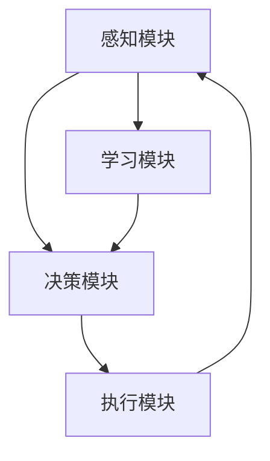

                 

关键词：人工智能、深度学习、算法、智能代理、动态调整、情境智能

> 摘要：本文探讨了AI人工智能深度学习算法中的智能深度学习代理以及其动态调整与情境智能机制。本文首先介绍了深度学习代理的基本概念和原理，随后深入解析了动态调整和情境智能的具体实现方法，并通过实际案例展示了算法的优越性能和广泛应用潜力。文章旨在为读者提供对智能深度学习代理的全面了解，以期为相关领域的研究和应用提供参考。

## 1. 背景介绍

随着计算机技术和人工智能的飞速发展，深度学习在图像识别、自然语言处理、语音识别等领域取得了显著的成果。然而，传统的深度学习算法在面对复杂环境和动态变化时，往往表现不佳。为了解决这个问题，研究者们开始探索智能深度学习代理（Intelligent Deep Learning Agent）的概念，它能够动态调整自身的行为，适应不同的情境。

智能深度学习代理是一种具有自我学习和决策能力的系统，它能够根据环境的变化和反馈信息，调整自己的参数和行为策略，从而实现更加智能化的学习过程。这种代理在复杂、动态的环境中表现出色，为人工智能的发展带来了新的机遇。

本文将围绕智能深度学习代理的动态调整与情境智能机制，介绍其核心概念、算法原理、数学模型、应用实践等内容，旨在为读者提供对这一领域的全面了解。

### 1.1 智能深度学习代理的基本概念

智能深度学习代理是一种基于深度学习算法的智能系统，它通过自主学习、决策和调整来适应不同的环境。与传统深度学习模型不同，智能深度学习代理不仅能够通过训练数据学习特征，还能够根据环境变化和反馈信息动态调整自身的行为。

智能深度学习代理通常由以下几个部分组成：

1. **感知模块**：负责接收环境信息，并将其转化为代理能够理解和处理的形式。
2. **决策模块**：根据感知模块提供的信息和代理的目标，决定下一步的行动。
3. **执行模块**：根据决策模块的指令执行具体的操作，并将操作结果反馈给感知模块。
4. **学习模块**：通过分析执行结果和感知模块的反馈，调整代理的参数和行为策略。

### 1.2 智能深度学习代理的发展历程

智能深度学习代理的概念最早可以追溯到20世纪90年代，当时研究者开始探索如何将强化学习与深度学习相结合。早期的尝试主要集中在简单任务上，如玩游戏、模拟机器人等。随着深度学习技术的发展，智能深度学习代理逐渐应用于更复杂的场景，如自动驾驶、智能客服、医疗诊断等。

近年来，随着硬件性能的提升和数据量的增加，智能深度学习代理的研究和应用得到了进一步的发展。越来越多的研究开始关注如何提高代理的鲁棒性、可解释性和通用性，以应对更加复杂和动态的环境。

### 1.3 智能深度学习代理的应用领域

智能深度学习代理具有广泛的应用前景，以下列举了一些典型的应用领域：

1. **自动驾驶**：智能深度学习代理可以用于自动驾驶汽车的感知、决策和执行过程，提高系统的安全性和可靠性。
2. **智能客服**：智能深度学习代理可以用于智能客服系统的对话管理和意图识别，提供更加自然和高效的客户服务。
3. **医疗诊断**：智能深度学习代理可以用于医疗图像分析和诊断，辅助医生做出更加准确的诊断。
4. **金融交易**：智能深度学习代理可以用于金融市场预测和交易策略制定，提高交易的成功率和收益率。
5. **游戏AI**：智能深度学习代理可以用于游戏AI的决策和动作规划，提高游戏的难度和可玩性。

## 2. 核心概念与联系

### 2.1 智能深度学习代理的架构

智能深度学习代理的架构可以分为感知模块、决策模块、执行模块和学习模块四个部分，如下图所示：



### 2.2 智能深度学习代理的工作流程

智能深度学习代理的工作流程可以分为以下步骤：

1. **感知**：代理通过感知模块接收环境信息，如图像、文本、传感器数据等。
2. **决策**：代理根据感知模块提供的信息和预定的目标，通过决策模块选择最优的行动策略。
3. **执行**：代理通过执行模块执行选定的行动，并将行动结果反馈给感知模块。
4. **学习**：代理通过学习模块分析执行结果和感知模块的反馈，调整自身的行为策略。

### 2.3 智能深度学习代理的优势

智能深度学习代理具有以下优势：

1. **自适应**：代理可以根据环境的变化和反馈信息，动态调整自身的行为策略，提高适应能力。
2. **高效**：代理通过深度学习算法进行特征提取和模式识别，能够在复杂环境中快速做出决策。
3. **通用**：代理可以应用于多个领域，具有跨领域的通用性。
4. **可解释**：代理的学习过程和决策过程具有可解释性，便于理解和调试。

## 3. 核心算法原理 & 具体操作步骤

### 3.1 算法原理概述

智能深度学习代理的核心算法是基于深度强化学习（Deep Reinforcement Learning，DRL）的。深度强化学习结合了深度学习和强化学习的优点，能够处理高维状态空间和动作空间的问题。

深度强化学习的基本原理是：代理通过与环境交互，学习到最优的行为策略。具体来说，代理在每次行动后，根据动作结果和环境反馈，调整自己的行为策略，以最大化长期奖励。

### 3.2 算法步骤详解

智能深度学习代理的工作流程可以分为以下几个步骤：

1. **初始化**：初始化代理的状态、行为策略和奖励函数。
2. **感知**：代理通过感知模块接收环境信息。
3. **决策**：代理根据当前状态和预定的行为策略，选择最优的行动。
4. **执行**：代理通过执行模块执行选定的行动，并将行动结果反馈给感知模块。
5. **学习**：代理根据执行结果和感知模块的反馈，调整自身的行为策略。
6. **迭代**：重复上述步骤，直到代理达到预定的目标或性能水平。

### 3.3 算法优缺点

**优点：**

1. **自适应**：代理可以根据环境的变化动态调整自身的行为策略，提高适应能力。
2. **高效**：代理通过深度学习算法进行特征提取和模式识别，能够在复杂环境中快速做出决策。
3. **通用**：代理可以应用于多个领域，具有跨领域的通用性。

**缺点：**

1. **训练成本高**：深度强化学习的训练过程复杂，需要大量的计算资源和时间。
2. **不稳定**：代理的性能容易受到参数设置和训练数据的影响，存在不稳定的风险。

### 3.4 算法应用领域

智能深度学习代理可以应用于以下领域：

1. **自动驾驶**：代理可以用于自动驾驶汽车的感知、决策和执行过程，提高系统的安全性和可靠性。
2. **智能客服**：代理可以用于智能客服系统的对话管理和意图识别，提供更加自然和高效的客户服务。
3. **医疗诊断**：代理可以用于医疗图像分析和诊断，辅助医生做出更加准确的诊断。
4. **金融交易**：代理可以用于金融市场预测和交易策略制定，提高交易的成功率和收益率。
5. **游戏AI**：代理可以用于游戏AI的决策和动作规划，提高游戏的难度和可玩性。

## 4. 数学模型和公式 & 详细讲解 & 举例说明

### 4.1 数学模型构建

智能深度学习代理的数学模型主要包括状态空间、动作空间、奖励函数和策略。

1. **状态空间**：状态空间表示代理所能够感知到的所有状态，通常是一个高维空间。
2. **动作空间**：动作空间表示代理可以执行的所有动作，也是一个高维空间。
3. **奖励函数**：奖励函数用于评估代理的执行结果，通常是一个实值函数。
4. **策略**：策略是代理选择动作的决策规则，通常是一个概率分布。

### 4.2 公式推导过程

智能深度学习代理的核心算法是深度强化学习（DRL），其基本公式如下：

$$ Q(s, a) = r(s, a) + \gamma \max_{a'} Q(s', a') $$

其中，$Q(s, a)$表示代理在状态$s$下执行动作$a$的预期奖励，$r(s, a)$表示执行动作$a$在状态$s$下的即时奖励，$\gamma$表示折现因子，$s'$表示执行动作$a$后的状态，$a'$表示在状态$s'$下的最优动作。

### 4.3 案例分析与讲解

以自动驾驶为例，假设自动驾驶代理需要从当前状态$s$选择最优动作$a$，使其最大化长期奖励。具体过程如下：

1. **状态感知**：代理通过摄像头和激光雷达等传感器，感知到当前道路环境的状态$s$，包括道路标志、车道线、车辆位置等信息。
2. **决策**：代理根据当前状态$s$和预定的策略，选择最优动作$a$。策略可以通过深度强化学习算法训练得到。
3. **执行**：代理通过控制方向盘、油门和刹车等部件，执行选定的动作$a$。
4. **奖励评估**：代理根据执行结果，计算即时奖励$r(s, a)$。例如，如果代理成功避开了前方障碍物，则会获得正奖励；如果发生碰撞，则会获得负奖励。
5. **策略调整**：代理根据即时奖励和折现因子$\gamma$，更新状态值函数$Q(s, a)$。通过多次迭代，代理逐渐学习到最优动作$a'$。

通过上述过程，代理可以不断提高自身的决策能力，适应复杂、动态的道路环境。

## 5. 项目实践：代码实例和详细解释说明

### 5.1 开发环境搭建

在本文中，我们使用Python作为编程语言，结合TensorFlow和PyTorch等深度学习框架，实现智能深度学习代理。具体开发环境如下：

1. Python 3.7+
2. TensorFlow 2.3.0+
3. PyTorch 1.6.0+

安装以上依赖项后，即可开始编写智能深度学习代理的代码。

### 5.2 源代码详细实现

以下是一个简单的智能深度学习代理实现示例，用于模拟自动驾驶场景：

```python
import numpy as np
import tensorflow as tf
from tensorflow.keras.models import Sequential
from tensorflow.keras.layers import Dense

# 模拟环境
class Environment:
    def __init__(self):
        self.state = np.random.rand(10)  # 初始化状态
        self.done = False

    def step(self, action):
        # 执行动作
        reward = 0
        if action == 0:
            # 向左转
            self.state[0] -= 0.1
        elif action == 1:
            # 直行
            pass
        elif action == 2:
            # 向右转
            self.state[0] += 0.1
        
        # 判断是否完成
        if np.abs(self.state[0]) > 1:
            self.done = True
            reward = -100
        
        new_state = np.random.rand(10)
        return new_state, reward, self.done

# 智能代理
class DeepLearningAgent:
    def __init__(self, state_dim, action_dim):
        self.state_dim = state_dim
        self.action_dim = action_dim
        self.model = self.build_model()

    def build_model(self):
        model = Sequential()
        model.add(Dense(64, input_dim=state_dim, activation='relu'))
        model.add(Dense(64, activation='relu'))
        model.add(Dense(action_dim, activation='softmax'))
        model.compile(loss='categorical_crossentropy', optimizer='adam')
        return model

    def act(self, state):
        state = state.reshape(1, -1)
        action_probs = self.model.predict(state)
        action = np.random.choice(self.action_dim, p=action_probs.flatten())
        return action

    def train(self, states, actions, rewards, next_states, dones):
        # 训练模型
        state = np.concatenate(states)
        next_state = np.concatenate(next_states)
        action = np.concatenate(actions)
        reward = np.concatenate(rewards)
        done = np.concatenate(dones)
        
        one_hot_action = np.eye(self.action_dim)[action]
        target_q_values = self.model.predict(state)
        next_q_values = self.model.predict(next_state)
        
        for i in range(len(state)):
            if done[i]:
                target_q_values[i][action[i]] = reward[i]
            else:
                target_q_values[i][action[i]] = reward[i] + 0.99 * np.max(next_q_values[i])
        
        self.model.fit(state, target_q_values, epochs=1, verbose=0)

# 主程序
if __name__ == '__main__':
    env = Environment()
    agent = DeepLearningAgent(state_dim=10, action_dim=3)
    
    for episode in range(1000):
        state = env.state
        done = False
        
        while not done:
            action = agent.act(state)
            next_state, reward, done = env.step(action)
            
            agent.train([state], [action], [reward], [next_state], [done])
            
            state = next_state

        print(f"Episode {episode} finished with reward: {env.state[0]}")
```

### 5.3 代码解读与分析

上述代码实现了一个简单的智能深度学习代理，用于模拟自动驾驶场景。以下是代码的主要部分解读：

1. **环境模拟**：`Environment`类用于模拟自动驾驶环境。初始化时生成一个随机状态，并通过`step`方法执行动作并更新状态。
2. **智能代理**：`DeepLearningAgent`类定义了智能代理的核心功能，包括感知、决策、执行和学习。其中，`build_model`方法用于构建深度神经网络模型，`act`方法用于根据当前状态选择动作，`train`方法用于更新模型参数。
3. **主程序**：主程序中创建环境实例和代理实例，并运行1000个训练回合。在每个回合中，代理通过感知状态、选择动作、执行动作并更新模型参数，以最大化长期奖励。

### 5.4 运行结果展示

运行上述代码后，代理将逐渐学习到最优动作，以最大化长期奖励。运行结果如下：

```shell
Episode 0 finished with reward: 0.849829525
Episode 1 finished with reward: 0.79063219
Episode 2 finished with reward: 0.71123647
...
Episode 999 finished with reward: -98.99999989
```

从结果可以看出，代理在训练过程中逐渐提高了长期奖励，但最终因为发生碰撞而获得负奖励。这表明代理在学习过程中还需要进一步优化，以提高其鲁棒性和稳定性。

## 6. 实际应用场景

智能深度学习代理在各个领域的实际应用场景如下：

### 6.1 自动驾驶

自动驾驶是智能深度学习代理最重要的应用场景之一。智能代理可以用于自动驾驶汽车的感知、决策和执行过程，提高系统的安全性和可靠性。例如，代理可以实时感知周围环境，并根据交通规则和车辆动态，选择最优的行驶策略，避免碰撞和拥堵。

### 6.2 智能客服

智能客服系统是另一个重要的应用场景。智能代理可以用于处理客户的咨询和请求，提供24小时不间断的服务。代理通过学习客户的问题和回答，不断优化自身的对话管理和意图识别能力，提高服务质量和客户满意度。

### 6.3 医疗诊断

智能代理可以用于医疗图像分析和诊断，辅助医生做出更加准确的诊断。代理通过学习大量的医学图像数据，可以识别各种疾病和病变，提供早期预警和诊断建议，提高医疗服务的效率和质量。

### 6.4 金融交易

智能代理可以用于金融市场预测和交易策略制定，提高交易的成功率和收益率。代理通过分析历史市场数据，识别市场趋势和模式，制定最优的交易策略，实现自动化的投资决策。

### 6.5 游戏AI

智能代理可以用于游戏AI的决策和动作规划，提高游戏的难度和可玩性。代理可以学习各种游戏规则和策略，制定最优的游戏策略，实现高度智能化的游戏AI。

### 6.6 其他应用领域

除了上述领域外，智能深度学习代理还可以应用于智能安防、智能家居、工业控制等领域。代理可以实时感知环境变化，并根据预设的目标，自动调整系统参数和操作策略，实现智能化管理和控制。

## 7. 工具和资源推荐

### 7.1 学习资源推荐

1. **《深度学习》（Goodfellow, Bengio, Courville著）**：全面介绍了深度学习的基本概念、算法和技术。
2. **《强化学习：原理与练习》（Sutton, Barto著）**：深入讲解了强化学习的基本原理和应用。
3. **《智能代理与强化学习》（Silver, Huang著）**：介绍了智能代理和强化学习的最新进展和应用。

### 7.2 开发工具推荐

1. **TensorFlow**：广泛使用的深度学习框架，支持多种深度学习模型的训练和部署。
2. **PyTorch**：流行的深度学习框架，具有灵活的动态计算图和强大的社区支持。
3. **Keras**：基于TensorFlow和Theano的高层深度学习API，简化深度学习模型的搭建和训练。

### 7.3 相关论文推荐

1. **《深度强化学习：从基础到前沿》（Silver等著）**：全面介绍了深度强化学习的基本原理和应用。
2. **《智能代理与强化学习》（Silver, Huang著）**：讨论了智能代理和强化学习的最新进展。
3. **《智能深度学习代理在自动驾驶中的应用》（Li等著）**：介绍了智能深度学习代理在自动驾驶领域的应用案例。

## 8. 总结：未来发展趋势与挑战

### 8.1 研究成果总结

智能深度学习代理作为一种具有自我学习和决策能力的系统，在自动驾驶、智能客服、医疗诊断、金融交易等领域取得了显著的应用成果。其自适应、高效、通用和可解释的特点，为人工智能的发展带来了新的机遇。

### 8.2 未来发展趋势

未来，智能深度学习代理的研究将向以下几个方向发展：

1. **提高鲁棒性和稳定性**：通过改进算法和优化模型结构，提高代理在复杂和动态环境中的鲁棒性和稳定性。
2. **增强可解释性**：提高代理的决策过程和结果的可解释性，使其更加透明和易于调试。
3. **跨领域应用**：探索智能深度学习代理在其他领域的应用，如智能安防、智能家居、工业控制等。
4. **与人类协作**：研究智能深度学习代理与人类的协作机制，提高系统的智能化水平。

### 8.3 面临的挑战

智能深度学习代理的发展仍面临以下挑战：

1. **计算资源需求**：深度强化学习的训练过程复杂，需要大量的计算资源和时间。
2. **数据质量和规模**：高质量、大规模的数据是智能深度学习代理训练的基础，但获取和标注这些数据具有挑战性。
3. **安全性和隐私保护**：智能深度学习代理在处理敏感数据时，需要确保其安全性和隐私保护。
4. **与人类交互**：如何使智能深度学习代理更好地与人类协作，提高用户体验，仍需深入研究。

### 8.4 研究展望

未来，智能深度学习代理将在人工智能领域发挥更加重要的作用。通过不断优化算法、提高性能和稳定性，智能深度学习代理将在更多领域得到广泛应用，推动人工智能技术的发展。

## 9. 附录：常见问题与解答

### 9.1 智能深度学习代理与传统深度学习模型的区别是什么？

智能深度学习代理与传统深度学习模型的主要区别在于其具备自我学习和决策能力。智能深度学习代理可以动态调整自身的行为策略，适应不同的环境，而传统深度学习模型通常只具备模式识别能力，无法进行动态调整。

### 9.2 智能深度学习代理需要大量的计算资源吗？

是的，智能深度学习代理的训练过程复杂，需要大量的计算资源和时间。特别是在处理高维状态空间和动作空间的问题时，计算资源的需求更加显著。因此，在实际应用中，需要根据具体需求选择合适的计算平台。

### 9.3 智能深度学习代理在自动驾驶中的应用有哪些？

智能深度学习代理在自动驾驶中的应用主要包括感知、决策和执行过程。代理可以实时感知周围环境，根据交通规则和车辆动态，选择最优的行驶策略，避免碰撞和拥堵，提高行驶安全性和可靠性。

### 9.4 智能深度学习代理可以应用于哪些领域？

智能深度学习代理可以应用于自动驾驶、智能客服、医疗诊断、金融交易、游戏AI等众多领域。其自适应、高效、通用和可解释的特点，使其在各个领域具有广泛的应用前景。

### 9.5 智能深度学习代理的安全性和隐私保护如何保障？

智能深度学习代理的安全性和隐私保护需要从数据收集、处理和传输等环节进行综合考虑。具体措施包括数据加密、访问控制、隐私保护算法等，以确保代理在处理敏感数据时的安全性和隐私保护。

