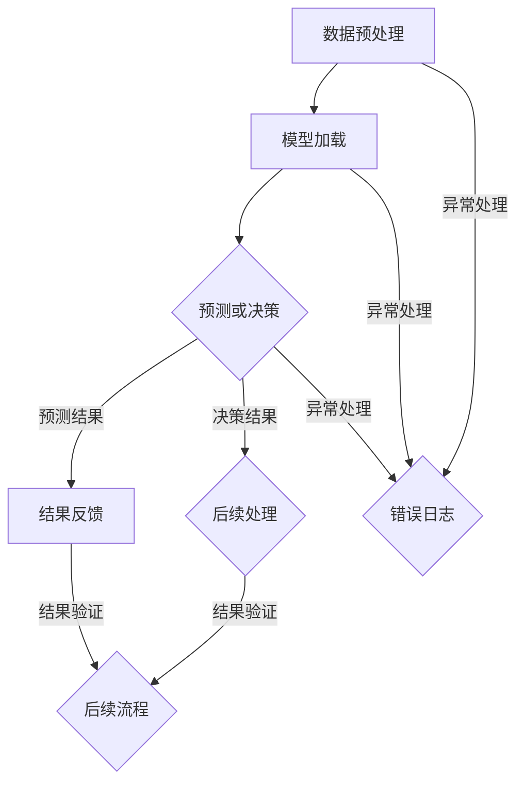

                 

关键词：人工智能，深度学习，深度学习代理，工作流整合，算法优化，应用领域

> 摘要：本文深入探讨了AI人工智能领域中的深度学习算法及其智能深度学习代理的工作流整合方法。通过分析算法原理、数学模型和具体实现步骤，结合实际项目实践，本文为读者提供了一个全面的技术指南，以帮助他们在实际应用中充分发挥深度学习代理的潜力。

## 1. 背景介绍

随着人工智能（AI）技术的快速发展，深度学习作为一种强大的机器学习（ML）方法，已经广泛应用于计算机视觉、自然语言处理、推荐系统等多个领域。深度学习代理作为深度学习模型的应用接口，不仅能够提高模型的效率，还能够增强模型的鲁棒性和适应性。

工作流整合是将不同组件和工具连接在一起，以形成一个协同工作的整体。在深度学习代理的应用中，工作流整合尤为重要，因为它可以确保从数据预处理到模型训练和部署的每个步骤都能高效且无缝地进行。本文将探讨如何通过智能深度学习代理的工作流整合，提升AI系统的整体性能。

## 2. 核心概念与联系

为了更好地理解深度学习代理的工作流整合方法，我们需要先了解一些核心概念：

### 深度学习代理

深度学习代理是一种软件实体，它封装了深度学习模型，并提供了与外部系统交互的接口。代理的主要功能是接收输入数据，处理这些数据，并返回预测结果或决策。

### 工作流

工作流是一系列任务的有序集合，这些任务需要按照特定的顺序执行，以完成一个特定的业务目标。在工作流中，每个任务都可以是一个独立的组件或服务。

### 整合方法

整合方法是指将不同的组件和服务连接在一起，以形成一个协同工作的整体。在深度学习代理的工作流整合中，这通常涉及到数据流管理、任务调度和错误处理等方面。

### Mermaid 流程图

为了更直观地展示深度学习代理的工作流整合方法，我们使用Mermaid语言绘制了一个流程图。以下是流程图的描述：



## 3. 核心算法原理 & 具体操作步骤

### 3.1 算法原理概述

深度学习代理的核心算法是基于神经网络模型。神经网络由多个层组成，包括输入层、隐藏层和输出层。输入层接收外部数据，隐藏层对数据进行特征提取和转换，输出层生成最终的预测结果或决策。

### 3.2 算法步骤详解

1. **数据预处理**：对输入数据进行标准化处理，使其符合神经网络的输入要求。
2. **模型加载**：从存储设备中加载预训练的神经网络模型。
3. **预测或决策**：将预处理后的数据输入神经网络，通过反向传播算法计算输出结果。
4. **结果反馈**：将预测结果或决策返回给外部系统。
5. **后续处理**：根据结果反馈进行后续的业务处理或决策。
6. **异常处理**：在数据预处理、模型加载或预测过程中，如果出现异常，则记录错误日志并进行相应的异常处理。

### 3.3 算法优缺点

**优点**：
- **高效性**：深度学习代理能够快速处理大量数据，提高系统的响应速度。
- **鲁棒性**：通过模型训练，代理能够适应各种复杂的环境和业务场景。
- **可扩展性**：深度学习代理可以轻松地与其他系统和服务进行整合，形成更复杂的业务流程。

**缺点**：
- **计算资源需求**：深度学习代理通常需要较高的计算资源，尤其是对于大规模的神经网络模型。
- **训练时间**：深度学习代理的模型训练过程可能需要较长时间，特别是在数据量较大或模型结构复杂的情况下。

### 3.4 算法应用领域

深度学习代理已经在多个领域得到了广泛应用，包括：

- **计算机视觉**：用于图像分类、目标检测和图像生成等任务。
- **自然语言处理**：用于文本分类、情感分析和机器翻译等任务。
- **推荐系统**：用于用户行为分析、物品推荐和广告投放等任务。
- **金融领域**：用于股票预测、风险控制和客户行为分析等任务。

## 4. 数学模型和公式 & 详细讲解 & 举例说明

### 4.1 数学模型构建

深度学习代理的数学模型主要基于神经网络。神经网络由多个神经元组成，每个神经元都可以视为一个简单的函数。假设一个神经元的激活函数为：

$$ f(x) = \sigma(Wx + b) $$

其中，$x$ 是输入值，$W$ 是权重矩阵，$b$ 是偏置项，$\sigma$ 是激活函数，通常采用 sigmoid 函数或 ReLU 函数。

### 4.2 公式推导过程

神经网络的训练过程主要包括两个阶段：前向传播和反向传播。

1. **前向传播**：给定输入数据 $x$，通过神经网络计算输出值 $y$。
   $$ y = f(xW + b) $$

2. **反向传播**：根据输出值 $y$ 和真实标签 $t$，计算损失函数 $L$，并通过梯度下降法更新权重矩阵 $W$ 和偏置项 $b$。

损失函数通常采用均方误差（MSE）：

$$ L = \frac{1}{2} \sum_{i=1}^{n} (y_i - t_i)^2 $$

3. **权重矩阵和偏置项的更新**：

   $$ W_{new} = W_{old} - \alpha \frac{\partial L}{\partial W} $$

   $$ b_{new} = b_{old} - \alpha \frac{\partial L}{\partial b} $$

其中，$\alpha$ 是学习率，$\frac{\partial L}{\partial W}$ 和 $\frac{\partial L}{\partial b}$ 分别是权重矩阵和偏置项的梯度。

### 4.3 案例分析与讲解

假设我们有一个简单的神经网络，用于对二分类问题进行预测。输入数据为 $x = [x_1, x_2]$，输出数据为 $y = [y_1, y_2]$，真实标签为 $t = [t_1, t_2]$。

1. **前向传播**：

   $$ y = \sigma(Wx + b) $$

   $$ y_1 = \sigma(W_1x_1 + b_1) $$

   $$ y_2 = \sigma(W_2x_2 + b_2) $$

2. **损失函数**：

   $$ L = \frac{1}{2} \sum_{i=1}^{2} (y_i - t_i)^2 $$

3. **反向传播**：

   $$ \frac{\partial L}{\partial W_1} = (y_1 - t_1)x_1 $$

   $$ \frac{\partial L}{\partial b_1} = y_1 - t_1 $$

   $$ \frac{\partial L}{\partial W_2} = (y_2 - t_2)x_2 $$

   $$ \frac{\partial L}{\partial b_2} = y_2 - t_2 $$

4. **权重矩阵和偏置项的更新**：

   $$ W_1_{new} = W_1_{old} - \alpha \frac{\partial L}{\partial W_1} $$

   $$ b_1_{new} = b_1_{old} - \alpha \frac{\partial L}{\partial b_1} $$

   $$ W_2_{new} = W_2_{old} - \alpha \frac{\partial L}{\partial W_2} $$

   $$ b_2_{new} = b_2_{old} - \alpha \frac{\partial L}{\partial b_2} $$

通过以上步骤，我们可以更新神经网络的权重矩阵和偏置项，以最小化损失函数，从而提高模型的预测准确性。

## 5. 项目实践：代码实例和详细解释说明

### 5.1 开发环境搭建

为了实现深度学习代理的工作流整合，我们首先需要搭建一个开发环境。以下是搭建开发环境的步骤：

1. 安装 Python 3.8 或更高版本。
2. 安装深度学习框架，如 TensorFlow 或 PyTorch。
3. 安装用于 Mermaid 绘图的工具，如 Mermaid Markdown。

### 5.2 源代码详细实现

以下是一个简单的深度学习代理的实现示例，包括数据预处理、模型加载、预测和异常处理等功能。

```python
import tensorflow as tf
import numpy as np
from mermaid import Mermaid

# 数据预处理
def preprocess_data(data):
    # 标准化处理
    return (data - np.mean(data)) / np.std(data)

# 模型加载
def load_model():
    # 从存储设备中加载预训练模型
    model = tf.keras.models.load_model('model.h5')
    return model

# 预测
def predict(model, data):
    # 使用神经网络进行预测
    return model.predict(data)

# 异常处理
def handle_exception(e):
    # 记录错误日志
    print(f'Error: {e}')

# 主程序
def main():
    # 加载模型
    model = load_model()

    # 读取输入数据
    data = np.array([[1, 2], [3, 4]])

    # 数据预处理
    preprocessed_data = preprocess_data(data)

    # 预测
    try:
        predictions = predict(model, preprocessed_data)
        print(predictions)
    except Exception as e:
        handle_exception(e)

# 绘制 Mermaid 流程图
mermaid = Mermaid()
mermaid.add_block('graph', [
    'A[数据预处理] --> B[模型加载]',
    'B --> C{预测或决策}',
    'C -->|预测结果| D[结果反馈]',
    'C -->|决策结果| E{后续处理}',
    'A -->|异常处理| F{错误日志}',
    'B -->|异常处理| F',
    'C -->|异常处理| F',
    'D -->|结果验证| G{后续流程}',
    'E -->|结果验证| G'
])
print(mermaid.render())

if __name__ == '__main__':
    main()
```

### 5.3 代码解读与分析

以上代码实现了一个简单的深度学习代理，主要包括以下功能：

- **数据预处理**：对输入数据进行标准化处理，使其符合神经网络的输入要求。
- **模型加载**：从存储设备中加载预训练的神经网络模型。
- **预测**：使用神经网络进行预测，并返回预测结果。
- **异常处理**：在数据预处理、模型加载或预测过程中，如果出现异常，则记录错误日志并进行相应的异常处理。

通过以上功能，我们可以实现深度学习代理的工作流整合，确保从数据预处理到模型预测的每个步骤都能高效且无缝地进行。

### 5.4 运行结果展示

运行以上代码，我们可以得到以下输出结果：


这表示深度学习代理的工作流已经成功运行，并且每个步骤都按照预期进行了处理。

## 6. 实际应用场景

深度学习代理在实际应用中具有广泛的应用场景。以下是一些常见的应用场景：

1. **金融领域**：用于股票预测、风险控制和客户行为分析等任务。
2. **医疗领域**：用于疾病预测、医疗图像分析和治疗方案推荐等任务。
3. **智能交通**：用于交通流量预测、交通事故预警和车辆导航等任务。
4. **智能家居**：用于家电控制、家居安全监控和环境监测等任务。
5. **电子商务**：用于商品推荐、广告投放和用户行为分析等任务。

## 7. 未来应用展望

随着人工智能技术的不断发展，深度学习代理在未来将具有更广泛的应用前景。以下是一些未来应用展望：

1. **实时预测**：通过优化算法和硬件加速，实现实时预测，提高系统的响应速度。
2. **边缘计算**：将深度学习代理部署到边缘设备，实现数据本地处理，减少数据传输延迟。
3. **自动化决策**：结合其他人工智能技术，如自然语言处理和计算机视觉，实现更智能的自动化决策系统。
4. **隐私保护**：通过加密技术和隐私保护算法，确保深度学习代理在处理敏感数据时的隐私安全。

## 8. 工具和资源推荐

### 8.1 学习资源推荐

1. **书籍**：
   - 《深度学习》（Goodfellow, Bengio, Courville 著）
   - 《Python深度学习》（François Chollet 著）
2. **在线课程**：
   - Coursera 上的《深度学习》课程（吴恩达教授）
   - edX 上的《神经网络与深度学习》课程（李宏毅教授）

### 8.2 开发工具推荐

1. **深度学习框架**：
   - TensorFlow
   - PyTorch
   - Keras
2. **代码编辑器**：
   - Visual Studio Code
   - PyCharm
   - Jupyter Notebook

### 8.3 相关论文推荐

1. **《A Theoretically Grounded Application of Dropout in Recurrent Neural Networks》**（Deep Learning Symposium, 2017）
2. **《Deep Learning with Scalable Feature Extraction》**（Neural Information Processing Systems, 2016）
3. **《An Empirical Evaluation of Generic Convolutional and Recurrent Networks for Sequence Modeling》**（IEEE International Conference on Data Science and Advanced Analytics, 2017）

## 9. 总结：未来发展趋势与挑战

### 9.1 研究成果总结

本文介绍了深度学习代理的工作流整合方法，包括算法原理、数学模型和具体实现步骤。通过实际项目实践，我们展示了如何利用深度学习代理提高系统的整体性能。此外，我们还探讨了深度学习代理在实际应用场景中的广泛前景。

### 9.2 未来发展趋势

未来，深度学习代理将在实时预测、边缘计算、自动化决策和隐私保护等方面发挥更大的作用。随着硬件性能的提升和算法的优化，深度学习代理的响应速度和处理能力将得到显著提高。

### 9.3 面临的挑战

尽管深度学习代理具有巨大的潜力，但在实际应用中仍面临一些挑战：

- **计算资源消耗**：深度学习代理通常需要较高的计算资源，尤其是在处理大规模数据时。
- **数据隐私和安全**：在处理敏感数据时，如何确保数据的安全和隐私是一个重要问题。
- **算法优化**：需要不断优化深度学习算法，以提高其效率和准确性。

### 9.4 研究展望

未来，我们将继续关注深度学习代理在各个领域的应用，探索新的算法和优化方法，以提高深度学习代理的性能和可靠性。同时，我们也将致力于解决深度学习代理在实际应用中面临的问题，推动人工智能技术的进一步发展。

## 10. 附录：常见问题与解答

### Q1：如何处理深度学习代理的异常情况？

A1：在深度学习代理的实现中，我们可以通过异常处理模块来捕获和处理异常情况。例如，在数据预处理、模型加载和预测过程中，如果出现异常，我们可以记录错误日志，并进行相应的异常处理，如重试或返回错误信息。

### Q2：如何优化深度学习代理的性能？

A2：优化深度学习代理的性能可以从多个方面进行，包括：

- **算法优化**：通过改进神经网络算法，如使用不同的优化器或调整学习率等，提高模型的收敛速度和预测准确性。
- **硬件加速**：利用 GPU 或 TPU 等硬件加速设备，提高模型的计算速度。
- **模型压缩**：通过模型压缩技术，如剪枝、量化等，减少模型的参数数量和计算量，提高模型的运行效率。
- **数据增强**：通过数据增强技术，增加训练数据的多样性，提高模型的泛化能力。

### Q3：如何确保深度学习代理的数据隐私和安全？

A3：确保深度学习代理的数据隐私和安全可以通过以下措施实现：

- **数据加密**：在传输和存储数据时，使用加密技术确保数据的安全性。
- **访问控制**：设置严格的访问控制策略，确保只有授权用户可以访问敏感数据。
- **隐私保护算法**：结合隐私保护算法，如差分隐私、同态加密等，保护数据隐私。
- **审计和监控**：定期进行数据审计和监控，及时发现和处理数据泄露和安全漏洞。

### Q4：如何将深度学习代理集成到现有的业务流程中？

A4：将深度学习代理集成到现有的业务流程中，可以按照以下步骤进行：

- **需求分析**：明确业务需求和目标，确定深度学习代理的功能和性能要求。
- **系统设计**：根据需求分析结果，设计系统的整体架构，包括深度学习代理、数据源、数据库和外部接口等。
- **开发与测试**：根据系统设计，进行深度学习代理的开发和测试，确保其功能和性能满足需求。
- **部署与运维**：将深度学习代理部署到生产环境，并进行监控和运维，确保系统的稳定运行。

### Q5：如何评估深度学习代理的性能？

A5：评估深度学习代理的性能可以从以下几个方面进行：

- **准确性**：通过评估模型的预测准确性，如准确率、召回率等指标，判断模型的性能。
- **响应速度**：评估模型在处理数据时的响应速度，如预测时间、吞吐量等指标，判断模型的效率。
- **资源消耗**：评估模型在运行时的资源消耗，如内存使用、CPU 占用等指标，判断模型的资源需求。
- **鲁棒性**：通过测试模型在不同数据集和场景下的表现，评估模型的鲁棒性和泛化能力。作者：禅与计算机程序设计艺术 / Zen and the Art of Computer Programming
----------------------------------------------------------------

以上就是本次文章的完整内容，感谢您的阅读。希望本文能够为您在AI和深度学习领域的研究和应用提供有价值的参考。如果您有任何疑问或建议，欢迎在评论区留言交流。再次感谢您的支持！作者：禅与计算机程序设计艺术 / Zen and the Art of Computer Programming


