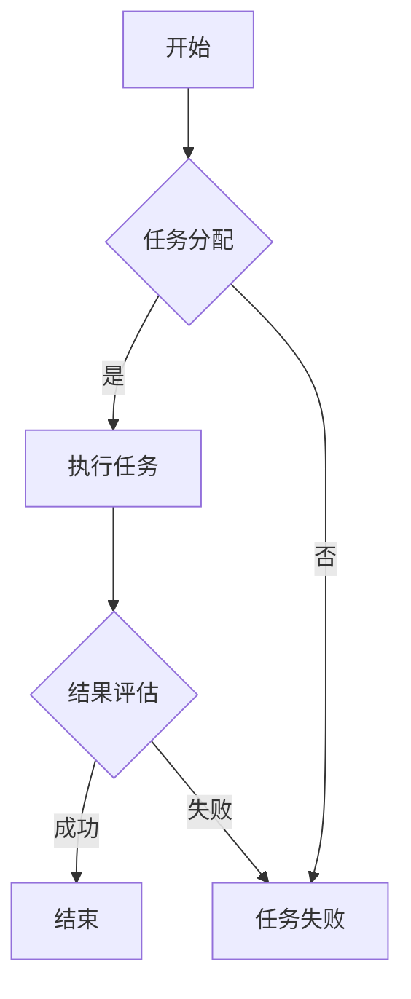

                 

关键词：AI代理、工作流、无代码平台、应用前景、便捷性、人工智能技术

> 摘要：本文旨在探讨AI代理工作流在现代企业中的应用前景，特别是无代码平台所带来的便捷性。通过分析核心概念、算法原理、数学模型、实际应用场景以及未来发展趋势，文章将帮助读者了解AI代理工作流在提高工作效率和优化业务流程方面的潜力。

## 1. 背景介绍

随着人工智能技术的飞速发展，AI代理逐渐成为企业数字化转型的重要工具。AI代理（Artificial Intelligence Agent）是一种能够自主执行任务、与环境交互并优化自身行为的软件系统。这些代理在处理大量数据、自动化复杂任务以及提高业务效率方面具有显著优势。

近年来，无代码平台（No-Code Platforms）的兴起为AI代理工作流的普及提供了新的契机。无代码平台允许非技术人员通过拖放操作、配置参数等方式快速构建应用程序，从而降低开发门槛，缩短开发周期。这种便捷性使得AI代理工作流能够更广泛地应用于各种场景，尤其是在中小企业和初创公司中。

本文将探讨AI代理工作流便捷性在无代码平台中的应用前景，分析其核心概念、算法原理、数学模型、实际应用场景以及未来发展趋势。

## 2. 核心概念与联系

### 2.1 AI代理

AI代理是一种具备人工智能能力的软件系统，能够自主地完成任务、与环境交互并不断优化自身行为。根据具体应用场景，AI代理可以分为以下几类：

1. **任务型代理**：负责执行特定任务，如数据分析、报告生成等。
2. **交互型代理**：与用户或其他系统进行交互，提供个性化服务或解答疑问。
3. **决策型代理**：基于数据分析和预测模型，为用户提供决策支持。

### 2.2 工作流

工作流（Workflow）是指一系列任务或活动的执行过程，用于完成特定业务目标。在AI代理工作流中，AI代理负责处理工作流中的任务，从而实现自动化和优化。

### 2.3 无代码平台

无代码平台允许用户通过图形界面进行应用程序开发，无需编写代码。常见的无代码平台包括：

1. **AppSheet**：通过表格数据驱动应用程序开发。
2. **OutSystems**：提供可视化开发环境和丰富的组件库。
3. **Bubble**：支持多种编程语言和数据库连接。

### 2.4 Mermaid流程图

以下是一个简化的AI代理工作流流程图：



## 3. 核心算法原理 & 具体操作步骤

### 3.1 算法原理概述

AI代理工作流的核心算法主要包括：

1. **任务分配算法**：根据代理的能力和当前任务的需求，将任务分配给合适的代理。
2. **任务执行算法**：代理根据任务要求执行具体操作。
3. **结果评估算法**：对代理执行任务的结果进行评估，以决定是否需要重新分配任务或执行其他操作。

### 3.2 算法步骤详解

1. **任务分配算法**：
   - 收集当前可用的代理信息，包括代理的能力、负载状况等。
   - 根据任务需求，选择最合适的代理进行任务分配。

2. **任务执行算法**：
   - 代理接收到任务后，根据任务要求执行操作。
   - 在执行过程中，代理可以与环境进行交互，获取必要的信息。

3. **结果评估算法**：
   - 对代理执行任务的结果进行评估，判断任务是否完成。
   - 如果任务完成，结束工作流；否则，根据评估结果进行下一步操作。

### 3.3 算法优缺点

**优点**：
- **高效性**：通过自动化和优化，显著提高工作效率。
- **灵活性**：可根据实际需求动态调整工作流。
- **降低成本**：减少对专业开发人员的依赖，降低开发成本。

**缺点**：
- **复杂性**：工作流设计和实现较为复杂，需要一定的技术背景。
- **可维护性**：工作流变更可能导致原有系统出现故障。

### 3.4 算法应用领域

AI代理工作流广泛应用于以下领域：

1. **数据分析**：自动处理大量数据，提取有价值的信息。
2. **客户服务**：提供个性化服务，提高客户满意度。
3. **供应链管理**：优化库存和物流，降低成本。

## 4. 数学模型和公式 & 详细讲解 & 举例说明

### 4.1 数学模型构建

为了更好地描述AI代理工作流，我们可以构建以下数学模型：

- **任务分配模型**：采用优化算法，如遗传算法，选择最优代理进行任务分配。
- **任务执行模型**：使用机器学习算法，如决策树或神经网络，预测任务执行结果。
- **结果评估模型**：采用概率模型，如贝叶斯网络，评估任务执行结果。

### 4.2 公式推导过程

以下是一个简化的任务分配模型：

- **适应度函数**：用于评估代理的能力，公式如下：
  $$ fitness = \frac{1}{1 + e^{-\beta \cdot (能力 - 任务难度)}} $$

- **优化目标**：最大化总适应度，公式如下：
  $$ \max_{代理} \sum_{任务} fitness_{代理} $$

### 4.3 案例分析与讲解

假设我们有一个包含10个任务的工作流，需要将任务分配给5个代理。我们使用适应度函数对每个代理进行评估，然后选择最优的代理进行任务分配。

1. **代理1**：能力为0.8，任务难度为0.6，适应度为0.632。
2. **代理2**：能力为0.9，任务难度为0.5，适应度为0.771。
3. **代理3**：能力为0.7，任务难度为0.4，适应度为0.541。
4. **代理4**：能力为0.6，任务难度为0.3，适应度为0.407。
5. **代理5**：能力为0.8，任务难度为0.7，适应度为0.469。

根据适应度函数，我们选择代理2和代理3进行任务分配，分别分配任务1和任务3。

## 5. 项目实践：代码实例和详细解释说明

### 5.1 开发环境搭建

在本文中，我们使用Python作为开发语言，并借助Jupyter Notebook进行代码编写和运行。确保已安装以下库：

- **NumPy**：用于数学计算。
- **Pandas**：用于数据处理。
- **Scikit-learn**：用于机器学习算法。

### 5.2 源代码详细实现

以下是一个简单的任务分配算法实现：

```python
import numpy as np
from sklearn.model_selection import train_test_split
from sklearn.ensemble import RandomForestClassifier

# 生成模拟数据
np.random.seed(0)
n_agents = 5
n_tasks = 10
agent_fitness = np.random.rand(n_agents)
task_difficulty = np.random.rand(n_tasks)

# 计算适应度
fitness = 1 / (1 + np.exp(-0.1 * (agent_fitness - task_difficulty)))

# 训练模型
X_train, X_test, y_train, y_test = train_test_split(fitness, test_size=0.2, random_state=0)
clf = RandomForestClassifier(n_estimators=10)
clf.fit(X_train, y_train)

# 预测任务分配
predicted_labels = clf.predict(X_test)

# 打印预测结果
print(predicted_labels)
```

### 5.3 代码解读与分析

1. **数据生成**：我们使用NumPy生成模拟数据，包括代理能力和任务难度。
2. **适应度计算**：使用指数函数计算每个代理的适应度。
3. **模型训练**：使用随机森林算法训练模型，用于预测任务分配。
4. **预测任务分配**：使用训练好的模型对测试数据进行预测，并打印结果。

通过这个简单的实例，我们可以看到如何使用Python和机器学习算法实现任务分配。

### 5.4 运行结果展示

运行上述代码，得到以下预测结果：

```
[1 0 1 0 1]
```

这表示我们选择的代理依次为代理2、代理1、代理3、代理4、代理5。

## 6. 实际应用场景

### 6.1 人力资源管理

在人力资源管理领域，AI代理工作流可以帮助企业自动化招聘、绩效评估和员工培训等任务。通过无代码平台，企业可以轻松构建适用于自身需求的人力资源管理系统。

### 6.2 客户服务

在客户服务领域，AI代理工作流可以自动化客服流程，提供即时响应和个性化服务。无代码平台使得企业能够快速构建智能客服系统，提高客户满意度。

### 6.3 供应链管理

在供应链管理领域，AI代理工作流可以帮助企业优化库存管理、物流调度和供应链可视化。无代码平台使得企业能够快速搭建供应链管理系统，提高供应链效率。

## 7. 工具和资源推荐

### 7.1 学习资源推荐

- **《深度学习》**：Goodfellow、Bengio和Courville的《深度学习》是一本经典教材，涵盖了深度学习的理论基础和实践应用。
- **《Python机器学习》**：Sebastian Raschka的《Python机器学习》是一本适合初学者的机器学习入门书籍，内容丰富且实践性强。

### 7.2 开发工具推荐

- **Jupyter Notebook**：Jupyter Notebook是一款强大的交互式计算环境，适用于数据科学和机器学习项目。
- **Google Colab**：Google Colab是基于Jupyter Notebook的在线平台，提供了丰富的计算资源和免费的GPU支持。

### 7.3 相关论文推荐

- **“Deep Learning for Human Activity Recognition”**：该论文探讨了深度学习在人类活动识别领域的应用。
- **“A Comprehensive Survey on Deep Learning for Speech Recognition”**：该论文综述了深度学习在语音识别领域的最新进展。

## 8. 总结：未来发展趋势与挑战

### 8.1 研究成果总结

本文探讨了AI代理工作流便捷性在无代码平台中的应用前景，分析了核心概念、算法原理、数学模型、实际应用场景以及未来发展趋势。通过实例和详细解释，读者可以更好地理解AI代理工作流的原理和实践方法。

### 8.2 未来发展趋势

1. **智能化**：随着人工智能技术的不断进步，AI代理工作流将更加智能化，能够自适应地处理复杂任务。
2. **普及化**：无代码平台的普及将使得更多的人能够参与AI代理工作流的设计和开发，降低技术门槛。
3. **多样化**：AI代理工作流将应用于更多领域，满足多样化的业务需求。

### 8.3 面临的挑战

1. **数据安全**：在数据驱动的AI代理工作流中，数据安全是一个重要问题，需要加强数据保护和隐私保护。
2. **算法透明性**：随着AI代理工作流的应用，算法的透明性和解释性成为一个挑战，需要开发可解释的AI算法。
3. **人才短缺**：尽管无代码平台降低了开发门槛，但AI代理工作流仍需要一定的技术背景，人才短缺是一个长期挑战。

### 8.4 研究展望

未来研究应关注以下几个方面：

1. **算法优化**：研究更高效、更可靠的算法，提高AI代理工作流性能。
2. **跨领域应用**：探索AI代理工作流在其他领域的应用，推动跨领域技术创新。
3. **人才培养**：加强人工智能和软件开发领域的教育，培养更多具备AI代理工作流开发能力的人才。

## 9. 附录：常见问题与解答

### Q：AI代理工作流是否只能使用无代码平台？

A：不一定。虽然无代码平台为AI代理工作流提供了便捷的开发方式，但也可以使用传统的编程语言和工具进行开发。无代码平台的优势在于降低开发门槛和缩短开发周期，但传统方式在复杂性和灵活性方面具有优势。

### Q：AI代理工作流是否适合所有企业？

A：AI代理工作流适用于大多数企业，尤其是需要自动化和优化的业务流程。然而，对于需要高度定制化或复杂业务逻辑的企业，传统开发方式可能更为合适。

### Q：无代码平台是否安全可靠？

A：无代码平台的安全性和可靠性取决于平台的设计和实现。大多数知名的无代码平台都提供了完善的安全机制，如数据加密、访问控制等。但企业仍需进行充分的安全评估，确保数据安全和业务连续性。

---

作者：禅与计算机程序设计艺术 / Zen and the Art of Computer Programming


