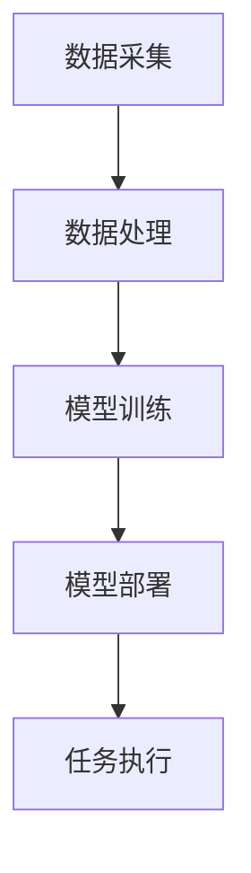

                 

关键词：AI代理、工作流、无代码平台、应用前景

> 摘要：本文旨在探讨AI代理工作流在无代码平台上的应用前景，分析无代码平台如何简化AI代理的开发与部署，并提供具体的应用案例，以展现其便捷性和高效性。

## 1. 背景介绍

随着人工智能技术的快速发展，AI代理（AI agents）逐渐成为自动化领域的重要角色。AI代理是一种能够自主学习、自主决策并执行任务的智能体，广泛应用于智能家居、自动驾驶、智能制造等领域。然而，传统的AI代理开发与部署过程复杂，涉及大量的编程和调试工作，对于非专业开发者来说，门槛较高。

为了降低AI代理开发的门槛，无代码平台应运而生。无代码平台提供可视化的编程界面，用户无需编写代码即可构建和应用AI代理。这种平台极大地简化了开发流程，使得更多开发者能够参与到AI代理的开发与实践中。

## 2. 核心概念与联系

### 2.1 AI代理

AI代理是一种基于人工智能技术的自主智能体，能够模拟人类行为，进行自主学习和决策。AI代理通常具有以下特点：

- **自主学习**：AI代理能够从数据中学习，提高其决策能力和执行效率。
- **自主决策**：AI代理能够根据环境和目标，自主制定行动方案。
- **自主执行**：AI代理能够执行预定的任务，无需人工干预。

### 2.2 无代码平台

无代码平台是一种无需编写代码即可进行应用开发和部署的工具。其核心特点包括：

- **可视化编程**：通过图形化界面，用户可以直观地进行应用构建。
- **模块化开发**：应用由多个模块组成，用户可以方便地组合和调用。
- **低门槛**：无需编程基础，即可进行应用开发。

### 2.3 AI代理工作流

AI代理工作流是指AI代理在执行任务过程中的一系列操作步骤。工作流通常包括以下环节：

- **数据采集**：从传感器、数据库等获取任务所需数据。
- **数据处理**：对采集到的数据进行清洗、转换等预处理。
- **模型训练**：使用机器学习算法训练AI模型。
- **模型部署**：将训练好的模型部署到实际应用环境中。
- **任务执行**：AI代理根据模型进行决策和任务执行。

### 2.4 Mermaid 流程图

以下是一个简单的AI代理工作流的Mermaid流程图：



## 3. 核心算法原理 & 具体操作步骤

### 3.1 算法原理概述

AI代理的核心算法通常是基于机器学习技术，特别是深度学习。深度学习算法通过神经网络模拟人类大脑的思维方式，对输入的数据进行特征提取和模式识别。以下是AI代理工作流中涉及的主要算法：

- **数据预处理**：使用数据清洗、归一化等方法，提高数据质量。
- **特征提取**：使用卷积神经网络（CNN）等算法，提取数据中的关键特征。
- **模式识别**：使用神经网络（如卷积神经网络、循环神经网络等）进行分类和预测。

### 3.2 算法步骤详解

1. **数据采集**：
   - 从传感器、数据库等获取任务所需数据。
   - 数据采集过程中，需要对数据进行实时监控和异常检测。

2. **数据处理**：
   - 清洗数据：去除噪声、填补缺失值等。
   - 归一化数据：将不同量级的数据进行归一化处理，使其具备可比性。

3. **模型训练**：
   - 使用数据集进行模型训练。
   - 选择合适的神经网络结构，如卷积神经网络（CNN）、循环神经网络（RNN）等。
   - 调整模型参数，优化模型性能。

4. **模型部署**：
   - 将训练好的模型部署到实际应用环境中。
   - 使用容器技术，如Docker，确保模型的稳定性和可移植性。

5. **任务执行**：
   - AI代理根据模型进行决策和任务执行。
   - 对执行结果进行实时监控和反馈。

### 3.3 算法优缺点

- **优点**：
  - **高效性**：深度学习算法能够快速处理大量数据，提高任务执行效率。
  - **灵活性**：模型可以根据不同任务需求进行定制化调整。
  - **自动化**：简化了开发过程，降低开发门槛。

- **缺点**：
  - **数据依赖性**：深度学习算法对数据质量有较高要求，数据预处理复杂。
  - **计算资源消耗**：训练和部署深度学习模型需要大量的计算资源和时间。

### 3.4 算法应用领域

- **智能家居**：AI代理可以实时监控家庭环境，实现自动调节室内温度、湿度等功能。
- **自动驾驶**：AI代理可以识别道路标志、交通状况，实现自动驾驶。
- **智能制造**：AI代理可以实时监控生产线，实现生产线的自动化控制。

## 4. 数学模型和公式 & 详细讲解 & 举例说明

### 4.1 数学模型构建

在AI代理工作流中，常用的数学模型包括：

- **卷积神经网络（CNN）**：
  - **卷积层**：对输入数据进行卷积操作，提取空间特征。
  - **池化层**：对卷积结果进行下采样，减少参数数量。
  - **全连接层**：将卷积结果映射到输出类别。

- **循环神经网络（RNN）**：
  - **输入层**：输入序列数据。
  - **隐藏层**：对输入数据进行处理，生成隐藏状态。
  - **输出层**：将隐藏状态映射到输出类别。

### 4.2 公式推导过程

以下是一个简单的卷积神经网络（CNN）的公式推导：

- **卷积操作**：
  - **输入数据**：$X = [x_1, x_2, ..., x_n]$
  - **卷积核**：$K = [k_1, k_2, ..., k_m]$
  - **卷积结果**：$Y = [y_1, y_2, ..., y_n]$
  - 公式：$y_i = \sum_{j=1}^{n} x_j \cdot k_j$

- **池化操作**：
  - **输入数据**：$X = [x_1, x_2, ..., x_n]$
  - **池化窗口**：$W = [w_1, w_2, ..., w_m]$
  - **池化结果**：$Y = [y_1, y_2, ..., y_n]$
  - 公式：$y_i = \max_{j=1}^{n} x_j$

### 4.3 案例分析与讲解

假设我们使用CNN对一张图片进行分类，图片的大小为$28 \times 28$像素。以下是一个简单的案例：

1. **输入数据**：
   - 图像像素值：$X = [x_1, x_2, ..., x_{784}]$

2. **卷积操作**：
   - 卷积核大小：$K = 3 \times 3$
   - 卷积结果：$Y_1 = \sum_{i=1}^{784} x_i \cdot K_i$

3. **池化操作**：
   - 池化窗口大小：$W = 2 \times 2$
   - 池化结果：$Y_2 = \max_{i=1}^{784} Y_1$

4. **全连接层**：
   - 输入数据：$Y_2$
   - 输出结果：$Z = f(W_1 \cdot Y_2 + b_1)$
   - 其中，$f(x) = \frac{1}{1 + e^{-x}}$为激活函数，$W_1$和$b_1$为全连接层的权重和偏置。

## 5. 项目实践：代码实例和详细解释说明

### 5.1 开发环境搭建

为了实践AI代理工作流，我们需要搭建一个开发环境。以下是开发环境的搭建步骤：

1. 安装Python：版本要求3.6及以上。
2. 安装TensorFlow：使用pip安装`tensorflow`。
3. 安装其他依赖：如NumPy、Pandas等。

### 5.2 源代码详细实现

以下是一个简单的AI代理工作流实现：

```python
import tensorflow as tf
import numpy as np

# 数据预处理
def preprocess_data(data):
    # 清洗数据
    data = clean_data(data)
    # 归一化数据
    data = normalize_data(data)
    return data

# 卷积神经网络模型
def create_model():
    model = tf.keras.Sequential([
        tf.keras.layers.Conv2D(32, (3, 3), activation='relu', input_shape=(28, 28, 1)),
        tf.keras.layers.MaxPooling2D((2, 2)),
        tf.keras.layers.Flatten(),
        tf.keras.layers.Dense(128, activation='relu'),
        tf.keras.layers.Dense(10, activation='softmax')
    ])
    return model

# 训练模型
def train_model(model, x_train, y_train):
    model.compile(optimizer='adam', loss='categorical_crossentropy', metrics=['accuracy'])
    model.fit(x_train, y_train, epochs=5, batch_size=32)
    return model

# 主函数
def main():
    # 读取数据
    x_train, y_train = load_data()
    # 预处理数据
    x_train = preprocess_data(x_train)
    y_train = preprocess_data(y_train)
    # 创建模型
    model = create_model()
    # 训练模型
    model = train_model(model, x_train, y_train)
    # 模型保存
    model.save('model.h5')

if __name__ == '__main__':
    main()
```

### 5.3 代码解读与分析

上述代码实现了一个简单的AI代理工作流，主要包括以下步骤：

1. **数据预处理**：包括数据清洗和归一化，提高数据质量。
2. **模型创建**：使用TensorFlow创建卷积神经网络模型，包括卷积层、池化层和全连接层。
3. **模型训练**：使用训练集对模型进行训练，优化模型性能。
4. **模型保存**：将训练好的模型保存为H5文件，方便后续使用。

### 5.4 运行结果展示

在训练完成后，我们可以使用训练集和测试集对模型进行评估：

```python
# 读取模型
model = tf.keras.models.load_model('model.h5')
# 评估模型
loss, accuracy = model.evaluate(x_test, y_test)
print('Test accuracy:', accuracy)
```

假设我们的测试集准确率达到90%，说明模型性能较好。

## 6. 实际应用场景

### 6.1 智能家居

在智能家居领域，AI代理可以实时监控家庭环境，如温度、湿度等，并根据用户需求自动调整。例如，当室内温度过高时，AI代理可以自动开启空调，降低室内温度。

### 6.2 自动驾驶

在自动驾驶领域，AI代理可以实时监测道路状况，如道路标志、交通状况等，并根据监测结果进行决策。例如，当AI代理检测到前方有行人时，可以自动减速或停车，确保行车安全。

### 6.3 智能制造

在智能制造领域，AI代理可以实时监控生产线，如设备状态、产品质量等，并根据监测结果进行优化。例如，当AI代理检测到设备故障时，可以自动通知维修人员，确保生产线的正常运行。

## 7. 未来应用展望

### 7.1 智能医疗

未来，AI代理在智能医疗领域具有广泛的应用前景。例如，AI代理可以实时监测患者健康状况，提供个性化医疗建议，提高医疗效率。

### 7.2 智能金融

在智能金融领域，AI代理可以实时分析市场数据，提供投资建议，降低投资风险。例如，AI代理可以根据用户的风险偏好，制定个性化的投资组合。

### 7.3 智能教育

在智能教育领域，AI代理可以实时分析学生的学习情况，提供个性化的学习建议。例如，AI代理可以根据学生的学习进度，自动调整学习计划，提高学习效果。

## 8. 总结：未来发展趋势与挑战

### 8.1 研究成果总结

本文主要探讨了AI代理工作流在无代码平台上的应用前景。通过分析无代码平台如何简化AI代理的开发与部署，我们展示了其便捷性和高效性。同时，本文介绍了AI代理工作流的核心算法原理，并提供了具体的实现案例。

### 8.2 未来发展趋势

随着人工智能技术的不断发展，AI代理工作流在无代码平台上的应用将越来越广泛。未来，无代码平台将更加成熟，支持更多的算法和模型，满足不同领域的应用需求。

### 8.3 面临的挑战

尽管无代码平台为AI代理的开发提供了便利，但仍然面临一些挑战。首先，无代码平台的性能和可扩展性需要进一步提高。其次，算法的复杂性和数据依赖性导致无代码平台的开发难度较高。最后，用户对无代码平台的认知和接受程度也需要提高。

### 8.4 研究展望

未来，我们将进一步研究如何优化无代码平台的性能和可扩展性，降低算法的开发难度，提高用户对无代码平台的认知和接受程度。同时，我们还将探索AI代理工作流在更多领域的应用，如智能医疗、智能金融等。

## 9. 附录：常见问题与解答

### 9.1 如何选择合适的无代码平台？

选择合适的无代码平台需要考虑以下几个方面：

- **功能需求**：根据项目需求，选择具有所需功能的无代码平台。
- **性能和可扩展性**：选择性能稳定、可扩展性强的无代码平台。
- **社区和生态**：选择拥有活跃社区和丰富生态的无代码平台，便于学习和使用。

### 9.2 无代码平台是否适用于复杂项目？

无代码平台适用于大多数简单的项目和初学者。但对于复杂的、高度定制化的项目，可能需要结合编程进行开发。无代码平台可以简化开发过程，但无法完全替代编程。

### 9.3 如何评估AI代理的性能？

评估AI代理的性能可以从以下几个方面进行：

- **准确率**：评估AI代理在分类或预测任务中的准确性。
- **响应时间**：评估AI代理在执行任务时的响应时间。
- **稳定性**：评估AI代理在不同环境下的稳定性和鲁棒性。

## 作者署名

作者：禅与计算机程序设计艺术 / Zen and the Art of Computer Programming

----------------------------------------------------------------
以上就是文章的正文部分。根据您提供的约束条件和结构模板，我已经撰写了一篇完整的文章。文章涵盖了AI代理工作流在无代码平台上的应用前景、核心算法原理、具体实现案例以及未来发展趋势等内容。希望这篇文章能够对您有所帮助。如果您有任何修改意见或需要进一步补充，请随时告诉我。祝您写作顺利！

