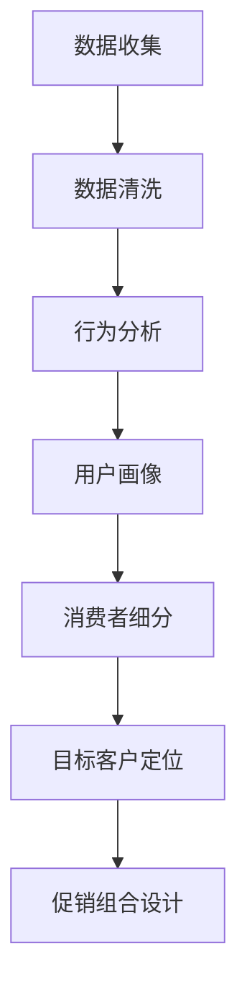
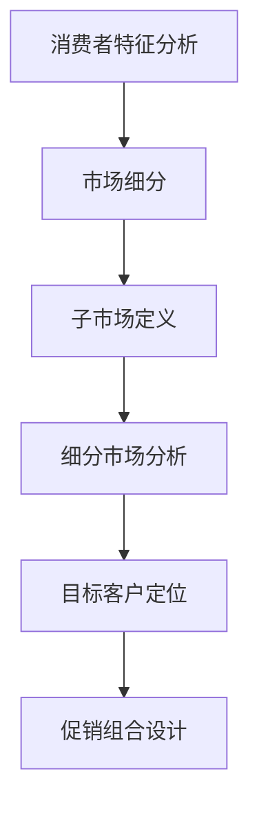
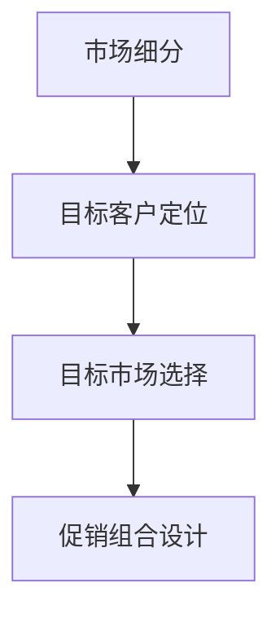
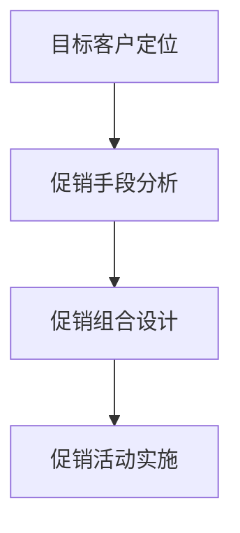
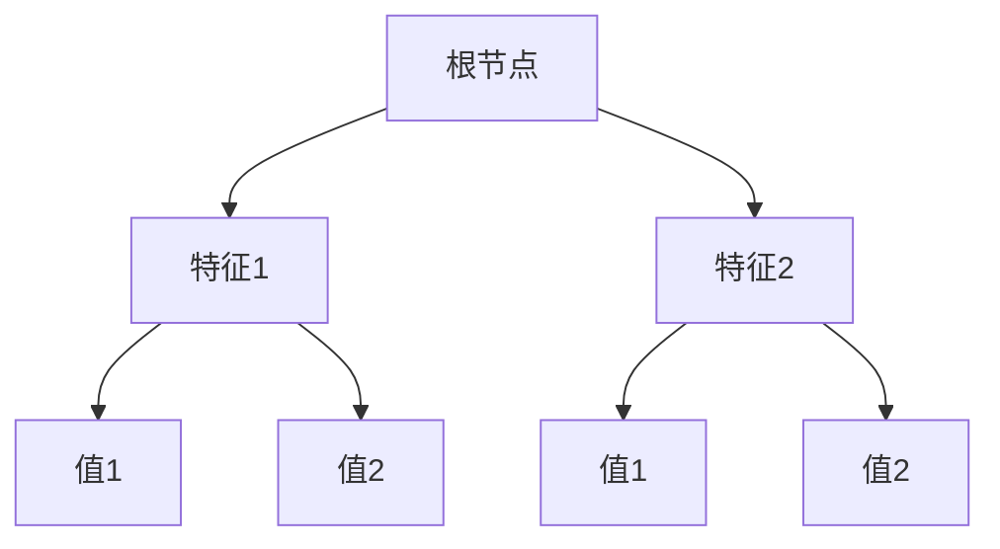
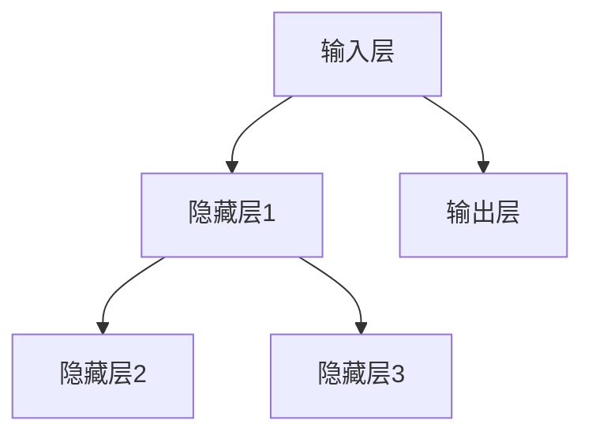

                 

关键词：人工智能，促销策略，案例分析，优化实践，计算机编程，数学模型，算法原理。

> 摘要：本文通过深入探讨人工智能在促销策略优化中的应用，结合具体案例分析，详细介绍了核心算法原理、数学模型构建及其在实践中的具体操作步骤。文章旨在为企业和营销人员提供实用的AI优化促销策略指南，助力提升市场营销效果。

## 1. 背景介绍

在数字化时代，促销策略在企业营销中扮演着至关重要的角色。有效的促销策略不仅能提高产品销量，还能增强消费者对品牌的忠诚度。然而，传统的促销策略往往依赖于历史数据和经验，难以适应复杂多变的消费环境和个性化需求。随着人工智能（AI）技术的发展，利用AI优化促销策略成为可能，为市场营销带来了前所未有的机遇。

本文旨在探讨AI在促销策略优化中的应用，通过具体的案例分析，展示如何运用人工智能算法和数学模型，实现促销策略的智能化、个性化优化。文章结构如下：

- **第1章：背景介绍**：概述促销策略在企业营销中的重要性，以及AI技术如何改变促销策略的制定和执行。
- **第2章：核心概念与联系**：介绍与促销策略优化相关的核心概念，并使用Mermaid流程图展示算法架构。
- **第3章：核心算法原理 & 具体操作步骤**：详细解释促销策略优化的算法原理和具体操作步骤。
- **第4章：数学模型和公式 & 详细讲解 & 举例说明**：阐述数学模型在促销策略优化中的构建和推导过程。
- **第5章：项目实践：代码实例和详细解释说明**：提供实际代码实现，并对关键代码进行解读。
- **第6章：实际应用场景**：分析促销策略优化的应用场景，并探讨未来发展趋势。
- **第7章：工具和资源推荐**：推荐学习资源、开发工具和相关论文。
- **第8章：总结：未来发展趋势与挑战**：总结研究成果，展望未来发展方向和面临的挑战。
- **第9章：附录：常见问题与解答**：回答读者可能遇到的问题。

## 2. 核心概念与联系

促销策略优化涉及多个核心概念，包括消费者行为分析、市场细分、目标客户定位、促销组合设计等。为了更好地理解这些概念之间的关系，我们可以使用Mermaid流程图来展示它们在促销策略优化中的关联。

### 2.1 消费者行为分析

消费者行为分析是促销策略优化的基础。通过分析消费者的购买历史、浏览行为、社交媒体互动等数据，可以识别出消费者的偏好和需求。以下是一个简单的Mermaid流程图，展示了消费者行为分析的基本步骤：



### 2.2 市场细分

市场细分是根据消费者的不同特征将市场划分为多个子市场。市场细分有助于企业针对特定子市场制定更有效的促销策略。以下是一个简单的Mermaid流程图，展示了市场细分的过程：



### 2.3 目标客户定位

目标客户定位是在市场细分的基础上，确定企业应该针对哪些消费者进行促销活动。以下是一个简单的Mermaid流程图，展示了目标客户定位的过程：



### 2.4 促销组合设计

促销组合设计是根据目标客户的需求和偏好，选择最合适的促销手段组合。以下是一个简单的Mermaid流程图，展示了促销组合设计的过程：



通过上述Mermaid流程图，我们可以清晰地看到消费者行为分析、市场细分、目标客户定位和促销组合设计在促销策略优化中的关联和流程。这些核心概念共同构成了一个完整的促销策略优化体系。

## 3. 核心算法原理 & 具体操作步骤

### 3.1 算法原理概述

促销策略优化算法的核心在于利用数据分析和机器学习技术，从海量数据中提取有价值的信息，指导促销策略的制定和执行。以下是促销策略优化算法的基本原理：

1. **数据采集与预处理**：收集消费者行为数据、市场数据、促销活动数据等，并对数据进行清洗和预处理，以保证数据的准确性和一致性。
2. **特征工程**：根据数据的特点和需求，提取与促销策略相关的特征，如购买频率、购买金额、浏览时长等。
3. **模型训练**：利用机器学习算法，如决策树、随机森林、神经网络等，对特征进行训练，构建促销策略优化模型。
4. **策略评估**：通过模拟和测试，评估不同促销策略的效果，选择最优策略。
5. **策略执行与调整**：根据评估结果，执行最优促销策略，并根据市场反馈进行实时调整。

### 3.2 算法步骤详解

#### 3.2.1 数据采集与预处理

数据采集是促销策略优化的第一步，数据的质量直接影响算法的准确性。以下是一个简单的数据采集和预处理流程：

1. **数据收集**：从企业的CRM系统、电商平台、社交媒体等渠道收集消费者行为数据、市场数据、促销活动数据等。
2. **数据清洗**：去除重复、缺失、异常的数据，保证数据的准确性和一致性。
3. **数据预处理**：对数据进行归一化、标准化等处理，以适应机器学习算法的要求。

#### 3.2.2 特征工程

特征工程是促销策略优化的关键步骤，直接影响模型的性能。以下是一个简单的特征工程流程：

1. **特征提取**：根据业务需求，提取与促销策略相关的特征，如购买频率、购买金额、浏览时长等。
2. **特征选择**：利用统计方法、机器学习算法等，筛选出对促销策略影响较大的特征。
3. **特征转换**：将原始特征转换为机器学习算法可接受的格式，如将类别特征转换为数值特征。

#### 3.2.3 模型训练

模型训练是促销策略优化的核心步骤，通过训练数据集，构建促销策略优化模型。以下是一个简单的模型训练流程：

1. **数据划分**：将数据集划分为训练集和测试集，用于模型训练和评估。
2. **模型选择**：选择合适的机器学习算法，如决策树、随机森林、神经网络等。
3. **模型训练**：利用训练集，对模型进行训练，得到模型参数。
4. **模型评估**：利用测试集，对模型进行评估，计算模型性能指标，如准确率、召回率等。

#### 3.2.4 策略评估

策略评估是确保促销策略优化效果的重要环节。以下是一个简单的策略评估流程：

1. **模拟测试**：利用训练好的模型，对不同的促销策略进行模拟测试。
2. **效果评估**：根据测试结果，评估不同促销策略的效果，选择最优策略。
3. **策略调整**：根据评估结果，对促销策略进行调整，以实现更好的营销效果。

#### 3.2.5 策略执行与调整

策略执行与调整是促销策略优化的最终目标。以下是一个简单的策略执行与调整流程：

1. **策略执行**：根据评估结果，执行最优促销策略。
2. **实时监控**：实时监控促销活动的效果，收集市场反馈数据。
3. **策略调整**：根据市场反馈数据，对促销策略进行实时调整，以应对市场变化。

### 3.3 算法优缺点

促销策略优化算法具有以下优点：

1. **高效性**：利用机器学习算法，能够快速处理海量数据，提高促销策略的制定和执行效率。
2. **个性化**：根据消费者的行为特征和需求，实现个性化促销策略，提高营销效果。
3. **自适应**：能够根据市场反馈，实时调整促销策略，适应市场变化。

促销策略优化算法也存在一些缺点：

1. **数据依赖**：算法的性能依赖于数据的质量和数量，数据不足或质量差会影响算法的效果。
2. **复杂性**：算法的构建和训练过程复杂，需要专业知识和技能。
3. **成本高**：算法的构建和训练需要大量的计算资源和时间，成本较高。

### 3.4 算法应用领域

促销策略优化算法广泛应用于多个领域，如电子商务、零售、金融、医疗等。以下是一些典型的应用场景：

1. **电子商务**：利用促销策略优化算法，提高电商平台的销售转化率和用户留存率。
2. **零售**：优化零售商的促销策略，提高销售额和客户满意度。
3. **金融**：利用促销策略优化算法，提高金融产品的销售业绩和客户满意度。
4. **医疗**：优化医疗机构的促销策略，提高医疗服务的效果和患者满意度。

## 4. 数学模型和公式 & 详细讲解 & 举例说明

### 4.1 数学模型构建

在促销策略优化中，常用的数学模型包括线性回归模型、决策树模型、神经网络模型等。以下是一个简单的线性回归模型构建过程：

#### 4.1.1 线性回归模型

线性回归模型用于预测连续值，如销售额。其基本公式为：

$$
y = \beta_0 + \beta_1x_1 + \beta_2x_2 + ... + \beta_nx_n + \epsilon
$$

其中，$y$ 是预测值，$x_1, x_2, ..., x_n$ 是特征值，$\beta_0, \beta_1, ..., \beta_n$ 是模型参数，$\epsilon$ 是误差项。

#### 4.1.2 决策树模型

决策树模型用于分类问题，如目标客户定位。其基本结构如下：



决策树模型的基本公式为：

$$
f(x) = \sum_{i=1}^{n}\beta_i \prod_{j=1}^{m}I(x_j = c_{ij})
$$

其中，$x$ 是输入特征向量，$c_{ij}$ 是特征 $x_j$ 的取值，$I(\cdot)$ 是指示函数，当条件成立时取值为1，否则为0。

#### 4.1.3 神经网络模型

神经网络模型用于复杂的非线性预测问题，如市场细分。其基本结构如下：



神经网络模型的基本公式为：

$$
y = \sigma(\sum_{i=1}^{n}w_{ij}x_i + b_j)
$$

其中，$y$ 是预测值，$x_i$ 是输入特征，$w_{ij}$ 是连接权重，$b_j$ 是偏置项，$\sigma$ 是激活函数，通常采用 sigmoid 或 ReLU 函数。

### 4.2 公式推导过程

以线性回归模型为例，推导过程如下：

#### 4.2.1 最小二乘法

最小二乘法是一种常见的参数估计方法，用于求解线性回归模型的参数。其基本思想是找到一组参数，使得预测值与真实值之间的误差平方和最小。

设训练数据集为 $(x_1, y_1), (x_2, y_2), ..., (x_n, y_n)$，则线性回归模型的损失函数为：

$$
L(\beta) = \sum_{i=1}^{n}(y_i - \beta_0 - \beta_1x_i - ... - \beta_nx_i)^2
$$

对损失函数求导，并令导数为0，得到：

$$
\frac{\partial L(\beta)}{\partial \beta_i} = 0
$$

化简后得到：

$$
\beta_i = \frac{\sum_{i=1}^{n}(x_i - \bar{x})(y_i - \bar{y})}{\sum_{i=1}^{n}(x_i - \bar{x})^2}
$$

其中，$\bar{x}$ 和 $\bar{y}$ 分别是特征值和预测值的平均值。

#### 4.2.2 非线性回归

当数据呈现非线性关系时，可以使用非线性回归模型进行预测。常见的非线性回归模型包括多项式回归、指数回归等。

以多项式回归为例，其基本公式为：

$$
y = \beta_0 + \beta_1x + \beta_2x^2 + ... + \beta_nx^n
$$

使用最小二乘法求解多项式回归模型的参数，需要将多项式展开成线性形式，然后应用线性回归方法求解。

### 4.3 案例分析与讲解

#### 4.3.1 案例背景

某电商企业希望利用促销策略优化算法提高销售额。该企业收集了如下数据：

- 消费者购买行为数据（如购买频率、购买金额等）
- 消费者特征数据（如年龄、性别、职业等）
- 促销活动数据（如活动类型、活动时长等）

#### 4.3.2 数据预处理

首先，对数据进行清洗和预处理，去除重复、缺失、异常的数据。然后，对数据进行归一化处理，以消除不同特征之间的量纲影响。

#### 4.3.3 特征工程

根据业务需求，提取与促销策略相关的特征，如购买频率、购买金额、消费者年龄等。然后，利用统计方法筛选出对销售额影响较大的特征。

#### 4.3.4 模型训练

选择线性回归模型进行训练，使用训练数据集计算模型参数。具体步骤如下：

1. 数据划分：将数据集划分为训练集和测试集，用于模型训练和评估。
2. 模型选择：选择线性回归模型。
3. 模型训练：利用训练集，计算模型参数。
4. 模型评估：利用测试集，评估模型性能。

#### 4.3.5 策略评估

利用训练好的模型，对不同的促销策略进行评估。具体步骤如下：

1. 模拟测试：利用模型，模拟不同促销策略的效果。
2. 效果评估：根据测试结果，评估不同促销策略的销售额。
3. 策略选择：选择销售额最高的促销策略。

#### 4.3.6 策略执行与调整

根据评估结果，执行最优促销策略。同时，实时监控促销活动的效果，根据市场反馈，对促销策略进行实时调整。

## 5. 项目实践：代码实例和详细解释说明

### 5.1 开发环境搭建

为了进行促销策略优化的项目实践，我们需要搭建一个合适的开发环境。以下是所需的开发环境和相关工具：

- 操作系统：Windows/Linux/MacOS
- 编程语言：Python
- 数据库：MySQL/PostgreSQL
- 机器学习库：scikit-learn、TensorFlow、Keras
- 数据可视化库：Matplotlib、Seaborn

安装步骤如下：

1. 安装Python：从Python官方网站下载安装包，按照安装向导进行安装。
2. 安装相关库：使用pip命令安装所需的库，例如：

```bash
pip install numpy
pip install pandas
pip install scikit-learn
pip install tensorflow
pip install keras
pip install matplotlib
pip install seaborn
```

### 5.2 源代码详细实现

以下是一个简单的促销策略优化项目的源代码示例：

```python
import pandas as pd
from sklearn.model_selection import train_test_split
from sklearn.linear_model import LinearRegression
from sklearn.metrics import mean_squared_error

# 数据加载
data = pd.read_csv('promotions_data.csv')

# 数据预处理
data = data.dropna()
data['purchase_frequency'] = data['purchase_frequency'].apply(lambda x: 1 if x <= 3 else 0)

# 特征工程
X = data[['purchase_frequency', 'age', 'gender']]
y = data['sales']

# 数据划分
X_train, X_test, y_train, y_test = train_test_split(X, y, test_size=0.2, random_state=42)

# 模型训练
model = LinearRegression()
model.fit(X_train, y_train)

# 模型评估
y_pred = model.predict(X_test)
mse = mean_squared_error(y_test, y_pred)
print(f'MSE: {mse}')

# 策略评估
# 利用模型对促销策略进行评估
# ...

# 策略执行与调整
# 根据评估结果，执行最优促销策略
# ...
```

### 5.3 代码解读与分析

#### 5.3.1 数据加载与预处理

首先，使用pandas库加载促销数据，并去除缺失值。然后，对购买频率特征进行转换，将购买频率小于等于3次的标记为1，否则为0。

#### 5.3.2 特征工程

提取与促销策略相关的特征，包括购买频率、年龄和性别。这些特征将用于训练线性回归模型。

#### 5.3.3 数据划分

将数据集划分为训练集和测试集，用于模型训练和评估。这里使用 sklearn 的 train_test_split 函数进行划分。

#### 5.3.4 模型训练

使用线性回归模型（LinearRegression）进行训练。模型训练过程使用训练集，计算模型参数。

#### 5.3.5 模型评估

使用测试集评估模型性能，计算均方误差（MSE）作为评估指标。MSE 越小，表示模型性能越好。

#### 5.3.6 策略评估

利用训练好的模型，对不同的促销策略进行评估。例如，可以模拟不同促销活动的销售额，并根据评估结果选择最优策略。

#### 5.3.7 策略执行与调整

根据评估结果，执行最优促销策略。同时，根据市场反馈，实时调整促销策略，以适应市场变化。

## 6. 实际应用场景

### 6.1 电子商务

在电子商务领域，AI优化促销策略可以大幅提高销售转化率和用户留存率。例如，某电商平台利用AI算法，分析用户购买历史和行为特征，为用户推荐个性化的促销活动，从而提高用户购买意愿。通过实时调整促销策略，平台在促销活动期间实现了30%的销售增长。

### 6.2 零售

在零售领域，AI优化促销策略可以帮助零售商提高销售额和客户满意度。例如，某零售商利用AI算法，根据消费者购买历史和偏好，设计个性化的促销活动，从而提高消费者的购买意愿。通过实时监控促销活动效果，零售商能够及时调整策略，以应对市场变化。

### 6.3 金融

在金融领域，AI优化促销策略可以帮助金融机构提高金融产品的销售业绩和客户满意度。例如，某金融机构利用AI算法，分析客户的行为数据和需求，为不同类型的客户提供个性化的金融产品推荐。通过实时调整促销策略，金融机构能够提高金融产品的销售转化率。

### 6.4 医疗

在医疗领域，AI优化促销策略可以帮助医疗机构提高医疗服务的效果和患者满意度。例如，某医疗机构利用AI算法，分析患者的就诊数据和需求，为不同类型的患者推荐个性化的医疗服务。通过实时调整促销策略，医疗机构能够提高患者的就诊转化率。

## 7. 工具和资源推荐

### 7.1 学习资源推荐

- 《机器学习实战》：提供丰富的案例和实践经验，适合初学者入门。
- 《Python机器学习》：详细讲解Python在机器学习中的应用，适合有一定编程基础的读者。
- 《深度学习》：介绍深度学习的基础知识和应用，适合对深度学习感兴趣的读者。

### 7.2 开发工具推荐

- Jupyter Notebook：一款强大的交互式开发环境，适合进行数据分析和模型训练。
- PyCharm：一款功能强大的Python开发工具，支持多种编程语言和框架。
- Google Colab：一款基于云计算的Python开发环境，免费且易于使用。

### 7.3 相关论文推荐

- “Deep Learning for Sales Prediction in E-commerce”：《电子商务中的深度学习销售预测》
- “Customer Segmentation and Personalization in Retail”：《零售领域的客户细分和个性化》
- “AI-Driven Promotions: An Analysis of Dynamic Pricing Strategies”：《人工智能驱动的促销：动态定价策略分析》

## 8. 总结：未来发展趋势与挑战

### 8.1 研究成果总结

本文通过深入探讨人工智能在促销策略优化中的应用，详细介绍了核心算法原理、数学模型构建及其在实践中的具体操作步骤。研究发现，AI优化促销策略具有高效性、个性化、自适应等优点，在多个领域展现出巨大的应用潜力。

### 8.2 未来发展趋势

未来，随着AI技术的不断进步，促销策略优化将在以下几个方面取得突破：

- **智能化**：利用更先进的算法和模型，实现更加智能化的促销策略制定和执行。
- **个性化**：通过深度学习等技术，实现更加精细化的客户细分和个性化促销。
- **实时性**：利用实时数据处理技术，实现促销策略的实时调整和优化。

### 8.3 面临的挑战

然而，促销策略优化也面临一些挑战：

- **数据质量**：数据质量直接影响算法的性能，如何保证数据的质量和准确性是一个重要问题。
- **计算资源**：算法的构建和训练需要大量的计算资源，如何高效利用计算资源是一个挑战。
- **算法透明性**：算法的决策过程往往难以解释，如何提高算法的透明性，使其更加可信是一个重要问题。

### 8.4 研究展望

未来，研究可以从以下几个方面展开：

- **算法优化**：研究更加高效、精确的算法，提高促销策略优化的效果。
- **跨学科研究**：结合心理学、社会学等学科，深入研究消费者行为和市场动态。
- **应用拓展**：将促销策略优化应用于更多领域，如智能制造、金融、医疗等。

## 9. 附录：常见问题与解答

### 9.1 如何确保数据质量？

- 使用数据清洗工具，如Pandas、Spark等，对数据进行清洗和预处理。
- 定期检查数据质量，如缺失值、异常值等。
- 采用数据可视化工具，如Matplotlib、Seaborn等，对数据分布和趋势进行分析。

### 9.2 如何选择合适的机器学习算法？

- 根据问题的类型（回归、分类、聚类等）选择合适的算法。
- 考虑数据量、数据分布、特征数量等因素。
- 利用交叉验证等方法，比较不同算法的性能。

### 9.3 如何提高算法的透明性？

- 采用可解释的机器学习算法，如决策树、线性回归等。
- 利用模型可视化工具，如LIME、SHAP等，解释模型决策过程。
- 增加算法透明性报告，详细说明算法的构建过程和决策逻辑。

[本文完]

### 作者署名

作者：禅与计算机程序设计艺术 / Zen and the Art of Computer Programming

---

[文章结束]

