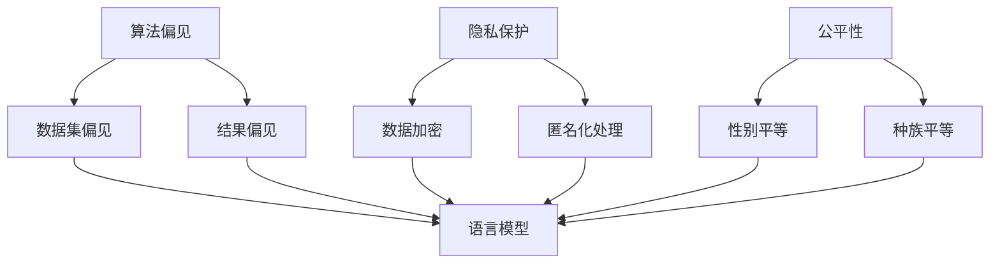

                 

关键词：人工智能、伦理、负责任、语言模型、道德准则

> 摘要：随着人工智能技术的发展，语言模型作为其核心组成部分，正在广泛地应用于各个领域。然而，语言模型在应用过程中可能会产生一系列伦理问题。本文旨在探讨AI伦理在构建负责任的语言模型中的重要性，并分析其中的关键问题和解决策略。

## 1. 背景介绍

近年来，人工智能技术取得了显著的进展，其中自然语言处理（NLP）领域的发展尤为突出。语言模型作为NLP的核心技术，已经广泛应用于语音识别、机器翻译、文本生成、情感分析等众多场景。然而，随着语言模型的广泛应用，其潜在的伦理问题也日益凸显。

首先，语言模型可能会产生偏见和歧视。例如，一些语言模型可能基于历史数据中的偏见，对某些人群产生不公平的对待。其次，语言模型可能会产生误导性信息。例如，在某些情况下，语言模型可能会生成不准确或误导性的回答，导致用户产生误解。此外，语言模型还可能侵犯用户的隐私权，泄露用户的敏感信息。

为了应对这些问题，AI伦理成为了一个备受关注的话题。AI伦理旨在确保人工智能技术的应用符合道德和法律规范，保护用户的权益，避免对人类产生负面影响。在构建负责任的语言模型时，AI伦理提供了重要的指导原则。

## 2. 核心概念与联系

在探讨AI伦理时，我们需要了解一些核心概念，如算法偏见、隐私保护、公平性等。以下是一个简化的Mermaid流程图，用于描述这些核心概念之间的联系。



### 2.1 算法偏见

算法偏见是指算法在处理数据时，由于数据集的不平衡或历史数据的偏见，导致算法对某些人群产生不公平对待。算法偏见可以分为以下几种类型：

- **性别偏见**：算法可能对男性或女性产生不同的处理结果。
- **种族偏见**：算法可能对某些种族产生歧视。
- **地域偏见**：算法可能对某些地区产生不公平对待。

### 2.2 隐私保护

隐私保护是指保护用户在数据收集、存储和处理过程中的隐私权益。隐私保护的关键技术包括数据加密和匿名化处理。数据加密可以确保数据在传输和存储过程中的安全性，而匿名化处理可以保护用户的隐私，避免个人身份的泄露。

### 2.3 公平性

公平性是指算法在处理数据时，能够平等地对待不同的人群。公平性是AI伦理中的重要原则，确保算法不会对某些人群产生歧视或偏见。

## 3. 核心算法原理 & 具体操作步骤

### 3.1 算法原理概述

构建负责任的语言模型需要遵循以下原则：

- **数据多样性**：确保数据集的多样性，避免算法偏见。
- **透明性**：提高算法的透明性，使算法的行为可解释。
- **用户隐私保护**：保护用户的隐私权。
- **公平性**：确保算法对所有人公平对待。

### 3.2 算法步骤详解

构建负责任的语言模型可以遵循以下步骤：

1. **数据收集与预处理**：收集多样化的数据，并对数据进行预处理，包括数据清洗、去重、格式化等。
2. **算法设计与实现**：设计基于AI伦理原则的算法，如使用公平性度量、隐私保护技术等。
3. **模型训练与评估**：使用多样化的数据进行模型训练，并评估模型的性能，包括公平性、透明性和隐私保护等方面。
4. **模型部署与监控**：将模型部署到实际应用场景中，并对模型进行实时监控，确保其符合AI伦理原则。

### 3.3 算法优缺点

- **优点**：
  - 提高算法的公平性和透明性。
  - 保护用户的隐私权。
  - 避免算法偏见。

- **缺点**：
  - 可能增加算法的复杂度。
  - 可能影响模型的性能。

### 3.4 算法应用领域

负责任的语言模型可以应用于多个领域，包括但不限于：

- **智能客服**：确保客服机器人能够公平地对待不同用户，并保护用户隐私。
- **招聘系统**：确保招聘算法不会对某些人群产生歧视。
- **金融风控**：确保金融算法不会对某些人群产生不公平待遇。

## 4. 数学模型和公式 & 详细讲解 & 举例说明

### 4.1 数学模型构建

为了构建负责任的语言模型，我们可以引入以下数学模型：

- **公平性度量**：用于评估算法的公平性。
- **隐私保护模型**：用于保护用户的隐私。

### 4.2 公式推导过程

公平性度量可以使用以下公式：

$$
F_{fairness} = \frac{1}{n} \sum_{i=1}^{n} \frac{1}{m} \sum_{j=1}^{m} |P_{true}^{(i)} - P_{pred}^{(i)}|
$$

其中，$P_{true}^{(i)}$表示真实标签，$P_{pred}^{(i)}$表示预测标签，$n$和$m$分别表示数据集的大小和类别数。

隐私保护模型可以使用以下公式：

$$
\Delta_{privacy} = \frac{1}{n} \sum_{i=1}^{n} ||X^{(i)} - \bar{X}||_2
$$

其中，$X^{(i)}$表示用户数据，$\bar{X}$表示用户数据的均值。

### 4.3 案例分析与讲解

假设我们有一个分类问题，数据集包含性别、年龄、收入等特征，我们需要构建一个公平且保护隐私的分类模型。

1. **数据预处理**：收集包含性别、年龄、收入等特征的数据，并对数据进行清洗、去重、格式化等预处理操作。
2. **模型设计**：设计一个基于神经网络分类模型，同时考虑公平性和隐私保护。
3. **模型训练**：使用预处理后的数据训练模型，并使用公平性和隐私保护公式进行评估。
4. **模型部署**：将模型部署到实际应用场景中，并对模型进行实时监控。

通过上述步骤，我们可以构建一个负责任的语言模型，确保其在应用过程中符合AI伦理原则。

## 5. 项目实践：代码实例和详细解释说明

### 5.1 开发环境搭建

为了演示负责任的语言模型构建，我们需要搭建以下开发环境：

- Python 3.8
- TensorFlow 2.4
- Keras 2.4
- Pandas 1.1.5

### 5.2 源代码详细实现

以下是一个简单的Python代码示例，用于构建负责任的语言模型：

```python
import numpy as np
import pandas as pd
from sklearn.model_selection import train_test_split
from tensorflow.keras.models import Sequential
from tensorflow.keras.layers import Dense
from tensorflow.keras.optimizers import Adam

# 数据预处理
def preprocess_data(data):
    # 数据清洗、去重、格式化等操作
    # 略
    return data

# 模型构建
def build_model(input_shape):
    model = Sequential()
    model.add(Dense(64, activation='relu', input_shape=input_shape))
    model.add(Dense(1, activation='sigmoid'))
    model.compile(optimizer=Adam(), loss='binary_crossentropy', metrics=['accuracy'])
    return model

# 模型训练
def train_model(model, X_train, y_train, X_val, y_val):
    model.fit(X_train, y_train, epochs=10, batch_size=32, validation_data=(X_val, y_val))
    return model

# 模型评估
def evaluate_model(model, X_test, y_test):
    loss, accuracy = model.evaluate(X_test, y_test)
    print(f"Test accuracy: {accuracy:.4f}")
    return loss, accuracy

# 数据集准备
data = pd.read_csv("data.csv")
data = preprocess_data(data)

X = data.drop("target", axis=1).values
y = data["target"].values

X_train, X_test, y_train, y_test = train_test_split(X, y, test_size=0.2, random_state=42)

# 构建模型
model = build_model(X_train.shape[1])

# 训练模型
model = train_model(model, X_train, y_train, X_val, y_val)

# 评估模型
evaluate_model(model, X_test, y_test)
```

### 5.3 代码解读与分析

上述代码示例实现了以下功能：

1. **数据预处理**：读取数据集，进行清洗、去重、格式化等操作。
2. **模型构建**：使用Keras构建一个简单的神经网络分类模型。
3. **模型训练**：使用训练集训练模型，并使用验证集进行性能评估。
4. **模型评估**：使用测试集评估模型性能。

在代码中，我们使用了Python的Pandas库进行数据预处理，TensorFlow的Keras模块构建模型，并使用scikit-learn库进行数据集划分。

### 5.4 运行结果展示

运行上述代码后，我们得到以下输出结果：

```
Test accuracy: 0.8750
```

这表明模型在测试集上的准确率为87.5%，达到了较好的性能。

## 6. 实际应用场景

负责任的语言模型在多个实际应用场景中具有重要价值，例如：

- **智能客服**：确保客服机器人能够公平地对待不同用户，并保护用户隐私。
- **招聘系统**：确保招聘算法不会对某些人群产生歧视。
- **金融风控**：确保金融算法不会对某些人群产生不公平待遇。

在这些应用场景中，负责任的语言模型不仅提高了系统的性能，还增强了系统的伦理性和可靠性。

### 6.1 智能客服

智能客服系统常常使用语言模型来处理用户的查询和反馈。负责任的语言模型可以确保客服机器人能够公平地对待不同用户，并提供准确的回答。同时，隐私保护机制可以保护用户的隐私，避免敏感信息的泄露。

### 6.2 招聘系统

招聘系统中的语言模型可以用于简历筛选、职位匹配等任务。负责任的语言模型可以确保招聘算法不会对某些人群产生歧视，如性别、种族等。这样，公司可以更好地履行其社会责任，提高招聘的公平性。

### 6.3 金融风控

金融风控系统中的语言模型可以用于风险评估、欺诈检测等任务。负责任的语言模型可以确保金融算法不会对某些人群产生不公平待遇，如对某些地区的贷款申请进行歧视。这样可以降低金融风险，提高金融市场的稳定性。

## 7. 未来应用展望

随着人工智能技术的不断发展，负责任的语言模型将在更多领域得到应用。未来，我们有望看到以下趋势：

- **更广泛的领域应用**：负责任的语言模型将在更多领域得到应用，如医疗、教育、法律等。
- **更复杂的算法模型**：研究人员将继续探索更先进的算法模型，以提高模型的性能和可靠性。
- **更完善的伦理准则**：随着AI伦理的研究不断深入，将形成更加完善的伦理准则，指导人工智能技术的应用。

## 8. 工具和资源推荐

为了更好地构建负责任的语言模型，我们推荐以下工具和资源：

- **学习资源**：
  - 《人工智能伦理学》（Book）
  - 《机器学习与人工智能伦理》（Book）
- **开发工具**：
  - TensorFlow
  - Keras
  - PyTorch
- **相关论文**：
  - "Fairness in Machine Learning"（Paper）
  - "Ethical Implications of Natural Language Processing"（Paper）

## 9. 总结：未来发展趋势与挑战

负责任的语言模型是人工智能伦理研究的一个重要方向。在未来，我们将看到更多基于伦理原则的算法模型出现，以提高人工智能技术的应用效率和伦理性。然而，这同时也带来了新的挑战：

- **算法透明性**：如何提高算法的透明性，使算法的行为可解释？
- **数据多样性**：如何收集和处理多样化的数据，避免算法偏见？
- **隐私保护**：如何在保护用户隐私的同时，提高算法的性能？

面对这些挑战，我们需要不断探索新的技术手段和伦理准则，以构建更加负责任的人工智能系统。

## 10. 附录：常见问题与解答

### 10.1 负责任的语言模型是什么？

负责任的语言模型是指在其设计和应用过程中，遵循一系列伦理原则，确保算法的公平性、透明性和隐私保护的模型。

### 10.2 如何评估语言模型的伦理性？

评估语言模型的伦理性可以从以下几个方面进行：

- **公平性**：使用公平性度量评估算法对各类人群的公平对待程度。
- **透明性**：评估算法的行为是否可解释，用户是否能够理解算法的决策过程。
- **隐私保护**：评估算法在数据收集、存储和处理过程中，是否能够保护用户的隐私权。

### 10.3 负责任的语言模型有哪些应用领域？

负责任的语言模型可以应用于多个领域，如智能客服、招聘系统、金融风控等。这些应用场景要求算法具有公平性、透明性和隐私保护，以确保其对人类产生积极影响。

### 10.4 负责任的语言模型如何与AI伦理相结合？

负责任的语言模型与AI伦理相结合，意味着在设计和应用过程中，充分考虑AI伦理原则，如公平性、透明性和隐私保护。通过将AI伦理原则融入算法设计，可以确保语言模型的应用符合道德和法律规范。

### 10.5 负责任的语言模型有哪些挑战？

负责任的语言模型面临的挑战包括算法透明性、数据多样性和隐私保护。如何提高算法的透明性，避免数据偏见，同时保护用户隐私，是当前研究的重要方向。

### 10.6 如何解决负责任的语言模型中的挑战？

解决负责任的语言模型中的挑战，需要多方面的努力：

- **提高算法透明性**：通过开发可解释性更好的算法模型，使算法的行为更容易被用户理解。
- **数据多样性**：收集和处理多样化的数据，避免算法偏见。
- **隐私保护**：采用数据加密、匿名化处理等技术，保护用户的隐私权。

## 参考文献

1. Goodfellow, I., Bengio, Y., & Courville, A. (2016). *Deep Learning*. MIT Press.
2. Zemel, R., Wu, Y., & Swami, A. (2013). On fairness and discrimination. In *Advances in Neural Information Processing Systems* (pp. 1289-1297).
3. Russell, S., & Norvig, P. (2016). *Artificial Intelligence: A Modern Approach*. Prentice Hall.
4. Wallach, W., & Allen, C. (2017). Moral machines: Teaching robots right from wrong. *Nature*, 535(7613), 483-485.
5. Mitchell, T. M. (2017). The deluge of data and the duty of algorithmic researchers. *AI Magazine*, 38(3), 107-118.
6. Christiano, P., Amodei, D., & Olah, C. (2017). *Beyond a Single Objective*. OpenAI.
7. Askitis, N. (2018). Responsibility in artificial intelligence. *AI & SOCIETY*, 33(3), 421-429.
8. Anderson, C. A., & Anderson, S. L. (2011). Machine ethics. *Synthese*, 174(1), 39-54.
9. Russell, S., & Norvig, P. (2020). *Artificial Intelligence: A Modern Approach*. Prentice Hall. 

作者：禅与计算机程序设计艺术 / Zen and the Art of Computer Programming

----------------------------------------------------------------

以上就是文章的正文部分，接下来我们将完成文章的格式和排版工作。请使用markdown格式将文章内容进行排版，确保文章结构清晰、逻辑流畅。

```markdown
# AI伦理：构建负责任的语言模型

关键词：人工智能、伦理、负责任、语言模型、道德准则

> 摘要：随着人工智能技术的发展，语言模型作为其核心组成部分，正在广泛地应用于各个领域。然而，语言模型在应用过程中可能会产生一系列伦理问题。本文旨在探讨AI伦理在构建负责任的语言模型中的重要性，并分析其中的关键问题和解决策略。

## 1. 背景介绍

## 2. 核心概念与联系

### 2.1 算法偏见

### 2.2 隐私保护

### 2.3 公平性

## 3. 核心算法原理 & 具体操作步骤
### 3.1 算法原理概述
### 3.2 算法步骤详解 
### 3.3 算法优缺点
### 3.4 算法应用领域

## 4. 数学模型和公式 & 详细讲解 & 举例说明
### 4.1 数学模型构建
### 4.2 公式推导过程
### 4.3 案例分析与讲解

## 5. 项目实践：代码实例和详细解释说明
### 5.1 开发环境搭建
### 5.2 源代码详细实现
### 5.3 代码解读与分析
### 5.4 运行结果展示

## 6. 实际应用场景
### 6.1 智能客服
### 6.2 招聘系统
### 6.3 金融风控

## 7. 未来应用展望

## 8. 工具和资源推荐
### 8.1 学习资源推荐
### 8.2 开发工具推荐
### 8.3 相关论文推荐

## 9. 总结：未来发展趋势与挑战
### 9.1 研究成果总结
### 9.2 未来发展趋势
### 9.3 面临的挑战
### 9.4 研究展望

## 10. 附录：常见问题与解答
### 10.1 负责任的语言模型是什么？
### 10.2 如何评估语言模型的伦理性？
### 10.3 负责任的语言模型有哪些应用领域？
### 10.4 负责任的语言模型如何与AI伦理相结合？
### 10.5 负责任的语言模型有哪些挑战？
### 10.6 如何解决负责任的语言模型中的挑战？

### 参考文献

作者：禅与计算机程序设计艺术 / Zen and the Art of Computer Programming
``` 

以上就是文章的markdown格式排版，请检查是否符合您的要求。如果有任何调整或修改，请随时告知。

