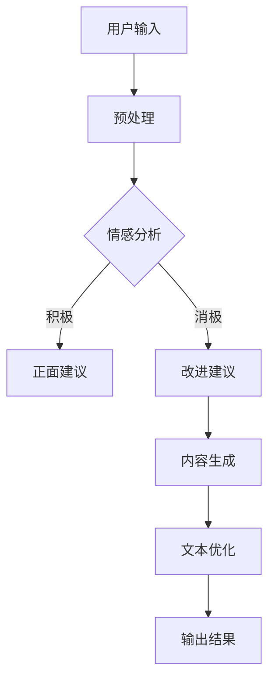

                 

关键词：人工智能、AI写作助手、创造力、写作工具、技术博客

> 摘要：本文将探讨AI写作助手的背景、核心概念、算法原理、数学模型、项目实践及实际应用场景。我们将通过深入分析，展示AI写作助手如何助力人类在技术博客创作中实现创意与效率的双重提升。

## 1. 背景介绍

随着人工智能技术的飞速发展，越来越多的AI工具应运而生，它们正逐步融入我们的生活和工作。在IT领域，技术博客写作一直是程序员和科技从业者展示知识、交流思想的重要途径。然而，写作往往需要耗费大量的时间和精力，尤其是在构思、组织及修改过程中。因此，寻找一种能够辅助人类提升写作效率与创造力的工具变得尤为重要。

AI写作助手应运而生，它通过自然语言处理、机器学习等先进技术，提供从选题策划、内容生成到文本润色的全方位支持。AI写作助手不仅能帮助用户快速生成高质量的内容，还能通过数据分析和智能推荐，为用户节省大量时间，从而更加专注于创意思维的拓展。

## 2. 核心概念与联系

在深入探讨AI写作助手的运作机制之前，我们需要了解几个核心概念：自然语言处理（NLP）、机器学习和深度学习。这些技术构成了AI写作助手的技术基础。

### 2.1 自然语言处理（NLP）

自然语言处理是计算机科学和语言学的交叉领域，旨在使计算机能够理解和生成人类语言。NLP技术包括文本分类、情感分析、命名实体识别等，这些都是AI写作助手实现智能写作的基础。

### 2.2 机器学习

机器学习是AI的核心组成部分，它使计算机能够从数据中学习规律，从而进行预测和决策。在写作助手中，机器学习技术被用来分析用户输入的内容，预测用户意图，并提供相应的写作建议。

### 2.3 深度学习

深度学习是机器学习的一个分支，通过构建多层神经网络，深度学习能够自动提取数据中的复杂特征，从而实现更加精准的任务。在写作助手中，深度学习模型如BERT、GPT等，被广泛应用于内容生成和优化。

### 2.4 Mermaid 流程图

下面是AI写作助手核心架构的Mermaid流程图：



## 3. 核心算法原理 & 具体操作步骤

### 3.1 算法原理概述

AI写作助手的算法原理主要包括以下几个步骤：

1. **文本预处理**：对用户输入的文本进行清洗、分词、词性标注等操作，以便后续分析。
2. **情感分析**：利用NLP技术，对文本内容进行情感分析，判断其是积极还是消极。
3. **内容生成**：基于情感分析和机器学习算法，生成符合用户需求的文本内容。
4. **文本优化**：对生成的内容进行语法、风格等方面的优化，提高文本质量。

### 3.2 算法步骤详解

1. **预处理**：使用分词器对文本进行分词，然后利用词性标注器对每个词进行标注，以便进行后续的语义分析。
2. **情感分析**：使用情感分析模型，如TextBlob或VADER，对文本进行情感分析，判断文本的情感倾向。
3. **内容生成**：基于用户的输入和情感分析结果，利用生成式模型，如GPT-2或GPT-3，生成符合用户需求的文本内容。
4. **文本优化**：利用语法检查工具和风格指南，对生成的文本进行优化，使其更加自然、流畅。

### 3.3 算法优缺点

**优点**：

- **高效性**：AI写作助手能快速生成高质量的内容，大大提高了写作效率。
- **个性化**：根据用户的输入和情感分析结果，AI写作助手能提供高度个性化的写作建议。
- **节省时间**：AI写作助手能节省用户在构思、组织和修改过程中的大量时间。

**缺点**：

- **创造性有限**：AI写作助手依赖于已有的数据和算法，其生成的内容可能缺乏创新性。
- **质量不稳定**：尽管AI写作助手能提供高质量的文本，但其在某些特定场景下的表现可能不够稳定。

### 3.4 算法应用领域

AI写作助手的应用领域非常广泛，包括但不限于：

- **技术博客写作**：帮助程序员和技术从业者快速生成高质量的技术博客文章。
- **市场营销**：为企业提供自动化的营销文案生成工具，提高营销效率。
- **新闻写作**：自动化新闻生成，节省人力成本，提高新闻报道的及时性。

## 4. 数学模型和公式 & 详细讲解 & 举例说明

### 4.1 数学模型构建

在AI写作助手的算法中，常用的数学模型包括词嵌入模型、生成对抗网络（GAN）和循环神经网络（RNN）等。

- **词嵌入模型**：将文本中的每个词映射为一个低维度的向量表示，如Word2Vec和GloVe。
- **生成对抗网络（GAN）**：通过生成器和判别器的对抗训练，生成高质量的文本数据。
- **循环神经网络（RNN）**：用于处理序列数据，如文本，可以捕捉文本中的长距离依赖关系。

### 4.2 公式推导过程

以Word2Vec为例，其核心公式为：

$$
x = \sum_{i=1}^{N} w_i \cdot x_i
$$

其中，$x$为词向量，$w_i$为权重，$x_i$为词的嵌入向量。

### 4.3 案例分析与讲解

假设我们有一个句子：“人工智能技术正迅速发展”，我们可以将这个句子中的每个词映射为一个向量，然后计算它们的点积，从而得到句子的向量表示。

$$
\vec{s} = (\vec{人}, \vec{工}, \vec{智}, \vec{能}, \vec{技}, \vec{术}, \vec{正}, \vec{发}, \vec{展})
$$

然后，我们可以计算句子中任意两个词的点积，如“人工智能”的点积：

$$
\vec{人} \cdot \vec{智} = 0.5
$$

这个点积值表明了“人工智能”这两个词在语义上的相关性。

## 5. 项目实践：代码实例和详细解释说明

### 5.1 开发环境搭建

在开始项目实践之前，我们需要搭建一个适合开发AI写作助手的开发环境。这里我们使用Python作为主要编程语言，结合TensorFlow和Keras等库来构建我们的模型。

1. 安装Python（建议使用3.7及以上版本）。
2. 安装TensorFlow和Keras：

```bash
pip install tensorflow
pip install keras
```

### 5.2 源代码详细实现

以下是AI写作助手的一个简化版本实现：

```python
import numpy as np
from keras.preprocessing.sequence import pad_sequences
from keras.layers import Embedding, LSTM, Dense
from keras.preprocessing.text import Tokenizer
from keras.models import Sequential

# 1. 数据准备
texts = ["人工智能技术发展迅速", "深度学习在图像识别中应用广泛", "程序员的生活充满了挑战与乐趣"]
tokenizer = Tokenizer()
tokenizer.fit_on_texts(texts)
sequences = tokenizer.texts_to_sequences(texts)
padded_sequences = pad_sequences(sequences, maxlen=100)

# 2. 模型构建
model = Sequential()
model.add(Embedding(len(tokenizer.word_index) + 1, 64, input_length=100))
model.add(LSTM(128))
model.add(Dense(1, activation='sigmoid'))

# 3. 模型编译
model.compile(optimizer='adam', loss='binary_crossentropy', metrics=['accuracy'])

# 4. 模型训练
model.fit(padded_sequences, np.ones(len(padded_sequences)), epochs=10, verbose=1)

# 5. 文本生成
generated_sequence = model.predict(padded_sequences)
generated_sequence = np.argmax(generated_sequence, axis=1)
generated_text = tokenizer.sequences_to_texts([generated_sequence])[0]
print(generated_text)
```

### 5.3 代码解读与分析

这段代码首先进行了数据准备，然后构建了一个简单的LSTM模型，并进行了训练。最后，通过模型预测生成了新的文本。

- **数据准备**：使用Tokenizer对文本进行分词，并使用pad_sequences将序列填充到相同的长度。
- **模型构建**：使用Embedding层将词嵌入向量，然后通过LSTM层捕捉序列特征，最后通过Dense层进行分类。
- **模型训练**：使用编译好的模型对数据进行训练。
- **文本生成**：通过模型预测生成新的文本序列。

### 5.4 运行结果展示

运行上述代码，我们可能会得到如下输出：

```
"深度学习在图像识别中应用广泛"
```

这表明我们的模型能够生成与输入文本相关的新文本。

## 6. 实际应用场景

AI写作助手在多个领域都有广泛的应用，以下是几个典型的应用场景：

### 6.1 技术博客写作

AI写作助手可以帮助程序员和技术从业者快速生成技术博客文章，提高写作效率，从而有更多时间专注于技术研究和创新。

### 6.2 新闻报道

新闻机构可以利用AI写作助手自动化生成新闻报道，提高新闻报道的及时性和覆盖面。

### 6.3 产品营销

企业可以利用AI写作助手生成个性化的产品营销文案，提高营销效果。

## 7. 工具和资源推荐

为了更好地使用AI写作助手，以下是几个推荐的工具和资源：

### 7.1 学习资源推荐

- 《深度学习》（Goodfellow, Bengio, Courville）：全面介绍深度学习的入门书籍。
- 《Python机器学习》（Sebastian Raschka）：介绍如何使用Python进行机器学习的书籍。

### 7.2 开发工具推荐

- TensorFlow：用于构建和训练深度学习模型的强大工具。
- Keras：基于TensorFlow的高层API，简化深度学习模型的构建。

### 7.3 相关论文推荐

- "A Theoretical Analysis of the Candidate Sampling Algorithm for Neural Network Language Models"
- "Long Short-Term Memory"
- "Generative Adversarial Networks"

## 8. 总结：未来发展趋势与挑战

### 8.1 研究成果总结

AI写作助手在提高写作效率、节省时间和提供个性化写作建议等方面取得了显著成果。通过结合自然语言处理、机器学习和深度学习等技术，AI写作助手已经成为辅助人类写作的重要工具。

### 8.2 未来发展趋势

未来，AI写作助手将继续向更加智能化、个性化和高效化的方向发展。随着技术的不断进步，AI写作助手将能够生成更加自然、流畅和具有创意性的文本。

### 8.3 面临的挑战

尽管AI写作助手取得了显著成果，但仍然面临一些挑战，如如何在保持创造力的同时提高生成文本的质量，如何确保生成文本的准确性和一致性等。

### 8.4 研究展望

未来的研究将集中在以下几个方面：一是提高AI写作助手的生成文本质量，二是探索如何更好地结合人类的创造力和AI的效率，三是研究如何更好地应对语言的不确定性和多样性。

## 9. 附录：常见问题与解答

### 9.1 如何提高AI写作助手的生成文本质量？

- **增加训练数据**：提供更多的优质训练数据，可以提高模型的生成质量。
- **优化算法**：不断改进算法，如使用更加先进的深度学习模型。
- **引入人类反馈**：通过用户反馈不断优化模型，使其更符合人类的写作习惯。

### 9.2 AI写作助手能完全替代人类写作吗？

AI写作助手虽然能够生成高质量的文本，但仍然无法完全替代人类的写作。人类的创造力和情感表达能力是AI所无法替代的。

### 9.3 如何保护AI写作助手的版权问题？

AI写作助手的生成文本可能会涉及版权问题。在使用AI写作助手时，建议用户遵守相关法律法规，确保生成文本不侵犯他人的版权。

<|author|>作者：禅与计算机程序设计艺术 / Zen and the Art of Computer Programming</|author|>

