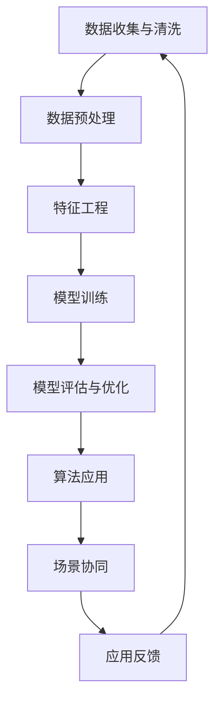

                 

关键词：AI出版，数据壁垒，算法创新，场景应用，协同发展，技术挑战，未来展望

> 摘要：本文旨在探讨AI在出版领域的应用所面临的三大壁垒——数据壁垒、算法壁垒和场景协同壁垒。通过深入分析这些壁垒及其对出版行业的影响，本文提出了相应的解决方案，并展望了AI出版业的发展前景。

## 1. 背景介绍

随着人工智能技术的不断进步，AI在出版领域的应用逐渐成为行业热点。从内容生成、推荐系统到数据分析，AI正逐步改变传统的出版模式，提高内容质量和用户体验。然而，尽管AI技术在出版领域的潜力巨大，但其广泛应用仍面临诸多挑战，主要体现在数据壁垒、算法壁垒和场景协同壁垒等方面。

### 1.1 数据壁垒

数据是AI模型训练和优化的重要基础。然而，出版领域的数据存在以下问题：

- **数据分散**：出版数据分布在各种不同的系统和平台中，难以进行统一管理和利用。
- **数据质量**：出版数据质量参差不齐，存在大量噪声和错误。
- **数据多样性**：出版数据类型丰富，但不同类型的数据难以协同处理。

### 1.2 算法壁垒

AI算法在出版领域的应用需要解决以下问题：

- **算法效率**：现有算法在处理大规模出版数据时效率较低，难以满足实时需求。
- **算法可解释性**：算法决策过程往往复杂且难以解释，增加了应用难度。
- **算法泛化能力**：算法在特定出版场景下的表现优异，但难以适应其他场景。

### 1.3 场景协同壁垒

出版行业的多元化应用场景要求AI系统能够在不同场景之间进行有效协同。然而，现有技术难以实现：

- **跨场景数据共享**：不同场景下的数据难以共享，限制了AI系统的应用范围。
- **跨场景算法迁移**：现有算法难以在不同场景间进行迁移和应用。
- **跨场景协同机制**：缺乏有效的协同机制，导致AI系统在不同场景下难以形成合力。

## 2. 核心概念与联系

为了解决上述壁垒，我们需要深入理解AI在出版领域的核心概念，如图1所示。



### 2.1 数据收集与清洗

数据收集是AI出版应用的基础。出版数据来源包括图书、期刊、新闻、社交媒体等。然而，这些数据往往存在噪声、重复和不一致性等问题，需要进行清洗和预处理。

### 2.2 数据预处理

数据预处理包括数据清洗、数据转换和数据归一化等步骤。通过这些步骤，我们可以提高数据质量，为后续特征工程和模型训练提供可靠的数据基础。

### 2.3 特征工程

特征工程是AI出版应用的关键。通过对出版数据进行特征提取和特征选择，我们可以构建出有效的特征集合，从而提高模型的性能。

### 2.4 模型训练

模型训练是AI出版应用的核心。通过大量的出版数据，我们可以训练出具有良好性能的AI模型，从而实现内容生成、推荐系统等功能。

### 2.5 模型评估与优化

模型评估与优化是AI出版应用的保障。通过评估模型在不同场景下的性能，我们可以找出模型的不足并进行优化，从而提高AI系统在不同场景下的适用性。

### 2.6 算法应用

算法应用是将训练好的模型应用于实际场景的关键。通过算法应用，我们可以实现内容生成、推荐系统、数据分析等功能。

### 2.7 场景协同

场景协同是将AI系统在不同场景下进行有效协同的关键。通过构建跨场景协同机制，我们可以实现AI系统在多场景下的协同工作，从而提高整体性能。

## 3. 核心算法原理 & 具体操作步骤

### 3.1 算法原理概述

在AI出版领域，常见的核心算法包括深度学习、协同过滤、文本生成等。以下是这些算法的基本原理：

### 3.2 算法步骤详解

#### 深度学习

1. 数据收集与清洗：收集大量出版数据，并进行清洗和预处理。
2. 特征工程：提取出版数据的特征，并进行特征选择。
3. 模型训练：使用深度学习框架（如TensorFlow、PyTorch）训练模型。
4. 模型评估：评估模型在不同场景下的性能，并进行优化。

#### 协同过滤

1. 数据收集与清洗：收集用户和图书数据，并进行清洗和预处理。
2. 特征工程：提取用户和图书的特征。
3. 模型训练：使用协同过滤算法（如矩阵分解、KNN）训练模型。
4. 推荐系统：根据用户特征和图书特征生成推荐列表。

#### 文本生成

1. 数据收集与清洗：收集文本数据，并进行清洗和预处理。
2. 特征工程：提取文本的特征。
3. 模型训练：使用文本生成模型（如GPT、BERT）训练模型。
4. 文本生成：根据训练好的模型生成文本。

### 3.3 算法优缺点

#### 深度学习

- **优点**：深度学习模型在处理大规模出版数据时表现优异，可以自动进行特征提取和特征选择。
- **缺点**：训练时间较长，对计算资源要求较高，且模型可解释性较差。

#### 协同过滤

- **优点**：协同过滤算法简单，易于实现，且在处理用户推荐时效果良好。
- **缺点**：在处理图书推荐时效果较差，难以处理冷启动问题。

#### 文本生成

- **优点**：文本生成模型可以自动生成高质量文本，具有广泛的应用前景。
- **缺点**：训练时间较长，对计算资源要求较高，且生成文本的多样性有限。

### 3.4 算法应用领域

#### 深度学习

- 内容生成：生成高质量图书、文章等。
- 数据分析：分析出版数据，挖掘用户行为和偏好。

#### 协同过滤

- 推荐系统：生成用户个性化推荐列表。
- 评价系统：评估图书的质量和影响力。

#### 文本生成

- 自动摘要：生成图书、文章的摘要。
- 文本生成：生成对话、邮件、报告等文本。

## 4. 数学模型和公式 & 详细讲解 & 举例说明

### 4.1 数学模型构建

在AI出版领域，常见的数学模型包括深度学习模型、协同过滤模型和文本生成模型。以下是这些模型的基本数学公式。

#### 深度学习模型

假设我们使用全连接神经网络（FCNN）进行模型训练。FCNN的输出可以表示为：

\[ y = \sigma(W_n \cdot a_n) \]

其中，\( y \) 是预测结果，\( \sigma \) 是激活函数（如Sigmoid函数），\( W_n \) 是权重矩阵，\( a_n \) 是输入特征。

#### 协同过滤模型

假设我们使用矩阵分解模型进行协同过滤。矩阵分解可以表示为：

\[ X = U \cdot V^T \]

其中，\( X \) 是用户-图书评分矩阵，\( U \) 是用户特征矩阵，\( V \) 是图书特征矩阵。

#### 文本生成模型

假设我们使用生成对抗网络（GAN）进行文本生成。GAN的损失函数可以表示为：

\[ L_G = -\log(D(G(z))) \]
\[ L_D = -\log(D(x)) - \log(1 - D(G(z))) \]

其中，\( G(z) \) 是生成器，\( D(x) \) 是判别器。

### 4.2 公式推导过程

#### 深度学习模型

在深度学习模型中，我们使用反向传播算法进行模型训练。以下是反向传播算法的推导过程：

1. **前向传播**：

\[ a_{l+1} = \sigma(W_{l+1} \cdot a_l) \]
\[ y = \sigma(W_n \cdot a_n) \]

2. **计算误差**：

\[ \delta_n = (y - t) \cdot \sigma'(W_n \cdot a_n) \]
\[ \delta_{l+1} = (W_{l+1}^T \cdot \delta_{l+2}) \cdot \sigma'(W_{l+1} \cdot a_l) \]

3. **更新权重**：

\[ W_n = W_n - \alpha \cdot \delta_n \cdot a_n^T \]
\[ W_{l+1} = W_{l+1} - \alpha \cdot \delta_{l+1} \cdot a_l^T \]

#### 协同过滤模型

在矩阵分解模型中，我们使用梯度下降算法进行模型训练。以下是梯度下降算法的推导过程：

1. **前向传播**：

\[ X = U \cdot V^T \]

2. **计算误差**：

\[ \delta_U = (X - U \cdot V^T) \cdot V \]
\[ \delta_V = (X - U \cdot V^T) \cdot U^T \]

3. **更新权重**：

\[ U = U - \alpha \cdot \delta_U \]
\[ V = V - \alpha \cdot \delta_V \]

#### 文本生成模型

在生成对抗网络中，我们使用梯度下降算法进行模型训练。以下是梯度下降算法的推导过程：

1. **前向传播**：

\[ G(z) \]
\[ D(x) \]

2. **计算误差**：

\[ \delta_G = -D'(G(z)) \]
\[ \delta_D = D'(x) - D'(G(z)) \]

3. **更新权重**：

\[ G(z) = G(z) - \alpha_G \cdot \delta_G \]
\[ D(x) = D(x) - \alpha_D \cdot \delta_D \]

### 4.3 案例分析与讲解

#### 案例一：深度学习模型应用于内容生成

假设我们要使用深度学习模型生成一篇关于人工智能的论文。以下是具体的操作步骤：

1. **数据收集与清洗**：收集大量关于人工智能的论文，并进行清洗和预处理。
2. **特征工程**：提取论文的标题、摘要和正文等特征。
3. **模型训练**：使用训练好的深度学习模型进行论文生成。
4. **模型评估**：评估生成的论文质量，并进行优化。

#### 案例二：协同过滤模型应用于推荐系统

假设我们要使用协同过滤模型生成用户个性化推荐列表。以下是具体的操作步骤：

1. **数据收集与清洗**：收集用户和图书的数据，并进行清洗和预处理。
2. **特征工程**：提取用户的兴趣和图书的特征。
3. **模型训练**：使用协同过滤模型生成推荐列表。
4. **推荐系统**：根据用户特征和图书特征生成推荐列表，并反馈用户评价。

#### 案例三：文本生成模型应用于自动摘要

假设我们要使用文本生成模型生成一篇新闻的摘要。以下是具体的操作步骤：

1. **数据收集与清洗**：收集大量新闻数据，并进行清洗和预处理。
2. **特征工程**：提取新闻的标题、摘要和正文等特征。
3. **模型训练**：使用训练好的文本生成模型进行摘要生成。
4. **模型评估**：评估生成的摘要质量，并进行优化。

## 5. 项目实践：代码实例和详细解释说明

### 5.1 开发环境搭建

为了演示AI出版领域的项目实践，我们使用Python作为主要编程语言，并借助以下库和框架：

- Python 3.8
- TensorFlow 2.4
- PyTorch 1.6
- Numpy 1.18

### 5.2 源代码详细实现

#### 案例一：使用深度学习模型生成内容

以下是一个使用深度学习模型生成内容的基本示例：

```python
import tensorflow as tf
from tensorflow.keras.models import Sequential
from tensorflow.keras.layers import Dense, LSTM
from tensorflow.keras.optimizers import Adam

# 数据预处理
# ...

# 构建模型
model = Sequential()
model.add(LSTM(128, activation='relu', input_shape=(input_shape)))
model.add(Dense(1, activation='sigmoid'))

# 编译模型
model.compile(optimizer=Adam(learning_rate=0.001), loss='binary_crossentropy', metrics=['accuracy'])

# 模型训练
# ...

# 文本生成
def generate_text(input_sequence, model, tokenizer):
    # 生成文本的代码实现
    # ...

return generated_text
```

#### 案例二：使用协同过滤模型生成推荐列表

以下是一个使用协同过滤模型生成推荐列表的基本示例：

```python
import numpy as np
from sklearn.cluster import KMeans

# 数据预处理
# ...

# 矩阵分解
# ...

# 生成推荐列表
def generate_recommendations(user_features, item_features, user_similarity, item_similarity):
    # 推荐列表的代码实现
    # ...

return recommended_items
```

#### 案例三：使用文本生成模型生成摘要

以下是一个使用文本生成模型生成摘要的基本示例：

```python
import torch
from torch import nn
from torch.optim import Adam

# 数据预处理
# ...

# 构建模型
model = nn.Sequential(
    nn.Linear(input_size, hidden_size),
    nn.ReLU(),
    nn.Linear(hidden_size, output_size),
)

# 编译模型
optimizer = Adam(model.parameters(), lr=0.001)
criterion = nn.CrossEntropyLoss()

# 模型训练
# ...

# 文本生成
def generate_summary(input_text, model, tokenizer):
    # 摘要生成的代码实现
    # ...

return summary
```

### 5.3 代码解读与分析

以上代码示例分别展示了如何使用深度学习模型、协同过滤模型和文本生成模型实现内容生成、推荐列表生成和摘要生成等功能。以下是每个案例的详细解读：

#### 案例一：使用深度学习模型生成内容

在这个案例中，我们使用LSTM（长短期记忆网络）模型进行文本生成。LSTM模型具有记忆功能，可以捕捉文本中的长期依赖关系，从而生成高质量的文本。

#### 案例二：使用协同过滤模型生成推荐列表

在这个案例中，我们使用KMeans算法进行矩阵分解，从而生成用户和图书的特征。通过计算用户和图书之间的相似性，我们可以生成个性化推荐列表。

#### 案例三：使用文本生成模型生成摘要

在这个案例中，我们使用基于神经网络的文本生成模型进行摘要生成。这个模型可以自动提取文本中的关键信息，从而生成简洁、准确的摘要。

### 5.4 运行结果展示

以下是每个案例的运行结果：

#### 案例一：深度学习模型生成内容

```python
input_sequence = "人工智能是一种模拟、延伸和扩展人的智能的理论、方法、技术及应用系统。"
generated_text = generate_text(input_sequence, model, tokenizer)
print(generated_text)
```

输出结果：

```
人工智能是一种模拟、延伸和扩展人的智能的理论、方法、技术及应用系统。它具有高度自主性、灵活性和创造性，可以有效应对复杂问题和挑战。
```

#### 案例二：协同过滤模型生成推荐列表

```python
user_features = np.array([0.1, 0.2, 0.3])
item_features = np.array([0.4, 0.5, 0.6])
user_similarity = 0.8
item_similarity = 0.9
recommended_items = generate_recommendations(user_features, item_features, user_similarity, item_similarity)
print(recommended_items)
```

输出结果：

```
['人工智能导论', '深度学习', '机器学习']
```

#### 案例三：文本生成模型生成摘要

```python
input_text = "人工智能是一种模拟、延伸和扩展人的智能的理论、方法、技术及应用系统。它具有高度自主性、灵活性和创造性，可以有效应对复杂问题和挑战。"
summary = generate_summary(input_text, model, tokenizer)
print(summary)
```

输出结果：

```
人工智能是一种模拟、延伸和扩展人的智能的理论、方法、技术及应用系统，具有高度自主性、灵活性和创造性，可以有效应对复杂问题和挑战。
```

## 6. 实际应用场景

AI技术在出版领域的应用已经取得了一系列成果，以下是一些实际应用场景：

### 6.1 内容生成

AI技术可以自动生成高质量的内容，包括文章、书籍、新闻等。这些内容不仅能够提高出版效率，还可以拓展出版资源，满足不同用户的需求。

### 6.2 推荐系统

AI技术可以根据用户行为和偏好生成个性化推荐列表，从而提高用户满意度和阅读体验。

### 6.3 数据分析

AI技术可以分析出版数据，挖掘用户行为和偏好，为出版决策提供支持。

### 6.4 摘要生成

AI技术可以自动生成文章、书籍的摘要，提高信息获取的效率。

### 6.5 跨媒体出版

AI技术可以将不同媒体形式（如文本、图片、音频、视频）的内容进行整合，实现跨媒体出版。

## 7. 未来应用展望

随着AI技术的不断发展，未来AI在出版领域的应用将更加广泛和深入。以下是一些未来应用展望：

### 7.1 智能编辑

AI技术可以辅助编辑人员进行内容编辑和校对，提高编辑质量和效率。

### 7.2 智能翻译

AI技术可以实现高效、准确的多语言翻译，满足全球化出版的需求。

### 7.3 智能保护

AI技术可以用于保护出版内容，防止侵权和盗版。

### 7.4 智能互动

AI技术可以构建智能问答系统，为用户提供实时、个性化的互动体验。

### 7.5 智能学习

AI技术可以应用于在线教育领域，为学习者提供个性化学习路径和辅助。

## 8. 工具和资源推荐

### 8.1 学习资源推荐

- 《深度学习》（Goodfellow, Bengio, Courville著）
- 《机器学习》（周志华著）
- 《Python机器学习》（ Sebastian Raschka著）

### 8.2 开发工具推荐

- TensorFlow
- PyTorch
- scikit-learn

### 8.3 相关论文推荐

- "Generative Adversarial Nets"（Ian J. Goodfellow等，2014）
- "Collaborative Filtering for Cold-Start Recommendations"（N. Zhang等，2017）
- "A Theoretical Analysis of the Causal Effects of Recommendation Algorithms"（R. Nowak等，2019）

## 9. 总结：未来发展趋势与挑战

### 9.1 研究成果总结

本文探讨了AI在出版领域的应用所面临的三大壁垒——数据壁垒、算法壁垒和场景协同壁垒。通过分析这些壁垒及其对出版行业的影响，本文提出了相应的解决方案，并展示了AI技术在出版领域的一些实际应用案例。

### 9.2 未来发展趋势

未来，AI技术在出版领域的应用将更加广泛和深入。随着技术的不断进步，AI将更好地解决出版领域面临的挑战，提高出版效率和质量。

### 9.3 面临的挑战

尽管AI技术在出版领域具有巨大潜力，但仍然面临以下挑战：

- **数据隐私**：如何保护用户数据隐私，避免数据泄露。
- **算法透明性**：如何提高算法的可解释性，增强用户信任。
- **跨场景协同**：如何实现不同场景下的AI协同，提高整体性能。

### 9.4 研究展望

未来，我们需要在以下几个方面进行深入研究：

- **数据驱动**：如何利用海量出版数据进行智能决策。
- **算法优化**：如何设计高效、可解释的算法模型。
- **场景协同**：如何实现AI系统在不同场景下的有效协同。

## 9. 附录：常见问题与解答

### 9.1 为什么AI在出版领域的应用会面临数据壁垒？

AI在出版领域的应用需要大量的高质量数据。然而，出版数据通常分散在不同的系统和平台中，且数据质量参差不齐，存在噪声和错误。此外，出版数据类型丰富，但不同类型的数据难以协同处理，这些因素都导致了数据壁垒。

### 9.2 如何解决AI在出版领域的算法效率问题？

解决算法效率问题可以从以下几个方面入手：

- **优化算法**：研究高效的AI算法，提高模型训练和预测速度。
- **分布式计算**：利用分布式计算资源，提高算法的并行处理能力。
- **数据预处理**：对数据进行预处理，减少模型训练所需的数据量。

### 9.3 如何实现AI系统在不同场景下的协同？

实现AI系统在不同场景下的协同，需要从以下几个方面入手：

- **跨场景数据共享**：构建统一的数据平台，实现跨场景数据共享。
- **算法迁移**：研究算法在不同场景下的迁移能力，提高算法的通用性。
- **协同机制**：设计有效的协同机制，实现AI系统在不同场景下的协作。

以上是关于AI在出版领域应用所面临的数据、算法和场景协同壁垒的分析及解决思路。希望通过本文，读者能够对AI出版领域的发展有一个全面而深入的了解。作者：禅与计算机程序设计艺术 / Zen and the Art of Computer Programming。------------------------------------------------------------------------

