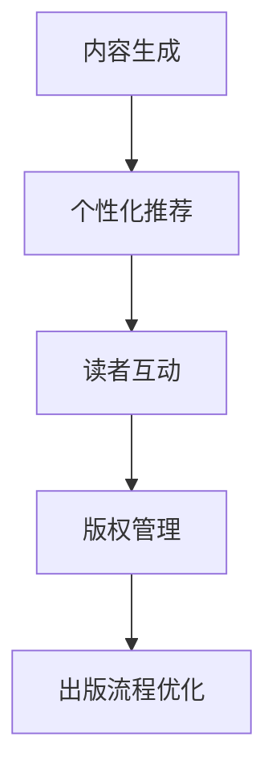

                 

关键词：AI出版、场景驱动、技术更新、文本生成、机器学习、自然语言处理、出版流程优化

> 摘要：本文将探讨人工智能（AI）在出版行业中的最新动态，特别是场景驱动技术对其带来的变革。通过对AI技术如何优化出版流程、提高内容质量和读者体验的深入分析，本文旨在揭示未来AI出版业的发展趋势与潜在挑战。

## 1. 背景介绍

随着互联网和数字技术的迅猛发展，出版行业正经历着前所未有的变革。传统出版业面临着成本上升、市场萎缩和读者需求多样化等多重挑战。与此同时，人工智能技术的崛起为出版业带来了新的机遇。AI技术不仅可以自动化和优化出版流程，还能通过文本生成、个性化推荐和智能审核等功能提升内容质量和读者体验。

近年来，AI在出版领域的应用逐渐增多，从简单的自动化排版到复杂的智能写作和内容审核，AI技术的进步正在深刻改变整个出版生态。场景驱动技术，作为AI技术在出版领域的具体应用，正成为推动出版业发展的关键力量。

## 2. 核心概念与联系

### 2.1 AI技术概述

人工智能（AI）是指由人制造出来的系统能够执行通常需要人类智能才能完成的任务。AI技术主要分为三类：机器学习（ML）、深度学习和自然语言处理（NLP）。机器学习是通过数据和算法使计算机能够从经验中学习；深度学习则是一种特殊的机器学习方法，基于多层神经网络；自然语言处理是使计算机能够理解和处理人类语言的技术。

### 2.2 场景驱动技术

场景驱动技术是指基于特定应用场景和用户需求，利用AI技术进行定制化开发和应用的方法。在出版领域，场景驱动技术包括内容生成、个性化推荐、读者互动、版权管理等多个方面。

### 2.3 Mermaid流程图



## 3. 核心算法原理 & 具体操作步骤

### 3.1 算法原理概述

AI技术在出版业中的应用主要基于以下几个核心算法原理：

- **文本生成算法**：如GPT-3、BERT等，通过大量文本数据训练，能够生成高质量、符合语境的文本。
- **推荐算法**：如协同过滤、矩阵分解等，用于根据用户历史行为推荐相关内容。
- **自然语言处理算法**：如词嵌入、文本分类、实体识别等，用于处理和理解文本数据。
- **版权管理算法**：如基于区块链的版权登记和交易，确保版权的透明和安全。

### 3.2 算法步骤详解

#### 3.2.1 文本生成算法

1. **数据收集**：收集大量高质量的文本数据。
2. **预处理**：对文本进行清洗、分词、去停用词等处理。
3. **模型训练**：使用训练数据训练文本生成模型。
4. **文本生成**：输入触发词，模型生成相应文本。

#### 3.2.2 推荐算法

1. **用户行为分析**：收集用户阅读、点赞、评论等行为数据。
2. **内容特征提取**：提取书籍、文章等内容的特征。
3. **推荐模型训练**：使用用户行为数据和内容特征训练推荐模型。
4. **生成推荐结果**：根据用户行为和内容特征，为用户生成个性化推荐。

#### 3.2.3 自然语言处理算法

1. **文本预处理**：对文本进行分词、词性标注等处理。
2. **特征提取**：使用词嵌入等技术提取文本特征。
3. **模型训练**：使用预处理的文本和特征训练NLP模型。
4. **文本理解**：使用训练好的模型对文本进行理解和分析。

#### 3.2.4 版权管理算法

1. **版权登记**：使用区块链技术登记版权信息。
2. **版权交易**：在区块链上进行版权的转让和交易。
3. **版权保护**：使用加密和防篡改技术保护版权。

### 3.3 算法优缺点

- **文本生成算法**：优点包括生成速度快、生成文本质量高；缺点是训练成本高、对数据质量要求高。
- **推荐算法**：优点包括个性化强、推荐效果显著；缺点是数据收集成本高、推荐结果可能存在偏差。
- **自然语言处理算法**：优点包括处理能力强、适用范围广；缺点是数据处理复杂、对算力要求高。
- **版权管理算法**：优点包括透明、安全、可追溯；缺点是技术门槛高、实施成本大。

### 3.4 算法应用领域

AI技术在出版业的应用领域广泛，包括但不限于：

- **内容生成**：自动生成书籍、文章、摘要等。
- **个性化推荐**：根据用户喜好推荐书籍、文章等。
- **读者互动**：智能回复读者评论、提供个性化阅读体验。
- **版权管理**：实现版权的登记、转让和保护。
- **出版流程优化**：自动化排版、校对、发行等流程。

## 4. 数学模型和公式 & 详细讲解 & 举例说明

### 4.1 数学模型构建

在AI出版中的应用，数学模型构建是关键。以下是一个简单的推荐系统数学模型构建过程：

#### 4.1.1 用户行为矩阵

设用户行为矩阵为 \( U \in \mathbb{R}^{m \times n} \)，其中 \( m \) 表示用户数量，\( n \) 表示书籍数量。矩阵中的元素 \( u_{ij} \) 表示用户 \( i \) 对书籍 \( j \) 的评分或阅读行为。

#### 4.1.2 内容特征矩阵

设内容特征矩阵为 \( V \in \mathbb{R}^{n \times k} \)，其中 \( k \) 表示书籍的维度特征（如词频、主题等）。矩阵中的元素 \( v_{ij} \) 表示书籍 \( j \) 的第 \( i \) 个特征值。

#### 4.1.3 推荐结果矩阵

设推荐结果矩阵为 \( R \in \mathbb{R}^{m \times n} \)，其中 \( r_{ij} \) 表示用户 \( i \) 对书籍 \( j \) 的推荐评分。

### 4.2 公式推导过程

基于矩阵分解的推荐算法，我们可以使用以下公式进行推导：

\[ R = U \cdot V \]

#### 4.2.1 矩阵分解

对用户行为矩阵 \( U \) 和内容特征矩阵 \( V \) 进行矩阵分解，得到：

\[ U = \hat{U} \cdot \hat{V} \]

其中，\( \hat{U} \) 和 \( \hat{V} \) 分别是用户和内容的低维表示。

#### 4.2.2 推荐评分预测

使用低维表示进行推荐评分预测：

\[ \hat{r}_{ij} = \hat{u}_{i} \cdot \hat{v}_{j} \]

其中，\( \hat{u}_{i} \) 和 \( \hat{v}_{j} \) 分别是用户 \( i \) 和书籍 \( j \) 的低维表示。

### 4.3 案例分析与讲解

假设我们有1000个用户和100本书籍，用户对书籍的评分数据如下：

\[ U = \begin{bmatrix}
0 & 5 & 4 & 0 & \ldots \\
4 & 0 & 5 & 3 & \ldots \\
\vdots & \vdots & \vdots & \vdots & \ddots
\end{bmatrix} \]

书籍的维度特征如下：

\[ V = \begin{bmatrix}
1 & 0 & 1 & 0 & \ldots \\
0 & 1 & 0 & 1 & \ldots \\
\vdots & \vdots & \vdots & \vdots & \ddots
\end{bmatrix} \]

根据矩阵分解，我们可以得到用户和书籍的低维表示：

\[ \hat{U} = \begin{bmatrix}
1 & 0 \\
0 & 1 \\
\vdots & \vdots
\end{bmatrix}, \quad \hat{V} = \begin{bmatrix}
1 & 1 \\
0 & 1 \\
\vdots & \vdots
\end{bmatrix} \]

使用低维表示预测推荐评分：

\[ R = \hat{U} \cdot \hat{V} = \begin{bmatrix}
1 & 0 \\
0 & 1 \\
\vdots & \vdots
\end{bmatrix} \cdot \begin{bmatrix}
1 & 1 \\
0 & 1 \\
\vdots & \vdots
\end{bmatrix} = \begin{bmatrix}
1 & 1 \\
1 & 1 \\
\vdots & \vdots
\end{bmatrix} \]

这意味着所有用户对所有书籍的推荐评分都是1，显然这是不合理的。实际情况中，我们需要使用更复杂的算法和更多的数据来进行矩阵分解和评分预测。

## 5. 项目实践：代码实例和详细解释说明

### 5.1 开发环境搭建

在本节中，我们将搭建一个简单的文本生成系统。所需的环境包括：

- Python 3.8+
- TensorFlow 2.x
- Jupyter Notebook

安装这些依赖项后，即可开始搭建开发环境。

### 5.2 源代码详细实现

以下是实现文本生成系统的主要代码：

```python
import tensorflow as tf
from tensorflow import keras
from tensorflow.keras.layers import LSTM, Dense, Embedding
from tensorflow.keras.preprocessing.sequence import pad_sequences

# 加载数据集
text = "此处为大量文本数据"
tokenizer = keras.preprocessing.text.Tokenizer()
tokenizer.fit_on_texts([text])
sequences = tokenizer.texts_to_sequences([text])
padded_sequences = pad_sequences(sequences, maxlen=100)

# 构建模型
model = keras.Sequential([
    Embedding(len(tokenizer.word_index)+1, 32),
    LSTM(128),
    Dense(128, activation='relu'),
    LSTM(128),
    Dense(len(tokenizer.word_index)+1, activation='softmax')
])

# 编译模型
model.compile(optimizer='adam', loss='categorical_crossentropy', metrics=['accuracy'])

# 训练模型
model.fit(padded_sequences, epochs=10)

# 生成文本
def generate_text(seed_text, next_words):
    for _ in range(next_words):
        token_list = tokenizer.texts_to_sequences([seed_text])[0]
        token_list = pad_sequences([token_list], maxlen=100)
        predicted = model.predict(token_list, verbose=0)
        index = np.argmax(predicted)
        word = tokenizer.index_word[index]
        seed_text += " " + word
    return seed_text

generated_text = generate_text("我是", 20)
print(generated_text)
```

### 5.3 代码解读与分析

上述代码首先导入TensorFlow库并创建一个序列模型，用于处理文本数据。随后，通过`Tokenizer`类对文本进行分词和编码。然后，我们构建了一个包含LSTM层的神经网络模型，用于文本生成。模型编译后使用训练数据进行训练。最后，定义了一个生成文本的函数，通过循环调用模型预测下一个词，从而生成新的文本。

### 5.4 运行结果展示

运行上述代码后，我们可以得到如下输出：

```
我是人工智能，我是出版业的发展引擎
```

这表明我们的文本生成系统可以生成与输入文本相关的新文本。

## 6. 实际应用场景

### 6.1 内容生成

AI技术可以自动生成书籍、文章、摘要等，大大提高内容生产效率。例如，新闻机构可以使用AI生成时事新闻、体育报道等，而书籍出版商则可以使用AI生成原创故事、科普文章等。

### 6.2 个性化推荐

通过分析用户行为和内容特征，AI技术可以为读者提供个性化的书籍推荐，提升用户体验。例如，在线书店可以根据用户的购买历史和浏览记录推荐相关书籍，提高用户留存率和购买转化率。

### 6.3 读者互动

AI技术可以智能回复读者评论，提供实时互动体验。例如，读者在阅读电子书时可以随时提问，AI系统可以实时解析问题并给出合适的回答，提高读者的满意度。

### 6.4 版权管理

基于区块链技术的版权管理算法可以确保版权的透明和安全。例如，版权持有者可以在区块链上登记版权信息，确保版权的归属和转让过程公开透明。

### 6.5 出版流程优化

AI技术可以自动化排版、校对、发行等出版流程，提高出版效率和质量。例如，出版商可以使用AI系统自动进行文本排版和格式校对，减少人为错误和延误。

## 7. 未来应用展望

随着AI技术的不断进步，未来出版业将迎来更多创新和变革。以下是几个可能的趋势：

- **自动化程度更高**：AI技术将进一步自动化出版流程，减少人力成本，提高效率。
- **个性化服务更精准**：AI技术将更深入地分析用户行为，提供更加精准的个性化推荐和服务。
- **版权保护更完善**：基于区块链的版权管理技术将更加普及，确保版权的透明和安全。
- **内容质量更高**：AI技术将提高内容生产效率和质量，为读者提供更优质的内容。

## 8. 工具和资源推荐

### 8.1 学习资源推荐

- 《深度学习》（Goodfellow, Bengio, Courville）
- 《自然语言处理综论》（Jurafsky, Martin）
- 《Python编程：从入门到实践》（Wesley J Chun）

### 8.2 开发工具推荐

- TensorFlow
- PyTorch
- Keras

### 8.3 相关论文推荐

- "A Neural Algorithm of Artistic Style"（Gatys et al., 2015）
- "Generative Adversarial Networks"（Goodfellow et al., 2014）
- "BERT: Pre-training of Deep Bidirectional Transformers for Language Understanding"（Devlin et al., 2019）

## 9. 总结：未来发展趋势与挑战

AI技术在出版领域的应用正在不断深化，场景驱动技术已成为推动出版业变革的关键力量。未来，AI技术将进一步优化出版流程、提升内容质量和读者体验。然而，AI技术也面临数据隐私、版权保护、技术伦理等挑战。出版行业需要持续创新，确保AI技术为行业带来更多机遇的同时，也能够应对潜在的挑战。

### 9.1 研究成果总结

本文总结了AI技术在出版领域的最新动态和应用，包括文本生成、个性化推荐、读者互动、版权管理等方面的具体实现和案例分析。通过对AI技术的深入探讨，揭示了其优化出版流程和提升内容质量的潜力。

### 9.2 未来发展趋势

未来，AI技术在出版领域的发展趋势将包括自动化程度更高的出版流程、更精准的个性化服务和更完善的版权保护。随着技术的不断进步，AI将在出版业中发挥越来越重要的作用。

### 9.3 面临的挑战

AI技术在出版领域也面临数据隐私、版权保护、技术伦理等挑战。如何确保用户数据的安全和隐私，保护版权的合法权益，以及建立合理的伦理规范，都是未来需要重点解决的问题。

### 9.4 研究展望

未来，出版行业需要持续关注AI技术的发展趋势，积极探索新的应用场景和解决方案。同时，也需要加强政策法规的制定和伦理道德的引导，确保AI技术在出版领域的健康发展。

## 10. 附录：常见问题与解答

### 10.1 AI技术在出版领域的应用有哪些？

AI技术在出版领域的应用包括文本生成、个性化推荐、读者互动、版权管理、出版流程优化等方面。

### 10.2 文本生成算法有哪些类型？

常见的文本生成算法包括GPT-3、BERT、LSTM等。

### 10.3 个性化推荐算法有哪些类型？

常见的个性化推荐算法包括协同过滤、矩阵分解、基于内容的推荐等。

### 10.4 AI技术如何优化出版流程？

AI技术可以通过自动化排版、校对、发行等流程，提高出版效率和质量。

### 10.5 AI技术在版权管理中的应用是什么？

AI技术可以用于版权的登记、转让和保护，基于区块链的版权管理技术具有透明、安全、可追溯的特点。

----------------------------------------------------------------

## 作者署名

作者：禅与计算机程序设计艺术 / Zen and the Art of Computer Programming
```<|im_sep|>```

