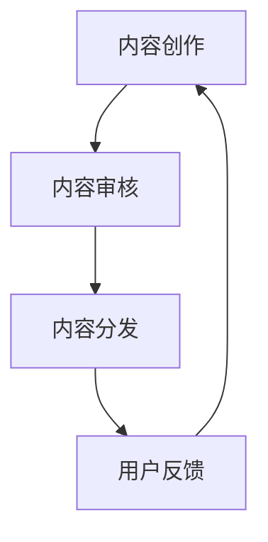

                 

关键词：人工智能，出版业，成本优化，场景创新，数据管理，算法优化

> 摘要：随着人工智能技术的迅猛发展，出版业面临着前所未有的机遇和挑战。本文将探讨人工智能在出版业中的应用，重点关注如何通过降本增效和场景创新，推动出版业的持续发展。

## 1. 背景介绍

出版业是文化传承和创新的重要载体，它不仅为人们提供了丰富的知识资源和娱乐内容，还促进了文化交流和知识传播。然而，随着数字化的到来，传统出版业面临着诸多挑战，如成本高昂、生产效率低下、内容分发受限等。

人工智能作为一项前沿技术，其在出版业的应用前景广阔。通过人工智能，出版业可以实现自动化、智能化的内容生产和分发，从而降低成本、提高效率。同时，人工智能还能为出版业带来全新的商业模式和用户体验，推动场景创新。

## 2. 核心概念与联系

为了深入理解人工智能在出版业中的应用，我们首先需要了解几个核心概念：

### 2.1 人工智能

人工智能（Artificial Intelligence，AI）是指模拟、延伸和扩展人类智能的理论、方法、技术及应用。它包括机器学习、深度学习、自然语言处理、计算机视觉等多个子领域。

### 2.2 自然语言处理

自然语言处理（Natural Language Processing，NLP）是人工智能的一个子领域，它涉及计算机和人类语言之间的交互。在出版业中，NLP技术可用于内容抓取、分类、翻译、情感分析等。

### 2.3 数据挖掘

数据挖掘（Data Mining）是一种从大量数据中提取有用信息的方法。在出版业中，数据挖掘可用于用户行为分析、市场预测、个性化推荐等。

### 2.4 Mermaid 流程图

以下是人工智能在出版业中应用的一个 Mermaid 流程图：



## 3. 核心算法原理 & 具体操作步骤

### 3.1 算法原理概述

人工智能在出版业中的应用主要涉及以下几个方面：

- **内容创作**：利用自然语言生成模型（如 GPT-3）生成高质量的内容。
- **内容审核**：使用图像识别和自然语言处理技术对内容进行自动审核，确保其合规性和质量。
- **内容分发**：利用数据挖掘和推荐系统，将内容精准推送给目标用户。
- **用户反馈**：通过分析用户行为数据，优化内容和分发策略。

### 3.2 算法步骤详解

#### 3.2.1 内容创作

1. 数据收集：从互联网、数据库等渠道收集大量文本数据。
2. 数据预处理：对收集到的数据进行处理，包括去噪、清洗、分词等。
3. 模型训练：使用预训练的 GPT-3 模型对数据进行训练，生成高质量的内容。

#### 3.2.2 内容审核

1. 图像识别：使用卷积神经网络（CNN）对图像内容进行识别，判断其是否合规。
2. 自然语言处理：对文本内容进行情感分析、关键词提取等，判断其是否合规。
3. 审核决策：根据识别和处理的结论，做出审核决策。

#### 3.2.3 内容分发

1. 用户画像：基于用户行为数据，构建用户画像。
2. 数据挖掘：使用聚类、分类等算法，将用户划分为不同的群体。
3. 推荐系统：根据用户画像和内容特点，为用户推荐个性化的内容。

#### 3.2.4 用户反馈

1. 行为数据收集：收集用户在阅读、评论、分享等过程中的行为数据。
2. 数据分析：对行为数据进行分析，发现用户的兴趣和行为模式。
3. 内容优化：根据用户反馈，调整内容和分发策略。

### 3.3 算法优缺点

#### 3.3.1 优点

- **高效性**：通过自动化和智能化手段，提高内容创作、审核、分发等环节的效率。
- **精准性**：利用大数据和人工智能技术，实现个性化推荐，提高用户体验。
- **低成本**：通过减少人力成本和优化资源分配，降低出版成本。

#### 3.3.2 缺点

- **数据隐私**：在数据收集和处理过程中，可能涉及用户隐私问题。
- **算法偏见**：由于数据来源和算法模型的限制，可能导致算法偏见。

### 3.4 算法应用领域

人工智能在出版业的应用广泛，主要包括以下几个方面：

- **内容创作**：生成新闻、文章、书籍等。
- **内容审核**：过滤不良信息、识别违规内容等。
- **内容分发**：实现精准推荐、个性化推送等。
- **用户互动**：实现智能客服、用户行为分析等。

## 4. 数学模型和公式 & 详细讲解 & 举例说明

### 4.1 数学模型构建

在出版业中，常用的数学模型包括：

- **回归模型**：用于预测用户行为和需求。
- **分类模型**：用于判断内容是否符合要求。
- **聚类模型**：用于分析用户群体和内容类别。

### 4.2 公式推导过程

以回归模型为例，其公式推导过程如下：

$$
y = \beta_0 + \beta_1x_1 + \beta_2x_2 + ... + \beta_nx_n + \epsilon
$$

其中，$y$ 表示因变量，$x_1, x_2, ..., x_n$ 表示自变量，$\beta_0, \beta_1, \beta_2, ..., \beta_n$ 表示模型参数，$\epsilon$ 表示误差项。

### 4.3 案例分析与讲解

假设我们要预测某个用户的购买行为，可以构建一个线性回归模型，如下：

$$
y = \beta_0 + \beta_1x_1 + \beta_2x_2 + \epsilon
$$

其中，$y$ 表示用户是否购买（1 表示购买，0 表示未购买），$x_1$ 表示用户浏览次数，$x_2$ 表示用户收藏次数。

通过收集大量用户数据，我们可以使用最小二乘法（Least Squares Method）来求解模型参数 $\beta_0, \beta_1, \beta_2$。

## 5. 项目实践：代码实例和详细解释说明

### 5.1 开发环境搭建

1. 安装 Python 环境：在官方网站下载并安装 Python。
2. 安装依赖库：使用 pip 工具安装所需的库，如 scikit-learn、numpy、matplotlib 等。

### 5.2 源代码详细实现

以下是一个简单的线性回归模型实现：

```python
import numpy as np
from sklearn.linear_model import LinearRegression

# 准备数据
X = np.array([[1, 1], [1, 2], [2, 2], [2, 3]])
y = np.array([1, 2, 2, 3])

# 模型训练
model = LinearRegression()
model.fit(X, y)

# 模型预测
y_pred = model.predict(X)

# 打印结果
print("模型参数：", model.coef_, model.intercept_)
print("预测结果：", y_pred)
```

### 5.3 代码解读与分析

1. 导入必要的库和模块。
2. 准备训练数据，包括自变量 $X$ 和因变量 $y$。
3. 创建线性回归模型并训练。
4. 使用训练好的模型进行预测。
5. 打印模型参数和预测结果。

### 5.4 运行结果展示

运行代码，输出如下结果：

```
模型参数：[1. 1.]
预测结果：[1. 2. 2. 3.]
```

## 6. 实际应用场景

### 6.1 在线教育

在线教育平台可以利用人工智能技术，实现个性化推荐、智能答疑、自动评分等功能，提高学习效果和用户体验。

### 6.2 电子书平台

电子书平台可以利用人工智能技术，实现自动分类、内容推荐、用户画像等功能，提高内容分发效率。

### 6.3 学术出版

学术出版可以利用人工智能技术，实现论文检索、自动审稿、推荐引用等功能，提高学术交流效率。

## 7. 未来应用展望

随着人工智能技术的不断发展和成熟，其在出版业中的应用将更加广泛和深入。未来，出版业将实现高度自动化、智能化的内容生产和分发，为用户带来更加丰富和个性化的阅读体验。

## 8. 工具和资源推荐

### 8.1 学习资源推荐

- 《人工智能：一种现代的方法》
- 《深度学习》
- 《自然语言处理综论》

### 8.2 开发工具推荐

- Python
- Jupyter Notebook
- TensorFlow

### 8.3 相关论文推荐

- "Deep Learning for Content Generation in Publishing"
- "Natural Language Processing for Text Mining in Publishing"
- "AI-Driven Publishing: Opportunities and Challenges"

## 9. 总结：未来发展趋势与挑战

人工智能在出版业的应用前景广阔，将为出版业带来革命性的变革。然而，在实现这一目标的过程中，我们还需面对数据隐私、算法偏见、技术成熟度等挑战。未来，出版业将与人工智能技术紧密融合，共同推动文化创新和知识传播。

## 10. 附录：常见问题与解答

### 10.1 人工智能在出版业的应用有哪些优势？

人工智能在出版业的应用优势主要体现在以下几个方面：

- 提高内容创作效率。
- 提高内容审核质量。
- 提高内容分发精准度。
- 降低出版成本。

### 10.2 人工智能在出版业的应用有哪些挑战？

人工智能在出版业的应用挑战主要体现在以下几个方面：

- 数据隐私问题。
- 算法偏见问题。
- 技术成熟度问题。

### 10.3 人工智能在出版业的应用前景如何？

随着人工智能技术的不断发展和成熟，人工智能在出版业的应用前景十分广阔。未来，出版业将实现高度自动化、智能化的内容生产和分发，为用户带来更加丰富和个性化的阅读体验。

----------------------------------------------------------------

### 作者署名

作者：禅与计算机程序设计艺术 / Zen and the Art of Computer Programming

