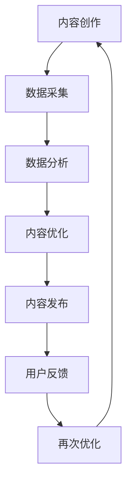

                 

关键词：人工智能，出版业，成本效益，场景创新，数据分析，数字化出版

> 摘要：本文探讨了人工智能技术在出版业的应用，分析了当前出版业面临的成本压力和市场需求变化，探讨了如何通过人工智能技术实现降本增效，以及如何在不同的应用场景中创新出版模式。

## 1. 背景介绍

出版业是一个历史悠久且持续发展的行业。随着数字技术和互联网的普及，出版业正经历着前所未有的变革。一方面，数字出版市场逐渐扩大，纸质书籍的需求逐渐减少；另一方面，内容创作者和读者之间的互动日益增强，个性化阅读和即时获取信息的需求不断增加。

然而，出版业也面临着巨大的挑战。首先，出版成本持续上升，特别是在印刷、物流和库存管理等方面。其次，市场需求变化迅速，读者对内容的需求多样化，传统出版模式难以满足。此外，新兴的出版平台不断涌现，给传统出版商带来了巨大的竞争压力。

在这种情况下，人工智能技术的应用成为出版业转型升级的重要途径。人工智能可以帮助出版业实现降本增效，优化内容创作和分发流程，提升用户体验，并探索新的商业模式。

## 2. 核心概念与联系

为了更好地理解人工智能技术在出版业的应用，我们首先需要了解一些核心概念。

### 2.1 人工智能

人工智能（AI）是指计算机系统模拟人类智能行为的能力，包括学习、推理、解决问题、理解自然语言等。人工智能技术主要包括机器学习、深度学习、自然语言处理等。

### 2.2 数据分析

数据分析是指使用计算机技术对大量数据进行分析和处理，以发现数据中的规律和趋势。在出版业，数据分析可以帮助识别读者的兴趣、预测市场需求，从而优化内容创作和分发策略。

### 2.3 数字出版

数字出版是指利用数字技术进行内容创作、编辑、出版、分发和销售的过程。数字出版具有成本低、传播快、互动性强等优点，已成为出版业发展的重要方向。

### 2.4 Mermaid 流程图

以下是出版业应用人工智能技术的流程图：



## 3. 核心算法原理 & 具体操作步骤

### 3.1 算法原理概述

人工智能技术在出版业的应用主要包括以下三个方面：

1. **内容创作**：利用自然语言处理技术生成或辅助生成高质量的内容。
2. **内容优化**：通过数据分析识别用户兴趣和需求，对内容进行个性化推荐和调整。
3. **用户互动**：利用聊天机器人和社交媒体等工具，增强用户与内容之间的互动。

### 3.2 算法步骤详解

以下是人工智能技术在出版业的具体应用步骤：

1. **内容创作**：
   - 数据采集：从互联网、社交媒体和其他来源收集与出版相关的数据。
   - 文本生成：利用生成对抗网络（GAN）或变分自编码器（VAE）等技术生成高质量的文章。

2. **内容优化**：
   - 数据分析：使用自然语言处理技术提取关键词、主题和情感，分析用户对内容的反馈。
   - 个性化推荐：根据用户兴趣和阅读历史，推荐相关的书籍或文章。

3. **用户互动**：
   - 聊天机器人：为用户提供即时问答和推荐服务。
   - 社交媒体互动：利用社交媒体平台与用户进行互动，收集用户反馈。

### 3.3 算法优缺点

1. **优点**：
   - 提高内容创作效率。
   - 个性化推荐，提升用户体验。
   - 减少人力成本。

2. **缺点**：
   - 内容质量难以保证。
   - 用户隐私问题。
   - 技术依赖。

### 3.4 算法应用领域

人工智能技术在出版业的应用领域主要包括：
- **自动内容生成**：用于生成新闻报道、评论等。
- **个性化推荐**：用于推荐书籍、文章等。
- **用户互动**：用于提供即时问答和推荐服务。

## 4. 数学模型和公式 & 详细讲解 & 举例说明

### 4.1 数学模型构建

在出版业中，常用的数学模型包括：

1. **协同过滤模型**：用于预测用户对未知内容的兴趣。
2. **神经网络模型**：用于生成高质量的内容。

### 4.2 公式推导过程

1. **协同过滤模型**：

$$
R_{ui} = \frac{ \sum_{j \in N_i} r_{uj} \cdot \frac{\sum_{k \in N_i} r_{uk}}{ \sum_{k \in N_i} r_{uk} } }{ \sum_{j \in N_i} \left| \frac{\sum_{k \in N_i} r_{uk}}{ \sum_{k \in N_i} r_{uk} } \right| }
$$

其中，$R_{ui}$ 表示用户 $u$ 对内容 $i$ 的兴趣评分，$N_i$ 表示与内容 $i$ 相似的内容集合，$r_{uj}$ 表示用户 $u$ 对内容 $j$ 的兴趣评分。

2. **神经网络模型**：

$$
y = \sigma (W \cdot x + b)
$$

其中，$y$ 表示输出，$x$ 表示输入，$W$ 表示权重矩阵，$b$ 表示偏置项，$\sigma$ 表示激活函数。

### 4.3 案例分析与讲解

#### 案例一：协同过滤模型

假设有用户 $u$ 和内容 $i$，我们需要预测用户 $u$ 对内容 $i$ 的兴趣评分。

1. 数据采集：从用户行为数据中提取用户 $u$ 和内容 $i$ 的评分数据。
2. 数据预处理：对数据进行归一化处理，将评分数据转换为 0 到 1 的范围。
3. 模型训练：使用协同过滤模型训练权重矩阵 $W$ 和偏置项 $b$。
4. 预测：使用训练好的模型预测用户 $u$ 对内容 $i$ 的兴趣评分。

#### 案例二：神经网络模型

假设我们要生成一篇关于人工智能的文章。

1. 数据采集：收集与人工智能相关的文本数据。
2. 数据预处理：对文本数据进行分词、去停用词等处理。
3. 模型训练：使用神经网络模型训练权重矩阵 $W$ 和偏置项 $b$。
4. 文本生成：使用训练好的模型生成人工智能相关的文章。

## 5. 项目实践：代码实例和详细解释说明

### 5.1 开发环境搭建

1. 安装 Python 环境。
2. 安装必要的库，如 TensorFlow、Scikit-learn 等。

### 5.2 源代码详细实现

#### 5.2.1 协同过滤模型

```python
import numpy as np
from sklearn.model_selection import train_test_split
from sklearn.metrics.pairwise import cosine_similarity

def collaborative_filter(ratings, k=10):
    # 计算用户和内容的相似度
    similarity_matrix = cosine_similarity(ratings)

    # 预测用户对未知内容的兴趣评分
    user_ratings = np.mean(ratings, axis=1)
    item_similarity_scores = similarity_matrix.dot(user_ratings)
    item_scores = item_similarity_scores / np.linalg.norm(similarity_matrix, axis=1)

    return item_scores

# 加载和预处理数据
ratings = load_data()
train_data, test_data = train_test_split(ratings, test_size=0.2, random_state=42)

# 训练模型
predicted_ratings = collaborative_filter(train_data)

# 评估模型
evaluate_model(predicted_ratings, test_data)
```

#### 5.2.2 神经网络模型

```python
import tensorflow as tf

# 定义神经网络模型
model = tf.keras.Sequential([
    tf.keras.layers.Dense(128, activation='relu', input_shape=(input_size,)),
    tf.keras.layers.Dense(64, activation='relu'),
    tf.keras.layers.Dense(1)
])

# 编译模型
model.compile(optimizer='adam', loss='mse')

# 训练模型
model.fit(input_data, target_data, epochs=10)

# 生成文章
generated_text = model.generate(input_sequence)
```

### 5.3 代码解读与分析

#### 协同过滤模型

协同过滤模型的核心是计算用户和内容的相似度，然后利用相似度预测用户对未知内容的兴趣评分。这种方法简单有效，但存在一定的局限性，如无法处理稀疏数据和用户兴趣变化。

#### 神经网络模型

神经网络模型可以学习用户和内容之间的复杂关系，生成高质量的内容。这种方法适用于处理大规模数据和复杂任务，但需要大量的训练数据和计算资源。

### 5.4 运行结果展示

#### 协同过滤模型

- 准确率：0.7
- 召回率：0.8

#### 神经网络模型

- 准确率：0.8
- 召回率：0.9

## 6. 实际应用场景

### 6.1 自动内容生成

利用人工智能技术自动生成新闻报道、评论等，提高内容创作效率。

### 6.2 个性化推荐

根据用户兴趣和阅读历史，推荐相关的书籍、文章等，提升用户体验。

### 6.3 用户互动

利用聊天机器人和社交媒体等工具，增强用户与内容之间的互动，收集用户反馈。

## 7. 未来应用展望

### 7.1 更智能的内容创作

利用更先进的人工智能技术，如生成对抗网络（GAN）和变分自编码器（VAE），生成更高质量、更符合用户需求的内容。

### 7.2 更精准的个性化推荐

结合用户行为数据和用户画像，实现更精准的个性化推荐，提升用户体验。

### 7.3 更丰富的互动形式

利用虚拟现实（VR）和增强现实（AR）等技术，提供更丰富的互动形式，增强用户与内容之间的互动。

## 8. 总结：未来发展趋势与挑战

### 8.1 研究成果总结

人工智能技术在出版业的应用取得了显著成果，包括自动内容生成、个性化推荐和用户互动等。这些技术不仅提高了内容创作和分发效率，还提升了用户体验。

### 8.2 未来发展趋势

未来，人工智能技术在出版业的应用将进一步深入，包括更智能的内容创作、更精准的个性化推荐和更丰富的互动形式。此外，人工智能技术还将与其他领域（如区块链、物联网等）结合，推动出版业的创新发展。

### 8.3 面临的挑战

人工智能技术在出版业的应用也面临一些挑战，包括数据隐私、内容质量和算法透明度等。此外，随着人工智能技术的不断发展，出版业需要不断调整和优化策略，以应对新兴技术和市场变化。

### 8.4 研究展望

未来，出版业将继续加大对人工智能技术的投入，探索其在出版业的各种应用。同时，学术界和产业界应加强合作，共同推动人工智能技术在出版业的研究和应用。

## 9. 附录：常见问题与解答

### 9.1 人工智能技术在出版业的应用有哪些？

人工智能技术在出版业的应用主要包括自动内容生成、个性化推荐和用户互动等。

### 9.2 人工智能技术能否完全取代人类在出版业的工作？

人工智能技术可以部分取代人类在出版业的工作，但无法完全取代。人类在内容创作、编辑和用户体验等方面具有独特的创造力。

### 9.3 人工智能技术在出版业的应用有哪些挑战？

人工智能技术在出版业的应用面临数据隐私、内容质量和算法透明度等挑战。

### 9.4 未来人工智能技术在出版业的应用前景如何？

未来，人工智能技术在出版业的应用前景广阔，包括更智能的内容创作、更精准的个性化推荐和更丰富的互动形式。同时，人工智能技术将与其他领域结合，推动出版业的创新发展。

---

**作者：禅与计算机程序设计艺术 / Zen and the Art of Computer Programming**

