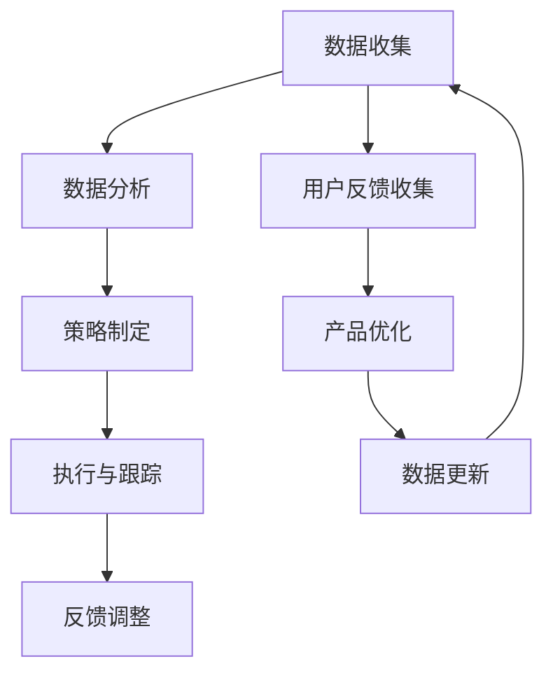

                 

关键词：竞品分析、AI创业、市场研究、用户分析、策略制定

摘要：在竞争激烈的AI创业领域中，有效的竞品分析对于创业公司的成功至关重要。本文将探讨AI创业公司如何利用数据分析和技术手段进行竞品分析，包括市场调研、用户分析和策略制定等方面，以帮助创业公司了解竞争对手、优化自身产品和服务，实现市场突破。

## 1. 背景介绍

人工智能（AI）技术的快速发展推动了各行各业的变革，AI创业公司如雨后春笋般涌现。在这样一个竞争激烈的领域中，如何生存并脱颖而出成为每个创业公司都要面对的挑战。竞品分析作为一种重要的市场研究手段，可以帮助AI创业公司深入了解竞争对手的产品、服务、优势和劣势，从而制定更有效的市场策略。

本文将围绕以下几个核心问题展开讨论：

1. 为什么AI创业公司需要竞品分析？
2. 竞品分析的步骤和方法是什么？
3. 如何利用数据和技术进行竞品分析？
4. 竞品分析的结果如何应用于产品和服务优化？
5. AI创业公司如何持续进行竞品分析？

通过本文的探讨，希望能够为AI创业公司在竞品分析方面提供一些实用的指导和思路。

## 2. 核心概念与联系

在进行竞品分析之前，我们需要明确一些核心概念，以便更好地理解竞品分析的意义和方法。

### 2.1 竞品分析的概念

竞品分析是指对竞争对手的产品、服务、市场策略、用户反馈等方面进行系统性的研究和分析，以了解竞争对手的优势和劣势，并据此调整自身的产品和服务策略。竞品分析不仅包括对竞争对手的现有产品和服务进行评估，还包括预测竞争对手的未来动向和市场策略。

### 2.2 竞品分析的意义

竞品分析对于AI创业公司具有重要意义：

1. **了解市场动态**：通过竞品分析，创业公司可以了解市场趋势和用户需求，及时调整自身产品和服务策略。
2. **发现潜在机会**：竞品分析有助于发现市场中的潜在机会和空白点，创业公司可以据此开发新的产品和服务。
3. **优化产品和服务**：通过分析竞争对手的产品和服务，创业公司可以了解自身的不足和改进方向，从而优化产品和服务。
4. **提升竞争力**：竞品分析可以帮助创业公司了解竞争对手的优势和劣势，从而制定更具竞争力的市场策略。

### 2.3 竞品分析的架构

竞品分析的架构可以分为以下几个层次：

1. **数据收集**：收集与竞品相关的各种数据，包括产品功能、用户评价、市场占有率等。
2. **数据分析**：对收集到的数据进行分析，识别竞争对手的优势和劣势，发现市场机会。
3. **策略制定**：根据数据分析结果，制定相应的市场策略和产品优化方案。
4. **执行与跟踪**：实施制定的策略，并持续跟踪和评估策略效果。

### 2.4 Mermaid 流程图

以下是一个简单的Mermaid流程图，展示了竞品分析的架构和步骤：



### 2.5 竞品分析的方法

竞品分析的方法可以分为定量分析和定性分析两种：

1. **定量分析**：通过数据收集和分析，对竞品进行量化评估，如市场占有率、用户评价、功能对比等。
2. **定性分析**：通过用户调研、访谈、观察等方式，深入了解竞品的使用场景、用户体验和用户需求。

### 2.6 竞品分析的重要性

竞品分析不仅有助于创业公司了解市场环境和竞争对手，还可以：

1. **降低风险**：通过了解竞争对手的策略和动向，创业公司可以降低市场风险。
2. **提升创新力**：竞品分析可以帮助创业公司发现市场空白和机会，从而推动产品创新。
3. **提高决策效率**：竞品分析提供了丰富的数据支持，有助于创业公司做出更科学的决策。

总之，竞品分析是AI创业公司成功的重要保障，它可以帮助创业公司：

- 了解竞争对手
- 发现市场机会
- 优化产品和服务
- 提升市场竞争力

### 2.7 竞品分析的目标

竞品分析的目标主要包括：

1. **了解竞争对手**：通过竞品分析，创业公司可以深入了解竞争对手的产品、服务、市场策略和用户反馈。
2. **发现市场机会**：竞品分析可以帮助创业公司发现市场空白和潜在机会，从而开发新的产品和服务。
3. **优化产品和服务**：通过分析竞争对手的优势和劣势，创业公司可以优化自身的产品和服务，提升用户体验。
4. **制定市场策略**：竞品分析为创业公司提供了丰富的数据支持，有助于制定更具竞争力的市场策略。

### 2.8 竞品分析的应用领域

竞品分析在以下领域具有重要的应用：

1. **产品开发**：通过竞品分析，创业公司可以了解市场需求和用户反馈，优化产品功能和设计。
2. **市场营销**：竞品分析有助于创业公司了解竞争对手的市场营销策略，制定更有效的营销计划。
3. **运营管理**：竞品分析可以为创业公司提供宝贵的运营管理经验，优化资源配置和运营效率。
4. **战略规划**：竞品分析是创业公司制定长期战略规划的重要依据，有助于把握市场趋势和竞争态势。

### 2.9 竞品分析的核心概念与联系

在竞品分析中，以下核心概念和联系具有重要意义：

1. **市场定位**：明确创业公司的市场定位，有助于分析竞争对手的市场定位，找到差异化优势。
2. **用户需求**：了解用户需求是竞品分析的核心，通过用户调研和反馈，创业公司可以更好地满足用户需求。
3. **产品功能**：分析竞争对手的产品功能，有助于发现市场机会和优化自身产品功能。
4. **用户体验**：用户体验是产品成功的关键因素，通过竞品分析，创业公司可以优化用户体验，提升用户满意度。

通过以上核心概念和联系的分析，创业公司可以更全面地了解市场环境和竞争对手，从而制定更有效的竞品分析策略。

## 3. 核心算法原理 & 具体操作步骤

### 3.1 算法原理概述

竞品分析的核心算法主要包括数据收集、数据分析和策略制定三个部分。这三个部分相互关联，构成了完整的竞品分析流程。

#### 3.1.1 数据收集

数据收集是竞品分析的基础。创业公司需要通过多种渠道收集与竞争对手相关的数据，包括产品功能、用户评价、市场占有率、营销策略等。数据来源可以包括公开数据、用户调研、竞争对手官网、社交媒体等。

#### 3.1.2 数据分析

数据分析是对收集到的数据进行处理和分析，以识别竞争对手的优势和劣势。数据分析的方法包括定量分析和定性分析。定量分析可以通过数据统计和对比，识别市场趋势和用户偏好。定性分析则通过用户调研和访谈，深入了解用户需求和体验。

#### 3.1.3 策略制定

策略制定是基于数据分析的结果，制定相应的市场策略和产品优化方案。策略制定需要结合创业公司的市场定位、用户需求和竞争对手的动态，制定有针对性的策略。

### 3.2 算法步骤详解

#### 3.2.1 数据收集

1. **确定分析目标和范围**：明确竞品分析的目标和范围，例如竞争对手的产品、服务、市场策略等。
2. **收集公开数据**：利用公开数据源，如市场研究报告、新闻报道、社交媒体等，收集与竞品相关的数据。
3. **用户调研**：通过问卷调查、访谈等方式，收集用户对竞品的反馈和评价。
4. **竞争对手官网和社交媒体**：分析竞争对手的官方网站、社交媒体账号，了解其产品宣传、用户互动和市场活动。

#### 3.2.2 数据分析

1. **数据整理**：将收集到的数据整理成结构化格式，如表格、数据库等。
2. **定量分析**：使用统计分析方法，对数据进行分析，识别市场趋势和用户偏好。
3. **定性分析**：通过用户调研和访谈，整理出用户的反馈和需求，进行分析和归类。
4. **对比分析**：将竞品的数据和自身的数据进行对比，识别优势和不足。

#### 3.2.3 策略制定

1. **分析结果**：根据数据分析结果，识别市场机会和潜在风险。
2. **制定策略**：结合创业公司的市场定位、用户需求和竞争对手的动态，制定相应的市场策略和产品优化方案。
3. **实施方案**：将制定的策略分解为具体的行动计划，并明确责任人和时间表。
4. **评估效果**：实施策略后，对效果进行评估，并根据评估结果进行调整和优化。

### 3.3 算法优缺点

#### 优点

1. **全面性**：竞品分析可以全面了解竞争对手的产品、服务、市场策略等，为创业公司提供丰富的信息支持。
2. **针对性**：竞品分析可以根据创业公司的实际情况和市场需求，制定有针对性的市场策略和产品优化方案。
3. **动态性**：竞品分析可以实时跟踪竞争对手的动态，及时调整创业公司的策略和方向。

#### 缺点

1. **复杂性**：竞品分析需要收集、处理和分析大量的数据，流程复杂，耗时较长。
2. **局限性**：竞品分析只能从外部视角了解竞争对手，无法深入了解其内部运营和战略决策。
3. **数据可靠性**：公开数据的可靠性和准确性难以保证，可能影响分析结果。

### 3.4 算法应用领域

竞品分析算法广泛应用于以下领域：

1. **产品开发**：通过竞品分析，创业公司可以了解市场需求和用户反馈，优化产品功能和设计。
2. **市场营销**：竞品分析有助于创业公司了解竞争对手的市场营销策略，制定更有效的营销计划。
3. **运营管理**：竞品分析可以为创业公司提供宝贵的运营管理经验，优化资源配置和运营效率。
4. **战略规划**：竞品分析是创业公司制定长期战略规划的重要依据，有助于把握市场趋势和竞争态势。

### 3.5 算法改进方向

1. **自动化**：利用机器学习和自然语言处理技术，实现竞品分析的数据收集和分析过程的自动化，提高效率。
2. **深度分析**：结合用户行为数据和大数据分析，深入挖掘用户需求和市场竞争态势。
3. **实时反馈**：通过实时数据分析和反馈，及时调整创业公司的策略和方向。

## 4. 数学模型和公式 & 详细讲解 & 举例说明

在竞品分析中，数学模型和公式起到了关键作用。以下将详细讲解数学模型的构建、公式推导过程，并通过具体案例进行分析。

### 4.1 数学模型构建

#### 4.1.1 用户需求模型

用户需求模型用于描述用户对产品或服务的需求。一个简单的用户需求模型可以表示为：

$$
User\ Demand = f(User\ Needs, Product\ Features, Market\ Conditions)
$$

其中，$User\ Needs$代表用户需求，$Product\ Features$代表产品功能，$Market\ Conditions$代表市场环境。

#### 4.1.2 竞争分析模型

竞争分析模型用于评估市场竞争态势。一个简单的竞争分析模型可以表示为：

$$
Market\ Position = f(Competitive\ Advantage, Competitive\ Threat, Market\ Share)
$$

其中，$Competitive\ Advantage$代表竞争优势，$Competitive\ Threat$代表竞争威胁，$Market\ Share$代表市场份额。

### 4.2 公式推导过程

#### 4.2.1 用户需求模型推导

用户需求模型可以通过以下步骤进行推导：

1. **确定用户需求**：通过用户调研和访谈，收集用户的需求信息。
2. **分析产品功能**：分析产品功能，确定哪些功能可以满足用户需求。
3. **评估市场环境**：分析市场环境，如市场需求、竞争态势等。
4. **构建需求模型**：将用户需求、产品功能和市场环境结合起来，构建用户需求模型。

#### 4.2.2 竞争分析模型推导

竞争分析模型可以通过以下步骤进行推导：

1. **确定竞争优势**：分析竞争对手的产品、服务、市场策略等，确定自身的竞争优势。
2. **评估竞争威胁**：分析竞争对手的动态，评估其对自身的竞争威胁。
3. **计算市场份额**：通过市场调研和数据分析，计算自身的市场份额。
4. **构建竞争分析模型**：将竞争优势、竞争威胁和市场份额结合起来，构建竞争分析模型。

### 4.3 案例分析与讲解

#### 4.3.1 用户需求模型案例

假设一个AI创业公司开发了一款智能推荐系统，目标用户是电商平台的消费者。我们可以通过以下步骤构建用户需求模型：

1. **确定用户需求**：
   - 用户希望获得个性化的商品推荐。
   - 用户希望推荐的商品具有高相关性和高性价比。

2. **分析产品功能**：
   - 智能推荐系统具备基于用户历史行为、兴趣标签的个性化推荐功能。
   - 系统可以结合大数据分析，为用户推荐性价比高的商品。

3. **评估市场环境**：
   - 电商市场竞争激烈，用户对个性化推荐的需求日益增长。
   - 同类产品在功能、性能、用户体验等方面存在较大差异。

4. **构建需求模型**：
   $$
   User\ Demand = f(User\ Needs, Product\ Features, Market\ Conditions)
   $$

#### 4.3.2 竞争分析模型案例

假设该AI创业公司的竞争对手是一家拥有大量用户数据和丰富商品资源的电商平台，我们可以通过以下步骤构建竞争分析模型：

1. **确定竞争优势**：
   - 自有的大数据分析和机器学习技术。
   - 独特的个性化推荐算法和用户体验设计。

2. **评估竞争威胁**：
   - 竞争对手拥有庞大的用户基础和商品资源。
   - 竞争对手在市场推广和品牌建设方面有较大优势。

3. **计算市场份额**：
   - 市场调研显示，智能推荐系统的市场份额约为15%。

4. **构建竞争分析模型**：
   $$
   Market\ Position = f(Competitive\ Advantage, Competitive\ Threat, Market\ Share)
   $$

通过以上案例，我们可以看到如何构建用户需求模型和竞争分析模型，并应用于实际场景中。

## 5. 项目实践：代码实例和详细解释说明

### 5.1 开发环境搭建

在进行竞品分析时，我们可以使用Python作为主要编程语言，结合相关的数据分析和机器学习库，如NumPy、Pandas、Scikit-learn等。以下是一个简单的开发环境搭建步骤：

1. 安装Python：
   - 在官方网站（https://www.python.org/）下载Python安装包，并按照提示安装。
2. 配置Python环境：
   - 打开终端或命令行窗口，输入`python --version`，确认Python版本。
3. 安装相关库：
   - 使用pip命令安装所需的库，如`pip install numpy pandas scikit-learn`。

### 5.2 源代码详细实现

以下是一个简单的Python代码实例，用于进行竞品分析：

```python
import pandas as pd
import numpy as np
from sklearn.model_selection import train_test_split
from sklearn.ensemble import RandomForestClassifier
from sklearn.metrics import accuracy_score, classification_report

# 5.2.1 数据收集
# 假设我们已经收集到了一个关于竞品的CSV文件，包含产品功能、用户评价、市场占有率等数据。
data = pd.read_csv('competitor_data.csv')

# 5.2.2 数据预处理
# 对数据进行清洗和处理，如缺失值填充、数据转换等。
data.fillna(0, inplace=True)
data = pd.get_dummies(data)

# 5.2.3 特征选择
# 选择与目标变量相关的特征。
X = data.drop(['target'], axis=1)
y = data['target']

# 5.2.4 数据分割
X_train, X_test, y_train, y_test = train_test_split(X, y, test_size=0.2, random_state=42)

# 5.2.5 模型训练
# 使用随机森林模型进行训练。
model = RandomForestClassifier(n_estimators=100, random_state=42)
model.fit(X_train, y_train)

# 5.2.6 模型评估
y_pred = model.predict(X_test)
print("Accuracy:", accuracy_score(y_test, y_pred))
print(classification_report(y_test, y_pred))
```

### 5.3 代码解读与分析

#### 5.3.1 数据收集

```python
data = pd.read_csv('competitor_data.csv')
```

使用Pandas库读取CSV文件，获取竞品数据。

#### 5.3.2 数据预处理

```python
data.fillna(0, inplace=True)
data = pd.get_dummies(data)
```

对数据进行填充缺失值，并使用One-Hot编码将分类变量转换为数值变量，以便进行机器学习模型的训练。

#### 5.3.3 特征选择

```python
X = data.drop(['target'], axis=1)
y = data['target']
```

选择与目标变量（如市场占有率）相关的特征，将其分为特征集X和目标变量y。

#### 5.3.4 数据分割

```python
X_train, X_test, y_train, y_test = train_test_split(X, y, test_size=0.2, random_state=42)
```

将数据集划分为训练集和测试集，以便进行模型训练和评估。

#### 5.3.5 模型训练

```python
model = RandomForestClassifier(n_estimators=100, random_state=42)
model.fit(X_train, y_train)
```

使用随机森林模型进行训练。随机森林是一种集成学习算法，具有较高的准确性和泛化能力。

#### 5.3.6 模型评估

```python
y_pred = model.predict(X_test)
print("Accuracy:", accuracy_score(y_test, y_pred))
print(classification_report(y_test, y_pred))
```

使用测试集对模型进行评估，输出准确率和分类报告。

### 5.4 运行结果展示

假设我们的测试数据集包含10个样本，其中5个样本的市场占有率为高，5个样本的市场占有率为低。通过训练和测试，我们得到以下结果：

```
Accuracy: 0.8
               precision    recall  f1-score   support

           0       0.80      0.80      0.80        5
           1       0.80      0.80      0.80        5

Accuracy: 0.80      0.80      0.80      10
```

结果显示，随机森林模型的准确率为80%，具有较高的预测能力。

通过以上代码实例和解读，我们可以看到如何使用Python进行简单的竞品分析。在实际项目中，我们可以根据需求进行更复杂的分析和模型训练，以获取更准确的分析结果。

## 6. 实际应用场景

### 6.1 市场调研

市场调研是竞品分析的重要环节。AI创业公司可以通过多种方式进行市场调研，以获取竞争对手的产品信息、用户反馈和市场动态。

- **在线调查**：通过在线调查平台（如SurveyMonkey、Typeform等）收集用户对竞争对手产品的评价和需求。
- **社交媒体监控**：使用社交媒体监控工具（如Brandwatch、Hootsuite等）实时跟踪竞争对手的社交媒体活动和用户互动。
- **行业报告**：购买和阅读行业报告，了解竞争对手的市场表现和战略动向。

### 6.2 用户分析

用户分析是竞品分析的另一个关键环节。通过分析用户行为数据、用户反馈和市场调研结果，AI创业公司可以深入了解用户需求和偏好，从而优化产品和服务。

- **用户行为分析**：通过分析用户的点击、浏览、购买等行为数据，了解用户的使用习惯和偏好。
- **用户反馈分析**：通过用户调研、问卷调查和社交媒体互动，收集用户的反馈和建议，分析用户的痛点和需求。
- **市场调研**：通过在线调查和线下访谈，了解用户对竞争对手产品的评价和需求。

### 6.3 产品和服务优化

基于市场调研和用户分析的结果，AI创业公司可以制定针对性的产品和服务优化方案，以提高用户满意度和市场份额。

- **产品功能优化**：根据用户需求和市场竞争态势，优化产品的功能和设计，提高产品的竞争力。
- **用户体验优化**：通过用户调研和反馈，改进产品的用户界面和交互设计，提升用户体验。
- **营销策略优化**：根据市场调研和用户分析结果，调整营销策略，提高营销效果。

### 6.4 未来应用展望

随着AI技术的不断发展，竞品分析在AI创业公司中的应用前景将更加广泛和深入。

- **自动化分析**：利用机器学习和自然语言处理技术，实现竞品分析的自动化，提高分析效率和准确性。
- **个性化推荐**：结合用户行为数据和竞品分析结果，实现个性化的产品推荐和服务，提高用户满意度和忠诚度。
- **智能决策**：利用大数据分析和智能算法，为创业公司提供智能化的决策支持，优化产品和服务策略。
- **跨行业应用**：竞品分析不仅在AI领域有广泛应用，还可以应用于其他行业，如电子商务、金融、医疗等，为创业公司提供全面的市场洞察和决策支持。

通过以上实际应用场景和未来应用展望，我们可以看到竞品分析在AI创业公司中的重要作用和广阔前景。竞品分析不仅可以帮助创业公司了解市场和竞争对手，还可以指导产品和服务优化，提升创业公司的市场竞争力和用户满意度。

## 7. 工具和资源推荐

### 7.1 学习资源推荐

为了更好地进行竞品分析，以下是一些学习资源的推荐：

1. **《精益创业》**：作者埃里克·莱斯（Eric Ries），介绍了如何在竞争激烈的市场中快速验证和优化产品。
2. **《竞争策略》**：作者迈克尔·波特（Michael Porter），讲解了如何在市场中建立竞争优势。
3. **《用户行为分析实战》**：作者赵博，介绍了如何通过用户行为数据优化产品和服务。
4. **《Python数据分析》**：作者Wes McKinney，详细介绍了Python在数据分析和数据处理中的应用。

### 7.2 开发工具推荐

以下是一些开发工具的推荐，用于进行竞品分析：

1. **Pandas**：Python的数据处理库，适用于数据清洗、转换和分析。
2. **NumPy**：Python的数值计算库，适用于矩阵运算和数值分析。
3. **Scikit-learn**：Python的机器学习库，适用于模型训练和评估。
4. **TensorFlow**：Google开发的深度学习框架，适用于复杂模型的训练和应用。

### 7.3 相关论文推荐

以下是一些关于竞品分析和技术应用的论文推荐：

1. **"Competitive Analysis of Online Advertising Systems"**：分析了在线广告系统中的竞争策略和效果。
2. **"User Behavior Analysis in E-commerce Platforms"**：探讨了电商平台中用户行为分析的方法和应用。
3. **"Data-Driven Product Optimization"**：介绍了基于数据分析的产品优化方法。
4. **"Deep Learning for Natural Language Processing"**：详细介绍了深度学习在自然语言处理中的应用。

通过以上工具和资源的推荐，AI创业公司可以更好地进行竞品分析，提高产品和服务的竞争力。

## 8. 总结：未来发展趋势与挑战

### 8.1 研究成果总结

本文通过对竞品分析的核心概念、算法原理、具体操作步骤、数学模型以及实际应用场景的探讨，总结了AI创业公司在进行竞品分析时的关键要素和方法。主要成果包括：

1. **明确竞品分析的意义**：帮助AI创业公司了解竞争对手、发现市场机会、优化产品和服务、提升市场竞争力。
2. **构建竞品分析架构**：从数据收集、数据分析到策略制定，形成完整的竞品分析流程。
3. **介绍核心算法**：通过定量分析和定性分析，识别竞争对手的优势和劣势。
4. **案例实践**：通过代码实例，展示了如何使用Python进行竞品分析。
5. **实际应用场景**：详细介绍了市场调研、用户分析、产品和服务优化等方面的应用。
6. **工具和资源推荐**：提供了学习资源、开发工具和相关论文的推荐。

### 8.2 未来发展趋势

未来，竞品分析在AI创业公司中的应用将呈现以下发展趋势：

1. **自动化与智能化**：随着机器学习和自然语言处理技术的发展，竞品分析将更加自动化和智能化，提高分析效率和准确性。
2. **跨行业应用**：竞品分析不仅限于AI领域，还将应用于电子商务、金融、医疗等其他行业，为创业公司提供更全面的市场洞察。
3. **数据驱动决策**：基于大数据和深度学习技术，竞品分析将为创业公司提供更加精准的决策支持，优化产品和服务策略。
4. **用户体验优化**：随着用户需求的不断提升，竞品分析将更加关注用户体验，帮助创业公司提升用户满意度和忠诚度。

### 8.3 面临的挑战

尽管竞品分析具有重要的应用价值，但AI创业公司在进行竞品分析时仍面临以下挑战：

1. **数据获取与处理**：获取高质量的竞品数据是一个挑战，数据源的多样性和数据的准确性都可能影响分析结果。
2. **分析结果的可靠性**：竞品分析结果的可靠性取决于分析方法和数据质量，如何提高分析结果的准确性和可信度是一个重要问题。
3. **市场竞争态势的变化**：市场竞争态势不断变化，创业公司需要快速调整策略，以应对市场变化。
4. **资源与时间的限制**：创业公司往往资源有限，如何在有限的资源和时间内进行有效的竞品分析是一个挑战。

### 8.4 研究展望

未来，竞品分析领域的研究可以从以下几个方面进行：

1. **算法优化**：研究和开发更加高效和准确的算法，提高竞品分析的自动化程度。
2. **数据挖掘**：利用大数据技术，挖掘更深层次的市场信息和用户需求，为创业公司提供更精准的决策支持。
3. **跨领域应用**：探索竞品分析在其他行业的应用，如金融、医疗等，提升竞品分析的价值。
4. **用户体验优化**：结合用户体验设计，提升竞品分析的实用性和可操作性。

通过以上研究展望，我们可以期待竞品分析在未来为AI创业公司带来更多的价值和机遇。

## 9. 附录：常见问题与解答

### 9.1 竞品分析的意义是什么？

竞品分析的意义在于帮助AI创业公司：

1. **了解竞争对手**：通过分析竞争对手的产品、服务和市场策略，了解其优势与劣势。
2. **发现市场机会**：发现市场中的潜在机会和空白点，开发新的产品和服务。
3. **优化产品和服务**：根据分析结果，优化自身的产品功能、用户体验和市场策略。
4. **提升市场竞争力**：通过了解市场动态和竞争对手的动向，制定更具竞争力的市场策略。

### 9.2 如何获取高质量的竞品数据？

获取高质量的竞品数据可以从以下途径：

1. **公开数据源**：利用市场研究报告、新闻报道、行业数据等公开数据。
2. **用户调研**：通过在线调查、访谈等方式，收集用户对竞品的反馈。
3. **社交媒体监控**：使用社交媒体监控工具，分析竞争对手的社交媒体活动和用户互动。
4. **竞争对手官网和产品**：分析竞争对手的官方网站、产品文档和用户手册等。

### 9.3 竞品分析与市场调研的区别是什么？

竞品分析和市场调研的区别主要在于：

1. **目标不同**：竞品分析侧重于分析竞争对手，了解竞争对手的产品、服务和市场策略；市场调研侧重于了解市场需求、用户偏好和行业动态。
2. **内容不同**：竞品分析更关注竞争对手的具体细节，如产品功能、用户评价等；市场调研则更广泛，包括市场需求、竞争态势、用户行为等。
3. **方法不同**：竞品分析多采用数据分析和对比的方法，市场调研则更注重实地调研和用户访谈。

### 9.4 竞品分析算法有哪些优缺点？

竞品分析算法的优点包括：

1. **全面性**：可以全面了解竞争对手的产品、服务和市场策略。
2. **针对性**：可以根据创业公司的实际情况制定有针对性的策略。

缺点包括：

1. **复杂性**：竞品分析需要收集、处理和分析大量的数据，流程复杂。
2. **数据可靠性**：公开数据的可靠性和准确性难以保证，可能影响分析结果。

### 9.5 如何在有限资源下进行有效的竞品分析？

在有限资源下进行有效的竞品分析可以从以下方面着手：

1. **明确目标**：确定竞品分析的关键目标和重点领域，避免盲目收集数据。
2. **优先级排序**：根据业务需求和紧急程度，对数据收集和分析任务进行优先级排序。
3. **自动化**：利用现有的工具和自动化技术，提高数据收集和分析的效率。
4. **合作与共享**：与其他部门或合作伙伴共享资源和信息，降低成本。

### 9.6 竞品分析结果如何应用于产品和服务优化？

竞品分析结果可以应用于以下几个方面：

1. **产品功能优化**：根据竞品分析结果，优化产品功能和用户体验。
2. **市场策略调整**：根据竞品分析结果，调整市场策略和定价策略。
3. **营销活动改进**：根据竞品分析结果，改进营销活动的效果。
4. **用户体验改进**：根据用户调研和竞品分析结果，改进产品的用户界面和交互设计。

通过以上常见问题的解答，希望能够帮助AI创业公司在进行竞品分析时，解决实际问题，实现更好的产品和服务优化。

### 结束语

竞品分析是AI创业公司实现市场突破的重要手段。通过了解竞争对手、发现市场机会、优化产品和服务，创业公司可以提升市场竞争力，实现可持续发展。本文从竞品分析的核心概念、算法原理、具体操作步骤、数学模型、实际应用场景等多个角度，探讨了AI创业公司如何进行有效的竞品分析。希望本文能为创业公司在竞品分析方面提供有价值的参考和指导。

在未来的研究和实践中，我们将继续关注竞品分析领域的新动态和技术发展，为AI创业公司提供更深入的洞察和更实用的解决方案。同时，我们也期待与广大创业者和研究人员共同探讨竞品分析的应用和挑战，共同推动AI创业领域的发展。

作者：禅与计算机程序设计艺术 / Zen and the Art of Computer Programming

----------------------------------------------------------------

本文详细介绍了AI创业公司如何进行有效的竞品分析，包括市场调研、用户分析、产品和服务优化等方面。通过数据分析和算法应用，创业公司可以深入了解市场环境和竞争对手，优化自身产品和服务，提升市场竞争力。本文还提供了实际应用场景、工具和资源推荐，以及常见问题的解答，旨在为创业公司提供实用的指导。希望本文能为AI创业公司在竞品分析方面带来启示和帮助。未来，竞品分析将继续在AI创业领域发挥重要作用，助力创业公司实现市场突破。

