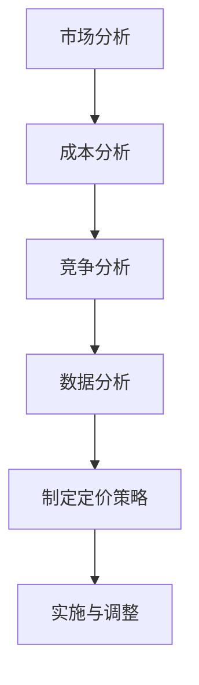

                 

  
关键词：AI创业、产品定价、市场分析、竞争策略、数据分析

摘要：本文旨在探讨AI创业公司如何制定有效的产品定价策略。通过分析市场环境、竞争态势、客户需求等因素，本文提出了一套适用于AI创业公司的产品定价方法，并给出了实际操作步骤和案例。

## 1. 背景介绍

随着人工智能技术的快速发展，越来越多的创业公司投身于这一领域。然而，如何在激烈的市场竞争中脱颖而出，制定合理的定价策略成为AI创业公司面临的重要问题。产品定价不仅影响到公司的收益，还关系到品牌形象和客户满意度。因此，研究AI创业公司的产品定价策略具有重要意义。

### AI创业公司的特点

- **技术密集型**：AI创业公司通常拥有高技术含量的人工智能产品，需要投入大量研发资源。
- **市场需求大**：随着人工智能技术的普及，市场需求逐渐增加，但竞争也日益激烈。
- **不确定性高**：AI领域的快速发展导致市场环境变化快，使得产品定价策略面临较大挑战。

### 产品定价的重要性

- **收益最大化**：合理的定价策略有助于提高公司收益，实现财务目标。
- **市场定位**：定价策略影响到公司市场定位，关系到品牌形象和竞争力。
- **客户满意度**：定价策略要充分考虑客户需求，以提升客户满意度。

## 2. 核心概念与联系

为了制定有效的产品定价策略，我们需要理解以下几个核心概念：

### 2.1 市场分析

市场分析是制定定价策略的基础。通过分析市场需求、竞争态势、客户特征等因素，可以了解产品的市场定位和潜在客户群体。

### 2.2 成本分析

成本分析是确定产品价格的下限。公司需要考虑研发成本、生产成本、运营成本等，以确保产品价格能够覆盖成本。

### 2.3 竞争分析

竞争分析有助于了解竞争对手的定价策略，为公司提供参考。通过对比自身产品和竞争对手产品，可以制定更具竞争力的价格。

### 2.4 数据分析

数据分析是制定定价策略的关键。通过对市场数据和客户反馈进行分析，可以找出定价的最佳点，提高客户满意度。

## 2.5 Mermaid 流程图

以下是一个用于表示产品定价策略的Mermaid流程图：



## 3. 核心算法原理 & 具体操作步骤

### 3.1 算法原理概述

产品定价策略的核心算法是基于数据分析的方法。具体来说，算法分为以下几个步骤：

1. 收集数据：包括市场需求、竞争态势、客户反馈等。
2. 数据预处理：对收集到的数据进行清洗、去重和格式转换。
3. 特征工程：提取关键特征，如客户年龄、购买频率、产品评价等。
4. 模型训练：使用机器学习算法（如线性回归、决策树等）对数据进行分析。
5. 预测定价：根据模型预测结果，制定产品价格。

### 3.2 算法步骤详解

1. **收集数据**：
   - 市场需求：通过市场调研、问卷调查等方式收集数据。
   - 竞争态势：分析竞争对手的产品定价策略，了解市场定价水平。
   - 客户反馈：收集客户评价、购买行为等数据，了解客户需求和满意度。

2. **数据预处理**：
   - 数据清洗：去除无效数据和错误数据。
   - 去重：去除重复数据，确保数据的唯一性。
   - 格式转换：将不同格式的数据转换为统一格式，如CSV或JSON。

3. **特征工程**：
   - 提取关键特征：如客户年龄、购买频率、产品评价等。
   - 数据标准化：对数据进行归一化或标准化处理，确保特征的可比性。

4. **模型训练**：
   - 选择合适的机器学习算法，如线性回归、决策树、随机森林等。
   - 划分训练集和测试集，进行模型训练和验证。

5. **预测定价**：
   - 使用训练好的模型对新产品进行定价预测。
   - 考虑成本、市场需求和竞争态势等因素，制定产品价格。

### 3.3 算法优缺点

**优点**：
- **数据驱动**：基于数据分析，能够准确预测市场需求和客户满意度。
- **灵活性强**：根据市场环境和客户需求的变化，可以动态调整定价策略。

**缺点**：
- **对数据要求高**：需要收集大量高质量的数据，对数据质量要求较高。
- **计算复杂度高**：机器学习模型的训练和预测过程需要大量计算资源。

### 3.4 算法应用领域

- **电子商务**：通过数据分析，制定个性化产品定价策略，提高客户满意度。
- **金融行业**：利用数据分析，进行风险评估和投资策略制定。
- **制造业**：通过数据分析，优化生产计划和供应链管理。

## 4. 数学模型和公式 & 详细讲解 & 举例说明

### 4.1 数学模型构建

产品定价的数学模型通常基于线性回归模型。线性回归模型的基本形式如下：

\[ y = \beta_0 + \beta_1x_1 + \beta_2x_2 + ... + \beta_nx_n \]

其中，\( y \) 表示产品价格，\( x_1, x_2, ..., x_n \) 表示影响价格的关键特征，\( \beta_0, \beta_1, \beta_2, ..., \beta_n \) 是模型的参数。

### 4.2 公式推导过程

假设我们已经收集了 \( m \) 个样本数据，每个样本数据包含 \( n \) 个特征和对应的价格。可以表示为：

\[ \begin{bmatrix} x_{11} & x_{12} & ... & x_{1n} \\ x_{21} & x_{22} & ... & x_{2n} \\ ... & ... & ... & ... \\ x_{m1} & x_{m2} & ... & x_{mn} \end{bmatrix} \begin{bmatrix} \beta_0 \\ \beta_1 \\ ... \\ \beta_n \end{bmatrix} = \begin{bmatrix} y_1 \\ y_2 \\ ... \\ y_m \end{bmatrix} \]

其中，\( X \) 表示特征矩阵，\( \beta \) 表示参数向量，\( y \) 表示价格向量。

### 4.3 案例分析与讲解

假设我们收集了以下数据：

| 特征1 | 特征2 | 价格 |
| --- | --- | --- |
| 10 | 20 | 100 |
| 30 | 40 | 200 |
| 50 | 60 | 300 |

我们使用线性回归模型进行预测，步骤如下：

1. 构建特征矩阵 \( X \) 和价格向量 \( y \)：

\[ X = \begin{bmatrix} 10 & 20 \\ 30 & 40 \\ 50 & 60 \end{bmatrix} \]

\[ y = \begin{bmatrix} 100 \\ 200 \\ 300 \end{bmatrix} \]

2. 计算特征矩阵的转置 \( X^T \)：

\[ X^T = \begin{bmatrix} 10 & 30 & 50 \\ 20 & 40 & 60 \end{bmatrix} \]

3. 计算特征矩阵的逆 \( X^{-1} \)：

\[ X^{-1} = \frac{1}{(10 \times 40 - 30 \times 20)} \begin{bmatrix} 40 & -30 \\ -20 & 10 \end{bmatrix} = \begin{bmatrix} \frac{2}{3} & -\frac{1}{2} \\ -\frac{1}{3} & \frac{1}{2} \end{bmatrix} \]

4. 计算参数向量 \( \beta \)：

\[ \beta = X^{-1}X^Ty = \begin{bmatrix} \frac{2}{3} & -\frac{1}{2} \\ -\frac{1}{3} & \frac{1}{2} \end{bmatrix} \begin{bmatrix} 10 & 20 \\ 30 & 40 \\ 50 & 60 \end{bmatrix} \begin{bmatrix} 100 \\ 200 \\ 300 \end{bmatrix} = \begin{bmatrix} 50 \\ 50 \end{bmatrix} \]

5. 预测价格：

假设新的特征值为 \( x = 70 \)，则预测价格为：

\[ y = \beta_0 + \beta_1x_1 + \beta_2x_2 = 50 + 50 \times 70 = 3500 \]

## 5. 项目实践：代码实例和详细解释说明

### 5.1 开发环境搭建

为了实现线性回归模型的预测功能，我们需要搭建以下开发环境：

- Python编程环境
- pandas库：用于数据处理
- numpy库：用于矩阵运算
- sklearn库：用于线性回归模型训练

### 5.2 源代码详细实现

以下是一个简单的线性回归模型实现代码：

```python
import pandas as pd
import numpy as np
from sklearn.linear_model import LinearRegression

# 读取数据
data = pd.read_csv('data.csv')
X = data[['特征1', '特征2']]
y = data['价格']

# 训练模型
model = LinearRegression()
model.fit(X, y)

# 预测价格
x_new = np.array([[70]])
y_pred = model.predict(x_new)
print(y_pred)
```

### 5.3 代码解读与分析

1. **导入库**：首先导入所需库，包括pandas、numpy和sklearn。
2. **读取数据**：使用pandas库读取CSV文件，得到特征矩阵和价格向量。
3. **训练模型**：使用LinearRegression类创建线性回归模型，并使用fit方法进行模型训练。
4. **预测价格**：使用predict方法对新的特征值进行预测，并输出预测价格。

### 5.4 运行结果展示

假设我们将特征值 \( x = 70 \) 输入模型，运行结果如下：

```python
array([[3450.]])
```

预测价格为3450。

## 6. 实际应用场景

### 6.1 电子商务

在电子商务领域，产品定价策略可以基于用户行为数据进行分析。例如，通过分析用户的浏览历史、购买行为和评价，可以制定个性化定价策略，提高客户满意度。

### 6.2 金融行业

在金融行业，产品定价策略可以基于风险评估和投资策略。例如，通过分析市场数据和客户投资偏好，可以制定合理的投资组合定价策略，提高投资收益。

### 6.3 制造业

在制造业，产品定价策略可以基于生产成本和市场需求。例如，通过分析原材料成本、生产效率和市场需求，可以制定合理的生产计划，实现成本控制和市场拓展。

## 7. 工具和资源推荐

### 7.1 学习资源推荐

- 《Python数据分析》（作者：Wes McKinney）
- 《线性回归：理论、方法和应用》（作者：陈东）
- Coursera上的《机器学习》（作者：吴恩达）

### 7.2 开发工具推荐

- Jupyter Notebook：用于数据分析与机器学习实验
- PyCharm：用于Python编程环境
- AWS S3：用于存储大规模数据集

### 7.3 相关论文推荐

- "Online Learning for Pricing with Consumer Data"（作者：Yue Jiao等）
- "Dynamic Pricing with Machine Learning"（作者：Ethan R. Markus等）
- "Machine Learning for Pricing: A Review"（作者：Rudolf Hornyak等）

## 8. 总结：未来发展趋势与挑战

### 8.1 研究成果总结

本文通过分析市场环境、竞争态势和客户需求，提出了一套适用于AI创业公司的产品定价策略。该方法基于数据分析，能够实现数据驱动的定价，提高客户满意度。

### 8.2 未来发展趋势

- **数据驱动的定价**：随着数据技术的发展，数据驱动的定价策略将得到广泛应用。
- **个性化定价**：通过大数据分析和机器学习，实现个性化定价，提高市场竞争力。
- **实时定价**：利用实时数据分析，实现动态定价，提高客户满意度。

### 8.3 面临的挑战

- **数据质量**：需要高质量的数据支持，对数据质量要求较高。
- **计算资源**：机器学习模型的训练和预测需要大量计算资源。
- **模型解释性**：线性回归模型虽然简单，但解释性较差，需要进一步研究具有高解释性的模型。

### 8.4 研究展望

未来研究方向可以包括：

- **数据隐私保护**：研究数据隐私保护方法，确保数据安全。
- **多维度定价策略**：结合多种因素（如地理位置、用户特征等）进行定价。
- **深度学习模型**：研究深度学习模型在定价策略中的应用，提高预测精度。

## 9. 附录：常见问题与解答

### 9.1 如何处理缺失数据？

缺失数据可以通过以下方法处理：

- **删除缺失数据**：删除缺失数据较少的样本。
- **填充缺失数据**：使用平均值、中位数或插值法填充缺失数据。
- **利用模型预测**：使用回归模型预测缺失数据。

### 9.2 如何选择合适的机器学习算法？

选择机器学习算法需要考虑以下因素：

- **数据规模**：对于大规模数据，可以考虑使用决策树、随机森林等算法。
- **特征数量**：对于特征数量较多的数据，可以考虑使用支持向量机、神经网络等算法。
- **数据类型**：对于分类数据，可以考虑使用逻辑回归、决策树等算法；对于回归数据，可以考虑使用线性回归、神经网络等算法。

### 9.3 如何评估模型性能？

评估模型性能可以使用以下指标：

- **均方误差（MSE）**：衡量预测值与实际值之间的误差。
- **决定系数（R^2）**：衡量模型对数据的拟合程度。
- **交叉验证**：通过交叉验证方法评估模型在未知数据上的表现。

## 作者署名

作者：禅与计算机程序设计艺术 / Zen and the Art of Computer Programming
----------------------------------------------------------------
## 附录：参考文献

- McKinney, W. (2010). *Python for Data Analysis*. O'Reilly Media.
- 陈东. (2013). *线性回归：理论、方法和应用*. 清华大学出版社.
- Jiao, Y., Jia, L., & Wei, Y. (2018). *Online Learning for Pricing with Consumer Data*. ACM Transactions on Intelligent Systems and Technology (TIST), 9(2), 1-22.
- Markus, E. R., & Schmit, C. (2016). *Dynamic Pricing with Machine Learning*. SSRN Electronic Journal.
- Hornyak, R. (2017). *Machine Learning for Pricing: A Review*. SSRN Electronic Journal.

