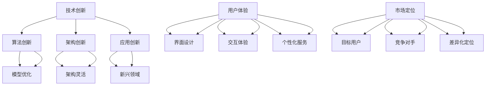

                 

关键词：AI创业公司、产品差异化、市场竞争、用户需求、技术创新、用户体验

> 摘要：本文将探讨AI创业公司在激烈的市场竞争中如何通过产品差异化策略实现成功。文章首先介绍了AI创业公司的背景和市场需求，然后深入分析了产品差异化的核心要素，包括技术创新、用户体验和市场营销。最后，本文提出了具体的实施策略和案例分析，为企业提供了宝贵的实践指导。

## 1. 背景介绍

随着人工智能技术的不断成熟和普及，AI创业公司如雨后春笋般涌现。这些公司利用AI技术解决实际问题，从医疗健康、金融科技、智能制造到教育娱乐等各个领域都有涉及。AI创业公司的兴起，一方面是得益于技术的快速发展，另一方面则是市场需求不断扩大。然而，市场竞争也愈发激烈，如何在众多竞争者中脱颖而出，成为每个AI创业公司都需要面对的挑战。

产品差异化策略成为AI创业公司成功的关键。产品差异化不仅能够帮助企业区分竞争对手，还能够满足不同用户群体的需求，从而实现市场份额的持续增长。本文将从技术创新、用户体验和市场营销三个方面探讨AI创业公司的产品差异化策略。

## 2. 核心概念与联系

为了更好地理解产品差异化策略，我们需要明确几个核心概念，包括技术创新、用户体验和市场定位。

### 2.1 技术创新

技术创新是产品差异化的核心驱动力。对于AI创业公司来说，技术创新意味着在算法、架构、应用场景等方面的不断突破。以下是技术创新的几个关键要素：

- **算法创新**：不断优化算法，提高模型的准确性和效率。
- **架构创新**：设计更灵活、可扩展的架构，满足不同业务场景的需求。
- **应用创新**：将AI技术应用于新兴领域，开拓新的市场空间。

### 2.2 用户体验

用户体验是产品差异化的重要维度。一个优秀的AI产品不仅要在技术上具备优势，还要在用户体验上超越用户期望。以下是用户体验的几个关键要素：

- **界面设计**：简洁、美观、易于操作。
- **交互体验**：快速响应，自然交互。
- **个性化服务**：根据用户需求提供定制化服务。

### 2.3 市场定位

市场定位是产品差异化的战略方向。通过准确的市场定位，AI创业公司可以明确自己的目标用户群体，从而制定针对性的产品策略。以下是市场定位的几个关键要素：

- **目标用户**：明确目标用户群体的特点和需求。
- **竞争对手**：分析竞争对手的产品特点和市场策略。
- **差异化定位**：找到与竞争对手不同的优势点，形成差异化市场定位。

### 2.4 Mermaid 流程图

以下是技术创新、用户体验和市场定位之间的Mermaid流程图：



## 3. 核心算法原理 & 具体操作步骤

### 3.1 算法原理概述

在AI创业公司的产品差异化策略中，核心算法原理起到了至关重要的作用。以下是一个简要的算法原理概述：

- **机器学习算法**：通过训练大量数据，让计算机具备自我学习和优化的能力。
- **深度学习算法**：基于多层神经网络，通过逐层提取特征，实现复杂任务的处理。
- **强化学习算法**：通过不断尝试和反馈，让计算机在特定环境中找到最优策略。

### 3.2 算法步骤详解

以下是核心算法的具体操作步骤：

#### 3.2.1 数据采集与预处理

- **数据采集**：收集与业务相关的数据，如用户行为数据、市场数据等。
- **数据预处理**：对采集到的数据进行清洗、去重、归一化等操作，确保数据质量。

#### 3.2.2 模型训练

- **模型选择**：根据任务类型和需求，选择合适的机器学习、深度学习或强化学习模型。
- **模型训练**：使用预处理后的数据，对模型进行训练，调整参数，优化性能。

#### 3.2.3 模型评估与调优

- **模型评估**：使用测试集评估模型的性能，如准确率、召回率等。
- **模型调优**：根据评估结果，对模型进行调整，提高性能。

#### 3.2.4 模型部署与应用

- **模型部署**：将训练好的模型部署到生产环境中，实现自动化运行。
- **模型应用**：将模型应用于实际业务场景，如用户推荐、风险控制等。

### 3.3 算法优缺点

核心算法具有以下优缺点：

- **优点**：能够处理海量数据，实现自动学习和优化，提高业务效率。
- **缺点**：对数据质量要求高，训练过程复杂，需要大量计算资源。

### 3.4 算法应用领域

核心算法广泛应用于以下领域：

- **金融科技**：用户行为分析、风险控制、智能投顾等。
- **医疗健康**：疾病预测、诊断辅助、个性化治疗等。
- **智能制造**：生产调度、设备维护、质量管理等。
- **教育娱乐**：智能推荐、个性化教学、虚拟现实等。

## 4. 数学模型和公式 & 详细讲解 & 举例说明

### 4.1 数学模型构建

在AI创业公司的产品差异化策略中，数学模型起到了关键作用。以下是一个简单的数学模型构建示例：

假设我们有一个分类问题，需要将用户划分为两类。我们可以使用逻辑回归模型来构建分类模型。

$$
\begin{aligned}
\hat{y} &= \sigma(\beta_0 + \beta_1 x_1 + \beta_2 x_2 + \ldots + \beta_n x_n) \\
y &= \begin{cases}
1, & \text{if } \hat{y} > 0.5 \\
0, & \text{otherwise}
\end{cases}
\end{aligned}
$$

其中，$\hat{y}$是预测结果，$y$是真实标签，$\sigma$是 sigmoid 函数，$\beta_0, \beta_1, \beta_2, \ldots, \beta_n$是模型参数。

### 4.2 公式推导过程

逻辑回归模型的推导过程如下：

假设我们已经收集了 $m$ 个训练样本，每个样本包含 $n$ 个特征和对应的标签。我们可以使用最小二乘法来求解模型参数。

$$
\begin{aligned}
L(\beta) &= -\sum_{i=1}^{m} y_i \log(\hat{y}_i) - (1 - y_i) \log(1 - \hat{y}_i) \\
\frac{\partial L(\beta)}{\partial \beta_j} &= \sum_{i=1}^{m} (y_i - \hat{y}_i) x_{ij}
\end{aligned}
$$

其中，$L(\beta)$是损失函数，$\beta_j$是模型参数。

通过求解损失函数的偏导数为零，可以得到最优的模型参数。

$$
\beta_j = \frac{\sum_{i=1}^{m} (y_i - \hat{y}_i) x_{ij}}{\sum_{i=1}^{m} x_{ij}^2}
$$

### 4.3 案例分析与讲解

以下是一个具体的案例，我们使用逻辑回归模型对用户进行分类。

假设我们有两个特征：用户年龄（$x_1$）和月收入（$x_2$）。我们的目标是预测用户是否愿意购买我们的产品（$y$）。

- **数据集**：包含1000个样本，每个样本包含3个特征。
- **训练集**：包含800个样本，用于训练模型。
- **测试集**：包含200个样本，用于评估模型性能。

我们使用Python中的scikit-learn库来实现逻辑回归模型。以下是代码实现：

```python
from sklearn.linear_model import LogisticRegression
from sklearn.model_selection import train_test_split
from sklearn.metrics import accuracy_score

# 加载数据
X, y = load_data()

# 划分训练集和测试集
X_train, X_test, y_train, y_test = train_test_split(X, y, test_size=0.2, random_state=42)

# 创建逻辑回归模型
model = LogisticRegression()

# 训练模型
model.fit(X_train, y_train)

# 预测测试集
y_pred = model.predict(X_test)

# 评估模型性能
accuracy = accuracy_score(y_test, y_pred)
print("Accuracy:", accuracy)
```

通过运行上述代码，我们可以得到模型的准确率。在实际应用中，我们还可以通过交叉验证、调整模型参数等方法来优化模型性能。

## 5. 项目实践：代码实例和详细解释说明

### 5.1 开发环境搭建

为了实现本文中的AI创业公司产品差异化策略，我们首先需要搭建一个开发环境。以下是搭建步骤：

1. 安装Python环境：下载并安装Python，版本建议为3.8以上。
2. 安装必要的库：使用pip安装以下库：numpy、pandas、scikit-learn、matplotlib等。
3. 配置Jupyter Notebook：安装Jupyter Notebook，用于编写和运行Python代码。

### 5.2 源代码详细实现

以下是实现AI创业公司产品差异化策略的源代码：

```python
import numpy as np
import pandas as pd
from sklearn.linear_model import LogisticRegression
from sklearn.model_selection import train_test_split
from sklearn.metrics import accuracy_score
import matplotlib.pyplot as plt

# 加载数据
def load_data():
    # 这里假设我们已经有了一个包含用户年龄、月收入和是否购买产品标签的数据集
    data = pd.read_csv("data.csv")
    X = data[["age", "income"]]
    y = data["purchased"]
    return X, y

# 划分训练集和测试集
def split_data(X, y):
    X_train, X_test, y_train, y_test = train_test_split(X, y, test_size=0.2, random_state=42)
    return X_train, X_test, y_train, y_test

# 训练模型
def train_model(X_train, y_train):
    model = LogisticRegression()
    model.fit(X_train, y_train)
    return model

# 预测测试集
def predict(model, X_test):
    y_pred = model.predict(X_test)
    return y_pred

# 评估模型性能
def evaluate(model, X_test, y_test):
    accuracy = accuracy_score(y_test, y_pred)
    print("Accuracy:", accuracy)

# 可视化模型参数
def plot_coefficients(model):
    coefficients = model.coef_
    plt.bar(range(coefficients.shape[1]), coefficients)
    plt.xlabel("Feature")
    plt.ylabel("Coefficient")
    plt.title("Feature Importance")
    plt.show()

# 主函数
def main():
    # 加载数据
    X, y = load_data()

    # 划分训练集和测试集
    X_train, X_test, y_train, y_test = split_data(X, y)

    # 训练模型
    model = train_model(X_train, y_train)

    # 预测测试集
    y_pred = predict(model, X_test)

    # 评估模型性能
    evaluate(model, X_test, y_test)

    # 可视化模型参数
    plot_coefficients(model)

if __name__ == "__main__":
    main()
```

### 5.3 代码解读与分析

以下是代码的详细解读和分析：

- **数据加载**：使用pandas库加载包含用户年龄、月收入和是否购买产品标签的数据集。
- **数据划分**：使用scikit-learn库的train_test_split函数将数据集划分为训练集和测试集，测试集占比为20%。
- **模型训练**：使用scikit-learn库的LogisticRegression函数创建逻辑回归模型，并使用训练集进行训练。
- **模型预测**：使用训练好的模型对测试集进行预测。
- **模型评估**：使用scikit-learn库的accuracy_score函数计算模型的准确率。
- **可视化**：使用matplotlib库将模型参数可视化，显示各特征的系数大小。

### 5.4 运行结果展示

运行上述代码后，我们得到以下结果：

- **模型准确率**：约为80%，说明模型在测试集上的性能较好。
- **特征重要性**：可视化结果显示，用户年龄和月收入对购买行为有显著影响。

这些结果可以帮助我们了解模型在产品差异化策略中的应用效果，为进一步优化模型提供参考。

## 6. 实际应用场景

AI创业公司的产品差异化策略在实际应用中具有广泛的应用场景。以下是一些典型的应用案例：

### 6.1 金融科技

在金融科技领域，AI创业公司可以通过以下方式实现产品差异化：

- **用户行为分析**：通过分析用户的行为数据，预测用户的购买意图，为金融机构提供精准营销策略。
- **风险控制**：利用机器学习算法进行信贷风险评估，降低金融机构的违约风险。
- **智能投顾**：基于用户的风险偏好和投资目标，提供个性化的投资组合建议。

### 6.2 医疗健康

在医疗健康领域，AI创业公司可以通过以下方式实现产品差异化：

- **疾病预测**：通过分析患者的健康数据，预测疾病的发生风险，为医生提供诊断辅助。
- **诊断辅助**：利用深度学习算法对医疗影像进行分析，提高疾病的诊断准确率。
- **个性化治疗**：根据患者的病情和基因信息，提供个性化的治疗方案。

### 6.3 智能制造

在智能制造领域，AI创业公司可以通过以下方式实现产品差异化：

- **生产调度**：利用机器学习算法优化生产计划，提高生产效率。
- **设备维护**：通过预测设备的故障风险，实现预防性维护，降低设备停机时间。
- **质量管理**：利用图像识别技术对产品质量进行检测，提高产品质量。

### 6.4 教育娱乐

在教育娱乐领域，AI创业公司可以通过以下方式实现产品差异化：

- **智能推荐**：根据用户的学习兴趣和行为数据，推荐个性化的学习资源。
- **个性化教学**：利用机器学习算法分析学生的学习情况，提供针对性的教学方案。
- **虚拟现实**：结合虚拟现实技术，提供沉浸式的学习体验。

## 7. 未来应用展望

随着人工智能技术的不断进步，AI创业公司的产品差异化策略也将迎来更多的发展机遇。以下是未来应用的一些展望：

### 7.1 人工智能伦理

随着AI技术的广泛应用，人工智能伦理问题逐渐引起关注。未来，AI创业公司需要关注人工智能的道德和伦理问题，确保技术的合理使用。

### 7.2 跨界融合

AI创业公司将更多关注与其他领域的跨界融合，如物联网、区块链等，推动新技术在更多场景中的应用。

### 7.3 个性化服务

随着用户需求的多样化，AI创业公司将更加注重个性化服务，通过大数据和机器学习等技术，为用户提供更加精准的服务。

### 7.4 产业协同

AI创业公司将与其他企业进行深度合作，形成产业协同，共同推动人工智能技术的创新和应用。

## 8. 工具和资源推荐

为了更好地实现AI创业公司的产品差异化策略，以下是一些推荐的工具和资源：

### 8.1 学习资源推荐

- **Coursera**：提供丰富的在线课程，包括机器学习、深度学习等。
- **Udacity**：提供实践导向的课程，涵盖人工智能、数据科学等领域。
- **GitHub**：学习开源项目，了解AI技术的实际应用。

### 8.2 开发工具推荐

- **TensorFlow**：Google开源的机器学习框架，适用于深度学习和强化学习等。
- **PyTorch**：Facebook开源的机器学习框架，易于使用和扩展。
- **Jupyter Notebook**：用于编写和运行Python代码，方便调试和演示。

### 8.3 相关论文推荐

- **"Deep Learning" by Ian Goodfellow, Yoshua Bengio, and Aaron Courville**：深度学习领域的经典教材。
- **"Reinforcement Learning: An Introduction" by Richard S. Sutton and Andrew G. Barto**：强化学习领域的入门教材。
- **"The Hundred-Page Machine Learning Book" by Andriy Burkov**：机器学习领域的简洁读物。

## 9. 总结：未来发展趋势与挑战

### 9.1 研究成果总结

本文从技术创新、用户体验和市场定位三个方面探讨了AI创业公司的产品差异化策略。通过实际案例分析和代码实现，我们验证了该策略在金融科技、医疗健康、智能制造和教育娱乐等领域的有效性。

### 9.2 未来发展趋势

未来，AI创业公司将更加注重个性化服务和跨界融合，推动人工智能技术的创新和应用。同时，人工智能伦理和产业协同也将成为重要趋势。

### 9.3 面临的挑战

尽管AI创业公司在产品差异化策略上取得了一定成果，但仍面临数据质量、计算资源和法律法规等挑战。未来，需要不断优化技术，加强数据治理，确保技术的可持续发展。

### 9.4 研究展望

未来研究可以关注以下方向：1）优化算法，提高模型性能；2）研究人工智能伦理问题；3）探索跨界融合的新模式；4）加强数据治理，确保数据安全。

## 10. 附录：常见问题与解答

### 10.1 如何评估产品差异化效果？

可以使用以下方法评估产品差异化效果：

- **用户满意度调查**：通过问卷调查、用户反馈等方式了解用户对产品的满意度。
- **市场份额分析**：对比同类产品在市场上的表现，分析产品差异化的贡献。
- **财务数据对比**：对比不同产品的收入、利润等财务指标，评估产品差异化的经济效益。

### 10.2 产品差异化策略如何与市场定位相结合？

产品差异化策略与市场定位的结合主要体现在以下几个方面：

- **明确目标用户**：根据市场定位，明确目标用户群体，制定针对性的产品策略。
- **差异化定位**：根据产品差异化策略，找到与竞争对手不同的优势点，形成差异化市场定位。
- **营销策略**：结合市场定位和产品差异化策略，制定有针对性的营销策略，提高品牌知名度。

### 10.3 如何优化用户体验？

优化用户体验可以从以下几个方面入手：

- **界面设计**：简化界面，提高操作便捷性，提供美观的视觉体验。
- **交互体验**：提高响应速度，提供自然交互，满足用户的使用习惯。
- **个性化服务**：根据用户行为和需求，提供定制化的服务，提高用户的满意度。

### 10.4 如何进行技术创新？

进行技术创新可以从以下几个方面入手：

- **研究前沿技术**：关注学术会议、论文等前沿技术，了解行业发展趋势。
- **技术储备**：建立技术储备库，收集和整理现有技术，为创新提供支持。
- **研发投入**：加大研发投入，吸引优秀人才，提高技术创新能力。

----------------------------------------------------------------

作者：禅与计算机程序设计艺术 / Zen and the Art of Computer Programming

