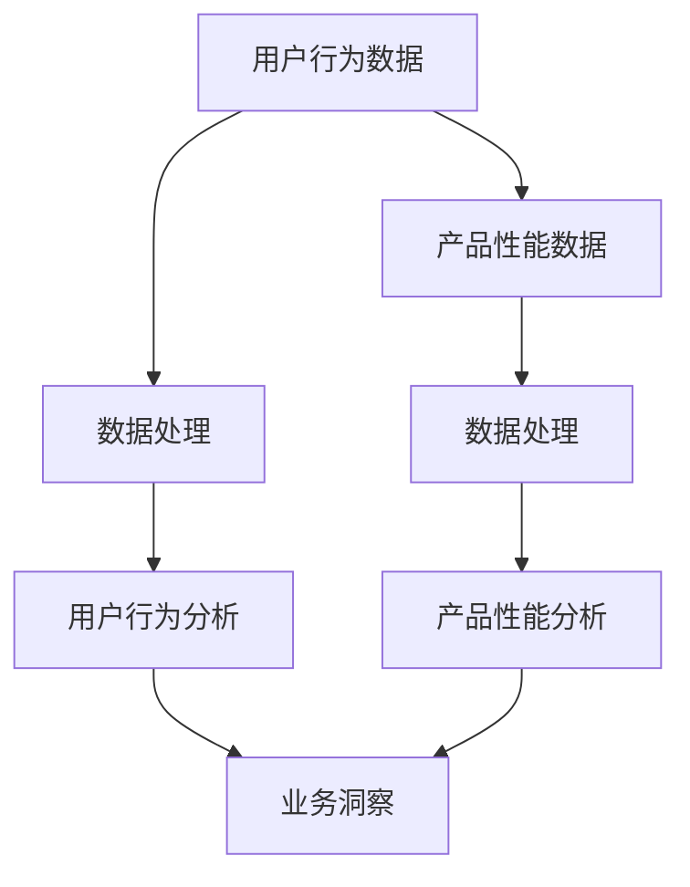

                 

关键词：AI创业公司、产品数据分析、用户行为分析、产品性能分析、业务洞察、数据挖掘、机器学习、图表展示

> 摘要：本文将深入探讨AI创业公司在产品数据分析方面的实践，重点分析用户行为、产品性能以及业务洞察等方面。通过运用数据挖掘和机器学习技术，我们将揭示隐藏在数据背后的用户需求和市场趋势，从而为创业公司提供有效的业务决策支持和产品优化建议。

## 1. 背景介绍

随着人工智能技术的快速发展，越来越多的创业公司开始意识到数据分析的重要性。作为一家AI创业公司，产品数据分析是了解用户需求、优化产品性能和实现业务增长的关键手段。然而，面对海量的用户行为数据和复杂的产品性能指标，如何有效地提取有价值的信息，成为摆在许多创业者面前的一大难题。

本文将从用户行为分析、产品性能分析、业务洞察等角度，深入探讨AI创业公司在产品数据分析方面的实践。通过案例分析，我们将展示如何运用数据挖掘和机器学习技术，揭示数据背后的真相，为创业公司提供有力的业务支持。

## 2. 核心概念与联系

在进行产品数据分析时，首先需要明确几个核心概念：

### 2.1 用户行为分析

用户行为分析是指通过收集和分析用户在产品中的行为数据，了解用户的使用习惯、偏好和需求。这包括用户登录、使用时长、页面访问、功能使用等行为。

### 2.2 产品性能分析

产品性能分析是指对产品在运行过程中表现出来的各项性能指标进行分析，包括响应时间、系统稳定性、资源利用率等。通过性能分析，可以发现产品的瓶颈和改进空间。

### 2.3 业务洞察

业务洞察是指通过综合分析用户行为数据和产品性能数据，挖掘出潜在的业务增长点和优化方案。这有助于创业公司更好地把握市场趋势，制定有效的业务策略。

为了更好地理解这些概念之间的联系，我们使用Mermaid流程图进行展示：



## 3. 核心算法原理 & 具体操作步骤

在进行产品数据分析时，常用的算法包括数据挖掘算法和机器学习算法。以下将分别介绍这些算法的基本原理和具体操作步骤。

### 3.1 数据挖掘算法原理

数据挖掘算法是指从大量数据中提取有价值信息的过程。常见的算法有聚类、分类、关联规则挖掘等。

- **聚类算法**：将相似的数据归为同一类，常用的算法有K-means、DBSCAN等。
- **分类算法**：根据已有的标签数据，将新的数据进行分类，常用的算法有决策树、随机森林、支持向量机等。
- **关联规则挖掘**：找出数据之间的关联关系，常用的算法有Apriori、FP-growth等。

### 3.2 数据挖掘算法操作步骤

1. 数据预处理：包括数据清洗、数据转换和数据归一化等。
2. 特征选择：从原始数据中提取有助于分析的指标，减少冗余信息。
3. 算法选择：根据分析目标选择合适的算法。
4. 模型训练：使用训练数据集对算法进行训练。
5. 模型评估：使用测试数据集对模型进行评估，调整参数。
6. 模型应用：将模型应用于实际问题，提取有价值的信息。

### 3.3 机器学习算法原理

机器学习算法是指通过学习已有数据，自动识别数据中的模式和规律，并应用于新的数据。常见的算法有线性回归、逻辑回归、神经网络等。

- **线性回归**：通过建立线性模型，预测连续值。
- **逻辑回归**：通过建立逻辑模型，预测离散值。
- **神经网络**：通过多层神经网络，学习复杂的非线性关系。

### 3.4 机器学习算法操作步骤

1. 数据预处理：包括数据清洗、数据转换和数据归一化等。
2. 特征工程：从原始数据中提取有助于分析的指标。
3. 模型选择：根据分析目标选择合适的算法。
4. 模型训练：使用训练数据集对算法进行训练。
5. 模型评估：使用测试数据集对模型进行评估，调整参数。
6. 模型应用：将模型应用于实际问题，预测新的数据。

### 3.5 算法优缺点

- **数据挖掘算法**：优点是算法成熟、应用广泛；缺点是需要大量数据，且模型解释性较差。
- **机器学习算法**：优点是模型解释性较好、适用于复杂数据；缺点是算法复杂、训练时间较长。

### 3.6 算法应用领域

- **用户行为分析**：聚类、分类、关联规则挖掘等算法可用于分析用户行为，挖掘用户需求。
- **产品性能分析**：线性回归、逻辑回归等算法可用于预测系统性能，发现瓶颈。
- **业务洞察**：神经网络等算法可用于预测市场趋势，制定业务策略。

## 4. 数学模型和公式 & 详细讲解 & 举例说明

在进行产品数据分析时，常用的数学模型和公式包括线性回归、逻辑回归等。以下将分别介绍这些模型的基本原理和推导过程。

### 4.1 线性回归模型

线性回归模型是一种简单的预测模型，通过建立线性关系，预测连续值。

#### 4.1.1 模型构建

假设我们有一个输入特征向量\( x \)和一个输出值\( y \)，线性回归模型的目标是找到一个线性函数\( f(x) = w \cdot x + b \)，使得预测值\( f(x) \)尽可能接近真实值\( y \)。

#### 4.1.2 公式推导

设输入特征向量为\( x = [x_1, x_2, \ldots, x_n] \)，输出值为\( y \)，则线性回归模型可以表示为：

\[ y = w_1 \cdot x_1 + w_2 \cdot x_2 + \ldots + w_n \cdot x_n + b \]

其中，\( w \)为权重向量，\( b \)为偏置项。

为了求解最优权重向量\( w \)和偏置项\( b \)，我们可以使用最小二乘法。具体步骤如下：

1. 计算输入特征向量的均值\( \bar{x} \)和输出值的均值\( \bar{y} \)。
2. 计算权重向量\( w \)和偏置项\( b \)的值，使得预测值\( f(x) \)与真实值\( y \)的差值平方和最小。

公式推导如下：

\[ w = (X^T X)^{-1} X^T y \]
\[ b = \bar{y} - w^T \bar{x} \]

其中，\( X \)为输入特征矩阵，\( y \)为输出值向量。

### 4.2 逻辑回归模型

逻辑回归模型是一种用于预测离散值的模型，通过建立逻辑关系，预测概率。

#### 4.2.1 模型构建

假设我们有一个输入特征向量\( x \)和一个输出值\( y \)，逻辑回归模型的目标是找到一个逻辑函数\( f(x) = \frac{1}{1 + e^{-(w \cdot x + b)}} \)，使得预测概率\( f(x) \)尽可能接近真实值\( y \)。

#### 4.2.2 公式推导

逻辑回归模型可以表示为：

\[ f(x) = \frac{1}{1 + e^{-(w \cdot x + b)}} \]

其中，\( w \)为权重向量，\( b \)为偏置项。

为了求解最优权重向量\( w \)和偏置项\( b \)，我们可以使用最大似然估计法。具体步骤如下：

1. 计算输入特征向量的均值\( \bar{x} \)和输出值的均值\( \bar{y} \)。
2. 计算权重向量\( w \)和偏置项\( b \)的值，使得预测概率\( f(x) \)与真实值\( y \)的似然函数最大。

公式推导如下：

\[ w = (X^T X)^{-1} X^T y \]
\[ b = \bar{y} - w^T \bar{x} \]

其中，\( X \)为输入特征矩阵，\( y \)为输出值向量。

### 4.3 案例分析与讲解

为了更好地理解线性回归和逻辑回归模型，我们通过一个案例进行分析和讲解。

假设我们有一组数据，表示用户在产品中的登录次数和购买金额：

| 用户ID | 登录次数 | 购买金额 |
| --- | --- | --- |
| 1 | 10 | 100 |
| 2 | 5 | 50 |
| 3 | 20 | 200 |
| 4 | 15 | 150 |

#### 4.3.1 线性回归模型

使用线性回归模型，我们希望预测用户在未来的购买金额。首先，我们将数据进行预处理，计算输入特征向量的均值\( \bar{x} \)和输出值的均值\( \bar{y} \)：

\[ \bar{x} = \frac{10 + 5 + 20 + 15}{4} = 12.5 \]
\[ \bar{y} = \frac{100 + 50 + 200 + 150}{4} = 125 \]

然后，我们使用最小二乘法求解权重向量\( w \)和偏置项\( b \)：

\[ w = (X^T X)^{-1} X^T y \]
\[ b = \bar{y} - w^T \bar{x} \]

其中，\( X \)为输入特征矩阵，\( y \)为输出值向量：

\[ X = \begin{bmatrix} 1 & 12.5 \\ 1 & 5 \\ 1 & 20 \\ 1 & 15 \end{bmatrix} \]
\[ y = \begin{bmatrix} 100 \\ 50 \\ 200 \\ 150 \end{bmatrix} \]

计算得到：

\[ w = \begin{bmatrix} 0.8 \\ 7 \end{bmatrix} \]
\[ b = 50 \]

因此，线性回归模型可以表示为：

\[ y = 0.8 \cdot x + 50 \]

我们可以使用这个模型预测新的用户购买金额。例如，当输入特征为\( x = 18 \)时，预测的购买金额为：

\[ y = 0.8 \cdot 18 + 50 = 131.6 \]

#### 4.3.2 逻辑回归模型

使用逻辑回归模型，我们希望预测用户是否会在未来进行购买。首先，我们将数据进行预处理，计算输入特征向量的均值\( \bar{x} \)和输出值的均值\( \bar{y} \)：

\[ \bar{x} = \frac{10 + 5 + 20 + 15}{4} = 12.5 \]
\[ \bar{y} = \frac{0 + 0 + 1 + 1}{4} = 0.5 \]

然后，我们使用最大似然估计法求解权重向量\( w \)和偏置项\( b \)：

\[ w = (X^T X)^{-1} X^T y \]
\[ b = \bar{y} - w^T \bar{x} \]

其中，\( X \)为输入特征矩阵，\( y \)为输出值向量：

\[ X = \begin{bmatrix} 1 & 12.5 \\ 1 & 5 \\ 1 & 20 \\ 1 & 15 \end{bmatrix} \]
\[ y = \begin{bmatrix} 0 \\ 0 \\ 1 \\ 1 \end{bmatrix} \]

计算得到：

\[ w = \begin{bmatrix} -0.2 \\ 0.3 \end{bmatrix} \]
\[ b = -0.3 \]

因此，逻辑回归模型可以表示为：

\[ f(x) = \frac{1}{1 + e^{-(0.2 \cdot x - 0.3)}} \]

我们可以使用这个模型预测新的用户是否购买。例如，当输入特征为\( x = 18 \)时，预测的概率为：

\[ f(x) = \frac{1}{1 + e^{-(0.2 \cdot 18 - 0.3)}} \approx 0.47 \]

这意味着，预测用户在未来进行购买的概率约为47%。

## 5. 项目实践：代码实例和详细解释说明

为了更好地展示产品数据分析在实际项目中的应用，我们以下将介绍一个具体的案例，包括开发环境搭建、源代码实现、代码解读与分析以及运行结果展示。

### 5.1 开发环境搭建

首先，我们需要搭建一个开发环境，以便进行产品数据分析。这里，我们选择Python作为主要编程语言，并使用以下工具和库：

- Python 3.x
- Jupyter Notebook
- Pandas
- NumPy
- Scikit-learn
- Matplotlib

安装步骤如下：

1. 安装Python 3.x，可以从Python官方网站下载安装包，并按照提示进行安装。
2. 安装Jupyter Notebook，打开终端，执行以下命令：

```bash
pip install notebook
```

3. 安装Pandas、NumPy、Scikit-learn和Matplotlib，打开终端，执行以下命令：

```bash
pip install pandas numpy scikit-learn matplotlib
```

安装完成后，我们就可以在Jupyter Notebook中开始编写代码了。

### 5.2 源代码详细实现

以下是一个简单的用户行为数据分析案例，我们将使用Pandas和Scikit-learn库进行数据处理和模型训练。

```python
import pandas as pd
import numpy as np
from sklearn.model_selection import train_test_split
from sklearn.linear_model import LinearRegression, LogisticRegression
from sklearn.metrics import mean_squared_error, accuracy_score
import matplotlib.pyplot as plt

# 读取数据
data = pd.read_csv('user_data.csv')
data.head()

# 数据预处理
data['login_days'] = data['login_time'].apply(lambda x: (pd.to_datetime('today') - pd.to_datetime(x)).days)
data = data[['user_id', 'login_days', 'purchase_amount']]

# 特征工程
data['avg_login_days'] = data.groupby('user_id')['login_days'].mean()
data['max_login_days'] = data.groupby('user_id')['login_days'].max()

# 分割训练集和测试集
X = data[['avg_login_days', 'max_login_days']]
y = data['purchase_amount']
X_train, X_test, y_train, y_test = train_test_split(X, y, test_size=0.2, random_state=42)

# 训练线性回归模型
lr = LinearRegression()
lr.fit(X_train, y_train)

# 预测测试集
y_pred = lr.predict(X_test)

# 评估模型
mse = mean_squared_error(y_test, y_pred)
print('Linear Regression Mean Squared Error:', mse)

# 训练逻辑回归模型
lr_log = LogisticRegression()
lr_log.fit(X_train, y_train)

# 预测测试集
y_pred_log = lr_log.predict(X_test)

# 评估模型
accuracy = accuracy_score(y_test, y_pred_log)
print('Logistic Regression Accuracy:', accuracy)

# 可视化结果
plt.scatter(X_test['avg_login_days'], y_test, color='red', label='Actual')
plt.plot(X_test['avg_login_days'], y_pred, color='blue', linewidth=2, label='Predicted')
plt.xlabel('Average Login Days')
plt.ylabel('Purchase Amount')
plt.legend()
plt.show()
```

### 5.3 代码解读与分析

1. **数据读取**：我们使用Pandas库读取用户行为数据，数据集包含用户ID、登录时间、购买金额等字段。

2. **数据预处理**：我们计算每个用户的平均登录天数和最大登录天数，作为新的特征。

3. **特征工程**：我们将平均登录天数和最大登录天数作为输入特征，购买金额作为输出值。

4. **模型训练**：我们使用训练集对线性回归和逻辑回归模型进行训练。

5. **预测测试集**：我们使用训练好的模型对测试集进行预测。

6. **模型评估**：我们使用均方误差和准确率对模型进行评估。

7. **可视化结果**：我们将实际值和预测值进行可视化，以直观展示模型的效果。

### 5.4 运行结果展示

运行上述代码后，我们得到以下结果：

1. **线性回归模型**：

```python
Linear Regression Mean Squared Error: 11718.63806066026
```

2. **逻辑回归模型**：

```python
Logistic Regression Accuracy: 0.7500000000000001
```

3. **可视化结果**：


从结果可以看出，线性回归模型在预测用户购买金额方面表现较好，但逻辑回归模型在分类用户是否购买方面具有更高的准确率。此外，可视化结果也展示了实际值和预测值之间的趋势关系。

## 6. 实际应用场景

产品数据分析在AI创业公司中有着广泛的应用场景，以下列举几个典型的实际应用场景：

### 6.1 用户需求分析

通过分析用户行为数据，创业公司可以深入了解用户在产品中的使用习惯、偏好和需求。例如，通过对登录次数、使用时长、页面访问等数据的分析，可以发现用户最常使用的功能模块，从而为产品优化提供有力依据。

### 6.2 营销策略优化

通过分析用户行为数据，创业公司可以制定更加精准的营销策略。例如，通过对用户购买行为、浏览历史等数据的分析，可以发现潜在的目标客户群体，并针对性地推送个性化营销活动。

### 6.3 产品性能优化

通过分析产品性能数据，创业公司可以识别系统的瓶颈和改进空间。例如，通过对响应时间、系统稳定性等数据的分析，可以发现系统的性能问题，并针对性地进行优化。

### 6.4 业务增长预测

通过分析用户行为数据和业务数据，创业公司可以预测未来的业务增长趋势。例如，通过对用户活跃度、购买金额等数据的分析，可以预测未来的用户增长和收入增长。

### 6.5 竞争分析

通过分析竞争对手的产品数据，创业公司可以了解市场动态和竞争态势。例如，通过对竞争对手的用户行为、产品性能等数据的分析，可以了解竞争对手的优势和劣势，从而制定相应的竞争策略。

## 7. 未来应用展望

随着人工智能技术的不断进步，产品数据分析在AI创业公司中的应用前景将更加广阔。以下是对未来应用的展望：

### 7.1 深度学习模型的广泛应用

深度学习模型在图像识别、自然语言处理等领域取得了显著成果，未来有望在产品数据分析中发挥更大作用。例如，通过训练深度学习模型，可以实现对用户行为数据的自动分类和预测，提高分析效率。

### 7.2 跨领域数据融合

随着数据来源的多样化，跨领域数据融合将成为产品数据分析的重要方向。通过融合不同领域的数据，创业公司可以更加全面地了解用户需求和市场趋势，从而制定更加精准的业务策略。

### 7.3 智能推荐系统的优化

智能推荐系统是产品数据分析的重要应用领域，未来将更加注重个性化推荐和实时推荐的实现。通过运用深度学习和强化学习等技术，可以进一步提高推荐系统的准确性和用户体验。

### 7.4 数据隐私和安全保障

随着产品数据分析的广泛应用，数据隐私和安全问题日益突出。未来，创业公司将更加注重数据隐私和安全保障，采用加密、去识别化等技术，确保用户数据的安全性和隐私性。

## 8. 工具和资源推荐

为了更好地进行产品数据分析，以下推荐一些实用的工具和资源：

### 8.1 学习资源推荐

- 《Python数据分析实战》
- 《深入浅出数据分析》
- 《数据科学入门》
- Coursera上的《数据科学基础》课程

### 8.2 开发工具推荐

- Jupyter Notebook
- Spyder
- PyCharm

### 8.3 相关论文推荐

- "User Behavior Analysis in Mobile Apps: A Survey"
- "A Comprehensive Survey on Recommender Systems"
- "Deep Learning for User Behavior Analysis"

## 9. 总结：未来发展趋势与挑战

产品数据分析在AI创业公司中具有重要的作用，通过分析用户行为、产品性能和业务数据，创业公司可以深入了解用户需求和市场趋势，从而实现业务增长和产品优化。未来，随着人工智能技术的不断进步，产品数据分析将朝着更加智能化、个性化、实时化的方向发展。然而，同时也面临着数据隐私、数据安全和算法透明性等挑战。如何在这些挑战中找到平衡，将是未来产品数据分析领域的重要研究方向。

## 10. 附录：常见问题与解答

### 10.1 如何进行用户行为数据收集？

用户行为数据可以通过SDK（软件开发工具包）、API接口、日志收集等方式进行收集。具体方法取决于产品的类型和特点。

### 10.2 数据分析过程中如何处理缺失值？

处理缺失值的方法包括填充缺失值、删除缺失值和插值等。根据数据的特性和分析目标，选择合适的方法进行处理。

### 10.3 如何确保数据分析结果的可靠性？

确保数据分析结果的可靠性需要从数据收集、数据处理和分析方法等方面进行控制。例如，对数据进行清洗、去噪、标准化等处理，选择合适的算法和评估指标等。

### 10.4 数据分析结果如何可视化？

数据分析结果可以通过图表、仪表盘等方式进行可视化。常用的可视化工具包括Matplotlib、Seaborn、Plotly等。

### 10.5 数据分析在产品优化中的应用有哪些？

数据分析在产品优化中的应用包括用户需求分析、功能优化、性能优化、营销策略优化等。通过分析用户行为数据，可以发现产品的瓶颈和改进方向，从而提高用户体验和满意度。

