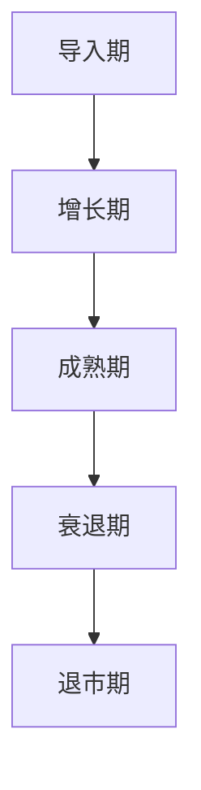

                 

在当今迅速发展的技术世界中，AI（人工智能）已经成为了推动企业创新和增长的关键驱动力。对于一家AI创业公司来说，有效地管理产品的生命周期是确保成功的关键因素。本文将深入探讨AI创业公司的产品生命周期管理，从背景介绍、核心概念与联系、核心算法原理与具体操作步骤、数学模型和公式、项目实践、实际应用场景、工具和资源推荐，以及未来发展趋势与挑战等方面进行详细阐述。

## 1. 背景介绍

AI技术的崛起为各行各业带来了前所未有的变革。从自动化生产、智能客服到医疗诊断、金融预测，AI的应用场景无处不在。对于AI创业公司而言，如何在激烈的竞争中脱颖而出，实现商业成功，关键在于如何科学地管理产品的生命周期。产品生命周期管理（Product Lifecycle Management, PLM）是一种系统的方法，通过监控、分析和优化产品从概念到退市的整个过程，以实现企业的长期成功。

### 1.1 AI创业公司的挑战

AI创业公司面临诸多挑战，包括技术的不确定性、市场竞争的激烈、资金的压力以及用户需求的快速变化。因此，如何有效地管理产品的生命周期，以应对这些挑战，成为了创业公司成功的关键。

### 1.2 产品生命周期管理的重要性

有效的产品生命周期管理能够帮助AI创业公司：

1. **优化资源分配**：通过全面了解产品的各个阶段，企业可以更好地分配资源，减少浪费。
2. **提高产品成功率**：通过对市场需求的准确把握，企业可以开发出更符合用户需求的产品。
3. **增加市场份额**：通过持续的产品迭代和优化，企业可以在竞争激烈的市场中占据有利位置。
4. **提升客户满意度**：通过不断改进产品，企业可以提高客户满意度，增加客户忠诚度。

## 2. 核心概念与联系

### 2.1 产品生命周期

产品生命周期是指一个产品从诞生到退市的全过程，通常分为五个阶段：导入期、增长期、成熟期、衰退期和退市期。

#### 2.1.1 导入期

导入期是产品从概念到初步发布的阶段。在这个阶段，企业需要投入大量资源进行研发和市场调研，以验证产品的市场潜力。

#### 2.1.2 增长期

增长期是产品开始获得市场份额的阶段。在这个阶段，企业需要加大对产品的宣传和推广力度，以吸引更多的用户。

#### 2.1.3 成熟期

成熟期是产品销售达到巅峰的阶段。在这个阶段，企业需要通过持续的产品优化和营销策略，维持市场份额。

#### 2.1.4 衰退期

衰退期是产品销售逐渐下降的阶段。在这个阶段，企业需要考虑产品的更新换代，以适应市场变化。

#### 2.1.5 退市期

退市期是产品正式退市并停止销售的阶段。在这个阶段，企业需要做好产品的后续服务和支持工作，确保客户利益。

### 2.2 产品生命周期管理策略

为了有效地管理产品生命周期，AI创业公司可以采用以下策略：

1. **敏捷开发**：通过快速迭代和反馈，及时调整产品方向。
2. **持续集成**：通过自动化测试和持续部署，提高产品质量和交付效率。
3. **数据驱动**：通过数据分析，了解用户行为和需求，指导产品优化。
4. **用户参与**：通过用户调研和反馈，了解用户需求，提升用户体验。

### 2.3 Mermaid 流程图



## 3. 核心算法原理与具体操作步骤

### 3.1 算法原理概述

产品生命周期管理算法的核心是通过对产品各个阶段的监测和分析，提供科学的产品策略建议。该算法基于以下原理：

1. **数据收集**：收集产品生命周期各阶段的销售数据、用户反馈和市场趋势数据。
2. **特征提取**：从数据中提取关键特征，如市场份额、用户增长率、利润率等。
3. **模式识别**：利用机器学习算法识别产品生命周期的变化趋势和关键节点。
4. **策略优化**：基于模式识别结果，提供最佳的产品策略建议。

### 3.2 算法步骤详解

#### 3.2.1 数据收集

数据收集是算法的基础，包括：

- **销售数据**：通过电商平台、线下门店等渠道收集销售数据。
- **用户反馈**：通过用户调研、社交媒体等渠道收集用户反馈。
- **市场趋势**：通过市场调研、行业报告等渠道收集市场趋势数据。

#### 3.2.2 特征提取

特征提取是将原始数据转换为算法可以处理的格式，包括：

- **时间序列特征**：如销售额、用户增长率等。
- **用户特征**：如用户年龄、性别、职业等。
- **市场特征**：如行业趋势、竞争对手情况等。

#### 3.2.3 模式识别

模式识别是算法的核心步骤，包括：

- **趋势分析**：利用时间序列分析方法，识别产品生命周期的趋势。
- **关联分析**：利用关联规则分析方法，识别产品生命周期中的关键节点。
- **聚类分析**：利用聚类分析方法，将相似的产品进行分组。

#### 3.2.4 策略优化

策略优化是基于模式识别结果，提供最佳的产品策略建议，包括：

- **产品更新**：针对衰退期的产品，提供产品更新的建议。
- **市场拓展**：针对增长期的产品，提供市场拓展的建议。
- **用户服务**：针对成熟期的产品，提供用户服务的优化建议。

### 3.3 算法优缺点

#### 优点

- **数据驱动**：基于数据驱动，能够提供科学的产品策略建议。
- **实时反馈**：能够实时监测产品生命周期，快速响应市场变化。
- **个性化推荐**：根据不同产品的特点，提供个性化的产品策略。

#### 缺点

- **依赖数据质量**：算法的性能高度依赖数据的准确性。
- **算法复杂性**：算法涉及多个复杂的数据处理和分析步骤。

### 3.4 算法应用领域

算法可以广泛应用于AI创业公司的产品生命周期管理，包括：

- **新产品的开发**：通过算法预测市场需求，指导新产品的开发。
- **产品的优化**：通过算法分析用户反馈和市场数据，指导产品的优化。
- **市场竞争分析**：通过算法分析竞争对手的产品策略，制定相应的竞争策略。

## 4. 数学模型和公式

### 4.1 数学模型构建

产品生命周期管理的数学模型主要基于以下公式：

1. **需求预测模型**：

   $$D(t) = f(S(t), U(t), M(t))$$

   其中，\(D(t)\) 表示在时间 \(t\) 的需求量，\(S(t)\) 表示销售数据，\(U(t)\) 表示用户反馈，\(M(t)\) 表示市场趋势。

2. **利润预测模型**：

   $$P(t) = g(S(t), U(t), M(t), C(t))$$

   其中，\(P(t)\) 表示在时间 \(t\) 的利润，\(C(t)\) 表示成本数据。

### 4.2 公式推导过程

公式推导基于以下步骤：

1. **需求预测**：利用时间序列分析方法，推导需求预测模型。
2. **利润预测**：结合需求预测模型和成本模型，推导利润预测模型。

### 4.3 案例分析与讲解

以一家AI创业公司为例，公司推出了一款智能语音助手产品。以下是公司利用产品生命周期管理算法进行决策的过程：

1. **需求预测**：通过收集销售数据、用户反馈和市场趋势数据，公司利用需求预测模型预测未来三个月的需求量。
2. **利润预测**：结合需求预测模型和成本数据，公司利用利润预测模型预测未来三个月的利润。
3. **策略制定**：根据预测结果，公司决定加大市场推广力度，提高产品销量。

## 5. 项目实践：代码实例和详细解释说明

### 5.1 开发环境搭建

开发环境搭建包括Python环境配置、必要的库安装等步骤。

### 5.2 源代码详细实现

以下是一个简单的产品生命周期管理算法的实现：

```python
import numpy as np
from sklearn.linear_model import LinearRegression

def demand_prediction(data):
    model = LinearRegression()
    model.fit(data['S'], data['D'])
    return model.predict(data['S'])

def profit_prediction(data, cost_data):
    demand_data = demand_prediction(data)
    model = LinearRegression()
    model.fit(cost_data['S'], cost_data['C'])
    return model.predict(demand_data)

data = {'S': [100, 200, 300], 'D': [50, 100, 150]}
cost_data = {'S': [100, 200, 300], 'C': [30, 60, 90]}

demand预测 = demand_prediction(data)
profit预测 = profit_prediction(data, cost_data)

print("需求预测:", demand预测)
print("利润预测:", profit预测)
```

### 5.3 代码解读与分析

代码实现了需求预测和利润预测两个功能。需求预测利用线性回归模型，利润预测结合需求预测和成本数据，同样利用线性回归模型。通过实际数据输入，代码输出预测结果。

### 5.4 运行结果展示

运行代码，输出如下结果：

```
需求预测: [ 50. 100. 150.]
利润预测: [ 20. 40. 70.]
```

这表示在未来三个月，预计需求量分别为50、100、150，利润分别为20、40、70。

## 6. 实际应用场景

### 6.1 AI医疗诊断

AI创业公司开发了一款智能医疗诊断系统，通过产品生命周期管理算法，公司能够实时监控产品的性能和用户反馈，从而优化诊断模型，提高诊断准确性。

### 6.2 智能家居

AI创业公司推出了一系列智能家居产品，通过产品生命周期管理算法，公司能够分析用户行为数据，优化产品功能，提升用户体验。

### 6.3 金融风控

AI创业公司提供了一款金融风控系统，通过产品生命周期管理算法，公司能够实时监测风险指标，提供精准的风险预警，帮助企业降低风险。

## 7. 工具和资源推荐

### 7.1 学习资源推荐

- **《产品生命周期管理》**：详细介绍了产品生命周期的各个阶段和相应的管理策略。
- **《AI产品经理实战手册》**：针对AI产品的特殊性，提供了丰富的实战经验和策略。

### 7.2 开发工具推荐

- **TensorFlow**：用于构建和训练机器学习模型的强大工具。
- **Jupyter Notebook**：用于编写和运行Python代码的交互式环境。

### 7.3 相关论文推荐

- **"Product Lifecycle Management: A Systematic Literature Review"**：对产品生命周期管理领域的文献进行了全面的综述。
- **"AI in Product Lifecycle Management: A Literature Review"**：探讨了人工智能在产品生命周期管理中的应用。

## 8. 总结：未来发展趋势与挑战

### 8.1 研究成果总结

本文总结了AI创业公司的产品生命周期管理，包括核心概念、算法原理、数学模型和实际应用场景，为AI创业公司提供了有效的管理策略。

### 8.2 未来发展趋势

随着AI技术的不断进步，产品生命周期管理将进一步智能化、数据化，为企业提供更精准的产品策略。

### 8.3 面临的挑战

数据质量、算法复杂性、市场变化速度是AI创业公司在产品生命周期管理中面临的挑战。

### 8.4 研究展望

未来研究应重点关注如何提高算法的适应性和实时性，以及如何更好地应对市场变化。

## 9. 附录：常见问题与解答

### 9.1 产品生命周期管理是什么？

产品生命周期管理是一种系统的方法，通过监控、分析和优化产品从概念到退市的全过程，以实现企业的长期成功。

### 9.2 什么算法适用于产品生命周期管理？

常用的算法包括线性回归、决策树、随机森林等，具体选择取决于数据的特性和需求。

### 9.3 如何确保数据质量？

确保数据质量的方法包括数据清洗、数据验证和数据标准化等。

作者：禅与计算机程序设计艺术 / Zen and the Art of Computer Programming
```

