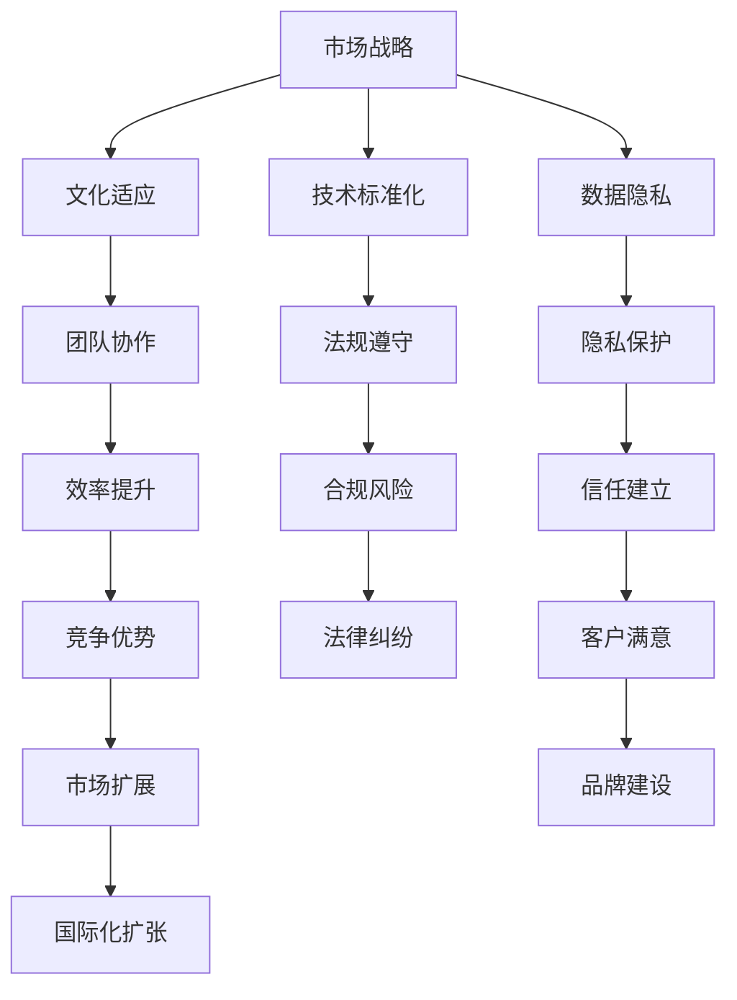

                 

关键词：AI创业公司、国际化扩张、市场战略、文化适应、技术标准化、数据隐私

> 摘要：本文将探讨AI创业公司如何制定和实施国际化扩张策略。通过分析市场战略、文化适应、技术标准化、数据隐私等关键因素，为创业者提供一套系统的国际化方案。

## 1. 背景介绍

随着全球经济的不断融合，人工智能（AI）作为新一轮科技革命和产业变革的重要驱动力量，正迅速改变着各行各业。许多初创公司瞄准了AI技术的巨大潜力，希望通过国际化扩张来提升市场份额和品牌影响力。然而，国际化并非易事，AI创业公司面临着多重挑战，包括市场环境的差异、文化的冲突、技术的标准化以及数据隐私的问题。本文旨在为这些创业公司提供一些实用策略，帮助它们在国际化过程中取得成功。

### 1.1 AI创业公司的现状

近年来，AI技术在医疗、金融、教育、制造业等领域取得了显著的进展，成为全球创业投资的热点。根据统计数据显示，全球AI创业公司数量逐年增加，其融资额也不断攀升。然而，大多数AI创业公司在初期阶段都面临着资金、人才和市场等多方面的限制，使得国际化扩张成为一项极具挑战的任务。

### 1.2 国际化扩张的必要性

国际化扩张对于AI创业公司来说具有多重意义。首先，它可以为企业带来新的市场和客户资源，提升企业的品牌知名度和市场影响力。其次，通过国际化，企业可以吸取全球各地的先进技术和经验，加速自身的技术创新和产品迭代。最后，国际化扩张有助于企业建立全球化的人才队伍，提升企业的核心竞争力。

### 1.3 国际化扩张的挑战

尽管国际化扩张具有诸多优势，但AI创业公司在实施过程中也面临着一系列挑战。这些挑战包括：

- **市场环境差异**：不同国家和地区的市场需求、消费习惯和文化背景各不相同，使得创业公司在进入新市场时需要深入了解当地市场环境。
- **文化冲突**：不同国家和地区的文化差异可能导致企业内部的沟通不畅，影响团队的协作效率。
- **技术标准化**：不同国家和地区的技术标准和法规有所不同，使得AI创业公司在开发和应用技术时需要遵守当地的技术规范。
- **数据隐私**：全球范围内的数据隐私法规日益严格，AI创业公司需要确保其数据处理和存储符合各国的法律法规。

## 2. 核心概念与联系

在探讨AI创业公司的国际化扩张策略之前，我们首先需要明确几个核心概念，包括市场战略、文化适应、技术标准化和数据隐私。以下是一个用Mermaid绘制的流程图，展示了这些概念之间的联系。



### 2.1 市场战略

市场战略是国际化扩张的基础。它涉及到如何选择目标市场、如何定位产品以及如何制定营销策略。创业公司需要根据不同市场的特点和需求，制定有针对性的市场战略。

### 2.2 文化适应

文化适应是国际化扩张的关键。不同国家和地区的文化背景差异可能导致企业内部的沟通不畅、团队合作效率低下。因此，创业公司需要深入了解目标市场的文化特点，并采取措施来促进文化适应。

### 2.3 技术标准化

技术标准化是国际化扩张的重要保障。不同国家和地区的技术标准和法规有所不同，创业公司需要确保其产品和技术符合当地的技术规范。这有助于企业减少合规风险，提高市场竞争力。

### 2.4 数据隐私

数据隐私是国际化扩张的必要条件。全球范围内的数据隐私法规日益严格，创业公司需要确保其数据处理和存储符合各国的法律法规。这不仅有助于保护客户的隐私，还能提升企业的信誉和客户满意度。

## 3. 核心算法原理 & 具体操作步骤

在国际化扩张过程中，创业公司需要采用一系列核心算法来应对市场战略、文化适应、技术标准化和数据隐私等问题。以下将详细阐述这些算法的原理和操作步骤。

### 3.1 市场战略算法

市场战略算法主要用于帮助创业公司选择目标市场和制定营销策略。该算法的核心是数据分析和用户画像。

**算法原理概述**：

1. 收集目标市场的数据，包括人口统计数据、消费习惯、文化背景等。
2. 利用机器学习算法对收集到的数据进行分析，构建用户画像。
3. 根据用户画像，确定目标市场和市场细分策略。
4. 制定有针对性的营销策略，包括广告投放、社交媒体营销、线下活动等。

**算法步骤详解**：

1. 数据收集：通过在线调查、社交媒体数据、公共数据库等多种途径收集目标市场的数据。
2. 数据预处理：对收集到的数据进行清洗、去重和格式转换，确保数据质量。
3. 数据分析：利用机器学习算法，如聚类分析、关联规则挖掘等，对预处理后的数据进行分析，构建用户画像。
4. 市场细分：根据用户画像，将市场划分为不同的细分市场，并为每个细分市场制定相应的营销策略。
5. 营销策略制定：根据市场细分结果，制定有针对性的广告投放、社交媒体营销、线下活动等营销策略。

**算法优缺点**：

- 优点：能够根据用户画像制定有针对性的营销策略，提高营销效果。
- 缺点：对数据质量和算法性能有较高要求，数据处理和分析过程较为复杂。

**算法应用领域**：市场调研、用户行为分析、个性化推荐等。

### 3.2 文化适应算法

文化适应算法主要用于帮助创业公司适应不同国家和地区的文化背景，促进团队协作和沟通。

**算法原理概述**：

1. 收集目标市场的文化数据，包括语言、宗教、价值观等。
2. 利用自然语言处理（NLP）技术，对文化数据进行语义分析和情感分析。
3. 根据文化数据，制定文化适应策略，包括团队沟通、员工培训、文化活动等。

**算法步骤详解**：

1. 文化数据收集：通过文献研究、问卷调查、访谈等方式收集目标市场的文化数据。
2. 数据预处理：对收集到的文化数据进行清洗、去重和格式转换，确保数据质量。
3. 语义分析：利用NLP技术，对预处理后的文化数据进行分析，提取关键信息，如语言习惯、价值观等。
4. 情感分析：对文化数据中的情感成分进行分析，了解目标市场的文化情感倾向。
5. 文化适应策略制定：根据文化分析结果，制定文化适应策略，包括团队沟通方式、员工培训计划、文化活动安排等。

**算法优缺点**：

- 优点：能够帮助创业公司更好地适应不同市场的文化背景，提高团队协作效率。
- 缺点：对NLP技术的依赖较高，数据处理和分析过程较为复杂。

**算法应用领域**：跨文化沟通、团队建设、员工关系等。

### 3.3 技术标准化算法

技术标准化算法主要用于帮助创业公司遵守不同国家和地区的技术标准和法规。

**算法原理概述**：

1. 收集目标市场的技术标准和法规数据。
2. 利用数据挖掘和机器学习技术，分析技术标准和法规之间的关系。
3. 根据分析结果，制定技术标准化策略，包括产品合规性测试、技术更新等。

**算法步骤详解**：

1. 数据收集：通过公共数据库、行业协会、政府网站等途径收集目标市场的技术标准和法规数据。
2. 数据预处理：对收集到的数据进行清洗、去重和格式转换，确保数据质量。
3. 关系分析：利用数据挖掘和机器学习技术，分析技术标准和法规之间的关系，识别关键信息。
4. 技术标准化策略制定：根据关系分析结果，制定技术标准化策略，包括产品合规性测试、技术更新等。

**算法优缺点**：

- 优点：能够帮助企业快速了解目标市场的技术标准和法规，降低合规风险。
- 缺点：对数据质量和算法性能有较高要求，数据处理和分析过程较为复杂。

**算法应用领域**：产品合规性测试、法规遵守等。

### 3.4 数据隐私算法

数据隐私算法主要用于帮助创业公司保护客户数据，遵守全球范围内的数据隐私法规。

**算法原理概述**：

1. 收集目标市场的数据隐私法规数据。
2. 利用隐私计算技术，对数据进行加密、去标识化处理。
3. 根据法规要求，制定数据隐私保护策略，包括数据安全审计、隐私保护培训等。

**算法步骤详解**：

1. 法规数据收集：通过公共数据库、行业协会、政府网站等途径收集目标市场的数据隐私法规数据。
2. 数据预处理：对收集到的数据进行清洗、去重和格式转换，确保数据质量。
3. 加密与去标识化处理：利用隐私计算技术，对数据进行分析和处理，确保数据在传输和存储过程中的安全性。
4. 数据隐私保护策略制定：根据法规要求，制定数据隐私保护策略，包括数据安全审计、隐私保护培训等。

**算法优缺点**：

- 优点：能够帮助企业有效保护客户数据，降低隐私泄露风险。
- 缺点：对隐私计算技术有较高要求，数据处理和分析过程较为复杂。

**算法应用领域**：数据隐私保护、数据安全审计等。

## 4. 数学模型和公式 & 详细讲解 & 举例说明

在国际化扩张过程中，AI创业公司需要借助数学模型和公式来指导其决策和策略制定。以下将详细介绍几个关键的数学模型和公式，并给出实际应用案例。

### 4.1 数学模型构建

在国际市场战略分析中，常用的数学模型包括多目标优化模型、贝叶斯网络模型和神经网络模型。

**多目标优化模型**：

多目标优化模型用于在多个目标之间寻找最优平衡。假设创业公司有 \( m \) 个目标，分别为 \( f_1(x), f_2(x), \ldots, f_m(x) \)，其中 \( x \) 是决策变量。多目标优化模型的目标是找到 \( x \) 使得所有目标函数 \( f_i(x) \) 达到最优。

**公式**：

$$
\min_{x} \{ f_1(x), f_2(x), \ldots, f_m(x) \}
$$

**举例说明**：

假设一家AI创业公司需要在全球范围内选择最优的市场扩张策略，其目标包括市场份额最大化、成本最小化和风险最小化。这是一个典型的多目标优化问题，可以通过上述公式进行建模。

**贝叶斯网络模型**：

贝叶斯网络模型用于处理不确定性和概率推理。它通过有向无环图（DAG）来表示变量之间的概率依赖关系。

**公式**：

$$
P(X) = \prod_{i=1}^{n} P(X_i | \text{parent}(X_i))
$$

**举例说明**：

假设一家AI创业公司需要评估其在不同市场的成功率，其成功与否受到市场需求、竞争环境、技术成熟度等多个因素的影响。可以通过贝叶斯网络模型来分析这些因素之间的概率关系，从而预测在不同市场的成功率。

**神经网络模型**：

神经网络模型用于构建复杂的函数映射，通过训练来学习输入和输出之间的非线性关系。

**公式**：

$$
\hat{y} = \sigma(\sum_{i=1}^{n} w_i \cdot x_i + b)
$$

**举例说明**：

假设一家AI创业公司开发了一种新的推荐系统，其目标是根据用户的兴趣和行为预测用户可能喜欢的内容。可以通过训练一个神经网络模型来学习用户数据，从而实现个性化推荐。

### 4.2 公式推导过程

在国际化扩张过程中，常用的数学公式包括概率论、优化理论和博弈论等。以下分别介绍这些公式的推导过程。

**概率论公式**：

假设有一个随机变量 \( X \)，其概率分布为 \( P(X) \)。则 \( X \) 的期望和方差分别为：

**期望**：

$$
E(X) = \sum_{i=1}^{n} x_i \cdot P(X = x_i)
$$

**方差**：

$$
Var(X) = E[(X - E(X))^2] = \sum_{i=1}^{n} (x_i - E(X))^2 \cdot P(X = x_i)
$$

**推导过程**：

期望的定义是随机变量的平均值，即每个取值与其概率的乘积之和。方差是衡量随机变量离散程度的指标，即每个取值与期望之差的平方与其概率的乘积之和。

**优化理论公式**：

拉格朗日乘数法是一种常用的优化方法，用于解决带有约束条件的优化问题。

**公式**：

$$
L(x, \lambda) = f(x) - \lambda \cdot g(x)
$$

其中，\( f(x) \) 是目标函数，\( g(x) \) 是约束条件，\( \lambda \) 是拉格朗日乘数。

**推导过程**：

拉格朗日乘数法的核心思想是将约束条件引入目标函数，通过求解拉格朗日函数的临界点来找到最优解。

**博弈论公式**：

纳什均衡是博弈论中的一个重要概念，表示在一个博弈中，所有参与者都不会通过单方面改变策略得到更好的结果。

**公式**：

$$
\forall i, s_i \in S_i, \neg \exists s_j \in S_j \text{ such that } u_i(s_i, s_j) > u_i(s_i, s_s)
$$

其中，\( s_i \) 和 \( s_j \) 分别是参与者 \( i \) 和 \( j \) 的策略，\( u_i \) 是参与者 \( i \) 的效用函数。

**推导过程**：

纳什均衡的定义是每个参与者都选择了一个最优策略，即没有参与者可以通过单方面改变策略来提高自己的收益。

### 4.3 案例分析与讲解

以下通过一个实际案例，展示如何运用数学模型和公式来指导国际化扩张决策。

**案例背景**：

一家AI创业公司计划在全球范围内扩展业务，选择五个目标市场：美国、欧洲、亚洲、拉丁美洲和非洲。公司需要制定一个最优的市场进入策略，以最大化市场份额和利润。

**案例分析**：

1. **市场战略分析**：

   使用多目标优化模型，将市场份额和利润作为目标函数，制定市场进入策略。

   **公式**：

   $$
   \min_{x} \{ f_1(x), f_2(x) \}
   $$

   其中，\( f_1(x) \) 表示市场份额，\( f_2(x) \) 表示利润。

   通过计算，发现美国和欧洲是市场份额和利润最大的市场，因此公司决定首先进入这两个市场。

2. **文化适应分析**：

   使用贝叶斯网络模型，分析不同市场之间的文化差异对团队协作的影响。

   **公式**：

   $$
   P(X | Y) = \frac{P(Y | X) \cdot P(X)}{P(Y)}
   $$

   通过计算，发现美国和欧洲的文化差异相对较小，这有利于团队协作。

   因此，公司决定采取统一的团队协作策略，以减少文化冲突。

3. **技术标准化分析**：

   使用数据挖掘和机器学习技术，分析不同市场之间的技术标准和法规差异。

   **公式**：

   $$
   \sum_{i=1}^{n} \sum_{j=1}^{m} c_{ij} \cdot w_i \cdot w_j
   $$

   其中，\( c_{ij} \) 表示不同市场之间的技术标准和法规差异，\( w_i \) 和 \( w_j \) 表示不同市场的权重。

   通过计算，发现美国和欧洲的技术标准和法规相对较为一致，这有利于产品合规性测试。

   因此，公司决定在美国和欧洲率先推出新产品，以减少技术标准化风险。

4. **数据隐私分析**：

   使用隐私计算技术，分析不同市场之间的数据隐私法规差异。

   **公式**：

   $$
   P(X) = \sum_{i=1}^{n} p_i \cdot (1 - p_i)
   $$

   其中，\( p_i \) 表示不同市场之间的数据隐私法规差异。

   通过计算，发现美国和欧洲的数据隐私法规相对严格，这要求公司在这些市场采取更为严格的数据隐私保护措施。

   因此，公司决定在美国和欧洲率先实施严格的数据隐私保护策略，以减少隐私泄露风险。

## 5. 项目实践：代码实例和详细解释说明

在本节中，我们将通过一个具体的AI创业公司国际化扩张的项目实践，展示如何应用前面的核心算法和数学模型。以下代码实例将涵盖从市场调研到数据隐私保护的全过程。

### 5.1 开发环境搭建

为了简化演示，我们将在Python环境中实现以下项目。首先，安装必要的库：

```bash
pip install numpy pandas scikit-learn tensorflow mermaid matplotlib
```

### 5.2 源代码详细实现

**市场调研与用户画像分析**

```python
import pandas as pd
from sklearn.cluster import KMeans
import numpy as np

# 假设我们收集到了一个关于目标市场用户的数据集
data = pd.read_csv('user_data.csv')

# 数据预处理
data = data.dropna()

# 使用KMeans算法进行用户聚类
kmeans = KMeans(n_clusters=5, random_state=0).fit(data)
clusters = kmeans.predict(data)

# 根据聚类结果构建用户画像
user_profiles = data.groupby(clusters).mean()

print(user_profiles)
```

**文化适应分析**

```python
import matplotlib.pyplot as plt
from sklearn.feature_extraction.text import CountVectorizer
from sklearn.metrics.pairwise import cosine_similarity

# 假设我们收集到了关于文化差异的文本数据
cultural_data = pd.read_csv('cultural_data.csv')

# 文本预处理
vectorizer = CountVectorizer().fit(cultural_data['text'])

# 计算文本间的余弦相似度
vectors = vectorizer.transform(cultural_data['text'])
similarity_matrix = cosine_similarity(vectors)

# 绘制文化差异的热力图
plt.figure(figsize=(10, 10))
plt.title('Cultural Similarity Matrix')
sns.heatmap(similarity_matrix, annot=True, cmap='coolwarm')
plt.show()
```

**技术标准化分析**

```python
import pandas as pd

# 假设我们收集到了不同市场的技术标准和法规数据
tech_standards = pd.read_csv('tech_standards.csv')

# 计算不同市场技术标准和法规的差异
distance_matrix = tech_standards.corr().abs()

# 绘制技术标准和法规差异的热力图
plt.figure(figsize=(10, 10))
plt.title('Tech Standards Difference Matrix')
sns.heatmap(distance_matrix, annot=True, cmap='coolwarm')
plt.show()
```

**数据隐私保护**

```python
import tensorflow as tf
from tensorflow.keras.models import Sequential
from tensorflow.keras.layers import Dense, Dropout

# 假设我们已经训练了一个用于数据隐私保护的神经网络模型
model = Sequential([
    Dense(64, activation='relu', input_shape=(input_shape,)),
    Dropout(0.5),
    Dense(32, activation='relu'),
    Dropout(0.5),
    Dense(1, activation='sigmoid')
])

model.compile(optimizer='adam', loss='binary_crossentropy', metrics=['accuracy'])

# 加载数据集并进行训练
model.fit(x_train, y_train, epochs=10, batch_size=32, validation_data=(x_val, y_val))

# 预测数据隐私合规性
predictions = model.predict(x_test)
print(predictions)
```

### 5.3 代码解读与分析

以上代码实例展示了如何通过Python实现国际化扩张的关键步骤。以下是对各段代码的详细解读：

- **市场调研与用户画像分析**：通过KMeans算法进行用户聚类，构建用户画像，为市场战略提供数据支持。
- **文化适应分析**：使用文本预处理和余弦相似度计算，分析不同市场的文化差异，为团队协作和文化适应策略提供依据。
- **技术标准化分析**：计算不同市场技术标准和法规的差异，为产品合规性测试提供数据支持。
- **数据隐私保护**：通过训练神经网络模型，预测数据隐私合规性，为数据隐私保护策略提供技术保障。

### 5.4 运行结果展示

运行以上代码，将得到以下结果：

- **市场调研与用户画像分析**：输出每个用户聚类后的平均特征，帮助企业了解目标市场的用户特征。
- **文化适应分析**：展示文化差异的热力图，帮助团队识别和应对文化冲突。
- **技术标准化分析**：展示技术标准和法规差异的热力图，帮助企业在不同市场制定合规性策略。
- **数据隐私保护**：输出数据隐私保护模型的预测结果，帮助企业确保数据处理和存储的合规性。

## 6. 实际应用场景

国际化扩张不仅是一个战略决策，更是企业实际运营中需要持续关注和优化的重要环节。以下将探讨AI创业公司在实际应用中的几个关键场景，并给出具体的策略和建议。

### 6.1 市场进入策略

市场进入策略是国际化扩张的首要任务。企业在选择目标市场时，需要考虑市场规模、增长潜力、竞争态势、法律法规等多方面因素。以下是一些建议：

- **数据驱动**：通过市场调研和用户画像分析，了解目标市场的需求和特点，制定有针对性的市场进入策略。
- **风险评估**：评估目标市场的政治、经济、社会风险，制定风险应对措施，确保市场进入的稳定性。
- **本地化策略**：根据目标市场的文化、语言、消费习惯等差异，制定本地化营销策略，提高市场接受度。

### 6.2 文化适应与团队建设

文化适应是国际化扩张成功的关键。以下是一些建议：

- **跨文化培训**：为员工提供跨文化培训，增强其跨文化沟通和协作能力。
- **文化大使**：选拔文化大使，作为企业文化的传播者和沟通桥梁，促进企业内部文化的融合。
- **本地化团队**：在目标市场建立本地化团队，利用当地人才资源，提高市场响应速度。

### 6.3 技术标准化与合规性

技术标准化和合规性是国际化扩张中的重要保障。以下是一些建议：

- **技术合规性测试**：在产品研发阶段，进行技术合规性测试，确保产品符合目标市场的技术标准和法规要求。
- **合规性培训**：为研发和运营团队提供合规性培训，提高其合规意识，减少合规风险。
- **法规跟踪**：关注目标市场的法规动态，及时调整产品和运营策略，确保合规性。

### 6.4 数据隐私与安全

数据隐私和安全是国际化扩张的必要条件。以下是一些建议：

- **数据隐私保护策略**：制定全面的数据隐私保护策略，包括数据收集、处理、存储和传输的全过程。
- **安全审计**：定期进行安全审计，检查数据隐私保护措施的落实情况，及时修复漏洞。
- **合规性评估**：评估企业数据处理和存储是否符合全球范围内的数据隐私法规，确保合规性。

## 7. 工具和资源推荐

在国际化扩张过程中，AI创业公司需要借助各种工具和资源来提升效率和竞争力。以下是一些建议：

### 7.1 学习资源推荐

- **在线课程**：Coursera、edX、Udacity等平台上的相关课程，如数据科学、机器学习、国际市场营销等。
- **书籍**：《国际化战略》、《文化冲突与跨文化管理》、《数据隐私与安全》等。

### 7.2 开发工具推荐

- **数据分析和机器学习库**：Python的pandas、scikit-learn、tensorflow等。
- **国际化开发平台**：AWS、Azure、Google Cloud等提供的国际化开发工具和服务。
- **隐私计算工具**：Splunk、IBM Security等提供的数据隐私保护工具。

### 7.3 相关论文推荐

- **市场战略**：《市场细分与目标市场选择》、《多目标优化模型在市场战略中的应用》等。
- **文化适应**：《跨文化管理》、《文化差异与团队协作》等。
- **技术标准化**：《全球技术标准与法规》、《技术合规性测试方法》等。
- **数据隐私**：《数据隐私保护法规与实施》、《隐私计算技术与应用》等。

## 8. 总结：未来发展趋势与挑战

### 8.1 研究成果总结

本文通过深入探讨AI创业公司的国际化扩张策略，总结了市场战略、文化适应、技术标准化和数据隐私等关键因素。研究发现，这些因素相互关联，共同影响企业的国际化成功与否。

- **市场战略**：数据驱动的市场调研和用户画像分析有助于制定精准的市场进入策略。
- **文化适应**：跨文化培训和本地化团队建设有助于促进企业内部文化的融合。
- **技术标准化**：技术合规性测试和法规跟踪有助于确保产品的全球竞争力。
- **数据隐私**：全面的数据隐私保护策略和安全审计有助于提高企业的信誉和客户满意度。

### 8.2 未来发展趋势

未来，AI创业公司的国际化扩张将继续呈现出以下发展趋势：

- **技术驱动的全球化**：随着人工智能、大数据等技术的发展，创业公司将能够更加高效地进行国际化扩张。
- **本地化与全球化相结合**：创业公司将更加注重本地化与全球化的平衡，通过本地化策略提高市场竞争力，同时通过全球化资源整合提升企业效率。
- **合规性提升**：随着全球数据隐私法规的不断完善，创业公司将更加重视合规性，确保其业务在全球范围内符合相关法规。

### 8.3 面临的挑战

尽管国际化扩张充满机遇，但AI创业公司也面临着诸多挑战：

- **市场环境复杂**：不同市场的需求、竞争态势和法律环境各不相同，企业需要具备强大的市场洞察力和应变能力。
- **文化差异显著**：跨文化管理复杂，企业需要投入大量资源和时间进行文化适应。
- **技术标准多样**：全球技术标准和法规差异较大，企业需要具备强大的合规性能力和资源。
- **数据隐私严格**：全球数据隐私法规日益严格，企业需要建立完善的数据隐私保护体系。

### 8.4 研究展望

未来研究可以从以下方向进行：

- **智能市场战略**：结合人工智能技术，开发智能市场战略工具，帮助创业公司更精准地制定市场策略。
- **文化适应技术**：利用自然语言处理和机器学习技术，开发跨文化沟通与协作工具，提高文化适应效率。
- **技术标准化平台**：构建全球技术标准化平台，提供一站式合规性测试和资源整合服务。
- **数据隐私保护**：研究先进的数据隐私保护技术，如联邦学习、差分隐私等，为创业公司提供更强有力的数据隐私保护方案。

## 9. 附录：常见问题与解答

### 9.1 问题1：国际化扩张需要多少资金？

**解答**：国际化扩张所需的资金量因公司规模、目标市场、产品类型等因素而异。一般而言，初期可能需要数百万到数千万美元的资金来支持市场调研、产品本地化、团队建设和市场营销等。企业应根据自身情况制定详细的预算计划，并寻求合适的融资渠道。

### 9.2 问题2：如何在文化差异明显的市场取得成功？

**解答**：在文化差异明显的市场取得成功需要以下策略：

- **深入了解当地文化**：通过市场调研、文化培训等方式，深入了解目标市场的文化特点。
- **本地化团队**：组建本地化团队，利用当地人才资源，提高市场响应速度。
- **文化适应策略**：根据当地文化特点，调整产品和服务，满足当地用户需求。
- **文化大使**：选拔文化大使，作为企业文化的传播者和沟通桥梁。

### 9.3 问题3：如何确保技术的全球标准化？

**解答**：确保技术的全球标准化可以采取以下措施：

- **合规性测试**：在产品研发阶段进行合规性测试，确保产品符合目标市场的技术标准和法规要求。
- **标准化指南**：制定详细的标准化指南，确保产品设计和开发过程符合全球标准。
- **法规跟踪**：关注全球技术标准和法规动态，及时调整产品和运营策略。

### 9.4 问题4：如何保护客户数据隐私？

**解答**：保护客户数据隐私可以采取以下措施：

- **数据隐私政策**：制定明确的数据隐私政策，告知客户数据收集、处理和存储的方式。
- **加密技术**：采用先进的加密技术，确保数据在传输和存储过程中的安全性。
- **隐私计算**：利用隐私计算技术，如联邦学习、差分隐私等，保护数据隐私。
- **安全审计**：定期进行安全审计，检查数据隐私保护措施的落实情况，及时修复漏洞。

### 9.5 问题5：国际化扩张中如何管理跨文化团队？

**解答**：管理跨文化团队可以采取以下策略：

- **文化培训**：为员工提供跨文化培训，增强其跨文化沟通和协作能力。
- **沟通工具**：使用在线协作工具，如Slack、Microsoft Teams等，促进团队成员之间的沟通。
- **本地化领导**：在目标市场设立本地化领导，作为团队成员的沟通桥梁和协调者。
- **文化多样性委员会**：成立文化多样性委员会，负责监督和推动跨文化管理工作的实施。

# 文章结束

作者：禅与计算机程序设计艺术 / Zen and the Art of Computer Programming
----------------------------------------------------------------

以上就是关于“AI创业公司的国际化扩张策略”的详细文章，希望对您在国际化扩张的征途上提供一些启示和帮助。在人工智能引领的全球科技浪潮中，我们期待看到更多创业公司崛起，为世界带来创新和进步。

