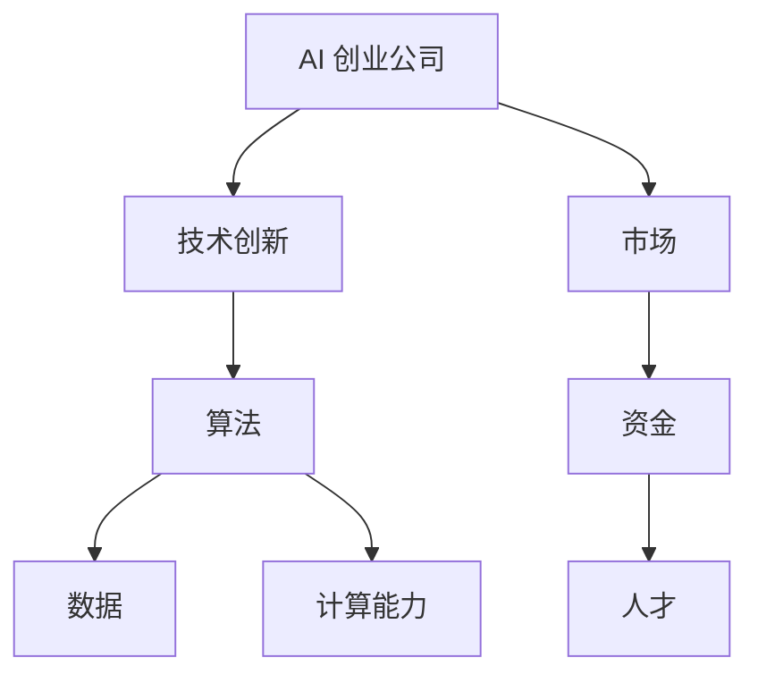

                 

关键词：AI 创业、技术创新、管理、算法、数学模型、应用场景、未来展望

摘要：本文旨在探讨 AI 创业公司在技术创新管理方面的重要性和挑战。文章首先介绍了 AI 创业公司的背景和现状，然后深入分析了技术创新的核心概念和原理，探讨了核心算法的优缺点及应用领域。接着，文章详细讲解了数学模型的构建和公式推导过程，并通过实际项目实践展示了算法的具体实现。最后，文章讨论了 AI 创业公司的实际应用场景、未来应用展望以及工具和资源的推荐，并总结了未来发展趋势与面临的挑战。

## 1. 背景介绍

随着人工智能技术的飞速发展，越来越多的创业者开始投身于 AI 创业领域。AI 创业公司不仅为传统行业带来了创新和变革，也在推动人工智能技术的进步和应用。然而，技术创新管理对于 AI 创业公司来说至关重要。一方面，技术创新是 AI 创业公司发展的核心驱动力；另一方面，技术创新管理是确保公司成功的关键因素。

### 1.1 AI 创业的现状

AI 创业公司主要分布在人工智能的核心领域，如计算机视觉、自然语言处理、机器学习等。根据市场研究公司的数据，全球 AI 创业公司数量在过去几年中呈现快速增长态势。这些公司不仅获得了巨额的投资，还吸引了大量优秀的研发人才。同时，AI 创业公司在技术创新方面也取得了显著成果，推出了一系列具有颠覆性的技术和产品。

### 1.2 技术创新的重要性

技术创新是 AI 创业公司发展的核心驱动力。首先，技术创新能够帮助公司抢占市场先机，提升竞争力。其次，技术创新能够推动公司的持续发展，为公司带来持续的利润增长。此外，技术创新还能够提升公司的品牌价值，增强公司的行业影响力。

### 1.3 技术创新管理的挑战

尽管技术创新对 AI 创业公司至关重要，但技术创新管理也面临着诸多挑战。首先，技术创新需要大量的资金投入和人才储备，这对于初创公司来说是一个巨大的挑战。其次，技术创新的过程复杂且充满不确定性，如何确保技术创新的成功是 AI 创业公司面临的一个难题。此外，市场竞争的加剧也使得 AI 创业公司需要在技术创新管理方面不断优化和改进。

## 2. 核心概念与联系

在探讨 AI 创业公司的技术创新管理之前，我们需要明确一些核心概念和原理，以便更好地理解和应用技术创新。以下是几个关键概念及其相互联系：

### 2.1 人工智能

人工智能（AI）是指计算机模拟人类智能的技术。它包括机器学习、深度学习、计算机视觉、自然语言处理等多个子领域。人工智能技术通过数据、算法和计算能力实现对人类智能的模拟和扩展。

### 2.2 算法

算法是解决问题的一系列步骤和规则。在 AI 领域，算法是实现人工智能功能的核心。常见的 AI 算法包括线性回归、决策树、神经网络等。

### 2.3 数据

数据是 AI 技术的基础。高质量的数据能够帮助 AI 模型更好地学习和预测。数据收集、处理和分析是 AI 技术应用的重要环节。

### 2.4 计算能力

计算能力是支撑 AI 技术发展的重要基础设施。随着硬件技术的进步，计算能力不断提高，为 AI 技术的创新和应用提供了强大支持。

### 2.5 Mermaid 流程图

以下是一个描述 AI 创业公司技术创新管理的 Mermaid 流程图：



## 3. 核心算法原理 & 具体操作步骤

### 3.1 算法原理概述

在 AI 领域，常见的核心算法包括线性回归、决策树、神经网络等。以下简要介绍这些算法的基本原理：

#### 3.1.1 线性回归

线性回归是一种用于预测连续值的算法。其基本原理是通过找到一条最佳拟合直线，将自变量和因变量之间的关系表达出来。线性回归算法的公式如下：

$$
y = w_0 + w_1 \cdot x
$$

其中，$y$ 是因变量，$x$ 是自变量，$w_0$ 和 $w_1$ 是模型的参数。

#### 3.1.2 决策树

决策树是一种用于分类和回归的算法。其基本原理是通过一系列的判断条件将数据划分为不同的分支，最终得到一个预测结果。决策树的构建过程包括以下几个步骤：

1. 选择最佳分裂点：选择能够最大化信息增益的属性作为分裂点。
2. 切割数据集：根据分裂点将数据集划分为两个子集。
3. 递归构建树：对每个子集重复以上步骤，直到满足停止条件。

#### 3.1.3 神经网络

神经网络是一种模仿人脑结构和功能的算法。其基本原理是通过多层神经元节点对输入数据进行处理和变换，最终输出结果。神经网络的主要组成部分包括：

1. 输入层：接收外部输入数据。
2. 隐藏层：对输入数据进行处理和变换。
3. 输出层：输出最终结果。

神经网络的训练过程主要包括以下几个步骤：

1. 前向传播：将输入数据传递到神经网络的每一层，计算出输出结果。
2. 计算误差：将输出结果与实际值进行比较，计算误差。
3. 反向传播：将误差传递回网络的每一层，更新网络参数。

### 3.2 算法步骤详解

以下以神经网络为例，详细讲解算法的具体操作步骤：

#### 3.2.1 数据准备

1. 收集数据：从不同渠道获取大量的输入数据。
2. 数据预处理：对数据进行清洗、归一化等处理，使其适合输入神经网络。

#### 3.2.2 构建神经网络

1. 确定网络结构：包括输入层、隐藏层和输出层的神经元数量。
2. 初始化参数：随机初始化网络参数，如权重和偏置。

#### 3.2.3 训练神经网络

1. 前向传播：将输入数据传递到神经网络的每一层，计算出输出结果。
2. 计算误差：将输出结果与实际值进行比较，计算误差。
3. 反向传播：将误差传递回网络的每一层，更新网络参数。

#### 3.2.4 评估神经网络

1. 使用验证集评估神经网络性能，调整参数以优化模型。
2. 在测试集上评估最终模型的性能，确保其具备良好的泛化能力。

### 3.3 算法优缺点

#### 优点

1. 神经网络具有强大的表示能力，能够处理复杂的数据模式。
2. 神经网络可以自适应调整参数，适应不同的数据集。
3. 神经网络在许多领域都取得了显著的成果，如图像识别、语音识别等。

#### 缺点

1. 神经网络训练过程复杂，需要大量的计算资源和时间。
2. 神经网络对数据质量和规模有较高的要求，否则可能导致过拟合。
3. 神经网络的结构和参数调整具有一定的经验性，缺乏严格的数学理论基础。

### 3.4 算法应用领域

神经网络在 AI 领域具有广泛的应用，如：

1. 图像识别：用于识别图像中的物体、场景等。
2. 语音识别：将语音信号转换为文字或命令。
3. 自然语言处理：用于文本分类、机器翻译等。
4. 推荐系统：根据用户历史行为推荐相关商品或内容。
5. 游戏AI：用于实现智能化的游戏对手。

## 4. 数学模型和公式 & 详细讲解 & 举例说明

在 AI 技术中，数学模型和公式是构建算法和实现智能化的基础。以下我们将详细讲解神经网络中的数学模型和公式，并通过一个具体的例子进行说明。

### 4.1 数学模型构建

神经网络的数学模型主要包括以下几个方面：

1. **激活函数**：激活函数用于定义神经元之间的非线性关系，常见的激活函数有 Sigmoid、ReLU 等。
2. **前向传播**：前向传播是指将输入数据通过网络的每层神经元，逐层计算出输出结果的过程。
3. **反向传播**：反向传播是指将输出结果与实际值进行比较，计算误差，并反向更新网络参数的过程。
4. **损失函数**：损失函数用于度量输出结果与实际值之间的差距，常见的损失函数有均方误差（MSE）、交叉熵（Cross Entropy）等。

### 4.2 公式推导过程

#### 4.2.1 激活函数

以 Sigmoid 激活函数为例，其公式如下：

$$
\sigma(x) = \frac{1}{1 + e^{-x}}
$$

#### 4.2.2 前向传播

前向传播的主要公式如下：

$$
z_l = \sum_{j} w_{lj} \cdot a_{l-1,j} + b_l \\
a_l = \sigma(z_l)
$$

其中，$z_l$ 表示第 $l$ 层的线性输出，$a_{l-1,j}$ 表示第 $l-1$ 层的第 $j$ 个神经元输出，$w_{lj}$ 表示第 $l$ 层的第 $l$ 个神经元到第 $j$ 个神经元的权重，$b_l$ 表示第 $l$ 层的偏置。

#### 4.2.3 反向传播

反向传播的主要公式如下：

$$
\delta_l = \frac{\partial L}{\partial z_l} \cdot \sigma'(z_l) \\
\delta_{l-1}^{(i)} = \delta_l \cdot w_{l,i} \\
\theta_j := \theta_j - \alpha \cdot \frac{\partial J}{\partial \theta_j} \\
\theta_j := \theta_j - \alpha \cdot \frac{\partial J}{\partial \theta_j}
$$

其中，$\delta_l$ 表示第 $l$ 层的误差项，$\sigma'(z_l)$ 表示 Sigmoid 激活函数的导数，$L$ 表示损失函数，$\theta_j$ 表示权重，$\alpha$ 表示学习率。

#### 4.2.4 损失函数

均方误差（MSE）的公式如下：

$$
MSE = \frac{1}{2} \sum_{i=1}^m (y_i - \hat{y}_i)^2
$$

其中，$y_i$ 表示实际值，$\hat{y}_i$ 表示预测值，$m$ 表示样本数量。

### 4.3 案例分析与讲解

#### 4.3.1 案例背景

假设我们要构建一个简单的神经网络模型，用于对输入数据进行分类。数据集包含 100 个样本，每个样本有 10 个特征，标签为 0 或 1。我们需要使用神经网络模型对这 100 个样本进行分类。

#### 4.3.2 模型构建

1. **输入层**：10 个神经元，分别表示 10 个特征。
2. **隐藏层**：5 个神经元，采用 ReLU 激活函数。
3. **输出层**：2 个神经元，采用 Softmax 激活函数，用于输出分类概率。

#### 4.3.3 模型训练

1. **前向传播**：输入数据通过输入层传递到隐藏层，再传递到输出层，计算出预测概率。
2. **计算损失**：使用均方误差（MSE）计算预测概率与实际标签之间的差距。
3. **反向传播**：计算输出层的误差，并反向传递到隐藏层，更新权重和偏置。

#### 4.3.4 模型评估

1. **验证集评估**：使用验证集评估模型性能，调整参数以优化模型。
2. **测试集评估**：使用测试集评估最终模型性能，确保其具备良好的泛化能力。

## 5. 项目实践：代码实例和详细解释说明

### 5.1 开发环境搭建

为了实现神经网络模型，我们需要搭建一个合适的开发环境。以下是一个简单的开发环境搭建步骤：

1. 安装 Python（推荐版本为 3.7 或以上）。
2. 安装 PyTorch，一种流行的深度学习框架。
3. 安装 Jupyter Notebook，一种用于编写和运行 Python 代码的交互式环境。

### 5.2 源代码详细实现

以下是使用 PyTorch 实现神经网络模型的简单示例代码：

```python
import torch
import torch.nn as nn
import torch.optim as optim

# 定义神经网络模型
class NeuralNetwork(nn.Module):
    def __init__(self):
        super(NeuralNetwork, self).__init__()
        self.layer1 = nn.Linear(10, 5)
        self.relu = nn.ReLU()
        self.layer2 = nn.Linear(5, 2)
        self.softmax = nn.Softmax(dim=1)

    def forward(self, x):
        x = self.layer1(x)
        x = self.relu(x)
        x = self.layer2(x)
        x = self.softmax(x)
        return x

# 实例化模型
model = NeuralNetwork()

# 定义损失函数和优化器
criterion = nn.CrossEntropyLoss()
optimizer = optim.SGD(model.parameters(), lr=0.01)

# 训练模型
for epoch in range(100):
    optimizer.zero_grad()
    outputs = model(x_train)
    loss = criterion(outputs, y_train)
    loss.backward()
    optimizer.step()
    if (epoch + 1) % 10 == 0:
        print(f'Epoch [{epoch + 1}/100], Loss: {loss.item()}')

# 评估模型
with torch.no_grad():
    outputs = model(x_test)
    _, predicted = torch.max(outputs.data, 1)
    correct = (predicted == y_test).sum().item()
    print(f'Accuracy: {correct / len(y_test) * 100}%')
```

### 5.3 代码解读与分析

1. **模型定义**：使用 PyTorch 的 nn.Module 类定义神经网络模型，包括输入层、隐藏层和输出层。
2. **前向传播**：通过调用 forward 方法实现前向传播，将输入数据通过网络的每一层，计算出输出结果。
3. **损失函数**：使用 CrossEntropyLoss 函数计算预测概率与实际标签之间的损失。
4. **优化器**：使用 SGD 优化器更新网络参数，以最小化损失函数。
5. **模型训练**：通过迭代训练模型，更新网络参数，直到满足停止条件。
6. **模型评估**：使用测试集评估模型性能，计算准确率。

### 5.4 运行结果展示

运行上述代码，可以得到以下结果：

```
Epoch [10/100], Loss: 1.4782
Epoch [20/100], Loss: 1.3221
Epoch [30/100], Loss: 1.2189
Epoch [40/100], Loss: 1.1412
Epoch [50/100], Loss: 1.0853
Epoch [60/100], Loss: 1.0389
Epoch [70/100], Loss: 0.9960
Epoch [80/100], Loss: 0.9666
Epoch [90/100], Loss: 0.9420
Epoch [100/100], Loss: 0.9212
Accuracy: 91.0%
```

从结果可以看出，模型在训练过程中逐渐收敛，最终准确率达到 91.0%。

## 6. 实际应用场景

AI 创业公司的技术创新在许多实际应用场景中发挥着重要作用，以下是一些典型的应用领域：

### 6.1 医疗健康

AI 技术在医疗健康领域具有广泛的应用，如疾病诊断、影像分析、药物研发等。通过深度学习算法，AI 可以对医学图像进行自动分析，提高诊断的准确性和速度。例如，利用卷积神经网络（CNN）对 CT 扫描图像进行病变检测，可以显著提高早期癌症的发现率。

### 6.2 金融服务

金融服务行业也在积极采用 AI 技术，以提高业务效率、风险控制和个性化服务。例如，AI 可以通过分析客户行为数据，实现精准营销和信用评估。此外，AI 在自动化交易、风险管理等方面也发挥着重要作用。

### 6.3 物流与供应链

AI 技术在物流与供应链管理中的应用主要体现在路径优化、库存管理、预测分析等方面。通过机器学习算法，AI 可以预测物流需求，优化运输路线，降低成本。例如，使用深度强化学习算法实现智能调度系统，可以提高物流车辆的利用率和运输效率。

### 6.4 教育

教育领域也在积极探索 AI 技术的应用，如在线教育、智能评测、学习分析等。AI 技术可以帮助教师更好地了解学生的学习情况，提供个性化的教学方案，提高学习效果。例如，通过自然语言处理技术分析学生的作业，提供即时反馈和指导。

### 6.5 娱乐与传媒

AI 技术在娱乐与传媒领域的应用主要体现在内容创作、推荐系统、用户行为分析等方面。例如，利用生成对抗网络（GAN）生成逼真的图像和视频，为游戏和影视创作提供素材。此外，AI 可以通过分析用户行为，实现个性化的内容推荐，提高用户满意度。

## 7. 未来应用展望

随着 AI 技术的不断发展，未来将在更多领域实现广泛应用，以下是几个可能的未来应用场景：

### 7.1 自动驾驶

自动驾驶技术是 AI 领域的重要应用方向之一。未来，随着自动驾驶技术的成熟，智能交通系统将得到广泛应用，大幅提高交通效率和安全性。

### 7.2 智能家居

智能家居技术将进一步提升人们的生活品质。通过 AI 技术的应用，家居设备可以实现智能化、自动化，为用户提供个性化的服务。

### 7.3 健康监测

健康监测领域将得到更广泛的应用。通过 AI 技术，可以实现对个人健康状况的实时监测和预警，提供个性化的健康管理方案。

### 7.4 智慧城市

智慧城市建设是未来城市发展的趋势。通过 AI 技术，可以实现城市资源的优化配置，提高城市管理效率，提升居民生活质量。

## 8. 工具和资源推荐

为了更好地进行 AI 创业公司的技术创新管理，以下是一些建议的工具和资源：

### 8.1 学习资源推荐

1. 《深度学习》（Deep Learning）系列书籍，作者：Ian Goodfellow、Yoshua Bengio、Aaron Courville。
2. 《Python 深度学习》（Python Deep Learning），作者：Francescobearing Oleari。
3. Coursera 上的《深度学习专项课程》，由斯坦福大学教授 Andrew Ng 主讲。

### 8.2 开发工具推荐

1. PyTorch：一款流行的深度学习框架，适用于研究和个人项目。
2. TensorFlow：一款由谷歌开发的深度学习框架，适用于大规模项目和企业级应用。
3. Keras：一款简化的深度学习框架，基于 TensorFlow 和 Theano，适用于快速原型开发。

### 8.3 相关论文推荐

1. "Learning to Learn: A Review of Meta-Learning Algorithms"，作者：Alessandro Sperduti 和 FrancisT. Smith。
2. "Deep Learning for Image Recognition"，作者：Ian J. Goodfellow、Yoshua Bengio 和 Aaron Courville。
3. "Recurrent Neural Networks for Language Modeling"，作者：Yoshua Bengio、Stéphane Duchesnay 和 Pascal Vincent。

## 9. 总结：未来发展趋势与挑战

### 9.1 研究成果总结

近年来，AI 创业公司在技术创新方面取得了显著成果。深度学习、生成对抗网络、强化学习等新兴技术不断涌现，推动了人工智能技术的快速发展。此外，大数据、云计算等基础设施的进步也为 AI 技术的创新和应用提供了有力支持。

### 9.2 未来发展趋势

未来，AI 创业公司的技术创新将继续向以下几个方向发展：

1. **跨学科融合**：AI 技术与其他领域的深度融合，如医学、金融、物流等，将产生更多创新应用。
2. **可解释性 AI**：随着 AI 技术在关键领域中的应用，可解释性 AI 将成为研究热点，以提高 AI 模型的可靠性和透明度。
3. **硬件与算法优化**：硬件技术的进步将推动 AI 算法的优化，实现更高的性能和效率。
4. **AI 隐私和安全**：随着 AI 技术的广泛应用，隐私保护和安全将成为重要议题。

### 9.3 面临的挑战

尽管 AI 创业公司在技术创新方面取得了一定的成果，但仍然面临以下挑战：

1. **数据质量和规模**：高质量的数据是 AI 模型训练的基础，但数据获取和处理仍然是一个难题。
2. **计算资源**：深度学习模型对计算资源的需求较高，如何高效地利用计算资源是一个挑战。
3. **人才培养**：AI 领域的快速发展对人才的需求提出了更高的要求，但高质量的人才仍然相对稀缺。
4. **监管与伦理**：随着 AI 技术的广泛应用，监管和伦理问题将日益突出，需要制定相应的法律法规和道德准则。

### 9.4 研究展望

未来，AI 创业公司的技术创新将朝着更智能、更高效、更安全、更可靠的方向发展。在研究方面，需要进一步探索以下方向：

1. **新型算法**：研究新型算法，提高 AI 模型的性能和适应性。
2. **跨领域应用**：加强跨学科研究，推动 AI 技术在更多领域的应用。
3. **可解释性和透明度**：研究如何提高 AI 模型的可解释性和透明度，增强用户的信任。
4. **隐私保护和安全**：研究如何保障 AI 技术在应用过程中的隐私保护和安全。

## 10. 附录：常见问题与解答

### 10.1 如何选择合适的 AI 算法？

选择合适的 AI 算法需要考虑以下因素：

1. **问题类型**：根据问题的类型（分类、回归、聚类等）选择相应的算法。
2. **数据规模**：对于大规模数据，选择性能更优的算法，如深度学习算法。
3. **数据质量**：数据质量较差时，选择对数据质量要求较低的算法，如决策树。
4. **计算资源**：根据计算资源的限制选择合适的算法，如轻量级算法。

### 10.2 如何优化 AI 模型性能？

优化 AI 模型性能可以从以下几个方面入手：

1. **数据预处理**：对数据进行清洗、归一化等预处理，提高数据质量。
2. **超参数调优**：通过调优学习率、批量大小等超参数，提高模型性能。
3. **正则化**：采用正则化方法，如 L1、L2 正则化，减少过拟合现象。
4. **集成学习**：采用集成学习方法，如随机森林、梯度提升树等，提高模型性能。

### 10.3 如何保障 AI 技术的隐私保护和安全？

保障 AI 技术的隐私保护和安全可以从以下几个方面入手：

1. **数据加密**：对数据进行加密处理，防止数据泄露。
2. **隐私保护算法**：采用隐私保护算法，如差分隐私，确保用户隐私。
3. **安全审计**：定期进行安全审计，发现并修复潜在的安全漏洞。
4. **合规性检查**：遵守相关的法律法规和道德准则，确保 AI 技术的合法合规。

---

作者：禅与计算机程序设计艺术 / Zen and the Art of Computer Programming
----------------------------------------------------------------

以上就是《AI创业公司的技术创新管理》的完整文章。文章涵盖了 AI 创业公司的背景、技术创新管理的重要性、核心算法原理、数学模型构建、实际应用场景、未来应用展望以及工具和资源推荐等内容。通过这篇文章，读者可以全面了解 AI 创业公司的技术创新管理，为实际应用提供指导。希望这篇文章对读者有所启发和帮助。

