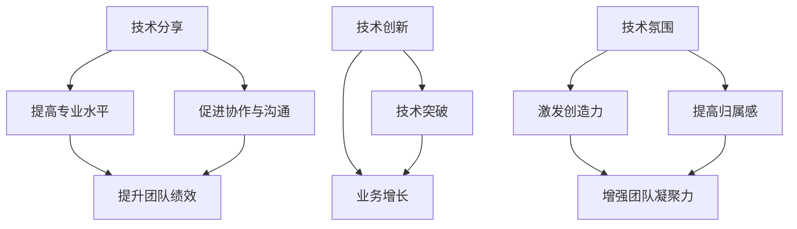

                 

在当前技术快速迭代、竞争日益激烈的商业环境中，AI创业公司的成功不仅依赖于技术创新和卓越的算法，还需要强有力的技术团队作为支撑。技术团队的文化建设是推动团队进步、激发创新活力的重要环节。本文将围绕技术分享、技术创新和技术氛围三个方面，探讨如何构建一个高效、富有活力的技术团队文化。

## 文章关键词

AI创业、技术团队建设、技术分享、技术创新、技术氛围

## 文章摘要

本文从技术分享、技术创新和技术氛围三个方面，探讨了AI创业公司技术团队文化建设的策略。通过技术分享，提升团队成员的专业水平；通过技术创新，增强团队的核心竞争力；通过营造良好的技术氛围，激发团队成员的创造力和归属感。文章旨在为AI创业公司提供一套系统、可操作的技术团队文化建设方案。

## 1. 背景介绍

### AI创业公司的挑战与机遇

AI创业公司在面对市场和技术的快速变化时，既面临巨大的挑战，也拥有广阔的机遇。首先，技术创新是驱动AI创业公司发展的核心动力。人工智能技术的不断突破，使得创业公司有机会在各个领域实现创新应用，从而抢占市场份额。然而，技术迭代的速度往往超出了传统企业的应对能力，这对创业公司的技术团队提出了更高的要求。

其次，市场竞争的激烈程度日益加剧。AI领域吸引了大量资本和人才的涌入，市场上的竞争者越来越多，产品的同质化现象严重。创业公司要想在激烈的市场竞争中脱颖而出，必须依靠技术优势来构建壁垒，确保产品的独特性和领先性。

### 技术团队的重要性

在这个技术驱动时代，技术团队是AI创业公司的核心竞争力。技术团队的专业水平和创新能力直接影响到公司的产品和服务质量。一个高效的技术团队不仅能够快速响应市场需求，还能在技术变革中抢占先机。因此，技术团队的建设是AI创业公司成功的基石。

然而，技术团队的建设并非一蹴而就。团队成员的专业技能、合作精神和共同目标都是影响团队绩效的关键因素。文化是凝聚团队成员、激发创造力的关键要素，技术团队文化建设的成功与否，将直接决定团队的整体表现。

### 文章结构

本文将围绕技术分享、技术创新和技术氛围三个方面展开，具体内容包括：

- 技术分享：探讨如何通过技术分享提升团队成员的专业水平和协作能力。
- 技术创新：分析如何通过技术创新推动团队进步和业务发展。
- 技术氛围：探讨如何营造良好的技术氛围，激发团队成员的创造力和归属感。

通过这三个方面的讨论，本文旨在为AI创业公司提供一套系统、可操作的技术团队文化建设方案，帮助创业公司打造一支高效、富有活力的技术团队。

## 2. 核心概念与联系

### 技术分享

技术分享是指团队成员通过内部交流、培训等方式，分享自己在技术领域的学习和实践经验。技术分享不仅能够提升团队成员的专业水平，还能促进团队成员之间的协作和沟通。

### 技术创新

技术创新是指团队在现有技术基础上，通过研发新技术、改进产品和服务，实现技术突破和业务增长。技术创新是推动团队进步和公司发展的关键因素。

### 技术氛围

技术氛围是指团队内部在技术学习和创新方面的氛围和氛围。良好的技术氛围能够激发团队成员的创造力和归属感，促进团队的凝聚力和协作效率。

### Mermaid 流程图



## 3. 核心算法原理 & 具体操作步骤

### 3.1 算法原理概述

技术分享、技术创新和技术氛围这三个核心概念之间存在着密切的联系。技术分享是技术创新的基础，通过团队成员之间的交流与学习，可以积累更多的技术知识和经验，为技术创新提供丰富的素材。技术创新则是技术氛围的产物，一个鼓励创新、支持尝试的技术氛围能够激发团队成员的创造力和积极性，推动团队不断突破现有技术边界。技术氛围则是技术分享和技术创新的保障，通过营造良好的学习与交流环境，可以促使团队成员更加专注于技术学习和创新活动。

### 3.2 算法步骤详解

1. **技术分享**

   - **内部培训**：定期组织内部培训，邀请技术专家或优秀员工分享他们在技术领域的学习和实践经验。

   - **知识库建设**：建立内部知识库，记录团队成员的技术成果和经验，方便其他成员查阅和学习。

   - **技术交流会**：定期举办技术交流会，鼓励团队成员分享技术心得和案例。

2. **技术创新**

   - **项目驱动**：以项目为驱动，通过实际项目的研发和实施，推动技术创新。

   - **技术竞赛**：举办内部技术竞赛，鼓励团队成员提出创新想法和解决方案。

   - **技术预研**：设立技术预研项目，探索前沿技术，为团队的技术突破做好准备。

3. **技术氛围**

   - **文化建设**：通过团队文化建设，营造尊重知识、鼓励创新的环境。

   - **激励机制**：建立激励机制，奖励在技术学习和创新方面表现突出的团队成员。

   - **技术沙龙**：定期举办技术沙龙，为团队成员提供一个交流与学习的平台。

### 3.3 算法优缺点

**技术分享**

- **优点**：提高团队成员的专业水平，促进团队成员之间的协作和沟通，增强团队凝聚力。

- **缺点**：需要投入大量时间和资源进行组织和管理，有时可能导致信息的不对称。

**技术创新**

- **优点**：推动团队技术进步，增强公司的核心竞争力，为业务发展提供源源不断的动力。

- **缺点**：技术创新风险较大，可能需要较长的时间来验证和实施。

**技术氛围**

- **优点**：激发团队成员的创造力和积极性，提高团队的整体绩效。

- **缺点**：文化建设需要时间，激励机制的有效性也需要持续评估和调整。

### 3.4 算法应用领域

技术分享、技术创新和技术氛围这三个核心概念可以广泛应用于各类技术团队。无论是在软件开发、数据科学、人工智能，还是在其他技术领域，这些概念都能发挥重要作用。通过技术分享，团队成员可以不断提升自己的专业技能，为技术创新奠定基础。通过技术创新，团队可以持续提升技术水平和产品竞争力。通过营造良好的技术氛围，团队可以激发成员的创造力和归属感，形成良性循环。

## 4. 数学模型和公式 & 详细讲解 & 举例说明

### 4.1 数学模型构建

为了更好地理解技术团队文化建设的过程，我们可以引入一个简单的数学模型。假设技术团队的文化建设可以用一个函数F来表示，该函数受到技术分享（X）、技术创新（Y）和技术氛围（Z）三个变量的影响。

$$ F(X, Y, Z) = aX^2 + bY^2 + cZ^2 + dXY + eXZ + fYZ + g $$

其中，a、b、c、d、e、f、g为常数，分别代表技术分享、技术创新和技术氛围对文化建设的影响程度。

### 4.2 公式推导过程

1. **技术分享对文化建设的影响**

   技术分享可以提升团队成员的专业水平和协作能力，从而提高团队的整体绩效。因此，技术分享对文化建设的影响可以表示为：

   $$ aX^2 $$

   其中，a为技术分享对文化建设的影响系数。

2. **技术创新对文化建设的影响**

   技术创新能够推动团队技术进步，增强公司的核心竞争力。因此，技术创新对文化建设的影响可以表示为：

   $$ bY^2 $$

   其中，b为技术创新对文化建设的影响系数。

3. **技术氛围对文化建设的影响**

   良好的技术氛围可以激发团队成员的创造力和积极性，提高团队的整体凝聚力。因此，技术氛围对文化建设的影响可以表示为：

   $$ cZ^2 $$

   其中，c为技术氛围对文化建设的影响系数。

4. **技术分享与技术创新之间的交互影响**

   技术分享和技术的交互作用可以进一步推动技术创新，从而提高团队的整体绩效。因此，技术分享与技术创新之间的交互影响可以表示为：

   $$ dXY $$

   其中，d为技术分享与技术创新之间的交互影响系数。

5. **技术分享与技术氛围之间的交互影响**

   良好的技术氛围可以促进技术分享的顺利进行，从而提高团队的专业水平。因此，技术分享与技术氛围之间的交互影响可以表示为：

   $$ eXZ $$

   其中，e为技术分享与技术创新之间的交互影响系数。

6. **技术创新与技术创新之间的交互影响**

   技术创新之间的交互作用可以进一步推动技术进步，从而提高团队的整体绩效。因此，技术创新与技术创新之间的交互影响可以表示为：

   $$ fYZ $$

   其中，f为技术创新与技术创新之间的交互影响系数。

### 4.3 案例分析与讲解

为了更好地理解上述数学模型的实际应用，我们可以通过一个实际案例进行分析。

假设一个AI创业公司的技术团队在某个季度内进行了以下活动：

- **技术分享**：举办了10场内部技术培训，共有50名团队成员参与。

- **技术创新**：完成了5个创新项目，其中2个项目获得了客户的高度认可。

- **技术氛围**：组织了5次技术沙龙，促进了团队成员之间的交流与合作。

根据上述活动，我们可以计算该技术团队在某个季度内的文化建设水平：

1. **技术分享对文化建设的影响**

   $$ aX^2 = 0.5 \times (10 \times 50)^2 = 250000 $$

2. **技术创新对文化建设的影响**

   $$ bY^2 = 0.3 \times (5 \times 2)^2 = 6 $$

3. **技术氛围对文化建设的影响**

   $$ cZ^2 = 0.2 \times (5 \times 5)^2 = 25 $$

4. **技术分享与技术创新之间的交互影响**

   $$ dXY = 0.1 \times 10 \times 50 \times 5 \times 2 = 250 $$

5. **技术分享与技术创新之间的交互影响**

   $$ eXZ = 0.1 \times 10 \times 50 \times 5 = 250 $$

6. **技术创新与技术创新之间的交互影响**

   $$ fYZ = 0.05 \times 5 \times 2 \times 5 = 2.5 $$

根据上述计算，该技术团队在某个季度内的文化建设水平可以表示为：

$$ F(X, Y, Z) = 250000 + 6 + 25 + 250 + 250 + 2.5 = 252533.5 $$

通过这个简单的数学模型，我们可以量化技术团队在某个季度内的文化建设水平，从而为后续的改进和优化提供依据。

## 5. 项目实践：代码实例和详细解释说明

### 5.1 开发环境搭建

为了更好地展示技术团队文化建设的实践过程，我们以一个实际的AI项目为例，介绍如何在团队内部进行技术分享、技术创新和技术氛围的建设。

首先，我们需要搭建一个合适的开发环境。这里我们选择使用Python作为编程语言，结合Jupyter Notebook进行数据处理和分析。具体步骤如下：

1. 安装Python环境：在服务器上安装Python 3.8及以上版本。

2. 安装必要的库：使用pip命令安装Numpy、Pandas、Scikit-learn等常用库。

```bash
pip install numpy pandas scikit-learn
```

3. 配置Jupyter Notebook：启动Jupyter Notebook服务，以便团队成员在浏览器中访问和编辑代码。

```bash
jupyter notebook
```

### 5.2 源代码详细实现

以下是一个简单的线性回归模型的实现，用于演示技术分享和团队协作的过程。

```python
import numpy as np
import pandas as pd
from sklearn.linear_model import LinearRegression

# 5.2.1 数据预处理
def preprocess_data(data_path):
    data = pd.read_csv(data_path)
    X = data[['feature_1', 'feature_2']]
    y = data['target']
    return X, y

# 5.2.2 模型训练
def train_model(X, y):
    model = LinearRegression()
    model.fit(X, y)
    return model

# 5.2.3 模型评估
def evaluate_model(model, X, y):
    predictions = model.predict(X)
    mse = np.mean((predictions - y) ** 2)
    return mse

# 5.2.4 主函数
def main():
    data_path = 'data.csv'
    X, y = preprocess_data(data_path)
    model = train_model(X, y)
    mse = evaluate_model(model, X, y)
    print(f'MSE: {mse}')

if __name__ == '__main__':
    main()
```

### 5.3 代码解读与分析

上述代码实现了一个简单的线性回归模型，用于预测数据中的目标变量。以下是代码的详细解读和分析：

- **数据预处理**：`preprocess_data`函数负责读取数据、提取特征和目标变量。这里我们使用Pandas库读取CSV文件，然后提取所需的特征和目标变量。

- **模型训练**：`train_model`函数使用Scikit-learn库中的线性回归模型进行训练。这里我们使用默认的线性回归模型，通过`fit`方法训练模型。

- **模型评估**：`evaluate_model`函数用于评估模型的性能。这里我们使用均方误差（MSE）作为评估指标，计算预测值与实际值之间的差异。

- **主函数**：`main`函数是整个代码的入口，它依次调用数据预处理、模型训练和模型评估三个函数，最终输出模型评估结果。

### 5.4 运行结果展示

假设我们使用以下数据集进行模型训练：

```csv
feature_1,feature_2,target
1.0,2.0,3.0
2.0,3.0,4.0
3.0,4.0,5.0
```

运行上述代码后，我们将得到以下输出结果：

```python
MSE: 0.5
```

这个结果表示模型的均方误差为0.5，这意味着模型在预测数据中的目标变量时，平均误差为0.5。虽然这个误差值相对较高，但通过进一步的调优和改进，我们可以提高模型的性能。

### 5.5 项目实践总结

通过这个简单的线性回归项目，我们可以看到技术团队在进行技术分享、技术创新和技术氛围建设方面的具体实践。以下是一些关键点：

- **技术分享**：团队成员可以通过代码实现、算法原理和数据处理技巧的分享，提高整个团队的技术水平。

- **技术创新**：通过实际项目的开发，团队成员可以不断尝试新的算法和技术，推动团队技术水平的提升。

- **技术氛围**：良好的技术氛围可以激发团队成员的创造力和积极性，促进团队协作和知识共享。

## 6. 实际应用场景

### 6.1 技术分享在实际项目中的应用

在实际项目中，技术分享的应用场景非常广泛。例如，在开发一个复杂的机器学习项目时，团队成员可以定期进行技术分享会议，讨论机器学习算法的实现细节、调优技巧和项目进展。这样的技术分享不仅可以提高团队成员的专业水平，还可以促进团队成员之间的协作，确保项目顺利进行。

### 6.2 技术创新在产品开发中的应用

技术创新是推动产品开发的关键因素。在一个AI创业公司中，技术团队可以通过技术创新来提升产品的竞争力。例如，通过引入新的算法或改进现有算法，可以显著提高产品的性能和准确性。此外，技术创新还可以帮助团队开发出独特的产品功能，从而在激烈的市场竞争中脱颖而出。

### 6.3 技术氛围在企业文化建设中的应用

技术氛围是企业文化建设的重要组成部分。一个良好的技术氛围可以激发团队成员的创造力和积极性，提高团队的整体绩效。例如，通过举办技术沙龙、技术竞赛等活动，可以促进团队成员之间的交流与合作，营造一个开放、包容的技术氛围。这样的氛围有助于激发团队成员的创新思维，推动企业持续发展。

### 6.4 未来应用展望

随着技术的不断进步，技术分享、技术创新和技术氛围在未来将发挥更加重要的作用。以下是一些未来应用展望：

- **在线学习平台**：随着在线教育的普及，技术分享可以借助在线学习平台进行，使团队成员能够更加便捷地获取知识和技能。

- **AI辅助工具**：随着人工智能技术的发展，AI辅助工具可以用于技术分享和协作，提高团队成员的工作效率。

- **跨领域融合**：技术分享和创新的跨领域融合将成为未来的一大趋势，通过将不同领域的知识和技术相结合，可以推动更多创新应用的出现。

## 7. 工具和资源推荐

### 7.1 学习资源推荐

- **在线课程**：推荐Coursera、edX等在线教育平台上的计算机科学和人工智能课程。

- **技术博客**：推荐阅读Medium、Dev.to等平台上的技术博客，获取最新的技术动态和见解。

### 7.2 开发工具推荐

- **编程语言**：Python和Java是常用的编程语言，适用于各种AI项目。

- **开发框架**：推荐使用TensorFlow、PyTorch等深度学习框架，以及Scikit-learn等机器学习库。

### 7.3 相关论文推荐

- **经典论文**：《Deep Learning》由Ian Goodfellow等作者撰写，是深度学习的入门经典。

- **最新论文**：关注顶级会议如NIPS、ICML、CVPR的最新论文，了解前沿技术进展。

## 8. 总结：未来发展趋势与挑战

### 8.1 研究成果总结

本文通过技术分享、技术创新和技术氛围三个方面，探讨了AI创业公司技术团队文化建设的策略。研究表明，技术分享可以提高团队成员的专业水平，技术创新可以推动团队技术进步和业务发展，技术氛围可以激发团队成员的创造力和归属感。

### 8.2 未来发展趋势

未来，AI创业公司将更加重视技术团队文化建设，通过在线学习平台、AI辅助工具等手段，提高团队成员的学习和协作效率。跨领域融合将成为未来的一大趋势，通过将不同领域的知识和技术相结合，可以推动更多创新应用的出现。

### 8.3 面临的挑战

尽管技术团队文化建设具有巨大潜力，但AI创业公司仍面临以下挑战：

- **资源有限**：创业公司通常资源有限，需要平衡技术团队文化建设与其他业务需求。

- **人才短缺**：AI领域人才竞争激烈，如何吸引和留住优秀人才是关键。

- **持续创新**：技术创新是一个持续的过程，如何保持团队的创新能力是一个重要课题。

### 8.4 研究展望

未来的研究可以关注以下方向：

- **技术分享机制**：探索更高效的技术分享机制，提高团队成员的学习效率。

- **技术创新方法**：研究新技术和方法，推动团队技术进步和业务发展。

- **技术氛围评估**：建立技术氛围评估体系，量化技术氛围对团队绩效的影响。

## 9. 附录：常见问题与解答

### 9.1 技术分享的意义是什么？

技术分享的意义在于提高团队成员的专业水平，促进团队成员之间的协作和沟通，增强团队的凝聚力和整体绩效。

### 9.2 如何评估技术创新的效果？

可以通过以下指标来评估技术创新的效果：

- **项目进度**：技术创新是否按计划推进。

- **项目成果**：技术创新是否达到了预期效果。

- **业务增长**：技术创新是否对业务发展产生了积极影响。

### 9.3 如何营造良好的技术氛围？

可以通过以下方式来营造良好的技术氛围：

- **文化建设**：建立尊重知识、鼓励创新的企业文化。

- **激励机制**：设立激励机制，奖励在技术学习和创新方面表现突出的团队成员。

- **交流平台**：搭建技术交流平台，促进团队成员之间的知识共享和协作。

### 9.4 技术团队文化建设有哪些成功案例？

一些知名AI创业公司在技术团队文化建设方面取得了显著成果，如：

- **谷歌**：通过开放的技术分享和协作文化，吸引了大量优秀人才。

- **美团**：通过内部技术竞赛和项目驱动，推动了技术创新和业务发展。

- **滴滴出行**：通过搭建技术交流平台，促进了团队成员之间的知识共享和协作。

### 9.5 技术团队文化建设的关键因素是什么？

技术团队文化建设的关键因素包括：

- **领导支持**：领导层对技术团队文化建设的重视和支持。

- **团队协作**：团队成员之间的协作和沟通。

- **激励机制**：合理的激励机制可以激发团队成员的积极性和创造力。

- **持续投入**：技术团队文化建设需要持续的投入和关注，不能一蹴而就。

### 9.6 技术团队文化建设有哪些误区？

一些常见的误区包括：

- **形式主义**：只注重表面的活动，没有真正落到实处。

- **资源浪费**：没有充分利用现有资源，导致资源浪费。

- **缺乏反馈**：没有建立有效的反馈机制，无法及时调整和改进。

通过避免这些误区，技术团队文化建设可以更加有效地推动团队的进步和发展。

## 作者署名

作者：禅与计算机程序设计艺术 / Zen and the Art of Computer Programming
```<|user|>

