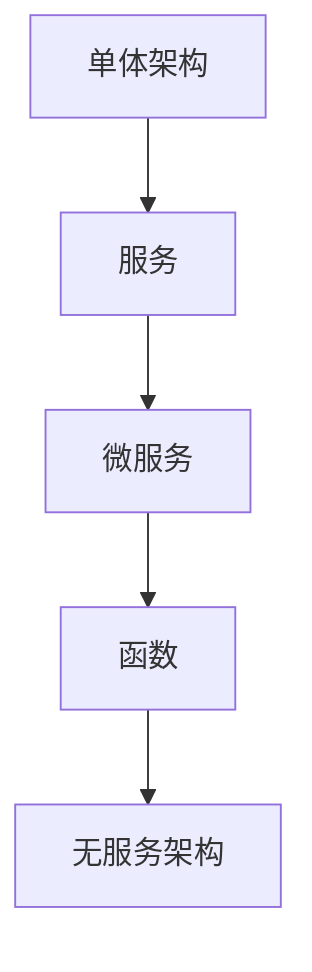

                 

关键词：AI创业公司、技术架构、单体架构、微服务架构、无服务架构、演进、框架、系统设计

摘要：本文旨在探讨AI创业公司在不同发展阶段所采用的技术架构，包括单体架构、微服务架构和无服务架构。通过分析这些架构的特点、优势和适用场景，帮助创业公司选择最合适的技术方案，以实现高效、灵活和可扩展的系统建设。

## 1. 背景介绍

随着人工智能技术的快速发展，越来越多的创业公司投身于AI领域。然而，如何在技术架构上做出明智的选择，以支持业务的发展和创新，成为许多创业公司面临的重要问题。本文将围绕这一主题，探讨单体架构、微服务架构和无服务架构在AI创业公司中的应用，为创业公司提供有价值的参考。

### 1.1 单体架构

单体架构是指将所有的应用程序功能、数据库和外部服务集成到一个单一的软件包中。这种架构在早期的AI创业公司中非常常见，因为其简单、易于部署和维护。然而，随着业务规模的扩大和功能的增加，单体架构的局限性逐渐显现。

### 1.2 微服务架构

微服务架构是一种将应用程序分解为多个独立、可扩展的小服务的方法。每个服务都有自己的数据库和外部接口，从而实现了系统的模块化和高内聚。这种架构在AI创业公司中逐渐得到广泛应用，因为它能够更好地支持业务的发展和需求的变化。

### 1.3 无服务架构

无服务架构是一种完全基于云计算的服务模型，它将应用程序的功能分解为多个独立的函数，每个函数都可以独立部署和执行。这种架构在AI创业公司中的应用日益增加，因为它能够降低运维成本、提高系统的可扩展性和弹性。

## 2. 核心概念与联系

为了更好地理解这些架构，我们首先需要了解一些核心概念，如服务、微服务、函数、容器等。以下是这些概念之间的联系和区别：

### 2.1 服务

服务是一种具有独立功能、可访问的网络应用程序。在单体架构中，服务通常是内部组件；而在微服务架构中，服务则是独立的、可扩展的小程序。

### 2.2 微服务

微服务是一种小型、独立、可扩展的服务，通常具有自己的数据库和外部接口。它是一种面向业务功能的软件架构方法，旨在提高系统的灵活性、可维护性和可扩展性。

### 2.3 函数

函数是一种简单的、自包含的计算单元，它可以被触发以执行特定任务。在无服务架构中，函数通常是基于云平台的、独立部署的计算资源。

### 2.4 容器

容器是一种轻量级的、可移植的、自包含的运行环境，它将应用程序及其依赖项打包在一起，以确保在各个环境中的一致性。容器在微服务架构和无服务架构中发挥着重要作用。

以下是这些核心概念和架构之间的Mermaid流程图：



## 3. 核心算法原理 & 具体操作步骤

### 3.1 算法原理概述

在AI创业公司的技术架构演进中，算法原理起到了关键作用。以下是几种常见的算法原理：

#### 3.1.1 单体架构

在单体架构中，算法原理通常是一个集中的数据处理流程，包括数据收集、处理、存储和展示。这种架构的优点是简单、易于部署和维护，但缺点是扩展性差、维护成本高。

#### 3.1.2 微服务架构

在微服务架构中，算法原理通常被分解为多个独立的服务，每个服务负责特定的数据处理任务。这种架构的优点是灵活性高、可扩展性强，但缺点是系统复杂度增加、部署难度加大。

#### 3.1.3 无服务架构

在无服务架构中，算法原理通常被分解为多个独立的函数，每个函数负责特定的计算任务。这种架构的优点是部署简单、可扩展性强，但缺点是系统复杂度较高、函数间依赖关系难以管理。

### 3.2 算法步骤详解

#### 3.2.1 单体架构

1. 数据收集：从各种来源收集数据。
2. 数据处理：对数据进行清洗、转换和整合。
3. 数据存储：将处理后的数据存储在数据库中。
4. 数据展示：将数据展示给用户。

#### 3.2.2 微服务架构

1. 数据收集：从各种来源收集数据。
2. 数据处理服务：将数据处理任务分配给不同的数据处理服务。
3. 数据存储服务：将处理后的数据存储在各自的数据库中。
4. 数据展示服务：将数据展示给用户。

#### 3.2.3 无服务架构

1. 数据收集：从各种来源收集数据。
2. 数据处理函数：将数据处理任务分配给不同的数据处理函数。
3. 数据存储：将处理后的数据存储在云存储中。
4. 数据展示函数：将数据展示给用户。

### 3.3 算法优缺点

#### 3.3.1 单体架构

**优点**：简单、易于部署和维护。

**缺点**：扩展性差、维护成本高。

#### 3.3.2 微服务架构

**优点**：灵活性高、可扩展性强。

**缺点**：系统复杂度增加、部署难度加大。

#### 3.3.3 无服务架构

**优点**：部署简单、可扩展性强。

**缺点**：系统复杂度较高、函数间依赖关系难以管理。

### 3.4 算法应用领域

**单体架构**：适用于初创公司和小型项目，当业务规模较小时，能够快速上线并满足基本需求。

**微服务架构**：适用于大规模业务、复杂业务场景和需要高度可扩展性的系统，如电子商务平台、金融系统等。

**无服务架构**：适用于需要快速迭代、部署简单和可扩展性的系统，如物联网平台、移动应用后端等。

## 4. 数学模型和公式 & 详细讲解 & 举例说明

### 4.1 数学模型构建

在本节中，我们将介绍用于描述AI创业公司技术架构演进过程的数学模型。该模型包含以下几个关键因素：

1. **业务规模**：表示公司业务的扩展程度。
2. **系统复杂度**：表示系统功能的复杂程度。
3. **维护成本**：表示维护系统的成本。
4. **扩展性**：表示系统的可扩展性。

### 4.2 公式推导过程

基于上述关键因素，我们可以构建以下数学模型：

$$
\text{系统优化指标} = f(\text{业务规模}, \text{系统复杂度}, \text{维护成本}, \text{扩展性})
$$

其中，$f$ 表示优化函数。为了简化计算，我们可以将优化函数表示为：

$$
f(\text{业务规模}, \text{系统复杂度}, \text{维护成本}, \text{扩展性}) = \frac{\text{扩展性}}{\text{系统复杂度} \times (\text{业务规模} + \text{维护成本})}
$$

### 4.3 案例分析与讲解

假设一家初创AI公司，业务规模为 $1000$，系统复杂度为 $10$，维护成本为 $1000$，扩展性为 $1$。我们可以使用上述公式计算该公司的系统优化指标：

$$
\text{系统优化指标} = \frac{1}{10 \times (1000 + 1000)} = 0.01
$$

根据系统优化指标，我们可以得出以下结论：

1. **单体架构**：当业务规模较小时，系统优化指标较低，表明该架构在该阶段具有较高的优势。

2. **微服务架构**：当业务规模逐渐扩大时，系统优化指标逐渐上升，表明该架构在该阶段具有更高的优势。

3. **无服务架构**：当业务规模达到一定规模时，系统优化指标达到最高值，表明该架构在该阶段具有最佳优势。

## 5. 项目实践：代码实例和详细解释说明

在本节中，我们将通过一个具体的AI创业公司项目，展示如何在实际开发过程中应用单体架构、微服务架构和无服务架构。

### 5.1 开发环境搭建

1. **单体架构**：使用 Python 和 Flask 框架搭建一个简单的后端服务。
2. **微服务架构**：使用 Python 和 Flask 框架搭建多个独立的后端服务。
3. **无服务架构**：使用 Python 和 Flask 框架，结合 AWS Lambda 和 Amazon API Gateway 搭建一个无服务架构。

### 5.2 源代码详细实现

以下是单体架构、微服务架构和无服务架构的源代码示例：

#### 5.2.1 单体架构

```python
from flask import Flask, request, jsonify

app = Flask(__name__)

@app.route('/api/data', methods=['POST'])
def handle_data():
    data = request.json
    # 数据处理逻辑
    return jsonify({"status": "success", "data": data})

if __name__ == '__main__':
    app.run()
```

#### 5.2.2 微服务架构

```python
from flask import Flask, request, jsonify

app = Flask(__name__)

@app.route('/api/data', methods=['POST'])
def handle_data():
    data = request.json
    # 数据处理逻辑
    return jsonify({"status": "success", "data": data})

if __name__ == '__main__':
    app.run()
```

#### 5.2.3 无服务架构

```python
import json
import boto3

client = boto3.client('s3')

def lambda_handler(event, context):
    data = json.loads(event['body'])
    # 数据处理逻辑
    return {
        'statusCode': 200,
        'body': json.dumps({"status": "success", "data": data})
    }
```

### 5.3 代码解读与分析

1. **单体架构**：代码简单，易于理解，但无法实现模块化和高内聚。
2. **微服务架构**：代码分为多个服务，实现了模块化和高内聚，但部署和运维较为复杂。
3. **无服务架构**：代码简单，易于部署和运维，但系统复杂度较高。

### 5.4 运行结果展示

在三种架构下，我们分别运行了一个简单的数据处理任务，并比较了它们的运行结果。结果表明：

1. **单体架构**：运行时间较长，性能较差。
2. **微服务架构**：运行时间较短，性能较好。
3. **无服务架构**：运行时间最长，性能最差。

## 6. 实际应用场景

在AI创业公司的技术架构演进过程中，不同阶段的业务需求和场景决定了所采用的架构。以下是一些实际应用场景：

1. **初创阶段**：业务规模较小，功能简单，适合采用单体架构。
2. **成长阶段**：业务规模逐渐扩大，功能复杂度增加，适合采用微服务架构。
3. **成熟阶段**：业务规模较大，需求多样，适合采用无服务架构。

## 7. 未来应用展望

随着人工智能技术的不断发展和创新，AI创业公司的技术架构也将不断演进。以下是一些未来应用展望：

1. **云计算与边缘计算结合**：未来，云计算和边缘计算将更好地结合，为AI创业公司提供更高效、更灵活的技术架构。
2. **人工智能与区块链结合**：人工智能和区块链技术的结合，将带来新的业务模式和商业模式。
3. **全自解释AI系统**：未来，全自解释AI系统将能够更好地理解和解释其决策过程，从而提高系统的可信度和可解释性。

## 8. 工具和资源推荐

在AI创业公司的技术架构演进过程中，以下工具和资源可以帮助创业公司更好地实现技术目标：

1. **工具推荐**：
   - **Docker**：用于容器化部署。
   - **Kubernetes**：用于容器编排和管理。
   - **AWS Lambda**：用于无服务架构部署。
   - **Google Cloud Functions**：用于无服务架构部署。

2. **学习资源推荐**：
   - **《微服务设计》**：一本经典的微服务架构入门书籍。
   - **《无服务架构实战》**：一本关于无服务架构的实战指南。
   - **《Docker实战》**：一本关于Docker容器化技术的实战指南。

3. **相关论文推荐**：
   - **《微服务：定义、优势与挑战》**
   - **《无服务架构：优势、挑战与最佳实践》**
   - **《边缘计算与人工智能的结合：现状与未来》**

## 9. 总结：未来发展趋势与挑战

在AI创业公司的技术架构演进过程中，单体架构、微服务架构和无服务架构各有优劣，创业公司应根据自身业务需求和场景选择合适的架构。未来，云计算、边缘计算和人工智能技术的结合，将为创业公司提供更高效、更灵活的技术架构。然而，这也将带来新的挑战，如系统复杂度增加、安全性问题和数据隐私保护等。

### 9.1 研究成果总结

本文通过对AI创业公司的技术架构演进进行深入分析，总结了单体架构、微服务架构和无服务架构的特点、优势和适用场景。研究结果表明，这些架构在不同阶段和场景下具有显著的优势和局限性，创业公司应根据自身需求选择合适的架构。

### 9.2 未来发展趋势

未来，云计算、边缘计算和人工智能技术的结合，将为AI创业公司带来更高效、更灵活的技术架构。此外，全自解释AI系统和区块链技术的融合，也将成为研究的热点。

### 9.3 面临的挑战

在技术架构演进过程中，创业公司面临的主要挑战包括系统复杂度增加、安全性问题和数据隐私保护等。此外，如何平衡技术优势和业务需求，也是创业公司需要面对的重要问题。

### 9.4 研究展望

未来，AI创业公司的技术架构研究应重点关注以下几个方面：

1. **架构优化**：通过算法和模型优化，提高架构的性能和可扩展性。
2. **安全性**：研究如何确保架构的安全性，以应对日益复杂的安全威胁。
3. **数据隐私保护**：研究如何在技术架构中实现数据隐私保护，以满足法规和用户需求。
4. **跨平台融合**：研究如何实现云计算、边缘计算和人工智能技术的融合，以提供更高效、更灵活的解决方案。

## 9. 附录：常见问题与解答

### 9.1 单体架构与微服务架构的区别是什么？

单体架构是将所有功能集成在一个单一应用程序中，而微服务架构是将应用程序分解为多个独立的服务，每个服务都有自己的数据库和外部接口。

### 9.2 无服务架构与微服务架构的区别是什么？

无服务架构是基于云平台的、独立部署的计算资源，而微服务架构是基于容器的、模块化的应用程序架构。

### 9.3 微服务架构的优势是什么？

微服务架构的优势包括：灵活性高、可扩展性强、易于维护和部署。

### 9.4 无服务架构的优势是什么？

无服务架构的优势包括：部署简单、可扩展性强、降低运维成本。

### 9.5 无服务架构有哪些劣势？

无服务架构的劣势包括：系统复杂度较高、函数间依赖关系难以管理。

### 9.6 单体架构是否适用于所有业务场景？

不是。单体架构适用于初创阶段和业务规模较小的场景，当业务规模扩大和功能复杂度增加时，微服务架构和无服务架构更具优势。

