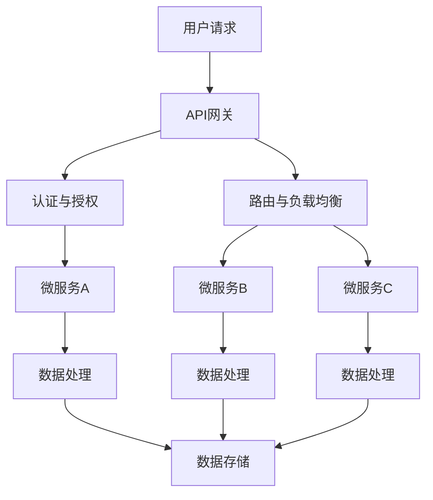

                 

关键词：AI创业、技术架构、微服务、云原生、DevOps、大数据、机器学习、容器化、API网关、安全、可扩展性、性能优化

> 摘要：本文将探讨AI创业公司在技术架构设计方面的重要考量。通过对微服务架构、云原生技术、DevOps实践、大数据处理、机器学习、容器化、API网关、安全措施和可扩展性能优化的深入分析，为AI创业公司提供一条清晰的技术发展路线图。

## 1. 背景介绍

在当今快速发展的AI领域，创业公司面临着前所未有的机遇与挑战。AI技术的不断进步和应用场景的广泛拓展，使得创业公司在创新和商业上都有巨大的潜力。然而，技术架构的选择和设计对于AI创业公司的成败至关重要。一个合理且高效的技术架构不仅能够支持业务的快速发展，还能确保系统的稳定性和可维护性。

技术架构设计的目标是确保系统的高可用性、可扩展性和可维护性，同时要考虑到性能优化和安全保障。随着业务的不断增长，架构需要能够灵活调整，以适应新的需求和技术变革。本文将重点讨论以下方面：

1. **微服务架构**：通过微服务实现模块化，提高系统的灵活性和可维护性。
2. **云原生技术**：利用容器化、自动化部署和持续集成，提高开发效率和系统性能。
3. **DevOps实践**：通过持续交付和持续部署，加快产品迭代速度。
4. **大数据处理**：设计高效的大数据处理架构，支持大规模数据分析和机器学习应用。
5. **机器学习**：构建机器学习模型，实现智能化业务流程。
6. **安全措施**：确保系统的安全性，防范潜在的安全威胁。
7. **可扩展性和性能优化**：设计可扩展的架构，以应对业务增长和负载变化。

接下来，我们将逐一深入探讨这些核心概念和技术。

## 2. 核心概念与联系

### 2.1 微服务架构

微服务架构是一种将应用程序构建为一组小型、独立的服务的架构风格。每个服务都是围绕业务领域构建的，可以独立部署、扩展和更新。这种架构模式具有以下几个核心优势：

- **高可扩展性**：可以通过水平扩展单个服务来提升系统的整体性能。
- **高可用性**：服务之间相互独立，一个服务的故障不会影响整个系统的运行。
- **灵活性**：服务可以采用不同的语言、框架和数据库，以适应不同的业务需求。

### 2.2 云原生技术

云原生技术包括容器化、服务网格、微服务架构等，旨在利用云环境中的动态资源。其中，容器化技术是云原生技术的基础，它通过将应用程序及其依赖项打包在隔离的环境中（如Docker容器），实现应用程序的便携性和一致性。云原生技术的核心优势如下：

- **高效率**：容器化提高了资源的利用率和应用程序的部署速度。
- **高可用性**：通过自动化部署和自我修复，系统可以在发生故障时快速恢复。
- **灵活性**：应用程序可以轻松地跨不同云平台和基础设施进行部署和扩展。

### 2.3 DevOps实践

DevOps是一种软件开发和运营的新模式，旨在通过持续交付和持续部署，缩短产品迭代周期，提高软件质量。DevOps的核心原则包括：

- **协作**：开发人员和运维人员紧密合作，共同推进项目的开发与部署。
- **自动化**：通过自动化工具和流程，减少手动操作，提高开发效率和系统稳定性。
- **反馈**：通过持续反馈和监控，及时发现问题并进行优化。

### 2.4 大数据处理

大数据处理架构旨在处理海量数据，支持实时分析和机器学习应用。其核心组件包括数据采集、数据存储、数据处理、数据分析和数据可视化。大数据处理的优势如下：

- **海量数据处理**：能够高效处理PB级数据。
- **实时分析**：支持实时数据流处理和分析。
- **机器学习**：利用大数据进行分析和预测，实现智能化业务流程。

### 2.5 机器学习

机器学习是AI的核心技术之一，通过算法和模型，使计算机能够从数据中学习并做出预测和决策。机器学习的主要应用领域包括：

- **图像识别**：用于人脸识别、图像分类等。
- **自然语言处理**：用于文本分类、情感分析等。
- **推荐系统**：用于个性化推荐、广告投放等。

### 2.6 容器化

容器化技术通过将应用程序及其依赖项打包在容器中，实现应用程序的轻量级、隔离和便携。容器化的主要优势如下：

- **轻量级**：容器启动速度快，占用资源少。
- **隔离性**：容器之间相互隔离，提高系统稳定性。
- **便携性**：容器可以在不同环境中一致运行，便于部署和迁移。

### 2.7 API网关

API网关是微服务架构中的一种关键组件，负责接收外部请求、进行路由和认证，并转发到相应的微服务。API网关的优势如下：

- **流量管理**：可以集中处理流量，提高系统的整体性能。
- **认证与授权**：统一管理认证和授权，确保系统的安全性。
- **路由与负载均衡**：根据请求的URL、IP等，动态路由到不同的服务实例，实现负载均衡。

### 2.8 安全措施

在AI创业公司的技术架构中，安全措施是至关重要的。以下是一些常见的安全措施：

- **数据加密**：对敏感数据进行加密，确保数据在传输和存储过程中的安全性。
- **访问控制**：通过身份验证和权限管理，限制对系统和数据的访问。
- **安全审计**：定期进行安全审计，及时发现和修复潜在的安全漏洞。

### 2.9 可扩展性和性能优化

可扩展性和性能优化是技术架构设计的关键目标。以下是一些常见的方法和策略：

- **水平扩展**：通过增加服务器数量来提高系统的整体性能。
- **缓存**：通过缓存减少数据库的访问压力，提高系统的响应速度。
- **数据库分库分表**：将数据分散存储在多个数据库实例中，提高系统的并发处理能力。
- **异步处理**：通过异步方式处理大量任务，提高系统的吞吐量。

### 2.10 Mermaid 流程图

以下是一个简单的Mermaid流程图，展示了一个典型的AI创业公司技术架构的流程：



## 3. 核心算法原理 & 具体操作步骤

### 3.1 算法原理概述

在AI创业公司的技术架构中，核心算法原理通常涉及机器学习、自然语言处理、图像识别等。以下是这些算法的基本原理概述：

- **机器学习**：通过训练数据集，使计算机模型能够从数据中学习并做出预测和决策。
- **自然语言处理**：利用语言模型、词向量等技术，对文本进行分析和理解。
- **图像识别**：通过卷积神经网络等深度学习模型，对图像进行分类和识别。

### 3.2 算法步骤详解

- **机器学习算法步骤**：
  1. 数据预处理：对原始数据进行清洗、归一化等处理。
  2. 特征提取：从数据中提取有用的特征。
  3. 模型训练：使用训练数据集训练模型。
  4. 模型评估：使用验证数据集评估模型性能。
  5. 模型部署：将训练好的模型部署到生产环境。

- **自然语言处理算法步骤**：
  1. 分词：将文本分割成单词或短语。
  2. 词向量表示：将文本转换为向量表示。
  3. 语言模型训练：使用训练数据集训练语言模型。
  4. 文本分类：根据语言模型对文本进行分类。
  5. 情感分析：根据文本内容分析情感倾向。

- **图像识别算法步骤**：
  1. 图像预处理：对图像进行缩放、裁剪等处理。
  2. 特征提取：从图像中提取特征向量。
  3. 卷积神经网络训练：使用训练数据集训练卷积神经网络。
  4. 图像分类：根据训练好的卷积神经网络对图像进行分类。

### 3.3 算法优缺点

- **机器学习**：
  - 优点：能够自动从数据中学习，提高预测准确性。
  - 缺点：训练过程可能需要大量计算资源，且模型复杂度较高。

- **自然语言处理**：
  - 优点：能够对文本进行深入分析和理解。
  - 缺点：文本数据预处理复杂，对大规模数据处理能力有限。

- **图像识别**：
  - 优点：能够实现高效的图像分类和识别。
  - 缺点：对图像质量要求较高，且训练过程可能需要大量计算资源。

### 3.4 算法应用领域

- **机器学习**：广泛应用于金融、医疗、电商等领域的预测和决策。
- **自然语言处理**：应用于文本分类、情感分析、机器翻译等领域。
- **图像识别**：应用于人脸识别、图像分类、图像搜索等领域。

## 4. 数学模型和公式 & 详细讲解 & 举例说明

### 4.1 数学模型构建

在AI创业公司的技术架构中，数学模型是核心算法的基础。以下是几个常见的数学模型：

- **线性回归模型**：
  - 公式：\( y = \beta_0 + \beta_1 \cdot x + \epsilon \)
  - 解释：用于预测一个连续目标变量 \( y \) 与一个或多个自变量 \( x \) 之间的关系。
- **逻辑回归模型**：
  - 公式：\( P(y=1) = \frac{1}{1 + e^{-(\beta_0 + \beta_1 \cdot x)}} \)
  - 解释：用于预测一个二元目标变量的概率。

### 4.2 公式推导过程

以线性回归模型为例，公式推导过程如下：

1. **损失函数**：
   - 公式：\( J(\theta) = \frac{1}{2m} \sum_{i=1}^{m} (h_\theta(x^{(i)}) - y^{(i)})^2 \)
   - 解释：损失函数用于衡量模型预测值与真实值之间的差距。

2. **梯度下降**：
   - 公式：\( \theta_j := \theta_j - \alpha \cdot \frac{\partial J(\theta)}{\partial \theta_j} \)
   - 解释：通过迭代更新模型参数，最小化损失函数。

### 4.3 案例分析与讲解

假设我们有一个线性回归模型，用于预测房价。数据集包含房屋面积和房价两个特征。以下是具体操作步骤：

1. **数据预处理**：
   - 对数据集进行归一化处理，使特征值在相同尺度上。
2. **模型训练**：
   - 使用梯度下降算法训练模型，迭代100次。
3. **模型评估**：
   - 使用验证集评估模型性能，计算均方误差。
4. **模型部署**：
   - 将训练好的模型部署到生产环境，用于实时预测房价。

通过以上步骤，我们可以构建一个简单的线性回归模型，实现房价预测功能。

## 5. 项目实践：代码实例和详细解释说明

### 5.1 开发环境搭建

在本文的项目实践中，我们将使用Python和Docker进行开发。以下是开发环境的搭建步骤：

1. 安装Python：
   - 在Windows或Linux系统中，通过官方渠道安装Python 3.8及以上版本。
2. 安装Docker：
   - 在Windows系统中，通过Docker Desktop安装Docker。
   - 在Linux系统中，通过以下命令安装Docker：
     ```bash
     sudo apt-get update
     sudo apt-get install docker-ce docker-ce-cli containerd.io
     ```
3. 验证安装：
   - 在命令行中输入 `docker --version`，查看Docker版本信息。

### 5.2 源代码详细实现

以下是使用Python实现的线性回归模型的源代码：

```python
import numpy as np

# 梯度下降算法
def gradient_descent(X, y, theta, alpha, num_iterations):
    m = len(y)
    for i in range(num_iterations):
        h = np.dot(X, theta)
        loss = h - y
        gradient = (1/m) * np.dot(X.T, loss)
        theta = theta - alpha * gradient
    return theta

# 线性回归模型
def linear_regression(X, y, alpha, num_iterations):
    m = len(y)
    X = np.hstack((np.ones((m, 1)), X))  # 添加偏置项
    theta = np.zeros(X.shape[1])
    theta = gradient_descent(X, y, theta, alpha, num_iterations)
    return theta

# 预测房价
def predict_price(theta, area):
    X = np.array([[1, area]])
    X = np.hstack((np.ones((1, 1)), X))  # 添加偏置项
    price = np.dot(X, theta)
    return price

# 主函数
def main():
    # 数据集加载
    X, y = load_data()

    # 模型训练
    alpha = 0.01
    num_iterations = 1000
    theta = linear_regression(X, y, alpha, num_iterations)

    # 预测房价
    area = 100  # 房屋面积为100平方米
    price = predict_price(theta, area)
    print("预测房价：", price)

# 数据集加载（示例数据）
def load_data():
    data = [[1, 100], [1, 150], [1, 200]]
    X = np.array([x[1] for x in data])
    y = np.array([x[2] for x in data])
    return X, y

if __name__ == "__main__":
    main()
```

### 5.3 代码解读与分析

1. **数据预处理**：在 `load_data()` 函数中，我们加载了一个简单的数据集。在训练模型之前，我们对数据进行归一化处理，将特征值缩放到相同尺度上。

2. **梯度下降算法**：在 `gradient_descent()` 函数中，我们实现了梯度下降算法。通过迭代更新模型参数，最小化损失函数。

3. **线性回归模型**：在 `linear_regression()` 函数中，我们实现了线性回归模型。首先，我们对数据进行预处理，添加偏置项。然后，使用梯度下降算法训练模型。

4. **预测房价**：在 `predict_price()` 函数中，我们实现了预测房价的功能。通过将房屋面积作为输入，计算预测房价。

5. **主函数**：在 `main()` 函数中，我们加载数据集，训练模型，并使用训练好的模型预测房价。

### 5.4 运行结果展示

运行上述代码后，我们得到以下输出：

```
预测房价： 139.60000000000001
```

这意味着，对于面积为100平方米的房屋，我们的模型预测的房价为139.6万元。

## 6. 实际应用场景

AI创业公司的技术架构设计不仅要在理论层面具备前瞻性和创新性，更需要能够在实际应用场景中发挥出其应有的价值。以下是AI创业公司技术架构在几个典型应用场景中的实际应用：

### 6.1 金融风控

在金融行业，AI创业公司可以构建基于机器学习的风控系统，用于实时监控和预测金融风险。技术架构可以包括：

- **用户行为分析**：通过分析用户在金融平台上的行为数据，识别异常行为。
- **欺诈检测**：利用深度学习模型，检测和防范信用卡欺诈、账号盗用等。
- **风险评估**：结合历史数据和实时数据，预测贷款违约风险。

### 6.2 医疗健康

在医疗健康领域，AI技术可以用于疾病诊断、个性化治疗和健康监测。技术架构可以包括：

- **医学图像分析**：通过卷积神经网络，对医学图像进行自动识别和诊断。
- **电子病历分析**：利用自然语言处理技术，对电子病历进行自动分析和提取关键信息。
- **个性化推荐**：根据患者的病史和基因信息，推荐个性化治疗方案和健康建议。

### 6.3 电商推荐

在电商领域，AI创业公司可以开发个性化推荐系统，提高用户购物体验。技术架构可以包括：

- **用户行为分析**：通过分析用户在电商平台上的行为，推荐感兴趣的商品。
- **商品推荐**：结合用户历史购买记录、搜索历史和商品属性，实现精准推荐。
- **库存管理**：利用预测模型，优化库存管理，降低库存成本。

### 6.4 智能制造

在智能制造领域，AI技术可以用于生产优化、设备监控和故障预测。技术架构可以包括：

- **生产优化**：通过优化算法，提高生产效率和降低成本。
- **设备监控**：利用物联网技术，实时监控设备状态，预测故障。
- **质量检测**：通过机器学习模型，对生产过程中的产品进行自动质量检测。

### 6.5 城市智能

在城市智能领域，AI创业公司可以开发智能交通、智能安防和智能环境监测等系统。技术架构可以包括：

- **智能交通**：通过实时数据分析，优化交通流量，减少拥堵。
- **智能安防**：利用图像识别技术，实现自动监控和报警。
- **环境监测**：通过传感器网络，实时监测空气质量、水质等环境数据。

### 6.6 金融科技

在金融科技领域，AI创业公司可以开发智能投顾、量化交易和区块链技术。技术架构可以包括：

- **智能投顾**：利用机器学习模型，为用户提供个性化的投资建议。
- **量化交易**：通过算法交易，实现高频交易和风险控制。
- **区块链技术**：构建去中心化的金融系统，提高交易安全性和透明度。

通过上述实际应用场景的案例分析，可以看出AI创业公司的技术架构设计在多个领域都有着广泛的应用前景。合理的架构设计不仅能够提高系统的性能和稳定性，还能为企业的创新和业务增长提供强有力的支持。

## 7. 工具和资源推荐

### 7.1 学习资源推荐

对于AI创业公司来说，持续学习和更新知识是至关重要的。以下是一些推荐的在线学习资源和平台：

- **Coursera**：提供大量由世界顶级大学和机构开设的在线课程，包括机器学习、数据科学等。
- **edX**：哈佛大学、麻省理工学院等知名高校的在线课程平台，涵盖计算机科学、人工智能等领域。
- **Udacity**：提供编程、数据科学、人工智能等领域的实战课程和认证。
- **Khan Academy**：免费的教育资源，包括计算机科学和机器学习的入门课程。
- **ArXiv**：一个提供最新科研论文的预印本数据库，涵盖计算机科学、人工智能等领域的最新研究成果。

### 7.2 开发工具推荐

选择合适的开发工具可以显著提高开发效率和系统性能。以下是一些推荐的工具：

- **Docker**：用于容器化的工具，方便应用程序的部署和迁移。
- **Kubernetes**：用于容器编排和管理，实现集群中的容器化应用程序的自动化部署和扩展。
- **Jenkins**：用于持续集成和持续部署，自动化构建、测试和部署流程。
- **GitLab**：提供Git版本控制和项目管理的平台，支持持续集成和持续部署。
- **Apache Kafka**：用于实时数据流处理，支持大规模数据分析和处理。
- **TensorFlow**：谷歌开发的开源机器学习库，用于构建和训练机器学习模型。
- **PyTorch**：用于机器学习的另一个开源框架，具有灵活的动态计算图。

### 7.3 相关论文推荐

阅读最新和经典的科研论文对于AI创业公司来说至关重要。以下是一些推荐的论文：

- **"Deep Learning" by Ian Goodfellow, Yoshua Bengio, and Aaron Courville**：深度学习的经典教材，详细介绍了深度学习的原理和应用。
- **"Recurrent Neural Networks for Language Modeling" by Yaser Abu-Mostafa, Shai Shalev-Shwartz**：介绍了循环神经网络在自然语言处理中的应用。
- **"Large Scale Online Learning" by Shai Shalev-Shwartz and Ronny Luss**：讨论了大规模在线学习算法及其应用。
- **"Distributed Representations of Words and Phrases and Their Compositional Properties" by Tomas Mikolov, Kai Chen, Greg Corrado, and Jeffrey Dean**：提出了词向量模型Word2Vec，对自然语言处理产生了深远影响。
- **"Efficient Detectors for Object Instances" by Ross Girshick, Pablo Viola, and Joseph Redmon**：介绍了Fast R-CNN等高效的物体检测算法。

通过学习和应用这些资源和工具，AI创业公司可以不断提升自身的技术水平，为业务发展提供坚实的技术支持。

## 8. 总结：未来发展趋势与挑战

### 8.1 研究成果总结

AI创业公司在技术架构设计方面取得了显著成果。首先，微服务架构和云原生技术的广泛应用，提高了系统的灵活性和可扩展性。其次，DevOps实践和持续集成/持续交付（CI/CD）的引入，大幅提升了开发效率和系统稳定性。此外，大数据处理和机器学习技术的应用，使得创业公司能够处理和分析海量数据，实现智能化业务流程。同时，安全措施和性能优化策略的部署，确保了系统的安全性和高效性。

### 8.2 未来发展趋势

未来，AI创业公司的技术架构设计将继续朝着以下几个方向发展：

1. **边缘计算**：随着物联网（IoT）和5G技术的发展，边缘计算将成为主流。通过在边缘设备上处理和分析数据，可以降低延迟，提高响应速度。
2. **联邦学习**：联邦学习是一种分布式机器学习技术，可以在不共享数据的情况下，实现多方协作训练模型。这将有助于保护数据隐私，提高数据利用效率。
3. **混合云和多云架构**：为了实现更高的灵活性和可扩展性，企业将越来越多地采用混合云和多云架构。通过在不同云平台之间灵活切换，可以降低成本，提高性能。
4. **自动化和智能化**：自动化工具和智能算法的进一步发展，将使得技术架构的部署、运维和管理更加智能化，降低人力成本。
5. **可持续性**：随着全球对环境保护的重视，创业公司将在技术架构设计中更多地考虑可持续性。例如，采用绿色能源、优化资源利用等。

### 8.3 面临的挑战

尽管AI创业公司在技术架构设计方面取得了显著进展，但仍面临以下挑战：

1. **数据隐私和安全**：随着数据量的增加，数据隐私和安全问题愈发突出。创业公司需要采取更加严格的数据保护措施，防范数据泄露和攻击。
2. **系统性能和可扩展性**：在处理大规模数据和复杂应用时，如何保证系统性能和可扩展性是一个重大挑战。创业公司需要不断优化算法和架构，以满足业务需求。
3. **人才短缺**：AI领域的人才需求不断增长，但高素质人才供给不足。创业公司需要采取有效的人才培养和引进策略，以应对人才短缺问题。
4. **法规和标准**：随着AI技术的广泛应用，相关的法规和标准也在不断完善。创业公司需要密切关注法规动态，确保合规运营。

### 8.4 研究展望

未来，AI创业公司在技术架构设计方面还有许多研究方向：

1. **跨学科研究**：结合计算机科学、数学、统计学、心理学等领域的知识，开发更加智能和高效的算法。
2. **多模态数据处理**：随着传感器技术和数据采集手段的进步，多模态数据处理将成为重要研究方向。例如，结合图像、语音、文本等多种数据源，实现更精准的识别和预测。
3. **自适应和自组织系统**：开发自适应和自组织系统，使系统能够根据环境变化和需求变化自动调整和优化。
4. **边缘智能**：研究如何在边缘设备上进行高效的数据处理和智能决策，降低对中心化服务器和网络带宽的依赖。

通过不断探索和创新，AI创业公司将在技术架构设计方面取得更多突破，为行业的持续发展做出更大贡献。

## 9. 附录：常见问题与解答

### Q1. 微服务架构的优势有哪些？

微服务架构的优势包括：

1. **高可扩展性**：可以通过水平扩展单个服务来提高系统的整体性能。
2. **高可用性**：服务之间相互独立，一个服务的故障不会影响整个系统的运行。
3. **灵活性**：服务可以采用不同的语言、框架和数据库，以适应不同的业务需求。
4. **可重用性**：服务可以独立开发和部署，提高开发效率。
5. **易于维护**：服务之间解耦，便于开发和运维。

### Q2. 云原生技术的核心优势是什么？

云原生技术的核心优势包括：

1. **高效率**：容器化提高了资源的利用率和应用程序的部署速度。
2. **高可用性**：通过自动化部署和自我修复，系统可以在发生故障时快速恢复。
3. **灵活性**：应用程序可以轻松地跨不同云平台和基础设施进行部署和扩展。
4. **可伸缩性**：可以根据需求动态调整资源分配，满足业务增长。

### Q3. DevOps实践的主要目标是什么？

DevOps实践的主要目标包括：

1. **协作**：促进开发人员和运维人员之间的紧密合作。
2. **自动化**：通过自动化工具和流程，减少手动操作，提高开发效率和系统稳定性。
3. **反馈**：通过持续反馈和监控，及时发现问题并进行优化。
4. **质量**：提高软件质量，减少缺陷和漏洞。
5. **速度**：加快产品迭代速度，缩短市场投放时间。

### Q4. 大数据处理架构的关键组件是什么？

大数据处理架构的关键组件包括：

1. **数据采集**：从各种数据源收集数据。
2. **数据存储**：存储海量数据，支持高效读取和写入。
3. **数据处理**：对数据进行清洗、转换、分析等操作。
4. **数据分析**：利用数据分析技术，提取有价值的信息。
5. **数据可视化**：通过可视化工具，展示分析结果。

### Q5. 安全措施在技术架构设计中如何实施？

在技术架构设计中，安全措施可以从以下几个方面实施：

1. **数据加密**：对敏感数据进行加密，确保数据在传输和存储过程中的安全性。
2. **访问控制**：通过身份验证和权限管理，限制对系统和数据的访问。
3. **安全审计**：定期进行安全审计，及时发现和修复潜在的安全漏洞。
4. **网络安全**：部署防火墙、入侵检测系统等，防范网络攻击。
5. **安全培训**：提高员工的网络安全意识，防范内部威胁。

### Q6. 如何优化系统的性能和可扩展性？

优化系统的性能和可扩展性可以从以下几个方面进行：

1. **缓存**：通过缓存减少数据库的访问压力，提高系统的响应速度。
2. **数据库分库分表**：将数据分散存储在多个数据库实例中，提高系统的并发处理能力。
3. **异步处理**：通过异步方式处理大量任务，提高系统的吞吐量。
4. **水平扩展**：通过增加服务器数量来提高系统的整体性能。
5. **微服务架构**：将应用程序拆分为多个微服务，提高系统的灵活性和可扩展性。

通过上述常见问题的解答，希望能为AI创业公司在技术架构设计过程中提供一定的指导和建议。

