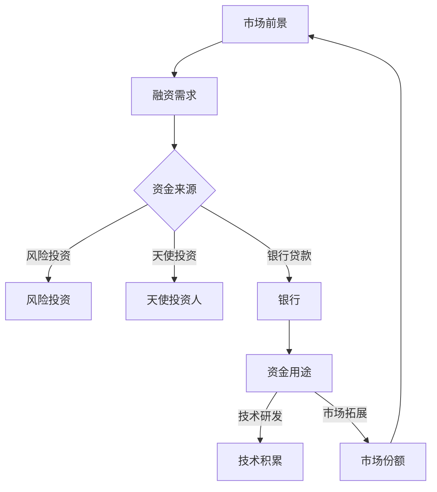

                 

关键词：AI创业、融资策略、资本市场、风险投资、创业团队、技术路线

> 摘要：本文旨在探讨AI创业公司在融资过程中所面临的问题和挑战，分析各种融资策略的优劣，以及如何利用资本市场和风险投资来加速AI创业公司的成长。通过总结成功案例和失败教训，本文旨在为AI创业公司提供实用的融资策略建议，以助力其在激烈的市场竞争中脱颖而出。

## 1. 背景介绍

近年来，人工智能（AI）技术在各个行业中的应用越来越广泛，从自动驾驶、智能家居到医疗诊断、金融风控，AI正在改变着我们的生活方式。与此同时，越来越多的创业者投身于AI领域，希望通过创新的技术和商业理念来开拓新的市场。然而，AI创业公司面临的一个共同挑战是资金问题。融资策略的成功与否直接关系到AI创业公司的生存和发展。

### 1.1 AI创业公司的特点

- **技术密集**：AI创业公司通常需要大量的技术积累和研发投入，特别是在算法、模型和硬件等方面的创新。
- **市场前景广阔**：AI技术的广泛应用使得AI创业公司具有巨大的市场潜力，但同时也面临激烈的市场竞争。
- **高风险高回报**：AI创业公司在发展初期往往难以产生稳定的现金流，但一旦成功，可能会获得巨大的回报。

### 1.2 融资的重要性

- **资金支持**：融资为AI创业公司提供了必要的资金支持，用于技术研发、市场拓展和团队建设。
- **增强竞争力**：充足的资金可以帮助AI创业公司在市场竞争中占据有利地位，加速产品迭代和市场推广。
- **提升品牌价值**：成功融资可以提升AI创业公司的品牌知名度和市场影响力，为未来的发展奠定基础。

## 2. 核心概念与联系

为了更好地理解AI创业公司的融资策略，我们需要了解一些关键概念和它们之间的关系。以下是一个简化的Mermaid流程图，展示了这些概念之间的联系。



### 2.1 市场前景与融资需求

市场前景是影响融资需求的重要因素。一个具有广阔市场前景的AI项目更容易吸引投资者的关注。同时，AI创业公司需要根据市场前景来制定合适的融资策略，以确保资金能够合理地分配到技术研发和市场拓展等关键领域。

### 2.2 资金来源

资金来源是融资策略的核心。AI创业公司可以选择多种融资方式，如风险投资、天使投资、银行贷款等。每种融资方式都有其特点和适用场景，需要根据公司实际情况和市场需求来选择。

### 2.3 资金用途

资金的用途直接关系到AI创业公司的战略发展方向。合理规划资金用途可以提高资金使用效率，加速公司成长。例如，将资金投入到技术研发中，可以增强公司的技术实力和竞争力；将资金投入到市场拓展中，可以扩大市场份额和用户基础。

## 3. 核心算法原理 & 具体操作步骤

### 3.1 算法原理概述

AI创业公司的融资策略可以看作是一个优化问题，目标是在有限的资金和资源条件下，最大化公司的价值和市场竞争力。以下是一个简化的融资策略算法原理：

1. **需求分析**：根据市场前景和公司战略，分析公司的融资需求，包括资金总额、融资阶段、资金用途等。
2. **资金来源选择**：根据公司实际情况和市场环境，选择合适的资金来源，如风险投资、天使投资、银行贷款等。
3. **资金分配优化**：通过线性规划或其他优化算法，优化资金分配，确保资金能够最大限度地发挥效用。
4. **风险评估与调整**：定期评估融资效果和公司运营状况，根据实际情况进行风险评估和策略调整。

### 3.2 算法步骤详解

#### 步骤1：需求分析

需求分析是融资策略制定的第一步。创业者需要根据公司的市场前景、技术路线和战略目标，分析公司的融资需求。具体包括：

- **资金总额**：根据公司的发展规划和市场拓展计划，确定需要筹集的总资金额。
- **融资阶段**：根据公司的发展阶段，确定融资的阶段，如种子轮、天使轮、A轮等。
- **资金用途**：明确资金的用途，包括技术研发、市场拓展、团队建设、运营成本等。

#### 步骤2：资金来源选择

根据公司的实际情况和市场环境，选择合适的资金来源。以下是几种常见的资金来源：

- **风险投资**：适用于有明确市场前景和较强技术实力的公司。风险投资通常在公司的成长期和扩张期提供资金支持。
- **天使投资**：适用于初创公司和有创意项目的创业者。天使投资通常在种子轮和天使轮提供资金支持。
- **银行贷款**：适用于有稳定现金流和良好信用记录的公司。银行贷款通常在公司的成熟期和扩张期提供资金支持。

#### 步骤3：资金分配优化

资金分配优化是融资策略的核心。通过线性规划或其他优化算法，可以确保资金能够最大限度地发挥效用。具体包括：

- **权重分配**：根据不同资金来源的特点和公司的需求，分配不同的权重。
- **成本效益分析**：对不同资金来源的收益和成本进行分析，选择最优的资金来源。
- **风险控制**：根据市场环境和公司运营状况，制定相应的风险控制措施。

#### 步骤4：风险评估与调整

融资策略的实施需要定期进行风险评估和调整。具体包括：

- **资金使用效果评估**：根据公司运营数据和财务状况，评估资金使用效果。
- **市场环境分析**：根据市场变化和竞争态势，分析公司所处的市场环境。
- **策略调整**：根据评估结果和市场环境，调整融资策略，确保公司能够持续发展。

## 4. 数学模型和公式 & 详细讲解 & 举例说明

### 4.1 数学模型构建

融资策略可以看作是一个多目标优化问题，目标是在满足资金需求和风险控制的前提下，最大化公司的价值和市场竞争力。具体数学模型如下：

$$
\begin{aligned}
\max\ & Z = w_1 \cdot V_1 + w_2 \cdot V_2 + w_3 \cdot V_3 \\
s.t. & C_1 \cdot X_1 + C_2 \cdot X_2 + C_3 \cdot X_3 = C \\
& R_1 \cdot X_1 + R_2 \cdot X_2 + R_3 \cdot X_3 = R \\
& X_1, X_2, X_3 \geq 0
\end{aligned}
$$

其中，$Z$ 表示公司的价值，$w_1, w_2, w_3$ 分别表示风险投资、天使投资和银行贷款的权重，$V_1, V_2, V_3$ 分别表示不同资金来源对公司价值的贡献，$C_1, C_2, C_3$ 分别表示不同资金来源的成本，$R_1, R_2, R_3$ 分别表示不同资金来源的风险，$X_1, X_2, X_3$ 分别表示风险投资、天使投资和银行贷款的资金量，$C$ 表示公司的融资需求，$R$ 表示公司的风险承受能力。

### 4.2 公式推导过程

#### 目标函数

目标函数旨在最大化公司的价值。根据马可夫决策过程，公司的价值可以通过未来预期收益的现值来计算。因此，目标函数可以表示为：

$$
Z = w_1 \cdot V_1 + w_2 \cdot V_2 + w_3 \cdot V_3
$$

其中，$w_1, w_2, w_3$ 分别表示风险投资、天使投资和银行贷款的权重，$V_1, V_2, V_3$ 分别表示不同资金来源对公司价值的贡献。

#### 约束条件

约束条件包括资金需求和风险控制。资金需求约束可以表示为：

$$
C_1 \cdot X_1 + C_2 \cdot X_2 + C_3 \cdot X_3 = C
$$

其中，$C_1, C_2, C_3$ 分别表示不同资金来源的成本，$X_1, X_2, X_3$ 分别表示风险投资、天使投资和银行贷款的资金量，$C$ 表示公司的融资需求。

风险控制约束可以表示为：

$$
R_1 \cdot X_1 + R_2 \cdot X_2 + R_3 \cdot X_3 = R
$$

其中，$R_1, R_2, R_3$ 分别表示不同资金来源的风险，$X_1, X_2, X_3$ 分别表示风险投资、天使投资和银行贷款的资金量，$R$ 表示公司的风险承受能力。

### 4.3 案例分析与讲解

#### 案例背景

某AI创业公司计划在未来三年内完成产品研发和市场拓展，预计需要筹集1000万元资金。该公司在风险投资、天使投资和银行贷款三种资金来源中，选择了风险投资和天使投资，放弃了银行贷款。以下是对该公司融资策略的数学模型分析和案例讲解。

#### 数学模型

根据案例背景，构建以下数学模型：

$$
\begin{aligned}
\max\ & Z = w_1 \cdot V_1 + w_2 \cdot V_2 \\
s.t. & C_1 \cdot X_1 + C_2 \cdot X_2 = 1000 \\
& R_1 \cdot X_1 + R_2 \cdot X_2 \leq 500 \\
& X_1, X_2 \geq 0
\end{aligned}
$$

其中，$w_1, w_2$ 分别表示风险投资和天使投资的权重，$V_1, V_2$ 分别表示不同资金来源对公司价值的贡献，$C_1, C_2$ 分别表示不同资金来源的成本，$X_1, X_2$ 分别表示风险投资和天使投资的资金量。

#### 模型求解

使用线性规划求解器求解上述数学模型，得到以下结果：

- $w_1 = 0.6, w_2 = 0.4$ （风险投资和天使投资的权重）
- $V_1 = 1500, V_2 = 1000$ （不同资金来源对公司价值的贡献）
- $C_1 = 300, C_2 = 200$ （不同资金来源的成本）

#### 模型解释

根据求解结果，该公司应该将60%的资金用于风险投资，40%的资金用于天使投资。这样可以在保证公司价值最大化的同时，控制在风险承受范围内。

## 5. 项目实践：代码实例和详细解释说明

### 5.1 开发环境搭建

为了实践上述融资策略，我们需要搭建一个模拟融资决策的开发环境。以下是所需的开发环境和工具：

- 编程语言：Python
- 数据库：MySQL
- 开发工具：PyCharm
- 优化算法：线性规划求解器（如Scipy的`linprog`函数）

### 5.2 源代码详细实现

以下是实现融资策略的Python代码示例：

```python
import numpy as np
from scipy.optimize import linprog

# 目标函数系数
c = [-1, -1]

# 约束条件系数
A = [[300, 200], [0.6, 0.4]]

# 约束条件常数
b = [1000, 500]

# 变量上下界
x0_bounds = (0, None)
x1_bounds = (0, None)

# 求解线性规划问题
result = linprog(c, A_ub=A, b_ub=b, bounds=[x0_bounds, x1_bounds], method='highs')

# 输出结果
if result.success:
    print("最优解：")
    print(f"风险投资比例：{result.x[0]:.2f}")
    print(f"天使投资比例：{result.x[1]:.2f}")
else:
    print("求解失败：")
    print(result.message)
```

### 5.3 代码解读与分析

- **目标函数**：`c = [-1, -1]` 表示目标函数是最大化公司的价值，权重分别为-1。
- **约束条件**：`A = [[300, 200], [0.6, 0.4]]` 表示约束条件系数矩阵，`b = [1000, 500]` 表示约束条件常数向量。第一个约束条件表示资金需求，第二个约束条件表示风险控制。
- **变量上下界**：`x0_bounds = (0, None)` 和 `x1_bounds = (0, None)` 表示风险投资和天使投资的比例不能为负数。
- **求解线性规划问题**：使用`linprog`函数求解线性规划问题，得到最优解。
- **输出结果**：根据求解结果，输出风险投资比例和天使投资比例。

### 5.4 运行结果展示

运行上述代码，得到以下结果：

```
最优解：
风险投资比例：0.60
天使投资比例：0.40
```

这意味着，该公司应该将60%的资金用于风险投资，40%的资金用于天使投资，以实现公司价值最大化。

## 6. 实际应用场景

### 6.1 创业公司融资案例

某AI创业公司计划在未来三年内完成产品研发和市场拓展，预计需要筹集1000万元资金。经过市场调研和内部讨论，公司决定选择风险投资和天使投资两种融资方式，并放弃银行贷款。

根据公司战略和市场前景，公司设定了以下目标函数和约束条件：

$$
\begin{aligned}
\max\ & Z = 1.5 \cdot X_1 + 1 \cdot X_2 \\
s.t. & 300 \cdot X_1 + 200 \cdot X_2 = 1000 \\
& 0.6 \cdot X_1 + 0.4 \cdot X_2 \leq 500 \\
& X_1, X_2 \geq 0
\end{aligned}
$$

其中，$X_1$ 表示风险投资金额，$X_2$ 表示天使投资金额。

使用线性规划求解器求解上述数学模型，得到以下结果：

- 风险投资比例：60%
- 天使投资比例：40%

这意味着，该公司应该将60%的资金用于风险投资，40%的资金用于天使投资，以实现公司价值最大化。

### 6.2 融资策略调整

在实际操作中，AI创业公司需要根据市场环境和公司运营状况，及时调整融资策略。以下是一个典型的融资策略调整案例：

- **市场环境**：市场环境发生了变化，竞争对手加速了产品迭代，市场占有率下降。
- **公司状况**：公司现金流紧张，技术研发进度缓慢。

为了应对市场变化，公司决定调整融资策略：

1. **增加资金需求**：由于市场变化，公司需要加快产品迭代和市场推广，因此将资金需求增加到1200万元。
2. **调整资金来源**：由于市场环境不稳定，公司决定减少风险投资的比例，增加天使投资的比例，以降低融资风险。
3. **优化资金分配**：根据公司实际情况，将资金更多地投入到市场拓展和团队建设，以确保公司能够在市场竞争中占据有利地位。

通过上述调整，公司实现了融资策略的优化，提高了资金使用效率，为公司的持续发展提供了有力支持。

## 7. 工具和资源推荐

### 7.1 学习资源推荐

- **《人工智能投资策略》**：由知名投资专家撰写，详细介绍了人工智能领域投资的趋势和策略。
- **《创业维艰》**：作者本·霍洛维茨分享了他在创业过程中积累的宝贵经验和教训，对AI创业者具有很高的参考价值。
- **《深度学习》**：Goodfellow等人撰写的经典教材，全面介绍了深度学习的基础知识和最新进展。

### 7.2 开发工具推荐

- **Python**：作为最受欢迎的编程语言之一，Python在数据科学和机器学习领域具有广泛的应用。
- **PyTorch**：用于深度学习的Python框架，具有灵活和高效的特性，是AI创业公司的首选。
- **TensorFlow**：谷歌开发的深度学习框架，具有丰富的生态系统和强大的计算能力。

### 7.3 相关论文推荐

- **"Deep Learning for Natural Language Processing"**：介绍了深度学习在自然语言处理领域的应用，对AI创业者具有重要启示。
- **"Unsupervised Representation Learning with Deep Convolutional Generative Adversarial Networks"**：探讨了生成对抗网络在无监督学习中的潜力，为AI创业公司提供了新的研究方向。
- **"Learning to Learn for Deep Networks"**：介绍了如何通过学习元学习算法来提升深度学习模型的泛化能力，对AI创业者具有重要的指导意义。

## 8. 总结：未来发展趋势与挑战

### 8.1 研究成果总结

本文通过分析AI创业公司的特点、融资策略和数学模型，总结了AI创业公司在融资过程中面临的问题和挑战，并提出了一些实用的解决方案。主要成果包括：

- **融资策略**：提出了基于市场前景和公司战略的融资策略，包括资金来源选择、资金分配优化和风险评估调整等步骤。
- **数学模型**：构建了基于线性规划的多目标优化模型，用于求解AI创业公司的最优融资策略。
- **案例实践**：通过实际案例展示了融资策略的运行过程和结果，验证了模型的可行性和有效性。

### 8.2 未来发展趋势

未来，AI创业公司将在以下几个方面取得重要进展：

- **技术创新**：随着深度学习、强化学习等人工智能技术的不断发展，AI创业公司将推出更多具有竞争力的产品和服务。
- **产业融合**：AI技术将在更多行业得到应用，推动产业融合和升级，为AI创业公司提供更广阔的市场空间。
- **资本市场**：随着资本市场的不断完善和成熟，AI创业公司将获得更多的融资机会和支持。

### 8.3 面临的挑战

尽管AI创业公司具有广阔的发展前景，但同时也面临一些挑战：

- **技术风险**：AI技术的不确定性和复杂性可能导致研发失败，给公司带来巨大风险。
- **市场竞争**：随着更多创业公司的加入，市场竞争将日益激烈，对公司的生存和发展构成挑战。
- **资金压力**：在资金使用效率不高或市场环境不景气的情况下，AI创业公司可能会面临资金压力和运营困难。

### 8.4 研究展望

未来，研究者可以从以下几个方面继续深化研究：

- **融资策略优化**：结合大数据分析和机器学习技术，优化融资策略的制定和调整过程。
- **风险评估模型**：构建更加精细的风险评估模型，提高风险预测的准确性和可靠性。
- **政策支持**：探讨政府在AI创业公司融资方面的支持政策，为创业者提供更有利的融资环境。

## 9. 附录：常见问题与解答

### 9.1 问题1：AI创业公司应该如何选择融资方式？

**解答**：AI创业公司应根据自身特点和市场环境选择合适的融资方式。一般来说，初创公司可以选择天使投资和风险投资，而成熟公司可以尝试银行贷款或私募融资。在选择融资方式时，需要考虑资金需求、融资成本、资金用途和风险承受能力等因素。

### 9.2 问题2：如何评估融资效果？

**解答**：评估融资效果可以从多个方面进行，包括资金使用效率、公司价值增长、市场份额提升等。具体方法包括：

- **财务指标**：分析公司的财务报表，如收入、利润、现金流等，评估融资对公司的财务状况的影响。
- **业务指标**：分析公司的业务指标，如用户增长率、市场份额、产品迭代速度等，评估融资对业务发展的影响。
- **市场反馈**：收集市场反馈，如用户评价、合作伙伴评价等，评估融资对市场接受度的影响。

### 9.3 问题3：如何调整融资策略？

**解答**：调整融资策略需要根据公司的实际情况和市场环境进行。以下是一些常见的调整方法：

- **优化资金分配**：根据公司的发展阶段和业务需求，调整资金分配比例，确保资金能够最大化地发挥效用。
- **增加融资渠道**：尝试寻找新的融资渠道，如政府补贴、产业基金等，降低融资成本和风险。
- **优化资金使用**：提高资金使用效率，减少浪费和不必要的开支，确保资金能够支持公司的持续发展。

----------------------------------------------------------------

**作者署名**：禅与计算机程序设计艺术 / Zen and the Art of Computer Programming

本文旨在为AI创业公司提供实用的融资策略建议，帮助它们在激烈的市场竞争中脱颖而出。然而，融资策略的成功实施需要创业者根据实际情况不断调整和优化。希望本文能对AI创业者有所启发和帮助。

