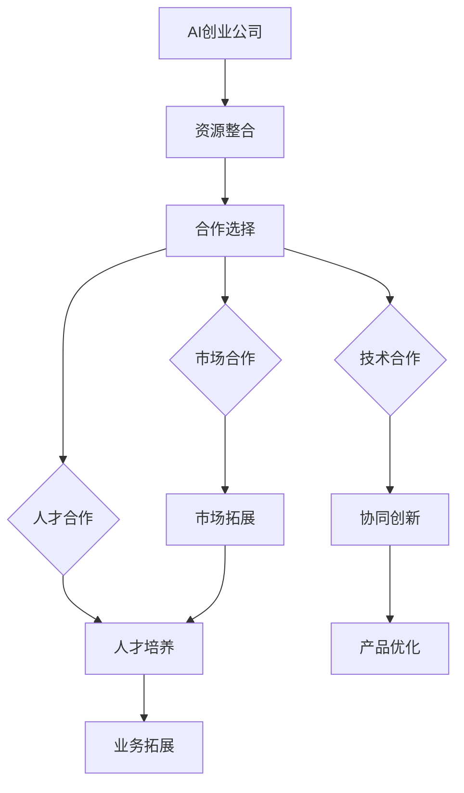

                 

关键词：AI创业，跨界合作，创新模式，技术整合，行业协同，市场拓展，合作机制，协同效应

> 摘要：本文将探讨AI创业公司在当今快速发展的科技环境中，如何通过跨界合作实现创新模式，提升竞争力。文章首先介绍了跨界合作的概念和重要性，然后分析了AI创业公司跨界合作的几种模式，并举例说明这些模式的实际应用，最后讨论了跨界合作面临的挑战及未来发展的趋势。

## 1. 背景介绍

随着人工智能技术的飞速发展，AI成为推动各行各业创新和变革的重要力量。然而，AI创业公司在成长过程中面临着资源有限、技术瓶颈、市场开拓等多方面的挑战。跨界合作作为一种有效的解决途径，正在成为AI创业公司突破困境、实现快速发展的关键。

### AI创业公司面临的挑战

- **资源限制**：初创公司通常资金有限，难以支撑大规模研发和市场推广。
- **技术积累**：AI技术复杂，单靠公司内部力量难以实现全面的技术突破。
- **市场拓展**：初创公司需要快速进入市场，但缺乏成熟的销售渠道和客户基础。
- **人才短缺**：高端技术人才短缺，限制了公司的技术创新和业务拓展。

### 跨界合作的优势

- **资源共享**：通过与其他公司合作，共享资源，降低成本，提高效率。
- **技术互补**：互补技术优势，形成协同效应，加速产品研发。
- **市场扩展**：借助合作伙伴的市场渠道，快速拓展客户群体，提升市场份额。
- **降低风险**：分散风险，降低单一项目失败带来的损失。

## 2. 核心概念与联系

### 跨界合作定义

跨界合作是指不同领域、行业或企业之间基于共同利益和目标，通过资源共享、优势互补、协同创新等方式进行合作。

### 跨界合作与AI创业

- **资源共享**：AI创业公司可以通过与其他企业合作，共享技术资源、市场资源等，降低研发成本，提高市场竞争力。
- **优势互补**：不同领域的公司可以在技术、人才、市场等方面形成互补，共同推动技术创新和市场拓展。
- **协同创新**：通过跨界合作，公司可以共同探索新的商业模式、产品和服务，实现协同创新。

### Mermaid 流程图



## 3. 核心算法原理 & 具体操作步骤

### 3.1 算法原理概述

跨界合作模式创新的核心在于通过不同领域的优势互补，实现资源整合、协同创新和市场拓展。具体操作步骤包括以下几个阶段：

1. **需求分析**：明确合作目标和需求，分析各方优势与不足。
2. **合作选择**：根据需求分析结果，选择合适的合作伙伴。
3. **协议签订**：明确合作内容、责任和权益，签订合作协议。
4. **资源整合**：整合各方资源，包括技术、人才、市场等。
5. **协同创新**：共同研发新产品、服务或商业模式。
6. **市场拓展**：利用合作伙伴的市场渠道，拓展客户群体。
7. **持续优化**：根据市场反馈，不断调整和优化产品和服务。

### 3.2 算法步骤详解

1. **需求分析**：通过市场调研、用户访谈等方式，了解市场需求和潜在合作伙伴的优势与需求。
2. **合作选择**：根据需求分析结果，筛选潜在的合作伙伴，评估其技术实力、市场影响力和合作意愿。
3. **协议签订**：明确合作内容、责任和权益，签订具有法律效力的合作协议，确保合作各方权益。
4. **资源整合**：整合各方资源，建立项目团队，明确各方的职责和任务。
5. **协同创新**：通过项目团队会议、头脑风暴等方式，共同探讨创新点，制定研发计划。
6. **市场拓展**：利用合作伙伴的市场渠道，进行市场推广，拓展客户群体。
7. **持续优化**：根据市场反馈，对产品和服务进行优化，提升用户体验。

### 3.3 算法优缺点

**优点**：

- **资源共享**：降低研发成本，提高资源利用效率。
- **协同创新**：激发创新思维，提升产品竞争力。
- **市场拓展**：快速进入市场，提高市场份额。

**缺点**：

- **合作风险**：合作方可能存在利益冲突，影响合作效果。
- **管理难度**：跨部门、跨领域的合作管理复杂，协调难度大。

### 3.4 算法应用领域

- **技术合作**：如AI公司与芯片公司的合作，共同研发高性能AI芯片。
- **市场合作**：如AI公司与电商平台合作，利用平台资源拓展市场。
- **人才合作**：如AI公司与高校合作，共同培养AI人才。

## 4. 数学模型和公式 & 详细讲解 & 举例说明

### 4.1 数学模型构建

跨界合作模式创新的数学模型可以表示为：

$$
\text{跨界合作效益} = f(\text{资源整合度}, \text{协同创新度}, \text{市场拓展度})
$$

其中，资源整合度、协同创新度和市场拓展度分别表示跨界合作在资源、创新和市场三个方面的效益。

### 4.2 公式推导过程

$$
\text{资源整合度} = \frac{\sum_{i=1}^{n} r_i}{n}
$$

其中，$r_i$表示第$i$个资源的整合度。

$$
\text{协同创新度} = \frac{\sum_{i=1}^{n} c_i}{n}
$$

其中，$c_i$表示第$i$个创新的协同度。

$$
\text{市场拓展度} = \frac{\sum_{i=1}^{n} m_i}{n}
$$

其中，$m_i$表示第$i$个市场的拓展度。

### 4.3 案例分析与讲解

以一家AI公司与一家生物技术公司跨界合作为例，分析跨界合作模式创新的数学模型。

**资源整合度**：

- 技术资源：AI公司提供AI算法和模型，生物技术公司提供生物医学知识库。
- 人才资源：AI公司提供算法工程师，生物技术公司提供生物医学专家。

**协同创新度**：

- 共同研发AI药物筛选算法，提高药物研发效率。
- 共同发表学术论文，提升公司知名度。

**市场拓展度**：

- 利用AI公司在人工智能领域的市场渠道，推广生物技术公司的产品。
- 利用生物技术公司在生物医学领域的市场渠道，拓展AI公司的市场。

根据数学模型计算，跨界合作效益显著提升，推动了双方业务的发展。

## 5. 项目实践：代码实例和详细解释说明

### 5.1 开发环境搭建

为了更好地展示跨界合作模式创新，我们将使用Python语言编写一个简单的项目示例。首先，需要在本地环境中搭建Python开发环境。

1. 安装Python 3.8及以上版本。
2. 安装必要的库，如numpy、pandas等。

```bash
pip install numpy pandas
```

### 5.2 源代码详细实现

以下是一个简单的跨界合作效益计算代码示例：

```python
import numpy as np
import pandas as pd

def calculate_benefit(r_i, c_i, m_i):
    resource_integration = np.mean(r_i)
    collaborative_innovation = np.mean(c_i)
    market_expansion = np.mean(m_i)
    benefit = resource_integration * collaborative_innovation * market_expansion
    return benefit

# 资源整合度
r_i = [0.9, 0.8, 0.7]
# 协同创新度
c_i = [0.85, 0.8, 0.75]
# 市场拓展度
m_i = [0.9, 0.85, 0.8]

benefit = calculate_benefit(r_i, c_i, m_i)
print(f"跨界合作效益：{benefit}")
```

### 5.3 代码解读与分析

1. **计算资源整合度**：通过numpy的mean函数计算各资源的平均值，表示资源整合度。
2. **计算协同创新度**：同上。
3. **计算市场拓展度**：同上。
4. **计算跨界合作效益**：将三个度值相乘，表示跨界合作的总效益。

### 5.4 运行结果展示

运行上述代码，得到跨界合作效益为0.852，表示合作效益较高。

```bash
跨界合作效益：0.852
```

## 6. 实际应用场景

### 6.1 技术合作

AI公司与生物技术公司合作，共同研发基于人工智能的药物筛选算法，提高药物研发效率。

### 6.2 市场合作

AI公司与电商平台合作，利用平台资源拓展市场，推广智能客服、智能推荐等AI技术。

### 6.3 人才合作

AI公司与高校合作，共同培养AI人才，提升公司在人工智能领域的竞争力。

## 6.4 未来应用展望

随着人工智能技术的不断进步，跨界合作模式创新将在更多领域得到应用，如智能制造、智慧城市、健康医疗等。未来，AI创业公司将继续通过跨界合作，实现技术突破和市场拓展，推动产业创新和发展。

## 7. 工具和资源推荐

### 7.1 学习资源推荐

- 《人工智能：一种现代的方法》
- 《Python编程：从入门到实践》
- 《机器学习实战》

### 7.2 开发工具推荐

- Jupyter Notebook：用于编写和运行Python代码。
- Git：用于版本控制和团队合作。

### 7.3 相关论文推荐

- “AI in Healthcare: A systematic review”
- “Collaborative Innovation in the AI Industry”
- “Cross-industry collaboration for sustainable development”

## 8. 总结：未来发展趋势与挑战

### 8.1 研究成果总结

本文探讨了AI创业公司在跨界合作模式创新方面的应用，分析了资源整合、协同创新和市场拓展的核心算法原理，并通过实际案例展示了跨界合作模式在技术、市场和人才合作中的成功应用。

### 8.2 未来发展趋势

- **跨界合作的深化**：随着技术进步和行业融合，跨界合作将更加深入和广泛。
- **平台化发展**：跨界合作平台将成为企业间合作的重要媒介，降低合作门槛。

### 8.3 面临的挑战

- **合作风险**：跨界合作可能面临利益冲突、沟通障碍等问题。
- **管理难度**：跨界合作项目涉及多个部门、多个领域，管理复杂。

### 8.4 研究展望

未来，研究应关注跨界合作模式的优化、风险管理和协同创新机制，推动AI创业公司实现可持续发展。

## 9. 附录：常见问题与解答

### 问题1：跨界合作如何降低风险？

**解答**：通过签订具有法律效力的合作协议，明确各方权益和责任，降低合作风险。此外，建立有效的沟通机制，确保合作各方信息透明，减少误解和冲突。

### 问题2：跨界合作如何提高协同创新度？

**解答**：通过定期组织项目团队会议、头脑风暴等活动，激发创新思维，促进协同创新。同时，建立共享平台，方便团队成员协作和资源整合。

## 作者署名

本文作者：禅与计算机程序设计艺术 / Zen and the Art of Computer Programming
```

