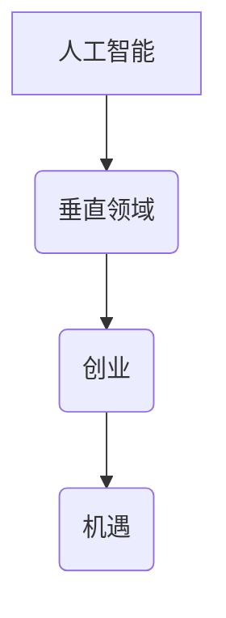

                 

在当今快速发展的技术时代，人工智能（AI）已经成为各行各业变革的催化剂。从医疗保健到金融服务，从制造业到交通运输，AI技术的应用正在重塑我们的世界。在这个充满机遇的时代，垂直领域的AI创业成为了一个备受关注的话题。本文将深入探讨垂直领域AI创业的广阔前景，分析其中的关键因素，并探讨未来可能的发展趋势。

## 1. 背景介绍

人工智能自21世纪以来取得了飞速的发展。随着计算能力的提升、大数据的普及和算法的进步，AI在多个领域都展现出了强大的潜力。特别是在深度学习、自然语言处理和计算机视觉等前沿技术领域的突破，使得AI能够在复杂任务中表现出类人智能。这种技术进步不仅推动了传统行业的升级转型，也为创业者提供了前所未有的机会。

垂直领域AI创业是指将人工智能技术应用于特定的行业或领域，如医疗、金融、农业、教育等。与通用人工智能（AGI）不同，垂直领域AI创业专注于特定问题的解决，更具有针对性和实用性。随着AI技术的不断成熟，垂直领域的创业机会日益增多，吸引了众多投资者的目光。

### AI技术发展历程

- **早期阶段**：20世纪50年代至70年代，AI研究主要集中在符号推理和知识表示上。虽然取得了一些理论上的突破，但受限于计算能力和数据规模，AI应用仍处于初级阶段。

- **复兴阶段**：20世纪80年代至90年代，专家系统和机器学习开始兴起，AI在特定领域取得了显著的应用成果，如医疗诊断和金融风险评估。

- **深度学习时代**：21世纪初，随着深度学习的兴起，AI技术迎来了新一轮的快速发展。深度学习模型在图像识别、语音识别和自然语言处理等方面取得了突破性进展，使得AI在更多领域得到应用。

### 垂直领域AI创业的发展

- **市场需求**：随着AI技术的成熟，企业和消费者对AI解决方案的需求不断增加。特别是在数字化转型的大背景下，垂直领域AI创业迎来了市场机遇。

- **投资趋势**：近年来，垂直领域AI创业项目吸引了大量风险投资。投资者看好的不仅是技术本身，更是这些技术带来的商业价值。

- **创新应用**：从智能医疗诊断到智能农业，从智能金融到智能教育，垂直领域AI创业正在不断拓展AI技术的应用边界。

## 2. 核心概念与联系

为了更好地理解垂直领域AI创业，我们需要先了解几个核心概念：人工智能、垂直领域、创业和机遇。

### 人工智能（AI）

人工智能是指使计算机系统能够模拟人类智能行为的科学技术。它包括机器学习、深度学习、自然语言处理、计算机视觉等多个子领域。AI的目标是让计算机能够自主学习、推理和解决问题，从而实现智能化。

### 垂直领域

垂直领域是指某一特定的行业或领域，如医疗、金融、农业、教育等。与通用领域不同，垂直领域具有特定的需求和问题，因此更容易找到针对性的解决方案。

### 创业

创业是指创立一家新公司或创新项目，通过解决市场需求实现商业价值。创业不仅需要创新的技术，还需要商业模式的构思、市场策略的制定和团队的协作。

### 机遇

机遇是指在企业或个人面临的机会，通常与市场趋势、技术进步和社会需求相关。对于垂直领域AI创业来说，机遇意味着找到合适的切入点，利用AI技术解决实际问题。

### Mermaid 流程图

下面是一个简单的Mermaid流程图，用于展示上述核心概念之间的联系：



### Mermaid 流程节点

| 流程节点    | 说明                                                         |
| ----------- | ------------------------------------------------------------ |
| A[人工智能] | 代表人工智能，是整个流程的起点。                           |
| B(垂直领域) | 代表垂直领域，是人工智能应用的具体场景。                   |
| C(创业)     | 代表创业，是利用人工智能和垂直领域技术实现商业价值的途径。 |
| D(机遇)     | 代表机遇，是创业者面临的机会和挑战。                      |

通过这个流程图，我们可以清晰地看到人工智能、垂直领域、创业和机遇之间的关联，以及它们在垂直领域AI创业中的重要性。

## 3. 核心算法原理 & 具体操作步骤

### 3.1 算法原理概述

在垂直领域AI创业中，算法原理是关键。这里我们介绍一种常用的算法——深度神经网络（DNN）。

深度神经网络是一种基于多层感知器（MLP）的神经网络，通过多层的非线性变换，对输入数据进行特征提取和模式识别。DNN的基本原理包括以下几个部分：

1. **前向传播**：输入数据从输入层经过多层隐藏层，直到输出层，每层神经元都对输入数据进行加权求和并应用一个激活函数。

2. **反向传播**：通过计算输出层的误差，将误差反向传播到输入层，更新各层神经元的权重。

3. **优化算法**：使用梯度下降等优化算法，不断调整网络参数，使输出误差最小。

### 3.2 算法步骤详解

1. **数据预处理**：对输入数据进行标准化处理，如归一化、标准化等，以消除数据规模差异。

2. **模型构建**：定义网络结构，包括输入层、隐藏层和输出层。选择合适的激活函数，如ReLU、Sigmoid、Tanh等。

3. **前向传播**：输入数据通过网络，从输入层传递到输出层，计算输出结果。

4. **误差计算**：计算输出结果与真实值的差异，即误差。

5. **反向传播**：将误差反向传播到输入层，更新各层神经元的权重。

6. **优化参数**：使用优化算法，如梯度下降、Adam等，调整网络参数。

7. **迭代训练**：重复上述步骤，直到满足训练要求，如误差阈值或迭代次数。

### 3.3 算法优缺点

**优点**：

- **强大的特征提取能力**：DNN能够通过多层结构对输入数据进行复杂的特征提取。
- **适用性广泛**：DNN在图像识别、语音识别、自然语言处理等领域都有广泛应用。
- **高精度**：DNN在大量数据训练下可以达到很高的预测精度。

**缺点**：

- **计算复杂度高**：DNN需要大量的计算资源和时间进行训练。
- **过拟合风险**：DNN容易在训练数据上过拟合，导致在测试数据上表现不佳。
- **参数调优复杂**：DNN的参数调优需要大量实验和经验。

### 3.4 算法应用领域

DNN在垂直领域AI创业中具有广泛的应用，以下是一些典型的应用场景：

1. **医疗诊断**：使用DNN对医疗图像进行诊断，如肺癌筛查、脑肿瘤检测等。
2. **金融风控**：使用DNN对金融数据进行分析，如信用评分、欺诈检测等。
3. **智能农业**：使用DNN对农作物生长环境进行监控，如土壤湿度检测、病虫害识别等。
4. **智能教育**：使用DNN为学生提供个性化的学习推荐，如自适应学习系统、智能题库等。

## 4. 数学模型和公式 & 详细讲解 & 举例说明

### 4.1 数学模型构建

深度神经网络（DNN）的数学模型主要包括两部分：前向传播和反向传播。

#### 前向传播

前向传播是指输入数据通过网络从输入层传递到输出层的计算过程。具体步骤如下：

1. **初始化参数**：定义输入层、隐藏层和输出层的神经元数量，以及各层的权重和偏置。
2. **加权求和**：对于每个神经元，计算输入数据的加权求和，即 \(z = \sum_{j} w_{ij}x_{j} + b_i\)。
3. **应用激活函数**：对加权求和的结果应用激活函数，如ReLU、Sigmoid、Tanh等，得到神经元的输出 \(a_i = \phi(z)\)。
4. **传递到下一层**：将当前层的输出作为下一层的输入，重复上述步骤，直到输出层。

#### 反向传播

反向传播是指通过计算输出层的误差，将误差反向传播到输入层，更新各层神经元的权重和偏置。具体步骤如下：

1. **计算输出误差**：对于输出层，计算输出结果与真实值之间的误差，即 \(d_{k} = y_{k} - \hat{y}_{k}\)。
2. **计算误差梯度**：对于每个神经元，计算误差梯度，即 \( \frac{\partial E}{\partial w_{ij}} = \delta_{i}\odot a_{j}\)。
3. **更新权重和偏置**：使用梯度下降等优化算法，更新各层的权重和偏置，即 \(w_{ij} \leftarrow w_{ij} - \alpha \frac{\partial E}{\partial w_{ij}}\) 和 \(b_i \leftarrow b_i - \alpha \frac{\partial E}{\partial b_i}\)。
4. **反向传播**：将误差梯度反向传播到输入层，重复上述步骤，直到输入层。

### 4.2 公式推导过程

下面以一个简单的DNN模型为例，介绍前向传播和反向传播的公式推导过程。

#### 前向传播

假设一个包含一个输入层、两个隐藏层和一个输出层的DNN模型，其参数为 \(W^{(1)}, b^{(1)}, W^{(2)}, b^{(2)}, W^{(3)}, b^{(3)}\)。

1. **输入层到第一隐藏层**：

   \[
   z^{(1)}_{ij} = \sum_{k} W^{(1)}_{ik}x_{k} + b^{(1)}_{i}
   \]

   \[
   a^{(1)}_{ij} = \phi(z^{(1)}_{ij})
   \]

2. **第一隐藏层到第二隐藏层**：

   \[
   z^{(2)}_{ij} = \sum_{k} W^{(2)}_{ik}a^{(1)}_{kj} + b^{(2)}_{i}
   \]

   \[
   a^{(2)}_{ij} = \phi(z^{(2)}_{ij})
   \]

3. **第二隐藏层到输出层**：

   \[
   z^{(3)}_{ij} = \sum_{k} W^{(3)}_{ik}a^{(2)}_{kj} + b^{(3)}_{i}
   \]

   \[
   \hat{y}_{ij} = \sigma(z^{(3)}_{ij})
   \]

#### 反向传播

1. **输出层误差计算**：

   \[
   d^{(3)}_{ij} = \hat{y}_{ij} - y_{ij}
   \]

2. **误差梯度计算**：

   \[
   \delta^{(3)}_{ij} = \frac{\partial E}{\partial z^{(3)}_{ij}} = \frac{\partial E}{\partial \hat{y}_{ij}} \cdot \frac{\partial \hat{y}_{ij}}{\partial z^{(3)}_{ij}} = \sigma'(z^{(3)}_{ij}) \cdot d^{(3)}_{ij}
   \]

3. **更新输出层权重和偏置**：

   \[
   W^{(3)}_{ij} \leftarrow W^{(3)}_{ij} - \alpha \frac{\partial E}{\partial W^{(3)}_{ij}} = W^{(3)}_{ij} - \alpha \sum_{k} a^{(2)}_{kj} \cdot \delta^{(3)}_{ik}
   \]

   \[
   b^{(3)}_{i} \leftarrow b^{(3)}_{i} - \alpha \frac{\partial E}{\partial b^{(3)}_{i}} = b^{(3)}_{i} - \alpha \sum_{k} \delta^{(3)}_{ik}
   \]

4. **第二隐藏层误差计算**：

   \[
   d^{(2)}_{ij} = \sum_{k} W^{(3)}_{ik} \cdot \delta^{(3)}_{ik}
   \]

5. **误差梯度计算**：

   \[
   \delta^{(2)}_{ij} = \frac{\partial E}{\partial z^{(2)}_{ij}} = \frac{\partial E}{\partial a^{(2)}_{ij}} \cdot \frac{\partial a^{(2)}_{ij}}{\partial z^{(2)}_{ij}} = \phi'(z^{(2)}_{ij}) \cdot \sum_{k} W^{(3)}_{ik} \cdot \delta^{(3)}_{ik}
   \]

6. **更新第二隐藏层权重和偏置**：

   \[
   W^{(2)}_{ij} \leftarrow W^{(2)}_{ij} - \alpha \frac{\partial E}{\partial W^{(2)}_{ij}} = W^{(2)}_{ij} - \alpha \sum_{k} a^{(1)}_{kj} \cdot \delta^{(2)}_{ik}
   \]

   \[
   b^{(2)}_{i} \leftarrow b^{(2)}_{i} - \alpha \frac{\partial E}{\partial b^{(2)}_{i}} = b^{(2)}_{i} - \alpha \sum_{k} \delta^{(2)}_{ik}
   \]

7. **第一隐藏层误差计算**：

   \[
   d^{(1)}_{ij} = \sum_{k} W^{(2)}_{ik} \cdot \delta^{(2)}_{ik}
   \]

8. **误差梯度计算**：

   \[
   \delta^{(1)}_{ij} = \frac{\partial E}{\partial z^{(1)}_{ij}} = \frac{\partial E}{\partial a^{(1)}_{ij}} \cdot \frac{\partial a^{(1)}_{ij}}{\partial z^{(1)}_{ij}} = \phi'(z^{(1)}_{ij}) \cdot \sum_{k} W^{(2)}_{ik} \cdot \delta^{(2)}_{ik}
   \]

9. **更新第一隐藏层权重和偏置**：

   \[
   W^{(1)}_{ij} \leftarrow W^{(1)}_{ij} - \alpha \frac{\partial E}{\partial W^{(1)}_{ij}} = W^{(1)}_{ij} - \alpha \sum_{k} x_{k} \cdot \delta^{(1)}_{ik}
   \]

   \[
   b^{(1)}_{i} \leftarrow b^{(1)}_{i} - \alpha \frac{\partial E}{\partial b^{(1)}_{i}} = b^{(1)}_{i} - \alpha \sum_{k} \delta^{(1)}_{ik}
   \]

### 4.3 案例分析与讲解

为了更好地理解DNN的数学模型，我们来看一个具体的案例：使用DNN进行手写数字识别。

#### 数据集

我们使用MNIST数据集，它包含60,000个训练图像和10,000个测试图像，每个图像都是28x28的二值图像，表示0到9的手写数字。

#### 模型构建

我们构建一个简单的DNN模型，包含一个输入层、一个隐藏层和一个输出层。输入层有28x28=784个神经元，隐藏层有500个神经元，输出层有10个神经元。

#### 前向传播

假设我们有一个输入图像，其像素值表示为一个784维向量 \(x\)。首先，我们将 \(x\) 输入到输入层，然后通过隐藏层和输出层，最终得到一个10维的输出向量 \(\hat{y}\)。

1. **输入层到隐藏层**：

   \[
   z^{(1)}_{ij} = \sum_{k} W^{(1)}_{ik}x_{k} + b^{(1)}_{i}
   \]

   \[
   a^{(1)}_{ij} = \phi(z^{(1)}_{ij})
   \]

2. **隐藏层到输出层**：

   \[
   z^{(2)}_{ij} = \sum_{k} W^{(2)}_{ik}a^{(1)}_{kj} + b^{(2)}_{i}
   \]

   \[
   a^{(2)}_{ij} = \phi(z^{(2)}_{ij})
   \]

3. **输出层**：

   \[
   z^{(3)}_{ij} = \sum_{k} W^{(3)}_{ik}a^{(2)}_{kj} + b^{(3)}_{i}
   \]

   \[
   \hat{y}_{ij} = \sigma(z^{(3)}_{ij})
   \]

#### 反向传播

接下来，我们通过反向传播更新网络参数。

1. **输出层误差计算**：

   \[
   d^{(3)}_{ij} = \hat{y}_{ij} - y_{ij}
   \]

   其中 \(y\) 是真实标签，\(\hat{y}\) 是预测结果。

2. **误差梯度计算**：

   \[
   \delta^{(3)}_{ij} = \sigma'(z^{(3)}_{ij}) \cdot d^{(3)}_{ij}
   \]

3. **更新输出层权重和偏置**：

   \[
   W^{(3)}_{ij} \leftarrow W^{(3)}_{ij} - \alpha \sum_{k} a^{(2)}_{kj} \cdot \delta^{(3)}_{ik}
   \]

   \[
   b^{(3)}_{i} \leftarrow b^{(3)}_{i} - \alpha \sum_{k} \delta^{(3)}_{ik}
   \]

4. **第二隐藏层误差计算**：

   \[
   d^{(2)}_{ij} = \sum_{k} W^{(3)}_{ik} \cdot \delta^{(3)}_{ik}
   \]

5. **误差梯度计算**：

   \[
   \delta^{(2)}_{ij} = \phi'(z^{(2)}_{ij}) \cdot \sum_{k} W^{(3)}_{ik} \cdot \delta^{(3)}_{ik}
   \]

6. **更新第二隐藏层权重和偏置**：

   \[
   W^{(2)}_{ij} \leftarrow W^{(2)}_{ij} - \alpha \sum_{k} a^{(1)}_{kj} \cdot \delta^{(2)}_{ik}
   \]

   \[
   b^{(2)}_{i} \leftarrow b^{(2)}_{i} - \alpha \sum_{k} \delta^{(2)}_{ik}
   \]

7. **第一隐藏层误差计算**：

   \[
   d^{(1)}_{ij} = \sum_{k} W^{(2)}_{ik} \cdot \delta^{(2)}_{ik}
   \]

8. **误差梯度计算**：

   \[
   \delta^{(1)}_{ij} = \phi'(z^{(1)}_{ij}) \cdot \sum_{k} W^{(2)}_{ik} \cdot \delta^{(2)}_{ik}
   \]

9. **更新第一隐藏层权重和偏置**：

   \[
   W^{(1)}_{ij} \leftarrow W^{(1)}_{ij} - \alpha \sum_{k} x_{k} \cdot \delta^{(1)}_{ik}
   \]

   \[
   b^{(1)}_{i} \leftarrow b^{(1)}_{i} - \alpha \sum_{k} \delta^{(1)}_{ik}
   \]

通过这个案例，我们可以看到DNN的数学模型是如何工作的，以及如何通过反向传播更新网络参数。

## 5. 项目实践：代码实例和详细解释说明

### 5.1 开发环境搭建

在开始项目实践之前，我们需要搭建一个合适的开发环境。这里我们使用Python作为主要编程语言，结合TensorFlow作为深度学习框架。

**步骤如下**：

1. **安装Python**：确保Python 3.x版本已安装，推荐使用Anaconda来管理环境。

2. **安装TensorFlow**：在命令行中执行以下命令安装TensorFlow：

   ```bash
   pip install tensorflow
   ```

3. **创建项目文件夹**：在合适的位置创建一个项目文件夹，并在其中创建一个名为`main.py`的Python文件。

4. **导入所需库**：在`main.py`中导入必要的库：

   ```python
   import tensorflow as tf
   import numpy as np
   import matplotlib.pyplot as plt
   ```

### 5.2 源代码详细实现

下面是一个简单的DNN模型实现，用于手写数字识别。我们使用MNIST数据集进行训练和测试。

```python
# 导入MNIST数据集
mnist = tf.keras.datasets.mnist
(train_images, train_labels), (test_images, test_labels) = mnist.load_data()

# 数据预处理
train_images = train_images / 255.0
test_images = test_images / 255.0

# 构建DNN模型
model = tf.keras.Sequential([
    tf.keras.layers.Flatten(input_shape=(28, 28)),
    tf.keras.layers.Dense(512, activation='relu'),
    tf.keras.layers.Dense(10, activation='softmax')
])

# 编译模型
model.compile(optimizer='adam',
              loss='sparse_categorical_crossentropy',
              metrics=['accuracy'])

# 训练模型
model.fit(train_images, train_labels, epochs=5)

# 测试模型
test_loss, test_acc = model.evaluate(test_images, test_labels)
print(f"Test accuracy: {test_acc:.2f}")

# 预测
predictions = model.predict(test_images)
predicted_labels = np.argmax(predictions, axis=1)

# 可视化预测结果
plt.figure(figsize=(10, 10))
for i in range(25):
    plt.subplot(5, 5, i+1)
    plt.imshow(test_images[i], cmap=plt.cm.binary)
    plt.xticks([])
    plt.yticks([])
    plt.grid(False)
    plt.xlabel(str(predicted_labels[i]))
plt.show()
```

### 5.3 代码解读与分析

#### 数据预处理

我们首先导入MNIST数据集，并对其进行预处理。将图像数据从0到255的整数范围缩放到0到1之间，以便于神经网络训练。

```python
train_images = train_images / 255.0
test_images = test_images / 255.0
```

#### 模型构建

接下来，我们构建一个简单的DNN模型，包含一个输入层、一个隐藏层和一个输出层。输入层使用`Flatten`层将图像展平为1D向量，隐藏层使用`Dense`层实现全连接神经网络，输出层使用`softmax`激活函数进行分类。

```python
model = tf.keras.Sequential([
    tf.keras.layers.Flatten(input_shape=(28, 28)),
    tf.keras.layers.Dense(512, activation='relu'),
    tf.keras.layers.Dense(10, activation='softmax')
])
```

#### 编译模型

在编译模型时，我们指定优化器为`adam`，损失函数为`sparse_categorical_crossentropy`，并设置`accuracy`作为评价指标。

```python
model.compile(optimizer='adam',
              loss='sparse_categorical_crossentropy',
              metrics=['accuracy'])
```

#### 训练模型

我们使用训练数据集进行5个周期的训练。

```python
model.fit(train_images, train_labels, epochs=5)
```

#### 测试模型

训练完成后，我们使用测试数据集对模型进行评估，并打印出测试准确率。

```python
test_loss, test_acc = model.evaluate(test_images, test_labels)
print(f"Test accuracy: {test_acc:.2f}")
```

#### 预测和可视化

最后，我们使用模型对测试数据集进行预测，并可视化预测结果。

```python
predictions = model.predict(test_images)
predicted_labels = np.argmax(predictions, axis=1)

plt.figure(figsize=(10, 10))
for i in range(25):
    plt.subplot(5, 5, i+1)
    plt.imshow(test_images[i], cmap=plt.cm.binary)
    plt.xticks([])
    plt.yticks([])
    plt.grid(False)
    plt.xlabel(str(predicted_labels[i]))
plt.show()
```

通过这个简单的项目实践，我们可以看到如何使用深度神经网络实现手写数字识别。这个过程展示了从数据预处理到模型构建、训练、测试和预测的完整流程。

## 6. 实际应用场景

### 6.1 医疗领域

在医疗领域，人工智能的应用已经深入到诊断、治疗和患者管理等多个方面。例如，AI可以在医疗影像分析中帮助医生更准确地识别病变，如肺癌和乳腺癌。通过深度学习算法，AI系统可以从大量医学影像数据中学习，提高诊断的准确率和效率。此外，AI还可以用于个性化治疗方案的推荐，根据患者的病情和历史数据提供最佳治疗方案。

### 6.2 金融领域

在金融领域，人工智能主要用于风险管理、欺诈检测和投资策略优化。AI系统可以通过分析大量的交易数据和客户行为，预测潜在的风险并采取措施防范。例如，AI可以检测到异常交易行为，从而识别和防止欺诈活动。此外，AI还可以通过分析市场数据，提供智能投资建议，提高投资决策的准确性。

### 6.3 农业领域

在农业领域，人工智能可以帮助农民提高产量、降低成本并减少环境影响。通过使用AI技术，农民可以实时监测土壤湿度、温度和作物生长状况，从而做出更科学的灌溉和施肥决策。例如，AI可以通过图像识别技术分析农作物叶片的颜色和形态，及时发现病虫害并进行防治。此外，AI还可以优化农业机械的操作，提高农业生产的效率。

### 6.4 教育领域

在教育领域，人工智能可以提供个性化学习体验和智能教育评估。AI系统可以根据学生的学习习惯和能力，为其推荐合适的学习内容和进度，从而提高学习效果。例如，AI可以通过自然语言处理技术，分析学生的学习反馈和作业情况，为其提供个性化的学习建议。此外，AI还可以用于自动批改作业和考试，提高评估的效率和准确性。

### 6.5 交通运输领域

在交通运输领域，人工智能可以提高交通流量管理、车辆安全和运输效率。例如，AI可以通过智能交通系统，实时监控交通状况，并提供最优路线规划，减少交通拥堵。此外，AI还可以用于自动驾驶汽车，提高行车安全，减少交通事故。例如，Waymo和特斯拉等公司已经在自动驾驶技术方面取得了显著进展，为未来的智能交通网络铺平了道路。

### 6.6 制造业领域

在制造业领域，人工智能可以提高生产效率、质量控制和设备维护。通过使用AI技术，制造商可以实时监控生产设备的状态，预测设备故障并进行预防性维护。例如，AI可以通过分析生产数据和传感器数据，识别生产过程中的潜在问题，并提出优化建议。此外，AI还可以用于智能机器人，提高生产自动化程度，降低人力成本。

### 6.7 供应链管理

在供应链管理领域，人工智能可以优化库存管理、物流优化和供应链预测。AI系统可以通过分析历史数据和市场趋势，预测需求变化，优化库存水平，减少库存成本。此外，AI还可以用于物流优化，通过分析交通状况和配送路线，提供最优的物流方案，提高物流效率。

### 6.8 公共安全领域

在公共安全领域，人工智能可以用于监控和预测犯罪活动，提高公共安全。例如，AI可以通过分析大量视频数据，识别异常行为和潜在犯罪活动，并及时报警。此外，AI还可以用于智能安防系统，提高安防设备的智能化程度，提高安保效率。

通过上述实际应用场景，我们可以看到人工智能在各个垂直领域的广泛应用和潜力。随着AI技术的不断成熟，这些应用场景将更加广泛和深入，为各行各业带来更多的创新和变革。

## 7. 工具和资源推荐

在探索垂直领域AI创业的过程中，选择合适的工具和资源是至关重要的。以下是一些建议，可以帮助您在开发AI项目时更加高效和有成效。

### 7.1 学习资源推荐

1. **在线课程**：Coursera、edX和Udacity等在线教育平台提供了丰富的AI和机器学习课程。例如，斯坦福大学的“深度学习”课程和吴恩达（Andrew Ng）教授的“机器学习”课程都是非常有名的入门资源。

2. **书籍**：对于深入理解AI和深度学习，一些经典的书籍不可错过。例如，Goodfellow、Bengio和Courville合著的《深度学习》（Deep Learning）是一本权威的参考书。此外，《模式识别与机器学习》（Pattern Recognition and Machine Learning）和《Python机器学习》（Python Machine Learning）也是优秀的资源。

3. **学术论文**：Google Scholar、arXiv和ACM Digital Library等平台是获取最新研究成果的重要渠道。通过阅读学术论文，您可以了解最新的技术进展和应用案例。

### 7.2 开发工具推荐

1. **深度学习框架**：TensorFlow、PyTorch和Keras是当前最流行的深度学习框架。这些框架提供了丰富的API和工具，方便开发者快速构建和训练模型。

2. **数据处理工具**：Pandas、NumPy和SciPy等Python库在数据预处理和分析中非常有用。这些工具可以帮助您清洗数据、进行特征提取和数据分析。

3. **版本控制**：Git是一个强大的版本控制系统，可以帮助您管理代码变更和协作开发。GitHub和GitLab等平台提供了在线仓库和协作功能，方便团队共享和协作。

4. **调试工具**：Jupyter Notebook、Google Colab和PyCharm等工具提供了交互式开发和调试功能，使得代码编写和实验更加便捷。

### 7.3 相关论文推荐

1. **“Deep Learning”**：由Ian Goodfellow、Yoshua Bengio和Aaron Courville合著的《深度学习》论文，详细介绍了深度学习的基本概念和技术。

2. **“Convolutional Neural Networks for Visual Recognition”**：由Geoffrey Hinton、Oriol Vinyals和Andrew Senior合著的这篇论文，介绍了卷积神经网络在视觉识别任务中的应用。

3. **“Recurrent Neural Networks: A Overview”**：这篇综述文章由Yoshua Bengio等人撰写，全面介绍了循环神经网络的基本原理和应用。

4. **“Deep Learning for Natural Language Processing”**：由Tomáš Mikolov、Ilya Sutskever和Quoc V. Le等人撰写的这篇论文，探讨了深度学习在自然语言处理领域的应用。

通过这些工具和资源的支持，您可以更加系统地学习和实践AI技术，为垂直领域AI创业打下坚实的基础。

## 8. 总结：未来发展趋势与挑战

### 8.1 研究成果总结

在过去的几十年里，人工智能取得了显著的进展，从理论到实践都发生了深刻的变革。深度学习、自然语言处理和计算机视觉等核心技术的突破，使得AI在各个垂直领域展现了强大的应用潜力。例如，在医疗领域，AI技术在医疗影像分析、疾病诊断和治疗建议等方面取得了显著成果；在金融领域，AI技术被广泛应用于风险管理、欺诈检测和投资策略优化；在农业领域，AI技术提高了农业生产效率和可持续发展水平。这些研究成果不仅推动了传统行业的升级转型，也为垂直领域AI创业提供了丰富的经验和借鉴。

### 8.2 未来发展趋势

随着AI技术的不断成熟和应用的深入，未来发展趋势将更加多元化和综合化：

1. **跨领域融合**：AI技术将与其他前沿技术如物联网、大数据和区块链等深度融合，产生新的应用模式和商业模式。

2. **自动化和智能化**：AI技术将进一步推动自动化和智能化水平的提升，如自动驾驶、智能制造和智能城市等领域的应用将更加广泛。

3. **数据隐私和安全**：随着AI技术的普及，数据隐私和安全问题将变得越来越重要。未来的研究和应用将更加注重数据保护和个人隐私的保障。

4. **社会伦理和责任**：随着AI技术的广泛应用，社会伦理和责任问题也将日益突出。如何确保AI技术的公正性、透明性和可解释性，将是未来研究和应用的重要方向。

### 8.3 面临的挑战

尽管AI技术在垂直领域展示了广阔的应用前景，但仍然面临一些重要的挑战：

1. **数据质量与隐私**：高质量的训练数据是AI模型有效性的基础，但数据的质量和隐私保护仍然是重要挑战。如何平衡数据共享与隐私保护，需要政策和技术手段的双重保障。

2. **算法公平性**：AI算法的公平性和透明性是公众关心的问题。如何在算法设计和应用过程中确保公平性，减少偏见，是一个需要解决的关键问题。

3. **技术可解释性**：随着深度学习等复杂算法的广泛应用，如何提高算法的可解释性，使其对用户和监管机构更加透明，是一个重要的研究方向。

4. **计算资源和成本**：深度学习模型通常需要大量的计算资源和时间进行训练，这增加了开发和部署的难度。如何降低计算成本，提高模型效率，是一个亟待解决的问题。

### 8.4 研究展望

针对上述挑战，未来的研究可以从以下几个方面展开：

1. **数据增强与隐私保护**：通过数据增强技术提高模型泛化能力，同时研究隐私保护算法，如差分隐私和联邦学习，以保障数据隐私。

2. **算法可解释性**：发展新的方法和技术，如注意力机制和可视化工具，提高AI模型的可解释性，增强用户信任。

3. **跨学科研究**：推动计算机科学、心理学、社会学等领域的跨学科合作，从多角度解决AI技术应用的伦理和社会问题。

4. **模型压缩与优化**：研究模型压缩和优化技术，如网络剪枝和量化，以提高模型效率和可部署性。

通过不断的研究和实践，我们可以期待AI技术在垂直领域的应用将更加成熟和广泛，为社会的可持续发展带来更多的创新和变革。

## 9. 附录：常见问题与解答

### Q1. 如何选择垂直领域进行AI创业？

**A1.** 选择垂直领域进行AI创业时，需要考虑以下几个因素：

1. **市场需求**：选择一个市场需求旺盛、有商业潜力的领域。
2. **技术可行性**：评估所选领域内已有技术基础和发展潜力。
3. **数据资源**：确保有足够的高质量数据用于模型训练。
4. **竞争态势**：分析市场竞争对手的情况，找到自己的独特优势。

### Q2. AI技术在垂直领域应用的主要挑战是什么？

**A2.** AI技术在垂直领域应用的主要挑战包括：

1. **数据质量和隐私**：高质量数据是模型有效性的基础，但数据隐私保护也是重要问题。
2. **算法公平性**：算法的公平性和透明性是公众关注的焦点。
3. **技术可解释性**：复杂的AI模型往往缺乏透明性，影响用户信任。
4. **计算资源与成本**：深度学习模型训练需要大量的计算资源和时间。

### Q3. 如何确保AI算法的公平性和透明性？

**A3.** 确保AI算法的公平性和透明性可以通过以下方法：

1. **数据预处理**：确保数据集的多样性和代表性，减少数据偏差。
2. **算法设计**：使用无偏算法，避免算法偏见。
3. **模型可解释性**：开发可解释的AI模型，如集成学习方法，提供决策过程透明性。
4. **第三方评估**：进行独立的算法评估，确保算法的公正性。

### Q4. 如何应对AI技术带来的社会伦理问题？

**A4.** 应对AI技术带来的社会伦理问题可以通过以下几个方面：

1. **立法和监管**：制定相关法律法规，规范AI技术的研发和应用。
2. **公众教育**：提高公众对AI技术的了解和认知，增强公众参与。
3. **道德准则**：建立AI技术的道德准则，引导行业健康发展。
4. **跨学科合作**：推动计算机科学、心理学、社会学等领域的跨学科合作，共同解决AI伦理问题。

通过上述问题和解答，我们希望对垂直领域AI创业提供一些实用的指导和建议。在不断探索和创新的过程中，共同推动AI技术的健康发展和广泛应用。作者：禅与计算机程序设计艺术 / Zen and the Art of Computer Programming。

