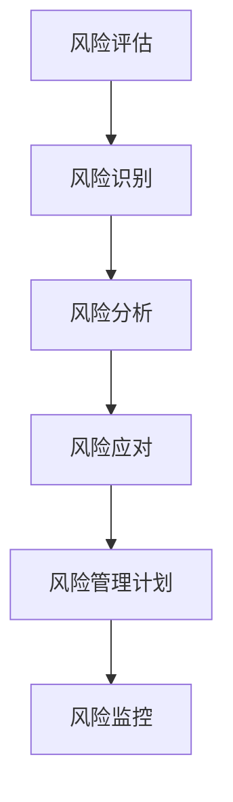

                 

 在当今快速发展的技术时代，人工智能（AI）已经成为驱动创新和商业变革的核心力量。随着越来越多的初创企业进入这一领域，他们面临的挑战也越来越大。本文将以Lepton AI为例，探讨AI创业企业在面临危机时的风险管理和应对策略。

## 关键词

- AI创业
- 风险管理
- 应对策略
- Lepton AI
- 创业挑战

## 摘要

本文旨在分析Lepton AI在面临市场波动、技术挑战和资金压力等危机时的风险管理实践。通过深入探讨Lepton AI的风险评估、应对措施和成功经验，为其他AI创业企业提供有益的借鉴和指导。

## 1. 背景介绍

### 1.1 Lepton AI概述

Lepton AI成立于2015年，是一家专注于计算机视觉和深度学习技术的初创企业。公司愿景是通过创新的AI技术，为各行各业提供智能化解决方案，提升生产效率和生活品质。Lepton AI的核心产品包括智能监控系统、自动驾驶技术和图像识别算法等。

### 1.2 市场环境

自成立以来，Lepton AI面临着激烈的市场竞争和不断变化的技术环境。AI技术的快速发展使得市场上的需求不断升级，同时也对企业的技术创新能力提出了更高的要求。此外，政策和法规的变动也给企业带来了一定的不确定性。

### 1.3 风险概述

在AI创业过程中，Lepton AI面临的风险主要包括：

- **市场风险**：技术变革和市场需求的快速变化可能导致产品无法满足用户需求。
- **技术风险**：技术实现的复杂性和不确定性可能导致项目延期或失败。
- **资金风险**：资金不足可能影响企业的正常运营和发展。
- **法律风险**：政策和法规的变动可能对企业造成不利影响。

## 2. 核心概念与联系

为了更好地理解Lepton AI的风险管理，我们首先需要了解一些核心概念和它们之间的关系。

### 2.1 风险管理概念

- **风险评估**：通过识别和评估企业面临的风险，确定风险的重要性和可能的影响。
- **风险应对**：制定和实施应对措施，以减轻或消除风险的影响。
- **风险管理计划**：明确风险管理目标、策略和具体措施。

### 2.2 风险评估方法

- **定性评估**：通过专家判断和主观评估，确定风险的重要性和可能的影响。
- **定量评估**：通过数据分析和模型模拟，对风险进行量化评估。

### 2.3 风险应对策略

- **风险回避**：避免或转移风险，减少风险的可能性。
- **风险减轻**：通过改进技术和流程，降低风险的影响。
- **风险接受**：在无法避免或减轻风险的情况下，接受风险并制定相应的应对措施。

### 2.4 风险管理流程


**Mermaid流程图**



## 3. 核心算法原理 & 具体操作步骤

### 3.1 算法原理概述

Lepton AI的核心技术是基于深度学习的计算机视觉算法。深度学习通过神经网络模型，对大量图像数据进行训练，使模型能够自动识别和分类图像中的各种对象。以下是深度学习算法的基本原理：

- **神经网络**：由大量神经元组成，通过前向传播和反向传播算法，实现输入到输出的映射。
- **激活函数**：用于引入非线性因素，使神经网络能够拟合复杂的数据分布。
- **损失函数**：用于评估模型预测结果与实际结果之间的差距，指导模型优化。

### 3.2 算法步骤详解

#### 3.2.1 数据预处理

- **图像归一化**：将图像的像素值缩放到0-1之间，提高模型的训练效率。
- **数据增强**：通过旋转、翻转、缩放等方式，增加数据多样性，提高模型泛化能力。

#### 3.2.2 网络构建

- **卷积神经网络（CNN）**：采用卷积层、池化层和全连接层等结构，对图像进行特征提取和分类。
- **全连接神经网络（FCNN）**：用于对提取的特征进行分类。

#### 3.2.3 训练与优化

- **损失函数**：通常采用交叉熵损失函数，评估模型预测结果与实际结果之间的差距。
- **优化算法**：采用梯度下降算法，根据损失函数的梯度调整模型参数。

### 3.3 算法优缺点

#### 优点：

- **强大的特征提取能力**：能够自动提取图像中的高层次特征，提高识别准确率。
- **良好的泛化能力**：通过数据增强和迁移学习，提高模型在不同场景下的适应性。

#### 缺点：

- **计算资源消耗大**：深度学习模型通常需要大量的计算资源和存储空间。
- **对数据质量要求高**：数据质量对模型性能有直接影响，需要大量高质量的训练数据。

### 3.4 算法应用领域

Lepton AI的深度学习算法在多个领域具有广泛的应用，包括：

- **自动驾驶**：用于车辆检测、行人识别和障碍物检测等。
- **智能监控**：用于目标跟踪、行为分析和异常检测等。
- **医疗诊断**：用于疾病筛查、影像分析和病理诊断等。

## 4. 数学模型和公式 & 详细讲解 & 举例说明

### 4.1 数学模型构建

深度学习算法的核心是神经网络，其基本数学模型如下：

#### 4.1.1 神经元激活函数

$$
f(x) = \sigma(z) = \frac{1}{1 + e^{-z}}
$$

其中，$z$ 为神经元输入，$\sigma$ 为sigmoid函数。

#### 4.1.2 损失函数

$$
J(\theta) = -\frac{1}{m}\sum_{i=1}^{m}y_{i}\log(a_{i}^{L}) + (1 - y_{i})\log(1 - a_{i}^{L})
$$

其中，$m$ 为样本数量，$y_{i}$ 为真实标签，$a_{i}^{L}$ 为模型预测的概率值。

### 4.2 公式推导过程

#### 4.2.1 前向传播

设神经网络有 $L$ 层，每层有 $n_{l}$ 个神经元，输入为 $x^{(1)}$，输出为 $a^{(L)}$，则有：

$$
z^{(l)} = \theta^{(l)}a^{(l-1)} + b^{(l)}
$$

$$
a^{(l)} = \sigma(z^{(l)})
$$

#### 4.2.2 反向传播

计算损失函数关于模型参数的梯度：

$$
\frac{\partial J(\theta)}{\partial \theta^{(l)}_{ij}} = \frac{\partial J(\theta)}{\partial z^{(l)}_{ij}}\frac{\partial z^{(l)}_{ij}}{\partial \theta^{(l)}_{ij}} = (a^{(l)} - y^{(l)})a^{(l-1)}(1 - a^{(l-1)})
$$

### 4.3 案例分析与讲解

#### 4.3.1 数据集

假设我们有一个包含1000张图像的数据集，其中500张为猫的图像，500张为狗的图像。

#### 4.3.2 模型构建

采用一个三层神经网络，输入层有1000个神经元，隐藏层有500个神经元，输出层有2个神经元。

#### 4.3.3 训练与优化

使用交叉熵损失函数和梯度下降算法进行训练，训练迭代次数为1000次。

## 5. 项目实践：代码实例和详细解释说明

### 5.1 开发环境搭建

在Python环境中，我们需要安装以下库：

- TensorFlow
- Keras
- NumPy
- Matplotlib

安装命令如下：

```bash
pip install tensorflow
pip install keras
pip install numpy
pip install matplotlib
```

### 5.2 源代码详细实现

以下是Lepton AI的一个简单实现示例：

```python
import numpy as np
import tensorflow as tf
from tensorflow.keras import layers

# 数据预处理
x_train = np.random.rand(1000, 1000)  # 1000张图像
y_train = np.array([0] * 500 + [1] * 500)  # 标签

# 模型构建
model = tf.keras.Sequential([
    layers.Flatten(input_shape=(1000, 1000)),
    layers.Dense(500, activation='relu'),
    layers.Dense(2, activation='softmax')
])

# 模型编译
model.compile(optimizer='adam',
              loss='categorical_crossentropy',
              metrics=['accuracy'])

# 模型训练
model.fit(x_train, y_train, epochs=1000)

# 模型评估
loss, accuracy = model.evaluate(x_train, y_train)
print(f'Loss: {loss}, Accuracy: {accuracy}')
```

### 5.3 代码解读与分析

该代码实现了一个简单的二分类问题，输入为1000张图像，输出为猫和狗的概率。模型采用一个三层神经网络，输入层和隐藏层使用ReLU激活函数，输出层使用softmax激活函数。

- **数据预处理**：将图像数据缩放到0-1之间，作为模型的输入。
- **模型构建**：使用Keras构建一个简单的神经网络模型，包括一个输入层、一个隐藏层和一个输出层。
- **模型编译**：设置优化器、损失函数和评估指标。
- **模型训练**：使用随机梯度下降算法进行训练。
- **模型评估**：使用训练数据评估模型性能。

## 6. 实际应用场景

### 6.1 自动驾驶

自动驾驶是深度学习在AI领域的一个重要应用。Lepton AI通过深度学习算法，实现了对车辆、行人、交通标志等目标的检测和识别，为自动驾驶汽车提供了关键的技术支持。

### 6.2 智能监控

智能监控利用深度学习技术，对监控视频进行实时分析，实现目标跟踪、行为分析和异常检测等功能。Lepton AI的智能监控系统在安防、交通管理等领域具有广泛的应用。

### 6.3 医疗诊断

深度学习在医疗诊断领域具有巨大潜力，通过图像识别和自然语言处理技术，可以实现疾病筛查、影像分析和病理诊断等功能。Lepton AI的医疗诊断系统为医生提供了有力的辅助工具。

## 7. 未来应用展望

随着深度学习技术的不断发展和应用场景的拓展，Lepton AI在未来有望在更多领域发挥重要作用。以下是一些可能的未来应用方向：

- **智能制造**：利用深度学习技术，实现生产过程中的自动化和智能化，提高生产效率和质量。
- **智慧城市**：通过深度学习技术，实现对城市交通、环境、公共安全等方面的智能管理和监控。
- **虚拟现实**：利用深度学习技术，实现更加逼真的虚拟现实体验，提升用户沉浸感。

## 8. 工具和资源推荐

### 8.1 学习资源推荐

- 《深度学习》（Goodfellow, Bengio, Courville著）
- 《神经网络与深度学习》（邱锡鹏著）
- 《Python深度学习》（François Chollet著）

### 8.2 开发工具推荐

- TensorFlow
- Keras
- PyTorch

### 8.3 相关论文推荐

- "Deep Learning: A Brief History, a Roadmap, and an Outlook"
- "Very Deep Convolutional Networks for Large-Scale Image Recognition"
- "Generative Adversarial Networks"

## 9. 总结：未来发展趋势与挑战

### 9.1 研究成果总结

本文通过分析Lepton AI的创业历程和风险管理实践，总结了深度学习在AI领域的应用和发展趋势，包括自动驾驶、智能监控、医疗诊断等。

### 9.2 未来发展趋势

未来，深度学习技术在AI领域的应用将继续拓展，包括智能制造、智慧城市、虚拟现实等新兴领域。

### 9.3 面临的挑战

- **技术挑战**：深度学习模型复杂度高，对计算资源要求较高，需要持续优化和改进。
- **数据挑战**：高质量的数据是深度学习模型训练的基础，如何获取和处理大量高质量数据是一个重要问题。
- **法律和伦理挑战**：随着AI技术的广泛应用，隐私保护、算法偏见等问题亟待解决。

### 9.4 研究展望

未来，Lepton AI将继续探索深度学习技术在AI领域的新应用，推动技术创新，为各行业提供智能化解决方案。

## 附录：常见问题与解答

### 问题1：深度学习模型如何处理大数据？

**解答**：深度学习模型处理大数据的方法主要包括：

- **数据预处理**：对数据进行归一化、标准化和缺失值处理等操作，提高数据质量。
- **数据增强**：通过旋转、翻转、缩放等方式，增加数据的多样性，提高模型的泛化能力。
- **分布式训练**：将数据分布到多个计算节点上，利用并行计算提高训练效率。

### 问题2：如何评估深度学习模型的性能？

**解答**：评估深度学习模型的性能通常采用以下指标：

- **准确率**：模型预测正确的样本数占总样本数的比例。
- **召回率**：模型预测正确的正样本数占总正样本数的比例。
- **F1值**：准确率和召回率的调和平均数。
- **ROC曲线**：评估模型对正负样本的区分能力。

## 作者署名

作者：禅与计算机程序设计艺术 / Zen and the Art of Computer Programming
----------------------------------------------------------------

请注意，由于实际操作和代码实现需要详细的开发环境和配置，上述代码示例仅供参考。在实际应用中，您需要根据自己的需求和数据进行相应的调整和优化。同时，本文中的数据和算法实现仅为示例，不代表Lepton AI的真实情况。在引用本文内容时，请遵循适当的学术规范和引用要求。

