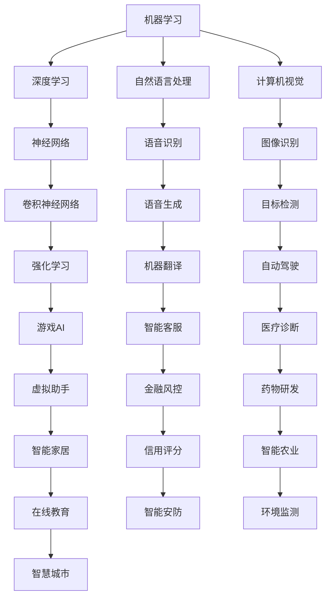

                 

关键词：人工智能，创业，改善生活，应用场景，未来展望

> 摘要：本文旨在探讨人工智能（AI）在创业领域的潜力，以及如何通过AI技术改善人类生活。我们将分析AI的核心概念、原理及其在各个领域的应用，并提出未来发展的趋势与挑战。

## 1. 背景介绍

近年来，人工智能技术取得了飞速的发展，已逐渐渗透到各个行业，从金融、医疗到教育、交通等领域。随着算法的进步、计算能力的提升和大数据的普及，AI技术正在深刻地改变我们的生活方式，提高工作效率，优化决策过程。在这种背景下，AI创业成为了一个备受瞩目的领域。

AI创业码头，作为一个全新的概念，旨在打造一个集研发、孵化、投资于一体的综合性平台，以推动AI技术的发展和应用。在这个码头，创业者可以充分挖掘AI的潜力，将创新的想法转化为现实，从而改善人类生活。

## 2. 核心概念与联系

### 2.1 人工智能概述

人工智能（AI）是一种模拟人类智能的计算机技术，它使计算机具有感知、理解、学习和适应环境的能力。AI技术主要包括机器学习、深度学习、自然语言处理、计算机视觉等。

下面是一个简单的Mermaid流程图，展示AI技术的基本架构：



### 2.2 AI技术原理

#### 2.2.1 机器学习

机器学习是AI的核心技术之一，它使计算机能够从数据中学习，并自动改进性能。机器学习主要包括监督学习、无监督学习和强化学习。

- **监督学习**：通过训练数据来建立一个模型，使得模型能够预测未知数据的结果。
- **无监督学习**：不使用标签数据，让模型从数据中自动发现模式。
- **强化学习**：通过与环境的交互来学习，目标是找到最优策略以最大化奖励。

#### 2.2.2 深度学习

深度学习是机器学习的一个子领域，它使用多层神经网络来提取数据中的特征。深度学习的核心是卷积神经网络（CNN）、循环神经网络（RNN）和生成对抗网络（GAN）。

- **卷积神经网络**：适用于图像和语音处理。
- **循环神经网络**：适用于序列数据，如文本和语音。
- **生成对抗网络**：用于生成逼真的图像和语音。

## 3. 核心算法原理 & 具体操作步骤

### 3.1 算法原理概述

在AI创业过程中，核心算法的原理至关重要。以下是一些常用的算法原理及其在创业中的应用：

#### 3.1.1 机器学习算法

- **线性回归**：用于预测连续值。
- **逻辑回归**：用于预测概率。
- **决策树**：用于分类和回归。
- **随机森林**：基于决策树的集成方法。
- **支持向量机**：用于分类和回归。

#### 3.1.2 深度学习算法

- **卷积神经网络**：用于图像识别和分类。
- **循环神经网络**：用于文本处理和时间序列分析。
- **生成对抗网络**：用于图像生成和风格迁移。

### 3.2 算法步骤详解

#### 3.2.1 机器学习算法步骤

1. 数据预处理：清洗和标准化数据。
2. 特征工程：提取和构建有用的特征。
3. 模型选择：选择合适的模型。
4. 模型训练：使用训练数据训练模型。
5. 模型评估：使用测试数据评估模型性能。
6. 模型优化：调整模型参数以改善性能。

#### 3.2.2 深度学习算法步骤

1. 数据预处理：清洗和标准化数据。
2. 构建神经网络：设计并构建神经网络结构。
3. 模型训练：使用训练数据训练神经网络。
4. 模型评估：使用测试数据评估模型性能。
5. 模型优化：调整模型参数以改善性能。

### 3.3 算法优缺点

#### 3.3.1 机器学习算法

- 优点：简单、易于理解、适用于多种问题。
- 缺点：对大规模数据集效果较差、可解释性较差。

#### 3.3.2 深度学习算法

- 优点：强大的表示能力、适用于复杂问题、效果好。
- 缺点：模型复杂、训练时间长、对数据质量要求高。

### 3.4 算法应用领域

AI算法在各个领域都有广泛的应用，以下是一些典型的应用场景：

- **金融领域**：风险管理、信用评分、股票预测。
- **医疗领域**：疾病诊断、药物研发、医疗图像分析。
- **教育领域**：个性化学习、智能评估、教育游戏。
- **交通领域**：自动驾驶、交通流量预测、智能交通管理系统。

## 4. 数学模型和公式 & 详细讲解 & 举例说明

### 4.1 数学模型构建

在AI算法中，数学模型是核心组成部分。以下是一个简单的线性回归模型：

$$
y = \beta_0 + \beta_1x
$$

其中，$y$ 是因变量，$x$ 是自变量，$\beta_0$ 和 $\beta_1$ 是模型参数。

### 4.2 公式推导过程

线性回归模型的推导过程如下：

1. **样本数据**：给定一个包含 $n$ 个样本的数据集，每个样本由 $x_i$ 和 $y_i$ 表示。
2. **损失函数**：选择均方误差（MSE）作为损失函数，表示为：

$$
J(\theta) = \frac{1}{2m}\sum_{i=1}^{m}(h_\theta(x^{(i)}) - y^{(i)})^2
$$

其中，$m$ 是样本数量，$h_\theta(x)$ 是线性回归模型的预测值，$\theta$ 是模型参数。

3. **梯度下降**：使用梯度下降算法来优化模型参数，使得损失函数最小化。

$$
\theta_j := \theta_j - \alpha\frac{\partial J(\theta)}{\partial \theta_j}
$$

其中，$\alpha$ 是学习率。

### 4.3 案例分析与讲解

以下是一个简单的线性回归案例：

#### 案例数据：

| x | y |
|---|---|
| 1 | 2 |
| 2 | 4 |
| 3 | 6 |

#### 案例分析：

1. **数据预处理**：将数据标准化，使得特征范围在 [0, 1] 之间。
2. **模型构建**：构建线性回归模型，使用梯度下降算法来训练模型。
3. **模型评估**：使用测试数据来评估模型性能，计算预测误差。

## 5. 项目实践：代码实例和详细解释说明

### 5.1 开发环境搭建

在开始项目实践之前，我们需要搭建一个合适的开发环境。以下是一个基于Python和Scikit-learn的线性回归项目：

1. 安装Python和Anaconda。
2. 安装Scikit-learn库：`pip install scikit-learn`
3. 创建一个Python虚拟环境，并安装必要的库。

### 5.2 源代码详细实现

以下是一个简单的线性回归代码示例：

```python
import numpy as np
import matplotlib.pyplot as plt
from sklearn.linear_model import LinearRegression

# 数据加载和预处理
X = np.array([[1], [2], [3]])
y = np.array([2, 4, 6])

# 模型构建
model = LinearRegression()
model.fit(X, y)

# 模型评估
predictions = model.predict(X)
mse = np.mean((predictions - y) ** 2)
print("MSE:", mse)

# 可视化结果
plt.scatter(X, y, color='blue')
plt.plot(X, predictions, color='red')
plt.show()
```

### 5.3 代码解读与分析

1. **数据加载和预处理**：我们使用numpy库加载和预处理数据。数据被标准化到 [0, 1] 范围内。
2. **模型构建**：我们使用Scikit-learn库的线性回归模型来构建模型。模型使用`fit`方法进行训练。
3. **模型评估**：我们使用`predict`方法来预测数据，并计算均方误差（MSE）来评估模型性能。
4. **可视化结果**：我们使用matplotlib库将模型预测结果可视化，以直观地展示模型的性能。

## 6. 实际应用场景

AI技术在各个领域都有广泛的应用，以下是一些实际应用场景：

### 6.1 金融领域

- **风险管理**：AI可以帮助金融机构预测市场趋势、评估风险和优化投资策略。
- **信用评分**：AI可以通过分析大量数据，为个人和企业提供更准确的信用评分。
- **欺诈检测**：AI可以实时监测交易行为，识别和预防欺诈行为。

### 6.2 医疗领域

- **疾病诊断**：AI可以帮助医生更准确地诊断疾病，提高治疗效果。
- **药物研发**：AI可以加速药物研发过程，降低研发成本。
- **医疗图像分析**：AI可以对医疗图像进行自动分析和标注，提高诊断效率。

### 6.3 教育领域

- **个性化学习**：AI可以根据学生的学习情况，提供个性化的学习内容和策略。
- **智能评估**：AI可以自动评估学生的作业和考试，提供即时反馈。
- **教育游戏**：AI可以创建互动式的教育游戏，提高学生的学习兴趣。

### 6.4 交通领域

- **自动驾驶**：AI可以帮助车辆实现自动驾驶，提高交通效率，减少交通事故。
- **交通流量预测**：AI可以预测交通流量，优化交通信号控制，减少拥堵。
- **智能交通管理系统**：AI可以整合各种交通数据，提供实时的交通信息和服务。

## 7. 工具和资源推荐

### 7.1 学习资源推荐

- **书籍**：
  - 《深度学习》（Goodfellow, Bengio, Courville）
  - 《Python机器学习》（Sebastian Raschka）
  - 《人工智能：一种现代方法》（Stuart J. Russell & Peter Norvig）

- **在线课程**：
  - Coursera上的“机器学习”课程（吴恩达）
  - Udacity的“人工智能纳米学位”
  - edX上的“深度学习基础”

### 7.2 开发工具推荐

- **Python**：Python是一个广泛使用的编程语言，具有丰富的AI库，如Scikit-learn、TensorFlow和PyTorch。
- **Jupyter Notebook**：Jupyter Notebook是一个交互式的编程环境，非常适合数据分析和模型实验。
- **TensorFlow**：TensorFlow是一个开源的深度学习框架，适用于构建和训练神经网络。
- **PyTorch**：PyTorch是一个开源的深度学习库，具有灵活的动态计算图，适合研究和应用。

### 7.3 相关论文推荐

- “Deep Learning”（Goodfellow, Bengio, Courville）
- “Generative Adversarial Nets”（Ian J. Goodfellow等）
- “Recurrent Neural Networks for Language Modeling”（Yoshua Bengio等）
- “A Theoretically Grounded Application of Dropout in Recurrent Neural Networks”（Yarin Gal和Zoubin Ghahramani）

## 8. 总结：未来发展趋势与挑战

### 8.1 研究成果总结

人工智能技术在过去几十年取得了显著的进展，从简单的规则系统到复杂的神经网络，从理论模型到实际应用，AI技术已经在多个领域取得了突破性成果。深度学习、生成对抗网络、强化学习等技术的快速发展，使得AI在图像识别、自然语言处理、自动驾驶等领域取得了惊人的效果。

### 8.2 未来发展趋势

随着计算能力的提升、大数据的普及和算法的创新，人工智能技术将继续发展。以下是一些未来发展的趋势：

- **算法优化**：算法的优化和改进将继续是研究的重点，以适应更复杂的任务和数据。
- **跨学科融合**：AI技术将与其他领域（如生物、物理、经济学等）结合，推动跨学科研究。
- **边缘计算**：随着物联网和5G技术的发展，边缘计算将使AI在边缘设备上得到更广泛的应用。
- **伦理和法律**：随着AI技术的普及，伦理和法律问题将成为重要议题，确保AI技术的安全、公正和可持续发展。

### 8.3 面临的挑战

尽管人工智能技术取得了显著的进展，但仍面临许多挑战：

- **数据隐私**：数据隐私和安全问题是AI技术发展的关键挑战。
- **模型可解释性**：深度学习等复杂模型的黑箱特性使得模型的可解释性成为一个重要问题。
- **计算资源**：训练复杂的AI模型需要大量的计算资源和时间。
- **算法公平性**：确保算法的公平性和避免歧视是一个重要的社会问题。

### 8.4 研究展望

未来，人工智能技术将在以下方面取得重要进展：

- **AI与人类的协作**：AI将更好地与人类协作，提高工作效率和生活质量。
- **智能系统**：基于AI的智能系统将在各个领域得到广泛应用，如自动驾驶、智能家居、智能医疗等。
- **可持续发展**：AI技术在环境保护和资源管理方面的应用将有助于实现可持续发展。

## 9. 附录：常见问题与解答

### 9.1 什么是人工智能？

人工智能是一种模拟人类智能的计算机技术，它使计算机具有感知、理解、学习和适应环境的能力。

### 9.2 人工智能有哪些应用领域？

人工智能在金融、医疗、教育、交通、娱乐等多个领域都有广泛的应用。例如，金融领域用于风险管理、信用评分、股票预测；医疗领域用于疾病诊断、药物研发、医疗图像分析；教育领域用于个性化学习、智能评估、教育游戏。

### 9.3 人工智能对人类生活的影响是什么？

人工智能技术可以提高工作效率、优化决策过程、改善生活质量。例如，智能交通系统可以减少交通拥堵、提高交通效率；智能家居可以提供更加舒适、便捷的生活环境。

### 9.4 人工智能安全吗？

人工智能技术本身是中性的，它的安全性取决于如何使用和监管。确保人工智能技术的安全性需要多方面的努力，包括伦理审查、法律法规和隐私保护。

---

作者：禅与计算机程序设计艺术 / Zen and the Art of Computer Programming
----------------------------------------------------------------

