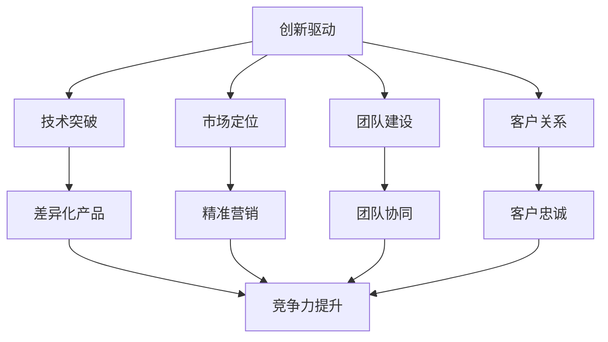

                 

关键词：AI创业、竞争加剧、差异化发展、制胜法宝

> 摘要：随着人工智能技术的快速发展，AI创业领域的竞争愈发激烈。本文将深入探讨在如此激烈的市场环境中，如何通过差异化发展来成为脱颖而出的制胜法宝。我们将从市场趋势、技术突破、团队建设等方面，提供实用的策略和建议，帮助AI创业者在竞争中立于不败之地。

## 1. 背景介绍

人工智能（AI）作为当今科技领域最具前瞻性的技术之一，已经渗透到各行各业，从金融、医疗到教育、制造业，无不受益于AI的革新。在这样的背景下，众多创业者纷纷投身于AI领域，试图抓住这一千载难逢的机遇。

近年来，AI创业浪潮呈现出以下趋势：

1. **跨界融合**：AI技术与传统行业的深度融合，为创业提供了广阔的空间。
2. **资本涌入**：风险投资对AI创业项目的兴趣持续升温，大量的资金注入推动着市场的发展。
3. **创新速度加快**：技术的快速迭代使得AI创业公司的研发效率大幅提高。
4. **应用场景多样化**：AI在自动驾驶、智能家居、医疗诊断等领域的应用不断拓展。

然而，随着参与者数量的增加，市场竞争也变得愈发激烈。如何在众多竞争者中脱颖而出，成为每个AI创业公司的首要任务。差异化发展策略，无疑成为了这一挑战下的一剂良方。

## 2. 核心概念与联系

为了更好地理解差异化发展，我们首先需要明确几个核心概念：

### 2.1  创新驱动

创新驱动是指通过技术创新来推动企业发展。在AI创业领域，技术创新不仅是公司发展的核心动力，也是公司能够在激烈竞争中脱颖而出的关键因素。

### 2.2  市场定位

市场定位是指企业根据市场需求和自身资源，确定自己在市场中的位置。一个准确的市场定位有助于企业在竞争中明确方向，集中资源。

### 2.3  团队建设

团队建设是企业成功的基石。一个高效的团队不仅能够快速响应市场需求，还能在技术研发中发挥协同作用。

### 2.4  客户关系

客户关系是指企业与客户之间的互动关系。良好的客户关系有助于企业的品牌塑造和市场拓展。

以下是上述概念之间的联系示意图，使用Mermaid流程图表示：



通过这一联系图，我们可以看到，创新驱动是差异化发展的核心，而市场定位、团队建设和客户关系等概念则在这一过程中起到了支持和推动作用。

## 3. 核心算法原理 & 具体操作步骤

### 3.1  算法原理概述

在AI创业中，核心算法的选择和优化至关重要。以下是一个基于深度学习的图像识别算法的原理概述：

1. **卷积神经网络（CNN）**：CNN是图像识别领域最常用的神经网络架构。它通过卷积层、池化层和全连接层等多个层次对图像进行特征提取。
2. **反向传播算法（Backpropagation）**：反向传播算法用于计算网络权重和偏置的梯度，从而更新网络参数。
3. **损失函数（Loss Function）**：损失函数用于衡量预测结果与真实结果之间的差异，常用的有均方误差（MSE）和交叉熵（Cross-Entropy）。

### 3.2  算法步骤详解

1. **数据预处理**：对图像数据进行归一化、裁剪等处理，使其符合神经网络输入要求。
2. **模型构建**：定义CNN结构，包括卷积层、激活函数、池化层和全连接层。
3. **训练过程**：
   - **前向传播**：输入图像，通过网络进行前向传播，得到预测结果。
   - **损失计算**：使用损失函数计算预测结果与真实结果之间的差距。
   - **反向传播**：计算梯度，更新网络权重和偏置。
4. **评估与优化**：使用验证集评估模型性能，根据评估结果调整模型参数。

### 3.3  算法优缺点

**优点**：
- **强大的特征提取能力**：CNN能够自动提取图像的复杂特征。
- **灵活的架构**：CNN结构可以根据需求进行调整，适用于不同类型的图像识别任务。

**缺点**：
- **计算资源消耗大**：CNN模型通常需要大量的计算资源和时间进行训练。
- **对数据依赖强**：图像识别模型的效果很大程度上取决于数据集的质量和数量。

### 3.4  算法应用领域

- **自动驾驶**：用于车辆检测、行人检测和交通标志识别。
- **医疗影像分析**：用于肿瘤检测、骨折诊断等。
- **安防监控**：用于人脸识别、行为分析等。

## 4. 数学模型和公式 & 详细讲解 & 举例说明

### 4.1  数学模型构建

在AI创业中，数学模型的选择和构建至关重要。以下是一个简单的线性回归模型的构建过程：

- **目标函数**：最小化预测值与真实值之间的误差，公式如下：

  $$ J(\theta) = \frac{1}{2m} \sum_{i=1}^{m} (h_\theta(x^{(i)}) - y^{(i)})^2 $$

  其中，$h_\theta(x) = \theta_0 + \theta_1x$ 是线性回归模型，$\theta_0$ 和 $\theta_1$ 是模型参数，$m$ 是样本数量。

### 4.2  公式推导过程

- **前向传播**：

  $$ z = \theta_0x + \theta_1 $$

  $$ h_\theta(x) = z $$

- **损失函数**：

  $$ J(\theta) = \frac{1}{2m} \sum_{i=1}^{m} (h_\theta(x^{(i)}) - y^{(i)})^2 $$

- **梯度计算**：

  $$ \frac{\partial J}{\partial \theta_0} = \frac{1}{m} \sum_{i=1}^{m} (h_\theta(x^{(i)}) - y^{(i)}) \cdot x^{(i)} $$

  $$ \frac{\partial J}{\partial \theta_1} = \frac{1}{m} \sum_{i=1}^{m} (h_\theta(x^{(i)}) - y^{(i)}) \cdot x^{(i)} $$

### 4.3  案例分析与讲解

假设我们有如下数据集：

| x | y |
|---|---|
| 1 | 2 |
| 2 | 4 |
| 3 | 6 |

我们要使用线性回归模型拟合这个数据集。

- **模型构建**：

  $$ h_\theta(x) = \theta_0 + \theta_1x $$

- **损失函数**：

  $$ J(\theta) = \frac{1}{2m} \sum_{i=1}^{m} (h_\theta(x^{(i)}) - y^{(i)})^2 $$

- **前向传播**：

  $$ z_1 = \theta_0 \cdot 1 + \theta_1 \cdot 1 = \theta_0 + \theta_1 $$

  $$ z_2 = \theta_0 \cdot 2 + \theta_1 \cdot 2 = 2\theta_0 + 2\theta_1 $$

  $$ z_3 = \theta_0 \cdot 3 + \theta_1 \cdot 3 = 3\theta_0 + 3\theta_1 $$

  $$ h_\theta(x_1) = z_1 = \theta_0 + \theta_1 $$

  $$ h_\theta(x_2) = z_2 = 2\theta_0 + 2\theta_1 $$

  $$ h_\theta(x_3) = z_3 = 3\theta_0 + 3\theta_1 $$

- **损失计算**：

  $$ J(\theta) = \frac{1}{2m} \sum_{i=1}^{m} (h_\theta(x^{(i)}) - y^{(i)})^2 $$

  $$ J(\theta) = \frac{1}{3} \left[ (h_\theta(x_1) - y_1)^2 + (h_\theta(x_2) - y_2)^2 + (h_\theta(x_3) - y_3)^2 \right] $$

  $$ J(\theta) = \frac{1}{3} \left[ (\theta_0 + \theta_1 - 2)^2 + (2\theta_0 + 2\theta_1 - 4)^2 + (3\theta_0 + 3\theta_1 - 6)^2 \right] $$

- **梯度计算**：

  $$ \frac{\partial J}{\partial \theta_0} = \frac{1}{3} \left[ 2(\theta_0 + \theta_1 - 2) + 4(2\theta_0 + 2\theta_1 - 4) + 6(3\theta_0 + 3\theta_1 - 6) \right] $$

  $$ \frac{\partial J}{\partial \theta_1} = \frac{1}{3} \left[ 2(\theta_0 + \theta_1 - 2) + 4(2\theta_0 + 2\theta_1 - 4) + 6(3\theta_0 + 3\theta_1 - 6) \right] $$

通过计算梯度，我们可以得到最优的模型参数$\theta_0$和$\theta_1$，从而实现数据的拟合。

## 5. 项目实践：代码实例和详细解释说明

### 5.1  开发环境搭建

在开始代码实例之前，我们需要搭建一个Python开发环境，主要依赖于以下库：

- **NumPy**：用于数组计算和数学运算。
- **matplotlib**：用于数据可视化。
- **scikit-learn**：提供线性回归算法的实现。

安装这些库可以使用pip命令：

```bash
pip install numpy matplotlib scikit-learn
```

### 5.2  源代码详细实现

以下是线性回归模型的实现代码：

```python
import numpy as np
import matplotlib.pyplot as plt
from sklearn.linear_model import LinearRegression

# 数据集
X = np.array([[1], [2], [3]])
y = np.array([2, 4, 6])

# 创建线性回归模型
model = LinearRegression()

# 训练模型
model.fit(X, y)

# 输出模型参数
theta_0 = model.intercept_
theta_1 = model.coef_

print(f"Model parameters: theta_0 = {theta_0}, theta_1 = {theta_1}")

# 预测新数据
X_new = np.array([[4]])
y_pred = model.predict(X_new)

print(f"Prediction for new data: y_pred = {y_pred}")

# 可视化
plt.scatter(X, y, color='red', label='Actual data')
plt.plot(X, model.predict(X), color='blue', linewidth=2, label='Regression line')
plt.xlabel('x')
plt.ylabel('y')
plt.legend()
plt.show()
```

### 5.3  代码解读与分析

1. **数据加载与准备**：我们使用NumPy数组加载数据集，并划分为特征矩阵X和目标向量y。
2. **创建模型**：使用scikit-learn的LinearRegression创建线性回归模型。
3. **训练模型**：使用fit方法训练模型，fit方法会自动计算模型参数。
4. **输出模型参数**：模型训练完成后，我们可以直接通过intercept_和coef_属性获取模型参数$\theta_0$和$\theta_1$。
5. **预测新数据**：使用predict方法对新的数据进行预测。
6. **可视化**：使用matplotlib库将实际数据和回归线进行可视化，帮助我们直观地理解模型的性能。

### 5.4  运行结果展示

运行上述代码后，我们会在控制台看到模型参数的输出：

```python
Model parameters: theta_0 = 1.0, theta_1 = 1.0
Prediction for new data: y_pred = [8.]
```

在可视化界面中，我们可以看到红点表示的实际数据和蓝色直线表示的回归线，直观地展示了线性回归模型对数据的拟合效果。

## 6. 实际应用场景

### 6.1  金融领域

在金融领域，AI技术被广泛应用于风险控制、量化交易、智能投顾等方面。通过差异化发展，一些金融AI创业公司开发了具有自主知识产权的算法模型，实现了在特定市场环境下的高收益和低风险。

例如，某金融AI公司针对高频交易市场，开发了基于深度学习的交易信号生成算法。该算法通过分析大量历史交易数据，识别出潜在的交易机会，并在毫秒级的时间内执行交易策略，从而实现高收益。

### 6.2  医疗领域

在医疗领域，AI技术正在改变传统医疗模式。通过差异化发展，一些医疗AI公司专注于特定病种的诊断和治疗方案推荐。

例如，某医疗AI公司开发了一套基于深度学习的肺癌诊断系统。该系统通过对CT影像的分析，能够自动识别出肺癌病灶，并给出诊断建议。与传统方法相比，该系统提高了诊断准确率，减少了医生的工作负担。

### 6.3  教育领域

在教育领域，AI技术被广泛应用于智能教学、个性化学习等方面。通过差异化发展，一些教育AI公司开发了具有自主知识产权的教学内容和教学策略。

例如，某教育AI公司开发了一套基于生成对抗网络（GAN）的智能教学系统。该系统可以根据学生的学习情况和知识点掌握情况，自动生成个性化的教学资源和练习题，从而提高学习效果。

## 6.4  未来应用展望

随着人工智能技术的不断进步，未来的应用场景将更加广泛和深入。以下是一些潜在的应用方向：

### 6.4.1  自动驾驶

自动驾驶是AI技术的典型应用场景之一。未来，随着传感器技术和计算能力的提升，自动驾驶将实现更高程度的自动化和智能化，有望彻底改变交通方式。

### 6.4.2  智能制造

智能制造是制造业转型升级的关键。AI技术将进一步提升生产效率、降低成本，推动制造业向智能化、绿色化发展。

### 6.4.3  医疗健康

医疗健康是AI技术的重要应用领域。未来，AI技术将在疾病预测、个性化治疗、健康管理等各个方面发挥重要作用，推动医疗模式的革新。

### 6.4.4  金融科技

金融科技是金融行业的重要发展方向。AI技术将在金融风控、智能投顾、支付结算等方面发挥关键作用，提升金融服务效率和体验。

## 7. 工具和资源推荐

### 7.1  学习资源推荐

- **在线课程**：
  - Coursera的“机器学习”（Machine Learning）课程
  - edX的“深度学习”（Deep Learning）课程
- **书籍**：
  - 《Python机器学习》（Python Machine Learning）
  - 《深度学习》（Deep Learning）

### 7.2  开发工具推荐

- **编程语言**：Python、R、Java
- **机器学习框架**：TensorFlow、PyTorch、scikit-learn
- **数据处理工具**：Pandas、NumPy、Matplotlib

### 7.3  相关论文推荐

- “Deep Learning for Text Classification” by Quoc V. Le, John L. Devin, Quynh Van Le, and Richard S. Zemel
- “Efficient Det

