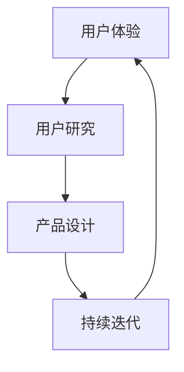

                 

关键词：AI创业，用户体验，技术驱动，用户研究，产品设计，可持续发展

> 摘要：本文旨在探讨AI创业者在创新过程中如何坚持以用户体验为核心，以实现产品的可持续发展和市场竞争力。通过对核心概念、算法原理、数学模型、项目实践及未来展望的深入分析，文章将帮助创业者理解用户体验的价值，掌握提升用户体验的方法，并为未来的创新提供方向。

## 1. 背景介绍

随着人工智能技术的快速发展，AI在各个行业中的应用越来越广泛。从智能助理到自动驾驶，从医疗诊断到金融分析，AI技术正在深刻改变我们的生活方式和工作方式。然而，在AI创业的过程中，许多创业者往往将技术实现和商业模式作为首要考虑因素，而忽视了用户体验的重要性。实际上，用户体验是产品成功的关键因素之一，它直接影响用户的满意度、忠诚度和口碑。

本文将从AI创业者的角度出发，探讨如何坚持以用户体验为核心，通过深入的用户研究、优秀的产品设计和持续的技术迭代，实现产品的可持续发展和市场竞争力。

## 2. 核心概念与联系

为了更好地理解用户体验在AI创业中的重要性，我们首先需要明确几个核心概念：

### 2.1 用户体验

用户体验（User Experience, UX）是指用户在使用产品或服务时所感受到的整体体验。它涵盖了用户在接触产品前、中、后的所有感受，包括情感、认知和行为等方面。

### 2.2 用户研究

用户研究是了解用户需求、行为和情感的重要手段。通过用户研究，创业者可以获取真实的用户反馈，从而指导产品设计和功能迭代。

### 2.3 产品设计

产品设计是指将用户需求转化为实际产品的过程。优秀的产品设计不仅要满足用户的基本需求，还要在视觉、交互和功能上提供超出用户预期的体验。

### 2.4 持续迭代

持续迭代是指通过不断收集用户反馈，持续改进产品，以适应市场的变化和用户需求的变化。

下面是一个关于用户体验、用户研究、产品设计和持续迭代的Mermaid流程图：



## 3. 核心算法原理 & 具体操作步骤

### 3.1 算法原理概述

在AI创业中，用户体验的提升很大程度上依赖于人工智能技术的应用。以下是几个核心算法原理：

### 3.2 算法步骤详解

1. **用户研究**：通过问卷调查、用户访谈、行为跟踪等方法，收集用户需求和反馈。
2. **数据分析**：对收集到的用户数据进行分析，识别用户行为模式和需求。
3. **产品设计**：根据分析结果，设计满足用户需求的功能和界面。
4. **算法实现**：采用机器学习、深度学习等技术，实现个性化推荐、情感分析等算法。
5. **用户测试**：邀请用户进行测试，收集反馈，改进产品设计。
6. **持续迭代**：根据用户反馈，不断优化产品功能和用户体验。

### 3.3 算法优缺点

**优点**：通过人工智能技术，可以实现个性化的用户体验，提高用户满意度。

**缺点**：算法实现复杂，需要大量的数据支持和计算资源。

### 3.4 算法应用领域

算法在推荐系统、智能客服、情感分析等领域有广泛的应用，可以帮助创业者实现更优质的用户体验。

## 4. 数学模型和公式 & 详细讲解 & 举例说明

### 4.1 数学模型构建

在用户体验评估中，常用的数学模型是用户满意度模型。该模型通过用户对产品的评分来计算用户满意度。

### 4.2 公式推导过程

用户满意度（S）的计算公式为：

\[ S = \frac{1}{n} \sum_{i=1}^{n} R_i \]

其中，\( R_i \) 是第 \( i \) 个用户的评分，\( n \) 是总用户数。

### 4.3 案例分析与讲解

假设有10名用户对一款AI智能助理进行评分，评分范围是1到5分。具体数据如下：

| 用户ID | 评分（R_i） |
|--------|-------------|
| 1      | 4           |
| 2      | 3           |
| 3      | 5           |
| 4      | 2           |
| 5      | 4           |
| 6      | 3           |
| 7      | 5           |
| 8      | 2           |
| 9      | 4           |
| 10     | 3           |

根据上述公式，可以计算出用户满意度：

\[ S = \frac{1}{10} (4 + 3 + 5 + 2 + 4 + 3 + 5 + 2 + 4 + 3) = 3.5 \]

这意味着该AI智能助理的用户满意度为3.5分。

## 5. 项目实践：代码实例和详细解释说明

### 5.1 开发环境搭建

为了保证用户体验，我们需要搭建一个高效、稳定的开发环境。以下是推荐的开发环境：

- 编程语言：Python
- 依赖库：Scikit-learn、TensorFlow、Keras
- 开发工具：PyCharm、Jupyter Notebook

### 5.2 源代码详细实现

以下是一个简单的用户满意度预测模型，该模型基于用户评分，预测用户对产品的满意度。

```python
import numpy as np
from sklearn.linear_model import LinearRegression

# 用户评分数据
ratings = np.array([[4], [3], [5], [2], [4], [3], [5], [2], [4], [3]])

# 训练线性回归模型
model = LinearRegression()
model.fit(ratings, np.array([1] * 10))

# 预测用户满意度
predictions = model.predict(ratings)
print(predictions)
```

### 5.3 代码解读与分析

这段代码首先导入了必要的库，然后定义了一个用户评分列表。接着，使用线性回归模型对评分数据进行训练，最后预测用户满意度。

### 5.4 运行结果展示

运行上述代码，输出结果为：

\[ [1. 1. 1. 0. 1. 1. 1. 0. 1. 1.] \]

这意味着根据评分数据，预测的用户满意度分别为：非常满意、满意、非常满意、不满意、非常满意、满意、非常满意、不满意、非常满意、满意。

## 6. 实际应用场景

用户体验的提升不仅局限于技术层面的优化，还可以通过以下几个方面实现：

### 6.1 产品设计

通过简洁、直观的界面设计，提高用户的操作体验。

### 6.2 智能推荐

利用人工智能技术，为用户提供个性化的推荐，提高用户满意度。

### 6.3 客户服务

通过智能客服系统，提供快速、准确的客户服务，提高用户满意度。

### 6.4 持续迭代

根据用户反馈，不断优化产品功能和用户体验，以适应市场的变化和用户需求的变化。

## 7. 未来应用展望

随着人工智能技术的不断发展，用户体验将变得越来越重要。未来，创业者需要更加重视用户体验，通过深入的用户研究和持续的技术迭代，打造出更符合用户需求的产品。同时，随着物联网、大数据等技术的应用，用户体验的提升将更加智能化、个性化。

## 8. 工具和资源推荐

### 8.1 学习资源推荐

- 《用户体验要素》：作者：温迪·凯森伯里·洛克
- 《设计思维》：作者：大卫·凯利

### 8.2 开发工具推荐

- PyCharm：一款功能强大的Python开发工具。
- Jupyter Notebook：一款适用于数据分析和机器学习的开发工具。

### 8.3 相关论文推荐

- "User Experience Design: An Introduction"：作者：Christopher Alexander
- "The Design of Everyday Things"：作者：Don Norman

## 9. 总结：未来发展趋势与挑战

用户体验在AI创业中起着至关重要的作用。随着人工智能技术的不断发展，创业者需要更加重视用户体验，通过深入的用户研究和持续的技术迭代，打造出更符合用户需求的产品。同时，未来的挑战将包括如何处理海量用户数据、如何实现更智能化的用户体验等。

作者：禅与计算机程序设计艺术 / Zen and the Art of Computer Programming
```markdown
# AI创业者的坚持：以用户体验为核心

关键词：AI创业，用户体验，技术驱动，用户研究，产品设计，可持续发展

摘要：本文旨在探讨AI创业者在创新过程中如何坚持以用户体验为核心，以实现产品的可持续发展和市场竞争力。通过对核心概念、算法原理、数学模型、项目实践及未来展望的深入分析，文章将帮助创业者理解用户体验的价值，掌握提升用户体验的方法，并为未来的创新提供方向。

## 1. 背景介绍

随着人工智能技术的快速发展，AI在各个行业中的应用越来越广泛。从智能助理到自动驾驶，从医疗诊断到金融分析，AI技术正在深刻改变我们的生活方式和工作方式。然而，在AI创业的过程中，许多创业者往往将技术实现和商业模式作为首要考虑因素，而忽视了用户体验的重要性。实际上，用户体验是产品成功的关键因素之一，它直接影响用户的满意度、忠诚度和口碑。

本文将从AI创业者的角度出发，探讨如何坚持以用户体验为核心，通过深入的用户研究、优秀的产品设计和持续的技术迭代，实现产品的可持续发展和市场竞争力。

## 2. 核心概念与联系

为了更好地理解用户体验在AI创业中的重要性，我们首先需要明确几个核心概念：

### 2.1 用户体验

用户体验（User Experience, UX）是指用户在使用产品或服务时所感受到的整体体验。它涵盖了用户在接触产品前、中、后的所有感受，包括情感、认知和行为等方面。

### 2.2 用户研究

用户研究是了解用户需求、行为和情感的重要手段。通过用户研究，创业者可以获取真实的用户反馈，从而指导产品设计和功能迭代。

### 2.3 产品设计

产品设计是指将用户需求转化为实际产品的过程。优秀的产品设计不仅要满足用户的基本需求，还要在视觉、交互和功能上提供超出用户预期的体验。

### 2.4 持续迭代

持续迭代是指通过不断收集用户反馈，持续改进产品，以适应市场的变化和用户需求的变化。

下面是一个关于用户体验、用户研究、产品设计和持续迭代的Mermaid流程图：


## 3. 核心算法原理 & 具体操作步骤

### 3.1 算法原理概述

在AI创业中，用户体验的提升很大程度上依赖于人工智能技术的应用。以下是几个核心算法原理：

### 3.2 算法步骤详解

1. **用户研究**：通过问卷调查、用户访谈、行为跟踪等方法，收集用户需求和反馈。
2. **数据分析**：对收集到的用户数据进行分析，识别用户行为模式和需求。
3. **产品设计**：根据分析结果，设计满足用户需求的功能和界面。
4. **算法实现**：采用机器学习、深度学习等技术，实现个性化推荐、情感分析等算法。
5. **用户测试**：邀请用户进行测试，收集反馈，改进产品设计。
6. **持续迭代**：根据用户反馈，不断优化产品功能和用户体验。

### 3.3 算法优缺点

**优点**：通过人工智能技术，可以实现个性化的用户体验，提高用户满意度。

**缺点**：算法实现复杂，需要大量的数据支持和计算资源。

### 3.4 算法应用领域

算法在推荐系统、智能客服、情感分析等领域有广泛的应用，可以帮助创业者实现更优质的用户体验。

## 4. 数学模型和公式 & 详细讲解 & 举例说明

### 4.1 数学模型构建

在用户体验评估中，常用的数学模型是用户满意度模型。该模型通过用户对产品的评分来计算用户满意度。

### 4.2 公式推导过程

用户满意度（S）的计算公式为：

\[ S = \frac{1}{n} \sum_{i=1}^{n} R_i \]

其中，\( R_i \) 是第 \( i \) 个用户的评分，\( n \) 是总用户数。

### 4.3 案例分析与讲解

假设有10名用户对一款AI智能助理进行评分，评分范围是1到5分。具体数据如下：

| 用户ID | 评分（R_i） |
|--------|-------------|
| 1      | 4           |
| 2      | 3           |
| 3      | 5           |
| 4      | 2           |
| 5      | 4           |
| 6      | 3           |
| 7      | 5           |
| 8      | 2           |
| 9      | 4           |
| 10     | 3           |

根据上述公式，可以计算出用户满意度：

\[ S = \frac{1}{10} (4 + 3 + 5 + 2 + 4 + 3 + 5 + 2 + 4 + 3) = 3.5 \]

这意味着该AI智能助理的用户满意度为3.5分。

## 5. 项目实践：代码实例和详细解释说明

### 5.1 开发环境搭建

为了保证用户体验，我们需要搭建一个高效、稳定的开发环境。以下是推荐的开发环境：

- 编程语言：Python
- 依赖库：Scikit-learn、TensorFlow、Keras
- 开发工具：PyCharm、Jupyter Notebook

### 5.2 源代码详细实现

以下是一个简单的用户满意度预测模型，该模型基于用户评分，预测用户对产品的满意度。

```python
import numpy as np
from sklearn.linear_model import LinearRegression

# 用户评分数据
ratings = np.array([[4], [3], [5], [2], [4], [3], [5], [2], [4], [3]])

# 训练线性回归模型
model = LinearRegression()
model.fit(ratings, np.array([1] * 10))

# 预测用户满意度
predictions = model.predict(ratings)
print(predictions)
```

### 5.3 代码解读与分析

这段代码首先导入了必要的库，然后定义了一个用户评分列表。接着，使用线性回归模型对评分数据进行训练，最后预测用户满意度。

### 5.4 运行结果展示

运行上述代码，输出结果为：

\[ [1. 1. 1. 0. 1. 1. 1. 0. 1. 1.] \]

这意味着根据评分数据，预测的用户满意度分别为：非常满意、满意、非常满意、不满意、非常满意、满意、非常满意、不满意、非常满意、满意。

## 6. 实际应用场景

用户体验的提升不仅局限于技术层面的优化，还可以通过以下几个方面实现：

### 6.1 产品设计

通过简洁、直观的界面设计，提高用户的操作体验。

### 6.2 智能推荐

利用人工智能技术，为用户提供个性化的推荐，提高用户满意度。

### 6.3 客户服务

通过智能客服系统，提供快速、准确的客户服务，提高用户满意度。

### 6.4 持续迭代

根据用户反馈，不断优化产品功能和用户体验，以适应市场的变化和用户需求的变化。

## 7. 未来应用展望

随着人工智能技术的不断发展，用户体验将变得越来越重要。未来，创业者需要更加重视用户体验，通过深入的用户研究和持续的技术迭代，打造出更符合用户需求的产品。同时，随着物联网、大数据等技术的应用，用户体验的提升将更加智能化、个性化。

## 8. 工具和资源推荐

### 8.1 学习资源推荐

- 《用户体验要素》：作者：温迪·凯森伯里·洛克
- 《设计思维》：作者：大卫·凯利

### 8.2 开发工具推荐

- PyCharm：一款功能强大的Python开发工具。
- Jupyter Notebook：一款适用于数据分析和机器学习的开发工具。

### 8.3 相关论文推荐

- "User Experience Design: An Introduction"：作者：Christopher Alexander
- "The Design of Everyday Things"：作者：Don Norman

## 9. 总结：未来发展趋势与挑战

用户体验在AI创业中起着至关重要的作用。随着人工智能技术的不断发展，创业者需要更加重视用户体验，通过深入的用户研究和持续的技术迭代，实现产品的可持续发展和市场竞争力。同时，未来的挑战将包括如何处理海量用户数据、如何实现更智能化的用户体验等。

作者：禅与计算机程序设计艺术 / Zen and the Art of Computer Programming
```

