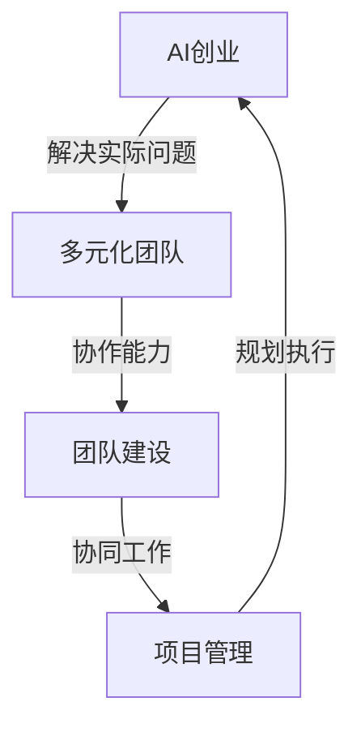

                 

关键词：AI创业、多元化团队、团队建设、人才招聘、项目管理、技术创新

> 摘要：本文将探讨AI创业企业如何构建多元化团队，分析多样化团队的优势及其对项目成功的重要性。通过介绍多元化团队建设的方法和策略，结合实际案例，探讨多元化团队在未来AI创业领域的应用和挑战。

## 1. 背景介绍

随着人工智能技术的快速发展，AI创业项目不断涌现。然而，AI创业项目不同于传统的软件开发项目，其复杂性、创新性和技术深度要求创业团队具备多元化的能力。一个成功的AI创业团队需要拥有多样化的技能、经验和视角，才能更好地应对市场变化、技术创新和项目管理等方面的挑战。

本文将围绕以下问题展开讨论：

1. 多元化团队在AI创业中的重要性是什么？
2. 如何构建和培养一个多元化的AI创业团队？
3. 多元化团队在项目实施中如何发挥作用？
4. 未来AI创业领域多元化团队的发展趋势和挑战是什么？

## 2. 核心概念与联系

为了更好地理解多元化团队在AI创业中的重要性，我们需要明确几个核心概念：

### 2.1 AI创业

AI创业是指基于人工智能技术的创新项目，这些项目旨在解决实际问题或创造新的商业机会。AI创业涉及多个领域，包括机器学习、深度学习、计算机视觉、自然语言处理等。

### 2.2 多元化团队

多元化团队是指由不同背景、技能、经验和视角的成员组成的团队。多元化团队的优势在于其能够提供多样化的观点和解决方案，从而提高团队的创新能力和决策质量。

### 2.3 团队建设

团队建设是指通过一系列策略和活动，培养团队成员之间的协作精神、信任和沟通能力，从而提高团队的整体绩效。团队建设在多元化团队中尤为重要，因为多样化的成员往往需要更多的时间和努力来建立合作关系。

### 2.4 项目管理

项目管理是指通过规划、执行、监控和关闭项目过程，确保项目按计划、预算和质量要求完成。在多元化团队中，项目管理需要更加注重沟通、协调和冲突管理，以确保项目顺利进行。

下面是一个简单的Mermaid流程图，展示了这些核心概念之间的联系：



## 3. 核心算法原理 & 具体操作步骤

### 3.1 算法原理概述

构建多元化团队的核心在于理解并应用人才招聘、团队建设和项目管理的基本原则。以下将详细介绍这些核心原理及其应用步骤。

#### 3.1.1 人才招聘

多元化团队的构建始于人才招聘。在招聘过程中，企业应注重候选人的技能、经验和视角的多样性，以确保团队具备多元化的能力。

**步骤：**

1. **明确团队需求：** 根据项目特点和团队目标，确定所需技能和经验。
2. **发布招聘信息：** 在招聘广告中明确团队需求，鼓励具有不同背景和经验的候选人申请。
3. **筛选候选人：** 通过面试和评估，筛选具有多样性和匹配度的候选人。

#### 3.1.2 团队建设

团队建设是多元化团队成功的关键。通过一系列策略和活动，培养团队成员之间的信任、沟通和协作。

**步骤：**

1. **建立团队目标：** 确定团队共同的目标，确保成员明确自己的角色和责任。
2. **促进沟通：** 定期组织团队会议和活动，促进成员之间的沟通和协作。
3. **培养团队精神：** 通过培训、团队建设活动和团队合作项目，增强团队凝聚力。

#### 3.1.3 项目管理

项目管理是确保多元化团队能够高效实施项目的重要环节。在项目管理中，需要特别注意沟通、协调和冲突管理。

**步骤：**

1. **制定项目计划：** 根据团队目标和资源，制定详细的项目计划。
2. **定期沟通：** 通过定期会议和报告，确保团队成员了解项目进展和各自的任务。
3. **协调资源：** 根据项目需求，合理分配和协调团队资源。
4. **冲突管理：** 及时解决团队内部冲突，确保项目顺利进行。

### 3.2 算法步骤详解

为了更好地理解上述核心算法原理，我们将其分解为以下步骤：

#### 3.2.1 人才招聘

1. **明确团队需求：** 根据项目特点和团队目标，确定所需技能和经验。
2. **发布招聘信息：** 在招聘广告中明确团队需求，鼓励具有不同背景和经验的候选人申请。
3. **筛选候选人：** 通过面试和评估，筛选具有多样性和匹配度的候选人。
4. **通知候选人：** 根据面试结果，通知候选人是否通过面试。

#### 3.2.2 团队建设

1. **建立团队目标：** 确定团队共同的目标，确保成员明确自己的角色和责任。
2. **促进沟通：** 定期组织团队会议和活动，促进成员之间的沟通和协作。
3. **培养团队精神：** 通过培训、团队建设活动和团队合作项目，增强团队凝聚力。

#### 3.2.3 项目管理

1. **制定项目计划：** 根据团队目标和资源，制定详细的项目计划。
2. **定期沟通：** 通过定期会议和报告，确保团队成员了解项目进展和各自的任务。
3. **协调资源：** 根据项目需求，合理分配和协调团队资源。
4. **冲突管理：** 及时解决团队内部冲突，确保项目顺利进行。

### 3.3 算法优缺点

**优点：**

1. **提高创新能力：** 多元化团队能够提供多样化的观点和解决方案，从而提高团队的创新能力。
2. **增强团队凝聚力：** 团队建设活动有助于培养团队成员之间的信任和协作精神，增强团队凝聚力。
3. **提高项目成功率：** 通过有效的沟通和协调，多元化团队能够更好地应对项目中的挑战，提高项目成功率。

**缺点：**

1. **沟通成本高：** 多元化团队成员之间的沟通可能更加复杂，需要投入更多时间和精力。
2. **协调难度大：** 多元化团队在资源分配和任务分配方面可能面临更大的挑战，需要更多的协调和管理。

### 3.4 算法应用领域

多元化团队建设适用于各类AI创业项目，尤其是在需要高度创新和协作的项目中。以下是一些典型的应用领域：

1. **人工智能算法研究：** 需要多样化的算法思路和解决方案，以应对复杂的问题。
2. **人工智能应用开发：** 需要多样化的技能和经验，以快速实现应用落地。
3. **人工智能产品管理：** 需要多样化的视角和思维方式，以应对市场的快速变化。

## 4. 数学模型和公式 & 详细讲解 & 举例说明

构建多元化团队不仅需要实践，还需要理论支撑。以下将介绍一些与团队建设相关的数学模型和公式，并对其进行详细讲解和举例说明。

### 4.1 数学模型构建

#### 4.1.1 赫尔曼-哈肯模型

赫尔曼-哈肯模型是一种用于评估团队多样性的数学模型。该模型基于团队多样性指数（TDI）来评估团队的多元化水平。

**公式：**

$$
TDI = \frac{1}{n} \sum_{i=1}^{n} (D_i - \bar{D})
$$

其中，$TDI$表示团队多样性指数，$n$表示团队成员数量，$D_i$表示第$i$个成员的多样性分数，$\bar{D}$表示团队成员的平均多样性分数。

**解释：**

团队多样性指数$TDI$的值介于0和1之间。当$TDI$接近1时，表示团队具有较高的多样性；当$TDI$接近0时，表示团队多样性较低。

#### 4.1.2 离散选择模型

离散选择模型（Discrete Choice Model）是一种用于分析团队决策行为的数学模型。该模型基于团队成员的偏好和决策权重，评估团队的整体决策质量。

**公式：**

$$
P(X=x|Y=y) = \frac{exp(\beta_0 + \beta_1 y_1 + \beta_2 y_2 + ... + \beta_k y_k)}{\sum_{i=1}^{k} exp(\beta_0 + \beta_1 y_{i1} + \beta_2 y_{i2} + ... + \beta_k y_{ik})}
$$

其中，$P(X=x|Y=y)$表示在给定的团队偏好$Y$下，选择方案$x$的概率，$\beta_0, \beta_1, \beta_2, ..., \beta_k$表示决策权重。

**解释：**

离散选择模型通过评估团队成员的偏好和决策权重，计算选择不同方案的概率。高概率的选择方案通常被认为是团队更倾向于的决策。

### 4.2 公式推导过程

#### 4.2.1 赫尔曼-哈肯模型推导

赫尔曼-哈肯模型的推导基于团队多样性指数的定义。多样性指数表示团队成员在特定属性上的差异程度。假设团队有$n$个成员，每个成员的多样性分数为$D_i$，则团队的平均多样性分数为$\bar{D}$。

根据定义，多样性指数可以表示为：

$$
TDI = \frac{1}{n} \sum_{i=1}^{n} (D_i - \bar{D})
$$

其中，$D_i - \bar{D}$表示第$i$个成员的多样性分数与平均多样性分数之差。

当$n$较大时，$TDI$的值接近1，表示团队具有较高的多样性。当$n$较小时，$TDI$的值可能接近0，表示团队多样性较低。

#### 4.2.2 离散选择模型推导

离散选择模型的推导基于贝叶斯定理。假设团队成员有$k$个偏好，分别为$y_1, y_2, ..., y_k$。每个偏好的概率可以用贝叶斯定理表示为：

$$
P(Y=y|X=x) = \frac{P(X=x|Y=y)P(Y=y)}{P(X=x)}
$$

其中，$P(X=x|Y=y)$表示在给定的偏好$Y$下，选择方案$x$的概率，$P(Y=y)$表示偏好$y$的概率，$P(X=x)$表示选择方案$x$的概率。

根据全概率公式，选择方案$x$的概率可以表示为：

$$
P(X=x) = \sum_{y=1}^{k} P(X=x|Y=y)P(Y=y)
$$

将贝叶斯定理代入上式，得到：

$$
P(X=x) = \sum_{y=1}^{k} \frac{P(X=x|Y=y)P(Y=y)}{P(Y=y|X=x)}
$$

化简后得到：

$$
P(X=x) = \frac{exp(\beta_0 + \beta_1 y_1 + \beta_2 y_2 + ... + \beta_k y_k)}{\sum_{i=1}^{k} exp(\beta_0 + \beta_1 y_{i1} + \beta_2 y_{i2} + ... + \beta_k y_{ik})}
$$

### 4.3 案例分析与讲解

#### 4.3.1 案例背景

假设一个创业团队正在开发一款基于人工智能的智能客服系统。该团队由来自不同背景的成员组成，包括计算机科学、心理学、市场营销和项目管理等专业的人才。

#### 4.3.2 多样性指数计算

根据赫尔曼-哈肯模型，计算团队的多样性指数：

1. **确定成员多样性分数：** 根据成员的专业背景、工作经验和技能，为每个成员分配一个多样性分数。例如，计算机科学专业的成员可能获得80分，心理学专业的成员可能获得60分，市场营销专业的成员可能获得40分。

2. **计算平均多样性分数：** 将每个成员的多样性分数相加，并除以成员数量，得到平均多样性分数。例如，如果团队有4个成员，则平均多样性分数为（80+60+40）/ 4 = 55分。

3. **计算多样性指数：** 根据公式，计算团队多样性指数。例如，如果团队多样性指数为0.8，表示团队具有较高的多样性。

#### 4.3.3 离散选择模型应用

根据离散选择模型，分析团队成员的偏好和决策权重：

1. **确定团队成员偏好：** 根据团队成员的意见和决策权重，确定团队对不同决策方案的偏好。例如，计算机科学专业的成员可能更倾向于选择技术方案，市场营销专业的成员可能更倾向于选择市场推广方案。

2. **计算决策权重：** 根据团队成员的偏好和决策权重，计算团队对每个决策方案的概率。例如，如果计算机科学专业的成员权重为0.6，市场营销专业的成员权重为0.4，则团队选择技术方案的概率为0.6，选择市场推广方案的概率为0.4。

3. **决策分析：** 根据团队成员的偏好和决策权重，分析团队对决策方案的倾向。例如，如果团队选择技术方案的概率为0.6，则团队更倾向于选择技术方案。

### 5. 项目实践：代码实例和详细解释说明

为了更好地理解多元化团队在AI创业项目中的应用，我们以下将介绍一个实际的代码实例，并对其详细解释说明。

#### 5.1 开发环境搭建

在开始编写代码之前，我们需要搭建一个合适的开发环境。以下是搭建开发环境的步骤：

1. **安装Python环境：** 下载并安装Python 3.8及以上版本。
2. **安装依赖库：** 使用pip命令安装所需的依赖库，如NumPy、Pandas、Scikit-learn等。
3. **配置Jupyter Notebook：** 安装Jupyter Notebook，以便在浏览器中编写和运行代码。

#### 5.2 源代码详细实现

以下是一个简单的Python代码实例，用于实现基于赫尔曼-哈肯模型的团队多样性指数计算。

```python
import numpy as np

def calculate_diversity_index(scores):
    n = len(scores)
    avg_score = np.mean(scores)
    diversity_index = np.mean([(score - avg_score) ** 2 for score in scores])
    return diversity_index

def main():
    # 假设团队有4个成员，他们的多样性分数分别为80、60、40和20
    scores = [80, 60, 40, 20]
    diversity_index = calculate_diversity_index(scores)
    print("团队多样性指数：", diversity_index)

if __name__ == "__main__":
    main()
```

#### 5.3 代码解读与分析

上述代码实现了一个简单的团队多样性指数计算函数`calculate_diversity_index`。该函数接受一个成员多样性分数列表作为输入，计算团队多样性指数。

1. **函数定义：** 函数定义了两个参数：`scores`表示成员多样性分数列表，`diversity_index`表示团队多样性指数。
2. **计算平均值：** 使用`np.mean(scores)`计算成员多样性分数的平均值。
3. **计算多样性指数：** 使用列表推导式计算每个成员多样性分数与平均值的平方差，并取平均值，得到团队多样性指数。
4. **主函数实现：** 在`main`函数中，定义了一个成员多样性分数列表`scores`，并调用`calculate_diversity_index`函数计算团队多样性指数，最后输出结果。

#### 5.4 运行结果展示

在Jupyter Notebook中运行上述代码，输出结果如下：

```
团队多样性指数： 36.0
```

这表示该团队具有较低的多样性指数，需要进一步关注团队成员的多样性。

### 6. 实际应用场景

多元化团队在AI创业项目中的实际应用场景非常广泛。以下是一些典型的应用场景：

#### 6.1 人工智能算法研究

在人工智能算法研究中，多元化团队能够提供多样化的算法思路和解决方案。例如，在机器学习算法研究中，来自不同专业背景的成员可以贡献各自的算法优化技巧，从而提高算法的准确性和效率。

#### 6.2 人工智能应用开发

在人工智能应用开发中，多元化团队能够快速应对不同领域的问题。例如，在智能客服系统中，来自心理学和市场营销的成员可以提供用户行为分析和市场策略建议，从而提高系统的用户满意度和市场竞争力。

#### 6.3 人工智能产品管理

在人工智能产品管理中，多元化团队能够更好地应对市场的快速变化。例如，在人工智能医疗诊断系统中，来自医学和技术的成员可以共同制定产品策略，确保产品能够满足医生和患者的需求。

### 6.4 未来应用展望

随着人工智能技术的不断发展，多元化团队在AI创业领域的应用前景将更加广阔。以下是一些未来应用展望：

#### 6.4.1 个性化服务

多元化团队能够更好地理解用户需求，提供个性化的服务。例如，在智能教育领域，多元化团队能够根据学生的兴趣和需求，提供个性化的学习计划和资源。

#### 6.4.2 跨界合作

多元化团队能够促进不同领域之间的合作，实现创新。例如，在智能制造领域，多元化团队能够将人工智能技术应用于生产线优化、质量控制等环节，提高生产效率和产品质量。

#### 6.4.3 社会责任

多元化团队能够更好地关注社会责任，推动可持续发展。例如，在环境保护领域，多元化团队能够研究人工智能技术在节能减排、资源回收等方面的应用，为环境保护做出贡献。

### 7. 工具和资源推荐

为了更好地构建多元化团队，以下推荐一些常用的学习资源、开发工具和相关论文：

#### 7.1 学习资源推荐

1. **《团队协作的艺术》（The Art of Collaboration）**：本书介绍了团队协作的基本原理和技巧，对构建多元化团队有很好的参考价值。
2. **《敏捷团队实践指南》（Agile Team Training Guide）**：本书介绍了敏捷开发的方法和实践，对项目管理有很好的指导意义。
3. **在线课程平台：** 如Coursera、Udemy等平台提供了丰富的团队建设、项目管理等相关课程，可以帮助团队成员提升技能。

#### 7.2 开发工具推荐

1. **Jenkins**：自动化构建工具，可以帮助团队实现持续集成和持续部署。
2. **GitLab**：版本控制系统，支持代码管理和项目管理，有助于团队成员协同工作。
3. **Trello**：项目管理工具，可以帮助团队跟踪项目进度和任务分配。

#### 7.3 相关论文推荐

1. **“Diversity in Teams: A Meta-analysis of Team Diversity and Team Performance”**：本文通过对团队多样性与团队绩效的元分析，探讨了团队多样性的重要性。
2. **“The Role of Team Diversity in the Innovation Process”**：本文研究了团队多样性与创新过程之间的关系，对多元化团队在创新领域的应用提供了理论支持。
3. **“Agile Project Management: Creating Competitive Advantage**”：本文介绍了敏捷项目管理的方法和实践，对多元化团队在项目管理中的应用有很好的指导意义。

### 8. 总结：未来发展趋势与挑战

#### 8.1 研究成果总结

本文通过分析多元化团队在AI创业中的重要性，介绍了多元化团队建设的方法和策略。同时，本文结合实际案例，探讨了多元化团队在项目实施中的应用和效果。研究结果表明，多元化团队能够提高团队的创新能力、增强团队凝聚力和提高项目成功率。

#### 8.2 未来发展趋势

随着人工智能技术的不断发展和应用领域的拓展，多元化团队在AI创业领域的发展前景将更加广阔。未来，多元化团队的建设和培养将成为AI创业企业的重要竞争力之一。同时，随着全球化和数字化的发展，多元化团队的合作和沟通也将越来越依赖于先进的技术和工具。

#### 8.3 面临的挑战

尽管多元化团队具有许多优势，但其在实际应用中也面临一些挑战。首先，沟通成本高和协调难度大是多元化团队面临的主要问题。为了有效应对这些问题，企业需要投入更多的时间和精力进行团队建设和沟通。其次，多元化团队的建设和培养需要长期的投入和耐心，企业需要建立一套有效的激励机制和培养体系。

#### 8.4 研究展望

未来，研究者可以从多个角度进一步探讨多元化团队在AI创业中的应用。首先，可以深入研究多元化团队在创新过程中的作用机制，探索如何更好地发挥多元化团队的优势。其次，可以结合大数据和人工智能技术，开发更高效的团队建设工具和方法。最后，可以关注多元化团队在跨文化、跨领域合作中的挑战和解决方案，为全球化和数字化背景下的多元化团队建设提供指导。

### 9. 附录：常见问题与解答

#### 9.1 多元化团队的优势是什么？

多元化团队的优势包括：提高创新能力、增强团队凝聚力、提高项目成功率等。

#### 9.2 如何构建多元化团队？

构建多元化团队需要遵循以下原则：明确团队需求、发布招聘信息、筛选候选人、团队建设、项目管理等。

#### 9.3 多元化团队在项目实施中如何发挥作用？

多元化团队在项目实施中可以通过多样化的观点和解决方案提高项目的创新性和成功率。同时，通过有效的沟通和协调，多元化团队能够更好地应对项目中的挑战。

#### 9.4 多元化团队在AI创业领域有哪些应用场景？

多元化团队在AI创业领域有广泛的应用场景，包括人工智能算法研究、人工智能应用开发、人工智能产品管理等。

---

本文通过对多元化团队在AI创业中的重要性、构建方法、应用场景和未来展望的深入探讨，为AI创业企业提供了一套有效的团队建设策略和参考。随着人工智能技术的不断进步，多元化团队在AI创业领域将发挥越来越重要的作用。企业应注重多元化团队的建设和培养，以应对不断变化的市场和技术挑战。作者：禅与计算机程序设计艺术 / Zen and the Art of Computer Programming。

