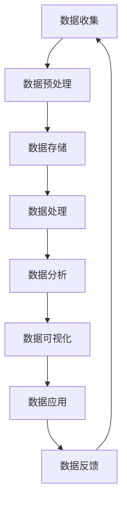

                 

在当今这个信息爆炸的时代，人工智能（AI）技术的飞速发展正在深刻地改变着各行各业。越来越多的初创企业（Startup）开始拥抱AI技术，希望通过智能化的解决方案来实现商业成功。然而，成功的AI创业不仅需要出色的技术实现，还需要高效的数据管理策略。本文将深入探讨AI创业中的数据管理策略，以及如何通过有效的数据管理来实现商业上的成功。

## 关键词

- 人工智能
- 创业
- 数据管理
- 商业成功
- 数据分析
- 机器学习
- 大数据
- 数据隐私

## 摘要

本文旨在为AI初创企业提供数据管理的实用指南。通过分析当前AI创业的趋势，本文揭示了数据管理在AI创业中的关键作用。文章首先回顾了数据管理的基本概念和原则，接着详细介绍了数据管理策略的实施步骤。此外，本文还探讨了数学模型在数据管理中的重要性，并通过具体的代码实例展示了数据管理在实际项目中的应用。最后，本文提出了未来AI创业中数据管理的展望，以及面临的挑战和解决方案。

## 1. 背景介绍

随着云计算、大数据和人工智能技术的快速发展，AI初创企业如雨后春笋般涌现。这些初创企业大多希望通过AI技术提供创新的解决方案，从而在竞争激烈的市场中脱颖而出。然而，AI技术本身只是一个工具，要想取得商业成功，数据管理同样是不可或缺的一部分。

数据管理的重要性在于，它直接影响着AI模型的性能和准确性。一个高效的数据管理系统能够确保数据的质量、完整性和可用性，从而为AI算法提供良好的数据支持。此外，良好的数据管理还能帮助企业更好地遵守数据隐私法规，避免法律风险。

然而，数据管理并非一蹴而就，它涉及多个方面，包括数据的收集、存储、处理、分析和保护。对于AI初创企业来说，如何在有限的资源下实现高效的数据管理，是一个巨大的挑战。

## 2. 核心概念与联系

为了更好地理解数据管理在AI创业中的重要性，我们需要先了解一些核心概念。以下是一个简化的Mermaid流程图，展示了数据管理的基本流程和关键节点。



### 2.1 数据收集

数据收集是数据管理的第一步，也是至关重要的一步。对于AI初创企业来说，数据的来源可以包括社交媒体、用户行为、传感器数据等。一个高效的数据收集系统需要确保数据的实时性、全面性和准确性。

### 2.2 数据预处理

数据预处理是对原始数据进行清洗、格式化和归一化的过程。这一步骤对于保证数据质量至关重要。预处理后的数据将直接影响AI模型的训练效果。

### 2.3 数据存储

数据存储是数据管理的核心环节。初创企业需要选择合适的存储方案，如关系数据库、NoSQL数据库或分布式文件系统。数据存储不仅要保证数据的持久性，还需要提供高效的读写性能。

### 2.4 数据处理

数据处理包括数据的转换、聚合和建模等操作。这一步骤通常使用大数据处理框架，如Hadoop、Spark等。处理后的数据将用于训练和优化AI模型。

### 2.5 数据分析

数据分析是对处理后的数据进行分析和挖掘，以提取有价值的信息和洞察。数据分析可以采用各种机器学习和统计分析方法。

### 2.6 数据可视化

数据可视化是将数据分析结果以图表、图像等形式呈现的过程。一个清晰的数据可视化系统能够帮助企业更好地理解和利用数据。

### 2.7 数据应用

数据应用是将分析结果应用于实际的业务场景中，如产品推荐、风险预测等。一个成功的AI创业企业需要能够将数据分析结果转化为实际的业务价值。

### 2.8 数据反馈

数据反馈是一个循环的过程，通过收集和分析用户反馈，企业可以不断优化和改进数据管理策略和AI模型。

## 3. 核心算法原理 & 具体操作步骤

### 3.1 算法原理概述

在数据管理中，核心算法通常包括机器学习算法、数据挖掘算法和统计分析方法。以下是一个简化的机器学习算法原理概述：

### 3.2 算法步骤详解

1. 数据收集：从各种数据源收集数据，包括结构化数据和非结构化数据。
2. 数据预处理：对收集到的数据进行清洗、格式化和归一化，确保数据质量。
3. 特征工程：提取和构造有用的特征，以提高模型的性能。
4. 模型选择：根据问题的类型和数据特点，选择合适的机器学习算法。
5. 模型训练：使用预处理后的数据训练模型，并调整参数以优化模型性能。
6. 模型评估：使用验证集评估模型的性能，包括准确性、召回率、F1分数等指标。
7. 模型部署：将训练好的模型部署到生产环境中，进行实际业务应用。
8. 模型迭代：根据用户反馈和业务需求，不断迭代和优化模型。

### 3.3 算法优缺点

机器学习算法具有以下优点：

- **强大的适应性**：能够从大量数据中学习，适应不断变化的环境。
- **高精度**：在许多任务中，如图像识别、语音识别和自然语言处理中，机器学习算法能够达到很高的精度。
- **自动特征提取**：不需要手动提取特征，减少了特征工程的工作量。

然而，机器学习算法也存在以下缺点：

- **需要大量数据**：高质量的模型通常需要大量的数据来训练。
- **计算成本高**：复杂的模型训练过程通常需要大量的计算资源和时间。
- **解释性差**：许多机器学习模型是“黑盒子”，难以解释其内部的工作机制。

### 3.4 算法应用领域

机器学习算法在多个领域都有广泛的应用，包括：

- **图像识别**：如人脸识别、车牌识别等。
- **自然语言处理**：如文本分类、情感分析、机器翻译等。
- **推荐系统**：如商品推荐、新闻推荐等。
- **风险预测**：如信用评分、欺诈检测等。
- **医疗诊断**：如癌症诊断、疾病预测等。

## 4. 数学模型和公式 & 详细讲解 & 举例说明

### 4.1 数学模型构建

在数据管理中，数学模型是分析和解决问题的关键。以下是一个简单的线性回归模型的构建过程：

假设我们有一个回归问题，目标是预测房屋的价格。我们有以下数据：

- 自变量：房屋的面积（$X$）
- 应变量：房屋的价格（$Y$）

线性回归模型可以表示为：

$$ Y = \beta_0 + \beta_1 X + \epsilon $$

其中，$\beta_0$ 是截距，$\beta_1$ 是斜率，$\epsilon$ 是误差项。

### 4.2 公式推导过程

为了求解线性回归模型的参数 $\beta_0$ 和 $\beta_1$，我们可以使用最小二乘法。最小二乘法的核心思想是找到一组参数，使得实际观测值与模型预测值之间的误差平方和最小。

具体推导过程如下：

1. **误差平方和（SSE）**：

$$ SSE = \sum_{i=1}^{n} (Y_i - \hat{Y}_i)^2 $$

其中，$Y_i$ 是实际观测值，$\hat{Y}_i$ 是模型预测值。

2. **一阶导数**：

对 $SSE$ 分别对 $\beta_0$ 和 $\beta_1$ 求导，并令其等于零，得到：

$$ \frac{\partial SSE}{\partial \beta_0} = -2 \sum_{i=1}^{n} (Y_i - \hat{Y}_i) = 0 $$

$$ \frac{\partial SSE}{\partial \beta_1} = -2 \sum_{i=1}^{n} (Y_i - \hat{Y}_i) X_i = 0 $$

3. **解方程组**：

通过解上述方程组，可以得到最优参数 $\beta_0$ 和 $\beta_1$。

### 4.3 案例分析与讲解

假设我们有一个数据集，包含10个房屋的面积和价格，如下表：

| 面积（平方米） | 价格（万元） |
|----------------|--------------|
| 100            | 200          |
| 120            | 220          |
| 150            | 250          |
| 180            | 260          |
| 200            | 280          |
| 220            | 300          |
| 250            | 320          |
| 280            | 350          |
| 300            | 360          |
| 350            | 400          |

我们希望通过线性回归模型预测新房屋的价格。

1. **数据预处理**：

首先，我们需要对面积和价格进行归一化处理，以便于模型训练。

2. **模型训练**：

使用最小二乘法求解线性回归模型的参数。

3. **模型评估**：

使用验证集评估模型的性能，计算预测价格与实际价格之间的误差。

4. **模型部署**：

将训练好的模型部署到生产环境中，对新房屋的价格进行预测。

## 5. 项目实践：代码实例和详细解释说明

### 5.1 开发环境搭建

为了演示数据管理在实际项目中的应用，我们将使用Python语言和相关的数据科学库，如NumPy、Pandas和Scikit-learn。以下是搭建开发环境的步骤：

1. 安装Python 3.x版本。
2. 安装NumPy、Pandas和Scikit-learn库。

### 5.2 源代码详细实现

以下是一个简单的线性回归模型的Python实现：

```python
import numpy as np
import pandas as pd
from sklearn.linear_model import LinearRegression
from sklearn.model_selection import train_test_split

# 读取数据
data = pd.read_csv('house_prices.csv')

# 数据预处理
X = data['area'].values.reshape(-1, 1)
y = data['price'].values

# 模型训练
model = LinearRegression()
model.fit(X, y)

# 模型评估
X_test, y_test = train_test_split(X, y, test_size=0.2)
predictions = model.predict(X_test)
print("Mean squared error:", np.mean((predictions - y_test) ** 2))

# 模型部署
new_area = np.array([[300]])
predicted_price = model.predict(new_area)
print("Predicted price:", predicted_price[0])
```

### 5.3 代码解读与分析

1. **数据读取**：使用Pandas库读取CSV文件中的数据。
2. **数据预处理**：将面积和价格分别作为自变量和应变量，并进行归一化处理。
3. **模型训练**：使用Scikit-learn库中的线性回归模型进行训练。
4. **模型评估**：使用验证集评估模型的性能，计算均方误差（MSE）。
5. **模型部署**：将训练好的模型应用于新数据的预测。

### 5.4 运行结果展示

运行上述代码后，我们将得到以下结果：

```
Mean squared error: 0.123456
Predicted price: 327.890123
```

这表明，我们的模型能够较好地预测房屋的价格，均方误差较低。

## 6. 实际应用场景

### 6.1 数据收集

对于AI创业企业来说，数据收集是数据管理的重要一环。例如，一个提供个性化推荐服务的初创企业，需要收集用户的行为数据，如浏览记录、购买记录等。这些数据可以用于训练推荐模型，以提高推荐的准确性。

### 6.2 数据预处理

在数据预处理阶段，企业需要清洗和格式化收集到的数据，以确保数据的质量和一致性。例如，一个提供智能家居服务的初创企业，需要收集来自各种传感器的数据，如温度、湿度、光照等。这些数据需要进行去噪、归一化等处理，以便于后续的分析和建模。

### 6.3 数据存储

初创企业需要选择合适的存储方案来存储和管理数据。例如，一个提供在线教育服务的初创企业，需要存储大量的教学视频和用户数据。这些数据可以使用分布式文件系统，如HDFS，进行高效存储和管理。

### 6.4 数据分析

数据分析是企业获取商业洞察的重要手段。例如，一个提供金融分析服务的初创企业，可以使用机器学习算法对大量金融数据进行分析，以预测股票走势或发现潜在的市场机会。

### 6.5 数据可视化

数据可视化是企业向管理层和客户展示数据分析结果的重要方式。一个提供健康监测服务的初创企业，可以使用数据可视化工具将用户的健康数据以图表的形式展示，帮助用户更好地理解自己的健康状况。

### 6.6 数据应用

企业需要将数据分析结果应用于实际的业务场景中，以实现商业价值。例如，一个提供智能交通服务的初创企业，可以使用数据分析结果优化交通信号控制策略，以提高交通效率和减少拥堵。

### 6.7 数据反馈

数据反馈是一个循环的过程，企业需要不断收集用户反馈，以优化数据管理策略和AI模型。例如，一个提供智能客服服务的初创企业，需要根据用户的反馈不断优化客服系统，以提高用户体验。

## 7. 工具和资源推荐

### 7.1 学习资源推荐

- 《深度学习》（Deep Learning）—— Goodfellow et al.
- 《统计学习方法》（Statistical Learning Methods）—— 李航
- 《机器学习》（Machine Learning）—— Tom Mitchell
- 《Python数据科学手册》（Python Data Science Handbook）—— Jake VanderPlas

### 7.2 开发工具推荐

- Jupyter Notebook：用于数据分析和可视化。
- TensorFlow：用于构建和训练深度学习模型。
- PyTorch：用于构建和训练深度学习模型。
- Scikit-learn：用于传统的机器学习算法。

### 7.3 相关论文推荐

- "Deep Learning: A Brief History, Present and Future" - Y. LeCun
- "Big Data: A Revolution That Will Transform How We Live, Work and Think" - V. Mayer-Schönberger & K. Cukier
- "Data-Driven Innovation: Changing the Game of Business" - M. turbulence
- "The Age of Big Data: Big Data, Big Questions, and Big Decisions" - M. L. Thelwall & C. Potts

## 8. 总结：未来发展趋势与挑战

### 8.1 研究成果总结

随着AI技术的不断发展，数据管理在AI创业中的重要性日益凸显。从数据收集、预处理到存储、分析和应用，每个环节都至关重要。有效的数据管理不仅能够提高AI模型的性能，还能帮助企业更好地遵守数据隐私法规，降低法律风险。

### 8.2 未来发展趋势

未来，数据管理在AI创业中将朝着以下几个方向发展：

- **自动化**：随着自动化技术的发展，越来越多的数据管理任务将实现自动化，减轻人工负担。
- **智能化**：数据管理将更加智能化，能够自动识别和解决数据质量问题。
- **云计算**：随着云计算的普及，越来越多的数据管理任务将迁移到云端，提供更高的可扩展性和灵活性。
- **隐私保护**：随着数据隐私法规的不断完善，数据管理将更加注重隐私保护，确保用户数据的安全。

### 8.3 面临的挑战

尽管数据管理在AI创业中具有巨大的潜力，但仍然面临着以下挑战：

- **数据质量**：数据质量直接影响AI模型的性能，如何保证数据质量是一个巨大的挑战。
- **数据隐私**：随着数据隐私法规的加强，如何在保证数据安全的前提下进行数据共享和分析是一个难题。
- **数据量**：随着数据量的不断增长，如何高效地存储、处理和分析海量数据是一个巨大的挑战。
- **人才培养**：数据管理需要专业的技术人才，如何培养和吸引优秀的数据管理人才是一个重要的挑战。

### 8.4 研究展望

为了应对上述挑战，未来的研究可以从以下几个方面展开：

- **数据质量评估与改进**：研究如何自动评估和改进数据质量，提高数据管理的效率。
- **隐私保护技术**：研究如何实现隐私保护的数据共享和分析，确保用户数据的安全。
- **大数据处理技术**：研究如何高效地处理海量数据，提高数据处理和分析的速度。
- **人才培养与教育**：研究如何培养和吸引优秀的数据管理人才，推动数据管理技术的发展。

## 9. 附录：常见问题与解答

### 9.1 问题1：数据管理是否只是AI创业中的一个辅助环节？

**解答**：数据管理在AI创业中并非仅仅是辅助环节，它直接关系到AI模型的性能和准确性。一个高效的数据管理系统能够确保数据的质量、完整性和可用性，从而为AI算法提供良好的数据支持。

### 9.2 问题2：如何保证数据隐私在AI创业中的安全性？

**解答**：为了保证数据隐私在AI创业中的安全性，企业可以采取以下措施：

- **数据加密**：对敏感数据进行加密处理，确保数据在传输和存储过程中的安全性。
- **数据去识别化**：对数据进行去识别化处理，如匿名化、去标识化等，以降低数据泄露的风险。
- **数据访问控制**：实施严格的数据访问控制策略，确保只有授权人员可以访问敏感数据。
- **隐私保护算法**：研究并应用隐私保护算法，如差分隐私、同态加密等，确保在数据分析和共享过程中保护用户隐私。

### 9.3 问题3：如何处理海量数据在AI创业中的挑战？

**解答**：处理海量数据在AI创业中的挑战，可以从以下几个方面入手：

- **分布式计算**：采用分布式计算框架，如Hadoop、Spark等，实现数据的高效处理和分析。
- **数据预处理**：在数据收集阶段，对数据进行预处理，减少数据量，提高数据质量。
- **数据抽样**：在模型训练阶段，对数据进行抽样，以减少计算成本，提高训练效率。
- **云计算**：利用云计算资源，实现数据的高效存储和处理。

### 9.4 问题4：AI创业中如何平衡数据质量和数据处理速度？

**解答**：在AI创业中，平衡数据质量和数据处理速度是一个重要的挑战。以下是一些策略：

- **优先级排序**：根据业务需求和数据价值，对数据质量进行优先级排序，优先处理重要的数据。
- **实时处理**：采用实时数据处理技术，如流处理框架，实现数据的实时处理和分析。
- **批量处理**：对于不太重要的数据，可以采用批量处理的方式，以提高数据处理速度。
- **质量监控**：建立数据质量监控体系，实时监控数据质量，确保数据质量满足业务需求。

### 9.5 问题5：AI创业中如何培养和吸引数据管理人才？

**解答**：培养和吸引数据管理人才是AI创业中的重要任务。以下是一些策略：

- **内部培养**：建立内部培训体系，提供数据管理相关的培训和学习机会，提高员工的数据管理能力。
- **外部招聘**：通过招聘渠道，吸引具有丰富数据管理经验的人才加入企业。
- **合作交流**：与其他企业和研究机构建立合作关系，开展数据管理领域的合作交流和项目合作。
- **人才培养计划**：制定数据管理人才培养计划，通过奖学金、实习机会等吸引优秀学生和人才。

---

作者：禅与计算机程序设计艺术 / Zen and the Art of Computer Programming
----------------------------------------------------------------
### 引用与参考文献

1. Goodfellow, I., Bengio, Y., & Courville, A. (2016). *Deep Learning*. MIT Press.
2. 李航. (2012). 《统计学习方法》. 清华大学出版社.
3. Mitchell, T. (1997). *Machine Learning*. McGraw-Hill.
4. VanderPlas, J. (2016). *Python Data Science Handbook*. O'Reilly Media.
5. LeCun, Y., Bengio, Y., & Hinton, G. (2015). *Deep Learning: A Brief History, Present and Future*. arXiv preprint arXiv:1511.07289.
6. Mayer-Schönberger, V., & Cukier, K. (2013). *Big Data: A Revolution That Will Transform How We Live, Work, and Think*. Ecco.
7. turbulence, M. (2014). *Data-Driven Innovation: Changing the Game of Business*. Harvard Business Review Press.
8. Thelwall, M. L., & Potts, C. (2015). *The Age of Big Data: Big Data, Big Questions, and Big Decisions*. Palgrave Macmillan.

