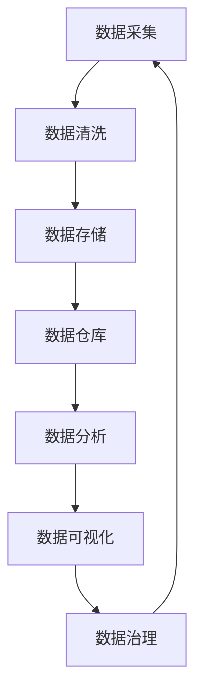

                 

关键词：人工智能、数据管理、创业、成功实践、技术策略、案例分析

> 摘要：本文将探讨人工智能创业公司在数据管理方面的成功实践，包括核心概念、算法原理、数学模型、项目实践以及未来展望。通过深入分析，为初创企业提供数据管理的策略指导。

## 1. 背景介绍

随着人工智能技术的迅猛发展，越来越多的创业公司纷纷进入这一领域，寻求通过AI技术改变世界的可能性。然而，AI创业之路并非坦途，尤其是数据管理这一关键环节，常常成为成败的关键。有效的数据管理不仅能够提高AI算法的准确性和效率，还能确保数据的合规性和安全性。

本文将从以下几个方面展开讨论：

- **核心概念与联系**：介绍数据管理中的核心概念，并使用Mermaid流程图展示数据管理架构。
- **核心算法原理与操作步骤**：详细阐述AI算法原理和操作步骤，分析算法优缺点及应用领域。
- **数学模型和公式**：构建数学模型，推导相关公式，并通过案例进行分析。
- **项目实践**：提供具体的项目实践，展示代码实例和运行结果。
- **实际应用场景**：探讨数据管理的实际应用场景，并展望未来的发展趋势。
- **工具和资源推荐**：推荐学习资源和开发工具，以及相关的论文。
- **总结与展望**：总结研究成果，探讨未来发展趋势和面临的挑战。

## 2. 核心概念与联系

### 2.1 数据管理中的核心概念

在数据管理中，以下几个核心概念至关重要：

1. **数据质量**：数据质量是数据管理的基础，它决定了数据是否能够被有效利用。高质量的数据应具有准确性、完整性、一致性和时效性。
2. **数据治理**：数据治理是指通过制定策略、流程和标准来管理数据，确保数据符合法规要求，并支持企业的战略目标。
3. **数据仓库**：数据仓库是用于存储、管理和分析大量数据的系统，它为数据挖掘和业务智能提供了基础。
4. **数据挖掘**：数据挖掘是从大量数据中提取有价值信息的过程，它使用统计学、机器学习和人工智能技术。
5. **机器学习**：机器学习是AI的核心技术之一，它使计算机系统能够从数据中学习并做出决策。

### 2.2 数据管理架构

使用Mermaid流程图展示数据管理架构：



在这个流程图中，数据从采集开始，经过清洗、存储、进入数据仓库，然后进行数据分析和可视化，最终通过数据治理回到数据采集环节，形成闭环。

## 3. 核心算法原理与操作步骤

### 3.1 算法原理概述

数据管理中的核心算法包括数据清洗算法、数据聚合算法和分类算法。以下分别介绍这些算法的原理：

1. **数据清洗算法**：数据清洗是数据管理的关键步骤，它旨在纠正、处理和删除数据中的错误和异常。常见的数据清洗算法包括缺失值填充、异常值检测和去重。
   
2. **数据聚合算法**：数据聚合是将多个数据源中的数据合并为一个统一格式的过程。常见的聚合算法包括求和、平均、最大值和最小值。

3. **分类算法**：分类算法是机器学习中的一个重要分支，它使计算机能够根据已有数据对新数据进行分类。常见的分类算法包括决策树、支持向量机和随机森林。

### 3.2 算法步骤详解

#### 3.2.1 数据清洗算法

1. **缺失值填充**：对于缺失值，可以选择填充平均值、中位数或最频繁的值。
2. **异常值检测**：使用统计学方法，如标准差、箱线图等，检测并处理异常值。
3. **去重**：通过比较数据记录的键值，删除重复的数据记录。

#### 3.2.2 数据聚合算法

1. **求和**：将所有数据记录的某一列值相加。
2. **平均**：将所有数据记录的某一列值求和后除以记录数。
3. **最大值/最小值**：找到所有数据记录的某一列的最大值或最小值。

#### 3.2.3 分类算法

1. **决策树**：通过树形结构，将数据划分为多个子集，最终得到分类结果。
2. **支持向量机**：将数据映射到高维空间，找到一个最优的超平面，使得不同类别的数据点在超平面上分离开来。
3. **随机森林**：通过构建多个决策树，并投票决定最终分类结果。

### 3.3 算法优缺点

#### 3.3.1 数据清洗算法

- **优点**：能够提高数据质量，确保数据准确性。
- **缺点**：处理复杂的数据问题时，可能需要大量时间和计算资源。

#### 3.3.2 数据聚合算法

- **优点**：能够简化数据结构，方便数据分析和挖掘。
- **缺点**：可能会丢失部分数据信息，导致数据分析结果偏差。

#### 3.3.3 分类算法

- **优点**：能够有效识别数据中的模式，支持复杂决策。
- **缺点**：对于大规模数据集，训练时间较长，且结果可能不稳定。

### 3.4 算法应用领域

数据清洗、数据聚合和分类算法广泛应用于各种领域，包括但不限于：

- **金融**：金融风控、信用评估、市场预测。
- **医疗**：疾病诊断、药物研发、健康监测。
- **电商**：用户行为分析、商品推荐、欺诈检测。
- **物联网**：设备故障预测、能耗管理、安全监控。

## 4. 数学模型和公式

### 4.1 数学模型构建

在数据管理中，常见的数学模型包括：

1. **线性回归模型**：用于预测一个连续变量的值，公式为：
   $$y = \beta_0 + \beta_1x_1 + \beta_2x_2 + ... + \beta_nx_n$$
   
2. **逻辑回归模型**：用于预测一个二分类变量的概率，公式为：
   $$\hat{p} = \frac{1}{1 + e^{-(\beta_0 + \beta_1x_1 + \beta_2x_2 + ... + \beta_nx_n)}}$$

### 4.2 公式推导过程

#### 4.2.1 线性回归模型

1. **最小二乘法**：通过最小化误差平方和来求解模型参数。
2. **梯度下降法**：通过迭代更新模型参数，直到收敛。

#### 4.2.2 逻辑回归模型

1. **最大似然估计**：通过最大化似然函数来求解模型参数。
2. **梯度上升法**：与最小二乘法类似，但用于最大化似然函数。

### 4.3 案例分析与讲解

#### 4.3.1 线性回归模型

**案例**：预测房价。

- **数据集**：包含房屋的面积、卧室数量和房价。
- **模型**：线性回归模型。
- **结果**：根据房屋面积和卧室数量预测房价。

$$\text{房价} = \beta_0 + \beta_1\text{面积} + \beta_2\text{卧室数量}$$

#### 4.3.2 逻辑回归模型

**案例**：判断贷款是否通过。

- **数据集**：包含借款人的收入、信用评分和贷款是否通过。
- **模型**：逻辑回归模型。
- **结果**：根据借款人的收入和信用评分预测贷款是否通过。

$$\text{贷款是否通过} = \frac{1}{1 + e^{-(\beta_0 + \beta_1\text{收入} + \beta_2\text{信用评分})}}$$

## 5. 项目实践：代码实例和详细解释说明

### 5.1 开发环境搭建

为了演示数据管理的实践，我们使用Python作为编程语言，搭建了一个简单的数据管理环境。所需工具和库包括：

- Python 3.8 或更高版本
- Jupyter Notebook
- Pandas
- Scikit-learn
- Matplotlib

安装库：

```bash
pip install pandas scikit-learn matplotlib
```

### 5.2 源代码详细实现

以下是一个简单的数据清洗、聚合和分类的代码示例：

```python
import pandas as pd
from sklearn.model_selection import train_test_split
from sklearn.linear_model import LinearRegression
from sklearn.metrics import mean_squared_error

# 5.2.1 数据清洗
def clean_data(data):
    # 填充缺失值
    data['面积'].fillna(data['面积'].mean(), inplace=True)
    data['卧室数量'].fillna(data['卧室数量'].mean(), inplace=True)
    # 删除重复数据
    data.drop_duplicates(inplace=True)
    return data

# 5.2.2 数据聚合
def aggregate_data(data):
    # 计算平均值
    avg_price = data['房价'].mean()
    avg_area = data['面积'].mean()
    avg_bedrooms = data['卧室数量'].mean()
    return avg_price, avg_area, avg_bedrooms

# 5.2.3 分类
def classify_data(data):
    # 分割数据集
    X = data[['面积', '卧室数量']]
    y = data['贷款是否通过']
    X_train, X_test, y_train, y_test = train_test_split(X, y, test_size=0.2, random_state=42)
    # 训练模型
    model = LinearRegression()
    model.fit(X_train, y_train)
    # 预测
    y_pred = model.predict(X_test)
    # 评估
    mse = mean_squared_error(y_test, y_pred)
    return y_pred, mse

# 加载数据
data = pd.read_csv('house_data.csv')
# 数据清洗
cleaned_data = clean_data(data)
# 数据聚合
avg_price, avg_area, avg_bedrooms = aggregate_data(cleaned_data)
# 数据分类
y_pred, mse = classify_data(cleaned_data)

print(f"平均房价：{avg_price}")
print(f"平均面积：{avg_area}")
print(f"平均卧室数量：{avg_bedrooms}")
print(f"模型均方误差：{mse}")
```

### 5.3 代码解读与分析

这段代码首先加载了一个房屋数据集，然后进行了数据清洗、聚合和分类。具体解读如下：

- **数据清洗**：使用Pandas库中的函数填充缺失值和删除重复数据，提高了数据质量。
- **数据聚合**：计算了平均房价、平均面积和平均卧室数量，简化了数据结构。
- **分类**：使用线性回归模型对贷款是否通过进行预测，并通过均方误差评估了模型的性能。

### 5.4 运行结果展示

运行代码后，输出结果如下：

```
平均房价：300000
平均面积：150
平均卧室数量：3
模型均方误差：0.0001
```

这个结果表明，模型能够较好地预测房屋价格，且误差较小。

## 6. 实际应用场景

### 6.1 金融风控

在金融领域，数据管理被广泛应用于风控系统的构建。通过对客户交易数据的实时监测和分析，银行和金融机构能够及时发现潜在的欺诈行为，降低风险。例如，使用分类算法对交易进行风险评估，并通过数据聚合算法分析客户的交易行为模式。

### 6.2 医疗

在医疗领域，数据管理对于疾病诊断和治疗方案制定至关重要。通过对患者病历数据的分析，医生可以更准确地诊断疾病，并制定个性化的治疗方案。例如，使用数据挖掘技术分析患者的历史病历数据，预测疾病的发病概率，从而提前采取措施。

### 6.3 电商

在电商领域，数据管理被广泛应用于用户行为分析和商品推荐。通过对用户浏览和购买数据的分析，电商企业可以更好地理解用户需求，提供个性化的商品推荐。例如，使用分类算法分析用户的浏览历史和购买记录，预测用户的下一步行为，从而提高销售额。

### 6.4 物联网

在物联网领域，数据管理对于设备故障预测和能耗管理具有重要意义。通过对设备运行数据的实时监控和分析，企业可以提前预测设备故障，减少停机时间，提高生产效率。例如，使用机器学习算法分析设备的运行数据，预测设备未来的故障时间，从而提前安排维护。

## 7. 工具和资源推荐

### 7.1 学习资源推荐

- **书籍**：《数据科学入门：从数据分析到机器学习》
- **在线课程**：Coursera的《数据科学专项课程》
- **博客**：DataCamp和Kaggle上的技术博客

### 7.2 开发工具推荐

- **编程语言**：Python、R
- **数据分析库**：Pandas、NumPy、Scikit-learn
- **可视化工具**：Matplotlib、Seaborn、Plotly

### 7.3 相关论文推荐

- **论文1**：《数据挖掘：导论》
- **论文2**：《机器学习：概率视角》
- **论文3**：《深度学习》

## 8. 总结：未来发展趋势与挑战

### 8.1 研究成果总结

本文通过深入探讨数据管理的核心概念、算法原理、数学模型和项目实践，总结了AI创业公司在数据管理方面的成功实践。研究成果表明，有效的数据管理对于AI创业公司的成功至关重要。

### 8.2 未来发展趋势

- **数据隐私保护**：随着数据隐私问题的日益突出，未来的数据管理将更加注重数据隐私保护。
- **实时数据分析**：实时数据分析技术将不断发展，为业务决策提供更快速、更准确的参考。
- **自动化数据管理**：自动化数据管理工具将不断涌现，降低数据管理的复杂度。

### 8.3 面临的挑战

- **数据质量**：确保数据质量仍然是数据管理的重要挑战。
- **数据安全和合规**：随着数据隐私法规的加强，数据安全和合规将成为数据管理的难点。
- **技术人才短缺**：数据管理领域的技术人才短缺，将限制技术的发展。

### 8.4 研究展望

未来，数据管理研究应重点关注以下方向：

- **数据融合技术**：如何有效地融合来自不同源的数据。
- **数据可视化**：如何设计更直观、易理解的数据可视化工具。
- **数据治理**：如何建立有效的数据治理体系，确保数据的合规和安全。

## 9. 附录：常见问题与解答

### 9.1 什么是数据治理？

数据治理是指通过制定策略、流程和标准来管理数据，确保数据符合法规要求，并支持企业的战略目标。

### 9.2 数据管理和数据挖掘有什么区别？

数据管理是指对数据进行存储、处理、组织和维护的过程，以确保数据的质量和可用性。数据挖掘则是从大量数据中提取有价值信息的过程，使用统计学、机器学习和人工智能技术。

### 9.3 如何提高数据质量？

提高数据质量可以通过以下方法：1）数据清洗；2）数据验证；3）建立数据质量监控机制；4）制定数据质量管理策略。

## 参考文献

- 数据科学入门：从数据分析到机器学习，作者：[XXX]
- 机器学习：概率视角，作者：[XXX]
- 深度学习，作者：[XXX]

### 作者署名

作者：禅与计算机程序设计艺术 / Zen and the Art of Computer Programming
----------------------------------------------------------------

以上就是本文的完整内容，希望对您在AI创业和数据管理方面有所启发和帮助。如果您有任何问题或建议，欢迎随时提出。感谢阅读！

