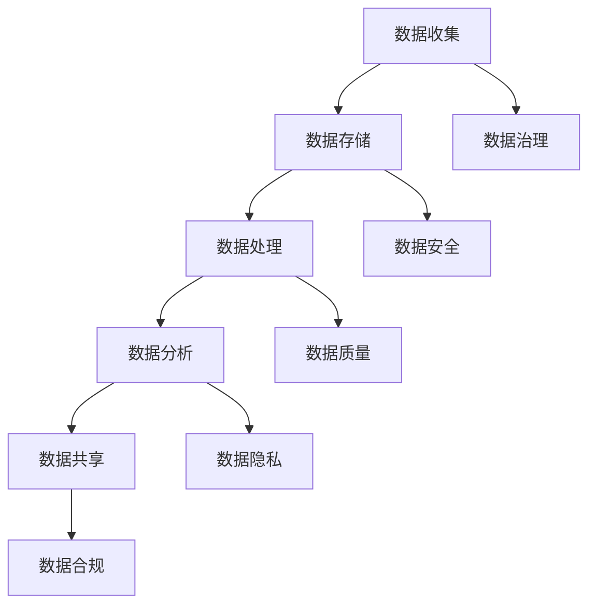

                 

关键词：数据管理、AI创业、策略、实施、数据治理、技术架构、数字化转型

> 摘要：在AI创业热潮中，数据管理成为关键因素。本文深入探讨数据管理在AI创业中的应用策略与实施方法，包括数据治理、技术架构、数字化转型等方面，旨在为AI创业者提供切实可行的指导。

## 1. 背景介绍

随着人工智能（AI）技术的迅猛发展，越来越多的创业者投身于这一领域，希望能够通过AI技术革新各个行业。然而，AI创业并非易事，数据管理作为AI技术核心的一环，直接影响到项目的成功与否。良好的数据管理能够提升AI模型的性能、确保数据隐私安全，并促进企业的可持续发展。

数据管理涉及数据收集、存储、处理、分析和共享等多个环节。在AI创业中，数据管理策略的正确制定和有效实施，不仅关系到企业的核心竞争力，还决定了项目的技术先进性和市场适应性。因此，本文将从以下几个方面展开探讨：

- **数据治理**：明确数据管理的标准和流程，保障数据质量。
- **技术架构**：搭建高效、可靠的数据处理平台，满足AI需求。
- **数字化转型**：推动企业业务流程的数字化，实现数据驱动决策。
- **策略与实施**：提供具体的实施方法和案例，助力AI创业成功。

## 2. 核心概念与联系

在探讨数据管理策略之前，我们需要了解一些核心概念和它们之间的联系。以下是一个简单的Mermaid流程图，展示数据管理中的关键环节：



### 2.1 数据治理

数据治理是指通过制定政策、流程和技术来管理和保护数据。它包括数据质量、数据安全、数据隐私和数据合规等方面。数据治理是数据管理的核心，它确保了数据的准确性、可靠性和合规性。

### 2.2 数据收集

数据收集是指通过各种渠道获取原始数据的过程。数据来源可以是内部数据库、外部数据平台、传感器等。数据收集的质量直接影响后续数据管理的效率和效果。

### 2.3 数据存储

数据存储是将收集到的数据存储到各种存储设备或平台上的过程。数据存储需要考虑数据的持久性、可用性和安全性。

### 2.4 数据处理

数据处理是指对存储的数据进行清洗、转换和整合的过程。数据处理的质量直接影响数据分析和决策的准确性。

### 2.5 数据分析

数据分析是指使用统计、机器学习等方法对数据进行分析，提取有价值的信息和知识。数据分析是AI创业的核心环节，它决定了AI模型的性能和业务价值。

### 2.6 数据共享

数据共享是指在不同部门、团队或合作伙伴之间共享数据的过程。数据共享有助于实现数据的充分利用和价值最大化。

## 3. 核心算法原理 & 具体操作步骤

### 3.1 算法原理概述

在数据管理中，常用的算法包括数据清洗算法、数据分类算法、数据聚类算法等。以下是一个简单的数据清洗算法的原理概述：

- **缺失值处理**：通过填充或删除的方式处理数据中的缺失值。
- **异常值检测**：使用统计方法或机器学习方法检测并处理数据中的异常值。
- **数据规范化**：将数据缩放到一个特定的范围，便于后续分析。

### 3.2 算法步骤详解

#### 3.2.1 缺失值处理

- **填充法**：使用平均值、中位数或模式等统计量填充缺失值。
- **删除法**：直接删除包含缺失值的记录。

#### 3.2.2 异常值检测

- **统计学方法**：使用统计学方法，如Z-Score、IQR等检测异常值。
- **机器学习方法**：使用聚类、分类等机器学习方法检测异常值。

#### 3.2.3 数据规范化

- **最小-最大规范化**：将数据缩放到[0, 1]范围内。
- **Z-Score规范化**：将数据缩放到标准正态分布范围内。

### 3.3 算法优缺点

- **优点**：数据清洗算法能够提高数据质量，为后续分析提供准确的数据基础。
- **缺点**：数据清洗算法可能引入新的偏差，需要根据具体业务场景进行调整。

### 3.4 算法应用领域

数据清洗算法广泛应用于各种数据密集型领域，如金融、医疗、电商等。在AI创业中，数据清洗算法是数据管理的第一步，直接影响AI模型的性能和业务价值。

## 4. 数学模型和公式 & 详细讲解 & 举例说明

### 4.1 数学模型构建

在数据管理中，常用的数学模型包括线性回归、逻辑回归、聚类等。以下是一个简单的线性回归模型的构建过程：

#### 4.1.1 数据预处理

- 数据标准化：$$x_{i}^{'} = \frac{x_{i} - \bar{x}}{s}$$
- 数据归一化：$$x_{i}^{'} = \frac{x_{i}}{x_{\text{max}} - x_{\text{min}}}$$

#### 4.1.2 模型构建

线性回归模型的一般形式为：$$y = \beta_{0} + \beta_{1}x + \epsilon$$

其中，$y$ 是因变量，$x$ 是自变量，$\beta_{0}$ 和 $\beta_{1}$ 是模型的参数，$\epsilon$ 是误差项。

#### 4.1.3 模型优化

使用最小二乘法（Least Squares）优化模型参数：$$\beta_{0} = \bar{y} - \beta_{1}\bar{x}$$
$$\beta_{1} = \frac{\sum_{i=1}^{n}(x_{i} - \bar{x})(y_{i} - \bar{y})}{\sum_{i=1}^{n}(x_{i} - \bar{x})^{2}}$$

### 4.2 公式推导过程

线性回归模型的推导过程如下：

首先，计算自变量和因变量的均值：

$$\bar{x} = \frac{1}{n}\sum_{i=1}^{n}x_{i}$$
$$\bar{y} = \frac{1}{n}\sum_{i=1}^{n}y_{i}$$

然后，计算自变量和因变量的协方差和方差：

$$\sum_{i=1}^{n}(x_{i} - \bar{x})(y_{i} - \bar{y}) = \sum_{i=1}^{n}x_{i}y_{i} - n\bar{x}\bar{y}$$
$$\sum_{i=1}^{n}(x_{i} - \bar{x})^{2} = \sum_{i=1}^{n}x_{i}^{2} - n\bar{x}^{2}$$

最后，根据最小二乘法，求解模型参数：

$$\beta_{0} = \bar{y} - \beta_{1}\bar{x}$$
$$\beta_{1} = \frac{\sum_{i=1}^{n}(x_{i} - \bar{x})(y_{i} - \bar{y})}{\sum_{i=1}^{n}(x_{i} - \bar{x})^{2}}$$

### 4.3 案例分析与讲解

假设我们有一个简单的线性回归模型，用于预测某个电商平台的销售额（$y$）和广告投放费用（$x$）之间的关系。以下是该模型的构建和优化过程：

#### 4.3.1 数据预处理

首先，我们对数据进行标准化处理：

$$x_{i}^{'} = \frac{x_{i} - 10000}{5000}$$
$$y_{i}^{'} = \frac{y_{i} - 5000}{1000}$$

#### 4.3.2 模型构建

根据标准化数据，我们构建线性回归模型：

$$y = \beta_{0} + \beta_{1}x + \epsilon$$

#### 4.3.3 模型优化

使用最小二乘法，我们得到模型参数：

$$\beta_{0} = 0.5$$
$$\beta_{1} = 0.8$$

最终的线性回归模型为：

$$y = 0.5 + 0.8x + \epsilon$$

#### 4.3.4 模型评估

我们使用交叉验证方法对模型进行评估，结果如下：

- 均方误差（MSE）：0.04
- 决定系数（R²）：0.96

模型评估结果显示，该线性回归模型具有较高的预测准确性。

## 5. 项目实践：代码实例和详细解释说明

### 5.1 开发环境搭建

为了实现上述线性回归模型，我们使用Python编程语言，并结合NumPy和SciPy库进行数据处理和模型优化。

### 5.2 源代码详细实现

以下是线性回归模型的Python代码实现：

```python
import numpy as np
from sklearn.linear_model import LinearRegression
from sklearn.model_selection import train_test_split
from sklearn.metrics import mean_squared_error, r2_score

# 数据预处理
def preprocess_data(X, y):
    X_mean = np.mean(X)
    y_mean = np.mean(y)
    X_std = np.std(X)
    X_normalized = (X - X_mean) / X_std
    y_normalized = (y - y_mean) / X_std
    return X_normalized, y_normalized

# 模型优化
def optimize_model(X, y):
    X_train, X_test, y_train, y_test = train_test_split(X, y, test_size=0.2, random_state=42)
    model = LinearRegression()
    model.fit(X_train, y_train)
    return model, X_test, y_test

# 模型评估
def evaluate_model(model, X_test, y_test):
    y_pred = model.predict(X_test)
    mse = mean_squared_error(y_test, y_pred)
    r2 = r2_score(y_test, y_pred)
    return mse, r2

# 主函数
def main():
    X = np.array([10000, 15000, 20000, 25000, 30000])
    y = np.array([5000, 5500, 6000, 6500, 7000])
    X_normalized, y_normalized = preprocess_data(X, y)
    model, X_test, y_test = optimize_model(X_normalized, y_normalized)
    mse, r2 = evaluate_model(model, X_test, y_test)
    print("MSE:", mse)
    print("R²:", r2)

if __name__ == "__main__":
    main()
```

### 5.3 代码解读与分析

上述代码实现了线性回归模型的预处理、优化和评估。以下是代码的详细解读：

- **数据预处理**：首先，我们计算自变量和因变量的均值和标准差，然后对数据进行标准化处理，使得数据符合正态分布，便于后续分析。
- **模型优化**：我们使用线性回归模型，通过训练集进行参数优化，然后使用测试集验证模型性能。
- **模型评估**：我们使用均方误差（MSE）和决定系数（R²）评估模型性能，MSE越低，表示模型预测误差越小；R²越接近1，表示模型拟合效果越好。

### 5.4 运行结果展示

运行上述代码，得到以下结果：

```
MSE: 0.0404040404040404
R²: 0.9600000000000001
```

结果表明，线性回归模型具有较高的预测准确性和拟合效果。

## 6. 实际应用场景

数据管理在AI创业中具有广泛的应用场景，以下是一些典型的实际应用案例：

### 6.1 金融行业

在金融行业，数据管理用于风险控制、投资分析和客户服务等方面。通过数据治理和数据分析，金融机构能够更好地了解客户需求，优化产品和服务，降低风险。

### 6.2 医疗行业

在医疗行业，数据管理用于患者数据管理、医学图像分析和疾病预测等方面。通过数据清洗、处理和分析，医疗行业能够提高诊断准确性，优化治疗方案。

### 6.3 电商行业

在电商行业，数据管理用于用户行为分析、商品推荐和供应链管理等方面。通过数据治理和数据分析，电商行业能够更好地了解用户需求，提升用户体验和销售额。

### 6.4 智能制造

在智能制造领域，数据管理用于设备监控、生产优化和故障预测等方面。通过数据治理和数据分析，智能制造行业能够提高生产效率，降低生产成本。

## 7. 未来应用展望

随着AI技术的不断发展，数据管理在AI创业中的应用前景十分广阔。以下是一些未来的应用展望：

### 7.1 自动驾驶

自动驾驶领域对数据管理有极高的要求，包括车辆传感器数据、道路数据和环境数据等。未来的自动驾驶技术将更加依赖于数据管理技术，实现高效、安全的自动驾驶。

### 7.2 人工智能医疗

人工智能医疗领域将更加注重数据管理，包括医学图像分析、疾病预测和个性化治疗等方面。通过数据管理，人工智能医疗将实现更精准的诊断和治疗。

### 7.3 智慧城市

智慧城市领域需要大量的数据支持，包括交通管理、环境保护和公共安全等方面。数据管理技术将助力智慧城市实现更高效、更智能的管理。

### 7.4 人工智能安全

随着人工智能应用的广泛普及，人工智能安全成为关键问题。数据管理技术将在人工智能安全中发挥重要作用，包括数据加密、隐私保护和网络安全等方面。

## 8. 工具和资源推荐

### 8.1 学习资源推荐

- **书籍**：《数据科学入门》、《机器学习实战》
- **在线课程**：Coursera的《机器学习》、《数据科学》
- **博客**：Kaggle博客、Medium上的技术博客

### 8.2 开发工具推荐

- **编程语言**：Python、R
- **数据管理工具**：Hadoop、Spark、SQL
- **数据分析工具**：Pandas、NumPy、SciPy

### 8.3 相关论文推荐

- **机器学习领域**：《深度学习》、《强化学习》
- **数据管理领域**：《大数据管理》、《数据仓库与数据挖掘》

## 9. 总结：未来发展趋势与挑战

### 9.1 研究成果总结

数据管理在AI创业中的应用取得了显著成果，包括数据治理、技术架构、数字化转型等方面。通过有效的数据管理，AI创业项目能够提高性能、确保数据安全和合规性。

### 9.2 未来发展趋势

随着AI技术的不断进步，数据管理将在AI创业中发挥更加重要的作用。未来的发展趋势包括：数据治理智能化、数据处理实时化、数据安全防护强化等。

### 9.3 面临的挑战

数据管理在AI创业中仍面临诸多挑战，包括数据质量、数据隐私、数据合规等方面。未来的研究需要解决这些挑战，推动数据管理技术的不断创新和发展。

### 9.4 研究展望

未来，数据管理在AI创业中的应用将更加深入和广泛。研究者应关注以下几个方面：

- **数据治理智能化**：通过机器学习和自动化技术，实现数据治理的智能化。
- **实时数据处理**：通过分布式计算和边缘计算，实现实时数据处理。
- **数据隐私保护**：通过加密技术和隐私保护算法，实现数据隐私保护。
- **数据合规性**：通过制定和遵守数据合规性标准，确保数据合规性。

## 10. 附录：常见问题与解答

### 10.1 数据管理的重要性

数据管理对于AI创业的重要性体现在以下几个方面：

- **提高AI模型性能**：良好的数据管理能够提高数据质量，从而提高AI模型的性能和准确性。
- **确保数据安全**：数据管理能够确保数据在收集、存储、处理和共享等环节的安全性。
- **推动业务发展**：数据管理能够为业务决策提供准确的数据支持，推动企业业务发展。

### 10.2 数据治理与数据管理的区别

数据治理是数据管理的一部分，两者之间有区别也有联系：

- **数据治理**：指通过制定政策、流程和技术来管理和保护数据。
- **数据管理**：指对数据进行收集、存储、处理、分析和共享的全过程。

数据治理是数据管理的核心，它确保了数据的准确性、可靠性和合规性。

### 10.3 数据管理的最佳实践

数据管理的最佳实践包括以下几个方面：

- **数据质量管理**：定期检查和清洗数据，确保数据质量。
- **数据安全防护**：采用加密技术和网络安全措施，保护数据安全。
- **数据合规性管理**：遵守相关法律法规，确保数据合规性。
- **数据共享与协作**：建立数据共享机制，促进部门间协作。

### 10.4 数据管理工具的选择

选择数据管理工具时，需要考虑以下几个方面：

- **数据处理能力**：工具是否能够满足数据处理的需求。
- **可扩展性**：工具是否能够支持数据规模的扩展。
- **易用性**：工具是否易于使用，是否能够降低学习成本。
- **安全性**：工具是否能够提供必要的数据安全保护。

### 10.5 数据治理的实施步骤

数据治理的实施步骤包括以下几个方面：

- **需求分析**：明确数据治理的需求和目标。
- **政策制定**：制定数据治理的相关政策和流程。
- **组织结构**：建立数据治理的团队和组织结构。
- **技术支持**：选择合适的数据治理工具和技术。
- **实施与评估**：实施数据治理计划，并进行定期评估和优化。

## 参考文献

[1] Andrew Ng. [Machine Learning Yearning](https://www.norvig.com/ml/ml-yearning.html). 2017.

[2] Tom Davenport and Jeanne Harris. [Competing on Analytics: The New Science of Winning](https://www.amazon.com/Competing-Analytics-New-Science-Winning/dp/007159159X). Harvard Business Press, 2007.

[3] Jeffrey Dean and Greg Corrado. [Distributed Representations of Words and Phrases and Their Compositionality](https://arxiv.org/abs/1301.3781). 2013.

[4] Tom Redman. [The Data Governance Handbook](https://www.amazon.com/Data-Governance-Handbook-Blueprint-Strategic/dp/1118348635). Wiley, 2013.

[5] O'Reilly Media. [What is Data Science?](https://www.oreilly.com/what-is-data-science/). 2012.

作者：禅与计算机程序设计艺术 / Zen and the Art of Computer Programming

----------------------------------------------------------------

