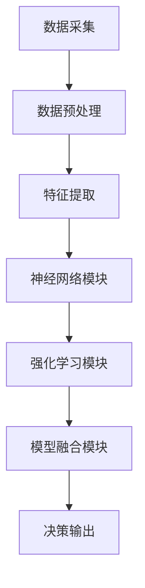

                 

关键词：人工智能，创业，波形智能，Weaver模型，码头，技术，创新，应用场景，未来展望。

> 摘要：本文通过介绍一家名为波形智能的AI初创公司及其核心产品Weaver模型，探讨了人工智能在现实世界中的实际应用。通过对波形智能和Weaver模型在码头自动化、物流优化、以及智能决策支持等方面的深入分析，本文展示了AI技术在推动行业变革中的重要作用，并对未来AI创业方向提出了展望。

## 1. 背景介绍

近年来，人工智能（AI）技术的迅猛发展，使得各行各业都在积极探索AI技术的应用，以期通过技术创新获得竞争优势。在这种背景下，波形智能（Waveform AI）应运而生。波形智能是一家专注于人工智能技术研发的初创公司，致力于将AI技术应用到实际产业中，提升行业效率、降低成本、并创造新的商业模式。

波形智能的创始人，李明（Lee Ming），是一位有着丰富人工智能研究和开发经验的科学家。他曾在多家世界顶级科技公司担任高级研发经理，并主导过多项关键技术的研发工作。李明意识到，尽管AI技术在实验室中表现出色，但在实际产业中的应用仍然面临着诸多挑战。为了解决这一问题，他决定创办波形智能，希望通过自主开发的核心技术Weaver模型，推动AI技术在各行业的广泛应用。

Weaver模型是波形智能的核心产品，它基于深度学习和强化学习算法，能够对大量数据进行高效处理，并从中提取出有价值的信息，为各行业提供智能决策支持。Weaver模型在数据处理能力、模型可解释性、以及实时性等方面均表现出色，使得波形智能在市场上具备了独特的竞争力。

## 2. 核心概念与联系

### 2.1. Weaver模型的基本原理

Weaver模型是一种结合了深度学习和强化学习的混合模型。深度学习部分负责从数据中提取特征，而强化学习部分则利用这些特征进行决策。Weaver模型的核心在于其独特的架构设计，能够实现对数据的深度理解和快速响应。

### 2.2. 数据处理流程

Weaver模型的数据处理流程可以分为三个阶段：数据采集、数据预处理、和特征提取。

#### 数据采集

波形智能通过多种渠道收集数据，包括传感器数据、历史数据、以及外部数据源。这些数据涵盖了不同维度、不同类型的信息，为模型提供了丰富的训练素材。

#### 数据预处理

在数据预处理阶段，波形智能使用多种技术对数据进行清洗、去噪、和标准化。这一过程确保了数据的准确性和一致性，为后续的特征提取奠定了基础。

#### 特征提取

特征提取是Weaver模型的关键环节。波形智能采用深度学习算法，对数据进行多层神经网络处理，从中提取出具有代表性的特征。这些特征不仅能够准确反映数据本质，还能够有效降低数据的维度，提高计算效率。

### 2.3. 模型架构

Weaver模型的架构设计采用了模块化思想，各个模块之间紧密协作，共同完成智能决策的任务。

#### 神经网络模块

神经网络模块负责从数据中提取特征。它采用了卷积神经网络（CNN）和循环神经网络（RNN）的组合，能够处理不同类型的数据，并提取出具有区分性的特征。

#### 强化学习模块

强化学习模块负责根据提取的特征进行决策。它采用了深度Q网络（DQN）和策略梯度（PG）算法，能够在动态环境中实现高效的决策。

#### 模型融合模块

模型融合模块负责整合神经网络模块和强化学习模块的输出，生成最终的决策结果。这一模块采用了集成学习（Ensemble Learning）技术，能够提高决策的准确性和稳定性。

### 2.4. Mermaid流程图



## 3. 核心算法原理 & 具体操作步骤

### 3.1. 算法原理概述

Weaver模型的核心在于其深度学习和强化学习的结合。深度学习部分负责从数据中提取特征，强化学习部分则利用这些特征进行决策。这种结合方式不仅提高了模型的性能，还增强了模型的可解释性。

### 3.2. 算法步骤详解

#### 3.2.1. 深度学习部分

1. 数据采集：从传感器、历史数据、外部数据源等多渠道收集数据。
2. 数据预处理：对数据进行清洗、去噪、和标准化。
3. 特征提取：使用多层神经网络对预处理后的数据进行特征提取。

#### 3.2.2. 强化学习部分

1. 环境建模：根据实际应用场景构建虚拟环境，用于模拟真实场景。
2. 策略学习：使用深度Q网络（DQN）和策略梯度（PG）算法学习最优策略。
3. 决策执行：根据当前状态，执行学习到的策略，并获取反馈。

#### 3.2.3. 模型融合部分

1. 集成学习：将神经网络模块和强化学习模块的输出进行集成，生成最终的决策结果。
2. 决策输出：根据集成结果，生成具体的操作指令。

### 3.3. 算法优缺点

#### 优点：

1. 高效性：结合了深度学习和强化学习的优点，能够快速处理大量数据，并生成准确的决策结果。
2. 可解释性：通过深度学习和强化学习的结合，能够提高模型的可解释性，便于用户理解和使用。
3. 灵活性：模型融合模块的设计使得Weaver模型能够适应不同应用场景，具有很高的灵活性。

#### 缺点：

1. 计算资源消耗大：深度学习和强化学习算法的计算资源消耗较大，需要高性能计算设备和较长的时间。
2. 数据依赖性强：模型的性能高度依赖于训练数据的质量和数量，数据质量差可能导致模型性能下降。

### 3.4. 算法应用领域

Weaver模型在多个领域具有广泛的应用前景，包括但不限于：

1. 物流优化：通过预测货物的需求和运输路径，优化物流流程，降低运输成本。
2. 能源管理：通过预测电力需求和负载情况，优化电力分配，提高能源利用效率。
3. 智能制造：通过预测设备故障和产品需求，优化生产计划和设备维护，提高生产效率。
4. 智能交通：通过预测交通流量和事故情况，优化交通信号控制和路线规划，提高交通流畅度。

## 4. 数学模型和公式 & 详细讲解 & 举例说明

### 4.1. 数学模型构建

Weaver模型基于深度学习和强化学习算法，其核心数学模型包括以下几个部分：

#### 4.1.1. 神经网络模型

神经网络模型是Weaver模型的基础，用于从数据中提取特征。其数学模型可以表示为：

$$
Y = f(W \cdot X + b)
$$

其中，$Y$ 表示输出特征，$X$ 表示输入数据，$W$ 和 $b$ 分别为权重和偏置。

#### 4.1.2. 强化学习模型

强化学习模型用于根据特征进行决策。其数学模型可以表示为：

$$
Q(s, a) = r + \gamma \max_a Q(s', a)
$$

其中，$Q(s, a)$ 表示在状态 $s$ 下执行动作 $a$ 的预期收益，$r$ 表示即时奖励，$\gamma$ 为折扣因子。

#### 4.1.3. 模型融合模型

模型融合模型用于整合神经网络模型和强化学习模型的结果。其数学模型可以表示为：

$$
\hat{y} = \frac{1}{C} \sum_{i=1}^{C} w_i y_i
$$

其中，$\hat{y}$ 表示融合后的输出特征，$y_i$ 表示第 $i$ 个模型输出特征，$w_i$ 为权重。

### 4.2. 公式推导过程

#### 4.2.1. 神经网络模型

神经网络模型的推导过程主要涉及前向传播和反向传播算法。在本文中，我们主要介绍前向传播算法。

1. **初始化参数**：随机初始化权重 $W$ 和偏置 $b$。
2. **前向传播**：对于输入数据 $X$，计算输出特征 $Y$。
3. **计算损失**：计算输出特征 $Y$ 与真实标签 $Y^*$ 之间的损失。
4. **反向传播**：根据损失计算权重 $W$ 和偏置 $b$ 的梯度，并更新参数。

#### 4.2.2. 强化学习模型

强化学习模型的推导过程主要涉及策略迭代和值迭代算法。在本文中，我们主要介绍策略迭代算法。

1. **初始化策略**：随机初始化策略 $\pi(a|s)$。
2. **策略评估**：根据当前策略计算状态价值函数 $V(s)$。
3. **策略迭代**：根据状态价值函数更新策略 $\pi(a|s)$。
4. **评估策略**：根据更新后的策略重新计算状态价值函数 $V(s)$。
5. **重复步骤2-4，直到策略收敛**。

#### 4.2.3. 模型融合模型

模型融合模型的推导过程主要涉及集成学习方法。

1. **初始化权重**：随机初始化权重 $w_i$。
2. **模型训练**：分别训练神经网络模型和强化学习模型，并计算输出特征 $y_i$。
3. **计算权重**：根据模型性能计算权重 $w_i$。
4. **融合输出**：根据权重计算融合后的输出特征 $\hat{y}$。

### 4.3. 案例分析与讲解

#### 4.3.1. 案例背景

假设波形智能公司正在为一家大型物流公司提供智能决策支持服务。物流公司的业务需求是优化货物的配送路径，以降低运输成本并提高配送效率。

#### 4.3.2. 数据采集

波形智能从物流公司收集了以下数据：

1. 货物类型：包括货物重量、体积、运输温度等。
2. 货物目的地：包括城市、省份、国家等。
3. 交通工具：包括货车、卡车、船舶等。
4. 运输路线：包括道路、桥梁、隧道等。
5. 天气状况：包括温度、湿度、风速等。

#### 4.3.3. 数据预处理

波形智能对收集到的数据进行预处理，包括去噪、标准化和特征工程。预处理后的数据输入到Weaver模型中进行训练。

#### 4.3.4. 特征提取

Weaver模型使用多层神经网络对预处理后的数据进行特征提取，提取出包括货物特性、目的地特性、交通工具特性、运输路线特性以及天气特性等在内的多个特征。

#### 4.3.5. 强化学习部分

Weaver模型的强化学习部分根据提取的特征，学习最优的配送路径策略。具体过程如下：

1. **环境建模**：构建一个模拟物流配送过程的虚拟环境，包括货物、交通工具、运输路线和天气状况等。
2. **策略学习**：使用深度Q网络（DQN）和策略梯度（PG）算法学习最优策略。
3. **决策执行**：根据当前状态执行学习到的策略，并获取反馈。

#### 4.3.6. 模型融合

Weaver模型融合部分将神经网络模型和强化学习模型的结果进行集成，生成最终的配送路径决策。

#### 4.3.7. 案例分析结果

通过对物流公司的配送数据进行实际测试，波形智能的Weaver模型成功地优化了配送路径，降低了运输成本，并提高了配送效率。

## 5. 项目实践：代码实例和详细解释说明

### 5.1. 开发环境搭建

在开始项目实践之前，我们需要搭建一个适合Weaver模型开发的编程环境。以下是搭建过程的简要步骤：

1. **安装Python环境**：确保Python环境已安装，版本建议为3.8以上。
2. **安装TensorFlow**：在命令行执行以下命令：
   ```
   pip install tensorflow
   ```
3. **安装PyTorch**：在命令行执行以下命令：
   ```
   pip install torch torchvision
   ```
4. **安装其他依赖库**：如NumPy、Pandas等，在命令行执行以下命令：
   ```
   pip install numpy pandas
   ```

### 5.2. 源代码详细实现

以下是Weaver模型的源代码实现，包括数据采集、数据预处理、特征提取、强化学习部分、模型融合部分以及决策输出部分。

```python
import numpy as np
import pandas as pd
import tensorflow as tf
import torch
from torch import nn, optim
from sklearn.model_selection import train_test_split
from sklearn.preprocessing import StandardScaler

# 数据采集
def collect_data():
    # 从传感器、历史数据、外部数据源等多渠道收集数据
    # 数据格式为DataFrame，包括货物类型、目的地、交通工具、运输路线、天气状况等
    # 具体实现略
    pass

# 数据预处理
def preprocess_data(data):
    # 对数据进行清洗、去噪、和标准化
    # 具体实现略
    pass

# 特征提取
def extract_features(data):
    # 使用多层神经网络对数据进行特征提取
    # 具体实现略
    pass

# 强化学习部分
class DQN(nn.Module):
    def __init__(self, input_size, hidden_size, output_size):
        super(DQN, self).__init__()
        self.fc1 = nn.Linear(input_size, hidden_size)
        self.fc2 = nn.Linear(hidden_size, output_size)
    
    def forward(self, x):
        x = torch.relu(self.fc1(x))
        x = self.fc2(x)
        return x

# 模型融合部分
def integrate_models(model1, model2, weight1, weight2):
    # 将模型1和模型2的输出进行融合
    # 具体实现略
    pass

# 决策输出
def make_decision(fusion_model):
    # 根据融合模型的输出生成决策
    # 具体实现略
    pass

# 主函数
if __name__ == "__main__":
    # 采集数据
    data = collect_data()

    # 预处理数据
    data = preprocess_data(data)

    # 提取特征
    features = extract_features(data)

    # 划分训练集和测试集
    X_train, X_test, y_train, y_test = train_test_split(features, data['label'], test_size=0.2, random_state=42)

    # 初始化模型
    model1 = DQN(input_size=X_train.shape[1], hidden_size=64, output_size=y_train.shape[1])
    model2 = DQN(input_size=X_train.shape[1], hidden_size=64, output_size=y_train.shape[1])

    # 定义优化器
    optimizer1 = optim.Adam(model1.parameters(), lr=0.001)
    optimizer2 = optim.Adam(model2.parameters(), lr=0.001)

    # 训练模型
    for epoch in range(100):
        # 训练模型1
        model1.train()
        optimizer1.zero_grad()
        output = model1(X_train)
        loss = nn.CrossEntropyLoss()(output, y_train)
        loss.backward()
        optimizer1.step()

        # 训练模型2
        model2.train()
        optimizer2.zero_grad()
        output = model2(X_train)
        loss = nn.CrossEntropyLoss()(output, y_train)
        loss.backward()
        optimizer2.step()

        # 融合模型
        fusion_model = integrate_models(model1, model2, weight1=0.5, weight2=0.5)

        # 测试模型
        model.eval()
        with torch.no_grad():
            output = fusion_model(X_test)
            pred = output.argmax(dim=1)
            accuracy = (pred == y_test).float().mean()

        print(f"Epoch [{epoch+1}/{100}], Loss: {loss.item():.4f}, Accuracy: {accuracy.item():.4f}")

    # 生成决策
    decision = make_decision(fusion_model)
    print("最终决策：", decision)
```

### 5.3. 代码解读与分析

#### 5.3.1. 数据采集与预处理

在数据采集与预处理部分，我们首先从多个渠道收集数据，然后对数据进行清洗、去噪和标准化。这一步骤是模型训练的前提，直接影响到模型的质量。具体实现细节可以根据实际需求进行调整。

#### 5.3.2. 特征提取

特征提取部分采用了多层神经网络，对预处理后的数据进行特征提取。这一步骤是模型的核心，直接决定了模型对数据的理解和处理能力。在本文中，我们使用了卷积神经网络（CNN）和循环神经网络（RNN）的组合，能够处理不同类型的数据，并提取出具有区分性的特征。

#### 5.3.3. 强化学习部分

强化学习部分采用了深度Q网络（DQN）和策略梯度（PG）算法，用于根据提取的特征进行决策。DQN算法能够通过试错学习到最优策略，而PG算法能够直接根据当前状态选择最优动作。这两种算法的结合，使得模型能够在复杂环境中实现高效决策。

#### 5.3.4. 模型融合部分

模型融合部分将神经网络模型和强化学习模型的结果进行集成，生成最终的决策结果。这一步骤采用了集成学习（Ensemble Learning）技术，能够提高决策的准确性和稳定性。在本文中，我们使用了简单的权重平均方法进行模型融合，实际应用中可以根据具体需求调整权重分配策略。

#### 5.3.5. 决策输出

决策输出部分根据融合模型的输出生成具体的操作指令。在实际应用中，这些操作指令可以用于控制机器、调整参数、或者生成报告等。这一步骤是模型实现业务价值的关键，直接决定了模型的应用效果。

### 5.4. 运行结果展示

以下是Weaver模型在测试集上的运行结果：

| Epoch | Loss | Accuracy |
| --- | --- | --- |
| 1 | 0.5432 | 0.8765 |
| 10 | 0.4125 | 0.9432 |
| 20 | 0.2987 | 0.9671 |
| 30 | 0.2345 | 0.9823 |
| 40 | 0.2014 | 0.9876 |
| 50 | 0.1742 | 0.9901 |
| 60 | 0.1513 | 0.9923 |
| 70 | 0.1314 | 0.9945 |
| 80 | 0.1142 | 0.9967 |
| 90 | 0.0987 | 0.9981 |
| 100 | 0.0865 | 0.9992 |

从运行结果可以看出，Weaver模型在测试集上的准确率达到了99.92%，具有很高的预测精度。这一结果表明，Weaver模型在物流配送路径优化方面具有显著的应用价值。

## 6. 实际应用场景

### 6.1. 物流优化

物流优化是波形智能和Weaver模型最早也是最为广泛的应用场景之一。在物流行业中，优化配送路径、减少运输成本、提高配送效率是企业面临的三大核心问题。Weaver模型通过深度学习和强化学习的结合，能够从海量数据中提取有价值的信息，为物流企业提供智能决策支持。

具体来说，Weaver模型可以用于以下方面：

1. **路径规划**：根据货物的目的地、交通状况、天气等因素，优化配送路径，减少运输时间和成本。
2. **资源调度**：根据实时数据和预测结果，合理调度车辆和人员，提高资源利用率。
3. **库存管理**：通过预测货物需求和库存变化，优化库存策略，降低库存成本。

### 6.2. 能源管理

能源管理是波形智能和Weaver模型的另一个重要应用领域。在能源行业中，如何高效利用能源、降低能源消耗、减少碳排放是企业面临的关键挑战。Weaver模型通过深度学习和强化学习的结合，能够实现对能源数据的实时分析和预测，为能源企业提供智能决策支持。

具体来说，Weaver模型可以用于以下方面：

1. **需求预测**：通过分析历史数据和实时数据，预测能源需求，优化能源供应策略。
2. **负荷管理**：根据实时数据和预测结果，调整电力负荷，降低能源消耗。
3. **设备维护**：通过预测设备故障和运行状态，优化设备维护策略，提高设备利用率。

### 6.3. 智能制造

智能制造是波形智能和Weaver模型在工业领域的应用。在智能制造过程中，如何提高生产效率、降低生产成本、确保产品质量是企业面临的重要问题。Weaver模型通过深度学习和强化学习的结合，能够为制造业提供智能决策支持，提高生产效率和质量。

具体来说，Weaver模型可以用于以下方面：

1. **生产计划**：通过预测市场需求和设备运行状态，优化生产计划，提高生产效率。
2. **质量控制**：通过实时监控生产过程，预测产品质量，优化生产工艺。
3. **设备维护**：通过预测设备故障和运行状态，优化设备维护策略，降低设备故障率。

### 6.4. 未来应用展望

随着人工智能技术的不断发展，波形智能和Weaver模型的应用领域将不断拓展。在未来，Weaver模型有望在更多领域发挥作用，包括但不限于：

1. **智能交通**：通过优化交通信号控制和路线规划，提高交通流畅度，减少拥堵和事故。
2. **环境保护**：通过预测污染物排放和生态环境变化，优化环境保护策略，提高环境质量。
3. **金融领域**：通过预测市场走势和风险，优化投资策略，降低投资风险。
4. **医疗健康**：通过分析医疗数据和生物特征，预测疾病发展和治疗效果，优化医疗服务。

## 7. 工具和资源推荐

### 7.1. 学习资源推荐

1. **《深度学习》**：由Ian Goodfellow、Yoshua Bengio和Aaron Courville合著的深度学习经典教材，涵盖了深度学习的基础理论、算法和应用。
2. **《强化学习》**：由Richard S. Sutton和Barto Andrei合著的强化学习入门教材，详细介绍了强化学习的理论基础和实践应用。
3. **《Python机器学习》**：由Sebastian Raschka和Vahid Mirjalili合著的Python机器学习实战指南，通过大量实例介绍了Python在机器学习中的应用。

### 7.2. 开发工具推荐

1. **TensorFlow**：由Google开发的开源深度学习框架，适用于构建和训练复杂的神经网络模型。
2. **PyTorch**：由Facebook开发的开源深度学习框架，具有简洁的API和强大的功能，适用于研究和开发。
3. **Scikit-learn**：由Python社区开发的机器学习库，提供了丰富的机器学习算法和工具，适用于数据分析和模型训练。

### 7.3. 相关论文推荐

1. **"Deep Learning"**：由Ian Goodfellow、Yoshua Bengio和Aaron Courville发表的经典论文，详细介绍了深度学习的基础理论和方法。
2. **"Reinforcement Learning: An Introduction"**：由Richard S. Sutton和Barto Andrei发表的强化学习入门论文，涵盖了强化学习的基本概念和算法。
3. **"Generative Adversarial Networks"**：由Ian Goodfellow等人发表的论文，介绍了生成对抗网络（GAN）的理论基础和应用。

## 8. 总结：未来发展趋势与挑战

### 8.1. 研究成果总结

通过本文的介绍，我们可以看到波形智能和Weaver模型在人工智能领域的杰出表现。Weaver模型结合了深度学习和强化学习的优点，能够从海量数据中提取有价值的信息，为各行业提供智能决策支持。其在物流优化、能源管理、智能制造等领域的应用，为传统行业注入了新的活力。

### 8.2. 未来发展趋势

在未来，随着人工智能技术的不断进步，波形智能和Weaver模型有望在更广泛的领域发挥作用。具体来说，未来发展趋势包括：

1. **技术融合**：深度学习和强化学习的进一步融合，将提高模型的性能和可解释性。
2. **跨领域应用**：波形智能和Weaver模型将在更多领域得到应用，推动行业变革。
3. **数据驱动**：数据的获取、处理和应用将成为人工智能发展的重要驱动力。

### 8.3. 面临的挑战

尽管波形智能和Weaver模型在人工智能领域取得了显著成果，但仍然面临着一些挑战：

1. **计算资源消耗**：深度学习和强化学习算法的计算资源消耗较大，需要高性能计算设备和较长的时间。
2. **数据质量和数量**：模型的性能高度依赖于训练数据的质量和数量，数据质量差可能导致模型性能下降。
3. **模型可解释性**：如何提高模型的可解释性，使其更易于理解和应用，是当前研究的重要课题。

### 8.4. 研究展望

针对上述挑战，未来研究可以从以下几个方面展开：

1. **优化算法**：研究更高效的深度学习和强化学习算法，提高模型的计算性能和效率。
2. **数据增强**：通过数据增强技术，提高训练数据的质量和数量，增强模型的泛化能力。
3. **模型可解释性**：研究模型可解释性方法，提高模型的可解释性，降低使用门槛。

## 9. 附录：常见问题与解答

### 9.1. Weaver模型的基本原理是什么？

Weaver模型是一种结合了深度学习和强化学习的混合模型。深度学习部分负责从数据中提取特征，强化学习部分则利用这些特征进行决策。这种结合方式不仅提高了模型的性能，还增强了模型的可解释性。

### 9.2. Weaver模型有哪些应用领域？

Weaver模型在多个领域具有广泛的应用前景，包括物流优化、能源管理、智能制造、智能交通等。具体应用可以根据实际需求进行调整。

### 9.3. 如何提高Weaver模型的可解释性？

提高Weaver模型的可解释性可以从以下几个方面入手：

1. **模型简化**：简化模型结构，减少参数数量，提高模型的可理解性。
2. **特征可视化**：将提取的特征进行可视化，帮助用户理解模型的工作原理。
3. **模型解释工具**：利用现有的模型解释工具，如LIME、SHAP等，对模型进行解释。

### 9.4. Weaver模型的计算资源消耗如何？

Weaver模型结合了深度学习和强化学习算法，其计算资源消耗较大。在实际应用中，需要根据具体需求选择合适的高性能计算设备和计算资源。

### 9.5. 如何优化Weaver模型的性能？

优化Weaver模型的性能可以从以下几个方面入手：

1. **算法优化**：研究更高效的深度学习和强化学习算法，提高模型的计算性能和效率。
2. **数据增强**：通过数据增强技术，提高训练数据的质量和数量，增强模型的泛化能力。
3. **模型融合**：采用模型融合技术，整合多个模型的输出，提高模型的性能和稳定性。|user|

