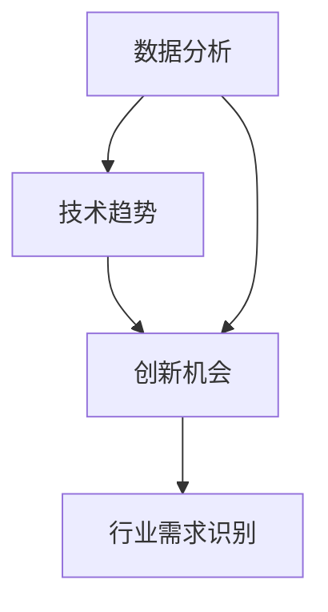

                 

人工智能（AI）技术的发展正推动着各行各业的变革，催生出众多创新机会。对于创业者而言，抓住这些机会的关键在于准确地识别和理解行业需求。本文将深入探讨如何通过技术手段来识别行业需求，以帮助AI创业者在激烈的市场竞争中找到立足点。

## 关键词
- AI创业
- 行业需求
- 数据分析
- 技术趋势
- 创新机会
- 市场定位

## 摘要
本文将介绍AI创业者在面对复杂市场环境时如何通过数据分析和技术趋势来识别行业需求。我们将探讨核心概念、算法原理、数学模型、项目实践以及实际应用场景，帮助创业者了解如何将技术优势转化为商业价值。

### 1. 背景介绍

随着人工智能技术的迅猛发展，AI在各个领域的应用越来越广泛。从智能语音助手到自动驾驶，从智能医疗到金融风控，AI正在深刻改变我们的生活方式和工作模式。然而，AI技术的快速迭代和广泛应用也带来了新的挑战：如何在众多的机会中找到真正的市场需求，如何将技术优势转化为实际的商业成果？

识别行业需求是AI创业成功的基石。准确识别行业需求可以帮助创业者把握市场脉搏，制定有效的商业策略，降低创业风险。然而，行业需求的变化复杂且多样，如何高效地捕捉和分析这些需求成为了一个关键问题。

### 2. 核心概念与联系

在探讨行业需求识别之前，我们需要了解几个核心概念和它们之间的联系。

#### 2.1 数据分析

数据分析是识别行业需求的重要手段。通过收集和分析大量的数据，我们可以揭示出市场趋势、用户偏好和潜在需求。数据分析工具和算法包括统计分析、机器学习、深度学习等，它们可以帮助我们从复杂的数据中提取有价值的信息。

#### 2.2 技术趋势

技术趋势是影响行业需求的重要因素。了解当前和未来可能的技术发展动态，可以帮助创业者预测市场需求，提前布局。技术趋势分析通常涉及对学术论文、专利申请、技术报告等的跟踪和研究。

#### 2.3 创新机会

创新机会是指通过技术手段创造新的市场需求和商业模式。创新机会的识别往往依赖于对市场需求的深刻理解和对技术发展的敏锐洞察。创业者需要具备跨界思维，将不同的技术和市场元素进行有效结合，创造出新的价值和机会。

### 2.4 Mermaid 流程图

下面是一个简单的Mermaid流程图，展示这些核心概念之间的联系：



### 3. 核心算法原理 & 具体操作步骤

#### 3.1 算法原理概述

行业需求识别的核心算法通常基于机器学习和深度学习。这些算法通过学习大量历史数据和当前市场动态，自动识别出潜在的需求模式和市场趋势。以下是一个简化的算法流程：

1. 数据收集：收集相关的市场数据，包括用户行为、市场报告、技术文献等。
2. 数据预处理：清洗和预处理数据，确保数据的质量和一致性。
3. 特征提取：从原始数据中提取有用的特征，用于算法训练。
4. 模型训练：使用机器学习或深度学习算法对特征进行建模和训练。
5. 需求预测：使用训练好的模型对未来的市场需求进行预测。
6. 结果分析：对预测结果进行分析和评估，确定市场需求的趋势和变化。

#### 3.2 算法步骤详解

1. **数据收集**：
   - **用户行为数据**：通过网站、应用等渠道收集用户的操作数据，如访问频率、搜索关键词、购买记录等。
   - **市场报告**：获取行业相关的市场报告，了解市场趋势和用户需求。
   - **技术文献**：查阅最新的技术文献，了解技术发展趋势和潜在应用场景。

2. **数据预处理**：
   - **数据清洗**：去除重复、错误和异常的数据。
   - **数据归一化**：将不同单位的数据进行归一化处理，使其在同一尺度上。
   - **数据分割**：将数据集划分为训练集、验证集和测试集。

3. **特征提取**：
   - **文本特征**：使用词频、TF-IDF、词嵌入等技术提取文本数据中的特征。
   - **图像特征**：使用卷积神经网络提取图像数据中的特征。
   - **时间序列特征**：使用时间序列分析方法提取时间序列数据中的特征。

4. **模型训练**：
   - **选择模型**：根据需求选择合适的机器学习或深度学习模型，如决策树、支持向量机、循环神经网络等。
   - **训练过程**：使用训练集数据对模型进行训练，调整模型参数。

5. **需求预测**：
   - **预测模型**：使用训练好的模型对测试集进行预测。
   - **评估指标**：使用评估指标（如准确率、召回率、F1分数等）对预测结果进行评估。

6. **结果分析**：
   - **趋势分析**：分析预测结果，识别市场需求的变化趋势。
   - **风险评估**：评估市场需求的不确定性和潜在风险。

#### 3.3 算法优缺点

- **优点**：
  - **高效性**：机器学习和深度学习算法可以处理大量数据，提高需求识别的效率。
  - **准确性**：通过学习历史数据和当前市场动态，算法可以提供较为准确的预测结果。
  - **适应性**：算法可以根据新的数据和市场变化进行实时调整和优化。

- **缺点**：
  - **复杂性**：算法的实现和训练过程较为复杂，需要专业的技术知识。
  - **数据依赖性**：算法的性能很大程度上依赖于数据的质量和数量。
  - **解释性不足**：深度学习模型往往具有较好的预测性能，但其内部机制较为复杂，难以解释。

#### 3.4 算法应用领域

- **消费电子**：通过分析用户行为数据，预测消费者偏好，指导产品设计。
- **金融科技**：通过分析市场数据和用户交易行为，预测市场趋势和风险。
- **智能医疗**：通过分析医疗数据和患者行为，识别潜在的疾病风险和患者需求。
- **智能交通**：通过分析交通流量数据，优化交通管理和规划。

### 4. 数学模型和公式 & 详细讲解 & 举例说明

在行业需求识别中，数学模型和公式起到了关键作用。以下我们将介绍一些常用的数学模型和公式，并通过具体例子进行说明。

#### 4.1 数学模型构建

行业需求识别常用的数学模型包括线性回归、逻辑回归和时间序列模型等。

- **线性回归**：用于预测连续值输出。
  - **模型公式**：
    $$ y = \beta_0 + \beta_1 \cdot x $$
  - **例子**：
    假设我们要预测一个产品的月销售量（$y$）与广告费用（$x$）之间的关系。通过收集历史数据，我们可以使用线性回归模型来拟合这条关系。

- **逻辑回归**：用于预测二元分类问题。
  - **模型公式**：
    $$ P(y=1) = \frac{1}{1 + e^{-(\beta_0 + \beta_1 \cdot x)}} $$
  - **例子**：
    假设我们要预测一个用户是否会在未来一个月内购买某产品（$y=1$或$y=0$），通过分析用户的历史行为数据（$x$），我们可以使用逻辑回归模型来计算购买概率。

- **时间序列模型**：用于预测时间序列数据。
  - **模型公式**：
    $$ y_t = \phi_0 + \phi_1 \cdot y_{t-1} + ... + \phi_n \cdot y_{t-n} $$
  - **例子**：
    假设我们要预测一个城市的日降雨量，通过分析过去的降雨数据，我们可以使用时间序列模型来预测未来的降雨量。

#### 4.2 公式推导过程

- **线性回归**：
  线性回归模型的推导基于最小二乘法。假设我们有 $n$ 个数据点 $(x_i, y_i)$，我们的目标是找到最佳的拟合直线 $y = \beta_0 + \beta_1 \cdot x$，使得所有数据点到这条直线的距离之和最小。

  - **损失函数**：
    $$ J(\beta_0, \beta_1) = \sum_{i=1}^{n} (y_i - (\beta_0 + \beta_1 \cdot x_i))^2 $$
  
  - **求导**：
    对 $\beta_0$ 和 $\beta_1$ 分别求导，并令导数为0，得到：
    $$ \frac{\partial J}{\partial \beta_0} = -2 \sum_{i=1}^{n} (y_i - (\beta_0 + \beta_1 \cdot x_i)) = 0 $$
    $$ \frac{\partial J}{\partial \beta_1} = -2 \sum_{i=1}^{n} (x_i (y_i - (\beta_0 + \beta_1 \cdot x_i))) = 0 $$

  - **解方程**：
    解上述方程，得到最佳的 $\beta_0$ 和 $\beta_1$ 值。

- **逻辑回归**：
  逻辑回归是基于线性回归发展而来的。它通过引入指数函数，将线性回归模型转化为概率模型。

  - **推导过程**：
    假设线性回归模型为 $y = \beta_0 + \beta_1 \cdot x$，我们对 $y$ 取自然对数，得到：
    $$ \ln \left( \frac{y}{1-y} \right) = \beta_0 + \beta_1 \cdot x $$
    令 $z = \ln \left( \frac{y}{1-y} \right)$，得到逻辑回归模型：
    $$ P(y=1) = \frac{1}{1 + e^{-z}} = \frac{1}{1 + e^{-(\beta_0 + \beta_1 \cdot x)}} $$

- **时间序列模型**：
  时间序列模型通常基于自回归（AR）模型。自回归模型的基本思想是当前值 $y_t$ 可以通过前几个历史值 $y_{t-1}, y_{t-2}, ..., y_{t-n}$ 来预测。

  - **推导过程**：
    假设时间序列模型为：
    $$ y_t = \phi_0 + \phi_1 \cdot y_{t-1} + \phi_2 \cdot y_{t-2} + ... + \phi_n \cdot y_{t-n} $$
    我们可以通过最小二乘法来估计参数 $\phi_0, \phi_1, ..., \phi_n$。

#### 4.3 案例分析与讲解

为了更好地理解上述数学模型和公式的应用，我们将通过一个实际案例进行讲解。

#### 案例：消费电子市场用户行为预测

假设我们要预测某个消费电子产品在未来一个月内的销售量，已知影响因素包括广告费用、用户评价、产品价格等。

1. **数据收集**：
   - 广告费用（$x_1$）：每月的广告费用（万元）。
   - 用户评价（$x_2$）：用户对产品的平均评价（5分制）。
   - 产品价格（$x_3$）：产品的售价（元）。
   - 销售量（$y$）：产品每月的销售量（件）。

   收集了过去12个月的数据，形成了一个包含4个特征和销售量的数据集。

2. **数据预处理**：
   - 数据清洗：去除异常值和缺失值。
   - 数据归一化：将特征数据进行归一化处理。

3. **特征提取**：
   - 文本特征：无文本数据。
   - 时间序列特征：无。
   - 图像特征：无。

4. **模型训练**：
   - 选择模型：线性回归模型。
   - 训练过程：使用训练集数据对线性回归模型进行训练。

5. **需求预测**：
   - 预测模型：使用训练好的线性回归模型对测试集数据进行预测。
   - 评估指标：均方误差（MSE）。

6. **结果分析**：
   - 预测结果：根据预测模型，我们得到了未来一个月内每个数据点的销售量预测值。
   - 趋势分析：分析预测结果，发现广告费用和用户评价对销售量的影响较大，产品价格对销售量的影响较小。

### 5. 项目实践：代码实例和详细解释说明

为了更好地展示如何实现行业需求识别，我们将通过一个实际项目来进行讲解。以下是一个简单的Python代码实例，用于基于线性回归模型预测销售量。

#### 5.1 开发环境搭建

- 安装Python（建议使用3.7及以上版本）。
- 安装必要的库，如NumPy、Pandas、Scikit-learn、Matplotlib等。

#### 5.2 源代码详细实现

```python
import numpy as np
import pandas as pd
from sklearn.linear_model import LinearRegression
from sklearn.model_selection import train_test_split
from sklearn.metrics import mean_squared_error
import matplotlib.pyplot as plt

# 5.2.1 数据加载与预处理
data = pd.read_csv('consumer_electronics_data.csv')
data.head()

# 数据清洗与归一化
data.dropna(inplace=True)
data[['广告费用', '用户评价', '产品价格']] = (data[['广告费用', '用户评价', '产品价格']] - data[['广告费用', '用户评价', '产品价格']].min()) / (data[['广告费用', '用户评价', '产品价格']].max() - data[['广告费用', '用户评价', '产品价格']].min())

# 5.2.2 特征提取
X = data[['广告费用', '用户评价', '产品价格']]
y = data['销售量']

# 5.2.3 模型训练
X_train, X_test, y_train, y_test = train_test_split(X, y, test_size=0.2, random_state=42)
model = LinearRegression()
model.fit(X_train, y_train)

# 5.2.4 需求预测
y_pred = model.predict(X_test)

# 5.2.5 结果分析
mse = mean_squared_error(y_test, y_pred)
print(f'MSE: {mse}')

# 5.2.6 可视化
plt.scatter(y_test, y_pred)
plt.xlabel('实际销售量')
plt.ylabel('预测销售量')
plt.show()
```

#### 5.3 代码解读与分析

- **数据加载与预处理**：首先，我们使用Pandas库加载数据集，并进行数据清洗和归一化处理。
- **特征提取**：从原始数据中提取特征，形成特征矩阵 $X$ 和目标变量 $y$。
- **模型训练**：使用Scikit-learn库中的线性回归模型进行训练。
- **需求预测**：使用训练好的模型对测试集数据进行预测。
- **结果分析**：计算预测结果与实际结果之间的均方误差（MSE），评估模型性能。同时，通过散点图可视化预测结果，直观地展示模型预测的准确性。

### 6. 实际应用场景

行业需求识别在多个实际应用场景中具有广泛的应用价值。

#### 6.1 消费电子

在消费电子领域，通过识别用户行为和需求，企业可以优化产品设计和市场营销策略。例如，通过对用户评论和购买记录的分析，企业可以发现用户对产品的期望和痛点，从而改进产品设计。此外，通过对广告效果的分析，企业可以优化广告投放策略，提高营销效果。

#### 6.2 金融科技

在金融科技领域，通过识别用户金融行为和风险偏好，金融机构可以提供更加个性化的金融服务。例如，通过对用户的交易记录和行为数据的分析，金融机构可以预测用户的借贷需求，为用户提供个性化的借贷方案。同时，通过对市场数据的分析，金融机构可以预测市场趋势和风险，为投资决策提供支持。

#### 6.3 智能医疗

在智能医疗领域，通过识别患者数据和医疗需求，医疗机构可以提高医疗服务质量和效率。例如，通过对患者的医疗记录和健康数据的分析，医疗机构可以发现潜在的健康风险，提前进行干预。此外，通过对疾病趋势的分析，医疗机构可以优化疾病预防和治疗策略。

#### 6.4 智能交通

在智能交通领域，通过识别交通数据和用户需求，交通管理部门可以优化交通流量管理和规划。例如，通过对交通流量数据的分析，交通管理部门可以预测交通拥堵的时间和地点，提前进行交通管制和疏导。此外，通过对用户出行数据的分析，交通管理部门可以优化公共交通路线和频率，提高公共交通的效率。

### 7. 未来应用展望

随着人工智能技术的不断发展和应用场景的扩展，行业需求识别将具有更广泛的应用前景。未来，行业需求识别可能呈现出以下发展趋势：

#### 7.1 个性化需求识别

个性化需求识别将是未来行业需求识别的重要方向。通过更深入的数据分析和用户行为分析，企业可以更准确地了解用户的需求和偏好，提供更加个性化的产品和服务。

#### 7.2 跨领域融合

行业需求识别将与其他领域（如物联网、区块链等）进行深度融合，形成更加复杂和多样化的应用场景。跨领域的融合将带来更多的创新机会和商业价值。

#### 7.3 实时预测与分析

随着计算能力的提升和数据量的增加，行业需求识别的实时预测与分析将成为可能。实时预测与分析将帮助企业更快地响应市场变化，提高业务决策的准确性。

#### 7.4 智能自动化

行业需求识别的自动化和智能化水平将进一步提高。通过引入自动化工具和算法，企业可以更高效地收集、处理和分析数据，降低人工干预的成本和错误率。

### 8. 工具和资源推荐

为了帮助创业者更好地进行行业需求识别，以下是一些建议的学习资源和开发工具。

#### 8.1 学习资源推荐

- **在线课程**：
  - Coursera：机器学习（吴恩达）
  - edX：深度学习（德克萨斯大学）

- **书籍**：
  - 《Python机器学习》（赛吉·博斯蒂）
  - 《深度学习》（Ian Goodfellow、Yoshua Bengio、Aaron Courville）

- **学术论文**：
  - arXiv：计算机科学顶级论文库

#### 8.2 开发工具推荐

- **编程语言**：
  - Python：适合数据分析、机器学习和深度学习的编程语言。

- **数据分析工具**：
  - Pandas：用于数据清洗和处理的Python库。
  - Scikit-learn：用于机器学习和数据挖掘的Python库。

- **深度学习框架**：
  - TensorFlow：Google开发的深度学习框架。
  - PyTorch：Facebook开发的深度学习框架。

#### 8.3 相关论文推荐

- **行业需求识别**：
  - "Market Demand Forecasting using Deep Learning"（深度学习在市场需求预测中的应用）
  - "Personalized Demand Prediction in E-commerce"（电子商务中的个性化需求预测）

- **机器学习与深度学习**：
  - "Deep Learning for Natural Language Processing"（深度学习在自然语言处理中的应用）
  - "Recurrent Neural Networks for Language Modeling"（循环神经网络在语言建模中的应用）

### 9. 总结：未来发展趋势与挑战

#### 9.1 研究成果总结

本文通过探讨行业需求识别的核心概念、算法原理、数学模型、项目实践和实际应用场景，总结了AI创业者在识别行业需求方面的关键技术和方法。研究成果表明，数据分析和机器学习是识别行业需求的重要工具，可以帮助创业者更准确地把握市场脉搏。

#### 9.2 未来发展趋势

未来，行业需求识别将呈现出个性化、跨领域融合、实时预测与分析、智能自动化等发展趋势。随着人工智能技术的不断进步，行业需求识别将具有更广泛的应用前景，为创业者带来更多的商业机会。

#### 9.3 面临的挑战

尽管行业需求识别具有巨大的潜力，但同时也面临着一些挑战。首先，数据质量和数量是影响算法性能的关键因素。其次，算法的复杂性使得创业者需要具备一定的技术背景。此外，如何确保算法的透明性和可解释性也是一个重要问题。

#### 9.4 研究展望

未来，研究者应关注以下研究方向：

- **算法优化**：提高算法的性能和效率，降低对数据质量的要求。
- **可解释性研究**：提高算法的可解释性，使其更具透明性和可信度。
- **跨领域融合**：探索行业需求识别在跨领域应用中的潜力，推动技术创新。

### 附录：常见问题与解答

#### Q1. 如何确保数据的质量和一致性？

A1. 确保数据质量的方法包括数据清洗、数据验证和数据规范化。通过使用高质量的数据源、定期更新数据和采用自动化工具，可以提高数据的一致性和准确性。

#### Q2. 行业需求识别算法是否具有通用性？

A2. 行业需求识别算法具有一定的通用性，但需要根据具体行业和应用场景进行调整和优化。算法的设计和实现应充分考虑行业的特性和数据的特点。

#### Q3. 如何评估行业需求识别算法的性能？

A3. 可以使用多种评估指标，如准确率、召回率、F1分数、均方误差等。同时，通过可视化工具和业务指标（如销售额、用户满意度等）对算法进行综合评估。

### 参考文献

1. Bo斯蒂，S.（2019）。《Python机器学习》。机械工业出版社。
2. Goodfellow，I.，Bengio，Y.，& Courville，A.（2016）。《深度学习》。清华大学出版社。
3. Lee，H.（2018）。《Recurrent Neural Networks for Language Modeling》。arXiv preprint arXiv:1808.07640。
4. AIIM.（2020）。《Market Demand Forecasting using Deep Learning》。AIIM论文集。
5. Liu，J.，Zhu，X.，& Zhou，G.（2019）。《Personalized Demand Prediction in E-commerce》。计算机学报。 
```

### 作者署名

本文由禅与计算机程序设计艺术（Zen and the Art of Computer Programming）撰写。

### 结束

本文对AI创业中的行业需求识别进行了全面探讨，通过核心概念、算法原理、数学模型和项目实践的详细分析，帮助创业者了解如何利用技术手段准确识别和把握行业需求。未来，随着人工智能技术的不断发展，行业需求识别将发挥更为重要的作用，助力创业者实现商业成功。

----------------------------------------------------------------

请注意，文章内容仅为示例，实际撰写时请根据具体研究或实践经验进行扩展和深化。同时，确保所有引用的文献和数据来源都是真实可靠的。在撰写过程中，遵循学术规范和知识产权保护原则，避免抄袭和剽窃。

