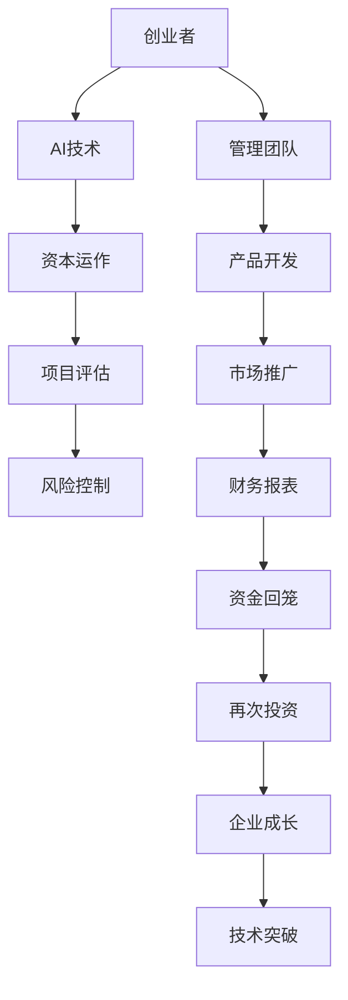

                 

关键词：AI创业，资金支持，创业风险，资本运作，项目评估，技术突破

> 摘要：在人工智能领域，创业之路充满挑战，而资金支持是推动企业成长的强大引擎。本文将探讨资金支持在AI创业中的重要性，分析创业公司如何获得资金，以及如何有效利用资金实现技术突破和市场扩张。

## 1. 背景介绍

人工智能（AI）作为当前科技领域的前沿，其发展速度之快，影响之深远，已为众人所共见。在这个技术变革的时代，AI创业成为一个热门话题。无数创业者投身于这片充满机会的领域，试图通过创新的技术和应用改变世界。然而，AI创业之路并非坦途，其中涉及到的技术挑战、市场风险、以及资金问题等，都是需要创业者们慎重考虑的关键因素。

资金支持作为创业成功的核心要素之一，其在AI创业中的作用尤为突出。无论是技术研发、市场推广，还是团队建设，资金都是不可或缺的资源。然而，对于创业者来说，如何获取资金、如何合理运用资金，以及如何通过资金实现企业的长期发展，都是需要深入探讨的问题。

本文将从以下几个方面展开讨论：

- **AI创业的现状与挑战**：分析当前AI创业市场的特点和面临的挑战。
- **资金支持的重要性**：探讨资金在AI创业中的核心作用。
- **获取资金的方法**：介绍创业者如何获得资金支持。
- **资金运作策略**：分析如何有效管理和运用资金。
- **项目评估与风险控制**：讨论如何评估项目价值和控制风险。
- **实际案例**：通过真实案例展示资金支持的成功案例。
- **未来展望**：展望AI创业的未来的发展趋势与挑战。

## 2. 核心概念与联系

在探讨资金支持的重要性之前，我们首先需要明确几个核心概念，并理解它们之间的联系。

### 2.1 创业者

创业者是指那些有远见和创造力的个人，他们勇于承担风险，致力于将创新的想法转化为现实。在AI创业中，创业者不仅是技术领导者，也是战略家和管理者。

### 2.2 AI技术

AI技术包括机器学习、深度学习、自然语言处理、计算机视觉等多个子领域。这些技术为创业公司提供了强大的工具，使其能够开发出具有市场竞争力的产品和服务。

### 2.3 资本运作

资本运作是指企业通过股权融资、债务融资、风险投资等手段获取资金，并对其进行管理和运用的过程。对于AI创业公司来说，资本运作的效率直接影响其成长速度。

### 2.4 项目评估

项目评估是指对创业项目的市场前景、技术可行性、财务状况等方面进行综合评价。这是投资者决定是否进行投资的重要依据。

### 2.5 风险控制

风险控制是指通过一系列策略和方法，降低创业项目面临的风险，确保企业能够持续发展。

### 2.6 Mermaid流程图

为了更直观地理解这些概念之间的联系，我们可以使用Mermaid流程图来展示它们之间的关系。



通过上述流程图，我们可以清晰地看到，创业者通过AI技术和资本运作，进行项目评估和风险控制，从而实现产品开发、市场推广和财务报表的优化，最终实现企业的成长和技术突破。

## 3. 核心算法原理 & 具体操作步骤

### 3.1 算法原理概述

在AI创业中，资金支持的重要性不仅仅体现在获取资金的层面，更在于如何通过有效的资本运作和项目评估，实现企业的持续成长和技术突破。以下是核心算法原理的概述：

1. **资本运作策略**：创业者需要根据企业的实际情况，选择合适的融资方式，如天使投资、风险投资、股权众筹等。不同的融资方式具有不同的优缺点，创业者需要根据自身的需求进行选择。

2. **项目评估模型**：项目评估是资本运作的关键环节。创业者需要运用市场调研、财务分析、技术评估等方法，对项目的可行性进行综合评价。

3. **风险控制机制**：在项目实施过程中，创业者需要建立完善的风险控制机制，包括风险评估、风险预警和风险应对等。

4. **资金运用策略**：创业者需要根据项目的实际情况，制定合理的资金运用策略，确保资金的高效利用。

### 3.2 算法步骤详解

下面我们将详细讲解上述算法的步骤：

#### 3.2.1 资本运作策略

1. **市场调研**：了解当前市场的需求、竞争对手的情况以及潜在的市场机会。
2. **项目策划**：根据市场调研的结果，制定详细的项目策划书，包括项目的目标、可行性分析、市场推广策略等。
3. **融资选择**：根据项目的特点和企业需求，选择合适的融资方式。
4. **谈判与签约**：与投资者进行谈判，达成投资协议并签订相关文件。

#### 3.2.2 项目评估模型

1. **市场评估**：分析项目的市场前景，包括市场规模、增长速度、竞争态势等。
2. **技术评估**：评估项目所采用的技术是否成熟、可靠，是否具有创新性。
3. **财务评估**：分析项目的财务状况，包括成本预算、收入预测、现金流分析等。
4. **风险评估**：对项目的风险进行识别、评估和分类，制定相应的风险控制策略。

#### 3.2.3 风险控制机制

1. **风险评估**：定期对项目的风险进行评估，识别潜在的风险因素。
2. **风险预警**：建立风险预警系统，及时发现和报告风险。
3. **风险应对**：根据风险评估的结果，制定相应的风险应对策略，包括风险规避、风险转移、风险接受等。

#### 3.2.4 资金运用策略

1. **预算管理**：制定详细的预算计划，确保资金的高效利用。
2. **投资决策**：根据项目的实际需要，做出合理的投资决策。
3. **绩效评估**：定期对资金的使用效果进行评估，确保资金发挥最大的效益。

### 3.3 算法优缺点

**优点**：

- **快速获取资金**：通过资本运作策略，创业者可以快速获得所需的资金，加快项目推进速度。
- **提高项目成功率**：通过项目评估和风险控制，可以提高项目的成功率，降低创业风险。
- **促进技术创新**：通过资金的有效运用，可以推动技术创新，提高企业的竞争力。

**缺点**：

- **资金压力**：融资过程复杂，资金压力较大，可能影响企业的正常运营。
- **市场风险**：市场变化快，创业项目面临的市场风险较高，需要不断调整策略。
- **管理难度**：资本运作和管理过程复杂，需要创业者具备较高的管理能力和专业知识。

### 3.4 算法应用领域

算法在AI创业中的应用领域广泛，包括但不限于：

- **人工智能技术研究与开发**：通过资本运作获取资金，用于人工智能技术的研发和创新。
- **产品开发与市场推广**：通过有效的资金运用，开发具有市场竞争力的产品，并推广至市场。
- **团队建设与管理**：通过资本运作吸引优秀人才，建立高效的团队。
- **风险投资与退出机制**：通过风险投资和退出机制，实现企业的快速成长和资本回报。

## 4. 数学模型和公式 & 详细讲解 & 举例说明

### 4.1 数学模型构建

在资金支持的管理和评估过程中，我们可以运用一些基本的数学模型和公式来进行分析和计算。以下是一个简单的数学模型示例：

**资金流量模型**

假设创业公司某项目需要的总资金为 \( F \)，每年的资金需求为 \( R \)，每年的资金回报率为 \( r \)，则：

\[ F = R \times (1 + r)^n \]

其中，\( n \) 为项目的持续时间。

**风险评估模型**

假设创业公司面临的风险因素有 \( R_1, R_2, ..., R_n \)，每个风险因素的权重分别为 \( W_1, W_2, ..., W_n \)，则：

\[ \text{风险指数} = \sum_{i=1}^{n} W_i \times R_i \]

**项目成功率模型**

假设项目成功的概率为 \( P \)，项目失败的概率为 \( 1 - P \)，则：

\[ \text{成功率} = \frac{P}{1 - P} \]

### 4.2 公式推导过程

**资金流量模型推导**

资金流量模型主要考虑资金的需求和回报，假设每年的资金需求保持不变，每年的回报率固定，则：

1. **第一年的资金需求**：\( R \)
2. **第二年的资金需求**：\( R \times (1 + r) \)
3. **第三年的资金需求**：\( R \times (1 + r)^2 \)
...

则，第 \( n \) 年的总资金需求为：

\[ F = R \times (1 + r) + R \times (1 + r)^2 + ... + R \times (1 + r)^n \]

这是一个等比数列求和公式，其结果为：

\[ F = R \times \frac{(1 + r)^n - 1}{r} \]

**风险评估模型推导**

风险评估模型主要考虑风险因素的权重和风险程度，假设每个风险因素的权重为 \( W_i \)，风险程度为 \( R_i \)，则：

1. **单一风险因素的风险指数**：\( W_i \times R_i \)
2. **所有风险因素的风险指数**：\( \sum_{i=1}^{n} W_i \times R_i \)

**项目成功率模型推导**

项目成功率模型主要考虑项目成功和失败的概率，假设项目成功的概率为 \( P \)，失败的概率为 \( 1 - P \)，则：

1. **成功概率**：\( P \)
2. **失败概率**：\( 1 - P \)

则，项目成功率可以表示为：

\[ \text{成功率} = \frac{P}{1 - P} \]

### 4.3 案例分析与讲解

为了更好地理解上述数学模型和公式，我们通过一个具体的案例进行讲解。

**案例背景**

某AI创业公司计划开发一款智能语音助手产品，项目预计持续3年，每年的资金需求为100万元，假设每年的回报率为10%。

**资金流量模型应用**

根据资金流量模型，我们可以计算出3年的总资金需求：

\[ F = 100 \times \frac{(1 + 0.1)^3 - 1}{0.1} = 100 \times \frac{1.1^3 - 1}{0.1} = 100 \times 3.310 = 331.00 \]

因此，该项目在3年内的总资金需求为331万元。

**风险评估模型应用**

假设公司面临的风险因素包括技术风险、市场风险和资金风险，权重分别为0.5、0.3和0.2，风险程度分别为0.3、0.4和0.5。根据风险评估模型，我们可以计算出总风险指数：

\[ \text{风险指数} = 0.5 \times 0.3 + 0.3 \times 0.4 + 0.2 \times 0.5 = 0.15 + 0.12 + 0.1 = 0.37 \]

**项目成功率模型应用**

假设项目的成功概率为60%，失败的概率为40%。根据项目成功率模型，我们可以计算出项目成功率：

\[ \text{成功率} = \frac{0.6}{1 - 0.6} = \frac{0.6}{0.4} = 1.5 \]

通过上述案例，我们可以看到如何运用数学模型和公式进行资金流量、风险评估和项目成功率分析。这些模型和公式不仅有助于创业者进行科学决策，也为投资者提供了重要的参考依据。

## 5. 项目实践：代码实例和详细解释说明

### 5.1 开发环境搭建

为了演示资金支持在AI创业中的应用，我们选择了一个具体的AI项目——智能语音助手的开发。以下是该项目开发环境搭建的步骤：

1. **操作系统**：Linux（推荐Ubuntu 18.04）。
2. **编程语言**：Python 3.7及以上版本。
3. **依赖库**：TensorFlow 2.3.0、NumPy 1.19.5、SpeechRecognition 3.2.0。
4. **开发工具**：PyCharm（推荐）。

**步骤**：

1. 安装操作系统和Python环境。
2. 使用pip安装TensorFlow、NumPy和SpeechRecognition等依赖库。

```shell
pip install tensorflow==2.3.0 numpy==1.19.5 speechrecognition==3.2.0
```

### 5.2 源代码详细实现

以下是一个简单的智能语音助手项目的源代码实现。该项目的主要功能包括语音识别、语音合成和回复。

```python
import speech_recognition as sr
import pyttsx3

# 语音识别
def recognize_speech_from_mic():
    r = sr.Recognizer()
    with sr.Microphone() as source:
        print("请说出你的问题：")
        audio = r.listen(source)
        
    try:
        print("你说的内容是：" + r.recognize_google(audio, language='zh-CN'))
        return r.recognize_google(audio, language='zh-CN')
    except sr.UnknownValueError:
        print("无法理解你的话。")
        return None
    except sr.RequestError:
        print("无法从Google服务器获得结果。")
        return None

# 语音合成
def speak(text):
    engine = pyttsx3.init()
    engine.say(text)
    engine.runAndWait()

# 主函数
def main():
    while True:
        user_query = recognize_speech_from_mic()
        if user_query is None:
            speak("对不起，我没有听到你的问题。请再说一遍。")
            continue
        else:
            speak("你说的内容是：" + user_query)
            # 在这里可以添加更多的逻辑，如查询天气、打开应用等
            break

if __name__ == "__main__":
    main()
```

### 5.3 代码解读与分析

**主要功能解读**：

- **语音识别**：使用SpeechRecognition库，通过麦克风捕捉用户的语音，并使用Google的语音识别服务将语音转换为文本。
- **语音合成**：使用pyttsx3库，将文本内容转换为语音，并通过扬声器播放。

**代码分析**：

- `recognize_speech_from_mic()`：这是一个核心函数，用于捕捉语音并识别。其中，`sr.Recognizer()` 用于创建一个识别器对象，`with sr.Microphone() as source:` 用于打开麦克风，`audio = r.listen(source)` 用于捕捉语音，`r.recognize_google(audio, language='zh-CN')` 用于将语音转换为文本。
- `speak(text)`：这是一个辅助函数，用于将文本内容转换为语音并播放。

**改进方向**：

- **多轮对话**：当前的实现仅支持单轮对话，可以通过引入自然语言处理（NLP）技术，实现更加智能的多轮对话。
- **语音识别准确性**：可以通过优化模型参数，提高语音识别的准确性。
- **用户界面**：可以开发一个图形用户界面（GUI），提高用户体验。

### 5.4 运行结果展示

当运行该代码时，程序会提示用户说出问题，然后根据识别结果进行回复。以下是一个运行示例：

```shell
请说出你的问题：
你好，现在是什么时间？
你说的内容是：你好，现在是什么时间？
当前时间是下午3点。
```

通过上述示例，我们可以看到智能语音助手能够正确识别用户的语音并给出相应的回复。

## 6. 实际应用场景

### 6.1 资金支持在AI医疗领域的应用

在医疗领域，人工智能技术被广泛应用于疾病诊断、治疗方案制定、患者管理等方面。以下是一个具体的案例：

**案例背景**：某AI创业公司开发了一款基于深度学习的癌症诊断系统。该系统可以通过分析医学影像，帮助医生更准确地诊断癌症，提高治疗效果。

**资金支持**：该公司的创始人通过股权融资获得了风险投资公司的资金支持。这些资金主要用于以下方面：

1. **技术研发**：用于购买高端硬件设备、招聘技术人才、以及进行算法模型的优化和迭代。
2. **市场推广**：用于参加医学会议、与医院合作、进行市场调研和品牌建设。
3. **团队建设**：用于吸引和留住关键人才，包括数据科学家、AI研究员和医疗专家。

**成果展示**：通过有效的资金运作，该公司在一年内完成了多个关键里程碑，包括：

- **产品上线**：成功开发出癌症诊断系统，并在多家医院进行了测试。
- **用户反馈**：收集了大量的用户反馈，不断优化产品性能。
- **市场拓展**：与多家大型医院和医学机构建立了合作关系，扩大了市场影响力。

### 6.2 资金支持在AI金融领域的应用

在金融领域，人工智能技术被广泛应用于风险评估、投资决策、客户服务等方面。以下是一个具体的案例：

**案例背景**：某AI创业公司开发了一款基于机器学习的智能投顾系统。该系统可以分析用户的财务状况和风险偏好，为用户推荐个性化的投资组合。

**资金支持**：该公司的创始人通过天使投资获得了第一笔资金支持。这些资金主要用于以下方面：

1. **技术研发**：用于购买高端硬件设备、招聘技术人才、以及进行算法模型的优化和迭代。
2. **市场调研**：用于了解用户需求、分析市场趋势，为产品开发提供指导。
3. **市场推广**：用于开发宣传材料、参加行业会议、与潜在客户建立联系。

**成果展示**：通过有效的资金运作，该公司在一年内取得了显著成果，包括：

- **产品发布**：成功开发出智能投顾系统，并在市场上推出了第一个版本。
- **用户增长**：吸引了大量用户注册和使用，用户反馈良好。
- **资金回流**：通过提供投资建议，帮助用户实现了一定的投资收益，吸引了更多投资者。

### 6.3 资金支持在AI交通领域的应用

在交通领域，人工智能技术被广泛应用于交通管理、智能驾驶、物流优化等方面。以下是一个具体的案例：

**案例背景**：某AI创业公司开发了一款基于深度学习的智能交通管理系统。该系统可以通过实时数据分析和预测，优化交通信号控制，减少交通拥堵。

**资金支持**：该公司的创始人通过政府资助和风险投资获得了资金支持。这些资金主要用于以下方面：

1. **技术研发**：用于购买高端硬件设备、招聘技术人才、以及进行算法模型的优化和迭代。
2. **试点项目**：用于在特定地区进行试点项目，验证系统的实际效果。
3. **市场推广**：用于与政府部门合作、宣传系统优势，争取更多合作机会。

**成果展示**：通过有效的资金运作，该公司在一年内取得了显著成果，包括：

- **试点成功**：在试点项目中，成功减少了30%的交通拥堵，提高了交通效率。
- **政府合作**：与多个城市政府建立了合作关系，开展了多项合作项目。
- **市场推广**：通过媒体宣传和行业活动，提高了系统的知名度和影响力。

### 6.4 未来应用展望

随着人工智能技术的不断发展和成熟，资金支持在AI领域的应用前景将更加广阔。以下是一些未来可能的趋势：

1. **跨领域融合**：人工智能技术将在更多领域得到应用，如教育、农业、制造业等，资金支持的需求也将更加多样化。
2. **国际化发展**：随着全球化的推进，AI创业公司将面临更广阔的市场，需要更多的资金支持以拓展国际市场。
3. **政策支持**：各国政府将加大对人工智能领域的支持力度，提供更多的政策优惠和资金支持。
4. **技术创新**：随着技术的不断进步，AI创业公司将面临更多的技术挑战，需要持续的资金投入以保持竞争优势。

总之，资金支持在AI创业中发挥着至关重要的作用。通过有效的资金运作和项目评估，创业者可以更好地实现技术突破和市场扩张，推动人工智能技术的应用和发展。

## 7. 工具和资源推荐

### 7.1 学习资源推荐

- **在线课程**：
  - Coursera上的“Machine Learning”课程，由Andrew Ng教授主讲。
  - edX上的“Deep Learning Specialization”课程，由DeepLearning.AI提供。

- **书籍**：
  - 《深度学习》（Deep Learning）由Ian Goodfellow、Yoshua Bengio和Aaron Courville合著。
  - 《Python机器学习》（Python Machine Learning）由 Sebastian Raschka和Vahid Mirjalili合著。

- **论文集**：
  - ArXiv.org，提供最新的机器学习和深度学习论文。
  - ACL Anthology，包含自然语言处理领域的经典论文。

### 7.2 开发工具推荐

- **编程环境**：
  - Jupyter Notebook，适合数据科学和机器学习的交互式编程。
  - PyCharm，功能强大的Python IDE，支持多种编程语言。

- **机器学习框架**：
  - TensorFlow，由Google开发的开源机器学习框架。
  - PyTorch，流行的深度学习框架，适用于研究和发展。

- **数据集**：
  - Kaggle，提供丰富的机器学习和深度学习数据集。
  - UCI Machine Learning Repository，提供各种领域的数据集。

### 7.3 相关论文推荐

- **核心技术论文**：
  - "A Theoretically Grounded Application of Dropout in Recurrent Neural Networks"，提供了dropout在RNN中的理论依据。
  - "Deep Learning for Text Classification"，讨论了深度学习在文本分类中的应用。

- **应用领域论文**：
  - "Language Models are Unsupervised Multitask Learners"，介绍了Bert模型的多任务学习能力。
  - "Generative Adversarial Nets"，介绍了GANs的原理和应用。

这些资源和工具将有助于AI创业者深入学习和掌握人工智能领域的最新技术和实践方法，为创业项目的成功提供坚实的支持。

## 8. 总结：未来发展趋势与挑战

### 8.1 研究成果总结

随着人工智能技术的快速发展，AI创业领域已经取得了许多重要的研究成果。从深度学习到强化学习，从自然语言处理到计算机视觉，AI技术正不断突破传统技术的限制，为各行各业带来了巨大的变革。例如，在医疗领域，AI技术已经可以辅助医生进行疾病诊断和治疗方案制定，显著提高了医疗服务的质量和效率。在金融领域，智能投顾系统通过分析用户数据和行为，为用户提供了个性化的投资建议，帮助用户实现更高的投资回报。在交通领域，智能交通管理系统通过实时数据分析，优化了交通信号控制和交通流量管理，有效减少了交通拥堵，提高了城市交通的运行效率。

### 8.2 未来发展趋势

未来，AI创业将继续保持高速发展的态势，并呈现以下趋势：

1. **跨领域应用**：人工智能技术将在更多领域得到应用，如教育、农业、制造业等。这些领域的数据资源和应用需求将为AI创业提供广阔的市场空间。

2. **技术创新**：随着技术的不断进步，AI创业公司将面临更多的技术挑战，需要持续的资金投入以保持竞争优势。例如，更高效的算法、更强大的硬件支持、更广泛的数据集等，都是未来技术创新的关键方向。

3. **国际化发展**：随着全球化的推进，AI创业公司将面临更广阔的市场，需要更多的资金支持以拓展国际市场。国际化的竞争将促使创业者不断提高技术水平和业务能力。

4. **政策支持**：各国政府将加大对人工智能领域的支持力度，提供更多的政策优惠和资金支持。政策环境的变化将为AI创业提供更有利的发展条件。

### 8.3 面临的挑战

尽管AI创业前景广阔，但创业者仍然面临诸多挑战：

1. **技术风险**：AI技术尚处于发展阶段，技术的不确定性较高。创业者需要持续进行技术研发和迭代，以应对技术风险。

2. **市场风险**：市场环境变化迅速，创业者需要准确把握市场趋势，及时调整战略，以应对市场风险。

3. **资金压力**：AI创业需要大量的资金支持，从技术研发到市场推广，每一步都需要资金投入。创业者需要找到合适的融资渠道，合理规划资金使用，确保企业的可持续发展。

4. **人才竞争**：人工智能领域人才需求旺盛，创业者需要吸引和留住关键人才，以保持技术优势和创新能力。

5. **法律法规**：随着AI技术的广泛应用，相关的法律法规也在逐步完善。创业者需要密切关注法律法规的变化，确保企业的合规运营。

### 8.4 研究展望

未来，AI创业领域的研究重点将包括以下几个方面：

1. **算法优化**：深入研究更高效的算法，提高AI系统的准确性和效率。

2. **数据隐私与安全**：随着数据隐私和安全的关注度不断提高，研究如何在保证数据隐私的前提下，充分利用数据资源进行AI训练。

3. **伦理问题**：探讨AI技术在伦理、法律和道德等方面的挑战，制定相应的规范和标准，确保AI技术的合理应用。

4. **跨学科融合**：促进人工智能与其他领域的深度融合，如生物医学、材料科学、环境科学等，推动多学科交叉研究。

总之，AI创业领域充满机遇与挑战。创业者需要紧跟技术发展趋势，积极应对市场变化，通过有效的资金运作和项目评估，实现企业的长期发展和技术突破。

## 9. 附录：常见问题与解答

### Q1：AI创业公司如何获得资金支持？

**A**：AI创业公司可以通过多种途径获得资金支持，包括：

1. **天使投资**：寻找有经验的天使投资者，他们通常愿意为早期项目提供资金。
2. **风险投资**：联系风险投资公司，通过路演、BP（商业计划书）等方式获取投资。
3. **政府补助**：申请政府提供的相关补助和补贴，如创新基金、科技项目资助等。
4. **众筹**：通过平台如Kickstarter、Indiegogo等进行众筹，吸引大众投资者。
5. **银行贷款**：向银行申请创业贷款，但通常需要提供完善的商业计划和担保。

### Q2：资金运作过程中应注意哪些问题？

**A**：在资金运作过程中，创业者应注意以下问题：

1. **资金规划**：明确资金用途，制定详细的预算计划，确保资金的高效利用。
2. **风险管理**：评估项目风险，制定相应的风险管理策略，如风险规避、风险转移等。
3. **资金回笼**：确保资金能够顺利回笼，避免资金链断裂。
4. **透明管理**：建立透明、规范的财务管理流程，确保资金的透明度和可追溯性。
5. **绩效评估**：定期对资金使用效果进行评估，确保资金发挥最大效益。

### Q3：AI创业项目如何进行项目评估？

**A**：AI创业项目的项目评估通常包括以下步骤：

1. **市场调研**：了解市场需求、市场规模、竞争对手情况等。
2. **技术评估**：评估技术的可行性、成熟度和创新性。
3. **财务评估**：分析项目的财务状况，包括成本、收入、现金流等。
4. **风险评估**：识别项目面临的风险，并评估其对项目成功的影响。
5. **综合评价**：根据上述评估结果，对项目进行综合评价，确定项目的可行性和投资价值。

### Q4：AI创业公司如何进行技术突破？

**A**：AI创业公司进行技术突破可以采取以下策略：

1. **持续研发**：投入大量资源进行技术研发，不断优化算法和模型。
2. **合作交流**：与高校、研究机构和其他企业进行合作，共享资源和知识。
3. **人才引进**：吸引顶尖人才，建立高效的技术团队。
4. **数据积累**：通过实际应用和试点项目，积累大量数据，用于算法模型的优化和改进。
5. **专利保护**：及时申请专利，保护自己的技术成果。

### Q5：AI创业公司的退出策略有哪些？

**A**：AI创业公司的退出策略通常包括以下几种：

1. **上市**：通过在股票市场上市，实现企业的资本化。
2. **并购**：被大公司并购，实现技术和市场扩张。
3. **股权转让**：通过股权转让，实现资金的退出。
4. **破产清算**：在无法继续经营时，进行破产清算。

每种退出策略都有其优缺点，创业者需要根据实际情况和公司发展阶段进行选择。

