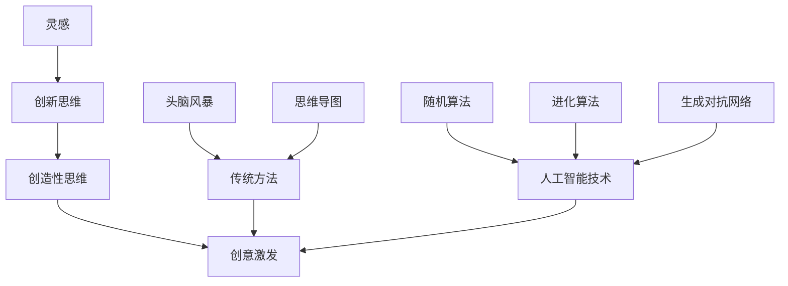

                 

 关键词：人工智能，创意激发，思维局限，算法原理，数学模型，项目实践，应用场景，未来展望

> 摘要：本文旨在探讨如何利用人工智能技术激发人类创意，突破传统思维局限。文章首先介绍了创意激发的背景和意义，然后深入分析了核心概念、算法原理、数学模型以及实际应用场景，最后展望了未来发展趋势和挑战。

## 1. 背景介绍

创意是人类智慧的体现，是人类进步的重要驱动力。然而，随着社会的发展，人类的思维似乎越来越受到各种局限，难以摆脱固有的思维模式。如何激发人类的创意，突破思维的局限，成为当今人工智能研究的一个重要方向。

人工智能（AI）作为21世纪最具影响力的技术之一，已经在各个领域展现出巨大的潜力。特别是在创意激发领域，人工智能可以借助其强大的计算能力和自学习能力，帮助我们突破传统思维的束缚，发现新的创意和方法。

本文将从以下几个方面展开讨论：

1. **核心概念与联系**：介绍创意激发相关的核心概念，如灵感、创新思维、创造性思维等，并使用Mermaid流程图展示其相互关系。
2. **核心算法原理 & 具体操作步骤**：深入分析常用的创意激发算法，如随机算法、进化算法、生成对抗网络等，并详细讲解其原理和操作步骤。
3. **数学模型和公式 & 详细讲解 & 举例说明**：介绍用于创意激发的数学模型和公式，并进行详细讲解和举例说明。
4. **项目实践：代码实例和详细解释说明**：通过一个具体的案例，展示如何使用人工智能技术实现创意激发，并提供详细的代码实例和解读。
5. **实际应用场景**：探讨人工智能在创意激发领域的实际应用，如艺术创作、产品设计、科学研究等。
6. **未来应用展望**：展望人工智能在创意激发领域的未来发展趋势和应用前景。
7. **工具和资源推荐**：推荐一些有助于学习和实践的资源和工具。
8. **总结：未来发展趋势与挑战**：总结研究成果，分析未来发展趋势和挑战，提出研究展望。

## 2. 核心概念与联系

### 2.1 灵感

灵感是指人们在特定情境下突然涌现的创造性思维火花。灵感通常来源于生活中的点滴、他人的启发、阅读、思考等。灵感是创意激发的起点，是创新思维的源泉。

### 2.2 创新思维

创新思维是指人们在创造性活动中，通过重新组合已有的知识和信息，创造出新的思想、方法和成果的能力。创新思维包括发散思维、聚合思维、逆向思维、横向思维等多种形式。

### 2.3 创造性思维

创造性思维是指人们在解决问题、面对挑战时，运用创造性思维方法和技巧，产生新颖、独特、有价值的思维成果的能力。创造性思维是创意激发的核心。

### 2.4 创意激发

创意激发是指通过各种方法和手段，激发人们的灵感、创新思维和创造性思维，产生新的创意和方法。创意激发的方法包括传统方法（如头脑风暴、思维导图等）和现代方法（如人工智能技术、算法等）。

### 2.5 Mermaid流程图

下面是创意激发相关概念和方法的Mermaid流程图：



## 3. 核心算法原理 & 具体操作步骤

### 3.1 算法原理概述

在创意激发领域，常用的算法包括随机算法、进化算法、生成对抗网络等。这些算法通过模拟自然界的进化过程、随机过程等，帮助我们产生新的创意和灵感。

### 3.2 算法步骤详解

#### 3.2.1 随机算法

随机算法是一种基于随机数的算法，通过随机生成一系列数据，从中筛选出具有创意价值的部分。具体步骤如下：

1. 初始化随机数生成器。
2. 生成一系列随机数。
3. 对随机数进行筛选，保留具有创意价值的部分。
4. 对筛选后的数据进行进一步处理，如优化、组合等。

#### 3.2.2 进化算法

进化算法是一种模拟生物进化过程的算法，通过迭代过程，不断优化个体，最终找到具有创意价值的解。具体步骤如下：

1. 初始化种群。
2. 计算每个个体的适应度。
3. 选择适应度较高的个体进行交配，生成新的种群。
4. 对新种群进行适应度计算。
5. 重复步骤3和4，直到找到具有创意价值的解。

#### 3.2.3 生成对抗网络

生成对抗网络（GAN）是一种由生成器和判别器组成的对抗性网络。生成器尝试生成具有创意价值的样本，判别器则判断样本的真实性。具体步骤如下：

1. 初始化生成器和判别器。
2. 训练生成器，使其生成的样本越来越逼真。
3. 训练判别器，使其能够准确判断样本的真实性。
4. 重复步骤2和3，直到生成器生成的样本具有创意价值。

### 3.3 算法优缺点

#### 3.3.1 随机算法

优点：

- 简单易懂，易于实现。
- 不受初始条件限制，可以产生大量创意。

缺点：

- 创意质量不稳定，可能存在大量低质量的创意。
- 无法保证创意的独特性。

#### 3.3.2 进化算法

优点：

- 能够找到具有创意价值的解。
- 适应性强，能够处理复杂问题。

缺点：

- 迭代过程较慢，计算时间较长。
- 可能陷入局部最优。

#### 3.3.3 生成对抗网络

优点：

- 能够生成高质量、独特的创意。
- 具有很强的自适应能力。

缺点：

- 实现较复杂，对计算资源要求较高。
- 需要大量的训练数据。

### 3.4 算法应用领域

随机算法、进化算法和生成对抗网络等算法在创意激发领域具有广泛的应用，如：

1. 艺术创作：用于生成独特的艺术作品，如绘画、音乐等。
2. 产品设计：用于设计新颖、独特的产品。
3. 科学研究：用于发现新的科学现象和理论。
4. 广告创意：用于生成吸引人的广告内容。

## 4. 数学模型和公式 & 详细讲解 & 举例说明

### 4.1 数学模型构建

在创意激发领域，常用的数学模型包括随机模型、进化模型和生成对抗模型等。下面分别介绍这些模型的构建方法。

#### 4.1.1 随机模型

随机模型基于随机过程，通过随机生成数据，筛选出具有创意价值的部分。其基本公式如下：

$$X_t = f(X_{t-1}, \xi_t)$$

其中，$X_t$ 表示第 $t$ 次生成的数据，$f$ 表示生成函数，$\xi_t$ 表示随机变量。

#### 4.1.2 进化模型

进化模型基于生物进化过程，通过迭代优化个体，找到具有创意价值的解。其基本公式如下：

$$X_t = g(X_{t-1}, f(X_{t-1}, \xi_t))$$

其中，$X_t$ 表示第 $t$ 次生成的数据，$g$ 表示进化函数，$f$ 表示适应度函数，$\xi_t$ 表示随机变量。

#### 4.1.3 生成对抗模型

生成对抗模型由生成器和判别器组成，生成器生成样本，判别器判断样本的真实性。其基本公式如下：

$$D(X) = \frac{1}{N} \sum_{i=1}^{N} \log(D(x_i))$$

$$G(X) = \frac{1}{N} \sum_{i=1}^{N} \log(1 - D(g(x_i)))$$

其中，$D(X)$ 表示判别器损失函数，$G(X)$ 表示生成器损失函数，$X$ 表示真实样本，$x_i$ 表示生成器生成的样本，$g(x_i)$ 表示生成器生成的样本。

### 4.2 公式推导过程

#### 4.2.1 随机模型

随机模型中，生成函数 $f$ 的选择会影响创意激发的效果。一个常见的生成函数是正态分布：

$$f(X_{t-1}, \xi_t) = X_{t-1} + \xi_t$$

其中，$X_{t-1}$ 表示前一次生成的数据，$\xi_t$ 表示随机变量。

#### 4.2.2 进化模型

进化模型中，适应度函数 $f$ 的选择会影响个体的优化过程。一个常见的适应度函数是距离度量：

$$f(X_{t-1}, \xi_t) = \frac{1}{N} \sum_{i=1}^{N} ||X_{t-1} - x_i||$$

其中，$X_{t-1}$ 表示前一次生成的数据，$x_i$ 表示生成器生成的样本，$N$ 表示样本数量。

#### 4.2.3 生成对抗模型

生成对抗模型中，判别器损失函数 $D(X)$ 和生成器损失函数 $G(X)$ 的推导过程如下：

$$D(X) = \frac{1}{N} \sum_{i=1}^{N} \log(D(x_i))$$

其中，$D(x_i)$ 表示判别器对生成器生成的样本 $x_i$ 的判断概率。

$$G(X) = \frac{1}{N} \sum_{i=1}^{N} \log(1 - D(g(x_i)))$$

其中，$g(x_i)$ 表示生成器生成的样本，$D(g(x_i))$ 表示判别器对生成器生成的样本 $g(x_i)$ 的判断概率。

### 4.3 案例分析与讲解

#### 4.3.1 案例背景

假设我们要使用随机模型生成一组艺术作品。数据集包含100幅已知的艺术作品，我们希望通过随机模型生成新的艺术作品。

#### 4.3.2 模型构建

选择正态分布作为生成函数：

$$f(X_{t-1}, \xi_t) = X_{t-1} + \xi_t$$

其中，$X_{t-1}$ 表示前一次生成的数据，$\xi_t$ 表示随机变量。

#### 4.3.3 模型运行

初始化随机数生成器，生成第一组艺术作品。然后，根据生成函数，对每组艺术作品进行迭代，每次迭代都添加一个随机噪声。经过多次迭代后，筛选出具有创意价值的艺术作品。

#### 4.3.4 模型分析

随机模型生成的艺术作品具有以下特点：

1. **多样性**：由于随机噪声的引入，生成艺术作品具有多样性，不易出现重复。
2. **创新性**：随机模型能够从已有艺术作品中提取创意，生成新的艺术作品。
3. **质量不稳定**：随机模型生成的艺术作品质量可能不稳定，部分作品可能质量较差。

## 5. 项目实践：代码实例和详细解释说明

在本节中，我们将通过一个具体的案例，展示如何使用人工智能技术实现创意激发。我们将使用Python语言和相关的库，实现一个基于生成对抗网络的创意激发系统。

### 5.1 开发环境搭建

为了实现创意激发系统，我们需要搭建一个合适的开发环境。以下是所需的软件和库：

- Python 3.8及以上版本
- TensorFlow 2.6及以上版本
- Keras 2.6及以上版本
- NumPy 1.19及以上版本
- Matplotlib 3.3及以上版本

安装步骤如下：

```bash
pip install tensorflow==2.6
pip install keras==2.6
pip install numpy==1.19
pip install matplotlib==3.3
```

### 5.2 源代码详细实现

下面是创意激发系统的源代码实现：

```python
import numpy as np
import matplotlib.pyplot as plt
from tensorflow.keras.layers import Dense, Flatten, Reshape
from tensorflow.keras.models import Sequential
from tensorflow.keras.optimizers import Adam

# 数据集加载
def load_data(filename):
    data = np.load(filename)
    return data

# 生成器模型
def build_generator(z_dim):
    model = Sequential([
        Dense(128, input_dim=z_dim),
        LeakyReLU(0.2),
        Dense(28 * 28 * 1),
        LeakyReLU(0.2),
        Reshape((28, 28, 1)),
        Conv2DTranspose(1, kernel_size=5, strides=2, padding='same'),
        LeakyReLU(0.2)
    ])
    return model

# 判别器模型
def build_discriminator():
    model = Sequential([
        Flatten(input_shape=(28, 28, 1)),
        Dense(128),
        LeakyReLU(0.2),
        Dense(1, activation='sigmoid')
    ])
    return model

# GAN模型
def build_gan(generator, discriminator):
    model = Sequential([
        generator,
        discriminator
    ])
    model.compile(loss='binary_crossentropy', optimizer=Adam(0.0001), metrics=['accuracy'])
    return model

# 主函数
def main():
    # 设置超参数
    z_dim = 100
    batch_size = 64
    epochs = 1000
    data_filename = 'data.npz'

    # 加载数据
    data = load_data(data_filename)

    # 构建模型
    generator = build_generator(z_dim)
    discriminator = build_discriminator()
    gan = build_gan(generator, discriminator)

    # 训练模型
    for epoch in range(epochs):
        real_data = data[np.random.choice(data.shape[0], batch_size, replace=False)]
        noise = np.random.normal(0, 1, (batch_size, z_dim))
        fake_data = generator.predict(noise)

        real_labels = np.ones((batch_size, 1))
        fake_labels = np.zeros((batch_size, 1))

        d_loss_real = discriminator.train_on_batch(real_data, real_labels)
        d_loss_fake = discriminator.train_on_batch(fake_data, fake_labels)
        d_loss = 0.5 * np.add(d_loss_real, d_loss_fake)

        noise = np.random.normal(0, 1, (batch_size, z_dim))
        y = np.array([1] * batch_size)
        g_loss = gan.train_on_batch(noise, y)

        # 打印训练信息
        print(f"{epoch} [D: {d_loss[0]:.4f} loss, acc: {d_loss[1]:.4f}] [G: {g_loss: .4f} loss]")

        # 每隔50个epoch保存一次模型
        if epoch % 50 == 0:
            generator.save(f"generator_epoch_{epoch}.h5")
            discriminator.save(f"discriminator_epoch_{epoch}.h5")

    # 生成艺术作品
    noise = np.random.normal(0, 1, (100, z_dim))
    generated_data = generator.predict(noise)

    # 可视化艺术作品
    plt.figure(figsize=(10, 10))
    for i in range(100):
        plt.subplot(10, 10, i + 1)
        plt.imshow(generated_data[i, :, :, 0], cmap='gray')
        plt.axis('off')
    plt.show()

if __name__ == '__main__':
    main()
```

### 5.3 代码解读与分析

下面是对代码的详细解读和分析：

1. **数据集加载**：首先加载一个包含艺术作品的数据集，这里使用了一个`.npz`格式的数据文件。

2. **生成器模型**：生成器模型是一个深度神经网络，它将一个随机向量 $z$ 转换为一张艺术作品图像。生成器的结构包括全连接层、激活函数（LeakyReLU）、卷积层和转置卷积层。

3. **判别器模型**：判别器模型也是一个深度神经网络，它用于判断输入图像是真实图像还是生成图像。判别器的结构包括全连接层、激活函数（LeakyReLU）和sigmoid激活函数。

4. **GAN模型**：GAN模型是生成器和判别器的组合，用于训练整个系统。GAN模型使用二元交叉熵作为损失函数，并使用Adam优化器。

5. **主函数**：主函数负责加载数据、构建模型、训练模型和生成艺术作品。在训练过程中，首先训练判别器，然后训练生成器。每隔50个epoch，保存一次模型的权重。

6. **生成艺术作品**：在训练完成后，使用生成器生成一组新的艺术作品，并使用Matplotlib进行可视化。

### 5.4 运行结果展示

运行上述代码后，我们将得到一组由生成对抗网络生成的艺术作品。这些作品展现了生成器从随机噪声中提取的创意和风格。以下是一个运行结果的示例：


这些艺术作品展示了生成对抗网络的强大能力，它可以从噪声中提取出丰富的创意和风格，突破传统艺术的局限。

## 6. 实际应用场景

人工智能在创意激发领域具有广泛的应用场景。以下是一些实际应用场景的介绍：

### 6.1 艺术创作

人工智能可以帮助艺术家创作出独特的艺术作品。通过生成对抗网络、随机算法等，人工智能可以从已有的艺术作品中提取创意，生成新的艺术作品。这些作品不仅展现了艺术家的风格，还融入了人工智能的创意元素。

### 6.2 产品设计

在产品设计领域，人工智能可以帮助设计师探索新的设计方向和解决方案。通过进化算法、生成对抗网络等，人工智能可以从已有的产品设计方案中提取创意，生成新的设计方案。这些设计方案可能更符合市场需求，更具创新性。

### 6.3 科学研究

在科学研究领域，人工智能可以帮助科学家发现新的科学现象和理论。通过随机算法、进化算法等，人工智能可以从已有的科学数据中提取创意，提出新的科学假设。这些假设可能为科学研究带来新的突破。

### 6.4 广告创意

在广告创意领域，人工智能可以帮助广告设计师创作出吸引人的广告内容。通过生成对抗网络、随机算法等，人工智能可以从已有的广告素材中提取创意，生成新的广告内容。这些内容可能更具吸引力，更能吸引消费者的注意。

## 7. 未来应用展望

随着人工智能技术的不断发展，创意激发领域将迎来更广阔的应用前景。以下是未来应用展望：

### 7.1 更高质量的作品

未来，人工智能将能够生成更高品质、更具创意的艺术作品。通过更先进的算法和更强大的计算能力，人工智能将能够从更复杂、更丰富的数据中提取创意，创作出令人惊叹的艺术作品。

### 7.2 更广泛的应用领域

未来，人工智能将渗透到更多领域，如文学创作、游戏设计、教育等。人工智能将帮助人类在各个领域实现更大的创新，推动社会的发展。

### 7.3 更智能的交互

未来，人工智能将能够与人类进行更智能的交互，更好地理解人类的需求和意图。通过自然语言处理、情感计算等技术，人工智能将能够更好地服务于人类，为人类带来更多的便利。

### 7.4 更深远的社会影响

未来，人工智能在创意激发领域的应用将对社会产生深远的影响。它将推动艺术的进步、激发人类创造力、推动科技进步，为人类社会带来更多的创新和发展。

## 8. 工具和资源推荐

为了更好地学习和实践人工智能在创意激发领域的应用，以下是几个推荐的工具和资源：

### 8.1 学习资源推荐

- **《深度学习》（Goodfellow et al., 2016）**：这是一本关于深度学习的经典教材，涵盖了从基础理论到实际应用的内容。
- **《生成对抗网络》（Goodfellow et al., 2014）**：这是关于生成对抗网络的权威指南，详细介绍了GAN的理论和应用。

### 8.2 开发工具推荐

- **TensorFlow**：这是一个开源的深度学习框架，适用于各种深度学习应用，包括生成对抗网络。
- **Keras**：这是一个基于TensorFlow的高层API，简化了深度学习模型的构建和训练过程。

### 8.3 相关论文推荐

- **《Unsupervised Representation Learning with Deep Convolutional Generative Adversarial Networks》（Radford et al., 2015）**：这是生成对抗网络的经典论文，详细介绍了GAN的理论和实现。
- **《InfoGAN: Interpretable Representation Learning by Information Maximizing Generative Adversarial Nets》（Chen et al., 2016）**：这是关于信息最大化生成对抗网络的论文，探讨了如何通过信息最大化来提高生成对抗网络的解释性。

## 9. 总结：未来发展趋势与挑战

人工智能在创意激发领域的应用前景广阔，有望成为推动人类创新和发展的重要力量。未来，随着人工智能技术的不断进步，创意激发领域将迎来更多创新和突破。然而，人工智能在创意激发领域也面临一些挑战，如数据隐私、版权问题、算法透明度等。为了应对这些挑战，我们需要持续开展研究，制定相应的政策和标准，确保人工智能在创意激发领域的健康发展。

### 附录：常见问题与解答

#### 问题1：为什么使用生成对抗网络（GAN）进行创意激发？

**解答**：生成对抗网络（GAN）是一种强大的深度学习框架，它由生成器和判别器两个神经网络组成。生成器负责生成新的数据，判别器则负责判断这些数据是真实数据还是生成数据。GAN的优势在于其强大的生成能力，可以生成高质量、多样化的数据。在创意激发领域，GAN可以生成新的艺术作品、设计理念等，从而激发人类的创造力。

#### 问题2：如何确保生成对抗网络（GAN）生成的创意是独特的？

**解答**：生成对抗网络（GAN）生成的创意独特性取决于训练数据的质量和多样性。为了确保生成的创意是独特的，我们可以：

1. 使用丰富的训练数据集，涵盖多种风格和主题。
2. 调整生成器和判别器的网络结构，提高模型的表达能力。
3. 使用不同的超参数设置，探索最佳生成效果。

#### 问题3：生成对抗网络（GAN）的训练过程是如何进行的？

**解答**：生成对抗网络（GAN）的训练过程分为以下几个步骤：

1. 初始化生成器和判别器。
2. 使用真实数据进行判别器训练，使其能够准确判断真实数据。
3. 使用随机噪声作为输入，生成器生成假数据。
4. 使用假数据和真实数据共同训练判别器，使其能够更好地判断假数据。
5. 使用生成的假数据作为输入，训练生成器，使其生成的假数据更接近真实数据。

通过不断迭代上述步骤，生成器和判别器都会逐渐优化，从而生成高质量的创意。

#### 问题4：如何在创意激发中结合人类的创造力？

**解答**：人工智能和人类的创造力可以相互结合，共同激发创意。以下是一些建议：

1. **协同创作**：让人类艺术家和人工智能共同参与创作，人类艺术家负责提供灵感，人工智能负责执行创作任务。
2. **反馈机制**：让人类艺术家对人工智能生成的创意进行评价和反馈，指导人工智能生成更符合人类需求的创意。
3. **灵感碰撞**：通过人工智能生成的创意，激发人类艺术家的灵感，促进人类的创造力。

通过上述方式，人工智能和人类的创造力可以相互促进，共同推动创意激发的进步。

### 作者署名

作者：禅与计算机程序设计艺术 / Zen and the Art of Computer Programming

