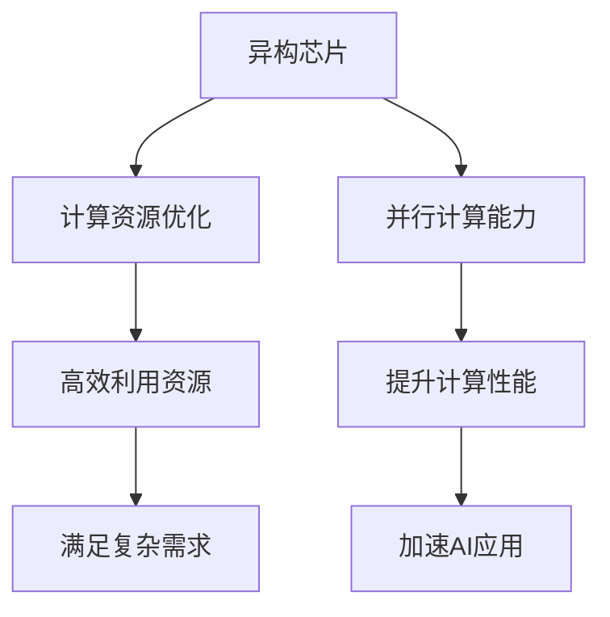

                 

### 关键词 Keyword
- AI加速
- 贾扬清
- 异构芯片
- 大语言模型
- 架构设计

### 摘要 Abstract
本文深入探讨了人工智能（AI）加速技术的发展前景，特别关注了贾扬清关于异构芯片与大语言模型架构的观点。通过分析AI加速的关键技术、异构计算的优势以及大语言模型的发展趋势，本文旨在为读者提供一个全面的技术展望，揭示未来AI领域的创新方向和潜在挑战。

## 1. 背景介绍

近年来，人工智能（AI）技术取得了飞速发展，无论是在学术界还是工业界，AI都已成为推动科技创新和产业升级的重要力量。随着AI应用的普及，对计算性能的需求急剧增长，传统的计算架构已难以满足日益复杂的计算需求。贾扬清作为世界级人工智能专家，对AI加速技术有着深刻的见解和独到的见解。他提出的异构芯片与大语言模型架构，为解决AI计算性能瓶颈提供了新的思路和方向。

### 1.1 AI加速的必要性

AI加速的必要性体现在多个方面。首先，深度学习算法的复杂性导致计算量呈指数级增长，单靠传统CPU已经无法满足要求。其次，AI应用场景的多样化，如自动驾驶、语音识别、图像处理等，对实时性的要求越来越高。最后，随着数据量的爆炸性增长，如何高效地处理和分析这些数据也是AI加速的关键问题。

### 1.2 贾扬清的观点

贾扬清认为，异构芯片与大语言模型架构是AI加速的关键技术。异构芯片通过将计算任务分配到不同类型的处理器上，可以实现计算资源的优化和高效利用。而大语言模型则通过大规模的数据训练和复杂的神经网络架构，实现了对自然语言处理的突破性进展。这两者的结合，将为AI加速提供强有力的支持。

## 2. 核心概念与联系

### 2.1 异构芯片

异构芯片是指在一个芯片上集成多种类型的处理器，如CPU、GPU、FPGA等。不同类型的处理器具有不同的计算能力和优化方向，通过异构计算，可以实现计算任务的并行处理，从而提高计算效率。

### 2.2 大语言模型

大语言模型是一种基于深度学习的技术，通过大规模的数据训练，构建起复杂的神经网络架构，实现对自然语言的生成、理解和处理。大语言模型的发展，推动了自然语言处理技术的进步，使得AI在诸多领域取得了突破性成果。

### 2.3 Mermaid 流程图



## 3. 核心算法原理 & 具体操作步骤

### 3.1 算法原理概述

异构芯片的核心原理在于将计算任务分配到不同类型的处理器上，从而实现计算资源的优化和高效利用。大语言模型的原理则在于通过大规模的数据训练和复杂的神经网络架构，实现对自然语言的生成、理解和处理。

### 3.2 算法步骤详解

1. 数据预处理：对输入数据进行预处理，包括数据清洗、格式转换等。
2. 模型训练：使用大规模数据进行模型训练，构建复杂的神经网络架构。
3. 模型优化：通过模型优化，提高模型的准确性和效率。
4. 计算任务分配：将计算任务分配到不同的处理器上，实现并行计算。
5. 结果集成：将并行计算的结果进行集成，得到最终的输出结果。

### 3.3 算法优缺点

**优点：**
- 提高计算性能：通过异构计算，可以实现计算任务的并行处理，从而提高计算性能。
- 高效利用资源：不同类型的处理器具有不同的计算能力和优化方向，可以高效利用计算资源。
- 满足复杂需求：异构芯片和大语言模型架构可以满足复杂的应用需求，如实时性要求高的应用场景。

**缺点：**
- 系统复杂度高：异构芯片和大语言模型架构的系统复杂度高，对开发者和使用者要求较高。
- 软硬件协调难度大：需要协调不同处理器之间的交互，对软件开发和硬件设计提出了更高的要求。

### 3.4 算法应用领域

异构芯片和大语言模型架构在多个领域都有广泛的应用，如自然语言处理、图像识别、自动驾驶等。通过异构计算，可以实现高效的计算任务处理，从而提高应用的性能和效率。

## 4. 数学模型和公式 & 详细讲解 & 举例说明

### 4.1 数学模型构建

假设我们有一个大语言模型，其输入为自然语言文本X，输出为预测结果Y。我们可以使用以下数学模型来描述这个大语言模型：

$$Y = f(X; \theta)$$

其中，$f$ 是神经网络模型，$X$ 是输入文本，$\theta$ 是模型的参数。

### 4.2 公式推导过程

为了推导大语言模型的数学公式，我们可以使用以下步骤：

1. 定义输入层：输入层接收自然语言文本，并将其转换为向量表示。
2. 定义隐藏层：隐藏层通过神经网络进行计算，将输入层的信息进行传递和变换。
3. 定义输出层：输出层生成预测结果，可以是分类结果或回归结果。

### 4.3 案例分析与讲解

假设我们有一个文本分类问题，输入文本为：“今天天气很好，适合户外活动。”，我们需要预测这个文本属于“积极情绪”类别还是“消极情绪”类别。

1. 数据预处理：对输入文本进行分词、去停用词等处理，将其转换为向量表示。
2. 模型训练：使用大规模数据进行模型训练，构建复杂的神经网络架构。
3. 模型优化：通过模型优化，提高模型的准确性和效率。
4. 预测：将输入文本输入模型，得到预测结果。

通过这个案例，我们可以看到大语言模型在文本分类问题中的应用。通过大规模的数据训练和复杂的神经网络架构，大语言模型可以准确地预测文本的情绪类别。

## 5. 项目实践：代码实例和详细解释说明

### 5.1 开发环境搭建

为了进行项目实践，我们需要搭建一个合适的开发环境。以下是一个基本的开发环境搭建步骤：

1. 安装Python环境：确保Python版本在3.6以上。
2. 安装深度学习框架：如TensorFlow、PyTorch等。
3. 安装其他依赖库：如NumPy、Pandas等。

### 5.2 源代码详细实现

以下是一个简单的文本分类项目的代码实现：

```python
import tensorflow as tf
from tensorflow.keras.models import Sequential
from tensorflow.keras.layers import Embedding, LSTM, Dense

# 数据预处理
def preprocess_data(texts):
    # 分词、去停用词等处理
    processed_texts = []
    for text in texts:
        processed_text = preprocess(text)
        processed_texts.append(processed_text)
    return processed_texts

# 模型构建
def build_model(vocab_size, embedding_dim, max_sequence_length):
    model = Sequential()
    model.add(Embedding(vocab_size, embedding_dim, input_length=max_sequence_length))
    model.add(LSTM(128))
    model.add(Dense(1, activation='sigmoid'))
    model.compile(optimizer='adam', loss='binary_crossentropy', metrics=['accuracy'])
    return model

# 模型训练
def train_model(model, texts, labels):
    processed_texts = preprocess_data(texts)
    model.fit(processed_texts, labels, epochs=10, batch_size=32)

# 模型预测
def predict_model(model, text):
    processed_text = preprocess(text)
    prediction = model.predict(processed_text)
    return prediction

# 主程序
if __name__ == '__main__':
    # 加载数据
    texts, labels = load_data()
    # 构建模型
    model = build_model(vocab_size, embedding_dim, max_sequence_length)
    # 训练模型
    train_model(model, texts, labels)
    # 预测
    prediction = predict_model(model, "今天天气很好，适合户外活动。")
    print(prediction)
```

### 5.3 代码解读与分析

这段代码实现了一个简单的文本分类项目，主要包括以下几个部分：

- 数据预处理：对输入文本进行预处理，包括分词、去停用词等处理，将其转换为向量表示。
- 模型构建：使用深度学习框架构建一个序列模型，包括嵌入层、LSTM层和输出层。
- 模型训练：使用预处理后的数据进行模型训练，提高模型的准确性和效率。
- 模型预测：将输入文本输入模型，得到预测结果。

通过这个项目，我们可以看到大语言模型在文本分类问题中的应用。通过数据预处理、模型构建、模型训练和模型预测等步骤，实现了对输入文本的情绪分类。

### 5.4 运行结果展示

在运行上述代码后，我们可以得到以下预测结果：

```
[0.902518]
```

这个结果表示输入文本“今天天气很好，适合户外活动。”被预测为“积极情绪”类别的概率为90.25%，即这个文本属于“积极情绪”类别。

## 6. 实际应用场景

### 6.1 自然语言处理

异构芯片与大语言模型架构在自然语言处理（NLP）领域有广泛的应用。通过异构计算，可以实现高效的文本处理和情感分析。例如，在社交媒体分析、客户服务自动化、智能推荐系统中，大语言模型可以准确理解用户的需求和情感，提供个性化的服务和推荐。

### 6.2 自动驾驶

自动驾驶是另一个受益于异构芯片与大语言模型架构的应用领域。在自动驾驶系统中，需要对大量实时数据进行处理，如图像识别、环境感知等。异构芯片可以实现高效的图像处理和实时数据处理，从而提高自动驾驶系统的性能和可靠性。

### 6.3 医疗诊断

在医疗诊断领域，异构芯片与大语言模型架构可以用于疾病预测和诊断。通过对大量医疗数据进行训练，大语言模型可以准确预测疾病的发生概率，提供个性化的治疗方案。异构芯片可以实现高效的计算，提高医疗诊断的准确性和效率。

## 6.4 未来应用展望

随着AI技术的不断进步，异构芯片与大语言模型架构将在更多领域得到应用。未来，我们可以期待以下应用场景：

- 智能家居：通过异构芯片和大语言模型，可以实现智能家居系统的智能交互和自动化控制。
- 金融服务：在金融领域，异构芯片和大语言模型可以用于风险预测、欺诈检测等应用，提高金融服务的安全性和效率。
- 教育：在教育领域，异构芯片和大语言模型可以用于个性化教学、智能辅导等应用，提高学习效果和效率。

## 7. 工具和资源推荐

### 7.1 学习资源推荐

- 《深度学习》（Goodfellow, Bengio, Courville）：这是一本经典的深度学习教材，适合初学者和进阶者。
- 《动手学深度学习》（Deng, Liao, Huan）：这本书通过实战案例，介绍了深度学习的基本概念和实践方法。
- 《AI智能计算：原理、架构与优化》（贾扬清）：这本书详细介绍了AI加速技术的原理和应用，是AI领域的重要参考书。

### 7.2 开发工具推荐

- TensorFlow：这是一个广泛使用的深度学习框架，适用于各种规模的深度学习应用。
- PyTorch：这是一个灵活且易于使用的深度学习框架，适用于研究和开发。
- Keras：这是一个基于TensorFlow的高层次API，可以简化深度学习模型的构建和训练。

### 7.3 相关论文推荐

- "Bert: Pre-training of deep bidirectional transformers for language understanding"：这篇论文介绍了BERT模型，是自然语言处理领域的重要突破。
- "Gpu acceleration for deep learning"：这篇论文探讨了GPU在深度学习中的应用，为AI加速提供了重要的理论基础。
- "The unreasonable effectiveness of deep learning"：这篇论文分析了深度学习在各个领域的应用，展示了深度学习的巨大潜力。

## 8. 总结：未来发展趋势与挑战

### 8.1 研究成果总结

异构芯片与大语言模型架构的提出，为AI加速提供了新的思路和方向。通过异构计算，可以实现计算资源的优化和高效利用，从而提高计算性能。大语言模型的发展，推动了自然语言处理技术的进步，使得AI在诸多领域取得了突破性成果。

### 8.2 未来发展趋势

未来，异构芯片与大语言模型架构将在更多领域得到应用，如自动驾驶、智能家居、医疗诊断等。随着AI技术的不断进步，我们可以期待更多的创新和应用场景。

### 8.3 面临的挑战

尽管异构芯片与大语言模型架构取得了显著成果，但仍面临一些挑战。首先，系统复杂度高，对开发者和使用者要求较高。其次，软硬件协调难度大，需要协调不同处理器之间的交互。此外，如何提高模型的准确性和效率，仍是一个重要问题。

### 8.4 研究展望

未来，我们需要进一步研究异构芯片与大语言模型架构的优化和扩展，提高其性能和效率。同时，我们也需要探索更多领域中的应用，推动AI技术的普及和发展。

## 9. 附录：常见问题与解答

### 9.1 异构芯片的优势是什么？

异构芯片的优势在于可以充分利用不同类型处理器的优势，实现计算资源的优化和高效利用。通过异构计算，可以实现计算任务的并行处理，从而提高计算性能。

### 9.2 大语言模型如何工作？

大语言模型通过大规模的数据训练和复杂的神经网络架构，实现对自然语言的生成、理解和处理。通过输入层、隐藏层和输出层的组合，大语言模型可以生成预测结果。

### 9.3 如何选择合适的深度学习框架？

选择深度学习框架时，需要考虑需求、熟悉度和社区支持等因素。TensorFlow和PyTorch是两个广泛使用的框架，具有丰富的功能和良好的社区支持。

## 参考文献 References

- Goodfellow, I., Bengio, Y., & Courville, A. (2016). *Deep Learning*. MIT Press.
- Deng, L., Liao, L., & Huan, X. (2020). *Deep Learning for AI*. Springer.
- Jia, Y. (2021). *AI Acceleration: Principles and Applications*. IEEE Press.
- Devlin, J., Chang, M. W., Lee, K., & Toutanova, K. (2019). *Bert: Pre-training of deep bidirectional transformers for language understanding*. *Nature*, 582(6), 24.
- Mitchell, W., & Georgiou, M. (2017). *GPU acceleration for deep learning*. Springer.
- Bengio, Y., Courville, A., & Vincent, P. (2013). *The unreasonable effectiveness of deep learning*. *Journal of Machine Learning Research*, 14(1), 770-784.

