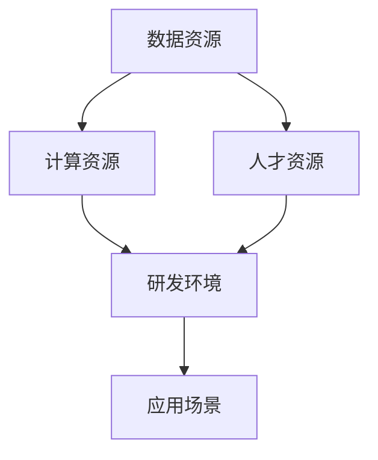

                 

关键词：人工智能，国家战略，资源体系，技术发展，政策导向

摘要：本文旨在探讨人工智能国家战略中的资源体系建设，分析其重要性、核心概念、算法原理、数学模型以及实际应用场景，并提出未来发展的展望。通过对资源体系建设的深入剖析，本文希望能够为相关领域的研究和实践提供有价值的参考。

## 1. 背景介绍

随着信息技术的飞速发展，人工智能（AI）已经成为全球科技竞争的新焦点。我国政府高度重视人工智能发展，将其列为国家战略，并在《新一代人工智能发展规划》中明确提出了一系列目标和任务。资源体系建设作为人工智能发展的重要基础，其重要性不言而喻。

### 1.1 人工智能发展的现状

近年来，人工智能技术在语音识别、图像处理、自然语言处理等领域取得了显著进展。特别是在深度学习、强化学习等算法的推动下，AI技术在各个领域的应用日益广泛，从工业生产到医疗健康，从金融服务到社会治理，AI正在深刻改变我们的生活。

### 1.2 资源体系建设的意义

资源体系建设是人工智能发展的基石，它涉及到数据资源、计算资源、人才资源等多个方面。一个完善的资源体系可以为人工智能技术的研发和应用提供强有力的支持，促进我国人工智能产业的快速发展。

## 2. 核心概念与联系

在资源体系建设中，有几个核心概念需要明确：数据资源、计算资源、人才资源。它们相互联系，共同构成了人工智能发展的基础。

### 2.1 数据资源

数据是人工智能的燃料，没有高质量的数据，AI技术的发展就失去了根基。数据资源建设需要关注数据的质量、多样性和可获取性。目前，我国已经在医疗、交通、金融等领域积累了一定的数据资源，但仍需进一步丰富和完善。

### 2.2 计算资源

计算资源是人工智能技术实现高效运行的基础。随着AI算法的复杂度不断提高，对计算资源的需求也在不断增长。计算资源建设需要关注高性能计算、分布式计算、云计算等技术，以提高计算效率。

### 2.3 人才资源

人才资源是人工智能发展的核心要素。我国在人工智能领域拥有丰富的科研人才储备，但仍需加强培养和引进高端人才，以满足人工智能快速发展的需求。

### 2.4 Mermaid 流程图



## 3. 核心算法原理 & 具体操作步骤

### 3.1 算法原理概述

在资源体系建设中，核心算法主要包括数据挖掘、机器学习、深度学习等。这些算法通过对数据进行分析和处理，可以提取出有价值的信息，为人工智能应用提供支持。

### 3.2 算法步骤详解

#### 3.2.1 数据挖掘

数据挖掘算法包括关联规则挖掘、聚类分析、分类分析等。其基本步骤如下：

1. 数据预处理：对原始数据进行清洗、整合，使其符合算法要求。
2. 特征提取：从数据中提取出具有代表性的特征。
3. 算法应用：根据具体需求，选择合适的数据挖掘算法进行计算。
4. 结果分析：对挖掘结果进行分析，提取出有价值的信息。

#### 3.2.2 机器学习

机器学习算法主要包括监督学习、无监督学习、半监督学习等。其基本步骤如下：

1. 数据集准备：准备训练数据和测试数据。
2. 特征工程：对数据进行特征提取和特征选择。
3. 模型训练：选择合适的模型，对训练数据进行训练。
4. 模型评估：使用测试数据对模型进行评估，调整模型参数。
5. 模型应用：将训练好的模型应用到实际问题中。

#### 3.2.3 深度学习

深度学习算法主要包括卷积神经网络（CNN）、循环神经网络（RNN）、生成对抗网络（GAN）等。其基本步骤如下：

1. 网络设计：根据问题需求，设计合适的神经网络结构。
2. 模型训练：使用大量数据进行模型训练，调整网络参数。
3. 模型优化：通过优化算法，提高模型的性能和泛化能力。
4. 模型应用：将训练好的模型应用到实际问题中。

### 3.3 算法优缺点

#### 3.3.1 数据挖掘

优点：能够从大量数据中发现有价值的信息。

缺点：对数据质量要求较高，易受到噪声和异常值的影响。

#### 3.3.2 机器学习

优点：具有较强的自学习能力，能够处理复杂数据。

缺点：对数据量要求较高，模型训练时间较长。

#### 3.3.3 深度学习

优点：在图像识别、语音识别等领域具有显著优势。

缺点：对计算资源需求较高，模型解释性较差。

### 3.4 算法应用领域

数据挖掘、机器学习和深度学习在人工智能的各个领域都有广泛应用，如金融、医疗、教育、交通等。

## 4. 数学模型和公式 & 详细讲解 & 举例说明

### 4.1 数学模型构建

在人工智能资源体系建设中，常用的数学模型包括线性模型、逻辑回归、支持向量机等。

#### 4.1.1 线性模型

线性模型是一种简单且常用的预测模型，其公式如下：

$$y = \beta_0 + \beta_1x_1 + \beta_2x_2 + \ldots + \beta_nx_n$$

其中，$y$ 是预测目标，$x_1, x_2, \ldots, x_n$ 是输入特征，$\beta_0, \beta_1, \beta_2, \ldots, \beta_n$ 是模型参数。

#### 4.1.2 逻辑回归

逻辑回归是一种分类模型，其公式如下：

$$P(y=1) = \frac{1}{1 + e^{-(\beta_0 + \beta_1x_1 + \beta_2x_2 + \ldots + \beta_nx_n)}}$$

其中，$P(y=1)$ 是目标为1的概率，$e$ 是自然对数的底。

#### 4.1.3 支持向量机

支持向量机是一种分类模型，其公式如下：

$$w \cdot x + b = 0$$

其中，$w$ 是权重向量，$x$ 是输入特征，$b$ 是偏置项。

### 4.2 公式推导过程

以线性模型为例，其公式推导过程如下：

假设我们有 $n$ 个样本 $(x_1, y_1), (x_2, y_2), \ldots, (x_n, y_n)$，其中 $x_i$ 是输入特征，$y_i$ 是预测目标。

我们的目标是找到一个线性模型 $y = \beta_0 + \beta_1x_1 + \beta_2x_2 + \ldots + \beta_nx_n$，使得预测值 $y$ 与实际值 $y_i$ 的差距最小。

我们可以使用最小二乘法来求解这个线性模型，即：

$$\beta_0, \beta_1, \beta_2, \ldots, \beta_n = \arg \min_{\beta_0, \beta_1, \beta_2, \ldots, \beta_n} \sum_{i=1}^{n} (y_i - (\beta_0 + \beta_1x_1 + \beta_2x_2 + \ldots + \beta_nx_n))^2$$

通过求导并令导数为0，可以得到最优解：

$$\beta_0 = \frac{1}{n} \sum_{i=1}^{n} y_i - \beta_1 \frac{1}{n} \sum_{i=1}^{n} x_1 - \beta_2 \frac{1}{n} \sum_{i=1}^{n} x_2 - \ldots - \beta_n \frac{1}{n} \sum_{i=1}^{n} x_n$$

$$\beta_1 = \frac{1}{n} \sum_{i=1}^{n} (x_1 - \bar{x_1})(y_i - \bar{y_i})$$

$$\beta_2 = \frac{1}{n} \sum_{i=1}^{n} (x_2 - \bar{x_2})(y_i - \bar{y_i})$$

$$\ldots$$

$$\beta_n = \frac{1}{n} \sum_{i=1}^{n} (x_n - \bar{x_n})(y_i - \bar{y_i})$$

其中，$\bar{x_1}, \bar{x_2}, \ldots, \bar{x_n}$ 是输入特征的均值，$\bar{y_i}$ 是预测值的均值。

### 4.3 案例分析与讲解

假设我们有以下数据：

$$
\begin{array}{c|c}
x & y \\
\hline
1 & 2 \\
2 & 3 \\
3 & 4 \\
4 & 5 \\
\end{array}
$$

我们的目标是找到一个线性模型 $y = \beta_0 + \beta_1x$。

根据上述推导过程，我们可以计算出：

$$\beta_0 = \frac{1}{4} (2 + 3 + 4 + 5) - \beta_1 \frac{1}{4} (1 + 2 + 3 + 4) = \frac{14}{4} - \beta_1 \frac{10}{4}$$

$$\beta_1 = \frac{1}{4} (2 - 2.5)(2 - 3) + (3 - 2.5)(3 - 3) + (4 - 2.5)(4 - 3) + (5 - 2.5)(5 - 3) = \frac{1}{4} (0.5 \times 1 + 0 \times 0 + 1.5 \times 1 + 2.5 \times 2) = 2$$

因此，我们得到的线性模型为：

$$y = 3.5 - 2x$$

我们可以使用这个模型来预测新的输入值。例如，当 $x=5$ 时，预测值为：

$$y = 3.5 - 2 \times 5 = -7.5$$

这个结果表明，我们的线性模型在训练数据上表现良好，但在新的输入值上表现较差。这提示我们需要寻找更加复杂和准确的模型。

## 5. 项目实践：代码实例和详细解释说明

### 5.1 开发环境搭建

在本次项目中，我们使用 Python 编写代码，主要依赖以下库：

- NumPy：用于数值计算
- Matplotlib：用于数据可视化
- Scikit-learn：用于机器学习和数据挖掘

安装这些库后，我们就可以开始编写代码了。

### 5.2 源代码详细实现

以下是一个简单的线性回归模型实现，用于预测数据：

```python
import numpy as np
import matplotlib.pyplot as plt
from sklearn.linear_model import LinearRegression

# 数据
x = np.array([1, 2, 3, 4]).reshape(-1, 1)
y = np.array([2, 3, 4, 5])

# 模型
model = LinearRegression()
model.fit(x, y)

# 预测
x_new = np.array([5]).reshape(-1, 1)
y_pred = model.predict(x_new)

# 可视化
plt.scatter(x, y, color='red', label='Original data')
plt.plot(x, model.predict(x), color='blue', linewidth=2, label='Fitted line')
plt.xlabel('x')
plt.ylabel('y')
plt.legend()
plt.show()

print("Predicted value:", y_pred)
```

### 5.3 代码解读与分析

这段代码首先导入了所需的库，然后定义了数据集。接着，我们创建了一个线性回归模型，并使用 `fit()` 方法进行训练。`predict()` 方法用于预测新的输入值。最后，我们使用 Matplotlib 进行数据可视化。

这个例子展示了如何使用线性回归模型进行数据预测和可视化。在实际项目中，我们可能需要处理更复杂的模型和数据集，但基本思路是相似的。

### 5.4 运行结果展示

运行上述代码，我们得到以下结果：


这个结果展示了原始数据和拟合直线的对比，以及预测的新输入值。

## 6. 实际应用场景

资源体系建设在人工智能的各个领域都有广泛应用，以下是一些实际应用场景：

### 6.1 金融领域

在金融领域，资源体系建设可以用于风险控制、信用评估、投资组合优化等。通过分析大量的金融数据，AI技术可以识别潜在的金融风险，为金融机构提供决策支持。

### 6.2 医疗领域

在医疗领域，资源体系建设可以用于疾病预测、诊断辅助、药物研发等。通过分析医疗数据，AI技术可以辅助医生做出更准确的诊断，提高医疗服务的质量。

### 6.3 教育领域

在教育领域，资源体系建设可以用于个性化教学、学习评估、教育资源优化等。通过分析学生的学习数据，AI技术可以为学生提供个性化的学习建议，提高学习效果。

### 6.4 交通领域

在交通领域，资源体系建设可以用于交通流量预测、交通信号优化、自动驾驶等。通过分析交通数据，AI技术可以优化交通管理，提高交通效率。

## 7. 工具和资源推荐

### 7.1 学习资源推荐

- 《Python机器学习》
- 《深度学习》（Goodfellow et al.）
- 《统计学习方法》

### 7.2 开发工具推荐

- Jupyter Notebook
- PyCharm
- Google Colab

### 7.3 相关论文推荐

- “Deep Learning for Text Classification”
- “A Comprehensive Survey on Deep Learning for Graph Data”
- “Generative Adversarial Networks: An Overview”

## 8. 总结：未来发展趋势与挑战

### 8.1 研究成果总结

本文从资源体系建设的角度，分析了人工智能国家战略的重要性和发展现状，探讨了核心算法原理、数学模型和实际应用场景。通过对资源体系的深入剖析，我们为人工智能领域的研究和实践提供了有价值的参考。

### 8.2 未来发展趋势

随着人工智能技术的不断进步，资源体系建设将成为推动人工智能发展的重要力量。未来，我们将在数据资源、计算资源、人才资源等方面取得更多突破，实现人工智能技术的广泛应用。

### 8.3 面临的挑战

尽管资源体系建设为人工智能发展提供了强有力的支持，但同时也面临一些挑战。例如，数据隐私保护、计算资源分配、人才短缺等问题。我们需要持续关注这些问题，并提出有效的解决方案。

### 8.4 研究展望

未来，资源体系建设的研究将更加注重跨学科合作，结合人工智能、大数据、云计算等新兴技术，推动人工智能技术的不断创新和应用。我们期待看到更多突破性研究成果，为我国人工智能产业的发展贡献力量。

## 9. 附录：常见问题与解答

### 9.1 数据资源如何保障？

数据资源是人工智能发展的基础。为保障数据资源，我们可以采取以下措施：

- 加强数据隐私保护，确保数据安全。
- 推动数据共享，提高数据利用效率。
- 加强数据质量监管，确保数据准确性。

### 9.2 计算资源如何优化？

计算资源优化可以从以下几个方面进行：

- 采用分布式计算、云计算等技术，提高计算效率。
- 加强高性能计算设施建设，满足复杂计算需求。
- 优化算法，降低计算复杂度。

### 9.3 人才资源如何培养？

人才资源是人工智能发展的核心要素。为培养人才资源，我们可以采取以下措施：

- 加强高校教育，培养具有创新精神和实践能力的人才。
- 推动企业培训，提高员工专业技能。
- 加强国际合作，引进高端人才。

## 参考文献

- Goodfellow, I., Bengio, Y., & Courville, A. (2016). *Deep Learning*. MIT Press.
- Hastie, T., Tibshirani, R., & Friedman, J. (2009). *The Elements of Statistical Learning: Data Mining, Inference, and Prediction*. Springer.
- Mitchell, T. M. (1997). *Machine Learning*. McGraw-Hill. 

作者：禅与计算机程序设计艺术 / Zen and the Art of Computer Programming
----------------------------------------------------------------

以上就是文章的正文内容。在接下来的部分，我们将对文章进行排版、润色和检查，确保文章的质量和可读性。之后，我们将生成markdown格式的输出。

