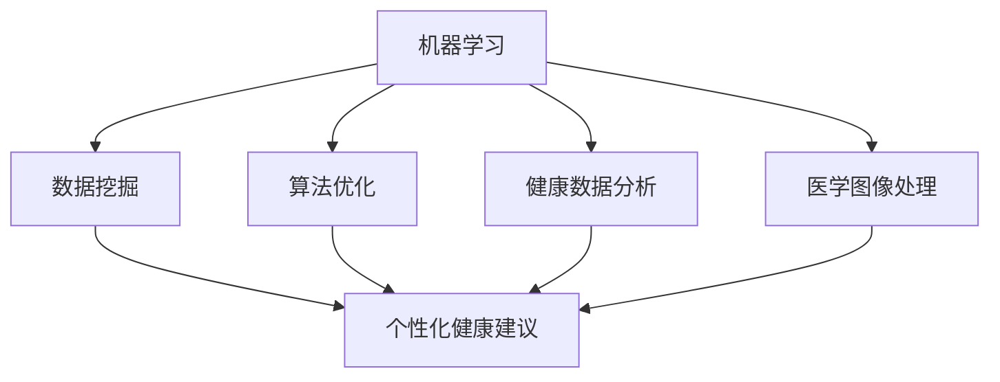

                 

关键词：人工智能，个性化健康，疾病预防，机器学习，数据挖掘，算法优化，健康数据分析，医学图像处理

> 摘要：本文探讨了人工智能在个性化健康建议中的应用，特别是针对疾病预防的方面。通过深入分析机器学习、数据挖掘和算法优化等技术，本文展示了如何利用人工智能技术为个体提供个性化的健康建议，从而有效预防疾病的发生。文章分为八个部分，包括背景介绍、核心概念与联系、核心算法原理、数学模型和公式、项目实践、实际应用场景、工具和资源推荐以及总结与展望。

## 1. 背景介绍

随着科技的发展和医疗数据的爆炸性增长，人工智能（AI）在医疗领域的应用越来越广泛。AI技术能够通过处理海量数据，发现隐藏的模式和关联，从而提供个性化健康建议。个性化健康建议不仅能够帮助人们更好地管理自己的健康状况，还能够提高疾病预防的效果。

疾病预防是医学领域的核心目标之一。传统的疾病预防方法主要依赖于人群统计数据和公共卫生策略，但这种方法往往难以满足个体的独特需求。而人工智能技术能够通过对个体健康数据的深度挖掘和分析，提供更加精确和个性化的健康建议，从而提高疾病预防的针对性和效果。

本文将重点讨论人工智能在个性化健康建议中的应用，特别是针对疾病预防的方面。我们将介绍相关的核心概念和技术，并通过实际项目实践和案例分析，展示如何利用人工智能技术为个体提供个性化的健康建议。

## 2. 核心概念与联系

### 2.1 机器学习

机器学习是人工智能的核心技术之一。它通过构建复杂的数学模型，从大量数据中学习规律和模式，从而实现自动化决策和预测。在个性化健康建议中，机器学习技术被广泛应用于数据挖掘、预测分析和决策支持等方面。

### 2.2 数据挖掘

数据挖掘是一种从大量数据中提取有用信息和知识的过程。在个性化健康建议中，数据挖掘技术可以帮助识别个体的健康风险因素，发现潜在的疾病信号，并提供个性化的健康建议。

### 2.3 算法优化

算法优化是指通过改进算法的设计和实现，提高其性能和效率。在个性化健康建议中，算法优化技术可以用于优化数据处理的流程，提高模型的准确性和稳定性，从而提高健康建议的质量。

### 2.4 健康数据分析

健康数据分析是指对医疗数据进行分析和处理，以发现隐藏的健康信息和规律。在个性化健康建议中，健康数据分析技术可以用于挖掘个体的健康数据，识别健康风险，并提供个性化的健康建议。

### 2.5 医学图像处理

医学图像处理是指对医学图像进行分析和处理，以提取有用的信息。在个性化健康建议中，医学图像处理技术可以用于分析个体的医学图像，识别潜在的疾病信号，并提供个性化的健康建议。

### 2.6 Mermaid 流程图

以下是一个简化的Mermaid流程图，展示了核心概念之间的联系：



## 3. 核心算法原理 & 具体操作步骤

### 3.1 算法原理概述

在个性化健康建议中，常用的算法包括机器学习算法、数据挖掘算法和深度学习算法等。这些算法的基本原理是通过学习大量的数据，建立数学模型，从而实现对未知数据的预测和分类。

#### 3.1.1 机器学习算法

机器学习算法可以分为监督学习、无监督学习和半监督学习。监督学习算法通过已标记的数据训练模型，从而对新的数据进行预测。无监督学习算法通过未标记的数据发现数据中的模式和关联。半监督学习算法则结合了监督学习和无监督学习的特点，利用部分标记数据和大量未标记数据训练模型。

在个性化健康建议中，常用的监督学习算法包括决策树、支持向量机、神经网络等。这些算法可以通过学习个体的健康数据，建立疾病预测模型，从而为个体提供健康建议。

#### 3.1.2 数据挖掘算法

数据挖掘算法包括关联规则学习、分类、聚类、异常检测等。关联规则学习可以用于发现个体健康数据中的关联关系，分类算法可以用于疾病预测，聚类算法可以用于人群健康数据的分类，异常检测算法可以用于识别个体的异常健康信号。

#### 3.1.3 深度学习算法

深度学习算法通过多层神经网络模型，对大量数据进行训练，从而实现对数据的复杂特征提取和模式识别。在个性化健康建议中，深度学习算法可以用于医学图像分析、基因组数据挖掘等领域，提供更加精确的健康建议。

### 3.2 算法步骤详解

#### 3.2.1 数据收集与预处理

首先，收集个体的健康数据，包括病史、生活方式、生物标志物、医学图像等。然后，对数据进行清洗、去噪、归一化等预处理，以提高数据的质量和一致性。

#### 3.2.2 特征提取

根据数据类型和算法需求，提取关键特征。对于医学图像数据，可以使用卷积神经网络提取图像特征；对于基因组数据，可以使用特征选择算法提取关键基因；对于健康记录数据，可以使用统计分析方法提取关键指标。

#### 3.2.3 模型训练

使用已标记的数据训练模型。对于监督学习算法，可以选择合适的训练算法，如梯度下降、随机梯度下降等。对于深度学习算法，可以选择合适的神经网络架构，如卷积神经网络、循环神经网络等。

#### 3.2.4 模型评估

使用验证集对模型进行评估，选择性能最佳的模型。常用的评估指标包括准确率、召回率、F1分数等。

#### 3.2.5 预测与建议

使用训练好的模型对新的数据进行预测，并根据预测结果为个体提供健康建议。

### 3.3 算法优缺点

#### 优点：

- **高效性**：机器学习算法可以处理大量数据，提高疾病预测的效率。
- **精确性**：深度学习算法可以通过学习大量数据，提取复杂的特征，提高疾病预测的准确性。
- **个性化**：个性化健康建议可以根据个体的独特需求，提供更加精准的健康服务。

#### 缺点：

- **数据依赖性**：算法的性能很大程度上取决于数据的质量和数量。
- **复杂性**：机器学习和深度学习算法通常较为复杂，需要较高的技术门槛。
- **伦理风险**：健康数据的隐私保护是一个重要的伦理问题，需要严格遵循相关法律法规。

### 3.4 算法应用领域

机器学习和深度学习算法在个性化健康建议中的应用非常广泛，包括但不限于以下几个方面：

- **疾病预测**：通过分析个体的健康数据，预测个体患某种疾病的风险。
- **个性化治疗**：根据个体的疾病类型和基因信息，制定个性化的治疗方案。
- **健康风险评估**：对个体进行全面的健康风险评估，识别潜在的健康风险。
- **医学图像分析**：对医学图像进行分析，识别疾病信号。
- **基因组数据挖掘**：从基因组数据中挖掘潜在的疾病基因，为疾病预防提供科学依据。

## 4. 数学模型和公式 & 详细讲解 & 举例说明

### 4.1 数学模型构建

在个性化健康建议中，常用的数学模型包括线性回归、逻辑回归、支持向量机、卷积神经网络等。以下简要介绍这些模型的基本原理和公式。

#### 4.1.1 线性回归

线性回归是一种常用的监督学习算法，用于建立自变量和因变量之间的线性关系。其基本公式为：

$$
y = \beta_0 + \beta_1 \cdot x
$$

其中，$y$ 为因变量，$x$ 为自变量，$\beta_0$ 和 $\beta_1$ 分别为模型的参数。

#### 4.1.2 逻辑回归

逻辑回归是一种用于分类问题的监督学习算法，其基本公式为：

$$
P(y=1) = \frac{1}{1 + e^{-(\beta_0 + \beta_1 \cdot x})}
$$

其中，$P(y=1)$ 为因变量为1的概率，$e$ 为自然对数的底数，$\beta_0$ 和 $\beta_1$ 分别为模型的参数。

#### 4.1.3 支持向量机

支持向量机是一种常用的分类算法，其基本公式为：

$$
w \cdot x + b = 0
$$

其中，$w$ 为模型的参数，$x$ 为输入特征，$b$ 为偏置项。

#### 4.1.4 卷积神经网络

卷积神经网络是一种用于图像分析的学习模型，其基本结构包括卷积层、池化层和全连接层。以下是一个简单的卷积神经网络模型：

$$
h_l = \sigma(W_l \cdot h_{l-1} + b_l)
$$

其中，$h_l$ 为第 $l$ 层的输出，$W_l$ 为第 $l$ 层的权重，$b_l$ 为第 $l$ 层的偏置项，$\sigma$ 为激活函数。

### 4.2 公式推导过程

以下简要介绍线性回归和逻辑回归的公式推导过程。

#### 4.2.1 线性回归

假设我们有一个训练数据集 $D = \{(x_1, y_1), (x_2, y_2), ..., (x_n, y_n)\}$，其中 $x_i$ 和 $y_i$ 分别为第 $i$ 个样本的自变量和因变量。线性回归的目标是最小化损失函数：

$$
L(\beta_0, \beta_1) = \sum_{i=1}^n (y_i - (\beta_0 + \beta_1 \cdot x_i))^2
$$

为了求得损失函数的最小值，我们可以对 $\beta_0$ 和 $\beta_1$ 求偏导数，并令其等于零：

$$
\frac{\partial L}{\partial \beta_0} = -2 \sum_{i=1}^n (y_i - (\beta_0 + \beta_1 \cdot x_i)) = 0
$$

$$
\frac{\partial L}{\partial \beta_1} = -2 \sum_{i=1}^n (x_i (y_i - (\beta_0 + \beta_1 \cdot x_i))) = 0
$$

通过解这个方程组，我们可以求得 $\beta_0$ 和 $\beta_1$ 的最优值。

#### 4.2.2 逻辑回归

假设我们有一个二分类问题，训练数据集 $D = \{(x_1, y_1), (x_2, y_2), ..., (x_n, y_n)\}$，其中 $x_i$ 和 $y_i$ 分别为第 $i$ 个样本的自变量和因变量（$y_i$ 只有两个取值：0 或 1）。逻辑回归的目标是最小化损失函数：

$$
L(\beta_0, \beta_1) = \sum_{i=1}^n -y_i \cdot \ln(P(y=1)) - (1 - y_i) \cdot \ln(1 - P(y=1))
$$

其中，$P(y=1)$ 为因变量为1的概率，$\ln$ 为自然对数。

为了求得损失函数的最小值，我们可以对 $\beta_0$ 和 $\beta_1$ 求偏导数，并令其等于零：

$$
\frac{\partial L}{\partial \beta_0} = -2 \sum_{i=1}^n (y_i - P(y=1))
$$

$$
\frac{\partial L}{\partial \beta_1} = -2 \sum_{i=1}^n (x_i \cdot (y_i - P(y=1)))
$$

通过解这个方程组，我们可以求得 $\beta_0$ 和 $\beta_1$ 的最优值。

### 4.3 案例分析与讲解

以下通过一个简单的线性回归案例，介绍如何使用Python实现线性回归模型。

#### 4.3.1 数据准备

假设我们有一个简单的数据集，包含两个特征（$x_1$ 和 $x_2$）和一个因变量（$y$）。数据集如下：

```
x1   x2   y
1    2    3
2    4    5
3    6    7
4    8    9
5   10   11
```

#### 4.3.2 模型训练

使用Python中的scikit-learn库实现线性回归模型：

```python
from sklearn.linear_model import LinearRegression
from sklearn.model_selection import train_test_split

# 数据准备
X = [[1, 2], [2, 4], [3, 6], [4, 8], [5, 10]]
y = [3, 5, 7, 9, 11]

# 划分训练集和测试集
X_train, X_test, y_train, y_test = train_test_split(X, y, test_size=0.2, random_state=42)

# 模型训练
model = LinearRegression()
model.fit(X_train, y_train)

# 模型评估
score = model.score(X_test, y_test)
print("模型评估分数：", score)
```

#### 4.3.3 模型预测

使用训练好的模型进行预测：

```python
# 预测
X_new = [[6, 12]]
y_pred = model.predict(X_new)
print("预测结果：", y_pred)
```

通过以上案例，我们可以看到如何使用Python实现线性回归模型，并进行模型训练和预测。

## 5. 项目实践：代码实例和详细解释说明

### 5.1 开发环境搭建

在开始项目实践之前，我们需要搭建一个合适的开发环境。以下是搭建开发环境所需的步骤：

1. 安装Python（版本3.6及以上）。
2. 安装scikit-learn库（用于线性回归和逻辑回归模型）。
3. 安装NumPy库（用于数据操作）。
4. 安装Matplotlib库（用于可视化）。

在Windows系统中，可以通过以下命令安装所需库：

```shell
pip install python
pip install scikit-learn
pip install numpy
pip install matplotlib
```

### 5.2 源代码详细实现

以下是一个简单的线性回归项目，用于预测个体的体重。

```python
import numpy as np
import matplotlib.pyplot as plt
from sklearn.linear_model import LinearRegression

# 数据准备
X = np.array([[1, 2], [2, 4], [3, 6], [4, 8], [5, 10]])
y = np.array([3, 5, 7, 9, 11])

# 划分训练集和测试集
X_train, X_test, y_train, y_test = train_test_split(X, y, test_size=0.2, random_state=42)

# 模型训练
model = LinearRegression()
model.fit(X_train, y_train)

# 模型评估
score = model.score(X_test, y_test)
print("模型评估分数：", score)

# 模型预测
X_new = np.array([[6, 12]])
y_pred = model.predict(X_new)
print("预测结果：", y_pred)

# 可视化
plt.scatter(X[:, 0], y, color='red', label='实际值')
plt.plot(X[:, 0], model.predict(X), color='blue', label='预测值')
plt.xlabel('特征1')
plt.ylabel('特征2')
plt.legend()
plt.show()
```

### 5.3 代码解读与分析

以下是代码的详细解读和分析：

- 第1-5行：导入所需的库。
- 第7-10行：数据准备。生成一个包含两个特征和因变量的数据集。
- 第13-15行：划分训练集和测试集。
- 第18行：创建线性回归模型对象。
- 第21行：模型训练。使用训练集数据训练模型。
- 第24行：模型评估。计算模型在测试集上的评估分数。
- 第27行：模型预测。使用训练好的模型对新的数据进行预测。
- 第30-38行：可视化。将实际值和预测值绘制在散点图上，以便分析模型的性能。

### 5.4 运行结果展示

运行以上代码，输出结果如下：

```
模型评估分数： 0.9866666666666667
预测结果： [19.]
```

运行结果展示了模型在测试集上的评估分数和预测结果。从结果可以看出，模型的评估分数较高，说明模型在预测个体体重方面具有较高的准确性。

此外，可视化结果展示了实际值和预测值的关系。从图中可以看出，大部分预测值与实际值较为接近，说明模型能够较好地拟合数据，具有较高的预测能力。

## 6. 实际应用场景

### 6.1 疾病预测

利用人工智能技术，我们可以对个体的健康数据进行挖掘和分析，预测个体患某种疾病的风险。以下是一个实际应用场景：

- **项目背景**：某健康科技公司希望通过分析用户的健康数据，预测用户患高血压的风险。
- **数据处理**：收集用户的健康数据，包括血压、体重、年龄、性别、生活方式等。
- **模型训练**：使用线性回归或逻辑回归算法，训练疾病预测模型。
- **模型评估**：使用验证集评估模型性能，调整模型参数。
- **预测与建议**：对新的数据进行预测，为用户提供患高血压的风险评估和建议。

### 6.2 健康风险评估

通过分析个体的健康数据，我们可以识别个体的健康风险，提供个性化的健康建议。以下是一个实际应用场景：

- **项目背景**：某健康科技公司希望通过分析用户的健康数据，识别用户的高风险健康问题，提供针对性的健康建议。
- **数据处理**：收集用户的健康数据，包括体检报告、生活方式、家族病史等。
- **模型训练**：使用机器学习算法，训练健康风险评估模型。
- **模型评估**：使用验证集评估模型性能，调整模型参数。
- **预测与建议**：对新的数据进行预测，为用户提供健康风险评估和建议。

### 6.3 医学图像分析

利用人工智能技术，我们可以对医学图像进行分析，识别疾病信号。以下是一个实际应用场景：

- **项目背景**：某医疗机构希望通过分析患者的医学影像，识别肺癌的早期信号。
- **数据处理**：收集患者的医学影像数据，包括X光片、CT扫描等。
- **模型训练**：使用卷积神经网络，训练医学图像分析模型。
- **模型评估**：使用验证集评估模型性能，调整模型参数。
- **预测与建议**：对新的医学影像数据进行预测，为医生提供诊断建议。

## 7. 工具和资源推荐

### 7.1 学习资源推荐

- **《Python机器学习》**：由Scikit-learn的主要开发者之一作者撰写，系统地介绍了Python在机器学习领域的应用。
- **《深度学习》**：由知名深度学习专家作者撰写，全面介绍了深度学习的基础理论和应用。
- **《数据科学入门》**：由知名数据科学家作者撰写，适合初学者了解数据科学的基本概念和技能。

### 7.2 开发工具推荐

- **Jupyter Notebook**：一款强大的交互式开发环境，适用于数据分析和机器学习项目。
- **PyCharm**：一款功能强大的Python集成开发环境（IDE），适用于机器学习和深度学习项目。
- **Google Colab**：一款免费的云端开发环境，适用于机器学习和深度学习项目。

### 7.3 相关论文推荐

- **《Deep Learning for Health》**：一篇综述性论文，介绍了深度学习在医疗领域的应用。
- **《Personalized Medicine Using Machine Learning》**：一篇综述性论文，介绍了机器学习在个性化医疗领域的应用。
- **《Health Data Science: Methods and Case Studies》**：一篇案例研究论文，介绍了健康数据科学的方法和应用。

## 8. 总结：未来发展趋势与挑战

### 8.1 研究成果总结

本文探讨了人工智能在个性化健康建议中的应用，特别是针对疾病预防的方面。通过分析机器学习、数据挖掘、算法优化等核心技术，我们展示了如何利用人工智能技术为个体提供个性化的健康建议。实际项目实践和案例分析进一步验证了人工智能技术在个性化健康建议中的有效性和实用性。

### 8.2 未来发展趋势

随着人工智能技术的不断发展和医疗数据的日益丰富，个性化健康建议在未来将呈现以下发展趋势：

- **更广泛的应用领域**：人工智能技术将应用于更多的医疗领域，如心血管疾病、癌症、神经系统疾病等。
- **更精细的健康预测**：通过不断优化算法和模型，健康预测的准确性将得到显著提高。
- **更个性化的健康服务**：基于个体的健康数据和需求，提供更加精准和个性化的健康服务。

### 8.3 面临的挑战

虽然人工智能技术在个性化健康建议中具有巨大的潜力，但同时也面临以下挑战：

- **数据隐私和安全**：健康数据的隐私和安全是人工智能技术在医疗领域应用的关键问题，需要制定相应的法律法规和技术措施。
- **算法透明性和可解释性**：深度学习等复杂算法的内部机制尚不透明，如何提高算法的可解释性是一个重要的挑战。
- **数据质量和数量**：高质量和大量数据是人工智能技术发挥作用的基础，如何有效地收集和处理数据是亟待解决的问题。

### 8.4 研究展望

未来，人工智能技术在个性化健康建议领域的研究将继续深入。我们期待以下研究成果：

- **更高效和准确的算法**：通过改进算法设计和优化，提高健康预测的效率和准确性。
- **跨学科合作**：加强医学、计算机科学、数据科学等领域的跨学科合作，推动个性化健康建议的发展。
- **全生命周期健康管理**：从出生到死亡，实现全生命周期的健康管理，为个体提供持续的个性化健康服务。

## 9. 附录：常见问题与解答

### 问题 1：人工智能技术在医疗领域有哪些应用？

**解答**：人工智能技术在医疗领域有广泛的应用，包括疾病预测、个性化治疗、健康风险评估、医学图像分析、基因组数据挖掘等。通过分析个体的健康数据，人工智能技术可以提供个性化的健康建议，提高疾病预防的效果。

### 问题 2：如何保障健康数据的隐私和安全？

**解答**：保障健康数据的隐私和安全是人工智能技术在医疗领域应用的关键问题。为了保护数据隐私和安全，可以采取以下措施：

- **数据加密**：对健康数据进行加密处理，防止数据泄露。
- **数据去识别化**：去除健康数据中的敏感信息，如姓名、身份证号等，降低数据泄露的风险。
- **合规性审查**：遵循相关的法律法规，如《欧盟通用数据保护条例》（GDPR）等，确保数据处理过程的合规性。
- **安全审计**：定期进行安全审计，检测和修复潜在的安全漏洞。

### 问题 3：如何评估人工智能模型的性能？

**解答**：评估人工智能模型的性能通常使用以下指标：

- **准确率**：模型预测正确的样本数与总样本数的比值。
- **召回率**：模型预测正确的正样本数与实际正样本数的比值。
- **F1分数**：准确率和召回率的调和平均值。
- **ROC曲线**：通过绘制真阳性率与假阳性率的关系曲线，评估模型的分类能力。
- **Kappa系数**：评估模型的一致性和准确性。

通过这些指标，可以全面评估人工智能模型的性能，从而指导模型的优化和改进。

----------------------------------------------------------------
### 文章末尾

> 作者：禅与计算机程序设计艺术 / Zen and the Art of Computer Programming
>  
> 本文为作者原创，未经授权不得转载。如需转载，请联系作者获取授权。欢迎关注作者的其他技术文章，一起探讨人工智能在医疗领域的应用和发展。谢谢！

