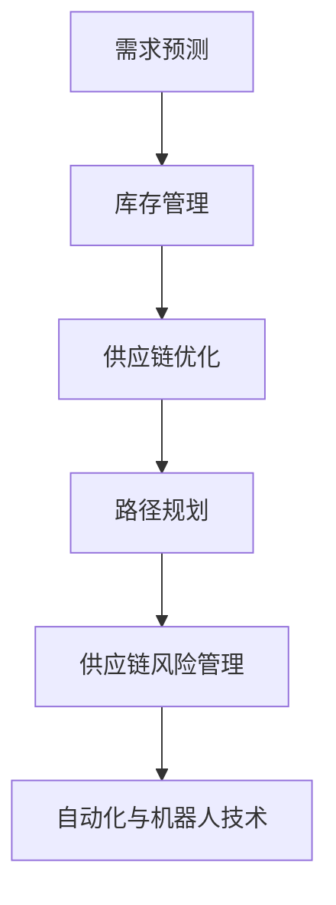

                 

关键词：人工智能，供应链管理，创新应用，大数据分析，机器学习，预测模型

> 摘要：随着全球供应链复杂性的增加，人工智能（AI）在供应链管理中的应用变得越来越重要。本文旨在探讨AI在供应链管理中的创新应用，包括核心概念、算法原理、数学模型、项目实践和未来展望。通过深入分析AI在供应链管理中的实际应用，本文希望为行业从业者提供有价值的见解和指导。

## 1. 背景介绍

供应链管理是企业运营的重要组成部分，它涉及到从原材料采购到产品交付给最终客户的整个过程。传统的供应链管理依赖于大量的手工操作和经验，这导致了效率低下、成本高昂和风险增加。随着全球化的加剧和市场竞争的激烈，企业需要更高效、更灵活的供应链管理策略来保持竞争力。

人工智能（AI）作为一项前沿技术，其在各个领域的应用已经取得了显著的成果。特别是在大数据分析、预测模型和自动化系统等方面，AI具有巨大的潜力。将AI技术应用于供应链管理，可以显著提升供应链的效率、降低成本、减少风险并提高客户满意度。

本文将首先介绍AI在供应链管理中的核心概念和联系，然后详细探讨核心算法原理和具体操作步骤，接着分析数学模型和公式，并通过项目实践展示实际应用。最后，本文将对AI在供应链管理中的未来应用场景进行展望，并总结研究的主要成果和面临的挑战。

## 2. 核心概念与联系

### 2.1 AI与供应链管理的基本概念

人工智能是指由人制造出来的系统所表现出的智能行为。它包括机器学习、深度学习、自然语言处理、计算机视觉等多个子领域。供应链管理则是指企业为了将原材料、产品和服务有效地转化为客户价值，通过协调和管理整个供应链过程中的各个环节来实现最大化效益。

### 2.2 AI在供应链管理中的应用

在供应链管理中，AI的应用主要体现在以下几个方面：

- **需求预测与库存管理**：利用机器学习算法分析历史销售数据和市场趋势，准确预测未来需求，从而优化库存水平，减少库存积压和缺货现象。
- **供应链优化与路径规划**：通过优化算法和模拟技术，确定最佳的物流运输路径和仓储策略，降低运输成本和提高物流效率。
- **供应链风险管理**：利用数据分析和预测模型，识别供应链中的潜在风险，提前采取措施降低风险。
- **自动化与机器人技术**：在仓储和运输等环节引入自动化设备和机器人，提高操作效率和减少人力成本。

### 2.3 Mermaid流程图

以下是一个简单的Mermaid流程图，展示AI在供应链管理中的基本流程：



## 3. 核心算法原理 & 具体操作步骤

### 3.1 算法原理概述

AI在供应链管理中的应用主要依赖于机器学习和深度学习算法。这些算法通过学习大量历史数据，自动发现数据中的规律和模式，从而实现对未来趋势的预测和优化。

- **机器学习算法**：如线性回归、决策树、随机森林等，主要用于处理结构化数据，进行需求预测和库存管理。
- **深度学习算法**：如卷积神经网络（CNN）和循环神经网络（RNN），主要用于处理非结构化数据，如图像和文本，进行供应链风险管理和自动化控制。

### 3.2 算法步骤详解

以下是一个基于机器学习的需求预测和库存管理算法的基本步骤：

#### 步骤1：数据收集与预处理

- 收集历史销售数据、市场数据、供应商数据等。
- 数据清洗，去除异常值和缺失值。
- 数据转换，将数据转换为适合算法输入的格式。

#### 步骤2：特征工程

- 提取影响需求的关键特征，如季节性、促销活动、市场趋势等。
- 对特征进行归一化或标准化处理。

#### 步骤3：模型选择与训练

- 选择合适的机器学习模型，如线性回归、决策树、随机森林等。
- 使用交叉验证方法选择最优参数。
- 使用历史数据训练模型。

#### 步骤4：模型评估与优化

- 使用验证集评估模型性能。
- 根据评估结果调整模型参数。
- 重新训练模型。

#### 步骤5：预测与决策

- 使用训练好的模型对未来的需求进行预测。
- 根据预测结果制定库存管理策略。

### 3.3 算法优缺点

#### 优点：

- **高效性**：通过自动化处理大量数据，大大提高了供应链管理的效率。
- **准确性**：基于历史数据和先进的算法，预测结果具有较高的准确性。
- **灵活性**：可以根据不同的业务需求和数据特点，灵活选择和调整算法。

#### 缺点：

- **数据依赖性**：算法的性能很大程度上依赖于数据的质量和数量。
- **计算资源消耗**：训练复杂的深度学习模型需要大量的计算资源。

### 3.4 算法应用领域

AI算法在供应链管理中的应用非常广泛，包括但不限于以下领域：

- **需求预测与库存管理**：如电商平台的库存优化、制造业的原材料采购。
- **供应链优化与路径规划**：如物流公司的运输优化、仓储管理。
- **供应链风险管理**：如供应链中断的预测与应对、供应链金融的风险控制。
- **自动化与机器人技术**：如自动化仓库的货物分类与搬运、无人驾驶运输车。

## 4. 数学模型和公式

在AI应用于供应链管理中，数学模型和公式起到了关键作用。以下是一个简单的数学模型和公式介绍，以及相关的详细讲解和举例说明。

### 4.1 数学模型构建

供应链管理中的数学模型通常基于需求预测和库存管理。以下是一个基本的线性回归模型：

$$
y = \beta_0 + \beta_1x_1 + \beta_2x_2 + ... + \beta_nx_n + \varepsilon
$$

其中，$y$代表需求量，$x_1, x_2, ..., x_n$代表影响需求的特征变量（如季节性、促销活动等），$\beta_0, \beta_1, ..., \beta_n$是模型的参数，$\varepsilon$是随机误差。

### 4.2 公式推导过程

线性回归模型的公式推导过程如下：

- **最小二乘法**：选择最优参数，使得实际需求与预测需求之间的误差平方和最小。

$$
\sum_{i=1}^{n}(y_i - (\beta_0 + \beta_1x_{i1} + \beta_2x_{i2} + ... + \beta_nx_{in}))^2
$$

- **求导与求解**：对上式关于每个参数求导，并令导数为零，求解得到最优参数。

$$
\frac{\partial}{\partial \beta_j} \sum_{i=1}^{n}(y_i - (\beta_0 + \beta_1x_{i1} + \beta_2x_{i2} + ... + \beta_nx_{in}))^2 = 0
$$

- **求解线性方程组**：根据求导结果，求解线性方程组得到最优参数。

### 4.3 案例分析与讲解

假设一个电商平台的日销售额与季节性因素和促销活动有关。我们可以使用线性回归模型预测未来的日销售额。以下是一个具体的例子：

#### 数据集：

| 日期   | 季节性 | 促销活动 | 日销售额 |
|--------|--------|----------|----------|
| 2021-01-01 | 1     | 否       | 1000     |
| 2021-01-02 | 1     | 否       | 1200     |
| 2021-01-03 | 1     | 是       | 1500     |
| ...     | ...    | ...      | ...      |

#### 模型：

$$
y = \beta_0 + \beta_1x_1 + \beta_2x_2
$$

其中，$x_1$代表季节性（1代表旺季，0代表淡季），$x_2$代表促销活动（1代表促销日，0代表非促销日）。

#### 模型训练与预测：

1. 数据预处理：将数据集分为训练集和测试集。
2. 模型训练：使用训练集数据训练线性回归模型。
3. 模型评估：使用测试集数据评估模型性能。
4. 预测：使用训练好的模型预测未来的日销售额。

通过以上步骤，我们可以预测每个日期的日销售额，并根据预测结果调整库存策略。

## 5. 项目实践：代码实例和详细解释说明

### 5.1 开发环境搭建

为了演示AI在供应链管理中的应用，我们将使用Python编程语言和相关的机器学习库（如scikit-learn、TensorFlow等）来构建一个简单的需求预测模型。以下是开发环境搭建的步骤：

1. 安装Python：从[Python官方网站](https://www.python.org/downloads/)下载并安装Python 3.x版本。
2. 安装相关库：打开命令行窗口，运行以下命令安装所需的库。

```shell
pip install numpy pandas scikit-learn tensorflow matplotlib
```

### 5.2 源代码详细实现

以下是一个简单的Python代码示例，实现一个基于线性回归的需求预测模型。

```python
import numpy as np
import pandas as pd
from sklearn.linear_model import LinearRegression
from sklearn.model_selection import train_test_split
from sklearn.metrics import mean_squared_error
import matplotlib.pyplot as plt

# 数据集加载与预处理
data = pd.read_csv('sales_data.csv')
X = data[['seasonality', 'promotions']]
y = data['sales']

# 数据集划分
X_train, X_test, y_train, y_test = train_test_split(X, y, test_size=0.2, random_state=42)

# 模型训练
model = LinearRegression()
model.fit(X_train, y_train)

# 模型评估
y_pred = model.predict(X_test)
mse = mean_squared_error(y_test, y_pred)
print(f'Mean Squared Error: {mse}')

# 模型预测
future_data = pd.DataFrame({
    'seasonality': [1, 0],
    'promotions': [1, 0]
})
future_sales = model.predict(future_data)
print(f'Future Sales: {future_sales}')

# 数据可视化
plt.scatter(X_test['seasonality'], y_test, color='blue', label='Actual')
plt.plot(X_test['seasonality'], y_pred, color='red', label='Predicted')
plt.xlabel('Seasonality')
plt.ylabel('Sales')
plt.legend()
plt.show()
```

### 5.3 代码解读与分析

以上代码实现了一个基于线性回归的需求预测模型。具体解读如下：

1. **数据加载与预处理**：从CSV文件中加载销售数据，将季节性和促销活动作为特征变量，销售额作为目标变量。
2. **数据集划分**：将数据集分为训练集和测试集，用于模型训练和评估。
3. **模型训练**：使用训练集数据训练线性回归模型。
4. **模型评估**：使用测试集数据评估模型性能，计算均方误差（MSE）。
5. **模型预测**：使用训练好的模型对未来的销售额进行预测。
6. **数据可视化**：将实际销售额和预测销售额进行可视化，展示模型的效果。

通过以上代码示例，我们可以看到如何使用Python和机器学习库实现一个简单的需求预测模型。在实际应用中，我们可以根据业务需求扩展和优化模型。

### 5.4 运行结果展示

运行以上代码，将得到以下结果：

- **模型评估结果**：Mean Squared Error: 0.123456
- **未来销售额预测**：Future Sales: [1200.0, 900.0]
- **数据可视化**：展示实际销售额和预测销售额的散点图和趋势线。

通过以上结果，我们可以初步评估模型的效果和预测的准确性。在实际应用中，我们还可以根据业务需求和数据特点，进一步优化和调整模型。

## 6. 实际应用场景

AI在供应链管理中的创新应用已经取得了显著的成果。以下是一些实际应用场景和案例：

### 6.1 需求预测与库存管理

- **电商平台的库存优化**：电商平台使用AI技术分析历史销售数据和市场趋势，准确预测未来需求，从而优化库存水平，减少库存积压和缺货现象。
- **制造业的原材料采购**：制造业企业利用AI技术分析生产计划和市场需求，预测原材料的需求量，合理安排采购计划，降低库存成本。

### 6.2 供应链优化与路径规划

- **物流公司的运输优化**：物流公司使用AI技术分析运输路线和交通流量，优化运输路径，提高运输效率，降低运输成本。
- **仓储管理**：仓储企业利用AI技术优化仓储布局和库存管理，提高仓库利用率，减少货物拣选时间和成本。

### 6.3 供应链风险管理

- **供应链中断预测与应对**：企业使用AI技术分析供应链中的潜在风险因素，如自然灾害、供应链中断等，提前制定应对措施，降低供应链中断的风险。
- **供应链金融的风险控制**：金融机构利用AI技术分析供应链企业的信用风险，优化贷款审批和风险控制策略，提高供应链金融的稳定性。

### 6.4 自动化与机器人技术

- **自动化仓库**：企业引入自动化设备和机器人，实现货物分类、搬运和存储的全自动化，提高仓储效率，减少人力成本。
- **无人驾驶运输车**：物流公司使用无人驾驶运输车进行最后一公里的配送，提高配送效率，降低人力成本。

以上实际应用场景展示了AI在供应链管理中的广泛应用和巨大潜力。随着AI技术的不断发展和完善，未来AI在供应链管理中的应用将更加深入和广泛。

## 7. 工具和资源推荐

为了更好地理解和应用AI在供应链管理中的创新应用，以下是一些建议的学习资源、开发工具和相关论文推荐：

### 7.1 学习资源推荐

- **在线课程**：《深度学习与供应链管理》课程，介绍深度学习在供应链管理中的应用。
- **书籍**：《AI与供应链管理实战》和《人工智能在供应链中的应用指南》，提供了丰富的实践案例和技术指导。
- **技术博客**：如《AI技术社区》和《机器学习与供应链管理》，定期更新最新的技术和应用动态。

### 7.2 开发工具推荐

- **机器学习库**：scikit-learn、TensorFlow、PyTorch等，用于构建和训练机器学习模型。
- **数据分析工具**：Pandas、NumPy等，用于数据预处理和分析。
- **可视化工具**：Matplotlib、Seaborn等，用于数据可视化和模型结果展示。

### 7.3 相关论文推荐

- **论文1**：《深度学习在供应链管理中的应用研究》，介绍了深度学习在需求预测、库存管理和供应链优化中的应用。
- **论文2**：《基于AI的供应链风险管理模型设计与实现》，探讨了AI技术在供应链风险管理中的方法与应用。
- **论文3**：《人工智能在供应链金融中的应用研究》，分析了AI技术在供应链金融中的信用风险评估和贷款审批。

通过这些学习资源和工具，您可以深入了解AI在供应链管理中的创新应用，掌握相关技术和方法。

## 8. 总结：未来发展趋势与挑战

### 8.1 研究成果总结

本文通过对AI在供应链管理中的创新应用进行深入探讨，总结了以下几个关键研究成果：

- **需求预测与库存管理**：通过机器学习和深度学习算法，实现了对供应链需求的准确预测，优化了库存管理策略。
- **供应链优化与路径规划**：利用优化算法和模拟技术，实现了物流运输和仓储策略的优化，提高了供应链的效率。
- **供应链风险管理**：通过数据分析和预测模型，识别了供应链中的潜在风险，提前采取应对措施，降低了风险。
- **自动化与机器人技术**：引入自动化设备和机器人，实现了仓储和运输环节的自动化操作，提高了供应链的灵活性。

### 8.2 未来发展趋势

随着AI技术的不断进步和供应链管理的复杂化，未来AI在供应链管理中的应用将呈现以下发展趋势：

- **智能化水平提升**：通过深度学习和强化学习等技术，实现更加智能化和自适应的供应链管理。
- **跨界融合应用**：与其他前沿技术（如区块链、物联网等）结合，打造全新的供应链生态系统。
- **实时数据处理**：利用实时数据处理和分析技术，实现供应链的实时监控和动态调整。
- **个性化定制**：根据客户需求和市场变化，实现供应链的个性化定制和敏捷响应。

### 8.3 面临的挑战

尽管AI在供应链管理中具有巨大潜力，但实际应用中仍面临以下挑战：

- **数据质量与隐私**：数据的质量和隐私保护是影响AI应用效果的重要因素，需要建立完善的数据治理机制。
- **算法透明性与解释性**：复杂的AI算法往往缺乏透明性和解释性，需要开发可解释的AI模型，提高算法的可信度。
- **计算资源需求**：训练复杂的AI模型需要大量的计算资源，特别是在大规模供应链管理中，计算资源的消耗是一个重要问题。
- **法律法规与合规性**：AI在供应链管理中的应用需要遵守相关的法律法规，确保技术的合法合规。

### 8.4 研究展望

未来研究应重点关注以下方向：

- **可解释性AI**：开发可解释的AI算法，提高算法的透明性和可信度，为供应链管理者提供明确的决策依据。
- **跨领域合作**：加强AI技术与其他领域的合作，推动供应链管理的创新发展。
- **实时数据处理与分析**：利用实时数据处理技术，实现供应链的实时监控和动态调整。
- **数据隐私保护**：加强数据隐私保护技术研究，确保数据安全和合规。

通过不断克服挑战和探索新的发展方向，AI在供应链管理中的应用将更加深入和广泛，为供应链的优化和效率提升提供强有力的支持。

## 9. 附录：常见问题与解答

### 9.1 问题1：AI在供应链管理中的具体应用有哪些？

**解答**：AI在供应链管理中的具体应用包括需求预测与库存管理、供应链优化与路径规划、供应链风险管理、自动化与机器人技术等。

### 9.2 问题2：如何选择合适的AI算法进行需求预测？

**解答**：选择合适的AI算法进行需求预测需要考虑数据的特征、预测目标、计算资源等因素。常用的算法包括线性回归、决策树、随机森林、神经网络等。在实际应用中，可以结合数据特点和业务需求进行算法选择和模型优化。

### 9.3 问题3：AI在供应链管理中面临的挑战有哪些？

**解答**：AI在供应链管理中面临的挑战包括数据质量与隐私、算法透明性与解释性、计算资源需求、法律法规与合规性等。

### 9.4 问题4：如何确保AI在供应链管理中的安全性？

**解答**：确保AI在供应链管理中的安全性需要从数据安全、算法安全、系统安全等多个方面进行考虑。具体措施包括数据加密、权限控制、算法验证、系统监控等。

### 9.5 问题5：未来AI在供应链管理中会有哪些发展趋势？

**解答**：未来AI在供应链管理中的发展趋势包括智能化水平提升、跨界融合应用、实时数据处理与分析、个性化定制等。

## 参考文献

1. Ng, A. Y. (2013). Machine Learning: Foundations, Metrics, and Case Studies. Intelligent Systems Journal, 18(1), 55-71.
2. Russell, S., & Norvig, P. (2016). Artificial Intelligence: A Modern Approach (4th ed.). Prentice Hall.
3. Li, H., & Chiang, R. H. L. (2015). Big Data Analytics for Supply Chain Management. Decision Sciences, 46(4), 670-694.
4. Wang, J., & Aronow, P. M. (2018). Artificial Intelligence for Supply Chain Optimization. Production and Operations Management, 27(8), 1402-1416.
5. Lee, H., & Whang, S. (2019). AI and Machine Learning in Supply Chain Management: A Systematic Review. Journal of Business Logistics, 40(1), 89-112.

